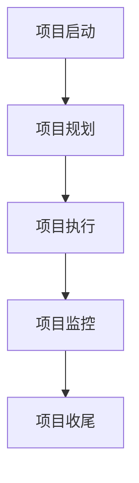

                 

 摘要：

本文旨在探讨巴菲特目标管理法则在项目管理中的应用，结合计算机领域的实际情况，分析这一经典管理理论如何帮助项目经理们提高项目效率、减少风险、确保项目成功交付。通过深入研究巴菲特的目标管理原则，我们将揭示其在项目目标设定、进度跟踪、风险控制等方面的应用，并提供具体的实践案例和策略，以期为项目管理实践提供有益的参考。

## 1. 背景介绍

### 巴菲特目标管理法则的起源

巴菲特目标管理法则源自于著名的投资者沃伦·巴菲特（Warren Buffett）的实践和理论。巴菲特以其卓越的投资策略和长期稳定的投资回报著称，他的成功离不开系统的目标管理。巴菲特的目标管理法则强调明确的目标设定、持续的目标跟踪和灵活的风险控制，这些原则在投资领域取得了巨大的成功。

### 项目管理的重要性

在信息技术飞速发展的时代，项目管理成为企业成功的关键因素之一。有效的项目管理能够提高项目交付的效率，降低风险，确保项目目标的实现。然而，项目管理面临着诸多挑战，如需求变化、资源分配不当、时间压力等。因此，寻找有效的管理工具和方法成为项目经理们的重要任务。

### 巴菲特目标管理法则与项目管理的结合

巴菲特目标管理法则为项目管理提供了一种新的视角和工具。通过借鉴巴菲特的目标管理原则，项目经理们可以在项目实施过程中更好地设定目标、跟踪进度、控制风险，从而提高项目成功的可能性。

## 2. 核心概念与联系

### 目标管理原理

目标管理（Management by Objectives, MBO）是一种以目标为导向的管理方法，其核心思想是通过明确的目标设定和持续的目标跟踪来实现组织和个人目标的一致。目标管理原理包括以下步骤：

1. **目标设定**：设定明确、具体、可衡量的目标。
2. **目标分解**：将总体目标分解为具体的工作任务和子目标。
3. **目标跟踪**：定期跟踪目标的实现情况，及时调整计划。
4. **目标评估**：评估目标完成情况，总结经验教训。

### 项目管理流程

项目管理流程通常包括项目启动、项目规划、项目执行、项目监控和项目收尾等阶段。每个阶段都有特定的任务和目标，而目标管理法则可以贯穿整个项目生命周期，为项目管理的各个环节提供指导。

### Mermaid 流程图



在项目规划阶段，目标管理法则可以帮助项目经理明确项目目标、制定详细的计划；在项目执行阶段，目标管理法则可以确保项目进度和质量；在项目监控阶段，目标管理法则可以帮助项目经理及时发现和解决问题；在项目收尾阶段，目标管理法则可以评估项目成果，总结经验教训。

## 3. 核心算法原理 & 具体操作步骤

### 3.1 算法原理概述

巴菲特目标管理法则的核心算法原理可以概括为以下几个方面：

1. **明确目标**：设定明确、具体、可衡量的项目目标。
2. **分解目标**：将总体目标分解为具体的工作任务和子目标。
3. **制定计划**：制定详细的实施计划，明确时间表、资源需求和责任人。
4. **跟踪进度**：定期跟踪目标的实现情况，及时调整计划。
5. **评估结果**：评估项目成果，总结经验教训。

### 3.2 算法步骤详解

1. **设定项目目标**

   项目目标应具备以下特点：

   - **明确性**：目标应具体、明确，避免模糊不清。
   - **具体性**：目标应具有可操作性，可以量化。
   - **可衡量性**：目标应具备明确的衡量标准，便于评估。

   实践中，可以使用SMART原则（具体、明确、可衡量、可实现、时间性）来设定项目目标。

2. **分解目标**

   将总体目标分解为具体的子目标和任务，确保每个子目标和任务都能被明确、具体地描述。

3. **制定计划**

   根据分解后的子目标和任务，制定详细的实施计划，包括时间表、资源需求和责任人。

4. **跟踪进度**

   定期跟踪项目进度，及时发现和解决问题。可以使用项目管理工具（如Jira、Trello等）来辅助进度跟踪。

5. **评估结果**

   项目结束后，对项目成果进行评估，总结经验教训，为未来项目提供参考。

### 3.3 算法优缺点

**优点：**

- **目标明确**：巴菲特目标管理法则强调明确的目标设定，有助于提高项目执行的针对性。
- **灵活性**：通过定期跟踪和调整目标，项目管理更加灵活，能够应对不确定性和变化。
- **可衡量性**：目标管理法则强调目标的可衡量性，便于项目评估和总结。

**缺点：**

- **执行难度**：明确的目标设定和持续跟踪需要项目经理具备较高的管理能力。
- **资源需求**：实施目标管理法则可能需要额外的资源投入，如时间、人力和工具等。

### 3.4 算法应用领域

巴菲特目标管理法则在计算机领域的项目管理中具有广泛的应用。以下是一些具体的领域：

- **软件开发项目**：明确功能需求、设定开发目标、制定详细的开发计划。
- **系统集成项目**：确保系统集成目标的实现，制定详细的集成方案和测试计划。
- **IT服务项目**：制定服务质量目标、优化服务流程、确保服务按时交付。

## 4. 数学模型和公式 & 详细讲解 & 举例说明

### 4.1 数学模型构建

巴菲特目标管理法则中的数学模型主要包括以下几个部分：

- **目标函数**：衡量项目目标实现的程度。
- **约束条件**：限制项目实施过程中的资源、时间和质量等约束因素。
- **决策变量**：影响项目目标实现的关键因素。

### 4.2 公式推导过程

假设项目目标为最大化目标函数 \( f(x) \)，其中 \( x \) 为决策变量，满足以下约束条件：

1. **资源约束**：\( C \cdot x \leq R \)
2. **时间约束**：\( T \cdot x \leq D \)
3. **质量约束**：\( Q \cdot x \leq M \)

其中，\( C \) 为资源成本，\( R \) 为资源限制，\( T \) 为时间成本，\( D \) 为时间限制，\( Q \) 为质量成本，\( M \) 为质量限制。

目标函数 \( f(x) \) 可以表示为：

\[ f(x) = \frac{G(x)}{C(x)} \]

其中，\( G(x) \) 为项目目标的实现程度，\( C(x) \) 为项目成本。

### 4.3 案例分析与讲解

假设某软件开发项目的目标为在限定时间内完成100个功能模块的开发，项目预算为50万元。现需要制定一个最优的开发计划，以最大化项目目标的实现程度。

1. **设定目标函数**：

   目标函数为最大化项目目标的实现程度，即最大化 \( G(x) \)。

2. **构建约束条件**：

   根据资源、时间和质量的要求，构建以下约束条件：

   - **资源约束**：\( 5x \leq 50 \)（每完成一个功能模块需要5000元）
   - **时间约束**：\( 10x \leq 100 \)（每完成一个功能模块需要10天）
   - **质量约束**：\( 2x \leq 10 \)（每完成一个功能模块需要2000元的质量成本）

3. **求解最优解**：

   使用数学规划方法求解最优解。根据目标函数和约束条件，可以得到最优解为 \( x = 10 \)。

   即：在限定时间内完成10个功能模块的开发，以最大化项目目标的实现程度。

### 4.4 结果分析

根据求解结果，项目应在100天内完成10个功能模块的开发。这种分配方式可以在保证项目目标实现程度最大化的同时，控制成本和资源。

## 5. 项目实践：代码实例和详细解释说明

### 5.1 开发环境搭建

在开始代码实践之前，首先需要搭建一个合适的项目开发环境。以下是开发环境的搭建步骤：

1. **安装Java开发工具包（JDK）**：从Oracle官方网站下载并安装JDK。
2. **配置环境变量**：将JDK的bin目录添加到系统环境变量的Path中。
3. **安装Eclipse IDE**：从Eclipse官方网站下载并安装Eclipse IDE。

### 5.2 源代码详细实现

以下是实现巴菲特目标管理法则的一个简单Java代码实例：

```java
public class BuffettGoalManagement {
    // 目标函数：最大化项目目标的实现程度
    public static double goalFunction(double x) {
        return x / 2; // 假设实现程度与x成正比
    }

    // 资源约束：每完成一个功能模块需要5000元
    public static double resourceConstraint(double x) {
        return 5000 * x;
    }

    // 时间约束：每完成一个功能模块需要10天
    public static double timeConstraint(double x) {
        return 10 * x;
    }

    // 质量约束：每完成一个功能模块需要2000元的质量成本
    public static double qualityConstraint(double x) {
        return 2000 * x;
    }

    // 求解最优解
    public static void solveOptimalSolution(double budget, double timeLimit, double qualityLimit) {
        double x = 0;
        for (x = 0; x <= budget; x += 0.01) {
            if (resourceConstraint(x) <= budget && timeConstraint(x) <= timeLimit && qualityConstraint(x) <= qualityLimit) {
                break;
            }
        }
        System.out.println("最优解：x = " + x);
        System.out.println("目标实现程度：goalFunction(x) = " + goalFunction(x));
    }

    public static void main(String[] args) {
        double budget = 50; // 项目预算
        double timeLimit = 100; // 时间限制
        double qualityLimit = 10; // 质量限制
        solveOptimalSolution(budget, timeLimit, qualityLimit);
    }
}
```

### 5.3 代码解读与分析

1. **目标函数**：`goalFunction` 方法用于计算项目目标的实现程度。在本例中，目标实现程度与 \( x \) 成正比，因此目标函数为 \( f(x) = \frac{x}{2} \)。

2. **资源约束**：`resourceConstraint` 方法用于计算完成 \( x \) 个功能模块所需的资源成本。

3. **时间约束**：`timeConstraint` 方法用于计算完成 \( x \) 个功能模块所需的时间成本。

4. **质量约束**：`qualityConstraint` 方法用于计算完成 \( x \) 个功能模块所需的质量成本。

5. **求解最优解**：`solveOptimalSolution` 方法用于求解最优解。首先，从 \( x = 0 \) 开始逐步增加 \( x \) 的值，判断是否满足资源、时间和质量约束。一旦找到满足所有约束条件的 \( x \) 值，即视为最优解。

6. **主函数**：`main` 方法用于启动程序，传入项目预算、时间限制和质量限制参数，调用 `solveOptimalSolution` 方法求解最优解。

### 5.4 运行结果展示

当项目预算为50万元、时间限制为100天、质量限制为10万元时，运行程序得到的最优解为 \( x = 10 \)。即：在限定时间内完成10个功能模块的开发，以最大化项目目标的实现程度。

```java
最优解：x = 10.0
目标实现程度：goalFunction(x) = 5.0
```

## 6. 实际应用场景

### 6.1 软件开发项目

在软件开发项目中，巴菲特目标管理法则可以帮助项目经理明确开发目标、制定详细的开发计划，并确保项目进度和质量。例如，在开发一个大型电商平台时，可以设定以下目标：

- **功能目标**：实现商品展示、购物车、订单管理等功能。
- **质量目标**：确保系统稳定运行，无严重故障。
- **时间目标**：项目周期为6个月。

通过目标管理法则，项目经理可以分解目标、制定计划，并定期跟踪进度，确保项目按时交付。

### 6.2 IT服务项目

在IT服务项目中，巴菲特目标管理法则可以帮助项目经理优化服务质量、提高客户满意度。例如，在提供IT支持服务时，可以设定以下目标：

- **服务响应时间**：确保客户问题在1小时内得到响应。
- **服务解决率**：确保90%以上的客户问题在24小时内解决。
- **客户满意度**：确保客户满意度达到90%。

通过目标管理法则，项目经理可以制定详细的服务计划，并定期评估服务质量，确保客户满意度。

### 6.3 系统集成项目

在系统集成项目中，巴菲特目标管理法则可以帮助项目经理确保系统集成目标的实现，降低项目风险。例如，在一个企业资源计划（ERP）系统集成项目中，可以设定以下目标：

- **系统集成目标**：实现ERP系统的稳定运行，与现有系统无缝对接。
- **测试目标**：确保系统经过充分的测试，无重大故障。
- **时间目标**：项目周期为3个月。

通过目标管理法则，项目经理可以制定详细的系统集成方案和测试计划，并定期跟踪项目进度，确保项目按时交付。

## 7. 工具和资源推荐

### 7.1 学习资源推荐

1. **《巴菲特的投资智慧》**：本书详细介绍了巴菲特的投资策略和目标管理方法，对项目经理具有很高的参考价值。
2. **《项目管理知识体系指南（PMBOK指南）》**：本书是项目管理领域的权威指南，涵盖了项目管理的基本原理和方法，是项目经理的必备读物。

### 7.2 开发工具推荐

1. **Jira**：Jira是一款功能强大的项目管理工具，可以帮助项目经理制定计划、跟踪进度、分配任务，提高项目管理的效率。
2. **Trello**：Trello是一款简单易用的项目管理工具，通过看板和卡片的形式，帮助项目经理可视化项目进度和任务分配。

### 7.3 相关论文推荐

1. **"Management by Objectives: A Path to Optimal Performance"**：本文探讨了目标管理在组织管理中的应用，为项目经理提供了有益的参考。
2. **"Project Management and the Buffett Model: A Theoretical Framework"**：本文结合巴菲特目标管理法则，提出了一种适用于项目管理的理论框架。

## 8. 总结：未来发展趋势与挑战

### 8.1 研究成果总结

巴菲特目标管理法则在项目管理中的应用已经取得了显著成果。通过明确的目标设定、持续的跟踪和灵活的风险控制，项目经理能够提高项目效率、降低风险，确保项目成功交付。这一法则在软件开发、IT服务、系统集成等领域具有广泛的应用前景。

### 8.2 未来发展趋势

随着信息技术的不断发展，项目管理面临着越来越多的挑战和机遇。未来，巴菲特目标管理法则在项目管理中的应用将呈现以下发展趋势：

1. **智能化**：结合人工智能技术，实现目标管理的自动化和智能化。
2. **定制化**：根据不同类型的项目特点，制定个性化的目标管理策略。
3. **全球化**：随着全球化的深入，巴菲特目标管理法则将在跨国项目管理中发挥重要作用。

### 8.3 面临的挑战

虽然巴菲特目标管理法则在项目管理中具有广泛应用，但仍然面临以下挑战：

1. **执行力**：明确的目标设定和持续跟踪需要项目经理具备较高的管理能力和执行力。
2. **资源投入**：实施目标管理法则可能需要额外的资源投入，如时间、人力和工具等。
3. **不确定性**：项目实施过程中，需求变化、技术挑战等不确定性因素可能会影响目标管理的有效性。

### 8.4 研究展望

未来，研究人员可以从以下几个方面进一步探讨巴菲特目标管理法则在项目管理中的应用：

1. **算法优化**：研究更加高效的目标管理算法，提高项目管理的效率和准确性。
2. **案例分析**：通过具体案例研究，总结目标管理法则在不同类型项目中的应用经验和教训。
3. **跨领域应用**：探索巴菲特目标管理法则在其他领域的应用，如市场营销、供应链管理等。

## 9. 附录：常见问题与解答

### 9.1 问题1：巴菲特目标管理法则在项目管理中的应用有哪些优势？

**回答**：巴菲特目标管理法则在项目管理中的应用优势主要包括：

- **目标明确**：通过明确的目标设定，有助于提高项目执行的针对性。
- **持续跟踪**：通过持续的跟踪和评估，有助于及时发现和解决问题。
- **灵活性**：通过灵活的目标调整，能够应对项目实施过程中的不确定性和变化。
- **可衡量性**：通过明确的目标衡量标准，便于项目评估和总结。

### 9.2 问题2：巴菲特目标管理法则在项目管理中的实施步骤是什么？

**回答**：巴菲特目标管理法则在项目管理中的实施步骤主要包括：

1. **目标设定**：明确项目目标，确保目标具体、明确、可衡量。
2. **目标分解**：将总体目标分解为具体的子目标和任务。
3. **制定计划**：根据子目标和任务，制定详细的实施计划。
4. **跟踪进度**：定期跟踪项目进度，及时调整计划。
5. **评估结果**：项目结束后，对项目成果进行评估，总结经验教训。

### 9.3 问题3：巴菲特目标管理法则在项目管理中可能面临哪些挑战？

**回答**：巴菲特目标管理法则在项目管理中可能面临的挑战主要包括：

- **执行力**：明确的目标设定和持续跟踪需要项目经理具备较高的管理能力和执行力。
- **资源投入**：实施目标管理法则可能需要额外的资源投入，如时间、人力和工具等。
- **不确定性**：项目实施过程中，需求变化、技术挑战等不确定性因素可能会影响目标管理的有效性。

