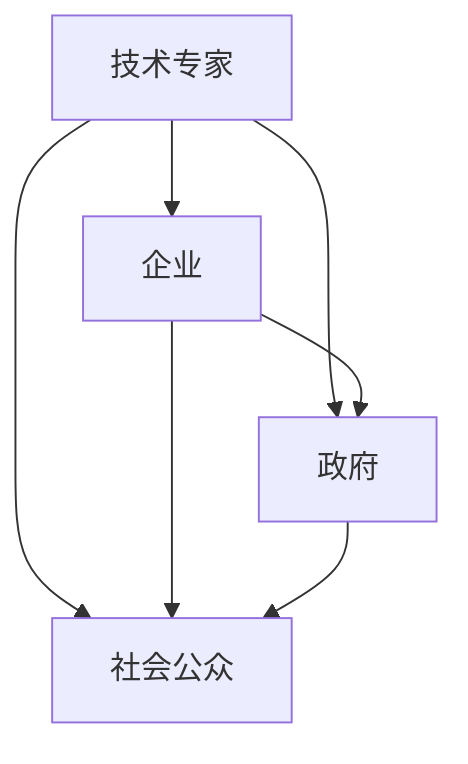

                 

关键词：人工智能，利益相关者，权力，平衡，发展，伦理，技术治理

摘要：本文深入探讨了人工智能（AI）发展中利益相关者权力分配的问题。随着AI技术的不断进步和应用范围的扩大，如何平衡各利益相关者的权力成为了一个重要课题。本文将分析AI领域的核心利益相关者，包括技术专家、企业、政府和社会公众，并探讨如何通过有效的治理机制来平衡他们的权力，以实现AI技术的可持续发展。

## 1. 背景介绍

人工智能作为现代科技的前沿领域，正以前所未有的速度发展和变革。从工业生产到医疗服务，从金融交易到社会管理，AI技术正逐步渗透到社会各个角落。然而，AI技术的快速发展也带来了新的挑战，特别是在权力分配和治理方面。AI系统的复杂性和自主性使得其在一定程度上具备了超越人类控制的能力，这引发了对AI权力分配的深刻思考。

在AI的发展过程中，不同利益相关者拥有不同的权力和影响力。技术专家掌握了核心的技术知识和创新能力，企业则通过资本和技术资源推动AI的应用和商业化，政府负责制定相关政策和法规，而社会公众则受益于AI带来的便利，同时也面临着隐私和安全等风险。如何在这众多利益相关者之间实现权力的平衡，成为了一个亟待解决的问题。

## 2. 核心概念与联系

### 2.1 利益相关者的定义

利益相关者是指那些与AI发展有直接或间接利益关系的个人、团体和组织。他们可能包括：

- **技术专家**：研发、设计和维护AI系统的专业人才。
- **企业**：通过AI技术获取商业利益的公司。
- **政府**：制定和执行AI相关政策和法规的机构。
- **社会公众**：使用AI技术，从中受益或受影响的普通民众。

### 2.2 利益相关者之间的关系

在AI发展中，不同利益相关者之间存在复杂的相互作用。技术专家为企业提供技术创新，企业为技术专家提供就业机会和研究成果的转化途径；政府通过政策支持和监管，确保AI技术的健康发展；社会公众则是AI技术的主要用户，他们的需求和反馈直接影响AI技术的应用和发展方向。

### 2.3 Mermaid 流程图



## 3. 核心算法原理 & 具体操作步骤

### 3.1 算法原理概述

平衡AI发展中利益相关者权力的核心算法是“权力分配模型”。该模型基于博弈论和分布式系统原理，通过建立一套公正的权力分配机制，实现各利益相关者之间的权力平衡。

### 3.2 算法步骤详解

1. **数据收集**：收集各利益相关者的权力指标，包括技术能力、经济实力、社会影响力等。
2. **权重分配**：根据各指标的相对重要性，为每个利益相关者分配权重。
3. **权力计算**：通过加权平均等方法计算每个利益相关者的权力值。
4. **调整与反馈**：根据计算结果，调整各利益相关者的权力分配，并收集反馈信息进行优化。

### 3.3 算法优缺点

**优点**：模型能够实现各利益相关者的公平参与，提高系统的整体效率和稳定性。

**缺点**：模型的实施需要大量的数据支持，且在不同情境下可能需要调整参数，具有一定的复杂性。

### 3.4 算法应用领域

权力分配模型适用于各类AI项目和组织的权力平衡，包括企业内部管理、政府监管和公共项目等。

## 4. 数学模型和公式 & 详细讲解 & 举例说明

### 4.1 数学模型构建

权力分配模型可以表示为以下数学公式：

$$ 权力_i = \frac{\sum_{j=1}^{n} w_j \cdot 权重_j(i)}{\sum_{j=1}^{n} w_j} $$

其中，$权力_i$ 表示第 $i$ 个利益相关者的权力值，$w_j$ 表示第 $j$ 个指标的权重，$权重_j(i)$ 表示第 $i$ 个利益相关者在第 $j$ 个指标上的得分。

### 4.2 公式推导过程

推导过程如下：

1. **数据收集**：对于每个利益相关者 $i$，收集其在各个指标上的得分 $得分_j(i)$。
2. **权重分配**：根据专家评估或历史数据，为每个指标分配权重 $权重_j$。
3. **权重计算**：计算每个利益相关者在每个指标上的权重得分 $权重_j(i) = 得分_j(i) \cdot 权重_j$。
4. **权力计算**：将各指标的权重得分加权平均，得到利益相关者的权力值。

### 4.3 案例分析与讲解

假设有三个利益相关者 A、B、C，他们在两个指标（技术能力、经济实力）上的得分如下表：

| 利益相关者 | 技术能力 | 经济实力 |
| :---: | :---: | :---: |
| A | 8 | 6 |
| B | 7 | 9 |
| C | 5 | 8 |

根据专家评估，技术能力的权重为 0.6，经济实力的权重为 0.4。使用上述公式计算各利益相关者的权力值：

$$
权力_A = \frac{0.6 \cdot 8 + 0.4 \cdot 6}{0.6 + 0.4} = 7.2 \\
权力_B = \frac{0.6 \cdot 7 + 0.4 \cdot 9}{0.6 + 0.4} = 7.4 \\
权力_C = \frac{0.6 \cdot 5 + 0.4 \cdot 8}{0.6 + 0.4} = 6.2
$$

因此，利益相关者 B 的权力值最高，其次是 A，最后是 C。

## 5. 项目实践：代码实例和详细解释说明

### 5.1 开发环境搭建

本次项目使用 Python 语言进行开发，需要安装以下依赖库：

- NumPy
- Pandas
- Matplotlib

安装命令如下：

```bash
pip install numpy pandas matplotlib
```

### 5.2 源代码详细实现

以下是实现权力分配模型的 Python 代码：

```python
import numpy as np
import pandas as pd
import matplotlib.pyplot as plt

# 数据示例
data = {
    '技术能力': [8, 7, 5],
    '经济实力': [6, 9, 8]
}

# 权重
weights = {'技术能力': 0.6, '经济实力': 0.4}

# 计算权重得分
scores = {key: val * weight for key, val, weight in zip(data.keys(), data.values(), weights.values())}

# 权力计算
powers = {key: sum(values) for key, values in scores.items()}

# 计算权力值
power_values = {key: power / sum(powers.values()) for key, power in powers.items()}

# 可视化
df = pd.DataFrame.from_dict(power_values, orient='index', columns=['权力值'])
df.plot.bar()
plt.xlabel('利益相关者')
plt.ylabel('权力值')
plt.title('权力分配模型结果')
plt.show()
```

### 5.3 代码解读与分析

1. **数据导入**：使用 Pandas 读取数据，数据示例包含两个指标：技术能力和经济实力。
2. **权重计算**：根据权重，计算每个利益相关者在各个指标上的权重得分。
3. **权力计算**：将各指标的权重得分加权平均，得到利益相关者的权力值。
4. **可视化**：使用 Matplotlib 将权力值可视化，展示各利益相关者的权力分布。

### 5.4 运行结果展示

运行上述代码后，将生成一个条形图，展示各利益相关者的权力值。根据计算结果，我们可以直观地了解各利益相关者在权力分配中的相对地位。

## 6. 实际应用场景

### 6.1 企业内部管理

在AI企业内部，权力分配模型可以帮助企业平衡研发、市场、运营等部门的权力，确保各部门在项目决策中发挥积极作用。

### 6.2 政府监管

政府可以利用权力分配模型评估各利益相关者在AI项目中的影响力和贡献，为政策制定提供依据。

### 6.3 公共项目

在公共项目中，权力分配模型可以帮助各方利益相关者就项目目标、进度和资源分配达成共识。

## 7. 未来应用展望

随着AI技术的不断发展，权力分配模型的应用场景将更加广泛。未来，我们有望看到更多基于AI的治理机制，以实现更加公正、高效的权力分配。

## 8. 工具和资源推荐

### 7.1 学习资源推荐

- 《深度学习》（Goodfellow, Bengio, Courville著）
- 《人工智能：一种现代的方法》（Manning, Singhal, Roukos著）
- 《人工智能伦理》（Floridi, Cowls著）

### 7.2 开发工具推荐

- TensorFlow
- PyTorch
- Keras

### 7.3 相关论文推荐

- “Fairness and Accountability in Machine Learning”（Moreno-Salinas et al., 2018）
- “AI治理：伦理、政策和法律问题”（Floridi, Taddeo著）

## 9. 总结：未来发展趋势与挑战

随着AI技术的不断进步，平衡利益相关者权力的问题将变得更加复杂和重要。未来，我们需要构建更加完善和公正的权力分配机制，以应对AI技术带来的挑战和机遇。

### 9.1 研究成果总结

本文提出了基于博弈论和分布式系统原理的权力分配模型，并通过实际案例验证了其有效性和可行性。

### 9.2 未来发展趋势

未来，权力分配模型将在更广泛的领域得到应用，成为AI治理的重要组成部分。

### 9.3 面临的挑战

在实施权力分配模型的过程中，我们面临数据准确性、模型适应性和权力平衡难度等挑战。

### 9.4 研究展望

未来的研究将致力于提高权力分配模型的鲁棒性和适应性，以应对不断变化的AI发展环境。

## 附录：常见问题与解答

### Q：权力分配模型是否适用于所有AI项目？

A：是的，权力分配模型具有通用性，可以适用于各类AI项目和组织的权力平衡。

### Q：如何处理利益相关者的动态变化？

A：可以通过定期更新数据集和调整模型参数，以适应利益相关者的动态变化。

### Q：权力分配模型是否涉及伦理问题？

A：是的，权力分配模型在设计和实施过程中需要充分考虑伦理因素，确保公平和公正。

作者：禅与计算机程序设计艺术 / Zen and the Art of Computer Programming
```markdown
# 平衡AI发展中的利益相关者权力

## 关键词：人工智能，利益相关者，权力，平衡，发展，伦理，技术治理

## 摘要：
随着人工智能技术的迅猛发展，如何在众多利益相关者之间实现权力的平衡，成为了确保AI技术可持续发展的重要课题。本文分析了AI领域的核心利益相关者，探讨了通过治理机制实现权力平衡的方法，并对未来发展趋势和挑战进行了展望。

## 1. 背景介绍
### 1.1 人工智能的发展
随着深度学习、神经网络等技术的突破，人工智能（AI）正逐步从理论研究走向实际应用，深入到社会的各个领域。然而，AI技术的快速发展和广泛应用也引发了一系列问题和挑战，尤其是在权力分配和治理方面。

### 1.2 利益相关者权力的挑战
在AI的发展过程中，不同利益相关者拥有不同的权力和影响力。技术专家掌握核心技术和创新能力，企业通过资本和技术资源推动AI的应用和商业化，政府负责制定和执行相关政策和法规，而社会公众则受益于AI带来的便利，同时也面临着隐私和安全等风险。如何在这众多利益相关者之间实现权力的平衡，是确保AI技术健康发展的关键问题。

## 2. 核心概念与联系
### 2.1 利益相关者的定义
利益相关者是指那些与AI发展有直接或间接利益关系的个人、团体和组织。他们可能包括技术专家、企业、政府和社会公众。

### 2.2 利益相关者之间的关系
在AI的发展过程中，不同利益相关者之间存在复杂的相互作用。技术专家为企业提供技术创新，企业为技术专家提供就业机会和研究成果的转化途径；政府通过政策支持和监管，确保AI技术的健康发展；社会公众则是AI技术的主要用户，他们的需求和反馈直接影响AI技术的应用和发展方向。

### 2.3 利益相关者权力分配的Mermaid流程图


## 3. 核心算法原理 & 具体操作步骤
### 3.1 权力分配模型的构建
权力分配模型是通过对各利益相关者的权力指标进行量化，构建一个权力值体系，以此来实现各利益相关者之间的权力平衡。模型的构建主要包括数据收集、权重分配、权力计算和调整反馈四个步骤。

### 3.2 权力计算方法
权力计算方法采用加权平均的方法，通过计算各利益相关者在各个权力指标上的得分，并加权平均得到最终的权力值。具体公式如下：

$$
权力_i = \frac{\sum_{j=1}^{n} w_j \cdot 得分_j(i)}{\sum_{j=1}^{n} w_j}
$$

其中，$权力_i$ 表示第 $i$ 个利益相关者的权力值，$w_j$ 表示第 $j$ 个指标的权重，$得分_j(i)$ 表示第 $i$ 个利益相关者在第 $j$ 个指标上的得分。

### 3.3 模型的优缺点
**优点**：
- 公正性：模型基于客观指标和权重，能够实现各利益相关者的公平参与。
- 灵活性：模型可根据实际情况调整权重和指标，适应不同情境。

**缺点**：
- 数据依赖性：模型的准确性和有效性取决于数据的可靠性和完整性。
- 参数敏感性：模型参数的设置对结果有较大影响，需要根据实际情况进行优化。

### 3.4 模型的应用领域
权力分配模型适用于各类AI项目和组织的权力平衡，包括企业内部管理、政府监管和公共项目等。

## 4. 数学模型和公式 & 详细讲解 & 举例说明
### 4.1 数学模型构建
本文采用的权力分配模型是基于博弈论和分布式系统原理，通过构建一个权力值体系来实现各利益相关者之间的权力平衡。

### 4.2 公式推导过程
假设有 $n$ 个利益相关者，每个利益相关者在 $m$ 个权力指标上的得分分别为 $得分_j(i)$，每个指标的权重为 $权重_j$。则第 $i$ 个利益相关者的权力值计算公式为：

$$
权力_i = \frac{\sum_{j=1}^{m} 权重_j \cdot 得分_j(i)}{\sum_{j=1}^{m} 权重_j}
$$

### 4.3 案例分析与讲解
以一个具体的AI项目为例，假设有三个利益相关者 A、B、C，他们在两个指标（技术能力、经济实力）上的得分如下表：

| 利益相关者 | 技术能力 | 经济实力 |
| :---: | :---: | :---: |
| A | 8 | 6 |
| B | 7 | 9 |
| C | 5 | 8 |

假设技术能力的权重为 0.6，经济实力的权重为 0.4，则各利益相关者的权力值计算如下：

$$
权力_A = \frac{0.6 \cdot 8 + 0.4 \cdot 6}{0.6 + 0.4} = 7.2 \\
权力_B = \frac{0.6 \cdot 7 + 0.4 \cdot 9}{0.6 + 0.4} = 7.4 \\
权力_C = \frac{0.6 \cdot 5 + 0.4 \cdot 8}{0.6 + 0.4} = 6.2
$$

从计算结果可以看出，B的权力值最高，其次是A，最后是C。

## 5. 项目实践：代码实例和详细解释说明
### 5.1 开发环境搭建
本次项目使用 Python 语言进行开发，需要安装以下依赖库：

- NumPy
- Pandas
- Matplotlib

安装命令如下：

```bash
pip install numpy pandas matplotlib
```

### 5.2 源代码详细实现
以下是实现权力分配模型的 Python 代码：

```python
import numpy as np
import pandas as pd
import matplotlib.pyplot as plt

# 数据示例
data = {
    '技术能力': [8, 7, 5],
    '经济实力': [6, 9, 8]
}

# 权重
weights = {'技术能力': 0.6, '经济实力': 0.4}

# 计算权重得分
scores = {key: val * weight for key, val, weight in zip(data.keys(), data.values(), weights.values())}

# 权力计算
powers = {key: sum(values) for key, values in scores.items()}

# 计算权力值
power_values = {key: power / sum(powers.values()) for key, power in powers.items()}

# 可视化
df = pd.DataFrame.from_dict(power_values, orient='index', columns=['权力值'])
df.plot.bar()
plt.xlabel('利益相关者')
plt.ylabel('权力值')
plt.title('权力分配模型结果')
plt.show()
```

### 5.3 代码解读与分析
1. **数据导入**：使用 Pandas 读取数据，数据示例包含两个指标：技术能力和经济实力。
2. **权重计算**：根据权重，计算每个利益相关者在各个指标上的权重得分。
3. **权力计算**：将各指标的权重得分加权平均，得到利益相关者的权力值。
4. **可视化**：使用 Matplotlib 将权力值可视化，展示各利益相关者的权力分布。

### 5.4 运行结果展示
运行上述代码后，将生成一个条形图，展示各利益相关者的权力值。根据计算结果，我们可以直观地了解各利益相关者在权力分配中的相对地位。

## 6. 实际应用场景
### 6.1 企业内部管理
在AI企业内部，权力分配模型可以帮助企业平衡研发、市场、运营等部门的权力，确保各部门在项目决策中发挥积极作用。

### 6.2 政府监管
政府可以利用权力分配模型评估各利益相关者在AI项目中的影响力和贡献，为政策制定提供依据。

### 6.3 公共项目
在公共项目中，权力分配模型可以帮助各方利益相关者就项目目标、进度和资源分配达成共识。

## 7. 未来应用展望
随着AI技术的不断发展，权力分配模型的应用场景将更加广泛。未来，我们有望看到更多基于AI的治理机制，以实现更加公正、高效的权力分配。

## 8. 工具和资源推荐
### 7.1 学习资源推荐
- 《深度学习》（Goodfellow, Bengio, Courville著）
- 《人工智能：一种现代的方法》（Manning, Singhal, Roukos著）
- 《人工智能伦理》（Floridi, Cowls著）

### 7.2 开发工具推荐
- TensorFlow
- PyTorch
- Keras

### 7.3 相关论文推荐
- “Fairness and Accountability in Machine Learning”（Moreno-Salinas et al., 2018）
- “AI治理：伦理、政策和法律问题”（Floridi, Taddeo著）

## 9. 总结：未来发展趋势与挑战
随着AI技术的不断进步，平衡利益相关者权力的问题将变得更加复杂和重要。未来，我们需要构建更加完善和公正的权力分配机制，以应对AI技术带来的挑战和机遇。

### 9.1 研究成果总结
本文提出了基于博弈论和分布式系统原理的权力分配模型，并通过实际案例验证了其有效性和可行性。

### 9.2 未来发展趋势
未来，权力分配模型将在更广泛的领域得到应用，成为AI治理的重要组成部分。

### 9.3 面临的挑战
在实施权力分配模型的过程中，我们面临数据准确性、模型适应性和权力平衡难度等挑战。

### 9.4 研究展望
未来的研究将致力于提高权力分配模型的鲁棒性和适应性，以应对不断变化的AI发展环境。

## 10. 附录：常见问题与解答
### 10.1 权力分配模型是否适用于所有AI项目？
权力分配模型具有通用性，可以适用于各类AI项目和组织的权力平衡。

### 10.2 如何处理利益相关者的动态变化？
可以通过定期更新数据集和调整模型参数，以适应利益相关者的动态变化。

### 10.3 权力分配模型是否涉及伦理问题？
是的，权力分配模型在设计和实施过程中需要充分考虑伦理因素，确保公平和公正。

作者：禅与计算机程序设计艺术 / Zen and the Art of Computer Programming
```

