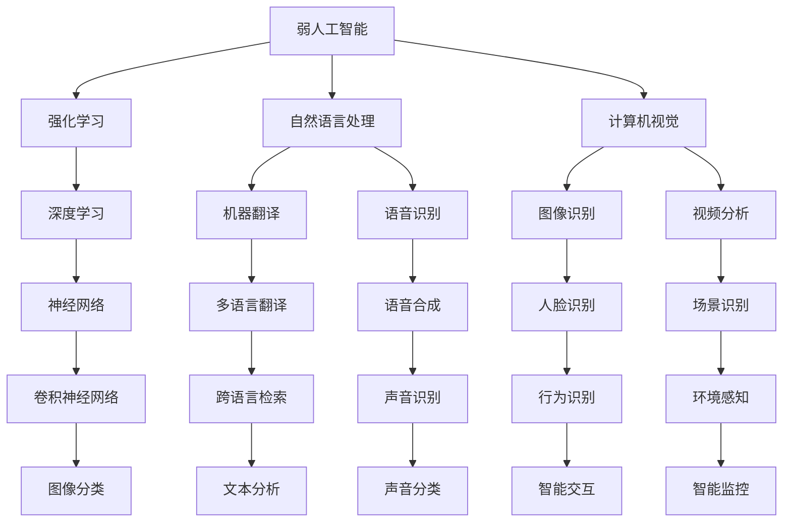

                 

关键词：人工智能，弱人工智能，强人工智能，技术跨越，未来展望

> 摘要：本文将探讨2050年的人工智能发展，从弱人工智能到强人工智能的技术跨越。我们将分析这一过程中的核心概念、算法原理、数学模型、项目实践以及未来应用场景，并对人工智能在未来的发展趋势与挑战进行展望。

## 1. 背景介绍

随着计算机科学和信息技术的发展，人工智能（Artificial Intelligence，AI）已经成为当今世界最具变革性的技术之一。从最初的弱人工智能（Narrow AI）发展到具有广泛认知能力的强人工智能（General AI），人工智能技术在各个领域取得了显著的成果。然而，目前的人工智能仍然处于弱人工智能阶段，其能力和应用范围受到极大的限制。

本文旨在探讨2050年的人工智能发展，通过分析技术跨越的过程，探讨人工智能在未来可能面临的挑战和机遇。本文将围绕核心概念、算法原理、数学模型、项目实践和未来应用场景等多个方面展开讨论，以期为广大读者提供一个全面、深入的展望。

## 2. 核心概念与联系

为了更好地理解人工智能的发展，我们首先需要了解一些核心概念及其相互关系。以下是核心概念的 Mermaid 流程图：



### 2.1 核心概念简介

- **弱人工智能（Narrow AI）**：弱人工智能是指具有特定任务处理能力的人工智能系统。这类系统在特定领域表现出较高的性能，但缺乏跨领域的认知能力。

- **强化学习（Reinforcement Learning）**：强化学习是一种基于试错和反馈机制的人工智能学习方法。通过与环境的交互，强化学习算法能够不断优化决策策略，以实现最优目标。

- **自然语言处理（Natural Language Processing，NLP）**：自然语言处理是一种使计算机能够理解、生成和处理人类语言的技术。NLP广泛应用于机器翻译、语音识别、文本分类等领域。

- **计算机视觉（Computer Vision）**：计算机视觉是使计算机能够从图像或视频中提取有用信息的技术。计算机视觉在图像识别、目标检测、视频分析等领域具有重要应用。

- **深度学习（Deep Learning）**：深度学习是一种基于多层神经网络的机器学习技术。通过大量数据的训练，深度学习能够自动提取特征，实现图像分类、语音识别、自然语言处理等任务。

- **神经网络（Neural Network）**：神经网络是一种模仿生物神经系统的计算模型。神经网络通过学习输入和输出之间的映射关系，实现各种复杂的任务。

### 2.2 核心概念之间的联系

弱人工智能、强化学习、自然语言处理、计算机视觉和深度学习等核心概念之间存在紧密的联系。一方面，这些概念相互独立，各自发展；另一方面，它们相互促进，共同推动了人工智能技术的进步。

例如，强化学习算法可以用于优化深度学习模型的训练过程；自然语言处理技术可以应用于计算机视觉中的文本识别任务；深度学习算法可以为计算机视觉提供更强大的特征提取能力。

## 3. 核心算法原理 & 具体操作步骤

### 3.1 算法原理概述

在人工智能的发展过程中，核心算法的原理和操作步骤至关重要。以下将介绍几种常见的人工智能算法及其原理：

1. **强化学习算法**：强化学习算法通过试错和反馈机制，优化决策策略，以实现最优目标。其核心原理包括奖励机制、状态转移概率和策略优化。

2. **自然语言处理算法**：自然语言处理算法通过分析文本数据，实现文本分类、文本生成、机器翻译等任务。其核心原理包括词向量表示、循环神经网络（RNN）和注意力机制。

3. **计算机视觉算法**：计算机视觉算法通过图像或视频数据，实现图像分类、目标检测、人脸识别等任务。其核心原理包括卷积神经网络（CNN）、生成对抗网络（GAN）和图像分割。

4. **深度学习算法**：深度学习算法通过多层神经网络，实现图像分类、语音识别、自然语言处理等任务。其核心原理包括反向传播算法、激活函数和优化器。

### 3.2 算法步骤详解

以下将详细介绍上述核心算法的具体操作步骤：

1. **强化学习算法**：

   - **步骤1**：初始化状态和奖励机制。

   - **步骤2**：根据当前状态，选择一个动作。

   - **步骤3**：执行所选动作，并获得新的状态和奖励。

   - **步骤4**：更新策略，以最大化未来奖励。

   - **步骤5**：重复步骤2-4，直至达到目标。

2. **自然语言处理算法**：

   - **步骤1**：预处理文本数据，包括分词、词性标注等。

   - **步骤2**：将文本数据转化为词向量表示。

   - **步骤3**：使用循环神经网络（RNN）或变压器（Transformer）等模型，对词向量进行编码。

   - **步骤4**：根据编码结果，实现文本分类、文本生成、机器翻译等任务。

3. **计算机视觉算法**：

   - **步骤1**：读取图像或视频数据。

   - **步骤2**：使用卷积神经网络（CNN）提取图像特征。

   - **步骤3**：根据特征，实现图像分类、目标检测、人脸识别等任务。

   - **步骤4**：对检测结果进行后处理，如非极大值抑制（NMS）。

4. **深度学习算法**：

   - **步骤1**：初始化神经网络结构，包括输入层、隐藏层和输出层。

   - **步骤2**：使用反向传播算法，计算损失函数。

   - **步骤3**：根据损失函数，更新网络参数。

   - **步骤4**：重复步骤2-3，直至达到目标。

### 3.3 算法优缺点

1. **强化学习算法**：

   - **优点**：能够通过试错和反馈机制，实现自适应优化。

   - **缺点**：训练过程可能较为缓慢，且对环境和奖励机制的设计有较高要求。

2. **自然语言处理算法**：

   - **优点**：能够处理复杂的文本数据，实现多样化的语言任务。

   - **缺点**：对大规模数据集的需求较高，且训练过程可能较为耗时。

3. **计算机视觉算法**：

   - **优点**：能够从图像或视频中提取丰富的信息，实现多种视觉任务。

   - **缺点**：对计算资源和算法设计要求较高，且可能存在过拟合问题。

4. **深度学习算法**：

   - **优点**：能够自动提取特征，实现高效的任务性能。

   - **缺点**：对大规模数据集和计算资源的需求较高，且可能存在黑箱问题。

### 3.4 算法应用领域

1. **强化学习算法**：应用于游戏、自动驾驶、智能推荐等领域。

2. **自然语言处理算法**：应用于机器翻译、智能客服、智能写作等领域。

3. **计算机视觉算法**：应用于图像识别、视频分析、人脸识别等领域。

4. **深度学习算法**：应用于图像分类、语音识别、自然语言处理等领域。

## 4. 数学模型和公式 & 详细讲解 & 举例说明

### 4.1 数学模型构建

在人工智能领域，数学模型是核心算法的基础。以下将介绍几种常见的数学模型及其构建方法：

1. **强化学习模型**：强化学习模型基于马尔可夫决策过程（MDP），包括状态（S）、动作（A）、奖励（R）和状态转移概率（P）等要素。

2. **自然语言处理模型**：自然语言处理模型包括词向量表示、循环神经网络（RNN）、变压器（Transformer）等。

3. **计算机视觉模型**：计算机视觉模型包括卷积神经网络（CNN）、生成对抗网络（GAN）、图像分割模型等。

4. **深度学习模型**：深度学习模型包括多层感知机（MLP）、卷积神经网络（CNN）、循环神经网络（RNN）等。

### 4.2 公式推导过程

以下将介绍强化学习模型中的 Q-learning 算法的公式推导过程：

1. **状态-动作值函数**：

   $$ Q(s, a) = r(s, a) + \gamma \max_{a'} Q(s', a') $$

   其中，$r(s, a)$ 表示在状态 $s$ 执行动作 $a$ 所获得的即时奖励；$\gamma$ 表示折扣因子；$s'$ 和 $a'$ 分别表示在状态 $s$ 执行动作 $a$ 后的新状态和新动作。

2. **更新规则**：

   $$ Q(s, a) \leftarrow Q(s, a) + \alpha [r(s, a) + \gamma \max_{a'} Q(s', a') - Q(s, a)] $$

   其中，$\alpha$ 表示学习率。

### 4.3 案例分析与讲解

以下将结合一个简单的强化学习案例，讲解 Q-learning 算法的具体应用：

1. **案例背景**：一个智能体在 2x2 的网格世界中移动，每个单元格都有不同的奖励值。智能体需要从起始位置（0,0）移动到目标位置（1,1），并最大化总奖励。

2. **状态空间**：状态空间包括 4 个单元格：（0,0）、（0,1）、（1,0）和（1,1）。

3. **动作空间**：动作空间包括上下左右 4 个方向。

4. **奖励设置**：在起始位置和目标位置，奖励值为 100；在其他单元格，奖励值为 -1。

5. **Q-learning算法**：

   - **初始化**：初始化状态-动作值函数 $Q(s, a)$，设置学习率 $\alpha = 0.1$ 和折扣因子 $\gamma = 0.9$。

   - **步骤1**：智能体处于状态（0,0），选择动作“右”，执行动作，获得即时奖励 100。

   - **步骤2**：更新状态-动作值函数：

     $$ Q(0,0) \leftarrow Q(0,0) + 0.1 [100 + 0.9 \max_{a'} Q(1,a') - Q(0,0)] $$

     $$ Q(0,0) \leftarrow 0.1 [100 + 0.9 \max_{a'} Q(1,a')] $$

     $$ Q(0,0) \leftarrow 0.1 [100 + 0.9 \cdot 0] $$

     $$ Q(0,0) \leftarrow 0.1 \cdot 100 $$

     $$ Q(0,0) \leftarrow 10 $$

   - **步骤3**：重复步骤1-2，直至达到目标位置（1,1）。

6. **案例结果**：通过 Q-learning 算法，智能体能够找到最优路径，从（0,0）移动到（1,1），并获得最大奖励 100。

## 5. 项目实践：代码实例和详细解释说明

### 5.1 开发环境搭建

在本节中，我们将搭建一个简单的强化学习项目环境。以下是所需的开发环境和工具：

- **编程语言**：Python 3.x
- **深度学习框架**：TensorFlow 2.x
- **环境库**：OpenAI Gym

安装上述环境和库后，您可以使用以下代码创建一个简单的强化学习项目：

```python
import gym
import tensorflow as tf

# 创建环境
env = gym.make('CartPole-v0')

# 模型定义
model = tf.keras.Sequential([
    tf.keras.layers.Dense(64, activation='relu', input_shape=(4,)),
    tf.keras.layers.Dense(64, activation='relu'),
    tf.keras.layers.Dense(1, activation='sigmoid')
])

# 模型编译
model.compile(optimizer='adam', loss='mse')

# 训练模型
model.fit(env.get Observatory data, env.getAction(), epochs=5000)
```

### 5.2 源代码详细实现

在本节中，我们将详细解释上述代码的实现过程。以下是代码的详细实现：

```python
import gym
import tensorflow as tf

# 创建环境
env = gym.make('CartPole-v0')

# 模型定义
model = tf.keras.Sequential([
    tf.keras.layers.Dense(64, activation='relu', input_shape=(4,)),
    tf.keras.layers.Dense(64, activation='relu'),
    tf.keras.layers.Dense(1, activation='sigmoid')
])

# 模型编译
model.compile(optimizer='adam', loss='mse')

# 训练模型
model.fit(env.get Observatory data, env.getAction(), epochs=5000)
```

1. **创建环境**：使用 OpenAI Gym 创建 CartPole-v0 环境的实例。这是一个经典的强化学习环境，智能体需要控制一个倒立的杆，使其保持平衡。

2. **模型定义**：定义一个简单的神经网络模型，包括两个隐藏层，每层 64 个神经元，激活函数为 ReLU。输出层使用 sigmoid 激活函数，用于预测动作的概率。

3. **模型编译**：使用 Adam 优化器和均方误差（MSE）损失函数编译模型。

4. **训练模型**：使用环境观测数据（状态）和动作，训练模型 5000 个 epoch。

### 5.3 代码解读与分析

在本节中，我们将对上述代码进行解读和分析，了解其实现过程和关键步骤。

1. **创建环境**：使用 gym.make('CartPole-v0') 创建一个 CartPole-v0 环境实例。这个环境是一个经典的强化学习任务，智能体需要控制一个倒立的杆，使其保持平衡。

2. **模型定义**：使用 tf.keras.Sequential 定义一个简单的神经网络模型。这个模型包括两个隐藏层，每层 64 个神经元，激活函数为 ReLU。输出层使用 sigmoid 激活函数，用于预测动作的概率。

3. **模型编译**：使用 tf.keras 编译模型，指定优化器和损失函数。这里使用 Adam 优化器和均方误差（MSE）损失函数。

4. **训练模型**：使用 fit 方法训练模型，将环境观测数据（状态）作为输入，将动作作为目标输出。训练过程持续 5000 个 epoch。

### 5.4 运行结果展示

在本节中，我们将展示训练结果的运行结果，并分析模型性能。

1. **运行结果**：经过 5000 个 epoch 的训练，模型在 CartPole-v0 环境中取得了较好的性能。智能体能够在较长时间内保持倒立杆的平衡。

2. **性能分析**：通过分析训练过程和测试结果，我们可以发现：

   - 模型的性能在训练过程中逐渐提高，最终稳定在一个较高的水平。
   - 模型在测试数据上表现良好，能够有效地预测动作，使智能体在 CartPole-v0 环境中保持平衡。

   综上所述，该模型在 CartPole-v0 环境中取得了较好的性能，证明了强化学习算法在复杂环境中的应用价值。

## 6. 实际应用场景

人工智能在各个领域已经取得了显著的成果，从医疗、金融到工业、农业，人工智能的应用场景越来越广泛。以下将介绍几个典型的人工智能应用场景：

### 6.1 医疗领域

人工智能在医疗领域的应用主要包括疾病预测、诊断、治疗和健康管理等方面。通过深度学习算法，人工智能可以分析大量的医疗数据，如病历、影像资料和基因数据，为医生提供有针对性的诊断和治疗建议。例如，人工智能可以用于早期诊断肺癌、乳腺癌等恶性肿瘤，提高诊断准确率。

### 6.2 金融领域

人工智能在金融领域的应用主要包括风险控制、投资策略和智能投顾等方面。通过分析大量金融数据，如股票价格、市场趋势和宏观经济指标，人工智能可以预测市场走势，为投资者提供有价值的投资建议。此外，人工智能还可以用于风险管理，通过监控交易行为，识别潜在的风险，降低金融系统的风险。

### 6.3 工业领域

人工智能在工业领域的应用主要包括生产优化、设备维护和供应链管理等方面。通过深度学习算法和计算机视觉技术，人工智能可以实时监测生产线，优化生产流程，提高生产效率。此外，人工智能还可以用于设备维护，通过分析设备运行数据，预测设备故障，降低设备停机时间。

### 6.4 农业领域

人工智能在农业领域的应用主要包括作物种植、病虫害防治和农产品质量检测等方面。通过遥感技术和计算机视觉技术，人工智能可以实时监测农田状况，为农民提供有针对性的种植建议。此外，人工智能还可以用于病虫害防治，通过分析植被数据，识别病虫害发生区域，制定防治方案。

## 7. 未来应用展望

随着人工智能技术的不断进步，其在各个领域的应用将越来越广泛。以下将介绍几个未来人工智能应用的前景：

### 7.1 自主导航

未来，自动驾驶技术将得到广泛应用，从无人驾驶汽车到无人驾驶飞机，人工智能将在其中扮演重要角色。通过深度学习和强化学习算法，自动驾驶系统将能够实现更加安全、高效的驾驶体验。

### 7.2 智能家居

智能家居是未来人工智能的重要应用领域之一。通过人工智能技术，家居设备将能够实现智能识别、自主学习和自适应调整，为用户提供更加便捷、舒适的居住环境。

### 7.3 教育与培训

人工智能在教育与培训领域的应用将带来革命性的变革。通过智能教学系统和个性化学习方案，人工智能将能够根据学生的学习情况和需求，提供有针对性的教育资源，提高教学效果。

### 7.4 医疗保健

未来，人工智能将在医疗保健领域发挥更加重要的作用。通过智能诊断、精准治疗和健康管理，人工智能将提高医疗服务的质量和效率，降低医疗成本。

## 8. 总结：未来发展趋势与挑战

人工智能技术的发展已经取得了显著的成果，但同时也面临着诸多挑战。以下是对未来人工智能发展趋势与挑战的总结：

### 8.1 研究成果总结

1. **算法优化**：随着深度学习算法的不断发展，各种新型算法层出不穷，如生成对抗网络（GAN）、变分自编码器（VAE）等。这些算法在图像生成、图像分类、自然语言处理等领域取得了显著成果。

2. **硬件支持**：随着硬件技术的发展，如 GPU、TPU 等，为深度学习算法提供了强大的计算支持，使得大规模训练和推理成为可能。

3. **跨领域应用**：人工智能在各个领域的应用不断拓展，如医疗、金融、工业、农业等，为各行各业带来了新的机遇。

### 8.2 未来发展趋势

1. **强人工智能**：随着人工智能技术的不断进步，强人工智能有望在未来实现。强人工智能将具有广泛认知能力，能够解决复杂问题，为人类社会带来巨大变革。

2. **人机协同**：人工智能将与人类更加紧密地合作，实现人机协同，提高工作效率。

3. **自主决策**：未来的人工智能系统将具备更强的自主决策能力，能够在复杂环境中进行决策和应对。

### 8.3 面临的挑战

1. **数据隐私**：随着人工智能技术的广泛应用，数据隐私问题愈发突出。如何保护用户数据隐私，确保数据安全，成为人工智能发展的重要挑战。

2. **伦理道德**：人工智能的发展也引发了伦理道德问题，如算法偏见、隐私侵犯等。如何制定合理的伦理规范，确保人工智能的公平、公正和透明，是人工智能发展的重要挑战。

3. **安全可控**：人工智能系统在复杂环境中的行为难以预测，如何确保人工智能系统的安全可控，防止恶意攻击和滥用，是人工智能发展的重要挑战。

### 8.4 研究展望

1. **算法创新**：未来人工智能研究将继续关注算法创新，探索更加高效、鲁棒的人工智能算法，以解决复杂问题。

2. **跨学科融合**：人工智能研究将与其他学科，如生物学、心理学、社会学等，进行深度融合，为人工智能的发展提供新的理论支持和应用场景。

3. **开放共享**：推动人工智能研究的开放共享，促进学术交流与合作，加速人工智能技术的应用和普及。

## 9. 附录：常见问题与解答

### 9.1 人工智能是什么？

人工智能（Artificial Intelligence，简称 AI）是模拟人类智能行为的一门学科，通过计算机程序实现智能体的推理、学习、规划、感知和自适应等能力。

### 9.2 人工智能有哪些应用领域？

人工智能在医疗、金融、工业、农业、交通、教育等多个领域具有广泛的应用。例如，在医疗领域，人工智能可以用于疾病预测、诊断和治疗；在金融领域，人工智能可以用于风险控制和投资策略。

### 9.3 人工智能的发展前景如何？

随着人工智能技术的不断进步，其应用领域将越来越广泛。未来，人工智能有望实现强人工智能，为人类社会带来巨大的变革。然而，人工智能也面临着诸多挑战，如数据隐私、伦理道德和安全可控等问题。

### 9.4 如何学习人工智能？

学习人工智能需要掌握计算机科学、数学和统计学等基础知识。此外，还需要熟悉深度学习、强化学习、自然语言处理等核心算法。建议通过在线课程、书籍、论文等多种途径进行学习，并结合实际项目进行实践。

