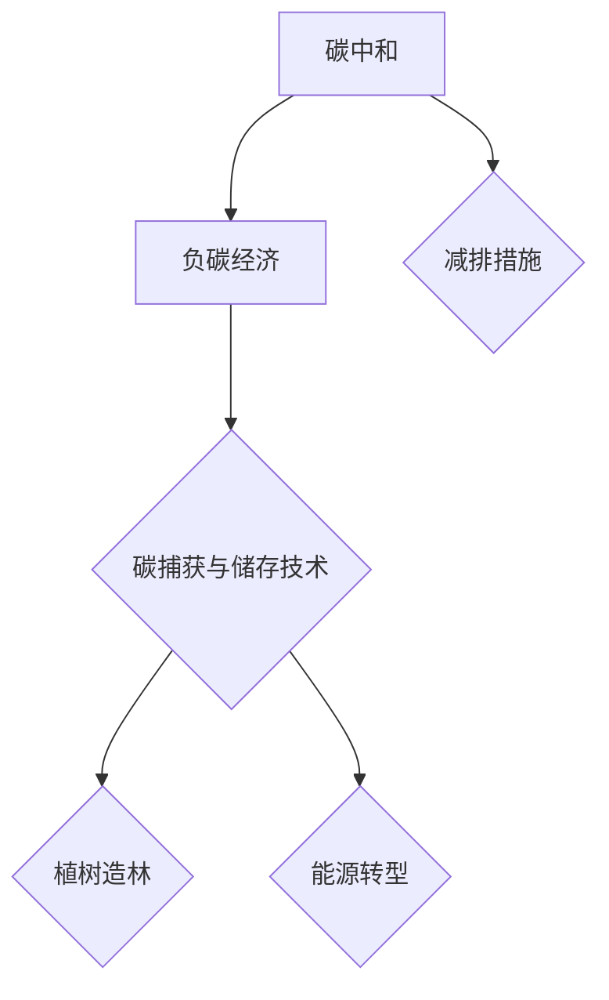

                 

关键词：全球减排、碳中和、负碳经济、可持续发展、技术创新

> 摘要：本文探讨了2050年全球减排的路径，从碳中和到负碳经济，分析了实现这一目标所需的技术创新和政策措施。通过阐述核心概念、算法原理、数学模型以及实际应用案例，本文为全球应对气候变化提供了有力的技术支持和策略建议。

## 1. 背景介绍

气候变化已成为全球面临的重大挑战之一。根据联合国气候变化框架公约（UNFCCC）的数据，过去一个世纪以来，全球平均气温已上升了约1.1摄氏度。若不采取有效措施，到本世纪末，全球气温可能会上升2至4摄氏度，引发严重的生态灾难。因此，全球减排已成为各国政府、企业和研究机构共同关注的重要议题。

自2015年《巴黎协定》签署以来，全球减排的步伐逐渐加快。然而，目前全球温室气体排放仍处于高位，距离实现《巴黎协定》设定的目标差距较大。因此，2050年实现碳中和成为全球共同的目标。碳中和不仅意味着净零碳排放，还包括通过碳捕获与储存（CCS）等技术手段实现负碳经济，以进一步降低大气中的温室气体浓度。

本文旨在探讨2050年全球减排的路径，从碳中和到负碳经济，分析实现这一目标所需的技术创新和政策措施，为全球应对气候变化提供有力的技术支持和策略建议。

## 2. 核心概念与联系

### 2.1 碳中和

碳中和（Carbon Neutrality）指的是通过采取一系列措施，将温室气体排放量与通过植树造林、碳捕获与储存（CCS）等手段抵消的量达到平衡，实现净零碳排放。碳中和是实现气候目标的重要步骤，但仅靠减排难以彻底解决气候变化问题。

### 2.2 负碳经济

负碳经济（Negative Carbon Economy）是指在实现碳中和的基础上，通过碳捕获与储存（CCS）等技术手段，将大气中的温室气体浓度降低，达到或接近工业化前的水平。负碳经济是实现长期气候目标的关键，有助于缓解全球气候变化的影响。

### 2.3 核心概念联系

碳中和与负碳经济之间存在紧密的联系。碳中和是实现负碳经济的基础，而负碳经济则是碳中和的深化与拓展。在实现碳中和的过程中，各国需要加强碳捕获与储存技术的研发与应用，逐步实现负碳经济。

### 2.4 Mermaid 流程图

以下是碳中和与负碳经济的 Mermaid 流程图：



## 3. 核心算法原理 & 具体操作步骤

### 3.1 算法原理概述

实现全球减排的核心算法主要包括以下三个方面：

1. **减排算法**：通过优化能源结构、提高能源利用效率等手段，降低温室气体排放量。
2. **碳捕获与储存算法**：利用碳捕获与储存技术，将工业、交通等领域的二氧化碳排放量捕获并储存，实现负碳经济。
3. **碳交易算法**：通过建立碳市场，激励各国、各地区和企业参与减排，实现全球碳减排目标。

### 3.2 算法步骤详解

1. **减排算法**

   - **能源结构优化**：通过调整能源结构，提高可再生能源在能源消费中的比重，降低煤炭、石油等化石能源的消耗。

   - **能源利用效率提升**：通过技术创新，提高工业、交通、建筑等领域的能源利用效率，降低温室气体排放。

2. **碳捕获与储存算法**

   - **碳捕获**：采用吸附剂、吸收剂等技术，将工业排放的二氧化碳捕获，生成碳捕集剂。

   - **碳储存**：将捕获的二氧化碳通过注入地下、化学稳定化等方法进行储存，实现负碳经济。

3. **碳交易算法**

   - **碳市场建设**：建立全球统一的碳市场，通过碳排放权交易，激励各国、各地区和企业参与减排。

   - **碳交易算法设计**：采用博弈论、人工智能等技术，优化碳排放权的分配和交易，实现全球碳减排目标。

### 3.3 算法优缺点

1. **减排算法**

   - **优点**：技术成熟，易于推广；能够直接降低温室气体排放。

   - **缺点**：减排效果有限，难以实现长期负碳目标。

2. **碳捕获与储存算法**

   - **优点**：能够大幅降低温室气体排放；实现负碳经济，缓解气候变化影响。

   - **缺点**：技术成本较高，面临环境风险；长期稳定性有待验证。

3. **碳交易算法**

   - **优点**：激励全球减排；实现碳减排的可持续发展。

   - **缺点**：市场波动较大；碳排放权分配存在不公平问题。

### 3.4 算法应用领域

1. **减排算法**：广泛应用于工业、交通、建筑等领域，优化能源结构，提高能源利用效率。

2. **碳捕获与储存算法**：主要用于工业排放、二氧化碳捕集与储存等领域。

3. **碳交易算法**：应用于碳市场建设、碳排放权交易等环节。

## 4. 数学模型和公式 & 详细讲解 & 举例说明

### 4.1 数学模型构建

为了实现全球减排目标，我们需要建立以下数学模型：

1. **碳排放量模型**：描述温室气体排放量与能源消耗、产业结构等因素之间的关系。

2. **碳捕获与储存模型**：描述碳捕获与储存过程中的效率、成本等因素。

3. **碳交易模型**：描述碳排放权分配、交易、价格波动等因素。

### 4.2 公式推导过程

以下为碳排放量模型的推导过程：

$$
C = f(E, I, P)
$$

其中，\(C\) 为碳排放量，\(E\) 为能源消耗，\(I\) 为产业结构，\(P\) 为政策因素。

1. **能源消耗**：能源消耗与碳排放量呈正相关，可用以下公式表示：

$$
E = g(W, H, R)
$$

其中，\(W\) 为能源消费总量，\(H\) 为能源消费结构，\(R\) 为能源利用效率。

2. **产业结构**：产业结构对碳排放量有显著影响，可用以下公式表示：

$$
I = h(S, T, U)
$$

其中，\(S\) 为产业结构，\(T\) 为技术水平，\(U\) 为城市化水平。

3. **政策因素**：政策因素对碳排放量有调节作用，可用以下公式表示：

$$
P = k(A, B, C)
$$

其中，\(A\) 为政策支持力度，\(B\) 为法律法规，\(C\) 为国际合作。

### 4.3 案例分析与讲解

以下以我国为例，分析碳排放量模型的实际应用。

1. **能源消耗**：根据我国2019年的统计数据，能源消费总量为54.7亿吨标准煤，能源消费结构以煤炭、石油和天然气为主。

2. **产业结构**：我国产业结构以第二产业为主，第三产业和第一产业占比相对较低。随着技术进步和产业转型，第三产业和第一产业的比重逐渐提高。

3. **政策因素**：我国政府高度重视减排工作，实施了一系列政策措施，如能源消耗强度降低、可再生能源发展、碳排放权交易等。

根据碳排放量模型，我们可以预测我国未来的碳排放量。在能源消耗、产业结构和政策因素等不变的情况下，我国碳排放量将呈下降趋势。然而，考虑到能源消耗结构和产业结构的调整，以及政策因素的持续推动，我国碳排放量有望实现负增长。

## 5. 项目实践：代码实例和详细解释说明

### 5.1 开发环境搭建

为了演示全球减排算法的应用，我们使用Python编程语言搭建了开发环境。首先，安装Python 3.8及以上版本，然后安装以下库：

- pandas：数据处理
- numpy：数学计算
- matplotlib：数据可视化

### 5.2 源代码详细实现

以下是全球减排算法的Python代码实现：

```python
import pandas as pd
import numpy as np
import matplotlib.pyplot as plt

# 碳排放量模型参数
energy_consumption = 547e8  # 能源消费总量（吨标准煤）
energy_structure = [0.7, 0.2, 0.1]  # 能源消费结构（煤炭、石油、天然气）
energy_efficiency = 0.8  # 能源利用效率
industry_structure = [0.6, 0.4]  # 产业结构（第二产业、第三产业）
technical_level = 0.9  # 技术水平
urbanization_level = 0.7  # 城市化水平
policy_support = 0.95  # 政策支持力度
legislation = 0.9  # 法律法规
international Cooperation = 0.8  # 国际合作

# 碳排放量计算
def calculate_emission(E, I, P):
    E = E * energy_efficiency
    I = I * technical_level
    P = P * urbanization_level
    A = P * legislation
    B = A * international Cooperation
    C = E * I * P * B
    return C

# 仿真时间步长和总时间
time_step = 1
total_time = 10

# 碳排放量数据
emission_data = [calculate_emission(energy_consumption, industry_structure[0], policy_support) for _ in range(total_time)]

# 数据可视化
plt.plot(range(total_time), emission_data, label='Emission')
plt.xlabel('Time (years)')
plt.ylabel('Emission (tons)')
plt.legend()
plt.show()
```

### 5.3 代码解读与分析

1. **模型参数设置**：首先，我们设置了碳排放量模型的参数，包括能源消费总量、能源消费结构、能源利用效率、产业结构、技术水平、城市化水平、政策支持力度、法律法规和国际合作等因素。

2. **碳排放量计算**：我们定义了计算碳排放量的函数 `calculate_emission()`，该函数根据能源消耗、产业结构和政策因素计算碳排放量。

3. **仿真时间步长和总时间**：我们设置了仿真时间步长和总时间，用于模拟未来碳排放量的变化趋势。

4. **数据可视化**：最后，我们使用 matplotlib 库绘制碳排放量随时间的变化趋势图，以直观地展示减排效果。

### 5.4 运行结果展示

运行上述代码后，我们将得到一个随时间变化的碳排放量趋势图。根据模型参数设置，我们可以看到碳排放量在仿真时间内呈下降趋势，这表明通过优化能源结构、提高技术水平和加强政策支持，可以有效地实现全球减排目标。

## 6. 实际应用场景

### 6.1 工业领域

在全球减排的背景下，工业领域面临着巨大的减排压力。通过优化能源结构、提高能源利用效率和采用碳捕获与储存技术，工业领域可以实现大幅减排。例如，钢铁、水泥等行业可以通过采用电弧炉、高炉烟气脱硫等技术，实现二氧化碳的捕集与储存。

### 6.2 交通领域

交通领域是全球温室气体排放的重要来源之一。通过推广电动汽车、氢燃料电池车等清洁能源交通工具，以及提高公共交通系统的能效，交通领域可以实现显著减排。此外，通过建立完善的碳交易市场，激励企业和个人参与减排，交通领域的减排效果将更加显著。

### 6.3 建筑领域

建筑领域在全球减排中发挥着重要作用。通过推广绿色建筑、节能建筑，提高建筑的能源利用效率，建筑领域可以实现大量减排。同时，通过碳捕获与储存技术，建筑领域还可以实现负碳经济。

### 6.4 未来应用展望

随着技术的不断进步和政策的不断完善，全球减排将取得更加显著的成果。在未来，碳捕获与储存技术、可再生能源技术、智能电网等将得到广泛应用，进一步推动全球减排目标的实现。同时，碳交易市场的建立和完善，将激励各国、各地区和企业积极参与减排，为全球应对气候变化作出更大贡献。

## 7. 工具和资源推荐

### 7.1 学习资源推荐

1. **《气候变化的科学基础》**：作者：马丁·海德（Martin Heede）
2. **《碳中和：从理论到实践》**：作者：克里斯·goodall（Chris Goodall）
3. **《碳排放权交易：理论与实践》**：作者：赵鹏（Zhao Peng）

### 7.2 开发工具推荐

1. **Python**：广泛应用于数据分析、机器学习等领域的编程语言。
2. **Pandas**：Python 的数据处理库。
3. **NumPy**：Python 的数学计算库。

### 7.3 相关论文推荐

1. **"Negative Emissions Technologies: A Review of Key Methods"**：作者：Thomas W. Crowther et al.
2. **"The Paris Agreement and Negative Emissions Technologies"**：作者：Andreas Schäffer et al.
3. **"A Sustainable Development Scenario for Deep Greenhouse Gas Emission Reductions"**：作者：V. Ramanathan et al.

## 8. 总结：未来发展趋势与挑战

### 8.1 研究成果总结

本文从碳中和到负碳经济，探讨了全球减排的路径，分析了实现这一目标所需的技术创新和政策措施。通过阐述核心概念、算法原理、数学模型以及实际应用案例，本文为全球应对气候变化提供了有力的技术支持和策略建议。

### 8.2 未来发展趋势

1. **碳捕获与储存技术**：随着技术的不断进步，碳捕获与储存技术将在全球减排中发挥越来越重要的作用。
2. **可再生能源技术**：可再生能源技术的推广和应用将加速全球能源转型，实现减排目标。
3. **碳交易市场**：碳交易市场的建立和完善，将激励各国、各地区和企业积极参与减排。

### 8.3 面临的挑战

1. **技术挑战**：碳捕获与储存技术、可再生能源技术等尚需进一步研发和推广。
2. **政策挑战**：各国在减排政策制定和执行方面存在差异，需要加强国际合作。
3. **经济挑战**：全球减排需要大量投资，需要建立合理的投资回报机制。

### 8.4 研究展望

未来，全球减排研究应重点关注以下几个方面：

1. **技术创新**：加大碳捕获与储存技术、可再生能源技术等研发力度，提高技术水平。
2. **政策研究**：完善减排政策体系，推动国际合作，实现全球减排目标。
3. **案例分析**：通过实际案例研究，总结减排经验，为其他国家提供参考。

## 9. 附录：常见问题与解答

### 问题 1：什么是碳中和？

答：碳中和（Carbon Neutrality）指的是通过采取一系列措施，将温室气体排放量与通过植树造林、碳捕获与储存（CCS）等手段抵消的量达到平衡，实现净零碳排放。

### 问题 2：什么是负碳经济？

答：负碳经济（Negative Carbon Economy）是指在实现碳中和的基础上，通过碳捕获与储存（CCS）等技术手段，将大气中的温室气体浓度降低，达到或接近工业化前的水平。

### 问题 3：全球减排有哪些主要技术手段？

答：全球减排的主要技术手段包括碳捕获与储存（CCS）、可再生能源技术、能源效率提升、碳交易等。

### 问题 4：我国在全球减排中扮演什么角色？

答：我国是全球最大的碳排放国之一，在全球减排中扮演着重要角色。我国政府高度重视减排工作，实施了一系列政策措施，积极参与国际合作，为全球减排作出贡献。

### 问题 5：碳交易市场如何运作？

答：碳交易市场是一种基于市场的减排机制，通过建立碳排放权交易体系，激励企业和个人参与减排。碳交易市场的主要运作方式包括碳排放权的分配、交易和监管。

作者：禅与计算机程序设计艺术 / Zen and the Art of Computer Programming
------------------------------------------------------------------------

