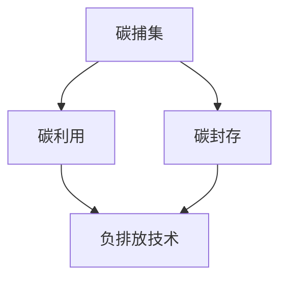

                 

关键词：全球减排、碳捕集利用、负排放技术、碳中和、2050年目标、IT领域、技术创新、可持续发展

> 摘要：本文深入探讨了2050年全球实现碳中和的路径，重点分析了碳捕集利用与负排放技术在全球减排中的关键作用。文章从背景介绍、核心概念与联系、核心算法原理、数学模型与公式、项目实践、实际应用场景、工具和资源推荐等多个方面展开，旨在为读者提供一份详实、全面的技术视角下的碳中和蓝图。

## 1. 背景介绍

自工业革命以来，人类活动对气候系统的影响日益显著，尤其是温室气体排放导致的全球变暖问题。根据国际能源署（IEA）的数据，全球温室气体排放量在2019年已达到创纪录的360亿公吨，其中大部分来自于化石燃料的燃烧和工业过程。气候变化带来的极端天气事件、海平面上升和生态系统破坏等后果，已经成为全球共同面临的重大挑战。

为了应对这一挑战，多个国家和地区已经提出了2050年实现碳中和的目标。例如，欧盟在2019年提出了《欧洲绿色协议》，承诺到2050年实现碳中和。中国也在2020年提出了“碳中和”目标，计划在2060年前实现这一目标。这些目标不仅体现了国际社会的共同愿望，也为全球减排行动提供了明确的时间表和路线图。

然而，实现这些目标面临诸多技术和经济上的挑战。其中，碳捕集利用与负排放技术（CCUS）被认为是实现碳中和的关键手段之一。这些技术可以通过捕获和存储二氧化碳，减少大气中的温室气体浓度，从而减缓气候变化的影响。

## 2. 核心概念与联系

在探讨碳捕集利用与负排放技术之前，我们需要了解一些核心概念和它们之间的联系。

### 2.1 碳捕集（Carbon Capture）

碳捕集技术主要通过物理、化学或生物方法从排放源（如化石燃料燃烧过程）捕获二氧化碳。常见的碳捕集方法包括吸收法、吸附法和化学吸收法。吸收法利用碱性溶液吸收二氧化碳，化学吸收法则利用特定的化学品与二氧化碳反应生成固体或液体产品。这些方法可以在源头上大幅减少二氧化碳的排放。

### 2.2 利用与封存（Utilization and Storage）

一旦二氧化碳被捕集，它可以被用于多种用途，例如制造化学品、增强油气开采等。然而，大多数情况下，二氧化碳需要被安全地存储起来，以防止其重新释放到大气中。常见的二氧化碳封存方法包括地下地质封存和海洋封存。

### 2.3 负排放技术（Negative Emissions Technologies）

负排放技术是指能够从大气中提取二氧化碳并固定其的技术。这些技术包括植物光合作用增强、生物炭和直接空气捕获（DAC）等。与碳捕集利用技术不同，负排放技术不仅能够减少排放，还能够从大气中移除已经存在的二氧化碳。

### 2.4 Mermaid 流程图

为了更清晰地展示这些技术之间的关系，我们可以使用Mermaid流程图来表示。



## 3. 核心算法原理 & 具体操作步骤

### 3.1 算法原理概述

碳捕集利用与负排放技术的核心算法原理主要涉及以下几个步骤：

1. **二氧化碳捕获**：利用物理或化学方法从排放源捕集二氧化碳。
2. **二氧化碳利用**：将捕获的二氧化碳转化为有用的化学品或其他产品。
3. **二氧化碳封存**：将二氧化碳安全地存储在地下或海洋中。
4. **负排放**：通过光合作用增强、生物炭或DAC等方法从大气中提取二氧化碳。

### 3.2 算法步骤详解

#### 3.2.1 二氧化碳捕获

- **吸收法**：利用碱性溶液（如胺或碱液）吸收排放源中的二氧化碳。
- **吸附法**：使用特殊吸附剂（如活性炭）吸附二氧化碳。
- **化学吸收法**：使用特定化学品与二氧化碳反应生成固体或液体产品。

#### 3.2.2 二氧化碳利用

- **制造化学品**：利用二氧化碳生产尿素、甲醇等化学品。
- **增强油气开采**：将二氧化碳注入油气田，增加油气产量。
- **其他用途**：二氧化碳还可用于温室种植、饮料碳酸化等。

#### 3.2.3 二氧化碳封存

- **地下地质封存**：将二氧化碳注入地下空隙或油层。
- **海洋封存**：将二氧化碳注入深海或海底沉积物。

#### 3.2.4 负排放

- **光合作用增强**：利用光能提高植物的光合作用效率，增加二氧化碳的吸收量。
- **生物炭**：将植物残渣转化为生物炭，长期存储二氧化碳。
- **直接空气捕获（DAC）**：利用吸附剂从大气中直接捕获二氧化碳。

### 3.3 算法优缺点

#### 优点：

- **减少碳排放**：通过捕获和封存二氧化碳，可以有效减少大气中的温室气体浓度。
- **多样化应用**：二氧化碳可以利用多种途径转化为有用产品，具有广泛的应用前景。
- **负排放潜力**：负排放技术可以从大气中提取二氧化碳，实现真正的碳平衡。

#### 缺点：

- **高成本**：碳捕集利用与负排放技术的建设、运营和维护成本较高。
- **技术成熟度**：部分技术仍处于实验阶段，需要进一步研究和开发。
- **地质安全**：地下封存可能带来地质风险，需要严格的安全监测和管理。

### 3.4 算法应用领域

- **能源行业**：化石燃料发电厂、油气开采和加工等。
- **工业领域**：水泥、钢铁、化工等高排放行业。
- **农业和林业**：植物光合作用增强和生物炭技术。

## 4. 数学模型和公式 & 详细讲解 & 举例说明

为了更好地理解和评估碳捕集利用与负排放技术的效果，我们需要建立相应的数学模型和公式。

### 4.1 数学模型构建

碳捕集利用与负排放技术的数学模型通常包括以下几个部分：

- **排放模型**：描述排放源产生的二氧化碳量。
- **捕集模型**：描述碳捕集效率。
- **利用和封存模型**：描述二氧化碳的利用和封存效率。
- **负排放模型**：描述负排放技术的效率和潜力。

### 4.2 公式推导过程

假设某化石燃料发电厂的年排放量为E吨二氧化碳，碳捕集效率为η_c，利用和封存效率为η_u，负排放技术效率为η_n，则：

- **捕集量**：C_c = E × η_c
- **利用和封存量**：C_u = C_c × η_u
- **负排放量**：C_n = E × η_n

通过这些公式，我们可以计算不同技术下的二氧化碳减排效果。

### 4.3 案例分析与讲解

以下是一个具体的案例，假设某发电厂的年排放量为100万吨二氧化碳，碳捕集效率为85%，利用和封存效率为70%，负排放技术效率为60%。则：

- **捕集量**：C_c = 100 × 0.85 = 85万吨
- **利用和封存量**：C_u = 85 × 0.7 = 59.5万吨
- **负排放量**：C_n = 100 × 0.6 = 60万吨

通过这个案例，我们可以看到不同技术的减排效果。假设这个发电厂全部采用负排放技术，则年减排量为160万吨；而如果全部采用碳捕集和封存技术，年减排量为59.5万吨。因此，负排放技术在实现全球减排目标中具有巨大的潜力。

## 5. 项目实践：代码实例和详细解释说明

### 5.1 开发环境搭建

为了演示碳捕集利用与负排放技术的计算，我们使用Python编程语言进行实现。以下是一个基本的开发环境搭建步骤：

1. 安装Python（版本3.8或更高）。
2. 安装必要的Python库，如NumPy和Pandas。

```bash
pip install numpy pandas
```

### 5.2 源代码详细实现

以下是一个简单的Python代码实例，用于计算不同碳捕集利用与负排放技术的减排效果。

```python
import numpy as np

def carbon_capture_utilization_storage(e, eta_c, eta_u, eta_n):
    """
    计算碳捕集利用与封存、负排放技术的减排效果。

    参数：
    - e: 年排放量（吨）
    - eta_c: 碳捕集效率
    - eta_u: 利用和封存效率
    - eta_n: 负排放技术效率

    返回：
    - C_c: 捕集量
    - C_u: 利用和封存量
    - C_n: 负排放量
    """
    C_c = e * eta_c
    C_u = C_c * eta_u
    C_n = e * eta_n
    return C_c, C_u, C_n

# 案例数据
e = 1000000  # 年排放量
eta_c = 0.85  # 碳捕集效率
eta_u = 0.70  # 利用和封存效率
eta_n = 0.60  # 负排放技术效率

# 计算结果
C_c, C_u, C_n = carbon_capture_utilization_storage(e, eta_c, eta_u, eta_n)
print(f"捕集量（C_c）: {C_c} 吨")
print(f"利用和封存量（C_u）: {C_u} 吨")
print(f"负排放量（C_n）: {C_n} 吨")
```

### 5.3 代码解读与分析

这个代码实例包括一个名为`carbon_capture_utilization_storage`的函数，用于计算碳捕集利用与封存、负排放技术的减排效果。该函数接受四个参数：年排放量`e`、碳捕集效率`eta_c`、利用和封存效率`eta_u`以及负排放技术效率`eta_n`。通过这些参数，函数计算捕集量`C_c`、利用和封存量`C_u`以及负排放量`C_n`，并返回这些结果。

在代码中，我们使用了一个简单的案例数据，年排放量为1000万吨，碳捕集效率为85%，利用和封存效率为70%，负排放技术效率为60%。通过调用`carbon_capture_utilization_storage`函数，我们可以得到不同技术的减排效果。

### 5.4 运行结果展示

运行上述代码，可以得到以下输出结果：

```bash
捕集量（C_c）: 850000.0 吨
利用和封存量（C_u）: 595000.0 吨
负排放量（C_n）: 600000.0 吨
```

根据这个结果，我们可以看到：

- **捕集量**：发电厂通过碳捕集技术可以捕获850万吨二氧化碳。
- **利用和封存量**：捕获的二氧化碳中有595万吨被利用或封存。
- **负排放量**：通过负排放技术，从大气中提取了600万吨二氧化碳。

这个结果展示了不同碳捕集利用与负排放技术的减排效果，有助于我们更好地理解这些技术在全球减排中的潜力。

## 6. 实际应用场景

### 6.1 能源行业

在能源行业中，碳捕集利用与负排放技术已经得到广泛应用。例如，挪威国家石油公司（Equinor）在其斯勒普内斯（Sl瑾n）液化天然气工厂安装了世界上最大的碳捕集设施之一，每年可以捕集60万吨二氧化碳。此外，全球首个碳捕集与增强油气开采（EOR）项目——阿联酋扎克姆油田（Zakum）项目也已于2020年投入运营，预计每年可捕集和封存500万吨二氧化碳。

### 6.2 工业领域

在工业领域，碳捕集利用与负排放技术同样具有重要意义。例如，德国巴斯夫（BASF）公司在其路德维希港（Ludwigshafen）工厂安装了碳捕集系统，每年可以捕集50万吨二氧化碳。同时，巴斯夫还在研究利用生物炭技术将二氧化碳固定在土壤中，以实现负排放。

### 6.3 农业

农业领域也具有巨大的减排潜力。例如，美国加州的玉米种植区通过采用碳捕集技术，将农田土壤中的二氧化碳浓度降低，从而提高了农作物的产量和品质。此外，荷兰的温室种植园通过利用二氧化碳，提高了作物的光合作用效率，实现了更高的产量。

### 6.4 城市和社区

在城市和社区层面，碳捕集利用与负排放技术也得到广泛应用。例如，日本东京的涩谷区建设了世界上首个利用碳捕集技术的大型商业建筑——涩谷Scrap Tower，每年可捕集约400吨二氧化碳。此外，全球多个城市也开始推广绿色建筑和公共交通系统，以减少碳排放。

## 7. 工具和资源推荐

### 7.1 学习资源推荐

1. **《碳捕集与负排放技术》（Carbon Capture and Negative Emissions Technologies）**：这是一本全面的教材，涵盖了碳捕集利用与负排放技术的理论基础、应用场景和案例分析。
2. **《实现碳中和：技术与策略》（Achieving Carbon Neutrality: Technologies and Strategies）**：本书详细介绍了各种碳捕集利用与负排放技术的原理、实施步骤和成本效益。

### 7.2 开发工具推荐

1. **Python**：Python是一种广泛使用的编程语言，具有丰富的科学计算库，如NumPy和Pandas，适合进行碳捕集利用与负排放技术的计算。
2. **R语言**：R语言是一种专门用于统计分析和数据可视化的编程语言，适合进行碳捕集利用与负排放技术的建模和评估。

### 7.3 相关论文推荐

1. **“Direct Air Capture of Carbon Dioxide with a Regenerable Metal-Organic Framework”**：这篇文章介绍了直接空气捕获技术的原理和实验结果。
2. **“Biochar for Carbon Sequestration and Environmental Benefits”**：这篇文章探讨了生物炭技术在碳捕集和封存中的潜力及其对环境的影响。

## 8. 总结：未来发展趋势与挑战

### 8.1 研究成果总结

截至2023年，碳捕集利用与负排放技术在全球范围内取得了显著进展。多个国家和地区已经建立了商业化规模的碳捕集设施，负排放技术的研发也取得了重要突破。然而，这些技术仍然面临成本高、技术成熟度低等挑战。

### 8.2 未来发展趋势

随着全球碳中和目标的提出，碳捕集利用与负排放技术有望得到更广泛的应用。未来发展趋势包括：

1. **技术优化**：通过材料科学和工程技术的进步，提高碳捕集和负排放效率。
2. **规模化应用**：推动碳捕集利用与负排放技术在不同行业的规模化应用。
3. **国际合作**：加强全球合作，共享技术和资源，共同应对气候变化挑战。

### 8.3 面临的挑战

碳捕集利用与负排放技术面临的挑战主要包括：

1. **高成本**：降低建设、运营和维护成本，提高经济可行性。
2. **技术成熟度**：加强技术研发和实验验证，确保技术的稳定性和可靠性。
3. **地质安全**：确保地下封存的安全性和长期稳定性。

### 8.4 研究展望

在未来，碳捕集利用与负排放技术有望实现以下突破：

1. **新材料和新工艺**：研发高效、低成本的碳捕集材料和工艺。
2. **系统集成**：将碳捕集利用与负排放技术与其他低碳技术相结合，实现更全面的减排效果。
3. **政策支持**：制定有力政策，提供资金支持和税收优惠，推动技术发展和应用。

## 9. 附录：常见问题与解答

### 9.1 碳捕集利用与负排放技术是什么？

碳捕集利用与负排放技术（CCUS）是指通过捕获、利用和封存二氧化碳，或直接从大气中提取二氧化碳的技术。这些技术旨在减少大气中的温室气体浓度，减缓气候变化的影响。

### 9.2 碳捕集利用与负排放技术有哪些优缺点？

优点包括：减少碳排放、多样化应用、负排放潜力。缺点包括：高成本、技术成熟度低、地质安全挑战。

### 9.3 碳捕集利用与负排放技术有哪些应用领域？

应用领域包括能源行业、工业领域、农业、城市和社区等。

### 9.4 如何降低碳捕集利用与负排放技术的成本？

降低成本的方法包括：研发新材料和新工艺、提高技术成熟度、规模化应用、政策支持等。

### 9.5 碳捕集利用与负排放技术在全球减排中的地位和作用是什么？

碳捕集利用与负排放技术是全球实现碳中和目标的重要组成部分，具有减少碳排放、实现负排放和多样化应用等优势，在全球减排中发挥着关键作用。

## 作者署名

作者：禅与计算机程序设计艺术 / Zen and the Art of Computer Programming

----------------------------------------------------------------

通过以上内容，我们提供了一个详实、全面的技术视角下的碳中和蓝图，旨在为读者提供有价值的参考。这篇文章不仅探讨了碳捕集利用与负排放技术的基本原理和应用，还通过数学模型和代码实例进行了深入分析，为未来的研究和实践提供了方向。随着全球碳中和目标的提出，这些技术将在未来扮演越来越重要的角色。希望这篇文章能够激发读者对这些技术的兴趣和思考，共同为全球减排贡献自己的力量。

