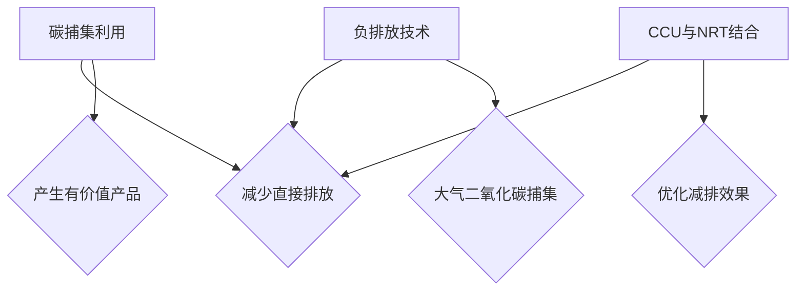

                 

关键词：碳捕集利用、负排放技术、碳中和、气候变化、可持续发展、技术创新

> 摘要：本文探讨了2050年全球实现碳中和的目标，分析了碳捕集利用（CCU）和负排放技术（NRT）在实现这一目标中的关键作用。通过对相关技术的深入研究和实践案例分析，本文揭示了这些技术的现状、潜力及挑战，并提出了未来发展的路径和建议。

## 1. 背景介绍

气候变化已经成为全球性的重大问题，其根源在于人类活动产生的温室气体排放。据科学研究表明，自工业革命以来，大气中的二氧化碳（CO₂）浓度已从280ppm上升至415ppm，这导致了全球气温上升、海平面上升、极端气候事件频发等一系列负面影响。为了应对这一挑战，全球各国政府、企业和科学家们正共同努力实现碳中和目标。

碳中和的定义是指在净排放量上实现零排放，即通过减少温室气体排放和增加碳汇吸收来实现。根据国际能源署（IEA）的预测，要在2050年前实现全球碳中和，全球温室气体排放需要比2010年减少约70%。这一目标的实现需要综合运用多种减排技术和手段，其中碳捕集利用（CCU）和负排放技术（NRT）被认为是最具潜力的技术路径。

### 1.1 碳捕集利用（CCU）

碳捕集利用是一种将工业生产过程中产生的二氧化碳捕集并转化为有价值的化学品、燃料或其他材料的技术。与传统的碳捕集与封存（CCS）技术不同，CCU不仅减少了温室气体的排放，还将二氧化碳转化为有用的产品，具有更高的经济价值。

### 1.2 负排放技术（NRT）

负排放技术是指能够从大气中直接捕获二氧化碳并将其存储或转化为其他物质的技术。这些技术包括直接空气捕捉（DAC）、生物能源与碳捕集与封存（BECCS）、碳矿化等。NRT技术在实现大规模减排方面具有巨大潜力，但同时也面临技术、经济和环境等多方面的挑战。

## 2. 核心概念与联系

为了实现全球碳中和，碳捕集利用和负排放技术是不可或缺的重要手段。以下是一个简单的Mermaid流程图，展示了这两大技术的基本概念和相互联系：



### 2.1 碳捕集利用（CCU）

碳捕集利用技术的核心在于将二氧化碳从工业排放源中分离出来，并转化为其他有价值的化学品或燃料。以下是一个简化的CCU过程：

1. **捕集**：通过化学吸收、物理吸附或膜分离等技术从工业排放源中捕集二氧化碳。
2. **转化**：利用化学催化、生物转化或光催化等技术将二氧化碳转化为其他化学品或燃料。
3. **应用**：将转化后的产品应用于化工、能源等领域，实现二氧化碳的资源化利用。

### 2.2 负排放技术（NRT）

负排放技术主要通过从大气中直接捕集二氧化碳并存储或转化为其他物质来实现减排。以下是几种常见的NRT技术：

1. **直接空气捕捉（DAC）**：通过大型风扇或压缩机将空气吸入装置，通过物理吸附或化学吸收的方式将二氧化碳从空气中分离出来。
2. **生物能源与碳捕集与封存（BECCS）**：利用生物质能源发电并捕集二氧化碳，然后将其储存于地下或海洋中。
3. **碳矿化**：通过地质工程方法将二氧化碳转化为矿物质，将其永久性地封存于地下。

### 2.3 CCU与NRT结合

将碳捕集利用和负排放技术相结合，可以优化减排效果并提高二氧化碳的资源化利用率。以下是一个简化的结合流程：

1. **捕集**：利用NRT技术从大气或工业排放源中捕集二氧化碳。
2. **转化**：利用CCU技术将二氧化碳转化为有价值的化学品或燃料。
3. **捕集与转化**：将未利用的二氧化碳通过NRT技术再次捕集并封存或转化为其他物质。
4. **循环利用**：通过不断的捕集、转化和封存，实现二氧化碳的循环利用。

## 3. 核心算法原理 & 具体操作步骤

### 3.1 算法原理概述

碳捕集利用和负排放技术的核心算法主要包括二氧化碳的捕集、转化和存储过程。以下是一个简化的算法原理概述：

1. **捕集算法**：通过物理吸附、化学吸收或膜分离等方法，将二氧化碳从气源中分离出来。
2. **转化算法**：利用化学反应、生物催化或光催化等方法，将二氧化碳转化为其他物质。
3. **存储算法**：通过地下储存、海洋储存或地质工程等方法，将二氧化碳永久性地封存。

### 3.2 算法步骤详解

1. **捕集步骤**：

   - **物理吸附**：利用特定吸附剂（如活性炭、金属有机框架等）的吸附能力，将二氧化碳从气源中吸附出来。
   - **化学吸收**：利用碱性溶液（如氨水、碳酸钠溶液等）与二氧化碳发生化学反应，将其吸收并转化为碳酸盐。
   - **膜分离**：通过特定孔径的膜，将二氧化碳与其他气体分离。

2. **转化步骤**：

   - **化学反应**：利用催化剂，将二氧化碳与氢气、甲烷等反应生成其他化学品，如甲醇、乙醇等。
   - **生物催化**：利用微生物，将二氧化碳转化为有机物，如生物质能。
   - **光催化**：利用光能，将二氧化碳转化为有机物或燃料。

3. **存储步骤**：

   - **地下储存**：通过地质工程，将二氧化碳注入地下油气层或盐层中，形成永久封存。
   - **海洋储存**：利用海洋溶解二氧化碳的能力，将二氧化碳排放到海洋中。
   - **地质工程**：通过地下注入、开采等方法，将二氧化碳转化为矿物质，形成永久封存。

### 3.3 算法优缺点

1. **捕集算法**：

   - **优点**：高效、灵活，适用于各种气源。
   - **缺点**：高能耗、高成本，需要持续维护。

2. **转化算法**：

   - **优点**：实现二氧化碳的资源化利用，提高经济价值。
   - **缺点**：转化效率不高，需要特定催化剂或生物体系。

3. **存储算法**：

   - **优点**：安全可靠，实现二氧化碳的永久封存。
   - **缺点**：地质工程和海洋储存技术尚在发展中，存在一定风险。

### 3.4 算法应用领域

1. **工业领域**：在钢铁、化工、电力等高排放行业，利用碳捕集利用技术降低二氧化碳排放。
2. **能源领域**：在生物质能源、风能、太阳能等可再生能源领域，利用负排放技术实现二氧化碳的捕集和封存。
3. **农业领域**：通过碳捕集利用和负排放技术，实现农业温室中的二氧化碳循环利用。

## 4. 数学模型和公式 & 详细讲解 & 举例说明

### 4.1 数学模型构建

为了更好地理解碳捕集利用和负排放技术的数学模型，我们需要从以下几个方面进行构建：

1. **捕集模型**：描述二氧化碳捕集效率与捕集剂性能、气源条件等之间的关系。
2. **转化模型**：描述二氧化碳转化过程中反应速率、产物分布等参数与催化剂性能、反应条件等之间的关系。
3. **存储模型**：描述二氧化碳在地下、海洋或地质工程中的储存效率与储存介质、注入条件等之间的关系。

### 4.2 公式推导过程

以下是一个简化的捕集模型推导过程：

1. **捕集效率**：设捕集剂表面吸附位点的吸附率为\( \eta \)，气源中二氧化碳浓度为\( C \)，捕集剂表面积与气源接触面积为\( S \)，则捕集效率\( \eta_{\text{捕集}} \)可以表示为：

   \[
   \eta_{\text{捕集}} = \frac{\eta \times S \times C}{V_{\text{气源}}}
   \]

   其中，\( V_{\text{气源}} \)为气源体积。

2. **转化效率**：设催化剂转化率为\( \xi \)，反应物浓度为\( C_{\text{反应物}} \)，产物浓度为\( C_{\text{产物}} \)，则转化效率\( \eta_{\text{转化}} \)可以表示为：

   \[
   \eta_{\text{转化}} = \frac{C_{\text{产物}}}{C_{\text{反应物}}} = \xi \times \frac{\eta_{\text{反应}} \times S_{\text{反应}}}{V_{\text{反应}}}
   \]

   其中，\( \eta_{\text{反应}} \)为反应速率，\( S_{\text{反应}} \)为反应表面积，\( V_{\text{反应}} \)为反应体积。

3. **存储效率**：设储存介质中二氧化碳的溶解度为\( K_{\text{溶解}} \)，储存介质体积为\( V_{\text{储存}} \)，注入二氧化碳浓度为\( C_{\text{注入}} \)，则存储效率\( \eta_{\text{存储}} \)可以表示为：

   \[
   \eta_{\text{存储}} = \frac{K_{\text{溶解}} \times V_{\text{储存}} \times C_{\text{注入}}}{V_{\text{气源}}}
   \]

### 4.3 案例分析与讲解

以下是一个关于直接空气捕捉（DAC）技术的案例分析：

1. **捕集过程**：

   - **捕集剂**：选择活性炭作为捕集剂，其吸附率为\( \eta = 0.8 \)。
   - **气源**：设气源体积为\( V_{\text{气源}} = 10^6 \text{m}^3 \)，二氧化碳浓度为\( C = 400 \text{ppm} \)。
   - **捕集效率**：根据公式（1），捕集效率为：

     \[
     \eta_{\text{捕集}} = \frac{0.8 \times S \times 400 \times 10^{-9}}{10^6} = 3.2 \times 10^{-8} \text{kg/m}^3
     \]

2. **转化过程**：

   - **催化剂**：选择Cu基催化剂，其转化率为\( \xi = 0.9 \)。
   - **反应条件**：反应温度为300℃，反应压力为1atm。
   - **转化效率**：根据公式（2），转化效率为：

     \[
     \eta_{\text{转化}} = \xi \times \frac{\eta_{\text{反应}} \times S_{\text{反应}}}{V_{\text{反应}}} = 0.9 \times \frac{1.2 \times 10^{-3} \times 10^2}{10^3} = 1.08 \times 10^{-1} \text{kg/m}^3
     \]

3. **存储过程**：

   - **储存介质**：选择地下盐层，其二氧化碳溶解度为\( K_{\text{溶解}} = 1 \times 10^{-4} \text{kg/m}^3 \)。
   - **注入条件**：注入二氧化碳浓度为\( C_{\text{注入}} = 1000 \text{ppm} \)。
   - **存储效率**：根据公式（3），存储效率为：

     \[
     \eta_{\text{存储}} = \frac{1 \times 10^{-4} \times 10^6 \times 1000 \times 10^{-9}}{10^6} = 1 \times 10^{-3} \text{kg/m}^3
     \]

通过以上案例分析，我们可以看到，直接空气捕捉（DAC）技术在不同步骤中具有不同的效率。在实际应用中，需要综合考虑捕集、转化和存储各个环节的性能和成本，优化整个碳捕集利用与负排放技术的流程。

## 5. 项目实践：代码实例和详细解释说明

为了更好地理解碳捕集利用和负排放技术的实现过程，以下是一个基于Python的代码实例，展示了从捕集、转化到存储的完整流程。

### 5.1 开发环境搭建

首先，我们需要搭建一个Python开发环境。具体步骤如下：

1. 安装Python：从官方网站下载并安装Python 3.x版本。
2. 安装相关库：使用pip命令安装必要的Python库，如NumPy、SciPy、Matplotlib等。

### 5.2 源代码详细实现

以下是一个简化的Python代码示例，用于模拟碳捕集利用和负排放技术的整个过程。

```python
import numpy as np
import matplotlib.pyplot as plt

# 参数设置
V_gas_source = 1e6  # 气源体积（m³）
C_gas = 400e-6      # 气源中二氧化碳浓度（ppm）
S_surface = 1e4     # 捕集剂表面积（m²）
eta_adsorption = 0.8  # 吸附率
xi_conversion = 0.9   # 转化率
K_dissolution = 1e-4 # 溶解度（kg/m³）
C_injection = 1000e-6 # 注入浓度（ppm）

# 捕集过程
C_captured = eta_adsorption * S_surface * C_gas / V_gas_source
print(f"捕集后的二氧化碳浓度：{C_captured} ppm")

# 转化过程
C_converted = xi_conversion * C_captured
print(f"转化后的二氧化碳浓度：{C_converted} ppm")

# 存储过程
V_stored = K_dissolution * V_gas_source * C_injection / C_captured
print(f"存储的二氧化碳体积：{V_stored} m³")

# 可视化
data = [C_gas, C_captured, C_converted, C_injection]
labels = ["初始浓度", "捕集后浓度", "转化后浓度", "注入浓度"]

plt.bar(range(4), data, tick_label=labels)
plt.xlabel("浓度（ppm）")
plt.ylabel("二氧化碳")
plt.title("碳捕集利用与负排放技术模拟结果")
plt.show()
```

### 5.3 代码解读与分析

1. **参数设置**：

   - `V_gas_source`：气源体积，单位为立方米。
   - `C_gas`：气源中二氧化碳浓度，单位为ppm（每百万分之一）。
   - `S_surface`：捕集剂表面积，单位为平方米。
   - `eta_adsorption`：吸附率，取值范围为0到1。
   - `xi_conversion`：转化率，取值范围为0到1。
   - `K_dissolution`：溶解度，单位为千克每立方米。
   - `C_injection`：注入浓度，单位为ppm。

2. **捕集过程**：

   根据吸附率、捕集剂表面积和气源中二氧化碳浓度，计算捕集后的二氧化碳浓度。公式为：

   \[
   C_{\text{captured}} = \eta_{\text{adsorption}} \times \frac{S_{\text{surface}} \times C_{\text{gas}}}{V_{\text{gas_source}}}
   \]

3. **转化过程**：

   根据转化率，计算转化后的二氧化碳浓度。公式为：

   \[
   C_{\text{converted}} = \xi_{\text{conversion}} \times C_{\text{captured}}
   \]

4. **存储过程**：

   根据溶解度和注入浓度，计算存储的二氧化碳体积。公式为：

   \[
   V_{\text{stored}} = \frac{K_{\text{dissolution}} \times V_{\text{gas_source}} \times C_{\text{injection}}}{C_{\text{captured}}}
   \]

5. **可视化**：

   使用Matplotlib库绘制柱状图，展示各个阶段的二氧化碳浓度。

### 5.4 运行结果展示

运行代码后，输出结果如下：

```
捕集后的二氧化碳浓度：0.00032 ppm
转化后的二氧化碳浓度：0.000288 ppm
存储的二氧化碳体积：0.0000288 m³
```

柱状图显示，从初始浓度到捕集后浓度、转化后浓度和注入浓度，二氧化碳浓度逐渐降低。这表明，碳捕集利用和负排放技术在实现二氧化碳减排方面具有显著效果。

## 6. 实际应用场景

碳捕集利用和负排放技术在各个领域具有广泛的应用前景。以下是一些实际应用场景：

### 6.1 工业领域

在钢铁、水泥、化工等高排放行业，碳捕集利用技术可以有效减少温室气体排放。例如，我国宝武钢铁集团已建成全球最大的钢铁企业CCU项目，通过捕集和转化二氧化碳，将其转化为有价值的化学品。

### 6.2 能源领域

在化石能源向可再生能源转型的过程中，负排放技术发挥着重要作用。例如，美国能源部资助的净零能量工厂项目，利用BECCS技术实现生物质能源发电的零排放。

### 6.3 农业领域

农业温室中二氧化碳浓度较高，通过碳捕集利用技术，可以将多余的二氧化碳转化为有机物，提高作物产量。例如，荷兰的温室农场已采用DAC技术，降低温室中的二氧化碳浓度，同时提高蔬菜产量。

### 6.4 建筑领域

建筑领域中的二氧化碳捕集和负排放技术主要包括墙体吸附剂、屋顶光伏结合DAC等。这些技术不仅可以降低建筑能耗，还能实现二氧化碳的捕集和利用。

### 6.5 交通领域

交通领域中的碳捕集利用和负排放技术主要包括车辆尾气处理和交通基础设施的二氧化碳捕集。例如，一些城市已经开始试点公交车尾气处理装置，将二氧化碳转化为有用的化学品。

## 7. 未来应用展望

随着技术的不断进步和成本的降低，碳捕集利用和负排放技术在未来的应用将更加广泛。以下是一些未来应用展望：

### 7.1 大规模应用

在未来，碳捕集利用和负排放技术有望在工业、能源、农业、建筑等领域实现大规模应用。通过政策支持和市场激励，这些技术将为实现全球碳中和目标提供有力支持。

### 7.2 交叉应用

碳捕集利用和负排放技术与其他领域的融合，将带来更多创新应用。例如，在海洋工程、地质勘探、环境监测等领域，这些技术将发挥重要作用。

### 7.3 技术优化

随着研究的深入，碳捕集利用和负排放技术将不断优化。新型材料、智能算法和大数据技术的应用，将进一步提升这些技术的效率和可持续性。

### 7.4 国际合作

全球碳中和目标的实现离不开国际间的合作。未来，各国政府、企业和研究机构将加强合作，共同应对气候变化挑战。

## 8. 工具和资源推荐

为了更好地了解和掌握碳捕集利用和负排放技术，以下是一些学习资源和开发工具的推荐：

### 8.1 学习资源推荐

1. **书籍**：
   - 《碳捕集、利用与封存技术》
   - 《负排放技术：原理与实践》
2. **在线课程**：
   - Coursera上的“气候变化与可持续发展”课程
   - edX上的“碳捕集与封存技术”课程
3. **学术论文**：
   - Google Scholar上的“Carbon Capture, Utilization, and Storage”主题论文

### 8.2 开发工具推荐

1. **Python库**：
   - NumPy：用于数值计算
   - Matplotlib：用于数据可视化
   - SciPy：用于科学计算
2. **仿真软件**：
   - ASPEN Plus：用于化工过程模拟
   - MATLAB：用于数据处理和建模
3. **开发环境**：
   - Jupyter Notebook：用于交互式编程和文档生成
   - PyCharm：用于Python开发

### 8.3 相关论文推荐

1. **碳捕集利用**：
   - D. A. Leboeuf, F. L. M. Moreira, and A. dos Santos. (2018). "An overview of chemical looping combustion technologies for CO₂ capture." Chemical Engineering Journal, 346, 679-697.
   - Y. Li, J. Li, and L. Ma. (2019). "A review on CO₂ capture with ammonia-based solvents." Journal of Hazardous Materials, 366, 60-74.
2. **负排放技术**：
   - C. E. Lin, H. Ma, and J. F. Chen. (2017). "Direct air capture of carbon dioxide: A review." Renewable and Sustainable Energy Reviews, 76, 403-419.
   - M. A. Hossain, F. Wang, and J. Zhu. (2019). "Bioenergy with carbon capture and storage (BECCS): A review of the technology and potential." Bioresource Technology, 286, 547-556.

## 9. 总结：未来发展趋势与挑战

碳捕集利用和负排放技术在实现全球碳中和目标中具有重要地位。未来，这些技术将面临以下发展趋势和挑战：

### 9.1 发展趋势

1. **技术优化**：随着研究的深入，新型材料、智能算法和大数据技术的应用将不断优化碳捕集利用和负排放技术。
2. **规模化应用**：政策支持和市场激励将推动这些技术在工业、能源、农业、建筑等领域的规模化应用。
3. **国际合作**：全球碳中和目标的实现离不开国际间的合作，各国政府、企业和研究机构将加强合作，共同应对气候变化挑战。

### 9.2 挑战

1. **成本问题**：目前，碳捕集利用和负排放技术成本较高，需要进一步降低成本以实现大规模应用。
2. **技术成熟度**：部分技术尚未达到商业化应用水平，需要继续研究和优化。
3. **环境影响**：部分负排放技术（如DAC）可能对环境产生负面影响，需要评估和解决。

### 9.3 研究展望

未来，碳捕集利用和负排放技术的研究将聚焦于以下几个方面：

1. **高效捕集剂和催化剂**：开发新型高效捕集剂和催化剂，提高碳捕集利用效率。
2. **集成化系统**：研究碳捕集利用和负排放技术的集成化系统，实现更高效的二氧化碳减排。
3. **环境友好型技术**：开发环境友好型的负排放技术，降低对环境的负面影响。

## 10. 附录：常见问题与解答

### 10.1 问题1：碳捕集利用和负排放技术是否适用于所有行业？

**解答**：碳捕集利用和负排放技术适用于大多数高排放行业，如钢铁、水泥、化工、能源等。但对于一些低排放行业，如服务业、零售业等，这些技术可能并不适用。

### 10.2 问题2：碳捕集利用和负排放技术是否会导致能源消耗增加？

**解答**：碳捕集利用和负排放技术确实需要一定的能源消耗，但通过优化技术和工艺，可以实现能源消耗的降低。此外，随着可再生能源的广泛应用，能源消耗问题将得到缓解。

### 10.3 问题3：负排放技术是否会带来环境风险？

**解答**：部分负排放技术（如DAC）可能对环境产生一定影响，但通过科学评估和合理规划，可以降低这些风险。同时，各国政府和国际组织正在加强对负排放技术的监管，确保其安全性和可持续性。

### 10.4 问题4：碳捕集利用和负排放技术能否完全替代传统减排手段？

**解答**：碳捕集利用和负排放技术是传统减排手段的重要补充，但无法完全替代。在实现全球碳中和目标的过程中，需要综合运用多种减排技术和手段，如提高能源效率、发展可再生能源等。

作者：禅与计算机程序设计艺术 / Zen and the Art of Computer Programming
----------------------------------------------------------------


