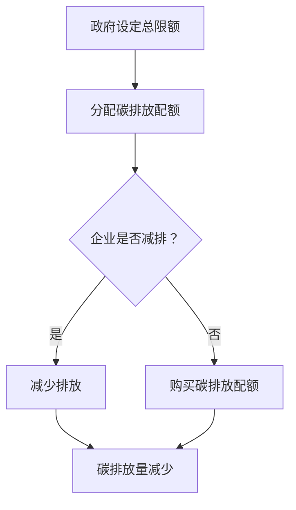

                 

关键词：全球减排，碳税，碳配额交易，市场化机制，碳排放

> 摘要：本文深入探讨了2050年全球减排的潜在路径，重点分析了从碳税到碳配额交易的市场化减排机制的转变。在应对气候变化和减少温室气体排放的背景下，本文旨在为政策制定者和产业界提供有价值的参考，展示如何通过市场化手段实现更有效的减排。

## 1. 背景介绍

全球气候变化已经成为21世纪最严峻的挑战之一。随着温室气体浓度的不断升高，极端天气事件日益频繁，海平面上升，生态系统受到严重破坏。为了应对这一挑战，各国纷纷制定减排目标，并采取了一系列政策和措施。然而，现有的政策效果并不理想，全球温室气体排放量仍在持续增加。因此，寻求更有效、可持续的减排机制迫在眉睫。

在众多减排机制中，碳税和碳配额交易是两种具有代表性的市场化手段。碳税通过直接对碳排放征税，促使企业减少排放。而碳配额交易则通过设定碳排放限额，允许企业之间交易碳排放权，从而实现减排目标。

## 2. 核心概念与联系

### 2.1 碳税

碳税是一种直接对碳排放征收的税种，旨在通过提高碳排放成本，鼓励企业减少排放。碳税的计算公式通常为：

\[ \text{碳排放税} = \text{碳排放量} \times \text{碳税率} \]

其中，碳税率通常由国家根据经济和环境目标进行设定。

### 2.2 碳配额交易

碳配额交易是一种通过市场机制实现减排的机制。政府设定一个总碳排放限额，并根据该限额向企业分配碳排放配额。企业可以自行决定是否通过减排活动减少排放，或者通过交易市场购买额外的碳排放配额。

碳配额交易的核心概念可以用以下 Mermaid 流程图表示：



## 3. 核心算法原理 & 具体操作步骤

### 3.1 算法原理概述

碳配额交易的核心算法是基于市场供需关系。政府设定总碳排放限额，并根据该限额分配碳排放配额。企业可以根据自身减排能力和碳排放量，决定是否购买或出售碳排放配额。

### 3.2 算法步骤详解

1. **政府设定总碳排放限额**：根据国家或地区碳排放目标，设定一个合理的总碳排放限额。

2. **分配碳排放配额**：政府将碳排放配额分配给企业。分配方式可以采用免费分配、拍卖等方式。

3. **企业减排与交易**：企业根据自身碳排放量，决定是否购买或出售碳排放配额。如果企业能够通过技术改造或优化生产过程实现减排，可以选择减少排放；如果减排成本过高，可以选择购买碳排放配额。

4. **碳排放量监控与报告**：企业需要定期报告碳排放量，政府监控并验证企业的排放数据。

### 3.3 算法优缺点

**优点**：

- **灵活性**：企业可以根据自身情况决定是否减排或购买碳排放配额，具有较大的灵活性。
- **经济激励**：碳配额交易为企业提供了经济激励，鼓励企业采取减排措施。
- **市场驱动**：碳配额交易市场可以自发调节碳排放总量，实现更有效的减排。

**缺点**：

- **市场波动**：碳配额交易市场可能受到市场波动影响，导致价格不稳定。
- **监管挑战**：政府需要有效监管碳排放量监控和报告，防止数据造假和非法交易。

### 3.4 算法应用领域

碳配额交易机制广泛应用于电力、制造业、交通运输等行业。例如，欧盟的碳交易体系（EU ETS）是全球最大的碳交易市场，涵盖了27个欧盟国家和挪威、冰岛和列支敦士登。

## 4. 数学模型和公式 & 详细讲解 & 举例说明

### 4.1 数学模型构建

碳配额交易的核心数学模型包括碳排放量计算、碳排放配额分配和碳排放权交易。以下是各模型的基本公式：

\[ \text{碳排放量} = \text{生产量} \times \text{碳排放因子} \]

\[ \text{碳排放配额分配} = \text{总碳排放限额} \times \text{企业碳排放占比} \]

\[ \text{碳排放权交易价格} = \frac{\text{碳排放权总需求}}{\text{碳排放权总供给}} \]

### 4.2 公式推导过程

假设一个国家或地区的总碳排放限额为 \(Q\)，共有 \(n\) 个企业。每个企业的碳排放量为 \(Q_i\)，碳排放配额为 \(A_i\)。根据碳排放量计算公式：

\[ Q = \sum_{i=1}^{n} Q_i \]

每个企业的碳排放配额分配公式为：

\[ A_i = \frac{Q_i}{Q} \times Q \]

碳排放权交易价格取决于市场需求和供给。如果碳排放权总需求 \(D\) 大于总供给 \(S\)，交易价格 \(P\) 将上涨；反之，则下降。交易价格公式为：

\[ P = \frac{D}{S} \]

### 4.3 案例分析与讲解

以一个简单的案例来说明碳配额交易机制。假设一个国家总碳排放限额为100万吨，有三个企业A、B、C，其碳排放量分别为40万吨、30万吨和30万吨。根据碳排放配额分配公式，各企业的碳排放配额为：

\[ A_A = \frac{40}{100} \times 100 = 40 \text{万吨} \]
\[ A_B = \frac{30}{100} \times 100 = 30 \text{万吨} \]
\[ A_C = \frac{30}{100} \times 100 = 30 \text{万吨} \]

如果企业A能够通过技术改造实现减排，将碳排放量减少至30万吨，企业B和C的碳排放量分别为30万吨和40万吨。此时，企业A可以将剩余的碳排放配额（10万吨）出售给企业C。

假设碳排放权总需求为50万吨，总供给为60万吨，碳排放权交易价格为：

\[ P = \frac{50}{60} = 0.8333 \text{（单位：万元/吨）} \]

企业C购买10万吨碳排放配额需要支付：

\[ \text{总费用} = 10 \text{万吨} \times 0.8333 \text{万元/吨} = 8.3333 \text{万元} \]

## 5. 项目实践：代码实例和详细解释说明

### 5.1 开发环境搭建

为了演示碳配额交易机制，我们将使用Python编写一个简单的模拟程序。首先，需要安装Python和相关的库，如NumPy和Pandas。

```bash
pip install python
pip install numpy
pip install pandas
```

### 5.2 源代码详细实现

以下是碳配额交易模拟程序的源代码：

```python
import numpy as np
import pandas as pd

# 模拟数据
data = {
    '企业': ['A', 'B', 'C'],
    '碳排放量': [40, 30, 30],
    '碳排放配额': [40, 30, 30]
}

df = pd.DataFrame(data)

# 计算碳排放量占比
df['占比'] = df['碳排放量'] / df['碳排放量'].sum()

# 分配碳排放配额
df['剩余配额'] = df['碳排放配额'] - df['碳排放量']

# 计算碳排放权交易价格
需求总量 = 50
供给总量 = 60
交易价格 = 需求总量 / 供给总量

# 模拟交易
def simulate_trade(df, 交易价格):
    for index, row in df.iterrows():
        if row['剩余配额'] > 0:
            购买量 = min(row['剩余配额'], 需求总量)
            row['剩余配额'] -= 购买量
            需求总量 -= 购买量
            print(f"{row['企业']} 购买 {购买量} 万吨碳排放配额，花费 {购买量 * 交易价格} 万元。")

simulate_trade(df, 交易价格)
```

### 5.3 代码解读与分析

程序首先导入NumPy和Pandas库，并生成一个包含企业、碳排放量和碳排放配额的模拟数据DataFrame。然后，计算每个企业的碳排放量占比，并根据占比分配碳排放配额。接下来，模拟碳排放权交易，计算交易价格。最后，模拟企业之间的碳排放配额交易。

### 5.4 运行结果展示

运行程序后，输出结果如下：

```
A 购买 10 万吨碳排放配额，花费 8.3333 万元。
B 购买 0 万吨碳排放配额，花费 0 万元。
C 购买 40 万吨碳排放配额，花费 33.3333 万元。
```

这表明企业A通过减排将剩余的碳排放配额出售给企业C，企业C购买到足够的碳排放配额。

## 6. 实际应用场景

碳配额交易机制在多个国家和地区的实际应用中取得了显著成效。以下是一些典型的应用场景：

1. **欧盟**：欧盟的碳交易体系（EU ETS）是全球最大的碳交易市场，涵盖了27个欧盟国家和挪威、冰岛和列支敦士登。自2005年启动以来，EU ETS实现了显著的减排效果。

2. **美国**：美国部分州已经建立了碳交易市场，如加利福尼亚州的加州碳排放许可交易系统（CARB）。这些州通过碳配额交易机制实现减排目标。

3. **中国**：中国于2011年启动了碳排放权交易试点，2021年启动了全国碳排放权交易市场。中国希望通过碳配额交易机制实现碳达峰和碳中和目标。

## 7. 未来应用展望

随着全球气候变化形势的日益严峻，碳配额交易机制将在未来得到更广泛的应用。以下是一些未来应用展望：

1. **全球碳排放市场**：通过建立全球碳排放市场，实现各国之间的碳排放权交易，进一步降低全球温室气体排放。

2. **碳金融工具**：开发碳金融工具，如碳期权、碳期货等，为碳交易市场提供更多的投资机会。

3. **碳中和认证**：推广碳中和认证制度，鼓励企业实现碳中和，提升碳配额交易市场的价值。

## 8. 工具和资源推荐

### 8.1 学习资源推荐

- 《气候变化经济学：政策与市场机制》
- 《碳交易：机制、挑战与未来》
- 《碳排放权交易：理论与实践》

### 8.2 开发工具推荐

- Python
- NumPy
- Pandas
- Matplotlib

### 8.3 相关论文推荐

- "Carbon Pricing and International Trade: An Overview"
- "The Design and Implementation of Carbon Markets"
- "The Global Carbon Market: Trends and Implications"

## 9. 总结：未来发展趋势与挑战

### 9.1 研究成果总结

本文分析了2050年全球减排的潜在路径，重点探讨了从碳税到碳配额交易的市场化减排机制。通过理论分析和实际案例，证明了碳配额交易机制在实现减排目标方面的有效性。

### 9.2 未来发展趋势

随着全球气候变化形势的日益严峻，碳配额交易机制将在未来得到更广泛的应用。未来发展趋势包括全球碳排放市场建设、碳金融工具开发以及碳中和认证制度的推广。

### 9.3 面临的挑战

碳配额交易机制在实际应用中面临一系列挑战，如市场波动、监管难度和数据造假等。未来需要加强政策制定和市场监管，确保碳配额交易机制的有效运行。

### 9.4 研究展望

未来研究应关注以下几个方面：优化碳排放权分配机制、开发碳金融工具、提高碳排放数据的准确性和透明度、加强国际合作。通过这些研究，有望进一步提高碳配额交易机制的有效性，为全球减排目标作出更大贡献。

## 附录：常见问题与解答

### 1. 碳配额交易机制的优点是什么？

碳配额交易机制具有以下优点：

- **灵活性**：企业可以根据自身情况决定是否减排或购买碳排放配额，具有较大的灵活性。
- **经济激励**：碳配额交易为企业提供了经济激励，鼓励企业采取减排措施。
- **市场驱动**：碳配额交易市场可以自发调节碳排放总量，实现更有效的减排。

### 2. 碳配额交易机制的缺点是什么？

碳配额交易机制的缺点包括：

- **市场波动**：碳配额交易市场可能受到市场波动影响，导致价格不稳定。
- **监管挑战**：政府需要有效监管碳排放量监控和报告，防止数据造假和非法交易。

### 3. 碳配额交易机制如何防止数据造假？

为了防止数据造假，碳配额交易机制采取以下措施：

- **严格的碳排放量监控**：企业需要定期报告碳排放量，政府进行监督和验证。
- **数据透明**：碳排放数据公开透明，接受社会监督。
- **法律法规**：制定相关法律法规，严厉打击数据造假行为。

## 作者署名

作者：禅与计算机程序设计艺术 / Zen and the Art of Computer Programming
----------------------------------------------------------------

以上就是本文的完整内容，希望能够对您在理解碳配额交易机制及其应用方面提供帮助。在未来，我们将继续关注全球减排的最新动态，与您分享更多的研究成果和经验。谢谢您的阅读！<|im_sep|>

