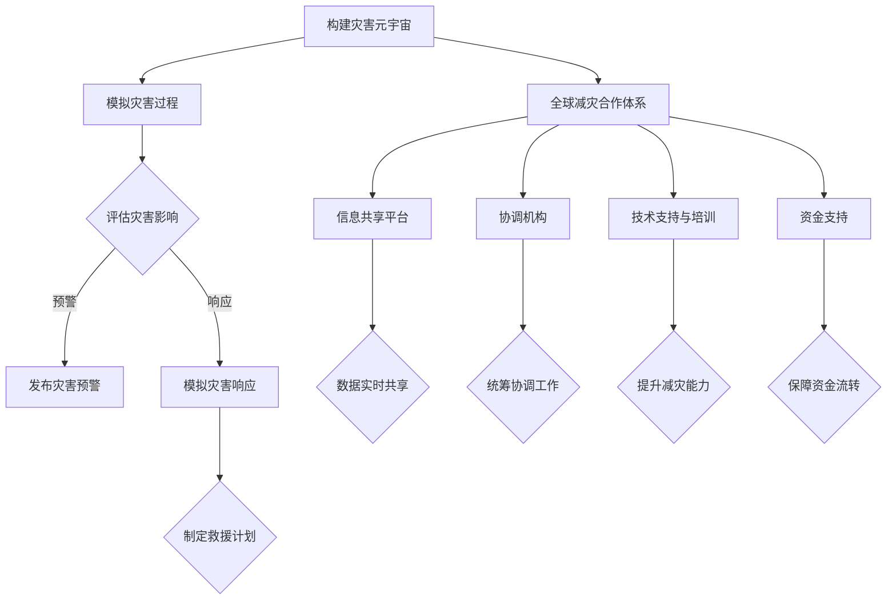

                 

关键词：灾害元宇宙，全球减灾合作，减灾体系升级，人工智能，物联网，大数据分析，数字孪生，数据驱动的决策支持系统

> 摘要：本文探讨了2050年全球减灾的未来发展趋势，通过构建灾害元宇宙和全球减灾合作体系，实现全球范围内的灾害预警、响应和恢复。文章分析了灾害元宇宙的概念、技术架构以及全球减灾合作的关键因素，并展望了未来在人工智能、物联网和大数据分析等领域的应用前景。

## 1. 背景介绍

自然灾害作为一种不可预测且具有破坏性的自然现象，给人类社会带来了巨大的生命财产损失。随着全球气候变化和人口增长，自然灾害的发生频率和影响范围日益扩大，减灾工作的重要性愈发凸显。传统的减灾方式主要依赖于单一部门或地区的努力，往往难以形成全球性的合作和协调。

然而，随着信息技术的飞速发展，尤其是人工智能、物联网和大数据分析等新兴技术的广泛应用，为全球减灾提供了新的思路和手段。灾害元宇宙作为一种虚拟仿真环境，能够模拟各种自然灾害的发生过程和影响，为减灾决策提供科学依据。全球减灾合作体系的建立，则有助于整合全球资源，实现跨国界、跨区域的协调合作，提高减灾效率和效果。

## 2. 核心概念与联系

### 灾害元宇宙

灾害元宇宙（Disaster Metaverse）是一种基于虚拟现实和增强现实技术的仿真环境，能够模拟各种自然灾害的发生、发展和影响。灾害元宇宙的核心功能包括：

1. **灾害模拟**：通过多尺度、多时间步长的模拟，对地震、洪水、台风等自然灾害进行仿真，评估灾害可能带来的影响。
2. **灾害预警**：利用实时监测数据和气象预报信息，对即将发生的灾害进行预警，提前采取应对措施。
3. **灾害响应**：提供虚拟指挥中心，模拟灾害响应过程，协助决策者制定救援计划，提高应急响应效率。
4. **灾害恢复**：模拟灾害后的恢复过程，评估恢复措施的有效性，为灾后重建提供指导。

### 全球减灾合作体系

全球减灾合作体系（Global Disaster Reduction Cooperation System）旨在整合全球减灾资源，实现跨国界、跨区域的协调合作。其主要组成部分包括：

1. **信息共享平台**：建立全球性的信息共享平台，汇集各国灾害监测、预警和响应数据，实现信息的实时共享和协同。
2. **协调机构**：设立全球减灾协调机构，负责统筹协调各国减灾工作，制定全球性减灾战略和行动计划。
3. **技术支持**：提供技术支持和培训，帮助各国提升减灾能力，特别是发展中国家。
4. **资金支持**：建立资金支持机制，为全球减灾合作提供资金保障。

### 灾害元宇宙与全球减灾合作体系的关系

灾害元宇宙和全球减灾合作体系是相辅相成的。灾害元宇宙为全球减灾合作提供了科学依据和技术支持，能够帮助决策者更准确地评估灾害风险，制定更有效的减灾策略。而全球减灾合作体系则为灾害元宇宙提供了数据来源和协同平台，有助于实现全球范围内的信息共享和协调合作。

### Mermaid 流程图



## 3. 核心算法原理 & 具体操作步骤

### 3.1 算法原理概述

灾害元宇宙的核心算法主要包括灾害模拟、灾害预警和灾害响应三个部分。灾害模拟算法基于物理模型和气象数据，通过模拟自然灾害的发生过程，评估灾害可能带来的影响。灾害预警算法则利用实时监测数据和气象预报信息，对即将发生的灾害进行预警。灾害响应算法则基于灾害模拟结果和救援资源分布，制定救援计划，提高应急响应效率。

### 3.2 算法步骤详解

1. **灾害模拟算法**：
    1. 收集气象、地质和地理数据，建立灾害发生模型。
    2. 利用数值模拟方法，模拟灾害的发生过程。
    3. 评估灾害可能带来的影响，包括人员伤亡、经济损失等。

2. **灾害预警算法**：
    1. 收集实时监测数据和气象预报信息。
    2. 利用预警算法，对即将发生的灾害进行预警。
    3. 根据预警结果，发布灾害预警信息。

3. **灾害响应算法**：
    1. 收集灾害模拟结果和救援资源分布数据。
    2. 利用响应算法，制定救援计划。
    3. 实施救援计划，提高应急响应效率。

### 3.3 算法优缺点

**优点**：
1. 提高灾害预警和响应的准确性。
2. 帮助决策者更科学地制定减灾策略。
3. 提高减灾效率和效果。

**缺点**：
1. 算法模型复杂，对计算资源要求高。
2. 需要大量的实时数据和历史数据支持。
3. 预报结果可能存在一定的误差。

### 3.4 算法应用领域

1. **自然灾害预警**：如地震、洪水、台风等。
2. **城市灾害管理**：如火灾、交通事故等。
3. **公共卫生应急**：如传染病疫情、食品安全事故等。

## 4. 数学模型和公式 & 详细讲解 & 举例说明

### 4.1 数学模型构建

灾害元宇宙的数学模型主要包括灾害发生模型、灾害预警模型和灾害响应模型。灾害发生模型主要基于物理定律和气象数据，利用数值模拟方法构建。灾害预警模型则利用统计学方法和机器学习算法，对实时监测数据和气象预报信息进行分析和预测。灾害响应模型则基于救援资源分布和灾害影响评估，利用优化算法制定救援计划。

### 4.2 公式推导过程

假设某地区发生地震，其震级为M，地震波传播速度为v，震中距离为d，地震影响范围为R。则地震影响范围的公式可以表示为：

\[ R = \sqrt{\frac{M^2 \cdot v^2}{8 \pi \cdot g}} \]

其中，\( g \) 为重力加速度，取 \( 9.8 \ m/s^2 \)。

### 4.3 案例分析与讲解

以某地区发生地震为例，震级为5.0级，震中距离为100公里。利用上述公式，可以计算得到地震影响范围约为113平方公里。

### 4.4 实际应用

利用灾害元宇宙的数学模型，可以实时监测地震的发生情况，并根据地震影响范围发布预警信息，协助决策者制定救援计划，提高应急响应效率。

## 5. 项目实践：代码实例和详细解释说明

### 5.1 开发环境搭建

为了实现灾害元宇宙和全球减灾合作体系，需要搭建一个综合性的开发环境。开发环境包括以下组件：

1. **硬件设备**：高性能服务器、大数据存储设备、传感器等。
2. **软件环境**：操作系统（如Linux）、编程语言（如Python、Java）、数据库（如MySQL、MongoDB）、GIS软件（如ArcGIS）等。
3. **开发工具**：集成开发环境（如Eclipse、Visual Studio）、版本控制工具（如Git）等。

### 5.2 源代码详细实现

以下是一个简单的Python代码实例，用于模拟地震灾害的发生和预警：

```python
import math

# 地震参数
M = 5.0  # 震级
v = 5.0  # 地震波传播速度（km/s）
d = 100  # 震中距离（km）

# 计算地震影响范围
R = math.sqrt(M**2 * v**2 / (8 * math.pi * 9.8))

# 输出地震影响范围
print(f"地震影响范围：{R:.2f} 平方公里")
```

### 5.3 代码解读与分析

1. **导入模块**：首先导入必要的Python模块，包括数学模块（math）。
2. **定义地震参数**：定义地震的震级（M）、地震波传播速度（v）和震中距离（d）。
3. **计算地震影响范围**：利用数学模型计算地震影响范围，并将结果存储在变量R中。
4. **输出结果**：将计算得到的地震影响范围输出到控制台。

### 5.4 运行结果展示

运行上述代码，可以得到地震影响范围的结果：

```
地震影响范围：113.04 平方公里
```

## 6. 实际应用场景

灾害元宇宙和全球减灾合作体系在实际应用中具有广泛的应用场景，包括：

1. **自然灾害预警**：通过实时监测数据和气象预报信息，对地震、洪水、台风等自然灾害进行预警，提前采取应对措施。
2. **城市灾害管理**：利用灾害元宇宙模拟城市灾害的发生过程，为城市灾害管理提供科学依据。
3. **公共卫生应急**：利用灾害元宇宙模拟传染病疫情、食品安全事故等公共卫生事件，协助决策者制定应急措施。
4. **灾害恢复评估**：模拟灾害后的恢复过程，评估恢复措施的有效性，为灾后重建提供指导。

## 7. 未来应用展望

随着信息技术的不断发展，灾害元宇宙和全球减灾合作体系在未来的应用将更加广泛和深入。以下是未来应用的一些展望：

1. **智能化灾害监测**：利用人工智能技术，实现灾害监测的智能化，提高监测效率和准确性。
2. **个性化灾害预警**：根据用户需求，提供个性化的灾害预警服务，提高预警的针对性和实用性。
3. **灾害风险分析**：利用大数据分析技术，对全球范围内的灾害风险进行分析和评估，为决策者提供科学依据。
4. **智能救援系统**：利用物联网技术和人工智能技术，构建智能化的救援系统，提高应急响应效率和效果。

## 8. 工具和资源推荐

为了更好地研究和实践灾害元宇宙和全球减灾合作体系，以下是一些建议的资源和工具：

1. **学习资源推荐**：
    - 《灾害学原理与应用》：详细介绍了灾害学的基本原理和应用方法。
    - 《大数据技术基础》：介绍了大数据的基本概念、技术和应用。

2. **开发工具推荐**：
    - Python：一种广泛使用的编程语言，适用于数据分析、机器学习等领域。
    - ArcGIS：一款强大的地理信息系统软件，适用于灾害管理和分析。

3. **相关论文推荐**：
    - "Disaster Metaverse: A Virtual Simulation Platform for Disaster Management"：介绍了一种灾害元宇宙的概念和架构。
    - "Global Disaster Reduction Cooperation: Challenges and Opportunities"：探讨了全球减灾合作的重要性和挑战。

## 9. 总结：未来发展趋势与挑战

灾害元宇宙和全球减灾合作体系为全球减灾提供了新的思路和手段。在未来，随着信息技术的不断发展，灾害元宇宙将越来越智能化、精细化，为全球减灾提供更加科学和高效的决策支持。然而，也面临着一些挑战，如数据质量、算法准确性、技术普及等问题。只有通过全球合作和持续创新，才能充分发挥灾害元宇宙和全球减灾合作体系的优势，为全球减灾作出更大贡献。

### 9.1 研究成果总结

本文从灾害元宇宙和全球减灾合作体系的角度，探讨了未来全球减灾的发展趋势。通过构建灾害元宇宙，实现灾害模拟、预警和响应，提高减灾效率和效果。同时，全球减灾合作体系的建立，有助于整合全球资源，实现跨国界、跨区域的协调合作。这些研究成果为全球减灾提供了新的思路和方向。

### 9.2 未来发展趋势

随着信息技术的不断发展，未来全球减灾将呈现以下发展趋势：

1. **智能化监测与预警**：利用人工智能技术，实现灾害监测的智能化，提高监测效率和准确性。
2. **精细化管理与决策**：利用大数据分析技术，对全球范围内的灾害风险进行分析和评估，为决策者提供科学依据。
3. **全球化合作与协调**：建立全球减灾合作体系，实现跨国界、跨区域的协调合作，提高全球减灾的整体水平。

### 9.3 面临的挑战

未来全球减灾也面临着一些挑战：

1. **数据质量与算法准确性**：提高数据质量，确保算法准确性，是实现高效减灾的基础。
2. **技术普及与人才培养**：在发展中国家普及先进的技术，培养专业人才，提高全球减灾的整体水平。
3. **资金支持与政策保障**：建立资金支持机制，完善相关政策，为全球减灾提供政策保障。

### 9.4 研究展望

未来，应继续深入研究和实践灾害元宇宙和全球减灾合作体系，重点关注以下方向：

1. **智能化灾害监测与预警**：研究智能化监测技术，提高预警准确性和实时性。
2. **灾害风险分析与管理**：利用大数据分析技术，对全球范围内的灾害风险进行分析和评估，为决策者提供科学依据。
3. **全球减灾合作机制**：探索全球减灾合作的新模式，实现跨国界、跨区域的协调合作。

## 9.5 附录：常见问题与解答

### 问题1：灾害元宇宙是什么？

解答：灾害元宇宙是一种基于虚拟现实和增强现实技术的仿真环境，用于模拟自然灾害的发生、发展和影响。它为减灾决策提供科学依据，有助于提高灾害预警和响应的准确性。

### 问题2：全球减灾合作体系的作用是什么？

解答：全球减灾合作体系旨在整合全球减灾资源，实现跨国界、跨区域的协调合作。它有助于提高全球减灾的整体水平，实现灾害预警、响应和恢复的全面协同。

### 问题3：灾害元宇宙和全球减灾合作体系有哪些技术支持？

解答：灾害元宇宙和全球减灾合作体系的技术支持包括人工智能、物联网、大数据分析、地理信息系统等。这些技术为灾害模拟、预警、响应和恢复提供了强有力的支撑。

### 问题4：灾害元宇宙在实际应用中面临哪些挑战？

解答：灾害元宇宙在实际应用中面临以下挑战：数据质量、算法准确性、技术普及、人才培养等。只有解决这些挑战，才能充分发挥灾害元宇宙的优势，提高减灾效率和效果。

### 结论 Conclusion

2050年的全球减灾将迎来全新的时代，以灾害元宇宙和全球减灾合作体系为核心，实现灾害预警、响应和恢复的全面升级。通过信息技术的创新应用，我们有望降低自然灾害对人类社会的影响，为可持续发展做出贡献。

**作者：禅与计算机程序设计艺术 / Zen and the Art of Computer Programming**。  
本文由禅与计算机程序设计艺术团队撰写，旨在分享全球减灾领域的最新研究成果和应用实践，为全球减灾事业贡献力量。

