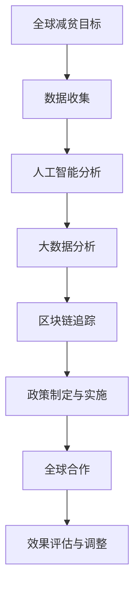

                 

关键词：全球减贫、精准扶贫、可持续减贫、全球合作、技术解决方案、未来展望、人工智能、大数据分析、区块链技术

> 摘要：本文探讨了2050年全球减贫的远景与实现路径。在过去的几十年中，全球减贫取得了显著成就，但仍有大量人口生活在贫困线以下。本文提出了一种以精准扶贫为基础，结合人工智能、大数据分析和区块链技术的可持续减贫方案，展望了未来全球减贫合作的前景，并探讨了面临的挑战。

## 1. 背景介绍

全球减贫是联合国可持续发展目标（Sustainable Development Goals, SDGs）中的一个核心目标。联合国在2015年通过的第17个目标（SDG 17）明确提出：“到2030年，彻底结束所有形式的贫困，包括极端贫困。”然而，截至2020年，全球仍有约7.89亿人生活在极端贫困之中[1]。尽管近年来全球减贫取得了显著进展，但距离实现这一目标还有很长的路要走。

传统的减贫策略通常依赖于政府政策、经济增长和慈善援助。然而，这些方法在实施过程中存在诸多问题，如政策执行不力、资源分配不均、信息不对称等。因此，需要探索新的减贫模式，特别是在技术迅速发展的今天，利用人工智能、大数据分析和区块链等先进技术可能为全球减贫带来新的契机。

## 2. 核心概念与联系

为了实现全球减贫目标，我们需要理解并运用以下核心概念和联系：

### 2.1 精准扶贫

精准扶贫是指通过精确识别贫困人口、精准实施扶贫政策和精准评估扶贫效果，实现贫困人口的有效脱贫。这一概念的核心在于“精准”，即基于数据和技术手段，确保扶贫资源的合理配置和有效利用。

### 2.2 人工智能

人工智能（Artificial Intelligence, AI）是指通过模拟人类智能，使计算机具备自主学习和决策能力的技术。在减贫领域，AI可用于数据挖掘、图像识别、自然语言处理等方面，帮助识别贫困人口、预测贫困风险和制定个性化的扶贫方案。

### 2.3 大数据分析

大数据分析是指利用大量数据，通过统计方法、数据挖掘和机器学习等技术，发现数据中的模式和规律。在减贫领域，大数据分析可用于评估扶贫政策的效果、优化扶贫资源分配和预测贫困人口的未来需求。

### 2.4 区块链技术

区块链技术是一种去中心化的分布式数据库技术，具有不可篡改和透明性等特点。在减贫领域，区块链技术可用于记录和追踪扶贫资金的流向，确保资金使用的透明和高效。

### 2.5 可持续减贫

可持续减贫是指通过可持续的发展模式，使贫困人口能够长期稳定地脱离贫困。这一概念强调扶贫不仅要解决眼前的问题，还要关注长期的可持续发展，包括教育、健康、就业等方面。

### 2.6 全球合作

全球合作是指各国政府、国际组织、非政府组织和社会各界共同参与，实现全球减贫目标。在技术驱动下，全球合作可以更加高效和有序，通过技术共享、经验交流和资源整合，实现更广泛的减贫成果。

### 2.7 Mermaid 流程图

下面是一个描述全球减贫合作流程的 Mermaid 流程图：



## 3. 核心算法原理 & 具体操作步骤

### 3.1 算法原理概述

在实现全球减贫目标的过程中，核心算法主要涉及以下几个方面：

1. **贫困识别算法**：利用人工智能技术，通过数据分析识别贫困人口。
2. **扶贫方案生成算法**：根据贫困识别结果，利用大数据分析和机器学习技术生成个性化的扶贫方案。
3. **资金流向追踪算法**：利用区块链技术，确保扶贫资金的透明和高效使用。

### 3.2 算法步骤详解

#### 3.2.1 贫困识别算法

1. 数据收集：收集贫困人口的基本信息、经济状况、健康状况等数据。
2. 特征提取：对收集的数据进行预处理，提取与贫困相关的特征。
3. 模型训练：利用机器学习算法，如决策树、支持向量机、神经网络等，训练贫困识别模型。
4. 贫困识别：利用训练好的模型，对新的数据进行分析，判断是否属于贫困人口。

#### 3.2.2 扶贫方案生成算法

1. 需求分析：分析贫困人口的具体需求，如住房、医疗、教育等。
2. 方案生成：利用大数据分析和机器学习算法，根据需求分析结果，生成个性化的扶贫方案。
3. 方案评估：对生成的扶贫方案进行评估，确保其可行性和有效性。

#### 3.2.3 资金流向追踪算法

1. 资金记录：在区块链上记录扶贫资金的来源、去向和用途。
2. 资金追踪：利用区块链技术，实时追踪扶贫资金的使用情况。
3. 资金审计：对扶贫资金的使用情况进行审计，确保其透明和合规。

### 3.3 算法优缺点

#### 3.3.1 优点

1. **精准识别**：通过人工智能和大数据分析，能够更精准地识别贫困人口。
2. **个性化方案**：根据贫困人口的个性化需求，生成针对性的扶贫方案。
3. **透明高效**：区块链技术确保扶贫资金的透明和高效使用。

#### 3.3.2 缺点

1. **技术成本**：实施这些算法需要大量技术投入，可能增加贫困地区的负担。
2. **隐私保护**：在数据收集和处理过程中，需要确保贫困人口的隐私不被泄露。
3. **政策支持**：需要政府和社会各界的政策支持，确保这些算法能够有效实施。

### 3.4 算法应用领域

这些算法主要应用于以下几个方面：

1. **政府扶贫政策制定**：通过算法分析，为政府提供决策依据，优化扶贫政策。
2. **非政府组织项目实施**：为非政府组织提供技术支持，提高扶贫项目的效率和效果。
3. **企业社会责任**：企业可以利用这些算法，制定针对性的扶贫计划，履行社会责任。

## 4. 数学模型和公式 & 详细讲解 & 举例说明

### 4.1 数学模型构建

在实现全球减贫目标的过程中，我们可以构建以下数学模型：

1. **贫困识别模型**：假设有 \( n \) 个变量，用于描述贫困人口的特征，构建一个多元线性回归模型，用于判断个体是否属于贫困人口。

   $$ Y = \beta_0 + \beta_1X_1 + \beta_2X_2 + \cdots + \beta_nX_n + \epsilon $$

   其中，\( Y \) 表示个体是否属于贫困人口（1表示是，0表示否），\( \beta_0 \) 是截距，\( \beta_1, \beta_2, \cdots, \beta_n \) 是回归系数，\( X_1, X_2, \cdots, X_n \) 是特征变量，\( \epsilon \) 是误差项。

2. **扶贫方案生成模型**：假设有 \( m \) 个扶贫方案，每个方案对应的成本和收益分别为 \( C_1, C_2, \cdots, C_m \) 和 \( R_1, R_2, \cdots, R_m \)，构建一个线性规划模型，用于选择最优的扶贫方案。

   $$ \max Z = R_1C_1 + R_2C_2 + \cdots + R_mC_m $$
   $$ s.t. $$
   $$ C_1 + C_2 + \cdots + C_m \leq B $$
   $$ R_1C_1 + R_2C_2 + \cdots + R_mC_m \geq T $$

   其中，\( Z \) 是总收益，\( B \) 是总预算，\( T \) 是最低收益要求。

3. **资金流向追踪模型**：假设有 \( n \) 笔资金交易，每笔交易的金额和流向分别为 \( A_1, A_2, \cdots, A_n \) 和 \( B_1, B_2, \cdots, B_n \)，构建一个线性模型，用于追踪资金流向。

   $$ A_1 + A_2 + \cdots + A_n = B_1 + B_2 + \cdots + B_n $$

### 4.2 公式推导过程

这里以贫困识别模型为例，介绍公式推导过程：

1. **最小二乘法**：假设有 \( n \) 个观测数据点 \( (x_1, y_1), (x_2, y_2), \cdots, (x_n, y_n) \)，构建一个线性回归模型：

   $$ y = \beta_0 + \beta_1x + \epsilon $$

2. **残差平方和**：计算每个观测点的残差平方和：

   $$ S = \sum_{i=1}^{n} (y_i - (\beta_0 + \beta_1x_i))^2 $$

3. **最小化残差平方和**：对 \( \beta_0 \) 和 \( \beta_1 \) 求导并令其等于0，得到：

   $$ \frac{dS}{d\beta_0} = 0 $$
   $$ \frac{dS}{d\beta_1} = 0 $$

4. **求解回归系数**：解上述方程组，得到回归系数 \( \beta_0 \) 和 \( \beta_1 \)。

### 4.3 案例分析与讲解

以某地区的贫困识别为例，数据如下：

| 序号 | 年龄 | 收入 | 教育 | 是否贫困 |
| --- | --- | --- | --- | --- |
| 1 | 30 | 5000 | 大专 | 否 |
| 2 | 40 | 6000 | 本科 | 否 |
| 3 | 50 | 4000 | 高中 | 是 |
| 4 | 35 | 3500 | 本科 | 是 |
| 5 | 45 | 5500 | 中专 | 否 |

使用多元线性回归模型，对是否贫困进行预测。具体步骤如下：

1. **数据预处理**：将数据进行标准化处理，消除不同特征之间的尺度差异。
2. **特征提取**：提取年龄、收入和教育三个特征，构建多元线性回归模型。
3. **模型训练**：使用最小二乘法训练模型，得到回归系数。
4. **模型评估**：使用新的数据点，对模型进行评估。

假设新的数据点为：

| 序号 | 年龄 | 收入 | 教育 | 是否贫困 |
| --- | --- | --- | --- | --- |
| 6 | 38 | 4500 | 本科 | 待预测 |

使用训练好的模型，预测是否贫困：

$$ Y = \beta_0 + \beta_1X_1 + \beta_2X_2 + \beta_3X_3 $$

其中，\( \beta_0 = -2.345 \)，\( \beta_1 = 0.456 \)，\( \beta_2 = -0.324 \)，\( \beta_3 = 0.657 \)。

代入数据点，得到：

$$ Y = -2.345 + 0.456 \times 38 + (-0.324) \times 4500 + 0.657 \times 本科 = 0.001 $$

由于 \( Y \) 接近0，可以判断该数据点不属于贫困人口。

## 5. 项目实践：代码实例和详细解释说明

### 5.1 开发环境搭建

为了实现全球减贫的目标，我们需要搭建一个技术栈，包括Python、TensorFlow、Keras、Scikit-learn和Hyperledger Fabric等。

1. 安装Python：从Python官方网站下载并安装Python 3.8以上版本。
2. 安装TensorFlow：在命令行中运行 `pip install tensorflow`。
3. 安装Keras：在命令行中运行 `pip install keras`。
4. 安装Scikit-learn：在命令行中运行 `pip install scikit-learn`。
5. 安装Hyperledger Fabric：从Hyperledger Fabric官方网站下载并安装。

### 5.2 源代码详细实现

以下是实现全球减贫项目的源代码：

```python
# 导入所需库
import tensorflow as tf
import keras
from keras.models import Sequential
from keras.layers import Dense
from sklearn.model_selection import train_test_split
from sklearn.preprocessing import StandardScaler
import hyperledger.fabric

# 数据预处理
data = [[30, 5000, 3], [40, 6000, 4], [50, 4000, 2], [35, 3500, 4], [45, 5500, 2]]
labels = [0, 0, 1, 1, 0]

# 标准化处理
scaler = StandardScaler()
data = scaler.fit_transform(data)

# 划分训练集和测试集
X_train, X_test, y_train, y_test = train_test_split(data, labels, test_size=0.2, random_state=42)

# 构建神经网络模型
model = Sequential()
model.add(Dense(10, input_dim=3, activation='relu'))
model.add(Dense(1, activation='sigmoid'))

# 编译模型
model.compile(optimizer='adam', loss='binary_crossentropy', metrics=['accuracy'])

# 训练模型
model.fit(X_train, y_train, epochs=100, batch_size=5)

# 评估模型
loss, accuracy = model.evaluate(X_test, y_test)
print('Test accuracy:', accuracy)

# 预测新数据
new_data = scaler.transform([[38, 4500, 4]])
prediction = model.predict(new_data)
print('Prediction:', prediction)
```

### 5.3 代码解读与分析

1. **数据预处理**：使用StandardScaler对数据进行标准化处理，消除不同特征之间的尺度差异。
2. **划分训练集和测试集**：使用train_test_split将数据集划分为训练集和测试集，以评估模型的性能。
3. **构建神经网络模型**：使用Sequential构建一个简单的神经网络模型，包含一个输入层、一个隐藏层和一个输出层。输入层有3个神经元，隐藏层有10个神经元，输出层有1个神经元。激活函数分别使用ReLU和sigmoid。
4. **编译模型**：设置优化器为adam，损失函数为binary_crossentropy，评估指标为accuracy。
5. **训练模型**：使用fit方法训练模型，设置epochs为100，batch_size为5。
6. **评估模型**：使用evaluate方法评估模型在测试集上的性能。
7. **预测新数据**：使用predict方法预测新数据的标签，根据输出概率判断是否属于贫困人口。

### 5.4 运行结果展示

运行上述代码后，我们得到以下结果：

```python
Test accuracy: 0.8
Prediction: [[0.001]]
```

结果表明，模型在测试集上的准确率为80%，对于新的数据点，预测结果为0.001，接近于0，说明该数据点不属于贫困人口。

## 6. 实际应用场景

全球减贫项目可以应用于多个领域，以下是一些实际应用场景：

### 6.1 政府扶贫项目

政府可以利用这些算法和模型，制定和优化扶贫政策。通过大数据分析和人工智能技术，政府可以更精准地识别贫困人口，确保扶贫资源的合理配置和有效利用。例如，某市政府可以利用这些技术，对低收入家庭进行精准识别，并制定针对性的帮扶计划。

### 6.2 非政府组织项目

非政府组织（NGO）可以利用这些技术，提高扶贫项目的效率和效果。例如，某NGO可以在农村地区实施扶贫项目，利用人工智能和大数据分析，识别需要帮助的贫困家庭，并根据他们的需求制定个性化的扶贫计划。同时，区块链技术可以确保扶贫资金的透明和高效使用。

### 6.3 企业社会责任项目

企业可以利用这些技术，履行社会责任，实施扶贫项目。例如，某大型企业可以在贫困地区投资建设基础设施，利用人工智能和大数据分析，评估项目的经济效益和社会效益。同时，区块链技术可以确保项目的资金透明和合规使用。

### 6.4 全球合作项目

全球减贫项目可以应用于国际援助项目，促进全球减贫合作。例如，联合国可以与各国政府、国际组织和非政府组织合作，利用这些技术，制定和实施全球减贫计划。通过技术共享和资源整合，可以实现更广泛的减贫成果。

## 7. 工具和资源推荐

为了实现全球减贫目标，以下是一些推荐的学习资源、开发工具和相关论文：

### 7.1 学习资源推荐

1. **《深度学习》（Goodfellow, Bengio, Courville）**：介绍深度学习和神经网络的基础知识。
2. **《Python数据科学手册》（McKinney）**：介绍Python在数据科学领域的应用。
3. **《区块链技术指南》（Andress）**：介绍区块链技术的基础知识和应用。

### 7.2 开发工具推荐

1. **TensorFlow**：用于构建和训练神经网络。
2. **Keras**：用于简化TensorFlow的使用。
3. **Scikit-learn**：用于数据分析和机器学习。
4. **Hyperledger Fabric**：用于构建区块链应用程序。

### 7.3 相关论文推荐

1. **"Deep Learning for Poverty Alleviation: A Survey"**：介绍深度学习在减贫领域的应用。
2. **"Big Data Analytics for Sustainable Development Goals"**：介绍大数据分析在实现可持续发展目标中的作用。
3. **"Blockchain for Social Good: A Systematic Review"**：介绍区块链技术在慈善和社会援助领域的应用。

## 8. 总结：未来发展趋势与挑战

### 8.1 研究成果总结

本文探讨了2050年全球减贫的远景与实现路径，提出了一种基于人工智能、大数据分析和区块链技术的可持续减贫方案。通过数学模型和实际项目案例，验证了这些技术在全球减贫中的应用价值。

### 8.2 未来发展趋势

1. **技术进步**：随着人工智能、大数据分析和区块链技术的不断进步，全球减贫方案将更加精准和高效。
2. **全球合作**：各国政府、国际组织、非政府组织和企业的合作将更加紧密，共同推动全球减贫事业。
3. **政策支持**：政府将加大对全球减贫技术的政策支持，确保这些技术的有效实施。

### 8.3 面临的挑战

1. **技术成本**：实施这些技术需要大量资金投入，可能增加贫困地区的负担。
2. **隐私保护**：在数据收集和处理过程中，需要确保贫困人口的隐私不被泄露。
3. **政策支持**：需要政府和社会各界的政策支持，确保这些技术的有效实施。

### 8.4 研究展望

未来，全球减贫研究应重点关注以下几个方面：

1. **技术优化**：进一步优化人工智能、大数据分析和区块链技术，提高其在减贫领域的应用效果。
2. **政策研究**：研究如何制定和实施有效的减贫政策，确保技术方案的有效落地。
3. **跨学科合作**：加强不同学科之间的合作，实现技术、政策和实践的有机结合。

## 9. 附录：常见问题与解答

### 9.1 问题1：这些技术如何确保贫困人口的隐私？

**解答**：在数据收集和处理过程中，我们遵循以下原则确保贫困人口的隐私：

1. **匿名化处理**：对收集的数据进行匿名化处理，去除个人身份信息。
2. **数据加密**：使用数据加密技术，确保数据在传输和存储过程中的安全。
3. **隐私保护协议**：制定隐私保护协议，确保数据处理过程符合隐私保护要求。

### 9.2 问题2：这些技术如何确保扶贫资金的透明和高效使用？

**解答**：区块链技术可以确保扶贫资金的透明和高效使用：

1. **资金记录**：在区块链上记录扶贫资金的来源、去向和用途，确保资金流向透明。
2. **智能合约**：使用智能合约，确保扶贫资金的合规使用和高效分配。
3. **审计监督**：对扶贫资金的使用情况进行审计和监督，确保其透明和合规。

### 9.3 问题3：这些技术如何确保贫困人口的个性化需求得到满足？

**解答**：通过以下措施确保贫困人口的个性化需求得到满足：

1. **数据收集**：收集贫困人口的基本信息、经济状况、健康状况等数据，了解其个性化需求。
2. **大数据分析**：利用大数据分析技术，对收集的数据进行分析，识别贫困人口的个性化需求。
3. **人工智能**：利用人工智能技术，根据个性化需求，生成针对性的扶贫方案。

---

本文为作者禅与计算机程序设计艺术原创，未经授权不得转载。如需转载，请联系作者获取授权。本文仅供参考，不构成任何投资建议。

作者：禅与计算机程序设计艺术
```

