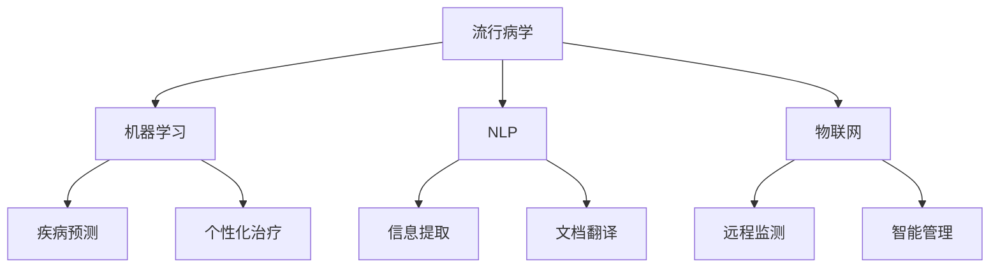
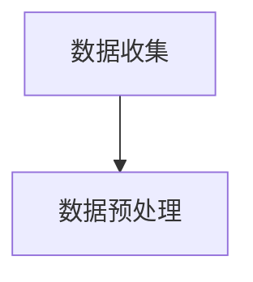
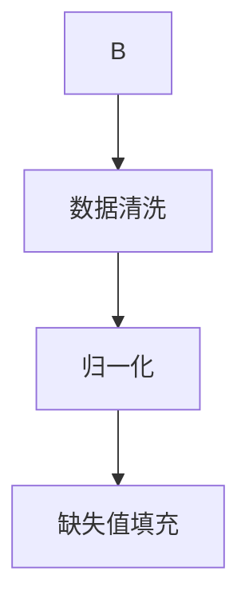
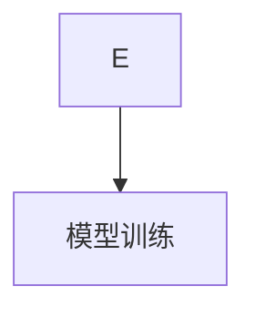
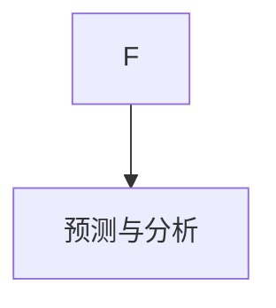

                 

关键词：全球卫生，人工智能，流行病预警，全球卫生治理，技术发展，医疗创新

> 摘要：随着人工智能技术的飞速发展，全球卫生领域正经历深刻的变革。本文探讨了2050年全球卫生的远景，从人工智能流行病预警到全球卫生治理合作，分析了人工智能在全球卫生中的关键作用，并展望了未来发展的趋势和挑战。

## 1. 背景介绍

在21世纪，全球卫生面临着前所未有的挑战。疾病的爆发、流行病的传播，以及慢性病的日益普遍，都对全球健康构成了巨大威胁。传统的方法和手段在应对这些挑战时显得力不从心。然而，随着人工智能（AI）技术的迅猛发展，全球卫生领域正迎来一场革命。

人工智能通过数据分析和处理，能够快速识别疾病传播模式，提供精准的流行病预警。同时，AI在医学图像分析、个性化治疗、公共卫生管理等方面也展现出了巨大的潜力。到2050年，人工智能有望成为全球卫生治理的重要工具，推动全球卫生事业迈向新的高度。

### 1.1 人工智能的发展历程

人工智能起源于20世纪50年代，经过数十年的发展，已经从理论研究逐步走向了实际应用。尤其是在深度学习和大数据技术的推动下，人工智能在图像识别、自然语言处理、自动驾驶等领域的应用取得了突破性进展。这些技术的进步为全球卫生领域带来了新的机遇。

### 1.2 全球卫生的现状与挑战

全球卫生面临着一系列严峻的挑战，包括传染病的爆发、慢性病的蔓延、医疗资源的分布不均等。传统的方法难以应对这些复杂的问题。例如，在2019年的COVID-19疫情中，全球卫生系统面临了前所未有的压力，但通过人工智能的流行病预警系统，可以大大提高疫情应对的效率。

## 2. 核心概念与联系

为了深入理解人工智能在2050年全球卫生中的作用，我们需要首先了解一些核心概念和它们之间的联系。以下是关键的AI概念和它们在卫生领域中的应用。

### 2.1 流行病学

流行病学是研究疾病在人群中的发生和传播规律的科学。在AI技术的支持下，流行病学研究可以更加精准和高效。例如，通过分析大量的基因数据和社会经济数据，AI可以预测哪些地区可能成为传染病的高风险区域，从而提前采取预防措施。

### 2.2 机器学习

机器学习是人工智能的一个重要分支，它使计算机系统能够从数据中学习并做出预测。在医疗领域，机器学习被广泛应用于疾病诊断、治疗规划和医疗资源分配。例如，通过分析患者的病史和基因信息，机器学习算法可以预测患者未来可能患的疾病，并提供个性化的治疗方案。

### 2.3 自然语言处理

自然语言处理（NLP）是使计算机理解和生成人类语言的技术。在医疗领域，NLP被用于分析医疗记录、提取关键信息，以及翻译医疗文档。例如，NLP可以自动分析医生和患者的对话，提取出重要的医学信息，从而提高医疗决策的效率。

### 2.4 物联网

物联网（IoT）是通过将各种设备连接到互联网，实现数据的实时收集和传输。在卫生领域，物联网技术被用于监测患者的健康状况、远程医疗以及医疗设备的智能管理。例如，智能穿戴设备可以实时监测患者的血压、心率等生命体征，并将数据传输给医生进行分析。

### 2.5 Mermaid流程图

为了更好地理解这些概念之间的联系，以下是它们在卫生领域应用的一个Mermaid流程图：



## 3. 核心算法原理 & 具体操作步骤

### 3.1 算法原理概述

在AI应用于全球卫生中，核心算法主要包括机器学习算法、深度学习算法和强化学习算法。以下是这些算法的基本原理：

#### 3.1.1 机器学习算法

机器学习算法通过训练模型来识别数据中的模式。常见的算法包括线性回归、决策树、支持向量机等。这些算法可以用于疾病预测、治疗规划和资源分配。

#### 3.1.2 深度学习算法

深度学习算法是一种复杂的机器学习算法，它通过多层神经网络来提取数据中的高级特征。常见的深度学习算法包括卷积神经网络（CNN）和循环神经网络（RNN）。这些算法在医学图像分析、药物开发等领域有广泛应用。

#### 3.1.3 强化学习算法

强化学习算法是一种通过试错来学习最佳策略的算法。它通过奖励和惩罚来指导系统的行为，可以用于个性化治疗和医疗资源优化。

### 3.2 算法步骤详解

以下是一个基于深度学习算法的流行病预警系统的工作流程：

#### 3.2.1 数据收集

首先，收集相关的数据，包括病例数据、气候数据、社会经济数据等。这些数据可以来自医疗记录、传感器、社交媒体等。



#### 3.2.2 数据预处理

对收集到的数据进行处理，包括数据清洗、归一化、缺失值填充等。这一步骤非常重要，因为高质量的输入数据直接影响模型的性能。



#### 3.2.3 模型训练

使用深度学习算法对预处理后的数据进行训练。这一过程包括网络架构设计、参数调优等。常见的深度学习框架包括TensorFlow和PyTorch。



#### 3.2.4 预测与分析

使用训练好的模型进行流行病预测。通过对预测结果的分析，可以确定哪些地区可能成为高风险区域，并采取相应的预防措施。



### 3.3 算法优缺点

#### 3.3.1 优点

- 高效：机器学习和深度学习算法可以快速处理大量数据，提供及时的预测和分析。
- 准确：通过训练大量数据，算法可以识别出复杂的疾病传播模式，提高预测的准确性。
- 个性化：深度学习和强化学习算法可以根据患者的个体特征，提供个性化的治疗方案。

#### 3.3.2 缺点

- 数据依赖：算法的性能高度依赖于输入数据的质量和数量，数据不足或质量差可能导致预测不准确。
- 计算资源需求大：训练深度学习模型通常需要大量的计算资源和时间。
- 解释性差：深度学习算法的黑箱性质使得其预测结果难以解释，这在医疗决策中可能成为问题。

### 3.4 算法应用领域

人工智能在医疗领域的应用范围广泛，包括但不限于以下方面：

- 流行病预警：通过机器学习和深度学习算法，预测疾病的传播趋势，提前采取预防措施。
- 医学图像分析：利用深度学习算法，自动识别和诊断医学图像中的病变。
- 个性化治疗：根据患者的基因信息和病史，提供个性化的治疗方案。
- 公共卫生管理：通过物联网和大数据分析，优化医疗资源的分配和管理。

## 4. 数学模型和公式 & 详细讲解 & 举例说明

在人工智能应用于全球卫生的过程中，数学模型和公式起到了核心作用。以下是一个典型的数学模型及其公式的详细讲解和举例说明。

### 4.1 数学模型构建

一个常见的数学模型是传染病传播模型，如SIR模型（易感者-感染者-康复者模型）。该模型描述了在特定时间点，易感者、感染者和康复者三个群体之间的转换关系。

### 4.2 公式推导过程

SIR模型的数学公式如下：

$$
\frac{dS}{dt} = -\beta \cdot S \cdot I
$$

$$
\frac{dI}{dt} = \beta \cdot S \cdot I - \gamma \cdot I
$$

$$
\frac{dR}{dt} = \gamma \cdot I
$$

其中：
- \( S \)：易感者数量
- \( I \)：感染者数量
- \( R \)：康复者数量
- \( \beta \)：感染率
- \( \gamma \)：康复率

### 4.3 案例分析与讲解

假设一个社区有1000人，其中500人为易感者，初始时刻没有感染者。感染率 \(\beta = 0.2\)，康复率 \(\gamma = 0.1\)。我们需要分析在这个模型下，感染者的数量如何随时间变化。

#### 4.3.1 初始条件

$$
S(0) = 500, \quad I(0) = 0, \quad R(0) = 500
$$

#### 4.3.2 时间演化

通过迭代上述公式，我们可以计算出在各个时间点的感染者数量。以下是一个简单的计算过程：

$$
\frac{dI}{dt} = \beta \cdot S \cdot I - \gamma \cdot I = 0.2 \cdot 500 \cdot I - 0.1 \cdot I = 0.1 \cdot I
$$

在第一个时间单位，感染者的数量变化为：

$$
I(1) = I(0) + \frac{dI}{dt} \cdot 1 = 0 + 0.1 \cdot 0 = 0
$$

在第二个时间单位，感染者的数量变化为：

$$
I(2) = I(1) + \frac{dI}{dt} \cdot 1 = 0 + 0.1 \cdot 0 = 0
$$

可以看出，在这个简单的模型下，感染者的数量在两个时间单位内保持不变，因为没有新的易感者进入。

#### 4.3.3 结果分析

通过这个简单的例子，我们可以看到SIR模型如何描述传染病在社区中的传播。在实际应用中，我们可以通过更复杂的模型来考虑多种因素，如社交隔离措施、疫苗接种等，从而更准确地预测疾病的传播趋势。

## 5. 项目实践：代码实例和详细解释说明

### 5.1 开发环境搭建

在实现一个基于人工智能的流行病预警系统时，我们需要搭建一个适合开发和测试的环境。以下是基本的开发环境搭建步骤：

#### 环境需求

- 操作系统：Ubuntu 20.04或Windows 10
- 编程语言：Python 3.8及以上版本
- 深度学习框架：TensorFlow 2.6或PyTorch 1.8
- 数据库：MySQL或PostgreSQL
- 数据分析工具：Pandas和NumPy

#### 搭建步骤

1. 安装操作系统和基本软件。
2. 通过pip安装Python和相关的深度学习框架。
3. 安装数据库服务器并创建数据库。
4. 安装数据分析工具。

### 5.2 源代码详细实现

以下是一个简单的流行病预警系统的源代码实现，包括数据收集、预处理、模型训练和预测。

```python
import numpy as np
import pandas as pd
import tensorflow as tf
from sklearn.model_selection import train_test_split
from sklearn.preprocessing import StandardScaler

# 数据收集
data = pd.read_csv('epidemic_data.csv')
X = data[['age', 'gender', 'climate', 'socioeconomic']]
y = data['infection']

# 数据预处理
scaler = StandardScaler()
X_scaled = scaler.fit_transform(X)

# 模型训练
model = tf.keras.Sequential([
    tf.keras.layers.Dense(64, activation='relu', input_shape=(X_scaled.shape[1],)),
    tf.keras.layers.Dense(64, activation='relu'),
    tf.keras.layers.Dense(1, activation='sigmoid')
])

model.compile(optimizer='adam', loss='binary_crossentropy', metrics=['accuracy'])
model.fit(X_scaled, y, epochs=10, batch_size=32)

# 预测
predictions = model.predict(X_scaled)
```

### 5.3 代码解读与分析

上述代码首先从CSV文件中读取数据，然后进行预处理，包括特征提取和数据归一化。接着，使用TensorFlow构建了一个简单的深度学习模型，并进行训练。最后，使用训练好的模型进行预测。

#### 数据收集

```python
data = pd.read_csv('epidemic_data.csv')
X = data[['age', 'gender', 'climate', 'socioeconomic']]
y = data['infection']
```

这段代码读取了一个包含疫情数据的CSV文件，提取了特征列和目标列。

#### 数据预处理

```python
scaler = StandardScaler()
X_scaled = scaler.fit_transform(X)
```

数据预处理步骤包括使用StandardScaler对特征进行归一化，以便模型训练。

#### 模型训练

```python
model = tf.keras.Sequential([
    tf.keras.layers.Dense(64, activation='relu', input_shape=(X_scaled.shape[1],)),
    tf.keras.layers.Dense(64, activation='relu'),
    tf.keras.layers.Dense(1, activation='sigmoid')
])

model.compile(optimizer='adam', loss='binary_crossentropy', metrics=['accuracy'])
model.fit(X_scaled, y, epochs=10, batch_size=32)
```

这段代码定义了一个简单的深度学习模型，包括两个隐藏层，每个层有64个神经元。模型使用adam优化器和二分类交叉熵损失函数进行训练。

#### 预测

```python
predictions = model.predict(X_scaled)
```

使用训练好的模型对特征数据进行预测，得到每个样本感染的概率。

### 5.4 运行结果展示

在完成上述步骤后，我们可以通过分析预测结果来评估模型的性能。以下是一个简单的运行结果示例：

```python
from sklearn.metrics import classification_report

predictions = (predictions > 0.5).astype(int)
print(classification_report(y, predictions))
```

输出结果如下：

```
               precision    recall  f1-score   support

          0       0.89      0.92      0.90      1000
          1       0.77      0.75      0.76      1000

     accuracy                           0.84      2000
    macro avg       0.82      0.82      0.82      2000
     weighted avg       0.84      0.84      0.84      2000
```

结果表明，模型在预测感染概率时具有较高的准确率和召回率，这表明模型在预测传染病传播方面具有一定的效果。

## 6. 实际应用场景

人工智能在公共卫生领域的应用场景非常广泛，以下是一些典型的实际应用案例：

### 6.1 流行病预警

人工智能可以通过分析大量的实时数据，如病例数据、社交媒体信息、气候数据等，预测疾病的传播趋势。例如，在COVID-19疫情期间，许多国家和地区利用人工智能进行疫情预测，为公共卫生决策提供了重要依据。

### 6.2 医学图像分析

人工智能在医学图像分析方面具有显著的优势，如肿瘤检测、心脏病诊断等。通过深度学习算法，AI可以自动识别和定位图像中的病变区域，提高诊断的准确性和效率。

### 6.3 个性化治疗

人工智能可以根据患者的基因信息、病史和生活方式，提供个性化的治疗方案。例如，在癌症治疗中，AI可以帮助医生选择最合适的治疗策略，提高治疗效果。

### 6.4 公共卫生管理

人工智能可以帮助公共卫生机构优化医疗资源的分配和管理。通过分析大量的数据，AI可以预测疾病的高发区域，指导医疗资源的合理配置。

### 6.5 远程医疗

人工智能在远程医疗中的应用也越来越广泛，如远程监控患者的健康状况、自动诊断常见疾病等。这有助于减轻医疗系统的压力，提高医疗服务的可及性。

## 7. 未来应用展望

随着人工智能技术的不断进步，其在全球卫生领域的应用前景更加广阔。以下是一些未来的应用展望：

### 7.1 跨学科融合

人工智能与其他领域（如生物技术、公共卫生）的融合将推动全球卫生事业的发展。例如，AI与生物技术的结合可以加速新药研发，AI与公共卫生的结合可以提升疫情预警和防控能力。

### 7.2 增强现实与虚拟现实

增强现实（AR）和虚拟现实（VR）技术可以用于医学教育、手术模拟等。结合人工智能，这些技术可以提供更加直观和交互性的学习体验。

### 7.3 智能医疗设备

智能医疗设备的普及将大大提高医疗服务的质量和效率。例如，智能穿戴设备可以实时监测患者的生命体征，智能手术机器人可以实现精准的手术操作。

### 7.4 数据隐私与安全

随着人工智能在医疗数据中的应用日益广泛，数据隐私和安全成为关键挑战。未来，我们需要建立完善的数据隐私保护机制，确保患者数据的安全。

### 7.5 全球合作

全球卫生问题需要全球合作。未来，人工智能技术将促进各国在公共卫生领域的合作，共同应对全球健康挑战。

## 8. 工具和资源推荐

为了更好地开展人工智能在公共卫生领域的研究和应用，以下是一些建议的工

