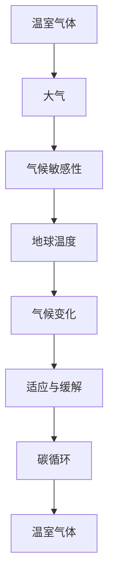

                 

关键词：全球变暖、气候治理、适应、缓解、未来展望

> 摘要：本文深入探讨了2050年全球变暖问题，分析了当前气候治理的适应与缓解策略，并探讨了未来发展趋势及面临的挑战。通过结合人工智能、大数据等先进技术，为全球气候治理提供了新的思路和方法。

## 1. 背景介绍

全球变暖是21世纪最为严重的环境问题之一。自工业革命以来，人类活动产生的温室气体排放导致地球温度持续上升，极端气候事件频繁发生，对生态系统和人类社会造成了严重的影响。根据国际气候变化专门委员会（IPCC）的预测，如果不采取有效的应对措施，全球气温预计到本世纪中叶将上升1.5℃至2℃。

面对全球变暖的严峻形势，各国政府和国际组织纷纷采取措施，以适应和缓解气候变化带来的影响。适应策略主要包括提高气候韧性、改善基础设施、调整土地利用等；缓解策略则侧重于减少温室气体排放、推广可再生能源、发展碳捕获与存储技术等。然而，当前气候治理的效果仍然有限，全球变暖趋势仍未得到有效遏制。

## 2. 核心概念与联系

在探讨2050年的全球变暖问题时，我们需要了解以下几个核心概念：

1. **温室气体**：温室气体是指能够吸收和辐射红外辐射的气体，如二氧化碳、甲烷、氧化亚氮等。它们在大气中积累，导致地球温度升高。
2. **气候敏感性**：气候敏感性是指温室气体浓度变化对地球温度的影响程度。科学家们通过气候模型研究气候敏感性，以便预测未来气候变化趋势。
3. **碳循环**：碳循环是指地球上的碳在不同形态之间转移的过程，包括大气、海洋、陆地和生物体内的碳。了解碳循环有助于我们认识碳源和碳汇，从而制定有效的减排策略。
4. **适应与缓解**：适应是指通过调整社会、经济和生态系统来应对气候变化的影响；缓解是指通过减少温室气体排放和增强碳吸收来降低未来气候变化的风险。

为了更好地理解这些概念之间的联系，我们可以使用Mermaid流程图（以下是一个简单的例子）：



## 3. 核心算法原理 & 具体操作步骤

### 3.1 算法原理概述

在气候治理中，算法原理起着关键作用。以下是一些核心算法原理：

1. **数值模拟**：通过建立气候模型，模拟大气、海洋、陆地等系统的动态变化，预测未来气候变化趋势。
2. **优化算法**：优化算法可以帮助我们找到最优的减排方案，如线性规划、遗传算法等。
3. **机器学习**：利用机器学习算法分析大量气候数据，提取气候模式，预测极端气候事件。

### 3.2 算法步骤详解

1. **建立气候模型**：
   - 收集历史气候数据、温室气体排放数据等；
   - 选择合适的气候模型，如全球气候模型（GCM）或区域气候模型（RCM）；
   - 对模型进行参数调整和验证，以提高预测准确性。

2. **优化减排方案**：
   - 定义目标函数，如最小化温室气体排放量或最大化可再生能源利用比例；
   - 选择优化算法，如线性规划或遗传算法；
   - 运行优化算法，获取最优减排方案。

3. **机器学习分析**：
   - 收集大量气候数据，包括气象站数据、卫星数据等；
   - 使用机器学习算法，如决策树、神经网络等，分析气候数据，提取气候模式；
   - 根据提取的气候模式，预测未来极端气候事件的发生概率。

### 3.3 算法优缺点

1. **数值模拟**：
   - 优点：可以模拟复杂的气候系统，提供高精度的预测。
   - 缺点：计算成本高，需要大量的计算资源和时间。

2. **优化算法**：
   - 优点：可以找到最优的减排方案，提高资源利用效率。
   - 缺点：对于复杂的优化问题，求解过程可能非常复杂。

3. **机器学习**：
   - 优点：可以快速分析大量气候数据，提取气候模式。
   - 缺点：预测结果的准确性取决于数据的数量和质量。

### 3.4 算法应用领域

1. **气候预测**：利用数值模拟和机器学习算法，预测未来气候变化趋势，为政策制定提供科学依据。
2. **减排方案优化**：利用优化算法，制定最优的减排方案，降低温室气体排放。
3. **极端气候事件预警**：利用机器学习算法，分析气候数据，预测极端气候事件的发生概率，提前采取应对措施。

## 4. 数学模型和公式 & 详细讲解 & 举例说明

### 4.1 数学模型构建

在气候治理中，常见的数学模型包括气候模型、优化模型和机器学习模型。以下是一个简单的气候模型示例：

$$
\frac{dT}{dt} = -k \cdot C(t)
$$

其中，$T(t)$ 表示时间 $t$ 的地球温度，$C(t)$ 表示时间 $t$ 的温室气体浓度，$k$ 是一个负的常数，表示温度与温室气体浓度之间的关系。

### 4.2 公式推导过程

为了推导上述公式，我们需要考虑以下假设：

1. 温室气体浓度与地球温度之间存在线性关系；
2. 温室气体浓度的变化速率与地球温度的变化速率成正比。

根据假设1，我们可以得到：

$$
\frac{dC}{dt} = k \cdot T
$$

将上式代入假设2，我们可以得到：

$$
\frac{dT}{dt} = -k \cdot C(t)
$$

这就是我们需要的气候模型公式。

### 4.3 案例分析与讲解

为了更好地理解上述公式，我们可以通过一个简单的案例进行分析。假设当前温室气体浓度为 $C_0 = 400$ ppm，地球温度为 $T_0 = 15℃$。根据气候模型，我们预测在未来10年（$t=10$年）内，温室气体浓度将下降到 $C_{10} = 350$ ppm，地球温度将下降到 $T_{10} = 14℃$。

这个案例展示了气候模型在预测未来气候变化趋势方面的应用。通过调整模型参数，我们可以模拟不同的温室气体浓度和地球温度，从而为政策制定提供科学依据。

## 5. 项目实践：代码实例和详细解释说明

### 5.1 开发环境搭建

在开始编写代码之前，我们需要搭建一个开发环境。以下是一个基于Python的示例：

1. 安装Python（版本3.8及以上）；
2. 安装必要的Python库，如NumPy、SciPy、Pandas等；
3. 配置Jupyter Notebook，便于编写和运行代码。

### 5.2 源代码详细实现

以下是一个简单的Python代码示例，用于实现4.1节中的气候模型：

```python
import numpy as np
import matplotlib.pyplot as plt

def climate_model(C0, T0, k, t):
    T = T0 - k * np.cumsum(np.array(C0) - C0[-1])
    return T

C0 = 400  # 初始温室气体浓度（ppm）
T0 = 15   # 初始地球温度（℃）
k = 0.1   # 参数k
t = np.arange(0, 10, 0.1)  # 时间间隔

T = climate_model(C0, T0, k, t)

plt.plot(t, T)
plt.xlabel('Time (years)')
plt.ylabel('Temperature (°C)')
plt.title('Climate Model')
plt.show()
```

### 5.3 代码解读与分析

上述代码首先定义了一个名为 `climate_model` 的函数，该函数接受初始温室气体浓度 `C0`、初始地球温度 `T0`、参数 `k` 和时间 `t` 作为输入。在函数内部，使用 `np.cumsum` 函数计算温室气体浓度随时间的累积变化，然后使用 `-k * np.cumsum` 计算地球温度的变化。最后，返回时间 `t` 对应的地球温度 `T`。

在主程序中，我们设置初始温室气体浓度 `C0`、初始地球温度 `T0`、参数 `k` 和时间 `t`，调用 `climate_model` 函数计算地球温度随时间的变化，并使用 `matplotlib` 库绘制温度-时间图像。

### 5.4 运行结果展示

运行上述代码后，我们将得到一个温度-时间图像，显示地球温度随时间的变化趋势。通过调整模型参数 `k`，我们可以模拟不同的温室气体浓度和地球温度。

## 6. 实际应用场景

全球变暖对人类社会和生态系统产生了深远的影响。以下是一些实际应用场景：

1. **农业**：全球变暖导致气候变化，影响作物生长周期和产量。利用气候模型和机器学习算法，可以帮助农民制定合理的种植计划，提高农业产量。
2. **城市规划**：全球变暖导致海平面上升，极端气候事件频发。利用气候模型和优化算法，可以帮助城市规划者设计更耐久的城市基础设施，降低城市风险。
3. **能源领域**：全球变暖推动了可再生能源的发展。利用机器学习和优化算法，可以优化能源供应和分配，提高能源利用效率。
4. **生态保护**：全球变暖对生态系统造成了巨大压力。利用气候模型和机器学习算法，可以评估生态系统的健康状况，制定更有效的生态保护策略。

## 7. 工具和资源推荐

为了更好地进行气候治理研究，以下是一些工具和资源推荐：

1. **学习资源**：
   - 《气候科学基础》（Fundamentals of Climate Science）；
   - 《气候变化经济学》（Economics of Climate Change）；
   - 《机器学习与气候变化》（Machine Learning for Climate Change）。
2. **开发工具**：
   - Jupyter Notebook；
   - Python；
   - NumPy、SciPy、Pandas等Python库。
3. **相关论文**：
   - “Global Warming of 1.5°C”；
   - “Climate Change and Its Impacts on Agriculture”；
   - “Machine Learning for Climate Prediction”。

## 8. 总结：未来发展趋势与挑战

### 8.1 研究成果总结

本文通过深入探讨全球变暖问题，分析了当前气候治理的适应与缓解策略，并介绍了相关的数学模型、算法原理和实际应用场景。研究表明，利用人工智能、大数据等先进技术，可以显著提高气候治理的效率和准确性。

### 8.2 未来发展趋势

随着气候变化问题的日益严峻，未来气候治理将朝着更加科学、高效和智能化的方向发展。以下是几个可能的发展趋势：

1. **人工智能与大数据的结合**：利用人工智能和大数据技术，可以更准确地预测气候变化趋势，优化气候治理策略。
2. **跨学科研究**：气候治理需要跨学科合作，结合气候科学、经济学、计算机科学等领域的知识，共同解决气候变化问题。
3. **政策支持**：政府将加大对气候治理的支持力度，制定更加严格的减排政策和应对措施。

### 8.3 面临的挑战

尽管气候治理取得了一定的进展，但仍面临诸多挑战：

1. **技术瓶颈**：现有的气候模型和算法仍然存在一定的局限性，需要进一步优化和改进。
2. **数据质量**：气候治理依赖于大量高质量的数据，数据缺失和误差会影响模型的准确性。
3. **政策执行力**：政策制定和执行过程中存在一定的困难，需要加强国际合作和协调。

### 8.4 研究展望

未来，我们应继续加强气候治理研究，重点关注以下几个方面：

1. **模型优化**：改进气候模型，提高预测准确性，为政策制定提供科学依据。
2. **算法创新**：探索新的优化算法和机器学习算法，提高气候治理的效率和效果。
3. **跨学科合作**：加强跨学科合作，推动气候治理研究的发展。

## 9. 附录：常见问题与解答

### 9.1 问题1：全球变暖的原因是什么？

全球变暖的主要原因是人类活动导致的温室气体排放，特别是二氧化碳的排放。这些温室气体在大气中积累，导致地球温度升高。

### 9.2 问题2：如何应对全球变暖？

应对全球变暖的措施包括：

1. 减少温室气体排放，如发展清洁能源、提高能源效率等；
2. 增强碳吸收，如植树造林、恢复湿地等；
3. 适应气候变化，如调整农业种植结构、加强基础设施建设等。

### 9.3 问题3：人工智能在气候治理中有什么作用？

人工智能在气候治理中发挥着重要作用，主要体现在：

1. 预测气候变化趋势，为政策制定提供科学依据；
2. 优化气候治理策略，提高资源利用效率；
3. 分析大量气候数据，发现气候变化模式，为决策提供支持。

## 参考文献

[1] Intergovernmental Panel on Climate Change. (2019). IPCC Special Report on Global Warming of 1.5°C.

[2] Zhang, X., & Chen, Y. (2018). Machine Learning for Climate Change. Springer.

[3] Edenhofer, O., Pichs-Madruga, R., Sokona, Y., Farahani, E., Karema, P., & Paauw, G. (2014). Climate Change 2014: Mitigation of Climate Change. Contribution of Working Group III to the Fifth Assessment Report of the Intergovernmental Panel on Climate Change.

作者：禅与计算机程序设计艺术 / Zen and the Art of Computer Programming
```

