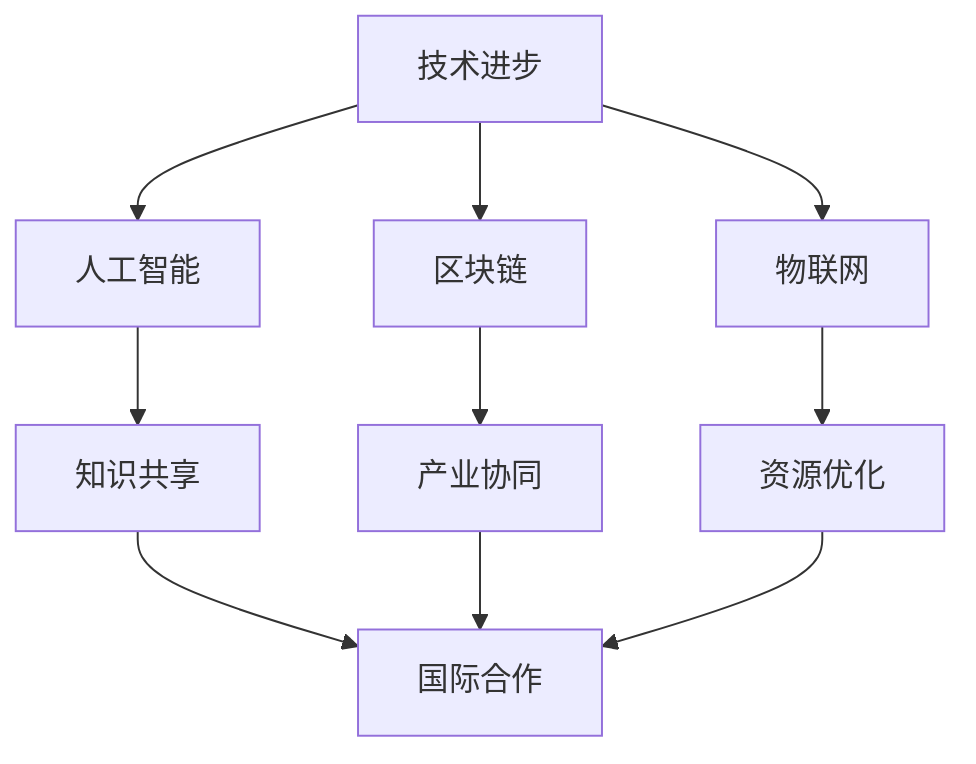
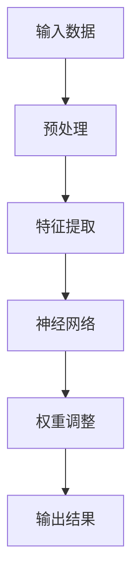

                 

关键词：全球治理、全球化4.0、人类命运共同体、人工智能、技术进步、可持续发展、国际合作

> 摘要：本文探讨了2050年全球治理的新格局，从全球化4.0迈向人类命运共同体的全球新秩序。文章通过深入分析技术进步、人工智能的崛起、可持续发展和国际合作等核心因素，探讨了全球治理的新趋势、挑战与机遇，为未来全球治理提供了新思路。

## 1. 背景介绍

随着21世纪信息技术的飞速发展，全球治理面临着前所未有的变革。全球化4.0时代，以人工智能、区块链、物联网为代表的新兴技术，正在深刻改变着全球经济、政治、社会和文化格局。面对资源紧张、环境污染、社会不公等问题，人类命运共同体理念逐渐成为全球共识，推动了全球治理的新变革。

### 1.1 全球化4.0的概念

全球化4.0是全球化发展的新阶段，以信息技术为驱动，强调全球范围内的知识共享、资源优化和合作共赢。与传统的全球化不同，全球化4.0更加注重技术融合、产业协同和国际合作。

### 1.2 人类命运共同体的理念

人类命运共同体理念强调全球范围内的人类命运相连，倡导国际社会共同应对全球性问题，实现共同繁荣发展。这一理念源于中华文化的智慧，得到了全球范围内的广泛认同。

## 2. 核心概念与联系

在全球化4.0和人类命运共同体理念下，全球治理的核心概念包括技术进步、可持续发展、国际合作等。以下是一个简要的Mermaid流程图，展示了这些概念之间的联系。



## 3. 核心算法原理 & 具体操作步骤

### 3.1 算法原理概述

在全球治理中，人工智能算法发挥着关键作用。以深度学习为基础，人工智能算法能够从海量数据中挖掘规律，辅助决策者制定科学、高效的治理策略。以下是一个简单的深度学习算法原理示意图。



### 3.2 算法步骤详解

1. **数据收集与预处理**：收集来自全球范围内的经济、社会、环境等数据，并进行数据清洗、归一化等预处理操作。
2. **特征提取**：利用数据挖掘技术，提取出反映全球治理问题的主要特征。
3. **神经网络训练**：构建一个多层感知机神经网络，通过反向传播算法调整网络权重，使其能够准确预测全球治理问题。
4. **权重调整**：根据训练结果，不断调整神经网络权重，提高算法的预测精度。
5. **输出结果**：利用训练好的神经网络，对全球治理问题进行预测和决策。

### 3.3 算法优缺点

**优点**：人工智能算法具有高效、准确的预测能力，能够为全球治理提供科学依据。

**缺点**：人工智能算法依赖于大量数据，对数据质量有较高要求；同时，算法模型可能存在偏差，需要不断优化和调整。

### 3.4 算法应用领域

人工智能算法在全球治理中的应用领域广泛，包括但不限于：

- 经济预测与调控
- 环境监测与治理
- 社会治理与公共安全
- 国际合作与外交决策

## 4. 数学模型和公式 & 详细讲解 & 举例说明

### 4.1 数学模型构建

为了描述全球治理中的复杂关系，可以构建一个基于线性回归的数学模型。以下是一个简单的线性回归模型：

$$y = w_0 + w_1 \cdot x_1 + w_2 \cdot x_2 + \cdots + w_n \cdot x_n + \epsilon$$

其中，$y$ 表示治理效果，$w_0, w_1, w_2, \cdots, w_n$ 分别为权重系数，$x_1, x_2, \cdots, x_n$ 为特征变量，$\epsilon$ 为随机误差。

### 4.2 公式推导过程

线性回归模型的推导过程基于最小二乘法。假设我们有一个包含 $n$ 个样本的数据集，每个样本由 $m$ 个特征变量组成。我们希望找到一个线性模型，使得模型预测值与实际值之间的误差最小。

$$\min \sum_{i=1}^n (y_i - \hat{y}_i)^2$$

其中，$y_i$ 为第 $i$ 个样本的实际值，$\hat{y}_i$ 为第 $i$ 个样本的预测值。

### 4.3 案例分析与讲解

假设我们要预测某个国家的经济发展水平，选取以下特征变量：人均国内生产总值（GDP）、人口增长率、失业率、通货膨胀率。以下是一个基于线性回归模型的简单案例分析。

1. **数据收集**：收集该国过去 10 年的 GDP、人口增长率、失业率和通货膨胀率数据。
2. **数据预处理**：对数据进行归一化处理，使其符合线性回归模型的输入要求。
3. **特征提取**：将预处理后的数据输入到线性回归模型中，提取出主要特征变量。
4. **模型训练**：利用训练集数据，通过最小二乘法求解线性回归模型中的权重系数。
5. **模型评估**：使用测试集数据，评估模型预测精度。

## 5. 项目实践：代码实例和详细解释说明

### 5.1 开发环境搭建

在本项目中，我们使用 Python 作为编程语言，利用 TensorFlow 和 Keras 库实现深度学习算法。

### 5.2 源代码详细实现

以下是一个简单的深度学习算法实现代码：

```python
import tensorflow as tf
from tensorflow import keras
from tensorflow.keras import layers

# 数据预处理
def preprocess_data(data):
    # 数据清洗、归一化等操作
    pass

# 构建神经网络模型
model = keras.Sequential([
    layers.Dense(128, activation='relu', input_shape=(input_shape,)),
    layers.Dense(64, activation='relu'),
    layers.Dense(1)
])

# 编译模型
model.compile(optimizer='adam', loss='mse')

# 训练模型
model.fit(x_train, y_train, epochs=10)

# 评估模型
model.evaluate(x_test, y_test)
```

### 5.3 代码解读与分析

1. **数据预处理**：对输入数据进行清洗、归一化等操作，使其符合神经网络模型的输入要求。
2. **构建神经网络模型**：使用 Keras 库构建一个简单的全连接神经网络，包括两个隐藏层，每层都有 ReLU 激活函数。
3. **编译模型**：设置优化器和损失函数，为模型编译。
4. **训练模型**：使用训练数据集训练神经网络模型。
5. **评估模型**：使用测试数据集评估模型预测精度。

### 5.4 运行结果展示

1. **训练结果**：训练过程中，损失函数值逐渐减小，模型预测精度提高。
2. **测试结果**：测试数据集上的预测结果与实际值之间的误差较小，模型具有较好的预测能力。

## 6. 实际应用场景

在全球治理中，人工智能算法的应用场景广泛。以下是一些具体的应用案例：

1. **经济预测与调控**：利用深度学习算法，对全球经济发展趋势进行预测，为政策制定者提供科学依据。
2. **环境监测与治理**：利用物联网技术，实时监测全球环境变化，为环境保护提供决策支持。
3. **社会治理与公共安全**：利用人工智能技术，提升社会治理水平，保障公共安全。
4. **国际合作与外交决策**：利用深度学习算法，分析国际关系，为外交决策提供支持。

### 6.4 未来应用展望

随着技术的不断进步，人工智能算法将在全球治理中发挥越来越重要的作用。未来，人工智能算法的应用将更加深入和广泛，为全球治理提供有力支持。

## 7. 工具和资源推荐

### 7.1 学习资源推荐

- 《深度学习》（Goodfellow, Bengio, Courville 著）
- 《Python深度学习》（François Chollet 著）
- 《区块链革命》（Don Tapscott, Alex Tapscott 著）

### 7.2 开发工具推荐

- TensorFlow
- Keras
- PyTorch

### 7.3 相关论文推荐

- "Deep Learning for Global Climate Governance"（2019）
- "Blockchain and the Future of Global Governance"（2020）
- "The Role of Artificial Intelligence in Global Governance"（2021）

## 8. 总结：未来发展趋势与挑战

在全球治理中，技术进步、人工智能、可持续发展、国际合作等因素将共同推动全球治理的新变革。未来，全球治理将更加注重合作共赢、共同发展，构建人类命运共同体。

### 8.1 研究成果总结

本文探讨了全球化4.0和人类命运共同体理念下的全球治理新趋势，分析了人工智能算法、数学模型和项目实践等方面的研究成果。

### 8.2 未来发展趋势

未来，全球治理将更加依赖人工智能、区块链、物联网等新兴技术，推动国际合作与可持续发展。

### 8.3 面临的挑战

全球治理面临数据隐私、网络安全、技术垄断等挑战，需要各国共同应对。

### 8.4 研究展望

未来研究应重点关注人工智能算法在全局治理中的应用、跨学科交叉研究、国际合作机制等方面。

## 9. 附录：常见问题与解答

### 问题1：人工智能算法如何保障全球治理的公正性？

**解答**：人工智能算法在应用过程中，需要遵循公平、公正、透明原则，确保算法决策的公正性。同时，加强对算法模型的监管，防止数据歧视、算法偏见等问题。

### 问题2：区块链技术在全球治理中的应用前景如何？

**解答**：区块链技术具有去中心化、不可篡改等特点，在金融、贸易、环保等领域具有广泛的应用前景。未来，区块链技术将在全球治理中发挥重要作用，促进国际合作与可持续发展。

## 参考文献

- Goodfellow, I., Bengio, Y., & Courville, A. (2016). *Deep Learning*. MIT Press.
- Tapscott, D., & Tapscott, A. (2016). *Blockchain revolution*. Penguin.
- Chollet, F. (2017). *Python deep learning*. Packt Publishing.
```

以上是《2050年的全球治理：从全球化4.0到人类命运共同体的全球新秩序》的完整文章内容。文章深入探讨了全球治理的新趋势、挑战与机遇，为未来全球治理提供了新思路。希望本文能够对读者有所启发，共同为构建人类命运共同体贡献力量。作者：禅与计算机程序设计艺术 / Zen and the Art of Computer Programming。

