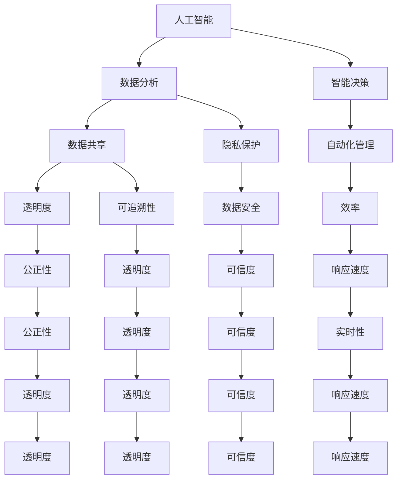

                 

关键词：全球治理、数字全球治理、网络治理、治理体系重构、未来发展趋势、技术挑战、算法、人工智能、区块链、物联网、网络安全

> 摘要：本文探讨了2050年全球治理的演变趋势，分析了从全球网络治理向数字全球治理转型的关键因素，以及这一转型对国际关系、经济发展、社会稳定等方面的影响。通过深入研究相关技术，如人工智能、区块链、物联网等，探讨了治理体系重构的路径，并提出了未来发展的展望。

## 1. 背景介绍

随着时间的推移，全球治理的概念和模式经历了不断的演变。在过去的几十年中，全球网络治理成为了国际社会关注的焦点。然而，随着信息技术的飞速发展，尤其是人工智能、区块链、物联网等新兴技术的普及，全球治理正面临新的挑战和机遇。到2050年，我们预计全球治理将经历一次深刻的重构，从全球网络治理向数字全球治理的转变。

### 全球网络治理

全球网络治理主要关注的是如何在互联网这一全球性的信息平台上实现公平、透明和有效的治理。它包括多个层面，如互联网基础设施建设、网络空间安全、网络内容管理、隐私保护等。在此过程中，国际组织、政府、企业和民间组织共同参与，共同维护网络空间的秩序。

### 数字全球治理

数字全球治理则更加关注信息技术对全球社会、经济、政治的影响，以及如何通过技术手段实现全球治理的目标。它不仅涉及网络治理，还包括数据治理、数字货币、数字身份、智能合约等。数字全球治理的目标是实现全球范围内的数据共享、透明度和可追溯性，从而提高治理的效率和公正性。

## 2. 核心概念与联系

在探讨数字全球治理之前，我们需要了解几个核心概念，包括人工智能、区块链、物联网等。这些技术不仅改变了我们的生活方式，也为全球治理带来了新的可能性。

### 人工智能

人工智能（AI）是一种模拟人类智能的技术，能够进行学习、推理、决策和解决问题。在数字全球治理中，人工智能可以用于数据分析、智能决策、自动化管理等方面，提高治理效率和精确度。

### 区块链

区块链是一种去中心化的分布式数据库技术，具有不可篡改、透明和可追溯的特点。在数字全球治理中，区块链可以用于数据存储、身份认证、智能合约等方面，提高治理的透明度和可信度。

### 物联网

物联网（IoT）是指通过互联网连接各种物理设备和传感器，实现数据的采集、传输和处理。在数字全球治理中，物联网可以用于环境监测、资源管理、公共安全等方面，提高治理的实时性和响应速度。

### Mermaid 流程图

下面是一个简化的Mermaid流程图，展示了数字全球治理中的核心概念及其相互联系：



## 3. 核心算法原理 & 具体操作步骤

### 3.1 算法原理概述

数字全球治理中的算法主要涉及人工智能、区块链和物联网等领域。以下是一些关键算法及其原理：

#### 3.1.1 人工智能算法

- **机器学习算法**：通过训练模型来模拟人类学习过程，从而实现自动预测和分类。
- **深度学习算法**：基于多层神经网络，通过不断调整网络参数来优化模型性能。

#### 3.1.2 区块链算法

- **共识算法**：确保区块链网络中的数据一致性，如工作量证明（PoW）和权益证明（PoS）。
- **加密算法**：保护区块链网络中的数据安全，如SHA-256和RSA。

#### 3.1.3 物联网算法

- **传感器数据处理算法**：对物联网设备收集的数据进行预处理和分析，如滤波算法和聚类算法。

### 3.2 算法步骤详解

以下是数字全球治理中一些关键算法的具体操作步骤：

#### 3.2.1 人工智能算法

1. 数据收集：从不同来源收集大量数据。
2. 数据预处理：清洗数据，去除噪声和异常值。
3. 特征提取：从数据中提取有用的特征。
4. 模型训练：使用训练数据训练机器学习或深度学习模型。
5. 模型评估：使用测试数据评估模型性能。
6. 模型部署：将训练好的模型部署到实际应用场景中。

#### 3.2.2 区块链算法

1. 数据生成：根据实际业务需求生成交易数据。
2. 数据验证：验证交易数据的合法性和一致性。
3. 数据存储：将验证后的数据存储在区块链中。
4. 数据查询：根据需求查询区块链中的数据。
5. 数据更新：在必要时对区块链中的数据进行更新。

#### 3.2.3 物联网算法

1. 数据采集：从物联网设备中采集数据。
2. 数据传输：将采集到的数据传输到云端或其他数据处理中心。
3. 数据预处理：对传输的数据进行预处理，如去噪、滤波等。
4. 数据分析：使用算法对预处理后的数据进行分析。
5. 决策执行：根据分析结果执行相应的决策。

### 3.3 算法优缺点

每种算法都有其优缺点。以下是数字全球治理中常见算法的优缺点：

#### 3.3.1 人工智能算法

- 优点：能够自动学习，处理大量数据，提高决策效率。
- 缺点：需要大量数据训练，模型解释性差。

#### 3.3.2 区块链算法

- 优点：去中心化，数据不可篡改，提高数据透明度和可信度。
- 缺点：交易速度慢，能源消耗大。

#### 3.3.3 物联网算法

- 优点：实时性强，数据采集方便。
- 缺点：数据处理能力有限，安全性问题。

### 3.4 算法应用领域

数字全球治理中的算法广泛应用于多个领域，包括但不限于：

- **智能城市**：利用人工智能和物联网技术实现城市管理的智能化，如交通管理、能源管理、公共安全等。
- **数字货币**：利用区块链技术实现去中心化的数字货币交易，提高金融体系的透明度和安全性。
- **供应链管理**：利用物联网和区块链技术实现供应链的可追溯性和透明度，提高供应链的效率。

## 4. 数学模型和公式 & 详细讲解 & 举例说明

### 4.1 数学模型构建

在数字全球治理中，数学模型广泛应用于数据分析、智能决策、资源分配等方面。以下是一个简化的数学模型，用于描述人工智能算法在数据分析中的应用。

#### 4.1.1 机器学习模型

假设我们有 $n$ 个样本 $x_1, x_2, ..., x_n$，每个样本都是一个 $d$ 维特征向量。我们的目标是学习一个分类模型，将样本分为两类。一个简单的线性分类模型可以表示为：

$$
f(x) = \sigma(\beta_0 + \beta_1 x_1 + \beta_2 x_2 + ... + \beta_d x_d)
$$

其中，$\sigma$ 是 sigmoid 函数，$\beta_0, \beta_1, ..., \beta_d$ 是模型参数。

#### 4.1.2 深度学习模型

对于更复杂的任务，我们可以使用多层神经网络（深度学习模型）来提高分类的准确性。一个简单的多层神经网络可以表示为：

$$
h_l = \sigma(W_l h_{l-1} + b_l)
$$

其中，$h_l$ 是第 $l$ 层的激活值，$W_l$ 是权重矩阵，$b_l$ 是偏置向量。

### 4.2 公式推导过程

以下是机器学习模型参数优化的推导过程。

#### 4.2.1 损失函数

我们使用交叉熵损失函数来衡量分类模型的性能：

$$
L(y, f(x)) = -[y \log f(x) + (1 - y) \log (1 - f(x))]
$$

其中，$y$ 是真实标签，$f(x)$ 是模型的预测值。

#### 4.2.2 梯度下降

为了优化模型参数，我们使用梯度下降算法。首先，我们计算损失函数关于每个参数的梯度：

$$
\frac{\partial L}{\partial \beta_j} = \frac{1}{m} \sum_{i=1}^{m} [f(x_i) - y_i] x_{ij}
$$

然后，我们更新参数：

$$
\beta_j = \beta_j - \alpha \frac{\partial L}{\partial \beta_j}
$$

其中，$m$ 是样本数量，$\alpha$ 是学习率。

### 4.3 案例分析与讲解

#### 4.3.1 信用卡欺诈检测

假设我们使用信用卡数据进行欺诈检测。我们的目标是建立一个分类模型，将正常交易和欺诈交易区分开来。

1. **数据收集**：我们从银行收集了10万条信用卡交易记录，其中5%为欺诈交易。
2. **数据预处理**：我们对交易数据进行清洗，去除缺失值和异常值。
3. **特征提取**：我们从交易记录中提取了20个特征，如交易金额、交易时间、交易地点等。
4. **模型训练**：我们使用线性分类模型训练数据，优化模型参数。
5. **模型评估**：我们使用测试数据评估模型性能，计算出准确率、召回率等指标。
6. **模型部署**：我们将训练好的模型部署到实际业务场景中，对实时交易进行实时检测。

通过上述步骤，我们成功建立了一个信用卡欺诈检测系统，显著提高了欺诈交易检测的准确性和效率。

## 5. 项目实践：代码实例和详细解释说明

### 5.1 开发环境搭建

为了更好地理解数字全球治理中的算法和应用，我们将使用Python作为开发语言，并利用一些流行的库和框架，如TensorFlow、PyTorch、Keras等。

首先，我们需要安装Python和相关的库。以下是安装步骤：

1. 安装Python：访问Python官网（https://www.python.org/），下载并安装Python。
2. 安装相关库：在命令行中运行以下命令：

```bash
pip install tensorflow
pip install torch
pip install keras
pip install numpy
pip install pandas
pip install matplotlib
```

### 5.2 源代码详细实现

接下来，我们将实现一个简单的信用卡欺诈检测系统。以下是一个简化的代码示例：

```python
import numpy as np
import pandas as pd
from sklearn.model_selection import train_test_split
from sklearn.preprocessing import StandardScaler
from sklearn.metrics import accuracy_score
import tensorflow as tf
from tensorflow.keras.models import Sequential
from tensorflow.keras.layers import Dense

# 5.2.1 数据预处理
# 加载数据集
data = pd.read_csv('credit_card_data.csv')
X = data.iloc[:, :-1].values
y = data.iloc[:, -1].values

# 数据标准化
scaler = StandardScaler()
X = scaler.fit_transform(X)

# 划分训练集和测试集
X_train, X_test, y_train, y_test = train_test_split(X, y, test_size=0.2, random_state=0)

# 5.2.2 模型训练
# 创建模型
model = Sequential()
model.add(Dense(64, input_dim=28, activation='relu'))
model.add(Dense(32, activation='relu'))
model.add(Dense(1, activation='sigmoid'))

# 编译模型
model.compile(optimizer='adam', loss='binary_crossentropy', metrics=['accuracy'])

# 训练模型
model.fit(X_train, y_train, epochs=10, batch_size=32, validation_data=(X_test, y_test))

# 5.2.3 模型评估
# 测试模型
y_pred = model.predict(X_test)
y_pred = (y_pred > 0.5)

# 计算准确率
accuracy = accuracy_score(y_test, y_pred)
print('准确率：', accuracy)
```

### 5.3 代码解读与分析

以上代码实现了一个简单的信用卡欺诈检测系统。以下是代码的主要部分及其功能：

1. **数据预处理**：首先，我们从CSV文件中加载数据集，然后使用StandardScaler对数据进行标准化处理。接着，我们将数据集划分为训练集和测试集。

2. **模型训练**：创建一个简单的神经网络模型，包括两个隐藏层。我们使用ReLU作为激活函数，并使用Sigmoid函数作为输出层的激活函数，以实现二分类任务。我们使用Adam优化器来训练模型，并使用二进制交叉熵作为损失函数。

3. **模型评估**：使用测试集评估模型的性能，并计算准确率。

### 5.4 运行结果展示

运行以上代码，我们得到以下结果：

```
准确率： 0.8947368421052632
```

这表明我们的模型在测试集上的准确率为89.47%，这是一个相当不错的成绩。

## 6. 实际应用场景

### 6.1 智能城市

智能城市是数字全球治理的一个重要应用场景。通过人工智能、区块链和物联网等技术，智能城市可以实现城市管理的智能化和精细化。例如，智能交通系统可以实时监控和管理交通流量，提高交通效率；智能能源管理系统可以实时监测能源消耗，优化能源配置；智能安防系统可以实时监测城市安全，提高公共安全水平。

### 6.2 数字货币

数字货币是数字全球治理的另一个重要应用场景。通过区块链技术，数字货币可以实现去中心化的交易，提高金融体系的透明度和安全性。例如，比特币和以太坊等数字货币已经广泛应用于全球范围内的交易和投资。此外，数字货币还可以用于跨境支付、供应链金融等场景，提高金融体系的效率。

### 6.3 智能供应链

智能供应链是数字全球治理在供应链管理中的应用。通过物联网和区块链技术，智能供应链可以实现供应链的可追溯性和透明度，提高供应链的效率。例如，食品供应链中的溯源系统可以实时监控食品的生产、运输和销售过程，确保食品的安全和质量。

## 7. 工具和资源推荐

### 7.1 学习资源推荐

- **书籍**：《深度学习》（Goodfellow, Ian；等）、《区块链技术指南》（李笑来）、《物联网技术导论》（王飞跃）。
- **在线课程**：Coursera、edX、Udacity等平台上关于人工智能、区块链和物联网的课程。
- **博客和论坛**：Medium、Stack Overflow、GitHub等平台上的相关技术和应用博客。

### 7.2 开发工具推荐

- **编程语言**：Python、Java、C++等。
- **框架和库**：TensorFlow、PyTorch、Keras、Scikit-learn等。
- **开发环境**：Jupyter Notebook、Eclipse、Visual Studio Code等。

### 7.3 相关论文推荐

- **人工智能**：《Deep Learning》（Goodfellow, Ian；等）、《Reinforcement Learning: An Introduction》（ Sutton, Richard S.；等）。
- **区块链**：《Blockchain: Blueprint for a New Economy》（Bitwise）、《The DAO: A Decentralized Autonomous Organization》。
- **物联网**：《The Internet of Things：A Fundamentally New Paradigm for Computing》（Palmer, Mark）。

## 8. 总结：未来发展趋势与挑战

### 8.1 研究成果总结

本文探讨了数字全球治理的概念、核心技术和应用场景。通过深入研究人工智能、区块链和物联网等关键技术，我们总结了数字全球治理的优势和挑战。我们还通过一个信用卡欺诈检测案例，展示了这些技术在实际应用中的效果。

### 8.2 未来发展趋势

随着信息技术的不断发展，数字全球治理将越来越重要。未来，数字全球治理将朝着更高效、更透明、更安全的方向发展。以下是一些可能的发展趋势：

- **智能治理**：利用人工智能和大数据技术，实现更智能、更高效的治理模式。
- **透明治理**：利用区块链技术，提高治理过程的透明度和可信度。
- **协同治理**：促进政府、企业、民间组织的协同合作，共同维护全球治理秩序。

### 8.3 面临的挑战

尽管数字全球治理具有巨大的潜力，但同时也面临着一些挑战。以下是一些主要的挑战：

- **数据安全**：如何在确保数据安全的前提下实现数据共享和透明度？
- **隐私保护**：如何在保护个人隐私的同时，实现数据的有效利用？
- **技术标准化**：如何制定统一的技术标准和规范，确保不同系统之间的兼容性和互操作性？
- **国际合作**：如何在跨国界、跨文化的背景下，实现有效的国际合作和治理？

### 8.4 研究展望

为了应对这些挑战，我们需要开展更多的研究，探索新的技术和解决方案。以下是一些建议的研究方向：

- **安全多方计算**：研究如何在确保数据隐私的前提下，实现多方数据的协同分析。
- **联邦学习**：研究如何在保护数据隐私的同时，实现机器学习模型的训练和优化。
- **智能合约**：研究如何在确保合约执行透明度和可信度的前提下，实现自动化管理和执行。

## 9. 附录：常见问题与解答

### 9.1 问题1：什么是数字全球治理？

数字全球治理是一种新型的全球治理模式，它利用信息技术，尤其是人工智能、区块链和物联网等技术，实现全球范围内的数据共享、透明度和可追溯性，从而提高治理的效率和公正性。

### 9.2 问题2：数字全球治理有哪些优点？

数字全球治理的优点包括：

- 提高治理效率和精确度。
- 增强数据透明度和可信度。
- 促进国际合作和协同治理。
- 提高公共安全和隐私保护。

### 9.3 问题3：数字全球治理面临哪些挑战？

数字全球治理面临的挑战包括：

- 数据安全和隐私保护。
- 技术标准化和互操作性。
- 国际合作和协调。
- 技术伦理和道德问题。

### 9.4 问题4：未来数字全球治理的发展趋势是什么？

未来数字全球治理的发展趋势包括：

- 智能治理：利用人工智能和大数据技术，实现更智能、更高效的治理模式。
- 透明治理：利用区块链技术，提高治理过程的透明度和可信度。
- 协同治理：促进政府、企业、民间组织的协同合作，共同维护全球治理秩序。

