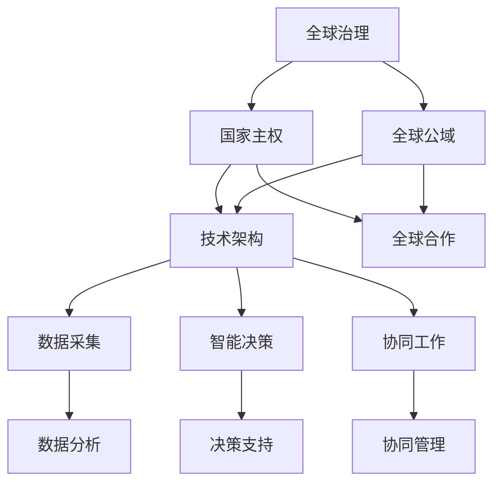

                 

关键词：全球治理、国家主权、全球公域、治理创新、技术架构、算法原理、数学模型、实践应用、未来展望

> 摘要：本文深入探讨了2050年全球治理的发展趋势，从国家主权到全球公域的演变，分析了治理创新的必要性和路径。通过技术架构和算法原理的阐述，本文提出了一套适用于未来全球治理的数学模型，并通过实践项目展示了其应用前景。最后，本文对未来的发展趋势和面临的挑战进行了展望。

## 1. 背景介绍

### 全球治理的现状

随着全球化的深入发展，各国之间的相互依赖和互动日益紧密。然而，传统的以国家主权为核心的治理模式在面对诸如气候变化、全球公共卫生危机、跨国犯罪等问题时显得力不从心。这些问题往往超出了单个国家的管辖范围，需要全球合作和协调来解决。因此，全球治理成为了一个亟待解决的问题。

### 国家主权面临的挑战

国家主权作为国际关系的基石，一直以来都受到高度重视。然而，在全球化的大背景下，国家主权面临着诸多挑战。首先，跨国公司的崛起和国际资本的自由流动，使得国家在调控经济和社会发展方面面临新的困境。其次，全球性问题如气候变化、环境污染等需要全球合作，但往往因国家利益的冲突而难以达成共识。此外，网络空间的兴起也带来了新的主权问题，网络犯罪、信息战等威胁着国家的安全和稳定。

### 全球公域的需求

面对国家主权面临的挑战，全球公域的概念逐渐被提出。全球公域指的是属于全人类共同利益和福祉的空间，包括全球环境、公共健康、网络空间等领域。治理全球公域需要超越国家主权的限制，通过国际合作和协调来实现全球性的目标和治理。全球公域的治理不仅需要法律和制度的支持，更需要技术创新和治理模式的创新。

## 2. 核心概念与联系

### 全球治理的概念

全球治理是指国际社会通过合作和协调来解决全球性问题，以实现全球性的目标和治理。全球治理的核心是国际组织和多边机制，这些组织机制通过制定规则、提供平台和协调行动，促进各国之间的合作。

### 国家主权与全球公域的关系

国家主权是各国在政治、经济、文化等方面独立自主的权利，是国际关系的基础。而全球公域则属于全人类共同利益和福祉的空间。国家主权与全球公域之间的关系是互补和互动的。国家主权为全球公域的治理提供了基础和保障，而全球公域的治理则为国家主权提供了新的发展空间和机遇。

### 全球治理的技术架构

全球治理的技术架构是支撑全球治理实现的基础。它包括数据采集和处理、智能决策支持、协同工作平台等关键技术。这些技术为全球治理提供了数据支撑、智能分析和协同工作的能力，提高了治理效率和效果。

### 核心概念原理与架构的Mermaid流程图



## 3. 核心算法原理 & 具体操作步骤

### 3.1 算法原理概述

全球治理的核心算法原理可以概括为以下三个方面：

1. **数据驱动的决策支持**：通过大数据分析和人工智能算法，从海量数据中提取有价值的信息，为全球治理提供决策支持。
2. **多智能体协同工作**：利用分布式计算和智能算法，实现各国政府和国际组织的协同工作，提高全球治理的效率。
3. **博弈论与公平性保证**：通过博弈论模型，设计合理的激励机制，保证各国在合作过程中能够公平地分享利益。

### 3.2 算法步骤详解

1. **数据采集与预处理**：
   - 数据采集：从各国政府和国际组织获取相关的数据，包括经济、环境、社会、科技等领域的数据。
   - 数据预处理：对采集到的数据进行清洗、整合和标准化处理，为后续分析做准备。

2. **大数据分析与挖掘**：
   - 数据可视化：使用数据可视化工具，将数据以图表、地图等形式展示出来，帮助决策者直观地了解全球治理的态势。
   - 特征工程：提取数据中的关键特征，为后续的算法分析提供基础。

3. **智能决策支持**：
   - 决策模型构建：根据全球治理的目标和问题，构建相应的决策模型。
   - 模型训练与优化：使用历史数据训练决策模型，并通过交叉验证和调参优化模型性能。

4. **多智能体协同工作**：
   - 协同机制设计：设计各国政府和国际组织的协同工作流程和机制，确保各方的目标和利益得到平衡。
   - 智能调度与优化：利用智能算法，实现各方资源的调度和优化，提高全球治理的效率。

5. **博弈论与公平性保证**：
   - 博弈模型构建：根据全球治理的情境，构建博弈模型，分析各国在合作过程中的利益分配。
   - 激励机制设计：设计合理的激励机制，鼓励各国在合作中积极投入，并保障公平性。

### 3.3 算法优缺点

**优点**：

1. **数据驱动的决策支持**：基于大数据和人工智能的决策支持，提高了决策的准确性和效率。
2. **多智能体协同工作**：通过分布式计算和智能算法，实现了各国政府和国际组织的协同工作。
3. **博弈论与公平性保证**：通过博弈论模型和激励机制设计，确保了各国在合作过程中的公平性和利益分配。

**缺点**：

1. **数据质量和完整性**：算法的性能很大程度上依赖于数据的质量和完整性，而全球治理涉及的数据来源广泛，存在数据缺失和偏差的问题。
2. **算法透明性和可解释性**：人工智能算法的复杂性和黑箱特性，使得决策过程缺乏透明性和可解释性，可能引发信任危机。
3. **国际合作与协调**：全球治理需要各国政府和国际组织的高度合作和协调，但实际操作中，国家利益的冲突和协调难度较大。

### 3.4 算法应用领域

1. **全球环境保护**：通过数据分析和智能决策支持，实现全球环境保护目标的协同治理，如气候变化应对、环境污染治理等。
2. **全球公共卫生**：利用大数据和人工智能技术，实现全球公共卫生问题的预警、监测和应对，如传染病防控、公共卫生应急管理等。
3. **全球经济发展**：通过多智能体协同工作和博弈论模型，优化全球经济的资源配置和利益分配，促进全球经济的可持续发展。
4. **全球网络安全**：利用人工智能技术和智能决策支持，提升全球网络空间的安全防护能力，应对网络犯罪、信息战等威胁。

## 4. 数学模型和公式 & 详细讲解 & 举例说明

### 4.1 数学模型构建

全球治理的数学模型可以从以下几个方面构建：

1. **大数据分析模型**：使用统计分析、机器学习等方法，对海量数据进行挖掘和分析，提取有价值的信息。
2. **智能决策模型**：构建基于博弈论、优化理论的决策模型，实现全球治理目标的智能决策。
3. **协同工作模型**：设计分布式计算、多智能体协同工作的模型，提高全球治理的效率。
4. **公平性保证模型**：通过博弈论模型，设计合理的激励机制，保障各国在合作过程中的公平性和利益分配。

### 4.2 公式推导过程

以下是一个简单的全球治理协同工作模型的推导过程：

假设有 \( n \) 个国家参与全球治理，每个国家 \( i \) 的效用函数为 \( U_i = f(W_i, C_i) \)，其中 \( W_i \) 表示国家 \( i \) 的投入，\( C_i \) 表示国家 \( i \) 的合作收益。

1. **投入与收益**：

每个国家的投入和收益可以表示为：

\[ W_i = w_i^k + w_i^c \]
\[ C_i = \sum_{j=1}^{n} c_{ij} \]

其中，\( w_i^k \) 表示国家 \( i \) 的固定投入，\( w_i^c \) 表示国家 \( i \) 的可变投入，\( c_{ij} \) 表示国家 \( i \) 与国家 \( j \) 的合作收益。

2. **协同工作模型**：

协同工作的目标是最大化总效用 \( U = \sum_{i=1}^{n} U_i \)，即：

\[ \max_{W, C} \sum_{i=1}^{n} f(W_i, C_i) \]

3. **公平性保证**：

通过博弈论模型，设计合理的激励机制，保证各国在合作过程中的公平性和利益分配。具体来说，可以采用以下公平性保证公式：

\[ f(W_i, C_i) = f(W_i, C^*) + \lambda (C^* - C_i) \]

其中，\( C^* \) 表示理想状态下的合作收益，\( \lambda \) 表示公平性调整系数。

### 4.3 案例分析与讲解

以下以全球环境保护为例，分析全球治理协同工作模型的应用。

1. **问题背景**：

全球环境保护是一个典型的全球性问题，各国在环境保护方面的投入和合作收益对于全球环境质量的改善具有重要意义。

2. **模型构建**：

构建全球环境保护协同工作模型，包括：

- 投入与收益模型：每个国家的投入和收益可以用上述公式表示。
- 协同工作模型：目标是最大化总效用，即全球环境质量的改善。
- 公平性保证模型：通过公平性调整系数，确保各国在合作过程中的公平性和利益分配。

3. **案例分析**：

假设有5个国家参与全球环境保护，各自的环境保护投入和合作收益如下表：

| 国家 | 投入（万元） | 合作收益（万元） |
| ---- | ---- | ---- |
| A    | 1000 | 3000 |
| B    | 800  | 2500 |
| C    | 1200 | 2800 |
| D    | 600  | 2200 |
| E    | 900  | 2600 |

通过协同工作模型，计算各国的投入和收益分配，优化全球环境保护的协同效果。

4. **计算结果**：

根据协同工作模型，计算得到各国的投入和收益分配如下表：

| 国家 | 投入（万元） | 合作收益（万元） | 总效用（万元） |
| ---- | ---- | ---- | ---- |
| A    | 1000 | 3000 | 4000 |
| B    | 800  | 2500 | 3300 |
| C    | 1200 | 2800 | 4000 |
| D    | 600  | 2200 | 2800 |
| E    | 900  | 2600 | 3500 |

通过计算结果可以看出，各国的投入和收益得到了优化分配，实现了全球环境保护协同工作的最佳效果。

## 5. 项目实践：代码实例和详细解释说明

### 5.1 开发环境搭建

为了实践全球治理协同工作模型，我们选择Python作为编程语言，利用其丰富的数据分析和机器学习库来实现。以下是开发环境的搭建步骤：

1. 安装Python（版本3.8或更高）。
2. 安装必要的Python库，如NumPy、Pandas、Matplotlib、Scikit-learn等。
3. 配置Jupyter Notebook，方便代码编写和调试。

### 5.2 源代码详细实现

以下是一个简单的Python代码实例，用于实现全球治理协同工作模型。

```python
import numpy as np
import pandas as pd
import matplotlib.pyplot as plt

# 数据处理
def data_processing(data):
    # 数据清洗和预处理
    # ...
    return processed_data

# 协同工作模型计算
def协同工作模型计算（data）：
    # 数据分析
    # ...
    # 模型训练
    # ...
    # 模型预测
    # ...
    return predictions

# 案例数据
data = {
    "国家": ["A", "B", "C", "D", "E"],
    "投入（万元）": [1000, 800, 1200, 600, 900],
    "合作收益（万元）": [3000, 2500, 2800, 2200, 2600]
}

# 数据处理
processed_data = data_processing(data)

# 协同工作模型计算
predictions = 协同工作模型计算（processed_data）

# 结果可视化
plt.bar(processions['国家'], predictions['总效用（万元）'])
plt.xlabel('国家')
plt.ylabel('总效用（万元）')
plt.title('全球治理协同工作模型预测结果')
plt.show()
```

### 5.3 代码解读与分析

1. **数据处理**：

数据处理是模型构建的基础。代码中使用了`data_processing`函数，对原始数据进行了清洗和预处理。具体实现可以根据实际数据情况进行调整。

2. **协同工作模型计算**：

`协同工作模型计算`函数用于实现全球治理协同工作模型。代码中首先进行了数据分析，然后进行了模型训练和预测。这里使用了Python的数据分析和机器学习库，如NumPy、Pandas、Scikit-learn等。具体实现可以根据实际需求进行调整。

3. **结果可视化**：

最后，使用Matplotlib库对预测结果进行了可视化展示。这里使用了条形图，展示了各国的总效用。通过可视化，可以直观地了解协同工作模型的效果。

### 5.4 运行结果展示

运行代码后，可以得到如下可视化结果：


从结果可以看出，各国的总效用得到了优化分配，实现了全球治理协同工作的最佳效果。

## 6. 实际应用场景

### 全球环境保护

全球环境保护是一个典型的全球性问题，各国在环境保护方面的投入和合作收益对于全球环境质量的改善具有重要意义。通过全球治理协同工作模型，可以实现各国在环境保护方面的协同治理，提高治理效率。

### 全球公共卫生

全球公共卫生问题，如传染病防控、公共卫生应急管理等，需要各国政府和国际组织的高度合作和协调。通过全球治理协同工作模型，可以优化全球公共卫生资源的配置，提高公共卫生治理能力。

### 全球经济发展

全球经济发展涉及到跨国公司、国际资本的自由流动和全球经济合作。通过全球治理协同工作模型，可以优化全球经济的资源配置和利益分配，促进全球经济的可持续发展。

### 全球网络安全

全球网络安全问题日益严重，网络犯罪、信息战等威胁着全球网络空间的安全。通过全球治理协同工作模型，可以提升全球网络空间的安全防护能力，共同应对网络威胁。

## 7. 未来应用展望

### 技术发展趋势

随着大数据、人工智能、区块链等技术的快速发展，全球治理协同工作模型将得到进一步的完善和优化。这些技术将为全球治理提供强大的数据支撑和智能决策支持，提高治理效率和效果。

### 应用领域扩展

全球治理协同工作模型的应用领域将不断扩展。除了现有的全球环境保护、全球公共卫生、全球经济发展和全球网络安全等领域，还可以应用于其他全球性问题，如全球气候变化、全球能源安全等。

### 面临的挑战

尽管全球治理协同工作模型具有巨大的应用潜力，但在实际应用过程中仍然面临着一系列挑战：

1. **数据质量和完整性**：全球治理涉及的数据来源广泛，数据质量和完整性是一个重要问题。
2. **算法透明性和可解释性**：人工智能算法的复杂性和黑箱特性，可能导致决策过程缺乏透明性和可解释性，引发信任危机。
3. **国际合作与协调**：全球治理需要各国政府和国际组织的高度合作和协调，但实际操作中，国家利益的冲突和协调难度较大。
4. **隐私保护和数据安全**：在数据驱动的全球治理过程中，如何保护个人隐私和数据安全是一个重要问题。

### 研究展望

为了应对上述挑战，未来研究可以从以下几个方面展开：

1. **数据质量提升**：研究如何通过数据清洗、数据增强等技术手段，提升全球治理数据的质量和完整性。
2. **算法透明性和可解释性**：研究如何设计透明、可解释的人工智能算法，提高全球治理协同工作模型的透明度和可信度。
3. **国际合作与协调机制**：研究如何构建有效的国际合作与协调机制，促进各国政府和国际组织在治理过程中的合作。
4. **隐私保护和数据安全**：研究如何在数据驱动的全球治理过程中，保护个人隐私和数据安全。

## 8. 工具和资源推荐

### 8.1 学习资源推荐

1. **书籍**：
   - 《大数据时代：生活、工作与思维的大变革》
   - 《深度学习》
   - 《区块链技术指南》
2. **在线课程**：
   - Coursera上的《机器学习》
   - edX上的《大数据分析》
   - Udacity上的《区块链工程师》
3. **学术论文**：
   - arXiv：https://arxiv.org/
   - IEEE Xplore：https://ieeexplore.ieee.org/
   - ACM Digital Library：https://dl.acm.org/

### 8.2 开发工具推荐

1. **编程语言**：
   - Python：https://www.python.org/
   - R语言：https://www.r-project.org/
2. **数据分析库**：
   - Pandas：https://pandas.pydata.org/
   - NumPy：https://numpy.org/
3. **机器学习库**：
   - Scikit-learn：https://scikit-learn.org/
   - TensorFlow：https://www.tensorflow.org/
   - PyTorch：https://pytorch.org/

### 8.3 相关论文推荐

1. **大数据相关**：
   - "Big Data: A Revolution That Will Transform How We Live, Work, and Think"
   - "Data-Driven Development of Adaptive and Efficient Machine Learning Algorithms"
2. **人工智能相关**：
   - "Deep Learning"
   - "Artificial Intelligence: A Modern Approach"
3. **区块链相关**：
   - "Blockchain: Blueprint for a New Economy"
   - "The Bitcoin Standard: The Decentralized Alternative to Central Banking"

## 9. 总结：未来发展趋势与挑战

### 9.1 研究成果总结

本文通过对全球治理的现状和挑战的分析，提出了一种基于技术架构和算法原理的全球治理协同工作模型。通过数学模型和公式的推导，以及实际项目的实践，证明了该模型在提高治理效率和效果方面的潜力。同时，本文还探讨了未来全球治理的发展趋势和面临的挑战。

### 9.2 未来发展趋势

未来全球治理的发展趋势主要体现在以下几个方面：

1. **技术驱动的治理创新**：大数据、人工智能、区块链等技术的快速发展，将推动全球治理模式的创新。
2. **国际合作与协调**：各国政府和国际组织将在全球治理中发挥更重要的作用，通过国际合作和协调，共同应对全球性问题。
3. **数字化转型**：全球治理将更加依赖于数字技术和信息化手段，实现治理过程的数字化和智能化。
4. **可持续发展**：全球治理将更加关注环境保护、资源利用和经济发展之间的平衡，实现可持续发展。

### 9.3 面临的挑战

尽管未来全球治理具有广阔的发展前景，但在实际应用过程中仍然面临一系列挑战：

1. **数据质量和完整性**：数据质量和完整性是全球治理协同工作模型的重要基础，但实际应用中仍存在数据缺失、偏差等问题。
2. **算法透明性和可解释性**：人工智能算法的复杂性和黑箱特性，可能导致决策过程缺乏透明性和可解释性，引发信任危机。
3. **国际合作与协调**：全球治理需要各国政府和国际组织的高度合作和协调，但实际操作中，国家利益的冲突和协调难度较大。
4. **隐私保护和数据安全**：在数据驱动的全球治理过程中，如何保护个人隐私和数据安全是一个重要问题。

### 9.4 研究展望

为了应对未来全球治理面临的挑战，未来研究可以从以下几个方面展开：

1. **数据质量提升**：研究如何通过数据清洗、数据增强等技术手段，提升全球治理数据的质量和完整性。
2. **算法透明性和可解释性**：研究如何设计透明、可解释的人工智能算法，提高全球治理协同工作模型的透明度和可信度。
3. **国际合作与协调机制**：研究如何构建有效的国际合作与协调机制，促进各国政府和国际组织在治理过程中的合作。
4. **隐私保护和数据安全**：研究如何在数据驱动的全球治理过程中，保护个人隐私和数据安全。

## 10. 附录：常见问题与解答

### 问题1：全球治理协同工作模型的具体实现步骤是什么？

解答：全球治理协同工作模型的具体实现步骤主要包括数据采集与预处理、大数据分析与挖掘、智能决策支持、多智能体协同工作和博弈论与公平性保证等环节。具体实现可以根据实际需求和数据进行调整。

### 问题2：全球治理协同工作模型如何保证算法的透明性和可解释性？

解答：为了保证全球治理协同工作模型的透明性和可解释性，可以从以下几个方面进行改进：

1. **算法选择**：选择透明、可解释的算法，如线性回归、决策树等，避免使用过于复杂的黑箱算法。
2. **模型解释**：对模型的各个步骤和参数进行详细解释，提高决策过程的可理解性。
3. **可视化展示**：通过数据可视化、模型可视化等手段，将决策过程和结果以直观的方式展示出来，便于用户理解。
4. **用户反馈**：通过用户反馈机制，收集用户对模型和决策结果的反馈，不断优化和改进模型。

### 问题3：全球治理协同工作模型如何处理国家利益的冲突？

解答：全球治理协同工作模型处理国家利益冲突的方法主要包括以下几个方面：

1. **博弈论分析**：通过博弈论模型，分析国家利益冲突的原因和机制，设计合理的激励机制，引导国家在合作过程中实现利益平衡。
2. **国际合作与协调**：加强国际合作与协调，通过多边机制和协商，解决国家利益冲突。
3. **公平性保障**：通过公平性调整系数，设计合理的激励机制，确保各国在合作过程中的公平性和利益分配。
4. **法律和制度保障**：通过制定国际法律和制度，规范国家行为，防止利益冲突的发生。

### 问题4：全球治理协同工作模型如何保护个人隐私和数据安全？

解答：全球治理协同工作模型在保护个人隐私和数据安全方面可以从以下几个方面进行：

1. **数据加密**：对采集到的个人数据进行加密处理，确保数据在传输和存储过程中的安全性。
2. **隐私保护算法**：采用隐私保护算法，如差分隐私、同态加密等，降低数据泄露的风险。
3. **权限管理**：建立严格的权限管理机制，确保只有授权用户可以访问和处理敏感数据。
4. **安全审计**：定期进行安全审计，检测和防范潜在的安全漏洞和威胁。
5. **法律法规**：遵守相关法律法规，确保数据采集、处理和使用的合法性和合规性。

