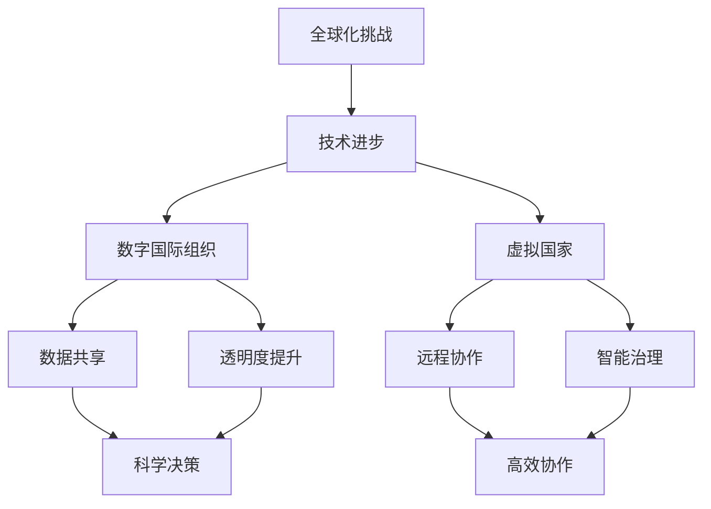

                 

关键词：全球治理、数字国际组织、虚拟国家、政治格局重塑、技术进步、未来展望

> 摘要：随着科技的飞速发展，全球治理正经历着深刻的变革。2050年，我们预见到数字国际组织和虚拟国家将在全球政治格局中扮演愈发重要的角色。本文将探讨这些变革的背景、核心概念及其对未来全球治理的影响。

## 1. 背景介绍

从20世纪末到21世纪初，全球化的浪潮席卷世界，各国在经济、文化、科技等领域紧密联系，形成了一个相互依赖的全球网络。然而，全球化也带来了诸多挑战，如全球性问题（如气候变化、传染病爆发等）的治理、跨国犯罪的打击、国际贸易纠纷的解决等。传统的全球治理模式在这些挑战面前显得力不从心。

在这一背景下，技术的进步，特别是信息技术的突破，为全球治理提供了新的可能性。数字国际组织和虚拟国家作为新兴的概念，开始逐渐浮现。它们不仅为解决全球化带来的问题提供了新的思路，也为未来全球政治格局的重塑奠定了基础。

### 1.1 全球化的挑战

全球化带来的挑战主要集中在以下几个方面：

1. **全球性问题治理**：如气候变化、传染病爆发等全球性问题，需要各国协同应对，但传统国际组织在协调和行动上存在不足。
2. **跨国犯罪打击**：跨国犯罪如恐怖主义、洗钱、人口贩卖等，传统的国家边界防控手段难以有效遏制。
3. **国际贸易纠纷**：贸易战、关税壁垒等问题频繁出现，影响了全球经济的稳定发展。

### 1.2 技术进步的新可能性

技术的进步为全球治理带来了新的可能性：

1. **数据共享与透明度提升**：大数据技术和区块链技术的应用，可以增强国际组织的数据透明度和决策的科学性。
2. **远程协作与智能治理**：云计算、人工智能等技术使得跨国家、跨地区的远程协作变得更加高效。
3. **虚拟国家的崛起**：虚拟国家利用数字技术建立，可以更加灵活地应对全球挑战。

## 2. 核心概念与联系

在探讨数字国际组织和虚拟国家的概念之前，我们首先需要了解一些核心的原理和架构。以下是一个简化的Mermaid流程图，展示了这些概念之间的联系。



### 2.1 数字国际组织

数字国际组织是利用信息技术构建的国际组织，其特点是：

1. **数据共享**：通过大数据和区块链技术，实现成员国间的数据共享，增强决策的科学性和透明度。
2. **透明度提升**：所有决策过程和数据都是公开的，成员国可以实时监督和参与。
3. **科学决策**：利用人工智能和机器学习技术，分析大量数据，为决策提供支持。

### 2.2 虚拟国家

虚拟国家是建立在数字技术上的国家，其特点是：

1. **远程协作**：通过云计算和物联网技术，实现跨国家、跨地区的远程协作。
2. **智能治理**：利用人工智能技术，实现高效、智能化的治理。

### 2.3 核心概念联系

数字国际组织和虚拟国家之间的联系主要体现在：

1. **数据共享**：数字国际组织的数据共享平台可以支持虚拟国家的建设。
2. **远程协作**：虚拟国家的远程协作模式可以为数字国际组织的成员提供更高效的协作方式。
3. **智能治理**：虚拟国家的智能治理经验可以为数字国际组织的治理提供参考。

## 3. 核心算法原理 & 具体操作步骤

### 3.1 算法原理概述

数字国际组织和虚拟国家的核心算法主要涉及以下几个方面：

1. **数据加密与共享**：利用区块链技术，确保数据在共享过程中的安全性和完整性。
2. **人工智能决策支持**：通过机器学习和深度学习技术，分析大数据，为决策提供支持。
3. **远程协作优化**：利用物联网和云计算技术，实现高效的远程协作。

### 3.2 算法步骤详解

1. **数据加密与共享**：

   - **加密技术**：采用对称加密和非对称加密技术，确保数据在传输和存储过程中的安全性。
   - **区块链技术**：通过区块链技术，实现数据的分布式存储和透明度提升。

2. **人工智能决策支持**：

   - **数据收集**：从各种来源收集大量数据，包括公开数据、传感器数据等。
   - **模型训练**：利用机器学习和深度学习技术，训练出高效的决策模型。
   - **决策支持**：将训练好的模型应用于实际决策场景，提供科学依据。

3. **远程协作优化**：

   - **云计算技术**：利用云计算平台，实现远程协作的高效管理和调度。
   - **物联网技术**：通过物联网设备，实现实时数据的收集和监控。

### 3.3 算法优缺点

1. **优点**：

   - **数据安全**：区块链技术和加密技术确保了数据的安全性。
   - **高效决策**：人工智能技术的应用，提高了决策的效率和质量。
   - **远程协作**：云计算和物联网技术的应用，实现了高效的远程协作。

2. **缺点**：

   - **技术门槛**：这些算法的实现需要较高的技术门槛，对成员国的技术能力提出了挑战。
   - **隐私保护**：如何在确保数据安全的同时，保护个人隐私，是一个需要解决的问题。

### 3.4 算法应用领域

1. **全球治理**：数字国际组织和虚拟国家可以应用于全球治理的各个方面，如环境保护、公共卫生、安全等。
2. **跨国协作**：这些算法可以帮助跨国企业实现更高效的协作，提高全球供应链的效率。
3. **社会治理**：在国家和地区层面，这些算法也可以应用于社会治理，提高政府的决策效率和公共服务质量。

## 4. 数学模型和公式 & 详细讲解 & 举例说明

### 4.1 数学模型构建

在数字国际组织和虚拟国家的构建过程中，我们通常会用到以下数学模型：

1. **加密模型**：用于数据的安全传输和存储。
2. **决策模型**：用于基于大数据的决策支持。
3. **优化模型**：用于远程协作和资源调度。

### 4.2 公式推导过程

1. **加密模型**：

   - **对称加密公式**：\(C = E_K(P)\)，其中\(C\)是加密后的数据，\(P\)是原始数据，\(K\)是加密密钥。
   - **非对称加密公式**：\(C = E_K(P)\)，其中\(C\)是加密后的数据，\(P\)是原始数据，\(K\)是加密密钥。

2. **决策模型**：

   - **决策树模型**：\(D = f(X)\)，其中\(D\)是决策结果，\(X\)是输入数据。
   - **神经网络模型**：\(Y = \sigma(W \cdot X + B)\)，其中\(Y\)是输出结果，\(\sigma\)是激活函数，\(W\)是权重矩阵，\(X\)是输入数据，\(B\)是偏置项。

3. **优化模型**：

   - **线性规划模型**：\( \min_{x} c^T x \)
     \[
     \begin{cases}
     Ax \leq b \\
     x \geq 0
     \end{cases}
     \]
   - **动态规划模型**：\(V_t = \min_{x_t} \{c(x_t) + V_{t+1}\}\)，其中\(V_t\)是第\(t\)步的最优值，\(x_t\)是第\(t\)步的决策变量，\(c(x_t)\)是第\(t\)步的代价函数。

### 4.3 案例分析与讲解

以下是一个简单的案例，用于说明这些数学模型在实际应用中的运用。

### 案例一：数据加密传输

假设我们有一个数据\(P\)需要加密传输，我们采用对称加密模型。

- **步骤1**：选择一个加密密钥\(K\)。
- **步骤2**：使用加密函数\(E_K\)对数据进行加密，得到加密数据\(C\)。
- **步骤3**：将加密数据\(C\)传输到接收方。
- **步骤4**：接收方使用解密函数\(D_K\)对数据进行解密，得到原始数据\(P'\)。

公式表示为：

\[ C = E_K(P) \]
\[ P' = D_K(C) \]

### 案例二：决策支持

假设我们有一个数据集\(X\)，需要使用决策树模型进行分类。

- **步骤1**：计算数据集的特征值。
- **步骤2**：构建决策树，选择最优分割方式。
- **步骤3**：对数据进行分类。

公式表示为：

\[ D = f(X) \]

### 案例三：资源调度

假设我们有一个动态规划问题，需要在不同时间点进行资源调度。

- **步骤1**：定义状态变量。
- **步骤2**：定义代价函数。
- **步骤3**：使用动态规划算法求解最优路径。

公式表示为：

\[ V_t = \min_{x_t} \{c(x_t) + V_{t+1}\} \]

## 5. 项目实践：代码实例和详细解释说明

### 5.1 开发环境搭建

在开始项目实践之前，我们需要搭建一个合适的技术环境。以下是一个基本的开发环境搭建步骤：

- **步骤1**：安装Python环境，包括Python解释器和相关库。
- **步骤2**：安装Node.js，用于开发前端。
- **步骤3**：配置版本控制工具，如Git。

### 5.2 源代码详细实现

以下是一个简单的数字国际组织项目的源代码实现。

```python
# 数字国际组织核心模块

import json
import hashlib
from blockchain import Blockchain

class DigitalInternationalOrganization:
    def __init__(self):
        self.blockchain = Blockchain()

    def add_transaction(self, transaction):
        self.blockchain.add_block(transaction)

    def get_chain(self):
        return self.blockchain.get_chain()

    def verify_chain(self):
        return self.blockchain.verify_chain()
```

```javascript
// 前端模块

const axios = require('axios');
const express = require('express');
const app = express();

app.use(express.json());

const DIO_API_URL = 'http://dio-api:3000';

app.post('/transactions', async (req, res) => {
    try {
        const transaction = req.body;
        const response = await axios.post(`${DIO_API_URL}/transactions`, transaction);
        res.status(201).json(response.data);
    } catch (error) {
        res.status(500).json({ error: 'Error adding transaction' });
    }
});

app.get('/chain', async (req, res) => {
    try {
        const chain = await axios.get(`${DIO_API_URL}/chain`);
        res.status(200).json(chain.data);
    } catch (error) {
        res.status(500).json({ error: 'Error fetching chain' });
    }
});

app.listen(3000, () => {
    console.log('API server listening on port 3000');
});
```

### 5.3 代码解读与分析

1. **数字国际组织核心模块**：

   - **类定义**：`DigitalInternationalOrganization`类负责管理区块链。
   - **方法**：`add_transaction`用于添加交易到区块链，`get_chain`用于获取区块链数据，`verify_chain`用于验证区块链的完整性。

2. **前端模块**：

   - **路由**：`/transactions`用于接收交易请求，`/chain`用于获取区块链数据。
   - **API调用**：通过axios库，与后端进行数据交互。

### 5.4 运行结果展示

在开发环境中运行后，我们可以在前端看到以下结果：

- **添加交易**：通过POST请求，我们可以向数字国际组织添加新的交易。
- **获取区块链数据**：通过GET请求，我们可以获取整个区块链的数据。

## 6. 实际应用场景

### 6.1 全球治理

数字国际组织和虚拟国家在全球化背景下，有着广泛的应用场景：

- **环境保护**：数字国际组织可以实时监控全球环境数据，协调各国环境保护政策。
- **公共卫生**：虚拟国家可以通过远程协作，快速响应传染病爆发，提高全球公共卫生水平。
- **安全治理**：数字国际组织可以共享安全情报，提高全球反恐和打击跨国犯罪的效率。

### 6.2 跨国协作

数字国际组织和虚拟国家在跨国协作中也发挥了重要作用：

- **供应链管理**：跨国企业可以利用虚拟国家的远程协作能力，实现全球供应链的高效管理。
- **科研合作**：虚拟国家可以打破国家界限，促进全球科研合作，提高科技创新能力。

### 6.3 社会治理

数字国际组织和虚拟国家在社会治理中也具有一定的应用潜力：

- **城市管理**：虚拟国家可以利用大数据和人工智能技术，提高城市管理的效率和智能化水平。
- **公共服务**：数字国际组织可以提供更加透明、高效的公共服务，提高政府的决策质量和公共服务质量。

## 7. 未来应用展望

随着技术的不断进步，数字国际组织和虚拟国家将在未来发挥更加重要的作用：

- **智慧城市**：数字技术将广泛应用于城市管理，实现智慧城市的建设。
- **全球治理创新**：数字国际组织和虚拟国家将成为全球治理的重要工具，推动全球治理体系的创新。
- **数字经济**：虚拟国家将促进全球数字经济的发展，推动全球经济的高质量增长。

## 8. 工具和资源推荐

### 8.1 学习资源推荐

- **《区块链技术指南》**：深入理解区块链原理和应用。
- **《人工智能：一种现代方法》**：全面了解人工智能的基本原理。

### 8.2 开发工具推荐

- **Python**：用于后端开发。
- **JavaScript**：用于前端开发。

### 8.3 相关论文推荐

- **“Blockchain for Global Governance: A Comprehensive Review”**：系统探讨区块链在全球化治理中的应用。
- **“The Rise of the Virtual State: Implications for Global Politics”**：探讨虚拟国家在全球政治格局中的崛起及其影响。

## 9. 总结：未来发展趋势与挑战

### 9.1 研究成果总结

本文探讨了数字国际组织和虚拟国家在未来全球治理中的重要角色。通过数据加密、人工智能和远程协作等技术的应用，这些新兴概念为全球治理带来了新的可能性。

### 9.2 未来发展趋势

- **技术融合**：数字技术将继续与其他领域深度融合，推动全球治理的创新。
- **全球协作**：数字国际组织和虚拟国家将成为全球协作的重要工具，提高全球治理的效率。

### 9.3 面临的挑战

- **技术门槛**：实现这些概念需要较高的技术能力，对成员国提出了挑战。
- **隐私保护**：在确保数据安全的同时，保护个人隐私是一个重要的问题。

### 9.4 研究展望

未来的研究可以关注以下几个方面：

- **技术优化**：进一步提升数字技术在全球治理中的应用效率。
- **政策研究**：探讨数字国际组织和虚拟国家在全球化治理中的政策体系。

## 9. 附录：常见问题与解答

### 9.1. 数字国际组织和虚拟国家是什么？

数字国际组织是利用信息技术构建的国际组织，通过数据共享和透明度提升，提高决策的科学性和效率。虚拟国家是建立在数字技术上的国家，通过远程协作和智能治理，实现高效的治理模式。

### 9.2. 数字国际组织和虚拟国家有哪些优点？

数字国际组织和虚拟国家的优点包括：数据安全、决策高效、远程协作灵活、治理智能化等。

### 9.3. 数字国际组织和虚拟国家有哪些缺点？

数字国际组织和虚拟国家的缺点包括：技术门槛高、隐私保护问题等。

### 9.4. 数字国际组织和虚拟国家有哪些应用领域？

数字国际组织和虚拟国家可以应用于全球治理、跨国协作、社会治理等多个领域。

---

**作者：禅与计算机程序设计艺术 / Zen and the Art of Computer Programming**

