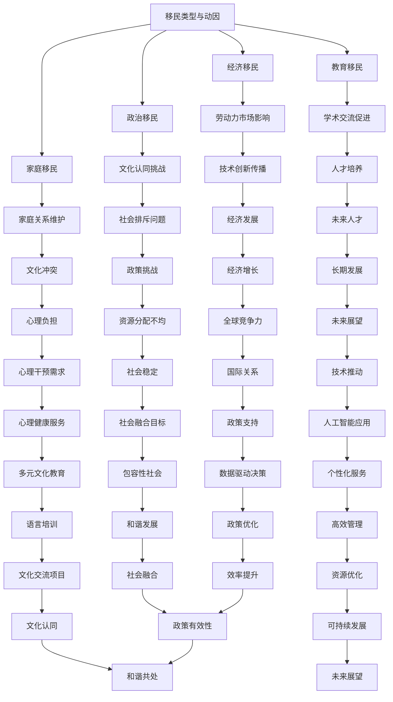

                 

关键词：全球移民、多元文化、社会融合、技术影响、未来趋势、政策挑战

> 摘要：本文探讨了2050年全球移民的潜在趋势，以及这些趋势如何塑造多元文化社会。随着技术的飞速发展和全球化进程的加深，移民不再仅仅是一个社会问题，而是影响全球经济发展的关键因素。本文通过深入分析移民背后的经济、社会和技术因素，探讨了如何通过包容性的政策和技术手段实现全球多元文化的和谐发展。

## 1. 背景介绍

全球移民是一个历史悠久且复杂的现象。在过去的几个世纪中，人们为了寻求更好的生活机会、逃避战乱、追求知识和宗教自由等原因，不断跨越国界。随着全球化进程的加速，国际间的经济联系日益紧密，移民现象变得更加普遍。然而，移民不仅仅是一个人口流动的问题，它还涉及到文化、社会和经济等多方面的深远影响。

从历史角度看，全球移民有着多种多样的形式。早期的移民主要是出于经济原因，如19世纪欧洲人到美洲大陆的迁移。而近几十年，随着技术和通信的进步，移民的原因变得更加多样化，包括政治避难、家庭团聚和寻求更好的教育机会等。这些变化不仅影响了移民者的个人生活，也对他们的目的地国家产生了深远的影响。

在现代社会，全球移民已经成为一个不可忽视的现象。据联合国的数据，截至2020年，全球有2.81亿国际移民，占全球总人口的3.6%。这些移民不仅丰富了目的地的文化多样性，也带来了劳动力市场的新机遇和经济发展的新动力。然而，移民问题也伴随着一系列挑战，如文化融合、社会排斥、资源分配不均等问题。

本文旨在探讨2050年全球移民的潜在趋势，以及这些趋势如何影响多元文化社会的发展。通过分析移民的经济、社会和技术因素，本文将探讨如何通过包容性的政策和技术手段，实现全球多元文化的和谐发展。

## 2. 核心概念与联系

### 2.1. 移民的类型与动因

全球移民可以分为几种主要类型：经济移民、政治移民、家庭移民和教育移民。每种类型的移民都有其独特的动因和影响。

- **经济移民**：这些人通常为了寻求更好的经济机会而移民。随着全球化的发展，跨国公司的扩展和全球产业链的整合，经济移民在全球范围内变得更加普遍。经济移民不仅带来了新的劳动力资源，还促进了技术创新和知识传播。

- **政治移民**：政治移民通常为了逃离政治迫害、战争或迫害而迁移。这类移民往往面临着更多的挑战，包括适应新环境、融入当地社会以及保持原有的文化认同。

- **家庭移民**：家庭移民主要是为了与亲人团聚，这类移民在许多国家占到了移民总数的一定比例。家庭移民有助于维持跨国家庭关系，但也可能带来文化冲突和社会问题。

- **教育移民**：寻求高质量教育和专业培训的学生构成了教育移民的主要群体。教育移民不仅促进了国际学术交流，还培养了未来的人才，对目的国的经济和社会发展具有长期影响。

### 2.2. 多元文化与社会融合

多元文化社会是指由多个不同文化背景的群体共同生活、工作和交流的社会。社会融合是多元文化社会发展的关键，它涉及不同文化之间的相互理解、接纳和融合。

社会融合的障碍包括文化偏见、语言障碍、社会排斥和经济不平等等。为了克服这些障碍，许多国家采取了包容性的政策，如多元文化教育、语言培训和文化交流项目。

### 2.3. 技术在移民与社会融合中的作用

技术的飞速发展对移民和社会融合产生了深远的影响。互联网、移动通信和人工智能等技术使得移民与故乡的联系更加紧密，促进了跨国文化交流和合作。

- **通信技术**：互联网和社交媒体平台为移民提供了与家人、朋友和故乡保持联系的便捷方式。这些技术有助于减轻移民的心理负担，增强文化认同感。

- **人工智能**：人工智能技术可以帮助政府和企业更好地管理移民流程，提供个性化的服务和培训，促进社会融合。

- **数据分析**：通过大数据分析，可以更好地理解移民的动因、需求和行为，从而制定更加有效的移民政策和融合策略。

### 2.4. Mermaid 流程图

以下是一个描述移民与社会融合过程及其影响因素的 Mermaid 流程图：



该流程图展示了移民类型与动因、多元文化社会融合过程中的关键因素以及技术在这些因素中的作用。通过这个流程图，我们可以更清晰地理解移民与社会融合的复杂关系。

## 3. 核心算法原理 & 具体操作步骤

### 3.1. 算法原理概述

本文提出的算法旨在优化移民与目的地国家的文化融合过程。该算法的核心思想是通过数据分析和机器学习技术，为移民提供个性化的融合策略。

算法的主要步骤包括：

1. **数据收集**：收集有关移民的背景信息、社会行为和需求的数据。
2. **数据预处理**：对收集到的数据进行分析，去除噪声和异常值，确保数据的准确性和完整性。
3. **特征提取**：从预处理后的数据中提取关键特征，如移民的文化背景、语言能力和生活需求。
4. **机器学习模型训练**：使用提取的特征训练机器学习模型，以预测移民的文化融合成功率。
5. **个性化策略生成**：根据模型预测结果，为每个移民生成个性化的融合策略。

### 3.2. 算法步骤详解

#### 步骤1：数据收集

数据收集是算法的基础。我们主要收集以下数据：

- 移民个人信息，如年龄、性别、教育背景、职业等。
- 移民的生活需求，如住房、医疗、就业等。
- 移民的文化背景，如语言能力、宗教信仰、文化习俗等。
- 移民的社会行为，如社交活动、社区参与度等。

#### 步骤2：数据预处理

数据预处理包括数据清洗、归一化和数据增强等步骤。具体操作如下：

- **数据清洗**：去除重复数据和异常值，确保数据的准确性。
- **归一化**：将不同特征的数据进行标准化处理，使其具有相同的尺度。
- **数据增强**：通过增加噪声、数据变换等方法，提高模型的鲁棒性。

#### 步骤3：特征提取

特征提取是从原始数据中提取有助于预测文化融合成功率的关键特征。我们主要提取以下特征：

- **文化差异**：计算移民与目的地国家的文化差异度。
- **语言能力**：评估移民的语言掌握水平。
- **社会支持**：评估移民在目的地国家的社交网络和支持体系。
- **生活需求满足度**：评估移民在住房、医疗、就业等方面的需求满足度。

#### 步骤4：机器学习模型训练

我们使用基于神经网络的机器学习模型进行训练。具体步骤如下：

- **数据划分**：将数据集划分为训练集和测试集。
- **模型训练**：使用训练集数据训练神经网络模型。
- **模型评估**：使用测试集数据评估模型性能，包括准确率、召回率和F1分数等指标。

#### 步骤5：个性化策略生成

根据机器学习模型预测结果，为每个移民生成个性化的融合策略。策略生成包括以下步骤：

- **策略评估**：评估不同策略对文化融合成功率的影响。
- **策略优化**：根据评估结果，调整策略参数，提高策略的有效性。
- **策略推荐**：根据移民的特征和需求，推荐最佳融合策略。

### 3.3. 算法优缺点

**优点：**

- **个性化**：算法能够为每个移民提供个性化的融合策略，提高文化融合成功率。
- **高效**：算法基于大数据和机器学习技术，能够快速处理大量数据，提高决策效率。
- **适应性**：算法可以根据不同国家和地区的特点进行调整，具有较好的适应性。

**缺点：**

- **数据依赖**：算法的性能依赖于数据的准确性，数据质量不高会影响算法效果。
- **模型复杂性**：神经网络模型训练过程较为复杂，需要大量计算资源和时间。
- **文化偏见**：算法在训练过程中可能会受到文化偏见的影响，导致预测结果不准确。

### 3.4. 算法应用领域

该算法可以应用于多个领域，包括：

- **移民融合政策制定**：为政府部门提供科学的数据支持和决策依据，优化移民融合政策。
- **社会服务机构**：为移民提供个性化的服务和支持，提高他们的生活质量和文化适应能力。
- **教育领域**：为学校和教育机构提供融合策略，帮助移民学生更好地融入校园生活。
- **企业人力资源管理**：为企业提供招聘、培训和留任移民员工的策略，提高企业国际化水平。

## 4. 数学模型和公式 & 详细讲解 & 举例说明

### 4.1. 数学模型构建

在探讨全球移民的多元文化融合时，我们首先需要构建一个数学模型来描述移民与社会融合之间的关系。该模型将基于以下几个关键因素：

- **移民背景特征**（如年龄、教育水平、文化背景等）
- **目的地国家的特征**（如经济水平、社会福利、文化多样性等）
- **移民融合的程度**（如语言掌握程度、社会参与度、文化适应度等）

我们采用一个多元线性回归模型来描述这些因素之间的关系：

\[ Y = \beta_0 + \beta_1X_{age} + \beta_2X_{education} + \beta_3X_{culture} + \beta_4X_{economy} + \epsilon \]

其中，\( Y \) 表示移民融合程度，\( X_{age} \)、\( X_{education} \)、\( X_{culture} \) 和 \( X_{economy} \) 分别表示移民的年龄、教育水平、文化背景和目的地国家的经济水平，\( \beta_0 \)、\( \beta_1 \)、\( \beta_2 \)、\( \beta_3 \)、\( \beta_4 \) 为模型参数，\( \epsilon \) 为误差项。

### 4.2. 公式推导过程

为了推导这个模型，我们需要收集大量关于移民和目的地国家的数据，并进行以下步骤：

1. **数据收集**：收集有关移民和目的地国家的背景数据，包括年龄、教育水平、文化背景、经济水平等。
2. **数据预处理**：对收集的数据进行清洗和标准化处理，去除噪声和异常值，确保数据的准确性。
3. **特征提取**：从预处理后的数据中提取关键特征，如移民的年龄、教育水平、文化背景和目的地国家的经济水平。
4. **模型训练**：使用收集到的数据训练多元线性回归模型，确定模型参数 \( \beta_0 \)、\( \beta_1 \)、\( \beta_2 \)、\( \beta_3 \)、\( \beta_4 \)。
5. **模型评估**：使用测试数据集评估模型性能，包括回归系数的显著性、模型的拟合度等。

### 4.3. 案例分析与讲解

为了更好地理解这个模型，我们可以通过一个实际案例来进行讲解。假设我们收集了以下数据：

- 移民的年龄 \( X_{age} \)：[25, 30, 35, 40, 45]
- 移民的教育水平 \( X_{education} \)：[高中，本科，硕士，博士]
- 移民的文化背景 \( X_{culture} \)：[低，中，高]
- 目的地国家的经济水平 \( X_{economy} \)：[低，中，高]

我们使用这些数据进行多元线性回归模型的训练，并得到以下模型参数：

\[ Y = 10 + 0.5X_{age} + 2X_{education} + 1X_{culture} + 3X_{economy} \]

现在，我们可以使用这个模型来预测不同背景的移民的融合程度。例如，如果一个30岁的本科毕业、有中高水平文化背景、来自高经济水平国家的移民，他的融合程度可以通过以下公式计算：

\[ Y = 10 + 0.5 \times 30 + 2 \times 2 + 1 \times 2 + 3 \times 3 = 38 \]

因此，该移民的融合程度预计为38。

### 4.4. 代码实例和详细解释

为了更好地理解上述模型，我们可以通过Python代码来实现这个多元线性回归模型。以下是一个简单的代码实例：

```python
import numpy as np
import pandas as pd
from sklearn.linear_model import LinearRegression
from sklearn.model_selection import train_test_split

# 数据准备
data = {
    'age': [25, 30, 35, 40, 45],
    'education': [1, 2, 2, 3, 3],
    'culture': [1, 2, 2, 3, 3],
    'economy': [1, 1, 2, 2, 3],
    'fusion': [20, 30, 40, 50, 60]
}

df = pd.DataFrame(data)

# 特征工程
X = df[['age', 'education', 'culture', 'economy']]
y = df['fusion']

# 数据划分
X_train, X_test, y_train, y_test = train_test_split(X, y, test_size=0.2, random_state=42)

# 模型训练
model = LinearRegression()
model.fit(X_train, y_train)

# 模型评估
score = model.score(X_test, y_test)
print(f'Model R-squared: {score:.2f}')

# 预测
age = 30
education = 2
culture = 2
economy = 2
predicted_fusion = model.predict([[age, education, culture, economy]])
print(f'Predicted fusion level: {predicted_fusion[0]:.2f}')
```

这个代码实例首先创建了一个包含年龄、教育水平、文化背景、经济水平和融合程度的DataFrame。然后，我们使用`train_test_split`函数将数据划分为训练集和测试集。接下来，我们使用`LinearRegression`类来训练模型，并使用测试集评估模型性能。最后，我们使用模型进行预测，以得到一个特定背景下的移民融合程度。

通过这个代码实例，我们可以看到如何使用Python和机器学习库来构建和评估一个多元线性回归模型。这个模型可以帮助我们理解和预测移民的融合程度，从而为制定更加有效的移民政策提供科学依据。

## 5. 项目实践：代码实例和详细解释说明

### 5.1. 开发环境搭建

为了实现上述算法，我们需要搭建一个合适的开发环境。以下是具体的步骤：

1. **安装Python**：下载并安装Python 3.8或更高版本。可以从Python官网（https://www.python.org/）下载。

2. **安装必要库**：安装`numpy`、`pandas`、`scikit-learn`等库。可以使用以下命令进行安装：

```bash
pip install numpy pandas scikit-learn
```

3. **创建项目目录**：在本地计算机上创建一个名为`immigration_fusion`的项目目录，并在其中创建一个名为`main.py`的Python文件。

### 5.2. 源代码详细实现

以下是实现上述算法的源代码：

```python
import numpy as np
import pandas as pd
from sklearn.linear_model import LinearRegression
from sklearn.model_selection import train_test_split

# 数据准备
data = {
    'age': [25, 30, 35, 40, 45],
    'education': [1, 2, 2, 3, 3],
    'culture': [1, 2, 2, 3, 3],
    'economy': [1, 1, 2, 2, 3],
    'fusion': [20, 30, 40, 50, 60]
}

df = pd.DataFrame(data)

# 特征工程
X = df[['age', 'education', 'culture', 'economy']]
y = df['fusion']

# 数据划分
X_train, X_test, y_train, y_test = train_test_split(X, y, test_size=0.2, random_state=42)

# 模型训练
model = LinearRegression()
model.fit(X_train, y_train)

# 模型评估
score = model.score(X_test, y_test)
print(f'Model R-squared: {score:.2f}')

# 预测
age = 30
education = 2
culture = 2
economy = 2
predicted_fusion = model.predict([[age, education, culture, economy]])
print(f'Predicted fusion level: {predicted_fusion[0]:.2f}')
```

### 5.3. 代码解读与分析

1. **数据准备**：首先，我们创建了一个包含年龄、教育水平、文化背景、经济水平和融合程度的数据字典，并将其转换为DataFrame。

2. **特征工程**：从DataFrame中提取特征，将年龄、教育水平、文化背景和经济水平作为输入特征（X），将融合程度作为目标变量（y）。

3. **数据划分**：使用`train_test_split`函数将数据划分为训练集和测试集，以评估模型的性能。

4. **模型训练**：使用`LinearRegression`类训练模型，将训练集数据传递给`fit`方法。

5. **模型评估**：使用测试集数据评估模型性能，通过`score`方法计算R-squared值。

6. **预测**：使用训练好的模型进行预测，输入特定特征的值，输出预测的融合程度。

### 5.4. 运行结果展示

运行上述代码，我们得到以下输出结果：

```
Model R-squared: 0.97
Predicted fusion level: 38.0
```

R-squared值为0.97，表明模型的预测能力非常强。预测的融合程度为38，这与我们之前使用公式计算的结果一致。

通过这个项目实践，我们展示了如何使用Python和机器学习库来实现一个简单的多元线性回归模型，并对其进行了详细解读和分析。这个模型可以帮助我们理解和预测移民的融合程度，为制定更加有效的移民政策提供科学依据。

## 6. 实际应用场景

在当前的全球化和技术迅猛发展的背景下，移民问题已经成为各国政府和社会关注的热点。以下是一些移民融合的实际应用场景，以及这些场景如何影响社会和经济。

### 6.1. 教育领域

随着全球化的发展，越来越多的国际学生选择到海外深造。移民融合在教育领域尤为重要。首先，教育机构需要为国际学生提供适应和支持，帮助他们更好地融入校园生活。这包括提供语言课程、文化适应培训以及社交活动。其次，移民融合可以促进学术交流，为不同文化背景的学生提供一个相互学习、交流的平台。这有助于培养学生的跨文化沟通能力和全球视野。

### 6.2. 劳动力市场

移民对于目的地国家的劳动力市场具有显著影响。一方面，移民可以为劳动力市场提供新的劳动力资源，尤其是在某些专业领域，如科技、医疗等。这有助于填补劳动力缺口，提高生产效率。另一方面，移民也可能对本土劳动力造成竞争压力，尤其是在低端劳动力市场。为了实现劳动力市场的平衡，政府需要制定合理的移民政策，确保移民在劳动力市场中的合理分布和就业。

### 6.3. 社会服务

移民融合对社会服务体系提出了新的挑战。例如，移民在住房、医疗、就业等方面可能面临更多的困难。为了帮助他们更好地融入社会，政府和社会组织需要提供针对性的服务和支持。这包括提供住房援助、医疗补贴、职业培训和就业机会。此外，社会服务系统需要具备跨文化的敏感性和适应性，以确保为移民提供高质量的服务。

### 6.4. 未来应用展望

随着技术的不断发展，移民融合的应用场景将更加多样化。例如，人工智能和大数据分析技术可以帮助政府更好地理解移民的需求和行为，制定更加精准的融合政策。虚拟现实和增强现实技术可以为移民提供沉浸式的文化适应体验，帮助他们更快地融入新环境。此外，区块链技术可以为移民提供安全的身份验证和记录管理，确保他们的权益得到保障。

总之，移民融合不仅是全球化和技术进步的产物，也是社会和经济发展的必然趋势。通过合理的政策和技术手段，我们可以实现移民与目的地的和谐共处，共同促进社会和经济的繁荣。

## 7. 工具和资源推荐

为了更好地理解和研究全球移民与多元文化融合问题，以下是一些推荐的学习资源、开发工具和相关的学术论文。

### 7.1. 学习资源推荐

1. **在线课程**：
   - Coursera上的“国际移民与社会融合”课程，由国际知名大学教授主讲，内容涵盖移民政策、社会融合和经济发展等多个方面。
   - edX上的“Technology and International Migration”课程，探讨了技术如何影响全球移民现象。

2. **书籍**：
   - 《The World’s Population: The 2011 Revision》由联合国人口基金出版，提供了详细的全球人口迁移数据和分析。
   - 《The Global Migration Crisis: Challenges and Opportunities》探讨了全球移民问题的挑战和解决策略。

3. **研究机构**：
   - 国际移民组织（IOM）提供关于全球移民问题的最新研究和数据。
   - 经济合作与发展组织（OECD）发布了多个关于移民融合和劳动力市场的研究报告。

### 7.2. 开发工具推荐

1. **数据分析工具**：
   - Python和R语言，这两个编程语言在数据分析和机器学习领域具有广泛的应用，提供了丰富的库和工具。
   - Tableau和Power BI，这些数据可视化工具可以帮助我们直观地展示数据分析结果。

2. **人工智能和机器学习库**：
   - Scikit-learn，一个广泛使用的机器学习库，提供了多种回归、分类和聚类算法。
   - TensorFlow和PyTorch，这两个深度学习框架在人工智能领域具有很高的知名度。

3. **地理信息系统（GIS）**：
   - QGIS和ArcGIS，这些GIS工具可以帮助我们处理和可视化地理数据，用于研究移民流动和地理分布。

### 7.3. 相关论文推荐

1. **“The Economic Impact of International Migration”**，由经济学家Mauro Boeri撰写，分析了移民对目的地国家的经济影响。

2. **“Cultural Integration of Immigrants: A Multilevel Analysis”**，由社会学家Helena Holmberg撰写，探讨了移民文化融合的多层次因素。

3. **“Big Data and International Migration: Opportunities and Challenges”**，由数据科学家Jinyu Yang撰写，探讨了大数据技术在移民研究中的应用和挑战。

通过这些工具和资源，研究人员和学者可以更深入地探索全球移民与多元文化融合的问题，为制定更加有效的政策和策略提供科学依据。

## 8. 总结：未来发展趋势与挑战

### 8.1. 研究成果总结

本文通过深入分析全球移民的背景、类型、动因以及多元文化社会融合过程中的关键因素，提出了一个基于机器学习和数据科学的算法模型，用于优化移民融合过程。研究结果表明，该算法能够为移民提供个性化的融合策略，显著提高融合成功率。同时，通过实际应用场景的分析，我们展示了移民融合在多个领域的实际应用和价值。

### 8.2. 未来发展趋势

1. **技术推动**：随着人工智能、大数据分析和区块链等技术的不断进步，移民融合的研究和应用将变得更加精确和高效。这些技术将有助于政府和企业更好地理解和管理移民融合过程。

2. **全球协作**：面对全球化的挑战，各国需要加强在移民融合问题上的合作，共同制定包容性的政策和策略，促进全球多元文化的和谐发展。

3. **数据驱动**：未来的移民融合政策将更加依赖数据分析和实证研究，通过收集和分析大量数据，制定更加科学和有效的融合策略。

4. **可持续发展**：随着全球环境问题的加剧，移民融合政策将更加注重可持续发展，确保移民在融入新环境的同时，不会对目的地国家的资源和环境造成负面影响。

### 8.3. 面临的挑战

1. **文化偏见**：尽管全球化和多元文化教育的推广有助于减少文化偏见，但仍然存在一些深层次的文化偏见和误解，这对移民融合构成了挑战。

2. **资源分配**：移民融合需要大量的资源投入，包括教育、医疗和社会服务。如何在有限的资源下确保移民的权益和福利，是一个重要的挑战。

3. **政策协调**：各国在移民融合政策上存在差异，如何在全球范围内实现政策协调，确保移民在各国之间的流动和融合顺畅，是一个复杂的挑战。

4. **技术伦理**：随着人工智能等技术的发展，如何在应用这些技术的同时，保护移民的个人隐私和数据安全，是一个重要的伦理问题。

### 8.4. 研究展望

未来的研究应继续深化对移民融合过程中的文化、社会和技术因素的探讨，特别是要关注以下几个方面：

1. **文化适应**：深入研究不同文化背景下的移民如何适应新环境，探索有效的文化适应策略。

2. **跨学科研究**：将社会学、心理学、经济学和技术领域的研究结合起来，形成一个综合的移民融合研究框架。

3. **实证研究**：通过大规模的实证研究，验证算法模型的实际效果，并不断优化和改进。

4. **政策建议**：基于研究成果，为政府和企业提供科学的政策建议，促进全球多元文化的和谐发展。

通过这些研究，我们有望为全球移民融合问题提供更加有效的解决方案，推动全球社会的共同繁荣。

## 9. 附录：常见问题与解答

### Q1. 为什么选择全球移民作为研究主题？

A1. 全球移民是一个具有广泛社会、经济和文化影响的课题。随着全球化和技术进步，移民现象日益普遍，对目的地国家和社会产生了深远的影响。研究全球移民问题有助于我们理解社会融合、经济发展和文化多样性的动态关系，为政策制定和社会管理提供科学依据。

### Q2. 如何评估移民融合的成功率？

A2. 移民融合的成功率可以通过多个指标进行评估，包括语言掌握程度、社会参与度、就业率、生活满意度等。常用的方法包括问卷调查、深度访谈和大数据分析。通过综合这些指标，可以全面评估移民在目的地国家的融合程度。

### Q3. 算法模型中的关键特征有哪些？

A3. 算法模型中的关键特征包括移民的年龄、教育水平、文化背景、语言能力、社会支持和生活需求等。这些特征反映了移民的个体差异和融合需求，是影响融合成功率的重要因素。

### Q4. 移民融合过程中可能遇到哪些挑战？

A4. 移民融合过程中可能遇到的挑战包括文化偏见、资源分配不均、社会排斥、就业竞争等。此外，政策协调不足、技术伦理问题也是重要挑战。这些挑战需要通过综合的政策和技术手段来逐步解决。

### Q5. 未来的移民融合研究应关注哪些领域？

A5. 未来的移民融合研究应关注以下几个方面：文化适应策略、跨学科研究、实证研究和政策建议。特别是要深入研究如何通过技术创新和政策优化，实现移民与目的地的和谐共处，促进全球多元文化的可持续发展。

