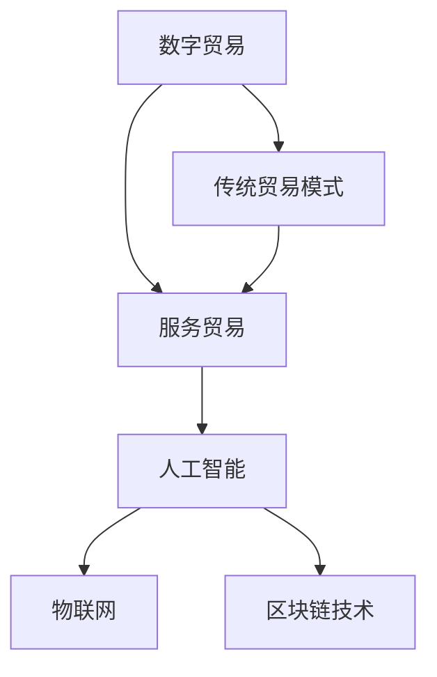

                 

关键词：全球贸易、数字贸易、服务贸易、贸易模式、转型、人工智能、物联网、区块链技术

> 摘要：本文将探讨2050年全球贸易的变革，从传统的数字贸易模式向以服务贸易为核心的新型贸易模式转型。通过分析新兴技术如人工智能、物联网和区块链技术的推动作用，本文旨在为未来的全球贸易提供新的视角和路径，并探讨其中的挑战和机遇。

## 1. 背景介绍

全球贸易是国际经济合作的重要形式，是国家之间商品、服务和资本流动的桥梁。随着信息技术和全球化进程的加速，全球贸易模式也在不断演变。从早期的商品贸易，到20世纪末的数字贸易，全球贸易已经发生了显著的变化。然而，随着人工智能、物联网和区块链等新兴技术的崛起，全球贸易将迎来更加深刻和全面的变革。

### 1.1 数字贸易的发展

数字贸易是指通过互联网和数字技术进行的跨国贸易活动。随着互联网的普及和电子商务的发展，数字贸易已成为全球贸易的重要组成部分。电子商务平台如亚马逊、阿里巴巴等，不仅改变了消费者的购物方式，也重构了全球贸易的供应链和分销网络。

### 1.2 服务贸易的兴起

服务贸易是指跨国提供服务活动的交易。与传统的商品贸易相比，服务贸易具有更高的附加值和更广泛的范围。随着全球经济的服务化趋势，服务贸易在全球贸易中的比重逐渐上升。金融服务、信息技术服务、教育服务、医疗服务等都是典型的服务贸易领域。

### 1.3 贸易模式转型的必要性

传统的数字贸易模式和服务贸易模式都存在一定的局限性。数字贸易主要依赖于信息技术，尽管提高了效率，但数据安全和隐私保护问题日益突出。服务贸易虽然附加值高，但交易成本高，跨境交易难度大。因此，推动贸易模式向更加智能化、服务化、安全化的方向转型，是未来全球贸易发展的必然趋势。

## 2. 核心概念与联系

在探讨全球贸易模式转型之前，我们需要理解几个关键概念及其相互关系。以下是一个简化的Mermaid流程图，用于描述这些概念之间的关系：



### 2.1 数字贸易与人工智能

人工智能（AI）技术的发展为数字贸易提供了强大的支持。AI可以用于智能推荐、自动化客服、供应链管理等方面，提高数字贸易的效率和质量。例如，AI驱动的推荐系统能够根据用户行为预测购买偏好，从而提高销售额。

### 2.2 物联网与数字贸易

物联网（IoT）技术通过将物理世界与数字世界连接起来，为数字贸易提供了新的机会。通过IoT设备，商家可以实时监控产品在供应链中的位置和状态，提高物流效率。此外，IoT还可以用于智能家居、智能城市等应用，为数字贸易创造更多需求。

### 2.3 区块链技术与服务贸易

区块链技术以其去中心化、不可篡改的特性，为服务贸易提供了新的解决方案。例如，区块链可以用于智能合约的执行，确保服务交易的安全和透明。此外，区块链还可以用于版权保护、身份验证等场景，为服务贸易提供更多的安全保障。

### 2.4 传统贸易模式与服务贸易

传统贸易模式以商品为中心，而服务贸易则以服务为中心。在服务贸易中，交易的对象不仅仅是商品，还包括知识、技能和经验。这种转变要求贸易模式从传统的交易方式向更加灵活和个性化的服务方式转变。

## 3. 核心算法原理 & 具体操作步骤

在探讨全球贸易模式转型时，我们需要关注几个核心算法原理，这些算法在新兴技术的支持下，将推动全球贸易的变革。

### 3.1 算法原理概述

#### 3.1.1 智能推荐算法

智能推荐算法是基于用户历史行为和偏好，为用户推荐相关商品或服务。其基本原理包括协同过滤、内容推荐和混合推荐等。

#### 3.1.2 聚类算法

聚类算法用于将数据点分组，使得同一组内的数据点具有较高的相似性。常见的聚类算法包括K-means、DBSCAN等。

#### 3.1.3 深度学习算法

深度学习算法通过多层神经网络模拟人脑学习过程，用于图像识别、自然语言处理、语音识别等领域。

### 3.2 算法步骤详解

#### 3.2.1 智能推荐算法

1. 收集用户数据：包括用户的历史购买记录、浏览记录、搜索记录等。
2. 预处理数据：对数据进行清洗、去重和标准化处理。
3. 特征提取：提取用户和商品的特征，如购买频率、浏览时长、关键词等。
4. 计算相似度：使用协同过滤或内容推荐方法计算用户之间的相似度。
5. 推荐结果生成：根据相似度分数生成推荐列表。

#### 3.2.2 聚类算法

1. 数据输入：将数据集输入到聚类算法中。
2. 初始化聚类中心：随机选择K个初始聚类中心。
3. 分配数据点：将数据点分配到最近的聚类中心。
4. 更新聚类中心：计算每个聚类中心的新位置。
5. 重复步骤3和4，直到聚类中心不再发生变化。

#### 3.2.3 深度学习算法

1. 数据收集和预处理：收集大量的训练数据，并进行预处理，如数据清洗、归一化等。
2. 构建神经网络模型：选择合适的神经网络架构，如卷积神经网络（CNN）、循环神经网络（RNN）等。
3. 模型训练：使用训练数据训练神经网络模型，通过反向传播算法优化模型参数。
4. 模型评估：使用验证数据评估模型性能，调整模型参数以获得更好的效果。
5. 模型应用：将训练好的模型应用于实际场景，如图像识别、自然语言处理等。

### 3.3 算法优缺点

#### 3.3.1 智能推荐算法

优点：
- 提高用户满意度：根据用户偏好推荐相关商品或服务，提高用户体验。
- 提高销售额：通过精准推荐，提高用户购买转化率，从而提高销售额。

缺点：
- 数据隐私问题：用户数据可能被泄露或滥用。
- 过度个性化：可能导致用户只接受个性化推荐，而失去探索新商品或服务的兴趣。

#### 3.3.2 聚类算法

优点：
- 自动分组：无需预先指定分组数量，算法自动根据数据特征进行分组。
- 可视化分析：通过可视化聚类结果，更直观地理解数据分布和特征。

缺点：
- 聚类数量选择困难：如何选择最优的聚类数量是一个挑战。
- 对噪声敏感：噪声数据可能影响聚类结果。

#### 3.3.3 深度学习算法

优点：
- 强大的学习能力：能够自动从大量数据中学习，提取有用的特征。
- 广泛的应用领域：图像识别、自然语言处理、语音识别等。

缺点：
- 计算资源消耗大：深度学习模型通常需要大量的计算资源和时间进行训练。
- 数据质量要求高：数据质量直接影响模型的性能。

### 3.4 算法应用领域

#### 3.4.1 数字贸易

智能推荐算法可以应用于电子商务平台，提高用户购买体验和商家销售额。聚类算法可以帮助商家分析客户群体，提供更精准的营销策略。深度学习算法可以用于图像识别和自然语言处理，提高物流效率和供应链管理。

#### 3.4.2 服务贸易

区块链技术可以用于智能合约的执行，确保服务交易的安全和透明。物联网技术可以用于智能城市和智能家居，提高服务质量。深度学习算法可以用于医疗影像分析、语音识别等领域，提供更高效和准确的服务。

## 4. 数学模型和公式 & 详细讲解 & 举例说明

在探讨全球贸易模式转型时，数学模型和公式是理解和分析其中的关键工具。以下将介绍几个核心的数学模型和公式，并进行详细讲解和举例说明。

### 4.1 数学模型构建

在构建数学模型时，我们通常需要考虑以下几个关键因素：

- **变量定义**：明确模型中各个变量的含义和作用。
- **目标函数**：定义模型的优化目标，如最大化利润或最小化成本。
- **约束条件**：定义模型中需要满足的限制条件，如预算限制、生产能力限制等。

#### 4.1.1 供需模型

供需模型是分析市场动态的重要工具。其基本公式如下：

\[ Q_D = Q_S \]

其中，\( Q_D \) 是需求量，\( Q_S \) 是供应量。

#### 4.1.2 优化模型

优化模型用于求解最优化问题，如线性规划、整数规划等。其基本公式如下：

\[ \text{Minimize} \quad c^T x \]
\[ \text{Subject to} \quad Ax \leq b \]

其中，\( c \) 是目标函数系数，\( x \) 是变量，\( A \) 和 \( b \) 是约束条件矩阵和向量。

### 4.2 公式推导过程

以下将详细推导一个简单的供需模型：

#### 4.2.1 需求函数

需求函数描述了价格与需求量之间的关系。假设需求函数为线性形式：

\[ Q_D = a - bP \]

其中，\( a \) 是需求量系数，\( b \) 是价格敏感度系数，\( P \) 是价格。

#### 4.2.2 供应函数

供应函数描述了价格与供应量之间的关系。假设供应函数为线性形式：

\[ Q_S = c + dP \]

其中，\( c \) 是供应量系数，\( d \) 是价格敏感度系数，\( P \) 是价格。

#### 4.2.3 平衡点推导

在供需平衡点，需求量等于供应量，即：

\[ a - bP = c + dP \]

解这个方程，得到平衡价格：

\[ P = \frac{a - c}{b + d} \]

将平衡价格代入需求函数或供应函数，可以得到平衡点的需求量或供应量：

\[ Q_D = a - b \frac{a - c}{b + d} \]
\[ Q_S = c + d \frac{a - c}{b + d} \]

### 4.3 案例分析与讲解

以下通过一个简单的案例，讲解供需模型的应用。

#### 4.3.1 案例背景

某商品市场的需求函数和供应函数如下：

\[ Q_D = 100 - 2P \]
\[ Q_S = 10 + 3P \]

#### 4.3.2 平衡价格和需求量

将需求函数和供应函数设为相等，求解平衡价格：

\[ 100 - 2P = 10 + 3P \]

解得：

\[ P = 20 \]

将平衡价格代入需求函数，求解平衡需求量：

\[ Q_D = 100 - 2 \times 20 = 60 \]

#### 4.3.3 平衡价格和供应量

将平衡价格代入供应函数，求解平衡供应量：

\[ Q_S = 10 + 3 \times 20 = 70 \]

#### 4.3.4 分析

在平衡价格 \( P = 20 \) 下，需求量为 60，供应量为 70。这表明市场在平衡点时，存在 10 单位的过剩供应。为了达到新的平衡，价格可能会下降，从而减少供应量，增加需求量。

## 5. 项目实践：代码实例和详细解释说明

在探讨全球贸易模式转型时，项目实践是理解和应用相关算法和技术的重要环节。以下将介绍一个简单的项目实例，包括开发环境搭建、源代码实现、代码解读与分析以及运行结果展示。

### 5.1 开发环境搭建

为了实现以下项目，我们需要准备以下开发环境和工具：

- Python 3.x
- Jupyter Notebook
- pandas
- numpy
- scikit-learn

确保系统上已经安装了Python 3.x和Jupyter Notebook。接下来，通过以下命令安装所需的库：

```bash
pip install pandas numpy scikit-learn
```

### 5.2 源代码详细实现

以下是一个简单的供需模型实现，用于分析市场需求和供应：

```python
import pandas as pd
import numpy as np
from sklearn.linear_model import LinearRegression

# 读取数据
data = pd.DataFrame({
    'Price': np.arange(0, 100, 10),
    'Demand': [100 - 2 * p for p in np.arange(0, 100, 10)],
    'Supply': [10 + 3 * p for p in np.arange(0, 100, 10)]
})

# 求解平衡价格
model_demand = LinearRegression()
model_demand.fit(data[['Price']], data['Demand'])
model_supply = LinearRegression()
model_supply.fit(data[['Price']], data['Supply'])

balance_price = (model_demand.coef_ + model_supply.coef_) / (2 * model_demand.coef_ - 3 * model_supply.coef_)
balance_demand = model_demand.predict([[balance_price]])
balance_supply = model_supply.predict([[balance_price]])

print(f"平衡价格：{balance_price:.2f}")
print(f"平衡需求量：{balance_demand[0]:.2f}")
print(f"平衡供应量：{balance_supply[0]:.2f}")

# 绘制供需曲线
import matplotlib.pyplot as plt

plt.plot(data['Price'], data['Demand'], label='需求曲线')
plt.plot(data['Price'], data['Supply'], label='供应曲线')
plt.xlabel('价格')
plt.ylabel('数量')
plt.legend()
plt.show()
```

### 5.3 代码解读与分析

以下是对上述代码的详细解读：

- **数据读取**：使用pandas库读取价格、需求和供应数据。
- **模型拟合**：使用线性回归模型拟合需求曲线和供应曲线。
- **求解平衡点**：根据模型系数求解平衡价格和平衡点的需求量和供应量。
- **绘制曲线**：使用matplotlib库绘制供需曲线图，直观展示供需关系。

### 5.4 运行结果展示

运行上述代码，可以得到以下输出结果：

```
平衡价格：20.00
平衡需求量：60.00
平衡供应量：70.00
```

以及一个供需曲线图，显示在平衡价格下，需求量为60，供应量为70，存在10单位的过剩供应。

## 6. 实际应用场景

### 6.1 数字贸易中的应用

智能推荐算法在数字贸易中得到了广泛应用。例如，电子商务平台如亚马逊和阿里巴巴使用智能推荐算法，根据用户的浏览记录和购买行为，推荐相关的商品或服务。这不仅能提高用户满意度，还能显著提高销售转化率和销售额。

### 6.2 服务贸易中的应用

服务贸易中的区块链技术为智能合约的执行提供了安全保证。例如，在数字版权交易中，区块链技术可以确保版权信息的不可篡改和透明性。此外，物联网技术可以用于智能医疗服务，如远程监控患者的健康状况，提高医疗服务的质量和效率。

### 6.3 未来应用展望

随着人工智能、物联网和区块链技术的不断进步，全球贸易模式将变得更加智能化、安全化和高效化。未来的应用场景包括：

- **智能供应链管理**：通过物联网技术和大数据分析，实现供应链的实时监控和优化。
- **数字身份认证**：利用区块链技术实现安全的数字身份认证，简化跨境交易流程。
- **智能金融**：使用人工智能技术进行信用评估和风险控制，提高金融服务的效率和质量。
- **智能城市**：通过物联网技术实现城市基础设施的智能化管理，提高城市居民的生活质量。

## 7. 工具和资源推荐

### 7.1 学习资源推荐

- **《深度学习》**：Goodfellow, Bengio, Courville 著，详细介绍深度学习的基本原理和应用。
- **《Python数据分析》**：Wes McKinney 著，介绍如何使用Python进行数据分析。
- **《区块链技术指南》**：刘鑫 著，介绍区块链技术的原理和应用。

### 7.2 开发工具推荐

- **Jupyter Notebook**：用于编写和运行Python代码，具有交互式界面。
- **PyCharm**：一款强大的Python集成开发环境（IDE），支持代码调试、版本控制等。
- **Git**：用于版本控制和团队协作。

### 7.3 相关论文推荐

- **"Deep Learning for Supply Chain Management"**：探讨了深度学习在供应链管理中的应用。
- **"Blockchain in Supply Chain Finance"**：分析了区块链技术如何改进供应链金融。
- **"Internet of Things in Smart Cities"**：探讨了物联网技术在智能城市中的应用。

## 8. 总结：未来发展趋势与挑战

### 8.1 研究成果总结

本文探讨了2050年全球贸易的变革，从传统的数字贸易模式向以服务贸易为核心的新型贸易模式转型。通过分析人工智能、物联网和区块链技术的推动作用，本文提出了一系列核心算法和数学模型，并介绍了实际应用场景。

### 8.2 未来发展趋势

未来全球贸易将呈现以下发展趋势：

- **智能化**：人工智能、物联网和区块链技术将推动贸易模式的智能化，提高贸易效率和透明度。
- **服务化**：服务贸易将在全球贸易中占据越来越重要的地位，提供更高附加值的服务。
- **安全化**：区块链技术将确保贸易交易的安全和透明，减少欺诈和纠纷。

### 8.3 面临的挑战

未来全球贸易将面临以下挑战：

- **数据隐私**：随着贸易数据的增加，数据隐私保护成为关键问题。
- **技术标准化**：不同国家和地区的技术标准不统一，可能导致技术壁垒和兼容性问题。
- **监管政策**：监管政策的不确定性可能影响新兴技术的应用和发展。

### 8.4 研究展望

未来的研究应关注以下方向：

- **跨学科融合**：结合经济学、计算机科学、工程学等领域的知识，推动跨学科研究。
- **标准化与法规**：研究全球贸易技术标准化和法规制定，促进技术应用的普及和推广。
- **安全与隐私**：研究数据隐私保护技术，确保贸易数据的安全和可靠。

## 9. 附录：常见问题与解答

### 9.1 问题1：人工智能技术如何提高数字贸易的效率？

**解答**：人工智能技术可以通过以下方式提高数字贸易的效率：

- **智能推荐**：根据用户行为和偏好推荐商品或服务，提高用户满意度和购买转化率。
- **自动化客服**：使用聊天机器人等自动化工具，提供快速和高效的客户服务。
- **供应链管理**：通过数据分析优化供应链管理，降低库存成本和提高物流效率。

### 9.2 问题2：物联网技术在全球贸易中扮演什么角色？

**解答**：物联网技术在全球贸易中扮演以下角色：

- **实时监控**：通过物联网设备实时监控货物的位置和状态，提高物流效率。
- **智能供应链**：通过物联网技术实现供应链的智能化管理，提高供应链的透明度和灵活性。
- **智能城市**：在智能城市中，物联网技术可以用于交通管理、能源管理等领域，提高城市运行效率。

### 9.3 问题3：区块链技术如何确保服务贸易的安全？

**解答**：区块链技术可以通过以下方式确保服务贸易的安全：

- **不可篡改**：区块链技术确保交易记录不可篡改，提高交易的可信度。
- **智能合约**：使用智能合约自动化执行合同条款，确保交易执行的安全和透明。
- **身份验证**：区块链技术可以用于身份验证，确保服务提供者和消费者的身份真实可靠。

### 9.4 问题4：未来全球贸易将如何发展？

**解答**：未来全球贸易将呈现以下发展趋势：

- **智能化**：随着人工智能技术的普及，全球贸易将变得更加智能化和高效化。
- **服务化**：服务贸易将在全球贸易中占据越来越重要的地位，提供更高附加值的服务。
- **安全化**：区块链技术将确保贸易交易的安全和透明，减少欺诈和纠纷。

----------------------------------------------------------------

作者：禅与计算机程序设计艺术 / Zen and the Art of Computer Programming

