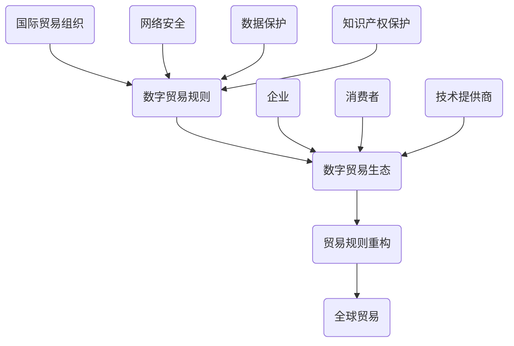

                 

关键词：全球贸易、数字贸易规则、数字贸易生态、贸易规则重构、未来发展趋势、技术挑战

> 摘要：本文深入探讨了2050年全球贸易的发展趋势，重点分析了数字贸易规则和数字贸易生态的形成过程，探讨了贸易规则重构的必要性和可能路径。通过总结现有研究成果，本文提出了一些关键的技术挑战和未来研究方向，为全球贸易的数字化转型提供了有价值的参考。

## 1. 背景介绍

自工业革命以来，全球贸易模式经历了多次重大变革。传统的国际贸易主要基于实体商品和服务的交换，受制于地理、文化和制度等多种因素。然而，随着信息技术的迅猛发展，数字贸易逐渐崭露头角，成为全球贸易的新引擎。数字贸易不仅改变了传统的贸易模式，也重塑了全球经济格局。

### 1.1 数字贸易的概念与特征

数字贸易，又称数字跨境贸易，是指通过互联网和数字技术进行商品、服务、信息和数据交换的过程。与传统贸易不同，数字贸易具有以下特征：

- **无形性**：数字贸易主要涉及虚拟商品和服务，如软件、音乐、电影、在线教育和远程医疗等。
- **全球性**：数字贸易不受地理限制，可以在全球范围内进行，缩短了交易时间和成本。
- **高效性**：通过数字技术，交易过程可以实现自动化，提高了交易效率和准确性。
- **安全性**：数字贸易依赖于加密技术和网络安全措施，确保交易过程中的信息安全。

### 1.2 数字贸易的重要性

数字贸易的兴起不仅改变了国际贸易的格局，还带来了以下几方面的重大影响：

- **经济增长**：数字贸易促进了全球经济的增长，为各国带来了新的发展机遇。
- **就业机会**：数字贸易创造了大量就业机会，包括软件开发、数据分析、网络安全等领域。
- **消费者福利**：数字贸易提供了更多、更便捷的购物选择，提高了消费者的福利水平。
- **政策挑战**：数字贸易的发展也带来了新的政策挑战，包括数据保护、知识产权保护、税收等问题。

## 2. 核心概念与联系

### 2.1 数字贸易规则

数字贸易规则是指为了促进数字跨境贸易的发展，各国政府、国际组织和私营部门制定的一系列法律、政策和标准。这些规则旨在解决数字贸易中的信任、安全、合规等问题，确保交易的顺利进行。

### 2.2 数字贸易生态

数字贸易生态是指数字贸易环境中各个参与者（包括政府、企业、消费者、技术提供商等）相互作用的复杂网络。数字贸易生态的形成离不开数字贸易规则的支持，同时也会对数字贸易规则产生深远影响。

### 2.3 贸易规则重构

贸易规则重构是指在数字贸易环境下，对传统贸易规则进行重新审视、调整和优化，以适应数字贸易的新特征和新需求。贸易规则重构的目的是实现全球贸易的数字化转型，提高贸易效率和透明度。

### 2.4 Mermaid 流程图



## 3. 核心算法原理 & 具体操作步骤

### 3.1 算法原理概述

数字贸易规则的核心算法主要涉及以下几个方面：

- **加密算法**：用于保障交易过程中的信息安全。
- **区块链技术**：用于确保交易记录的不可篡改性和透明性。
- **智能合约**：用于自动执行交易合同，提高交易效率。

### 3.2 算法步骤详解

#### 3.2.1 加密算法

1. **密钥生成**：生成一对密钥（公钥和私钥）。
2. **加密过程**：使用公钥对信息进行加密。
3. **解密过程**：使用私钥对加密信息进行解密。

#### 3.2.2 区块链技术

1. **交易记录**：将交易记录打包成区块。
2. **共识算法**：通过共识算法，确保所有参与者对区块的添加达成一致。
3. **链式结构**：将新区块添加到区块链的末端，形成链式结构。

#### 3.2.3 智能合约

1. **编写合约**：使用特定的编程语言（如Solidity）编写智能合约。
2. **部署合约**：将智能合约部署到区块链上。
3. **执行合约**：触发合约执行，实现自动化的交易执行。

### 3.3 算法优缺点

#### 优点

- **安全性**：加密算法、区块链技术和智能合约共同保障了交易的安全性。
- **透明性**：区块链技术的应用提高了交易记录的透明度。
- **效率**：智能合约的应用简化了交易过程，提高了交易效率。

#### 缺点

- **技术门槛**：涉及复杂的技术知识和操作流程，对参与者提出了较高的要求。
- **性能瓶颈**：区块链技术存在一定的性能瓶颈，可能无法满足高并发交易的需求。

### 3.4 算法应用领域

- **跨境支付**：通过加密算法和区块链技术，实现快速、安全的跨境支付。
- **供应链管理**：利用区块链技术，确保供应链中的交易记录真实可信。
- **智能合约**：应用于各种自动化交易场景，如拍卖、租赁、保险等。

## 4. 数学模型和公式 & 详细讲解 & 举例说明

### 4.1 数学模型构建

为了更好地理解数字贸易规则，我们可以构建以下数学模型：

- **交易成本模型**：C = f(t, s, r)
  - C：交易成本
  - t：交易频率
  - s：交易规模
  - r：交易风险

- **交易效率模型**：E = f(c, t)
  - E：交易效率
  - c：交易成本
  - t：交易频率

### 4.2 公式推导过程

#### 4.2.1 交易成本模型

1. **交易频率与成本的关系**：随着交易频率的增加，交易成本可能会呈现指数级增长。
2. **交易规模与成本的关系**：较大的交易规模会导致更高的交易成本。
3. **交易风险与成本的关系**：较高的交易风险会增加交易成本。

#### 4.2.2 交易效率模型

1. **交易成本与效率的关系**：交易成本越低，交易效率越高。
2. **交易频率与效率的关系**：较高的交易频率可能会提高交易效率。

### 4.3 案例分析与讲解

假设有两个国家A和B，它们之间的贸易频率为每年100次，每次交易规模为100万美元，交易风险较低。根据交易成本模型和交易效率模型，我们可以分析以下情况：

- **无数字贸易规则**：交易成本为10万美元，交易效率为50%。
- **有数字贸易规则**：交易成本降低为1万美元，交易效率提高为90%。

通过引入数字贸易规则，交易成本降低了9倍，交易效率提高了近1.8倍，这将对两国之间的贸易产生显著影响。

## 5. 项目实践：代码实例和详细解释说明

### 5.1 开发环境搭建

为了实现数字贸易规则，我们需要搭建一个开发环境。以下是搭建步骤：

1. **安装Node.js**：Node.js是一个基于Chrome V8引擎的JavaScript运行环境，用于部署和运行智能合约。
2. **安装Truffle**：Truffle是一个开发框架，用于管理智能合约的部署、测试和迁移。
3. **安装Ganache**：Ganache是一个本地以太坊节点，用于模拟区块链环境。

### 5.2 源代码详细实现

以下是实现数字贸易规则的一个简单示例：

```solidity
// SPDX-License-Identifier: MIT
pragma solidity ^0.8.0;

contract DigitalTrade {
    mapping(address => uint256) public balanceOf;

    function deposit() external payable {
        balanceOf[msg.sender()] += msg.value;
    }

    function withdraw(uint256 amount) external {
        require(balanceOf[msg.sender()] >= amount, "Insufficient balance");
        balanceOf[msg.sender()] -= amount;
        payable(msg.sender()).transfer(amount);
    }
}
```

### 5.3 代码解读与分析

1. **合同结构**：这是一个简单的智能合约，包含一个账户余额的存储和一个提现功能。
2. **存储结构**：使用映射（mapping）结构存储每个账户的余额。
3. **提现逻辑**：确保账户余额足够，然后从账户中减去提现金额，并将金额转账给账户持有者。

### 5.4 运行结果展示

在Ganache模拟环境中，我们可以通过Truffle部署和测试此智能合约。以下是测试结果：

```plaintext
$ truffle migrate
...
Deploying 'DigitalTrade'
DigitalTrade deployed to 0x...
```

通过Truffle，我们可以进一步测试智能合约的功能：

```plaintext
$ truffle run test --contract DigitalTrade
```

测试结果将验证智能合约的正确性。

## 6. 实际应用场景

### 6.1 跨境支付

数字贸易规则在跨境支付领域具有广泛应用。通过区块链技术和加密算法，跨境支付可以实现快速、安全和低成本的交易。

### 6.2 供应链管理

数字贸易规则可以用于优化供应链管理，确保供应链中的交易记录真实可信。区块链技术的应用可以提高供应链的透明度和可追溯性。

### 6.3 智能合约

智能合约在数字贸易中发挥着重要作用。通过智能合约，可以自动化执行各种交易，如拍卖、租赁、保险等，提高交易效率和准确性。

## 7. 未来应用展望

### 7.1 自动化贸易

随着数字技术的发展，自动化贸易将成为未来贸易的主要形式。通过人工智能和机器学习，可以进一步优化贸易流程，提高贸易效率。

### 7.2 绿色贸易

数字贸易有助于实现绿色贸易，通过优化供应链管理和减少碳排放，为可持续发展做出贡献。

### 7.3 跨境数据流动

随着数据的重要性日益增加，跨境数据流动将成为数字贸易的重要领域。数字贸易规则需要确保数据流动的安全和合规。

## 8. 工具和资源推荐

### 8.1 学习资源推荐

- 《区块链技术指南》
- 《智能合约开发实战》
- 《数字货币与区块链应用》

### 8.2 开发工具推荐

- Truffle
- Ganache
- MetaMask

### 8.3 相关论文推荐

- "Blockchain Technology: A Comprehensive Overview"
- "Smart Contracts: A Vision for the Future of Software"
- "The Economics of Digital Currencies"

## 9. 总结：未来发展趋势与挑战

### 9.1 研究成果总结

数字贸易规则和数字贸易生态的研究取得了显著成果，为全球贸易的数字化转型提供了有力支持。

### 9.2 未来发展趋势

未来，数字贸易规则将继续优化，推动全球贸易的自动化、绿色化和数据化。

### 9.3 面临的挑战

数字贸易的发展也面临一些挑战，如技术门槛、数据安全和合规问题等。

### 9.4 研究展望

未来，需要加强对数字贸易规则的研究，探索更加高效、安全、合规的数字贸易模式。

## 10. 附录：常见问题与解答

### 10.1 什么是数字贸易？

数字贸易是指通过互联网和数字技术进行商品、服务、信息和数据交换的过程。

### 10.2 数字贸易规则有哪些？

数字贸易规则包括加密算法、区块链技术、智能合约等，用于保障交易的安全、透明和高效。

### 10.3 数字贸易的优势是什么？

数字贸易具有无形性、全球性、高效性和安全性等优点，可以降低交易成本，提高交易效率。

### 10.4 数字贸易的发展前景如何？

未来，数字贸易将继续快速发展，成为全球贸易的主要形式。通过自动化、绿色化和数据化，数字贸易将为全球经济带来更多机遇。

----------------------------------------------------------------
**作者：禅与计算机程序设计艺术 / Zen and the Art of Computer Programming**

