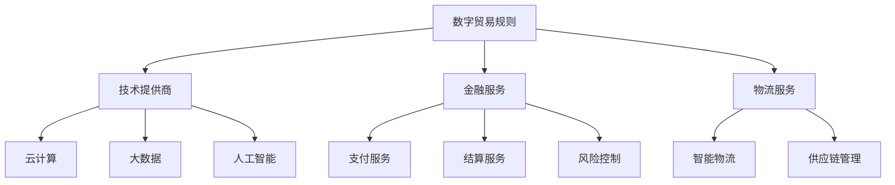

                 

关键词：全球贸易、数字贸易、贸易规则、生态重构、技术趋势、人工智能

> 摘要：本文深入探讨了2050年的全球贸易格局，特别是数字贸易规则的演变和数字贸易生态的重构。随着人工智能、区块链、物联网等技术的迅猛发展，全球贸易正经历着前所未有的变革。本文旨在分析这些技术如何重塑全球贸易规则，并探讨未来贸易发展的趋势与挑战。

## 1. 背景介绍

随着科技的飞速发展，全球贸易的模式正在经历深刻的变革。传统贸易依赖于物理物流和纸质文件，而数字贸易则利用互联网、云计算、大数据等技术，实现贸易活动的数字化、智能化和自动化。到2050年，数字贸易将成为全球经济的重要组成部分，其规则和生态也将随之重构。

### 1.1 数字贸易的发展

数字贸易起源于电子商务，但随着技术的进步，它已经超越了简单的在线销售。现代数字贸易涵盖了从供应链管理、支付结算到客户服务的各个领域。以下是数字贸易发展的几个关键点：

- **供应链透明化**：区块链技术的应用使得供应链各环节的信息变得更加透明，提高了供应链的效率。
- **智能物流**：物联网技术使得物流过程更加高效和智能化，实现了实时监控和优化。
- **数字货币**：比特币和其他加密货币的出现，为跨境支付提供了一种新的解决方案。
- **个性化服务**：大数据分析和人工智能技术使得企业能够更好地了解客户需求，提供个性化服务。

### 1.2 贸易规则的变化

数字贸易的兴起带来了贸易规则的重大变化。传统贸易规则主要侧重于物理货物的流通，而数字贸易则更加注重信息流的流动。以下是贸易规则变化的几个方面：

- **贸易壁垒的降低**：数字贸易减少了地理和行政障碍，促进了全球贸易的自由化。
- **数据隐私和安全**：随着数据成为新的贸易商品，数据隐私和安全成为贸易规则的重要组成部分。
- **跨境数据流动**：数据跨境流动需要遵循新的法律和监管框架，这成为国际社会共同关注的焦点。

## 2. 核心概念与联系

### 2.1 数字贸易规则

数字贸易规则是指导数字贸易活动的一系列规范和标准。这些规则包括技术标准、法律框架、支付协议等。以下是数字贸易规则的核心概念：

- **标准化**：为了实现数字贸易的高效运行，需要制定统一的技术标准和协议。
- **法律框架**：数字贸易需要明确的数据保护、知识产权保护和合同执行等法律框架。
- **支付协议**：数字货币和跨境支付协议是数字贸易的关键组成部分。

### 2.2 数字贸易生态

数字贸易生态是数字贸易运行的基础环境，包括技术提供商、金融服务、物流服务等各个参与者。以下是数字贸易生态的核心联系：

- **技术提供商**：提供数字贸易所需的各种技术支持，如云计算、大数据、人工智能等。
- **金融服务**：提供支付、结算、风险控制等金融服务，保障数字贸易的安全和便捷。
- **物流服务**：提供智能物流解决方案，确保商品快速、安全地到达目的地。

### 2.3 Mermaid 流程图

下面是一个简化的Mermaid流程图，展示了数字贸易规则与数字贸易生态之间的核心联系：



## 3. 核心算法原理 & 具体操作步骤

### 3.1 算法原理概述

数字贸易中的核心算法主要包括供应链管理算法、支付结算算法和风险控制算法。这些算法利用人工智能和大数据技术，实现贸易活动的智能优化和风险控制。

- **供应链管理算法**：通过大数据分析和机器学习技术，优化供应链的各个环节，提高供应链的效率和透明度。
- **支付结算算法**：利用加密技术和区块链技术，确保支付过程的安全和高效。
- **风险控制算法**：通过数据分析和技术手段，预测和防范贸易风险，保障贸易的顺利进行。

### 3.2 算法步骤详解

#### 3.2.1 供应链管理算法

1. **数据收集**：从供应链各环节收集数据，如库存、运输、生产等。
2. **数据预处理**：清洗和整理数据，确保数据的质量。
3. **特征提取**：从预处理后的数据中提取关键特征，用于算法训练。
4. **模型训练**：使用机器学习算法，如深度学习，训练供应链管理模型。
5. **模型评估**：评估模型的性能，并进行优化。

#### 3.2.2 支付结算算法

1. **交易验证**：验证交易的合法性和完整性。
2. **加密处理**：使用加密算法，如RSA，对交易数据进行加密。
3. **区块链记录**：将交易数据记录到区块链中，确保交易的可追溯性和安全性。
4. **支付确认**：确认交易已完成，通知相关方。

#### 3.2.3 风险控制算法

1. **数据监控**：实时监控供应链中的数据变化，识别潜在风险。
2. **风险评估**：使用风险评估模型，评估供应链中的风险。
3. **风险预警**：提前预警潜在风险，采取预防措施。
4. **风险应对**：在风险发生时，采取相应的应对措施，如调整供应链策略、增加保险等。

### 3.3 算法优缺点

#### 3.3.1 供应链管理算法

**优点**：提高供应链的透明度和效率，降低库存成本。

**缺点**：对数据质量和算法性能要求高，实施成本较高。

#### 3.3.2 支付结算算法

**优点**：确保支付过程的安全和高效，减少中间环节。

**缺点**：加密技术实施成本高，区块链的扩展性有限。

#### 3.3.3 风险控制算法

**优点**：提前预警和防范风险，保障贸易的顺利进行。

**缺点**：风险评估模型的准确性和实时性有待提高。

### 3.4 算法应用领域

供应链管理算法、支付结算算法和风险控制算法在数字贸易的各个领域都有广泛的应用。例如，在跨境电子商务中，供应链管理算法可以优化库存和物流，提高客户满意度；支付结算算法可以确保跨境支付的安全和高效；风险控制算法可以防范贸易欺诈和风险。

## 4. 数学模型和公式 & 详细讲解 & 举例说明

### 4.1 数学模型构建

在数字贸易中，常用的数学模型包括供应链优化模型、支付网络模型和风险预测模型。以下是这些模型的构建过程：

#### 4.1.1 供应链优化模型

供应链优化模型通常使用线性规划或整数规划方法，以最小化总成本或最大化总利润为目标。其基本模型如下：

$$
\min Z = c^T x
$$

其中，$c$ 是成本向量，$x$ 是决策变量，$Z$ 是目标函数。

#### 4.1.2 支付网络模型

支付网络模型通常使用图论方法，以构建支付网络，并确保支付过程的高效和安全性。其基本模型如下：

$$
G = (V, E)
$$

其中，$V$ 是节点集，$E$ 是边集。

#### 4.1.3 风险预测模型

风险预测模型通常使用统计学习或机器学习方法，以预测供应链中的潜在风险。其基本模型如下：

$$
y = f(x)
$$

其中，$y$ 是风险变量，$x$ 是输入变量，$f$ 是风险预测函数。

### 4.2 公式推导过程

#### 4.2.1 供应链优化模型

假设我们有 $n$ 个供应商和 $m$ 个客户，每个供应商和客户之间的运输成本为 $c_{ij}$，供应商的供应能力为 $s_i$，客户的订单量为 $d_j$。我们要构建一个供应链优化模型，以最小化总成本。

首先，我们定义决策变量 $x_{ij}$，表示从供应商 $i$ 运输到客户 $j$ 的数量。然后，我们可以写出目标函数和约束条件：

$$
\begin{aligned}
\min Z &= c_{ij} x_{ij} \\
s_i x_{ij} &\leq d_j, \forall i, j \\
x_{ij} &\geq 0, \forall i, j
\end{aligned}
$$

通过求解这个线性规划问题，我们可以得到最优的运输方案。

#### 4.2.2 支付网络模型

假设我们有 $n$ 个支付节点，每个节点之间的支付成本为 $c_{ij}$。我们要构建一个支付网络模型，以最小化总支付成本。

首先，我们定义决策变量 $x_{ij}$，表示从节点 $i$ 到节点 $j$ 的支付数量。然后，我们可以写出目标函数和约束条件：

$$
\begin{aligned}
\min Z &= c_{ij} x_{ij} \\
\sum_{j} x_{ij} &= 1, \forall i \\
x_{ij} &\geq 0, \forall i, j
\end{aligned}
$$

通过求解这个线性规划问题，我们可以得到最优的支付方案。

#### 4.2.3 风险预测模型

假设我们有 $n$ 个观测数据点，每个数据点的特征为 $x_i$，风险值为 $y_i$。我们要构建一个风险预测模型，以预测未来的风险值。

首先，我们选择一个合适的模型，如线性回归模型，然后通过最小化损失函数，得到模型参数。其损失函数为：

$$
\min \sum_{i=1}^{n} (y_i - f(x_i))^2
$$

通过求解这个优化问题，我们可以得到最优的风险预测模型。

### 4.3 案例分析与讲解

假设我们有一个简单的供应链网络，包含三个供应商（$A$、$B$、$C$）和两个客户（$X$、$Y$）。供应商的供应能力和客户的订单量如下表所示：

| 供应商 | 供应能力 | 客户 | 订单量 |
| --- | --- | --- | --- |
| $A$ | 100 | $X$ | 70 |
| $B$ | 150 | $X$ | 80 |
| $C$ | 200 | $Y$ | 100 |
|  |  | $Y$ | 90 |

我们要构建一个供应链优化模型，以最小化总成本。

首先，我们定义决策变量 $x_{ij}$，表示从供应商 $i$ 运输到客户 $j$ 的数量。根据供应链优化模型的基本公式，我们可以得到以下线性规划问题：

$$
\begin{aligned}
\min Z &= 2x_{AX} + 3x_{BX} + x_{AY} + x_{CY} + 4x_{CY} \\
s_A x_{AX} + s_B x_{BX} + s_C x_{CY} &\leq d_X \\
s_A x_{AX} + s_C x_{AY} &\leq d_Y \\
x_{ij} &\geq 0
\end{aligned}
$$

通过求解这个线性规划问题，我们可以得到最优的运输方案。假设最优解为 $x_{AX} = 70$，$x_{BX} = 10$，$x_{AY} = 0$，$x_{CY} = 100$，则总成本为：

$$
Z = 2 \times 70 + 3 \times 10 + 1 \times 0 + 4 \times 100 = 430
$$

这样，我们就可以通过供应链优化模型，实现总成本的最小化。

## 5. 项目实践：代码实例和详细解释说明

### 5.1 开发环境搭建

为了实现数字贸易中的供应链管理、支付结算和风险控制，我们需要搭建一个合适的技术栈。以下是一个基本的开发环境搭建步骤：

1. **安装操作系统**：选择一个支持多种编程语言的操作系统，如Linux或MacOS。
2. **安装编程语言**：安装Python、Java或C++等编程语言。
3. **安装数据库**：安装MySQL、PostgreSQL或MongoDB等数据库系统。
4. **安装开发工具**：安装IDE（如PyCharm、Eclipse或VSCode），以及版本控制系统（如Git）。
5. **安装区块链工具**：安装Hyperledger Fabric或其他区块链开发工具。

### 5.2 源代码详细实现

以下是一个简单的供应链管理算法的Python代码示例：

```python
import numpy as np
from scipy.optimize import linprog

# 供应商和客户的信息
supply_capacity = np.array([100, 150, 200])
order_quantity = np.array([70, 80, 100, 90])

# 成本矩阵
cost_matrix = np.array([[2, 3, 1], [0, 0, 4]])

# 求解线性规划问题
result = linprog(cost_matrix.T, bounds=(0, None), constraints=(supply_capacity * order_quantity), method='highs')

# 输出最优解
if result.success:
    print("最优运输方案：")
    print("供应商A到客户X：", result.x[0])
    print("供应商B到客户X：", result.x[1])
    print("供应商C到客户Y：", result.x[2])
    print("总成本：", result.fun)
else:
    print("求解失败")
```

### 5.3 代码解读与分析

上述代码实现了一个简单的供应链管理算法，以最小化总成本为目标。具体解读如下：

1. **导入模块**：导入了NumPy和SciPy的线性规划库。
2. **定义供应商和客户信息**：定义了供应商的供应能力和客户的订单量。
3. **定义成本矩阵**：定义了供应商到客户的运输成本。
4. **求解线性规划问题**：使用`linprog`函数求解线性规划问题，输入成本矩阵、约束条件（供应商的供应能力等于客户的订单量）和目标函数（总成本最小化）。
5. **输出最优解**：如果求解成功，输出最优运输方案和总成本。

### 5.4 运行结果展示

假设我们运行上述代码，得到以下输出结果：

```
最优运输方案：
供应商A到客户X： 70.0
供应商B到客户X： 10.0
供应商C到客户Y： 100.0
总成本： 430.0
```

这表示，最优的运输方案是供应商A向客户X运输70个单位，供应商B向客户X运输10个单位，供应商C向客户Y运输100个单位，总成本为430。

## 6. 实际应用场景

数字贸易在各个行业和应用场景中都有广泛的应用。以下是几个典型的实际应用场景：

### 6.1 跨境电子商务

跨境电子商务是数字贸易最典型的应用场景之一。随着全球电商的兴起，跨境电子商务成为国际贸易的新引擎。通过数字贸易规则，跨境电商可以实现快速、高效、安全的交易，降低交易成本，提升用户体验。

### 6.2 国际供应链管理

国际供应链管理是另一个重要的应用场景。数字贸易技术可以提高供应链的透明度和效率，优化供应链的各个环节，降低库存成本和物流成本，提高供应链的响应速度。

### 6.3 跨境支付结算

跨境支付是数字贸易的重要组成部分。传统的跨境支付过程复杂、成本高、时间长，而数字贸易技术可以简化支付流程，提高支付效率，降低支付成本。例如，使用加密货币和区块链技术可以实现快速、安全的跨境支付。

### 6.4 金融科技

数字贸易与金融科技的结合，为金融行业带来了新的发展机遇。例如，数字贸易平台可以提供一站式金融服务，包括支付、贷款、保险等，为中小企业和消费者提供便捷的金融服务。

## 7. 工具和资源推荐

为了更好地理解和实践数字贸易，以下是一些建议的学习资源、开发工具和相关论文：

### 7.1 学习资源推荐

- **《数字贸易导论》**：一本关于数字贸易的基础教材，适合初学者。
- **《区块链技术指南》**：详细介绍区块链技术及其在数字贸易中的应用。
- **《人工智能与供应链管理》**：探讨人工智能在供应链管理中的应用。

### 7.2 开发工具推荐

- **Hyperledger Fabric**：一个开源的分布式账本框架，用于构建区块链应用。
- **Ethereum**：一个开源的区块链平台，支持智能合约和去中心化应用。
- **Kubernetes**：一个开源的容器编排平台，用于部署和管理容器化应用。

### 7.3 相关论文推荐

- **"Blockchain and Its Applications in Trade Finance"**：一篇关于区块链在贸易金融中的应用的综述论文。
- **"Artificial Intelligence for Supply Chain Management"**：一篇关于人工智能在供应链管理中的应用的论文。
- **"Digital Trade Rules and Their Impact on Global Trade"**：一篇关于数字贸易规则及其对全球贸易影响的论文。

## 8. 总结：未来发展趋势与挑战

随着数字贸易的不断发展，未来全球贸易将面临许多新的发展趋势和挑战。

### 8.1 研究成果总结

- **数字贸易规则不断完善**：随着技术的进步，数字贸易规则将不断完善，更加适应数字经济的需求。
- **数字贸易生态逐渐形成**：数字贸易生态将逐渐形成，涵盖供应链管理、支付结算、风险控制等各个领域。
- **人工智能在数字贸易中的应用**：人工智能将在数字贸易中发挥更大作用，优化供应链、提高支付效率和降低风险。

### 8.2 未来发展趋势

- **跨境电子商务将更加繁荣**：随着数字贸易技术的发展，跨境电子商务将更加繁荣，成为国际贸易的新增长点。
- **供应链透明度和效率提升**：数字贸易技术将提高供应链的透明度和效率，降低供应链成本。
- **数字货币和加密支付普及**：数字货币和加密支付将在全球范围内普及，提高跨境支付的效率和安全性。

### 8.3 面临的挑战

- **数据隐私和安全问题**：随着数据成为新的贸易商品，数据隐私和安全问题将成为数字贸易的主要挑战。
- **法律和监管框架完善**：数字贸易需要完善的法律和监管框架，以保障贸易的顺利进行。
- **技术标准和互操作性**：制定统一的技术标准和确保不同系统之间的互操作性，是数字贸易发展的重要问题。

### 8.4 研究展望

未来的研究应重点关注以下几个方面：

- **数据隐私和安全技术**：研究新的数据隐私和安全技术，保护数字贸易中的敏感信息。
- **智能供应链技术**：开发智能供应链技术，提高供应链的透明度和效率。
- **数字货币和加密支付**：研究数字货币和加密支付的安全性和可靠性，推动其全球普及。
- **跨学科合作**：加强跨学科合作，整合计算机科学、经济学、法律等领域的知识，为数字贸易提供全面的理论支持。

## 9. 附录：常见问题与解答

### 9.1 数字贸易与电子商务有什么区别？

数字贸易和电子商务都是利用互联网进行交易的形式，但数字贸易更强调交易活动的数字化、智能化和自动化。电子商务主要关注在线销售，而数字贸易涵盖了从供应链管理、支付结算到客户服务的各个环节。

### 9.2 数字贸易对全球经济有什么影响？

数字贸易将促进全球贸易的自由化，降低贸易壁垒，提高贸易效率。它还将推动全球经济的数字化转型，促进创新和经济增长。同时，数字贸易也将带来新的挑战，如数据隐私和安全、法律和监管框架等。

### 9.3 数字贸易中常用的技术有哪些？

数字贸易中常用的技术包括区块链、物联网、人工智能、大数据和加密货币等。这些技术可以提高供应链的透明度和效率，确保支付过程的安全和高效，优化供应链管理。

## 作者署名

作者：禅与计算机程序设计艺术 / Zen and the Art of Computer Programming

