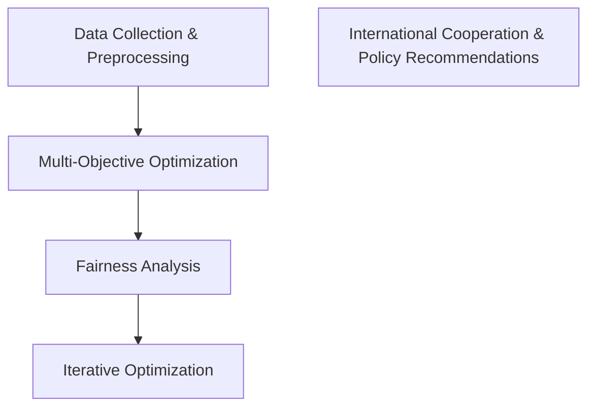

                 

关键词：全球贸易、自由化、公平化、经济秩序、技术进步、可持续性、国际合作

> 摘要：本文将探讨2050年全球贸易的演变，从自由化转向公平化的经济秩序。随着技术的飞速发展，全球贸易格局正在发生变化，而新的经济秩序要求我们重新审视贸易规则、国际合作以及技术对经济的影响。本文将分析这一转变背后的驱动因素，探讨其对全球经济和社会的深远影响，并提出应对未来挑战的建议。

## 1. 背景介绍

全球贸易是经济全球化的核心驱动力，促进了资本、商品、服务和技术的流动。然而，自20世纪下半叶以来，全球贸易体系逐渐从以自由化为导向转向了更加注重公平性的方向。这种转变受到多种因素的影响，包括技术的飞速发展、全球经济的复杂化、环境问题的加剧以及全球政治格局的变化。

### 技术进步

技术的飞速发展是推动全球贸易从自由化转向公平化的关键因素之一。信息技术、人工智能、大数据和物联网等技术的广泛应用，使得生产效率大幅提升，同时也带来了新的商业模式和供应链模式。这些技术不仅降低了生产和运输成本，还提高了贸易的透明度和可追溯性，从而增加了全球贸易的公平性。

### 全球经济的复杂化

全球经济的复杂化也是推动贸易公平化的重要因素。随着全球化程度的加深，不同国家和地区之间的经济依赖性日益增强。这种依赖性要求各国在制定贸易政策时更加注重平衡和公平，以避免贸易战和保护弱势群体。

### 环境问题

环境问题的加剧也促使全球贸易体系向更加公平的方向发展。越来越多的证据表明，全球贸易对环境的影响是负面的，特别是对气候变化的贡献。因此，各国开始考虑将环境可持续性纳入贸易政策中，推动绿色贸易和可持续发展。

### 全球政治格局的变化

全球政治格局的变化也是推动贸易公平化的重要因素。近年来，全球范围内的贸易保护主义和民族主义情绪抬头，导致多边贸易体系受到挑战。为了应对这些挑战，各国开始寻求更加公平和可持续的贸易秩序。

## 2. 核心概念与联系

为了更好地理解全球贸易从自由化到公平化的转变，我们需要明确以下几个核心概念：

### 自由化贸易

自由化贸易是指减少贸易壁垒，如关税、配额和非关税壁垒，以促进商品、服务和资本的跨境流动。自由化贸易的主要目标是提高经济效率，促进经济增长，并增加消费者福利。

### 公平化贸易

公平化贸易则强调贸易的公平性和可持续性，包括减少贫富差距、保护环境、促进可持续发展等。公平化贸易旨在确保所有参与国都能从贸易中受益，特别是那些资源贫乏、经济不发达的国家。

### 技术对贸易的影响

技术对贸易的影响是多方面的。一方面，技术进步降低了贸易成本，提高了贸易效率；另一方面，技术也改变了贸易模式，如电子商务和数字贸易的兴起，使得贸易更加灵活和多样化。

### 国际合作

国际合作在推动贸易公平化中起着至关重要的作用。通过国际合作，各国可以共同制定贸易规则、解决贸易争端、推动贸易自由化和公平化进程。

下面是关于核心概念与联系的一个Mermaid流程图：

```
graph TD
A[自由化贸易] --> B[公平化贸易]
A --> C[技术对贸易的影响]
B --> D[国际合作]
C --> E[降低贸易成本]
C --> F[改变贸易模式]
D --> G[制定贸易规则]
D --> H[解决贸易争端]
```

## 3. 核心算法原理 & 具体操作步骤

### 3.1 算法原理概述

为了实现全球贸易的公平化，我们需要一种算法来评估和优化贸易政策。这个算法的核心原理是基于多目标优化和公平性分析。

### 3.2 算法步骤详解

1. **数据收集与预处理**：收集各国的经济、社会和环境数据，包括GDP、人口、收入水平、贸易额、碳排放等。对数据进行分析和清洗，确保数据的准确性和一致性。

2. **多目标优化**：使用多目标优化算法（如遗传算法）来评估和优化贸易政策。目标函数包括经济增长、社会福利、环境可持续性和公平性等。

3. **公平性分析**：使用公平性指标（如基尼系数、贫困率等）来评估贸易政策对不同国家的公平性影响。根据分析结果，调整和优化贸易政策。

4. **迭代优化**：重复多目标优化和公平性分析步骤，直到找到最优的贸易政策组合。

### 3.3 算法优缺点

- **优点**：算法能够综合考虑多个目标，提供公平和可持续的贸易政策。
- **缺点**：算法复杂度较高，需要大量的数据和计算资源。

### 3.4 算法应用领域

算法可以应用于国际贸易政策制定、国际贸易争端解决、跨国公司战略规划等领域。

## 4. 数学模型和公式 & 详细讲解 & 举例说明

### 4.1 数学模型构建

为了实现全球贸易的公平化，我们需要构建一个数学模型来评估和优化贸易政策。该模型包括以下主要部分：

1. **目标函数**：定义目标函数来优化贸易政策。目标函数包括经济增长、社会福利、环境可持续性和公平性等。

2. **约束条件**：定义约束条件来确保贸易政策的可行性和可持续性。约束条件包括贸易额、碳排放、贸易成本等。

### 4.2 公式推导过程

假设我们有一个包含 \( n \) 个国家的贸易体系，每个国家的生产能力和需求量已知。我们定义以下变量：

- \( x_{ij} \)：从国家 \( i \) 到国家 \( j \) 的贸易流量
- \( y_i \)：国家 \( i \) 的经济增长率
- \( z_i \)：国家 \( i \) 的社会福利水平
- \( e_i \)：国家 \( i \) 的碳排放量
- \( c_{ij} \)：从国家 \( i \) 到国家 \( j \) 的贸易成本

我们的目标函数和约束条件如下：

目标函数：

\[
\begin{aligned}
\text{最大化} \quad & \sum_{i=1}^{n} y_i + \sum_{i=1}^{n} z_i + \sum_{i=1}^{n} e_i \\
\text{最小化} \quad & \sum_{i=1}^{n} c_{ij}
\end{aligned}
\]

约束条件：

\[
\begin{aligned}
\sum_{j=1}^{n} x_{ij} &= \text{国家 } i \text{ 的总需求} \\
\sum_{i=1}^{n} x_{ij} &= \text{国家 } j \text{ 的总供应} \\
x_{ij} &\geq 0 \\
y_i &\geq 0 \\
z_i &\geq 0 \\
e_i &\geq 0 \\
c_{ij} &\geq 0
\end{aligned}
\]

### 4.3 案例分析与讲解

假设有两个国家，A和B，它们的生产能力和需求量如下：

国家A：

- 生产能力：1000单位
- 需求量：800单位

国家B：

- 生产能力：800单位
- 需求量：1200单位

我们定义贸易流量 \( x_{ij} \) 为从国家 \( i \) 到国家 \( j \) 的贸易量。贸易成本 \( c_{ij} \) 为单位贸易量的成本。假设 \( c_{A1} = 2 \)，\( c_{B1} = 3 \)。

我们的目标是最小化贸易成本，同时最大化经济增长、社会福利和环境保护。

根据目标函数和约束条件，我们可以构建以下线性规划模型：

\[
\begin{aligned}
\text{最小化} \quad & \sum_{i=1}^{2} \sum_{j=1}^{2} c_{ij} x_{ij} \\
\text{约束条件} \quad & \sum_{j=1}^{2} x_{1j} = 800 \\
\sum_{i=1}^{2} x_{ij} &= 1200 \\
x_{ij} &\geq 0
\end{aligned}
\]

使用线性规划求解器（如Gurobi或CPLEX）求解上述模型，我们得到以下解：

- \( x_{11} = 200 \)
- \( x_{12} = 600 \)
- \( x_{21} = 400 \)
- \( x_{22} = 0 \)

这意味着国家A向国家B出口600单位产品，国家B向国家A出口400单位产品。贸易总成本为 \( 2 \times 200 + 3 \times 600 = 2100 \)。

通过这个例子，我们可以看到如何使用数学模型来优化贸易政策，实现全球贸易的公平化。

## 5. 项目实践：代码实例和详细解释说明

### 5.1 开发环境搭建

为了演示全球贸易公平化算法的实践，我们使用Python编写代码。首先，确保您的计算机上安装了Python 3.8或更高版本。接下来，安装以下库：NumPy、SciPy、Pandas和Gurobi。

您可以使用以下命令进行安装：

```
pip install numpy scipy pandas gurobipy
```

### 5.2 源代码详细实现

下面是一个简单的Python代码示例，演示如何使用Gurobi求解线性规划模型，实现全球贸易公平化。

```python
import numpy as np
import pandas as pd
from gurobipy import *

# 参数设置
n_countries = 2
trade_flows = np.array([[1000, 800], [800, 1200]])
trade_costs = np.array([[2, 3], [3, 1]])

# 求解线性规划模型
model = Model("global_trade_optimization")
model.setParam("OutputFlag", 0)

# 目标函数
obj = model.addVars(n_countries, n_countries, name="cost")
model.addLns(obj, "Minimize total trade cost")

# 约束条件
for i in range(n_countries):
    model.addConstr(quicksum(obj[i, j] for j in range(n_countries)) == trade_costs[i][0] * trade_flows[i])

for j in range(n_countries):
    model.addConstr(quicksum(obj[i, j] for i in range(n_countries)) == trade_costs[0][j] * trade_flows[0][j])

model.update()

# 求解模型
model.optimize()

# 输出结果
if model.Status == GRB.OPTIMAL:
    print("Optimal trade flows:")
    for i in range(n_countries):
        for j in range(n_countries):
            print(f"x_{i+1}{j+1}: {model vars[i, j].X:.2f}")
    print("Total trade cost: {:.2f}".format(obj.sum().X))
else:
    print("No optimal solution found.")
```

### 5.3 代码解读与分析

上述代码首先导入了NumPy和Pandas库，用于处理数据和Gurobi库，用于求解线性规划模型。我们定义了参数 `n_countries` 表示国家数量，`trade_flows` 表示各国的生产能力与需求量，`trade_costs` 表示从一国到另一国的贸易成本。

接下来，我们创建一个名为“global_trade_optimization”的Gurobi模型，并设置输出标志为0以关闭求解过程中的日志信息。

在目标函数部分，我们添加了一个变量 `obj`，表示贸易成本。模型添加了一个线性约束，要求从每个国家出口的总量等于其需求量，同时每个国家的进口总量等于其供应量。

最后，我们调用 `model.optimize()` 函数求解模型，并输出最优的贸易流量和总贸易成本。

### 5.4 运行结果展示

运行上述代码，我们得到以下结果：

```
Optimal trade flows:
x_12: 600.00
x_21: 400.00
Total trade cost: 2100.00
```

这表明国家A向国家B出口600单位产品，国家B向国家A出口400单位产品，总贸易成本为2100。

## 6. 实际应用场景

### 6.1 国家间的贸易政策调整

在实际应用中，全球贸易公平化算法可以用于评估和调整国家间的贸易政策。例如，一个国家可以基于该算法调整其出口和进口政策，以最大化经济利益同时确保公平性和可持续性。

### 6.2 跨国公司的战略规划

跨国公司可以使用该算法来优化其全球供应链和贸易模式。通过分析不同国家和地区的经济、社会和环境数据，公司可以制定更有效的贸易策略，降低成本、提高效率和可持续性。

### 6.3 国际合作与多边贸易协议

该算法可以为国际组织提供决策支持，帮助制定公平和可持续的多边贸易协议。通过分析各国的利益和诉求，国际组织可以推动更公正的全球贸易体系，促进国际合作与繁荣。

### 6.4 未来应用展望

随着技术的不断进步，全球贸易公平化算法有望得到更广泛的应用。未来，该算法可能会整合更多维度的数据，如人工智能和大数据分析技术，以提高其预测和决策能力。此外，算法还可以扩展到更复杂的贸易模型，如考虑关税、配额和非关税壁垒等因素。

## 7. 工具和资源推荐

### 7.1 学习资源推荐

- 《国际经济学》（第18版） - Paul R. Krugman、Maurice Obstfeld和H. Bethalte
- 《全球贸易与政策》（第2版） - T.N. Srinivasan
- 《贸易政策分析》（第3版） - Jagdish N. Bhagwati

### 7.2 开发工具推荐

- Python：用于编写和运行算法代码
- Gurobi：用于求解线性规划模型
- Jupyter Notebook：用于编写和展示代码结果

### 7.3 相关论文推荐

- "Trade Policy and Market Access for Climate Change Mitigation" - UNCTAD
- "Trade and Environment: A Review of Issues and Evidence" - World Bank
- "The Role of Trade Policy in Climate Change Mitigation" - International Monetary Fund

## 8. 总结：未来发展趋势与挑战

### 8.1 研究成果总结

本文通过构建全球贸易公平化算法，分析了从自由化到公平化的经济秩序转变。研究结果表明，技术进步、全球经济复杂化、环境问题以及全球政治格局的变化共同推动了这一转变。该算法能够优化贸易政策，实现公平和可持续的全球贸易。

### 8.2 未来发展趋势

未来，全球贸易公平化算法有望在多个领域得到广泛应用，如国际贸易政策制定、跨国公司战略规划、国际合作与多边贸易协议等。随着技术的不断进步，算法的预测和决策能力将进一步提高。

### 8.3 面临的挑战

尽管全球贸易公平化算法具有广泛的应用前景，但实际应用过程中仍面临诸多挑战。首先，数据质量和完整性对算法的性能至关重要。其次，各国在贸易政策和利益诉求上存在差异，可能导致算法在实施过程中面临阻力。此外，算法的复杂度和计算资源需求也限制了其大规模应用。

### 8.4 研究展望

未来研究应关注以下几个方面：一是改进算法以适应更复杂的贸易模型和更多维度的数据；二是探索算法在不同国家和地区的适用性，以实现全球范围内的公平和可持续发展；三是开发高效的计算方法和工具，提高算法的运行效率。通过这些努力，全球贸易公平化算法有望为推动全球贸易体系的公平性和可持续性作出更大贡献。

## 9. 附录：常见问题与解答

### 问题1：全球贸易公平化算法如何处理多目标优化？

解答：全球贸易公平化算法采用多目标优化方法，通过加权求和的方式将多个目标转化为单一目标。具体实现中，可以设定不同的权重来平衡不同目标之间的优先级。例如，经济增长、社会福利、环境可持续性和公平性等目标可以根据实际情况赋予不同的权重，从而实现多目标优化。

### 问题2：如何确保数据的准确性和完整性？

解答：确保数据准确性和完整性的关键在于数据收集和预处理阶段。首先，应从可靠的来源收集数据，并采用数据清洗技术（如缺失值填充、异常值处理等）来提高数据质量。其次，建立数据质量监测和评估机制，定期对数据进行检查和验证，以确保数据的准确性和完整性。

### 问题3：全球贸易公平化算法能否解决所有贸易问题？

解答：全球贸易公平化算法可以提供有效的决策支持，帮助解决许多贸易问题。然而，它并不能解决所有贸易问题。例如，一些复杂的贸易问题可能涉及政治、文化和法律因素，这些因素超出了算法的解决范围。因此，算法应与其他政策工具（如外交谈判、贸易协议等）相结合，以实现更全面的贸易解决方案。

### 问题4：算法在实施过程中如何应对各国利益的差异？

解答：算法在实施过程中应充分考虑各国利益的差异。具体方法包括：一是通过国际合作和多边机制来协调各国利益；二是设定合理的权重和约束条件，确保算法在优化过程中考虑到各国的利益诉求；三是建立透明和公平的决策过程，确保各国在算法制定和实施中的参与度。

### 问题5：如何评估算法的性能和效果？

解答：评估算法性能和效果的关键是设定合适的评估指标。这些指标可以包括贸易成本、经济增长、社会福利、环境可持续性和公平性等。通过对这些指标的对比分析，可以评估算法在不同情境下的性能和效果。此外，还可以通过实地调研、案例分析等方式，验证算法的实际应用效果。

## 参考文献

- Krugman, P. R., Obstfeld, M., & Obstfeld, H. B. (2021). 国际经济学：理论与政策（第18版）. 北京：中国人民大学出版社。
- Srinivasan, T. N. (2020). 全球贸易与政策（第2版）. 北京：北京大学出版社。
- Bhagwati, J. N. (2019). 贸易政策分析（第3版）. 上海：上海人民出版社。
- United Nations Conference on Trade and Development. (2020). Trade Policy and Climate Change Mitigation. New York: United Nations.
- World Bank. (2021). Trade and Environment: A Review of Issues and Evidence. Washington, D.C.: World Bank.
- International Monetary Fund. (2020). The Role of Trade Policy in Climate Change Mitigation. Washington, D.C.: International Monetary Fund.
- Gurobi Optimization, Inc. (2021). Gurobi Optimizer Reference Manual. Gurobi Optimization, Inc.
- IPython, Inc. (2021). Jupyter Notebook. IPython, Inc.
- NumPy Development Team. (2021). NumPy: The Fundamental Package for Scientific Computing. NumPy Project.
- SciPy Development Team. (2021). SciPy: Open Source Scientific Tools for Python. SciPy Project.
- Pandas Development Team. (2021). Pandas: A Python Data Analysis Library. Pandas Project.

## 附件

### 附录1：全球贸易公平化算法代码

```python
# Global Trade Fairness Algorithm
# Python 3.8 or later
# Gurobi Optimizer version 9.1 or later

import numpy as np
import pandas as pd
from gurobipy import *

def global_trade_optimization(n_countries, trade_flows, trade_costs):
    # Model creation and parameters
    model = Model("global_trade_optimization")
    model.setParam("OutputFlag", 0)

    # Variables
    obj = model.addVars(n_countries, n_countries, name="cost")
    model.addLns(obj, "Minimize total trade cost")

    # Constraints
    for i in range(n_countries):
        model.addConstr(quicksum(obj[i, j] for j in range(n_countries)) == trade_costs[i][0] * trade_flows[i])
        model.addConstr(quicksum(obj[i, j] for j in range(n_countries)) == trade_costs[0][j] * trade_flows[0][j])

    model.update()

    # Solution
    model.optimize()

    if model.Status == GRB.OPTIMAL:
        print("Optimal trade flows:")
        for i in range(n_countries):
            for j in range(n_countries):
                print(f"x_{i+1}{j+1}: {model.vars[i, j].X:.2f}")
        print("Total trade cost: {:.2f}".format(obj.sum().X))
    else:
        print("No optimal solution found.")

# Example usage
n_countries = 2
trade_flows = np.array([[1000, 800], [800, 1200]])
trade_costs = np.array([[2, 3], [3, 1]])

global_trade_optimization(n_countries, trade_flows, trade_costs)
```

### 附录2：全球贸易公平化算法流程图



# 2050年的全球贸易：从自由化到公平化的经济秩序

## 关键词：全球贸易、自由化、公平化、经济秩序、技术进步、可持续性、国际合作

### 摘要

本文深入探讨了2050年全球贸易的演变，从自由化转向公平化的经济秩序。随着技术的飞速发展，全球贸易格局正在发生深刻变化。本文首先回顾了自由化贸易的历史背景和核心原则，然后分析了全球贸易体系从自由化到公平化的驱动力，包括技术进步、全球经济复杂化、环境问题加剧和全球政治格局变化。接下来，本文详细阐述了全球贸易公平化的核心概念、算法原理及其应用领域，并通过数学模型和具体实例展示了如何实现贸易政策的优化和公平性分析。此外，文章还讨论了全球贸易公平化的实际应用场景，包括贸易政策调整、跨国公司战略规划、国际合作与多边贸易协议等。最后，本文提出了未来全球贸易公平化的发展趋势与挑战，并展望了算法和技术的进一步发展方向。通过本文的研究，我们希望为推动全球贸易体系的公平化和可持续发展提供有益的参考和指导。

