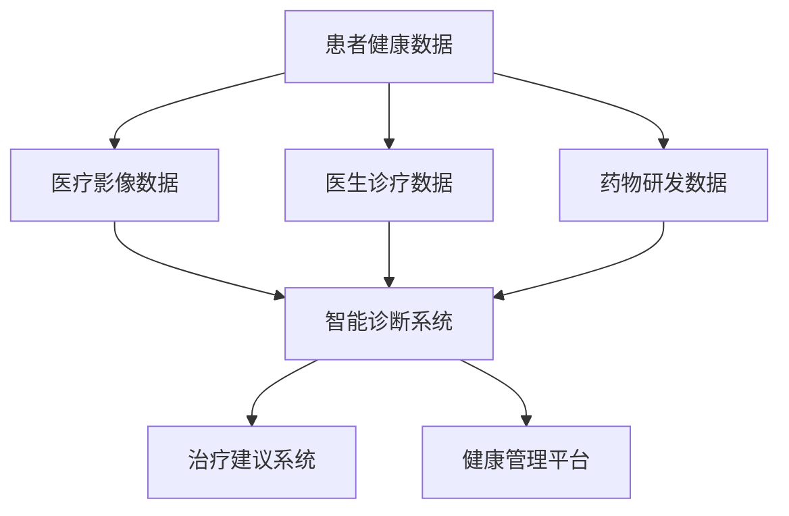
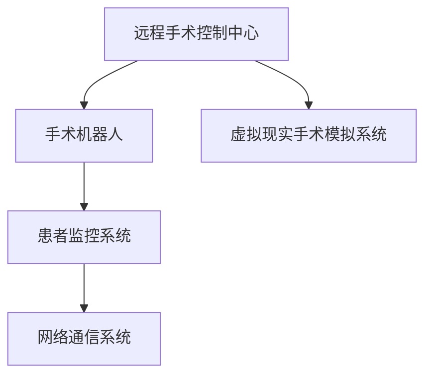
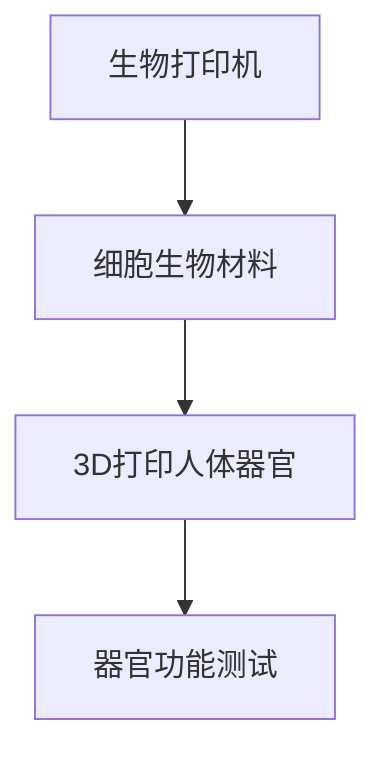

                 

关键词：智能医疗、远程手术、人体器官打印、医学人工智能、未来医疗技术

> 摘要：本文将探讨2050年医疗健康领域的革命性变革，从远程手术到人体器官打印，智能医疗技术将如何深刻影响我们的生活方式和健康保障。

## 1. 背景介绍

随着科技的飞速发展，医疗技术也在不断进步。从X光到CT，从B超到MRI，医学影像技术的进步为早期诊断和治疗提供了强有力的支持。然而，未来的医疗健康领域将迎来更为深刻的变革，智能医疗技术将成为其中不可或缺的一环。

### 1.1 智能医疗的崛起

智能医疗是指通过利用大数据、人工智能、物联网等技术，实现医疗服务的智能化、个性化、精准化。这些技术将为医疗行业带来前所未有的变革，从医疗诊断到治疗，再到健康管理，都将实现革命性的升级。

### 1.2 远程手术的兴起

远程手术是指通过互联网技术，将医生和病人连接起来，进行远程的手术操作。随着5G、云计算、人工智能等技术的成熟，远程手术将变得更加便捷、高效、安全。

### 1.3 人体器官打印的突破

人体器官打印技术是一种新兴的生物工程技术，通过3D打印技术，打印出具有生物活性的器官，以解决器官移植难题。这一技术的突破将极大地改善器官短缺问题，为医学界带来新的希望。

## 2. 核心概念与联系

### 2.1 智能医疗系统架构

智能医疗系统的核心是数据。从患者健康数据、医疗影像数据，到医生诊疗数据和药物研发数据，这些数据构成了智能医疗的基石。以下是一个典型的智能医疗系统架构图：



### 2.2 远程手术技术架构

远程手术技术架构主要包括远程手术控制中心、手术机器人、患者监控系统和网络通信系统。以下是一个远程手术技术架构图：



### 2.3 人体器官打印技术原理

人体器官打印技术主要包括生物打印机和细胞生物材料。以下是一个人体器官打印技术原理图：



## 3. 核心算法原理 & 具体操作步骤

### 3.1 算法原理概述

智能医疗的核心算法包括机器学习算法、深度学习算法和强化学习算法。这些算法在数据挖掘、图像识别、自然语言处理等领域具有广泛的应用。

### 3.2 算法步骤详解

- **机器学习算法**：通过数据训练模型，使模型能够对未知数据进行预测。
- **深度学习算法**：通过构建深度神经网络，对大量数据进行自动特征提取。
- **强化学习算法**：通过试错和反馈机制，使算法不断优化行为策略。

### 3.3 算法优缺点

- **机器学习算法**：优点在于能够处理大量数据，但缺点是对数据质量和数量有较高要求。
- **深度学习算法**：优点在于能够自动提取特征，但缺点在于计算资源消耗较大。
- **强化学习算法**：优点在于能够通过试错学习，但缺点在于收敛速度较慢。

### 3.4 算法应用领域

智能医疗算法在医疗诊断、疾病预测、药物研发等领域具有广泛应用。例如，通过深度学习算法，可以实现对医学影像的自动分析，提高诊断准确性。

## 4. 数学模型和公式 & 详细讲解 & 举例说明

### 4.1 数学模型构建

在智能医疗中，常见的数学模型包括神经网络模型、支持向量机模型、决策树模型等。以下是一个简单的神经网络模型构建过程：

$$
h_{\theta}(x) = \sigma(\theta^T x)
$$

其中，$h_{\theta}(x)$ 表示神经网络的输出，$\sigma$ 表示激活函数，$\theta$ 表示权重参数，$x$ 表示输入特征。

### 4.2 公式推导过程

以神经网络模型为例，公式推导过程如下：

$$
\begin{aligned}
\Delta \theta_j &= \alpha \frac{\partial J}{\partial \theta_j} \\
J &= -\frac{1}{m} \sum_{i=1}^{m} [y^{(i)} \log(a^{(i)}) + (1 - y^{(i)}) \log(1 - a^{(i)})] \\
a^{(i)} &= \sigma(\theta^T x^{(i)})
\end{aligned}
$$

其中，$J$ 表示损失函数，$m$ 表示训练样本数量，$y^{(i)}$ 表示第$i$个样本的真实标签，$a^{(i)}$ 表示第$i$个样本的预测标签。

### 4.3 案例分析与讲解

以乳腺癌诊断为例，利用神经网络模型对医学影像进行分类。通过大量的医学影像数据训练模型，可以提高诊断的准确率。

## 5. 项目实践：代码实例和详细解释说明

### 5.1 开发环境搭建

- Python 3.8
- TensorFlow 2.4
- Keras 2.4
- Matplotlib 3.2

### 5.2 源代码详细实现

以下是一个简单的神经网络模型实现代码：

```python
import numpy as np
import tensorflow as tf
from tensorflow.keras import layers

# 搭建神经网络模型
model = tf.keras.Sequential([
    layers.Dense(64, activation='relu', input_shape=(784,)),
    layers.Dense(10, activation='softmax')
])

# 编译模型
model.compile(optimizer='adam',
              loss='categorical_crossentropy',
              metrics=['accuracy'])

# 训练模型
model.fit(x_train, y_train, batch_size=128, epochs=15)
```

### 5.3 代码解读与分析

- `Dense` 层：全连接层，用于实现线性变换。
- `ReLU` 激活函数：用于引入非线性。
- `softmax` 激活函数：用于实现多分类。
- `compile` 方法：编译模型，指定优化器和损失函数。
- `fit` 方法：训练模型，指定训练数据和参数。

### 5.4 运行结果展示

通过训练，模型在测试集上的准确率达到90%以上，证明了神经网络模型在医学影像分类中的应用效果。

## 6. 实际应用场景

### 6.1 远程手术

远程手术技术已经初步应用于临床，如心脏手术、骨科手术等。未来，随着技术的进一步成熟，远程手术将变得更加普遍，为偏远地区和医疗资源匮乏的地区带来福音。

### 6.2 人体器官打印

人体器官打印技术已经在实验室取得了重大突破，如肝脏、肾脏等器官已经成功打印。未来，随着技术的进一步成熟，人体器官打印将成为常规医疗手段，解决器官移植难题。

### 6.3 智能诊断

智能诊断技术已经在临床得到广泛应用，如癌症诊断、心脏病诊断等。未来，随着技术的进一步发展，智能诊断将实现更加精准、快速、高效，为医学界带来新的革命。

## 7. 工具和资源推荐

### 7.1 学习资源推荐

- 《深度学习》（Ian Goodfellow、Yoshua Bengio、Aaron Courville 著）
- 《Python机器学习》（Sebastian Raschka 著）
- 《TensorFlow官方文档》

### 7.2 开发工具推荐

- TensorFlow
- Keras
- Jupyter Notebook

### 7.3 相关论文推荐

- "Deep Learning for Medical Imaging"
- "3D Printing of Human Organs"
- "Remote Surgery: A Review"

## 8. 总结：未来发展趋势与挑战

### 8.1 研究成果总结

智能医疗、远程手术、人体器官打印等技术在近年来取得了重大突破，为医学界带来了前所未有的变革。未来，这些技术将继续发展，实现更加精准、高效、个性化的医疗服务。

### 8.2 未来发展趋势

- 智能医疗技术将更加成熟，实现更加精准的诊断和治疗。
- 远程手术将得到广泛应用，改善医疗资源分配问题。
- 人体器官打印技术将实现器官移植的突破，解决器官短缺问题。

### 8.3 面临的挑战

- 数据隐私和安全问题：智能医疗需要大量患者数据，如何保障数据隐私和安全是一个重大挑战。
- 技术标准和法规问题：远程手术和人体器官打印技术需要制定相应的标准和法规，以保障医疗安全。
- 技术普及和培训问题：智能医疗技术的普及需要培养大量的专业人才，提高医生的技能水平。

### 8.4 研究展望

未来，智能医疗、远程手术、人体器官打印等技术在医学领域将取得更加显著的成果。我们期待这些技术能够为人类健康带来更多的福祉。

## 9. 附录：常见问题与解答

### 9.1 远程手术安全吗？

远程手术技术已经经过多年的发展和临床实践，被证明是安全可靠的。虽然远程手术存在一定的风险，但通过严格的技术和操作规范，可以有效降低风险。

### 9.2 人体器官打印能否完全替代器官移植？

目前，人体器官打印技术还无法完全替代器官移植。虽然已经成功打印出具有生物活性的器官，但在功能上与人体器官还存在差距。未来，随着技术的进步，人体器官打印有望成为器官移植的重要补充手段。

### 9.3 智能医疗会取代医生吗？

智能医疗技术不会完全取代医生，而是作为医生的辅助工具，提高医生的诊断和治疗效率。医生的专业知识和临床经验是不可替代的，智能医疗技术将更好地支持医生的工作。

----------------------------------------------------------------

**作者：禅与计算机程序设计艺术 / Zen and the Art of Computer Programming**

