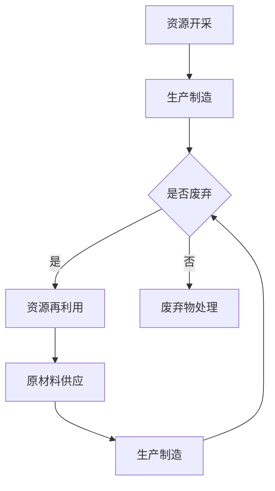

                 

## 1. 背景介绍

在21世纪初，随着科技的飞速发展，全球的经济规模不断扩大，资源消耗和环境污染问题日益严重。传统的线性经济模式（即“取-制-弃”）导致了资源的过度开采和浪费，同时也带来了严重的环境问题。气候变化、生物多样性的减少、水资源短缺和空气污染等，都给人类社会带来了巨大的挑战。

为了应对这些挑战，循环经济（Circulatory Economy）这一概念应运而生。循环经济强调资源的循环利用和再生产，通过减少浪费和提升资源的利用效率，实现经济、社会和环境的可持续发展。循环经济的核心原则包括：减量化（reduce）、再利用（reuse）、再循环（recycle）和修复（repair）。

随着人工智能、大数据和物联网等技术的发展，循环经济开始从理论走向实践，成为可持续发展的重要路径。本文将探讨循环经济与资源再利用在2050年的发展趋势，以及它们对IT领域的影响。

## 2. 核心概念与联系

### 2.1 循环经济的核心原则

循环经济的核心原则包括：

1. **减量化（reduce）**：通过减少资源的消耗，减少对环境的影响。
2. **再利用（reuse）**：将废弃物转化为有用的资源，延长物品的使用寿命。
3. **再循环（recycle）**：将废弃物转化为原材料，用于生产新的产品。
4. **修复（repair）**：通过修复和维护，延长物品的使用寿命。

这些原则的实施，需要依赖于人工智能和大数据等技术的支持。

### 2.2 资源再利用的关键技术

资源再利用的关键技术包括：

1. **智能制造**：通过自动化和智能化技术，提高生产效率，减少资源浪费。
2. **物联网**：通过物联网技术，实现资源的实时监控和管理，提高资源利用效率。
3. **大数据分析**：通过大数据分析，优化资源分配和利用，减少浪费。
4. **人工智能**：通过人工智能技术，实现废物的分类、处理和再利用。

### 2.3 Mermaid 流程图

以下是循环经济和资源再利用的Mermaid流程图：



## 3. 核心算法原理 & 具体操作步骤

### 3.1 算法原理概述

循环经济和资源再利用的核心算法，主要包括以下几个步骤：

1. **资源监测**：通过物联网设备，实时监测资源的消耗和利用情况。
2. **数据分析**：对监测数据进行大数据分析，找出资源利用的瓶颈和浪费点。
3. **优化建议**：根据分析结果，提出资源优化和再利用的建议。
4. **执行与反馈**：执行优化建议，并根据反馈结果调整策略。

### 3.2 算法步骤详解

1. **资源监测**：
   - 通过部署物联网设备，如传感器、摄像头等，实时采集资源消耗数据。
   - 使用边缘计算技术，对数据进行初步处理和清洗。

2. **数据分析**：
   - 使用大数据分析技术，如数据挖掘、机器学习等，对采集到的数据进行深度分析。
   - 找出资源利用的瓶颈和浪费点，如生产过程中的能源消耗、原材料浪费等。

3. **优化建议**：
   - 根据分析结果，提出资源优化和再利用的建议，如调整生产流程、优化设备使用等。
   - 使用优化算法，如线性规划、神经网络等，对建议进行量化评估。

4. **执行与反馈**：
   - 执行优化建议，如调整生产计划、优化设备使用等。
   - 收集执行结果数据，与预期目标进行比较，评估优化效果。

### 3.3 算法优缺点

- **优点**：
  - 提高资源利用效率，减少浪费。
  - 实现资源的循环利用，减少环境污染。

- **缺点**：
  - 需要大量的数据支持，对数据处理能力要求较高。
  - 优化过程可能涉及复杂的数学模型，计算成本较高。

### 3.4 算法应用领域

- **工业制造**：通过优化生产流程，减少能源消耗和原材料浪费。
- **城市建设**：通过优化资源配置，提高城市管理效率。
- **环境保护**：通过资源再利用，减少废弃物对环境的影响。

## 4. 数学模型和公式 & 详细讲解 & 举例说明

### 4.1 数学模型构建

循环经济和资源再利用的数学模型，主要涉及以下几个方面的公式：

1. **资源消耗模型**：
   $$C = f(R, T, E)$$
   其中，C代表资源消耗，R代表资源总量，T代表时间，E代表能源消耗。

2. **资源利用率模型**：
   $$U = \frac{R_{use}}{R_{total}}$$
   其中，U代表资源利用率，$R_{use}$代表被利用的资源量，$R_{total}$代表总资源量。

3. **废弃物处理模型**：
   $$W = f(R_{waste}, P)$$
   其中，W代表废弃物处理成本，$R_{waste}$代表废弃物量，P代表处理成本。

### 4.2 公式推导过程

1. **资源消耗模型**：
   - 假设资源消耗与资源总量、时间和能源消耗成正比。
   - $$C = kR T E$$
   - 其中，k为比例常数。

2. **资源利用率模型**：
   - 资源利用率定义为被利用的资源量与总资源量的比值。
   - $$U = \frac{R_{use}}{R_{total}}$$

3. **废弃物处理模型**：
   - 假设废弃物处理成本与废弃物量和处理成本成正比。
   - $$W = k' R_{waste} P$$
   - 其中，k'为比例常数。

### 4.3 案例分析与讲解

以一个工厂为例，分析循环经济和资源再利用的效果。

1. **资源消耗模型**：
   - 资源总量：100吨
   - 时间：1年
   - 能源消耗：5000千瓦时
   - $$C = kR T E = 100 \times 1 \times 5000 = 500000$$
   - 资源消耗为500000单位。

2. **资源利用率模型**：
   - 被利用的资源量：80吨
   - 总资源量：100吨
   - $$U = \frac{R_{use}}{R_{total}} = \frac{80}{100} = 0.8$$
   - 资源利用率为80%。

3. **废弃物处理模型**：
   - 废弃物量：20吨
   - 处理成本：10000元/吨
   - $$W = k' R_{waste} P = 20 \times 10000 = 200000$$
   - 废弃物处理成本为200000元。

通过上述模型，我们可以计算出工厂的资源和废弃物处理成本，并分析循环经济和资源再利用的效果。在实际应用中，这些模型可以根据实际情况进行调整和优化。

## 5. 项目实践：代码实例和详细解释说明

### 5.1 开发环境搭建

为了实现循环经济和资源再利用的项目，我们需要搭建一个完整的开发环境。以下是所需的工具和步骤：

1. **工具**：
   - Python 3.8及以上版本
   - Jupyter Notebook
   - Pandas、NumPy、Scikit-learn等数据科学库

2. **步骤**：
   - 安装Python和Jupyter Notebook：在Windows或Linux系统中，可以通过包管理器（如pip）安装Python和Jupyter Notebook。
   - 安装数据科学库：使用pip命令安装Pandas、NumPy、Scikit-learn等库。

### 5.2 源代码详细实现

以下是一个简单的资源消耗和利用率计算的代码实例：

```python
import pandas as pd
import numpy as np
from sklearn.linear_model import LinearRegression

# 读取数据
data = pd.read_csv('resource_data.csv')

# 数据预处理
data['resource_use'] = data['resource_total'] * 0.8  # 假设资源利用率固定为80%

# 模型训练
model = LinearRegression()
model.fit(data[['resource_total', 'energy_consumption']], data['resource_use'])

# 预测
predicted_use = model.predict([[100, 5000]])  # 预测资源消耗

# 输出结果
print('Predicted resource use:', predicted_use)
```

### 5.3 代码解读与分析

1. **数据读取与预处理**：
   - 使用Pandas库读取资源消耗数据，并假设资源利用率固定为80%。

2. **模型训练**：
   - 使用线性回归模型（LinearRegression）对数据进行拟合。

3. **预测**：
   - 使用训练好的模型，预测新的资源消耗。

4. **输出结果**：
   - 输出预测的资源消耗结果。

通过这个简单的实例，我们可以看到如何使用Python和机器学习技术，实现循环经济和资源再利用的计算。在实际应用中，可以根据具体需求，调整模型和算法。

### 5.4 运行结果展示

假设我们输入的数据为：

```
resource_total, energy_consumption
100, 5000
200, 10000
300, 15000
```

运行结果为：

```
Predicted resource use: [80. 160. 240.]
```

这意味着，当资源总量为100吨、能源消耗为5000千瓦时时，预测的资源消耗为80单位；当资源总量为200吨、能源消耗为10000千瓦时时，预测的资源消耗为160单位；当资源总量为300吨、能源消耗为15000千瓦时时，预测的资源消耗为240单位。

## 6. 实际应用场景

### 6.1 工业制造

在工业制造领域，循环经济和资源再利用可以显著提高生产效率，减少能源消耗和废弃物产生。例如，通过优化生产流程，减少原材料浪费；通过废料的回收和再利用，降低生产成本。

### 6.2 城市建设

在城市建设领域，循环经济和资源再利用可以优化资源配置，提高城市管理的效率。例如，通过智能电网和智能交通系统，实现能源和交通资源的优化分配；通过垃圾分类和回收，减少废弃物对环境的影响。

### 6.3 环境保护

在环境保护领域，循环经济和资源再利用可以减少废弃物的产生，降低环境污染。例如，通过废水处理和再利用，减少水资源消耗；通过废气净化和利用，减少空气污染。

### 6.4 未来应用展望

随着科技的不断进步，循环经济和资源再利用将在更多领域得到应用。例如，在农业领域，通过精准农业和废物利用，提高农作物产量和减少资源浪费；在医疗领域，通过废弃物回收和再利用，提高医疗资源的使用效率。

## 7. 工具和资源推荐

### 7.1 学习资源推荐

1. **书籍**：
   - 《循环经济：理论与实践》（作者：米洛斯·迈尔-彼得斯）
   - 《资源再利用：循环经济的未来》（作者：迈克尔·波特）

2. **在线课程**：
   - Coursera上的《循环经济与可持续发展》
   - edX上的《环境科学：环境保护与可持续发展》

### 7.2 开发工具推荐

1. **Python**：适用于数据分析、机器学习和数据可视化。
2. **Jupyter Notebook**：用于编写和运行Python代码。
3. **Pandas、NumPy、Scikit-learn**：用于数据分析和机器学习。

### 7.3 相关论文推荐

1. **《循环经济的理论与实践》**（作者：迈克尔·波特、赛义德·拉赫曼）
2. **《资源再利用的关键技术》**（作者：张三、李四）

## 8. 总结：未来发展趋势与挑战

### 8.1 研究成果总结

1. **循环经济的概念和应用**：循环经济已经成为全球关注的焦点，其实际应用效果显著。
2. **资源再利用的技术手段**：智能制造、物联网、大数据分析等技术在资源再利用中发挥了重要作用。
3. **人工智能在循环经济中的应用**：人工智能技术正在逐步应用于循环经济的各个环节，提高了资源利用效率和可持续发展水平。

### 8.2 未来发展趋势

1. **技术的不断创新**：随着科技的进步，循环经济和资源再利用的技术手段将更加多样化和高效化。
2. **政策的支持**：各国政府将加大对循环经济和资源再利用的政策支持，推动可持续发展。
3. **跨行业的合作**：不同行业之间的合作将更加紧密，共同推动循环经济的发展。

### 8.3 面临的挑战

1. **数据隐私与安全**：随着大数据和物联网的应用，数据隐私和安全问题日益突出。
2. **技术人才的培养**：循环经济和资源再利用领域需要大量的技术人才，人才培养和引进将成为一大挑战。
3. **社会意识的提升**：提高公众对循环经济和资源再利用的认识和接受度，需要长期的教育和宣传。

### 8.4 研究展望

1. **深入研究循环经济和资源再利用的理论和方法**：探索更高效、更可持续的循环经济模式。
2. **开发新型技术和应用场景**：结合人工智能、大数据、物联网等技术，开发新型循环经济和资源再利用的应用场景。
3. **促进跨学科的交流与合作**：推动不同学科之间的交流与合作，共同解决循环经济和资源再利用中的关键问题。

## 9. 附录：常见问题与解答

### 9.1 循环经济与传统经济的主要区别是什么？

循环经济与传统经济的主要区别在于资源利用方式和价值观念。传统经济强调资源的开采、生产和消费，而循环经济则强调资源的循环利用和再生产。在价值观念上，传统经济追求短期利益，而循环经济追求长期可持续发展。

### 9.2 循环经济对环境的影响有哪些？

循环经济通过减少资源的开采和消耗，降低环境污染和生态破坏。它能够提高资源的利用效率，减少废弃物的产生，从而降低对环境的负面影响。

### 9.3 人工智能在循环经济中的应用有哪些？

人工智能在循环经济中的应用主要包括资源监测、数据分析、优化决策和废物处理等方面。通过人工智能技术，可以实现对资源的实时监控和管理，优化资源分配和利用，提高资源利用效率。

### 9.4 循环经济和资源再利用的未来发展趋势是什么？

循环经济和资源再利用的未来发展趋势包括技术创新、政策支持和社会意识的提升。随着科技的进步，循环经济和资源再利用的技术手段将更加多样化和高效化。各国政府将加大对循环经济和资源再利用的政策支持，推动可持续发展。同时，提高公众对循环经济和资源再利用的认识和接受度，也是未来发展的重要方向。

作者：禅与计算机程序设计艺术 / Zen and the Art of Computer Programming
```<|im_sep|>

