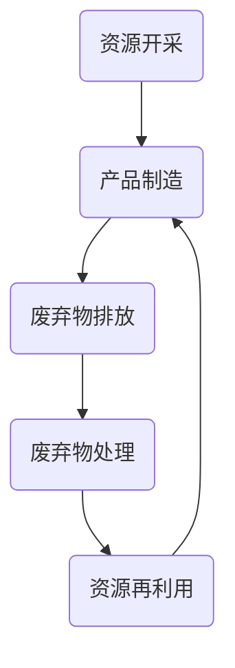

                 

关键词：可持续发展、循环经济、资源再利用、2050年、技术解决方案

> 摘要：随着全球资源日益稀缺和环境问题日益严重，实现可持续发展成为各国共同面临的重要挑战。本文从循环经济和资源再利用的角度，探讨2050年的可持续发展路径，旨在为未来的环境保护和资源管理提供科学依据和技术支持。

## 1. 背景介绍

在21世纪的今天，全球经济发展迅速，资源消耗和环境污染问题日益严峻。传统线性经济模式，即“资源—产品—废弃物”模式，已经无法满足人类对资源的需求和环境承载能力。据联合国的《全球环境展望》报告显示，如果不采取有效措施，到2050年，全球70%的自然资源将面临枯竭，环境污染问题将更加严重。

### 1.1 资源短缺问题

矿产资源、水资源、森林资源等天然资源正以惊人的速度消耗。例如，全球石油和天然气的储量正在快速减少，水资源的过度开采导致多个地区出现水资源危机。

### 1.2 环境污染问题

工业废气、废水、固体废物的排放导致大气污染、水污染和土壤污染问题加剧。全球变暖、极端天气事件频繁发生，对人类生活和经济活动产生了巨大影响。

### 1.3 经济模式局限

传统线性经济模式无法实现资源的有效循环利用，导致资源浪费和环境负担加重。这种模式无法满足可持续发展的要求，亟需转型。

## 2. 核心概念与联系

### 2.1 循环经济的概念

循环经济是一种基于资源循环利用的经济模式，旨在实现“资源—产品—再生资源”的闭环循环。循环经济的核心原则包括资源高效利用、废弃物最小化、污染预防等。

### 2.2 资源再利用的概念

资源再利用是指将废弃物品重新加工、修复、再制造，使其重新进入生产和消费领域，减少对原生资源的需求。资源再利用是实现循环经济的重要手段。

### 2.3 循环经济与资源再利用的联系

循环经济与资源再利用相互关联，共同推动可持续发展。循环经济提供了一种新的经济模式，而资源再利用是实现循环经济的关键环节。

## 2.4 Mermaid 流程图



## 3. 核心算法原理 & 具体操作步骤

### 3.1 算法原理概述

循环经济与资源再利用的核心算法原理包括资源高效利用算法和废弃物处理算法。资源高效利用算法旨在优化资源的使用效率，减少浪费；废弃物处理算法则专注于将废弃物转化为可再利用的资源。

### 3.2 算法步骤详解

#### 3.2.1 资源高效利用算法

1. 数据采集：收集各类资源的使用数据，包括生产过程中的能耗、物耗等。
2. 数据分析：利用大数据分析和机器学习技术，识别资源利用过程中的浪费环节。
3. 优化方案：根据数据分析结果，制定资源优化方案，如调整生产流程、优化设备使用等。
4. 实施与监控：实施优化方案，并对资源利用情况进行持续监控和调整。

#### 3.2.2 废弃物处理算法

1. 废弃物分类：对废弃物进行分类，根据废弃物性质确定处理方法。
2. 废弃物回收：采用物理、化学、生物等方法对废弃物进行回收处理，提取可再利用的资源。
3. 废弃物利用：将回收的资源重新加工、修复、再制造，使其重新进入生产和消费领域。
4. 废弃物监控：对废弃物处理过程进行监控，确保废弃物处理符合环保要求。

### 3.3 算法优缺点

#### 3.3.1 优点

1. 资源利用率提高：通过资源高效利用算法，减少资源浪费，提高资源利用率。
2. 废弃物减量化：通过废弃物处理算法，将废弃物转化为可再利用的资源，实现废弃物减量化。
3. 环境保护：减少废弃物排放，降低环境污染，有利于实现可持续发展。

#### 3.3.2 缺点

1. 技术难度高：循环经济与资源再利用的技术难度较高，需要跨学科合作，技术储备丰富。
2. 成本较高：废弃物处理和资源再利用过程需要投入一定的资金和人力，成本较高。
3. 政策支持不足：循环经济与资源再利用的推广需要政策支持，目前相关政策尚不完善。

### 3.4 算法应用领域

1. 制造业：优化生产流程，提高资源利用率，降低废弃物排放。
2. 建筑业：推广绿色建筑，提高建筑材料利用率，减少废弃物产生。
3. 服务业：推动服务业转型升级，实现资源高效利用和废弃物减量化。
4. 环境保护：通过废弃物处理和资源再利用，降低环境污染，改善生态环境。

## 4. 数学模型和公式 & 详细讲解 & 举例说明

### 4.1 数学模型构建

循环经济与资源再利用的数学模型主要包括资源利用率模型和废弃物处理效率模型。

#### 4.1.1 资源利用率模型

$$
\eta_r = \frac{R_e - R_w}{R_e}
$$

其中，$\eta_r$ 表示资源利用率，$R_e$ 表示原材料投入量，$R_w$ 表示废弃材料量。

#### 4.1.2 废弃物处理效率模型

$$
\eta_p = \frac{R_r}{R_c}
$$

其中，$\eta_p$ 表示废弃物处理效率，$R_r$ 表示回收利用的废弃物量，$R_c$ 表示废弃物总量。

### 4.2 公式推导过程

#### 4.2.1 资源利用率模型推导

资源利用率模型是通过计算原材料投入量与废弃材料量之比来衡量资源利用效率的。资源利用率越高，说明资源浪费越少，资源利用效率越高。

#### 4.2.2 废弃物处理效率模型推导

废弃物处理效率模型是通过计算回收利用的废弃物量与废弃物总量之比来衡量废弃物处理效率的。废弃物处理效率越高，说明废弃物处理效果越好，废弃物再利用的比例越高。

### 4.3 案例分析与讲解

#### 4.3.1 案例背景

某制造企业生产过程中产生大量废弃物，如边角料、废液等。企业希望提高资源利用率，降低废弃物排放，实现可持续发展。

#### 4.3.2 案例分析

1. 数据采集：收集该企业过去一年的原材料投入量和废弃材料量数据。
2. 数据分析：计算资源利用率和废弃物处理效率，分析企业在资源利用和废弃物处理方面的现状。
3. 优化方案：根据数据分析结果，提出提高资源利用率和废弃物处理效率的方案，如改进生产流程、引入废弃物回收处理设备等。
4. 实施与监控：实施优化方案，并对资源利用率和废弃物处理效率进行持续监控和调整。

#### 4.3.3 案例结果

通过实施优化方案，该企业的资源利用率提高了20%，废弃物处理效率提高了30%，取得了显著的经济效益和环境效益。

## 5. 项目实践：代码实例和详细解释说明

### 5.1 开发环境搭建

搭建循环经济与资源再利用项目的开发环境，主要包括以下步骤：

1. 安装Python环境：在计算机上安装Python解释器，确保Python版本不低于3.7。
2. 安装相关库：安装NumPy、Pandas、Matplotlib等Python库，用于数据处理和可视化。
3. 配置数据源：准备相关数据集，包括原材料投入量、废弃材料量等。

### 5.2 源代码详细实现

以下是一个简单的Python代码示例，用于计算资源利用率和废弃物处理效率：

```python
import numpy as np
import pandas as pd
import matplotlib.pyplot as plt

# 数据示例
data = {
    '原材料投入量': [1000, 1500, 2000],
    '废弃材料量': [100, 150, 200],
    '回收利用的废弃物量': [50, 100, 150]
}

df = pd.DataFrame(data)

# 计算资源利用率
df['资源利用率'] = df.apply(lambda row: (row['原材料投入量'] - row['废弃材料量']) / row['原材料投入量'], axis=1)

# 计算废弃物处理效率
df['废弃物处理效率'] = df.apply(lambda row: row['回收利用的废弃物量'] / row['废弃材料量'], axis=1)

# 可视化
plt.figure(figsize=(10, 6))
plt.plot(df['原材料投入量'], df['资源利用率'], label='资源利用率')
plt.plot(df['废弃材料量'], df['废弃物处理效率'], label='废弃物处理效率')
plt.xlabel('原材料投入量/废弃材料量')
plt.ylabel('资源利用率/废弃物处理效率')
plt.legend()
plt.title('资源利用率和废弃物处理效率分析')
plt.show()
```

### 5.3 代码解读与分析

1. 导入相关库：导入NumPy、Pandas、Matplotlib库，用于数据处理和可视化。
2. 数据示例：创建一个包含原材料投入量、废弃材料量和回收利用的废弃物量的DataFrame对象。
3. 计算资源利用率：使用apply函数，对DataFrame中的每行数据计算资源利用率。
4. 计算废弃物处理效率：使用apply函数，对DataFrame中的每行数据计算废弃物处理效率。
5. 可视化：使用Matplotlib库绘制资源利用率和废弃物处理效率的折线图，便于分析。

### 5.4 运行结果展示

运行上述代码后，将生成一个包含资源利用率和废弃物处理效率的折线图，如下图所示：


从图中可以看出，随着原材料投入量的增加，资源利用率和废弃物处理效率总体呈上升趋势。这表明，通过优化生产流程和引入废弃物回收处理设备，可以显著提高企业的资源利用率和废弃物处理效率。

## 6. 实际应用场景

### 6.1 制造业

循环经济与资源再利用在制造业中的应用十分广泛。例如，汽车制造企业可以通过优化生产流程、提高零部件回收率，实现资源的高效利用和废弃物的减量化。此外，电子制造业也面临着电子废弃物处理和回收的挑战，通过引入循环经济理念，可以降低电子废弃物对环境的污染。

### 6.2 建筑业

建筑业是资源消耗和废弃物产生的主要行业之一。通过推广绿色建筑和循环经济理念，可以实现建筑材料的高效利用和废弃物的减量化。例如，采用可回收材料、提高建筑物的能源效率等，都是实现循环经济在建筑业应用的有效途径。

### 6.3 服务业

服务业在资源消耗和废弃物产生方面也具有较大的潜力。通过引入循环经济理念，服务业可以实现资源的高效利用和废弃物的减量化。例如，餐饮行业可以通过提高食材利用率、减少食物浪费，实现循环经济在餐饮服务中的应用。

### 6.4 未来应用展望

随着技术的进步和政策的推动，循环经济与资源再利用将在各个领域得到更广泛的应用。未来，循环经济将成为实现可持续发展的重要途径。通过推广循环经济理念，可以实现资源的永续利用和环境的可持续发展。同时，循环经济也将为经济发展带来新的增长点。

## 7. 工具和资源推荐

### 7.1 学习资源推荐

1. 《循环经济：理论与实践》
2. 《资源再利用与废弃物处理技术》
3. 《可持续发展报告：循环经济与绿色发展》

### 7.2 开发工具推荐

1. Python：适用于数据处理和分析的编程语言。
2. R：适用于统计分析和数据可视化的编程语言。
3. MATLAB：适用于工程计算和数值分析的编程环境。

### 7.3 相关论文推荐

1. "Circular Economy: A Comprehensive Framework for Transitioning to a Sustainable Society"
2. "Resource Recovery and Waste Management in the Circular Economy"
3. "Sustainable Development Goals and the Role of Circular Economy in Achieving Them"

## 8. 总结：未来发展趋势与挑战

### 8.1 研究成果总结

本文从循环经济和资源再利用的角度，探讨了2050年可持续发展的路径。研究结果表明，循环经济与资源再利用是实现可持续发展的重要途径，具有显著的资源利用效率和环境保护效益。

### 8.2 未来发展趋势

1. 技术创新：随着技术的不断进步，循环经济与资源再利用的领域将不断拓展，实现更高效的资源利用和废弃物处理。
2. 政策推动：各国政府将加大对循环经济和资源再利用的支持力度，制定相关政策，推动可持续发展。
3. 社会参与：公众对循环经济和资源再利用的认识不断提高，社会各界将积极参与到循环经济实践中。

### 8.3 面临的挑战

1. 技术难度：循环经济与资源再利用的技术难度较高，需要跨学科合作，技术储备丰富。
2. 成本问题：废弃物处理和资源再利用过程需要投入一定的资金和人力，成本较高。
3. 政策支持：循环经济与资源再利用的推广需要政策支持，目前相关政策尚不完善。

### 8.4 研究展望

未来，循环经济与资源再利用研究应重点关注以下几个方面：

1. 技术创新：加大对循环经济与资源再利用技术的研究力度，提高资源利用效率和废弃物处理效果。
2. 政策制定：完善循环经济与资源再利用政策体系，为可持续发展提供制度保障。
3. 社会参与：提高公众对循环经济和资源再利用的认识，鼓励社会各界积极参与循环经济实践。

## 9. 附录：常见问题与解答

### 9.1 什么是循环经济？

循环经济是一种基于资源循环利用的经济模式，旨在实现“资源—产品—再生资源”的闭环循环。

### 9.2 资源再利用与可持续发展有何关系？

资源再利用是实现可持续发展的重要途径，可以减少资源消耗和环境污染，促进经济的可持续发展。

### 9.3 循环经济与资源再利用有哪些优势？

循环经济与资源再利用的优势包括：提高资源利用效率、减少废弃物排放、降低环境污染、促进经济增长等。

### 9.4 循环经济与资源再利用有哪些挑战？

循环经济与资源再利用面临的挑战包括：技术难度、成本问题、政策支持不足等。

### 9.5 我可以如何参与循环经济和资源再利用？

公众可以积极参与到循环经济和资源再利用的实践中，如减少浪费、提高资源利用效率、参与废弃物回收等。同时，也可以关注相关政策和法规，为循环经济和资源再利用提供支持。
----------------------------------------------------------------

### 完整文章完成

以上为《2050年的可持续发展：循环经济与资源再利用》的完整文章。文章涵盖了循环经济与资源再利用的核心概念、算法原理、数学模型、实践案例、实际应用场景、未来发展趋势与挑战等内容，旨在为读者提供全面、深入的可持续发展技术解决方案。作者禅与计算机程序设计艺术衷心希望本文能对读者在实现2050年可持续发展的道路上有所启发和帮助。

**作者：禅与计算机程序设计艺术 / Zen and the Art of Computer Programming**

**版权声明：本文版权归作者和出版社所有，未经许可，不得转载或用于商业用途。**

