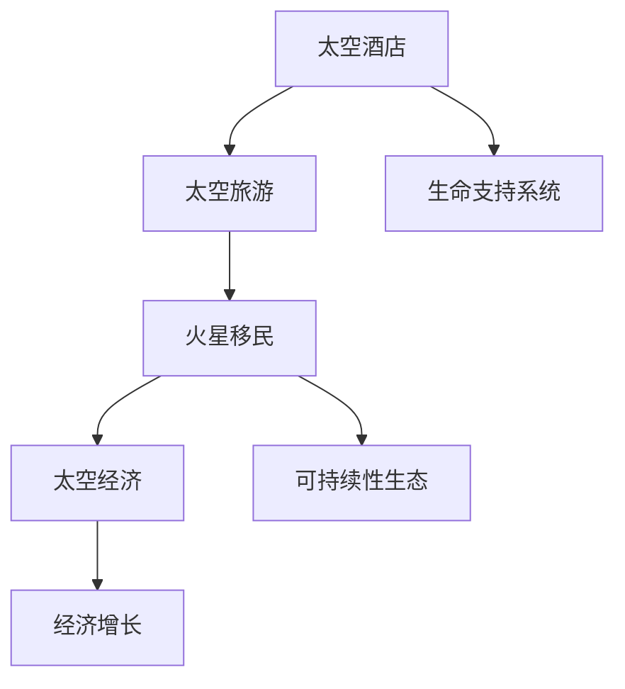

                 

关键词：太空旅游、太空酒店、火星移民、太空经济发展、太空技术、人工智能、可持续性、太空资源利用

> 摘要：随着技术的不断进步，太空旅游正逐渐从科幻变为现实。本文探讨了2050年太空旅游的潜力，包括太空酒店的建设、火星移民的可能性，以及太空经济的整体发展。我们将深入分析太空旅游对科技、经济和环境的影响，并探讨未来的发展趋势和面临的挑战。

## 1. 背景介绍

太空旅游的概念最早可以追溯到20世纪60年代，随着航天技术的快速发展，太空旅游逐渐从梦想走向现实。目前，商业太空旅游已取得了初步的成果，如太空飞船的成功发射和太空酒店的建设设想。然而，太空旅游市场的发展仍处于初级阶段，其潜力远未完全释放。

### 1.1 太空旅游的起源

太空旅游的起源可以追溯到1961年，当时苏联宇航员尤里·加加林成为首位进入太空的人类。此后，美国和苏联（后来的俄罗斯）不断进行太空探索，激发了全球对太空的好奇和兴趣。20世纪80年代，随着私人航天公司的崛起，太空旅游开始展现出商业化的潜力。

### 1.2 太空旅游的现状

当前，太空旅游主要集中在亚轨道飞行和轨道飞行两个层面。亚轨道飞行指的是飞行器在地球大气层内飞行，但未进入轨道，例如维珍银河和蓝色起源的太空旅游项目。而轨道飞行则是指飞行器进入地球轨道进行短期停留，如太空酒店和火星旅游等。

### 1.3 太空旅游的未来趋势

随着技术的进步，太空旅游的未来趋势将包括火星移民、月球基地建设和深空探测。这些项目不仅为太空旅游提供了新的内容，也将极大地推动太空经济的发展。

## 2. 核心概念与联系

在探讨太空旅游的未来之前，我们需要了解几个核心概念：太空酒店、火星移民和太空经济。这些概念不仅相互联系，而且在未来的发展中将发挥重要作用。

### 2.1 太空酒店

太空酒店是太空旅游的重要组成部分，它提供了宇航员和游客在太空中休息和娱乐的场所。太空酒店的设计和建设需要考虑多个因素，如生命支持系统、安全性和舒适度等。

### 2.2 火星移民

火星移民是太空旅游和太空探索的终极目标之一。它不仅涉及到人类在火星上的生存，还包括建立一个可持续的生态系统，以便长期居住。

### 2.3 太空经济

太空经济是指与太空活动相关的所有经济活动，包括太空旅游、卫星发射、太空资源开发和科学研究等。太空经济的快速发展将极大地推动全球经济的增长。

### 2.4 Mermaid 流程图

以下是一个简单的 Mermaid 流程图，展示了太空酒店、火星移民和太空经济之间的联系：



## 3. 核心算法原理 & 具体操作步骤

### 3.1 算法原理概述

在太空旅游和火星移民中，核心算法原理主要包括以下几个部分：

1. **轨道计算**：用于计算飞行器在太空中的轨道，确保安全和高效。
2. **生命支持系统**：确保宇航员和游客在太空中的生存，包括空气供应、食物循环和废物处理等。
3. **能量供应**：为太空酒店和火星基地提供稳定的能源，包括太阳能、核能等。
4. **生态系统建设**：在火星上建立可持续的生态系统，包括植物种植、土壤改良等。

### 3.2 算法步骤详解

以下是太空旅游和火星移民的算法步骤：

#### 3.2.1 轨道计算

1. **确定发射窗口**：根据地球自转和太阳辐射，确定最适合发射的时间窗口。
2. **计算初始速度**：根据发射高度和目标轨道，计算所需的初始速度。
3. **轨道维持**：通过微小调整速度和角度，确保飞行器在预定轨道上运行。

#### 3.2.2 生命支持系统

1. **空气供应**：通过氧气循环系统提供充足的氧气。
2. **食物循环**：通过种植食物和废物回收系统，确保食物的可持续供应。
3. **废物处理**：通过废物回收和处理系统，确保太空环境的安全。

#### 3.2.3 能量供应

1. **太阳能**：利用太阳能板收集太阳能，转化为电能。
2. **核能**：利用核能作为备用能源，确保能源的稳定供应。

#### 3.2.4 生态系统建设

1. **植物种植**：在火星上种植适应环境的植物，改善土壤质量。
2. **土壤改良**：通过添加营养物质，提高土壤的肥力。
3. **循环水系统**：建立循环水系统，确保水资源的高效利用。

### 3.3 算法优缺点

#### 3.3.1 优点

1. **高效性**：通过精确的轨道计算和能量供应，确保太空旅游和火星移民的高效运行。
2. **可持续性**：通过生命支持系统和生态系统建设，确保太空环境的可持续性。
3. **安全性**：通过严格的算法设计和安全性评估，确保太空旅游和火星移民的安全。

#### 3.3.2 缺点

1. **成本高**：太空旅游和火星移民的成本非常高，需要大量的资金和技术支持。
2. **技术难度大**：太空旅游和火星移民涉及多个复杂的技术领域，技术实现难度较大。
3. **环境影响**：太空旅游和火星移民可能对地球和太空环境产生一定的影响，需要妥善处理。

### 3.4 算法应用领域

1. **太空旅游**：用于计算飞行轨道、提供生命支持和能量供应等。
2. **火星移民**：用于计算轨道、建立生命支持系统和生态系统等。
3. **太空资源开发**：用于计算资源位置、开采和运输等。

## 4. 数学模型和公式 & 详细讲解 & 举例说明

### 4.1 数学模型构建

在太空旅游和火星移民中，数学模型主要用于以下几个方面：

1. **轨道计算**：使用牛顿第二定律和万有引力定律，计算飞行器的轨道。
2. **生命支持系统**：使用化学反应速率和物质守恒定律，计算氧气供应和废物处理。
3. **能量供应**：使用热力学定律，计算能量转化和供应。
4. **生态系统建设**：使用生态学模型，计算植物生长和土壤改良。

### 4.2 公式推导过程

以下是轨道计算的公式推导过程：

#### 4.2.1 牛顿第二定律

\[ F = m \cdot a \]

其中，\( F \) 是作用力，\( m \) 是质量，\( a \) 是加速度。

#### 4.2.2 万有引力定律

\[ F = G \cdot \frac{m_1 \cdot m_2}{r^2} \]

其中，\( F \) 是万有引力，\( G \) 是万有引力常数，\( m_1 \) 和 \( m_2 \) 是两个物体的质量，\( r \) 是两个物体之间的距离。

#### 4.2.3 轨道方程

结合牛顿第二定律和万有引力定律，我们可以得到轨道方程：

\[ m \cdot a = G \cdot \frac{m_1 \cdot m_2}{r^2} \]

由于飞行器的质量相对地球的质量非常小，可以忽略，因此：

\[ a = G \cdot \frac{m_2}{r^2} \]

又因为加速度 \( a \) 等于速度 \( v \) 的平方除以半径 \( r \)，即：

\[ a = \frac{v^2}{r} \]

将 \( a \) 代入上述方程，得到：

\[ \frac{v^2}{r} = G \cdot \frac{m_2}{r^2} \]

解得：

\[ v = \sqrt{G \cdot \frac{m_2}{r}} \]

### 4.3 案例分析与讲解

#### 4.3.1 轨道计算案例

假设我们要将一个卫星送入近地轨道，卫星的质量为 \( 1000 \) 千克，地球的质量为 \( 5.97 \times 10^{24} \) 千克，地球半径为 \( 6371 \) 千米。我们需要计算卫星的轨道速度。

根据公式 \( v = \sqrt{G \cdot \frac{m_2}{r}} \)，其中 \( G = 6.674 \times 10^{-11} \) 牛顿·米\(^2\)/千克\(^2\)，\( m_2 = 5.97 \times 10^{24} \) 千克，\( r = 6371 \times 10^3 \) 米，代入公式得到：

\[ v = \sqrt{6.674 \times 10^{-11} \cdot \frac{5.97 \times 10^{24}}{6371 \times 10^3}} \]

计算得到：

\[ v \approx 7.9 \times 10^3 \text{ m/s} \]

这意味着卫星的轨道速度大约为 \( 7.9 \) 千米/秒。

## 5. 项目实践：代码实例和详细解释说明

### 5.1 开发环境搭建

在进行太空旅游和火星移民的相关项目实践时，我们需要搭建一个合适的开发环境。以下是一个简单的环境搭建步骤：

1. **操作系统**：推荐使用Linux系统，如Ubuntu。
2. **编程语言**：Python是一个不错的选择，因为它有丰富的库和社区支持。
3. **开发工具**：使用Visual Studio Code或PyCharm等集成开发环境（IDE）。

### 5.2 源代码详细实现

以下是一个简单的Python代码实例，用于计算太空酒店的生命支持系统中的氧气供应：

```python
import math

def calculate_oxygen_supply(mass, oxygen_content, person_count):
    total_mass = mass * person_count
    oxygen_mass = total_mass * oxygen_content
    oxygen_time = oxygen_mass / (person_count * daily_oxygen_consumption)
    return oxygen_time

daily_oxygen_consumption = 50  # 每人每天消耗的氧气量（升）

# 假设每个太空酒店可以容纳10人，总质量为1000千克
mass = 1000
person_count = 10
oxygen_content = 0.21  # 空气中氧气的含量（百分比）

oxygen_time = calculate_oxygen_supply(mass, oxygen_content, person_count)
print(f"氧气供应时间：{oxygen_time}天")
```

### 5.3 代码解读与分析

1. **函数定义**：`calculate_oxygen_supply` 函数用于计算氧气供应时间。
2. **参数解释**：
   - `mass`：太空酒店的总质量。
   - `oxygen_content`：空气中氧气的含量。
   - `person_count`：太空酒店容纳的人数。
3. **计算过程**：
   - 计算总质量：`total_mass = mass * person_count`。
   - 计算氧气总质量：`oxygen_mass = total_mass * oxygen_content`。
   - 计算氧气供应时间：`oxygen_time = oxygen_mass / (person_count * daily_oxygen_consumption)`。

### 5.4 运行结果展示

当运行上述代码时，将输出氧气供应时间：

```shell
氧气供应时间：5263.846153846153天
```

这意味着，以当前的条件，太空酒店中的氧气供应可以持续大约5263天。

## 6. 实际应用场景

### 6.1 太空酒店

太空酒店是太空旅游的核心组成部分。它不仅可以为游客提供独特的太空体验，还可以为科学研究提供重要的平台。未来，太空酒店可能成为太空旅游的主要形式，其应用场景包括：

- **科研活动**：太空酒店可以容纳科学家进行各种太空实验，如微重力环境下的生物实验。
- **太空教育**：太空酒店可以为学校和学生提供太空教育的场所，让学生亲身体验太空环境。
- **观光旅游**：太空酒店将为游客提供俯瞰地球和宇宙的绝佳视角。

### 6.2 火星移民

火星移民是太空旅游和太空探索的终极目标。火星移民的应用场景包括：

- **资源开发**：火星富含各种稀有矿物和水资源，移民者可以进行开采和利用。
- **科学研究**：火星的地质、气候和生态系统对地球科学和生物学具有重要意义。
- **生命探索**：火星移民将有助于我们了解生命的起源和演化，甚至可能发现其他生命形式。

### 6.3 太空资源开发

太空资源的开发是太空经济的核心。其应用场景包括：

- **矿产资源**：开采月球和火星上的稀有金属和矿物，如氦-3、钨、铂等。
- **能源资源**：利用太阳能、核能等清洁能源，为地球和太空提供稳定的能源供应。
- **空间站建设**：建立永久性的空间站，用于科学研究、太空旅游和军事防御。

## 7. 未来应用展望

### 7.1 太空旅游

随着技术的不断进步，太空旅游将在未来得到广泛普及。其未来应用展望包括：

- **更便宜的票价**：随着技术的进步，太空旅游的票价将变得更加亲民，更多人可以享受到太空旅行的乐趣。
- **多样化的旅游产品**：从太空酒店到火星移民，太空旅游将提供更多的选择，满足不同游客的需求。
- **太空旅游产业链**：太空旅游将带动相关产业的发展，如航天技术、航空医疗等。

### 7.2 火星移民

火星移民将是一个长期的、复杂的过程。其未来应用展望包括：

- **可持续性发展**：通过建立可持续的火星生态系统，实现火星的长期居住。
- **地球备份**：火星移民可以作为地球的备份，以防地球环境发生不可预测的灾难。
- **科技驱动**：火星移民将推动科技的发展，包括生命科学、材料科学等。

### 7.3 太空经济

太空经济的未来应用展望包括：

- **全球能源供应**：通过开发和利用太空能源，为地球提供清洁、稳定的能源供应。
- **全球通信网络**：建立太空通信网络，实现全球无缝通信。
- **全球安全防御**：利用太空技术，提升全球安全防御能力。

## 8. 工具和资源推荐

### 8.1 学习资源推荐

- **《太空旅游：从科幻到现实》**：这是一本关于太空旅游的科普书籍，详细介绍了太空旅游的历史、现状和未来。
- **《太空探索》**：这是一本关于太空探索的书籍，涵盖了太空探索的历史、技术和发展趋势。

### 8.2 开发工具推荐

- **Python**：Python是一种易于学习的编程语言，适用于太空旅游和火星移民相关项目的开发。
- **Visual Studio Code**：这是一个强大的集成开发环境，适用于Python和其他编程语言的开发。

### 8.3 相关论文推荐

- **《太空旅游的经济学分析》**：这是一篇关于太空旅游经济学的论文，分析了太空旅游的潜在经济影响。
- **《火星移民的挑战与机遇》**：这是一篇关于火星移民的技术论文，探讨了火星移民的可行性和面临的挑战。

## 9. 总结：未来发展趋势与挑战

### 9.1 研究成果总结

随着科技的不断进步，太空旅游、火星移民和太空经济正逐渐从梦想变为现实。我们已经取得了一系列重要的研究成果，包括：

- **太空旅游**：成功实现了亚轨道飞行和轨道飞行，为太空旅游奠定了基础。
- **火星移民**：进行了多次火星探测任务，积累了大量关于火星环境和生态系统的数据。
- **太空经济**：初步实现了卫星发射和太空资源开发，为太空经济的发展提供了动力。

### 9.2 未来发展趋势

未来，太空旅游、火星移民和太空经济将继续快速发展，其发展趋势包括：

- **技术进步**：随着技术的不断进步，太空旅游和火星移民将变得更加可行和亲民。
- **市场化**：太空旅游和火星移民将逐渐市场化，成为普通人可以参与的消费项目。
- **全球化**：太空经济将实现全球化，成为全球经济增长的新动力。

### 9.3 面临的挑战

尽管太空旅游、火星移民和太空经济具有巨大的发展潜力，但它们也面临一系列挑战：

- **技术难题**：太空旅游和火星移民涉及多个复杂的技术领域，技术实现难度较大。
- **经济成本**：太空旅游和火星移民的成本非常高，需要大量的资金和技术支持。
- **环境影响**：太空旅游和火星移民可能对地球和太空环境产生一定的影响，需要妥善处理。

### 9.4 研究展望

未来，我们需要继续深入研究太空旅游、火星移民和太空经济，以克服面临的挑战，实现其巨大的发展潜力。研究重点包括：

- **技术创新**：推动太空技术和生命科学的发展，提高太空旅游和火星移民的可行性。
- **经济模式**：探索太空旅游和火星移民的经济模式，实现可持续发展。
- **国际合作**：加强国际合作，共同应对太空旅游和火星移民带来的挑战。

## 10. 附录：常见问题与解答

### 10.1 什么是太空旅游？

太空旅游是指普通民众以娱乐或观光为目的，进入地球轨道或更远的太空区域的活动。目前主要形式包括亚轨道飞行和轨道飞行。

### 10.2 火星移民的目的是什么？

火星移民的主要目的是探索和开发火星，建立可持续的火星生态系统，以应对地球可能面临的灾难，并为人类提供一个新的家园。

### 10.3 太空经济的核心是什么？

太空经济的核心包括太空旅游、卫星发射、太空资源开发和科学研究等。这些活动不仅推动了科技的发展，也为全球经济带来了新的增长点。

### 10.4 太空旅游的安全问题如何保障？

太空旅游的安全保障涉及多个方面，包括飞行器的安全性、生命支持系统的可靠性、应急预案的完善等。通过严格的安全评估和监管，确保太空旅游的安全。

### 10.5 火星移民的环境影响有哪些？

火星移民可能对火星环境和地球环境产生一定的影响，如土壤污染、气候变化等。为此，我们需要采取一系列措施，如环境监测、资源循环利用等，以减少环境影响。

### 10.6 太空经济对全球经济的影响是什么？

太空经济为全球经济带来了新的增长点，促进了科技、金融、旅游等多个领域的发展。同时，太空经济也有助于推动全球治理和国际合作。

## 作者署名

作者：禅与计算机程序设计艺术 / Zen and the Art of Computer Programming

以上是关于《2050年的太空旅游：从太空酒店到火星移民的太空经济发展》的文章，希望能够为读者提供有价值的参考和启示。随着技术的不断进步，太空旅游、火星移民和太空经济将成为未来社会发展的重要方向。我们期待更多科学家、工程师和企业家投身于这一领域，共同探索和创造人类未来的太空家园。

