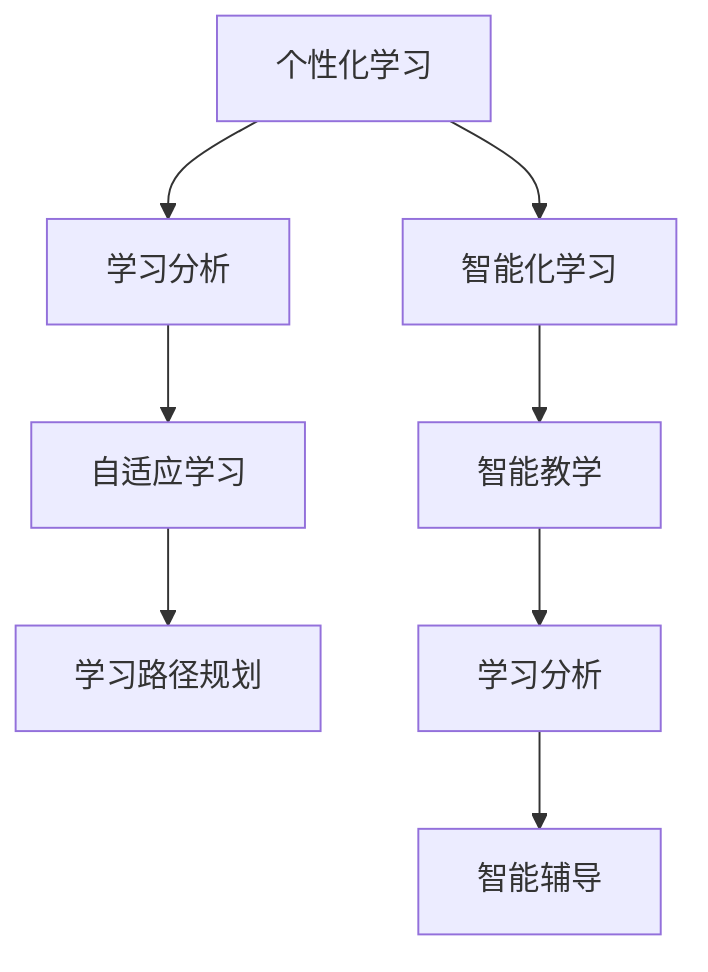

                 

关键词：个性化学习、智能化教育、未来教育、教育技术、人工智能、学习分析、教育模型

> 摘要：本文深入探讨了2050年的教育变革，重点分析了个性化与智能化学习在未来的发展趋势。通过阐述核心概念与架构，解析了核心算法原理，并提供了数学模型和具体项目实践，展望了未来教育应用的前景，旨在为教育工作者、学者和业界人士提供有价值的参考。

## 1. 背景介绍

在21世纪的前二十年，教育经历了前所未有的技术革新。互联网、移动设备和云计算的普及，使得学习不再局限于传统的课堂环境，而逐渐转向在线学习。随着人工智能、大数据和机器学习的快速发展，教育领域迎来了新的变革。个性化与智能化学习正逐渐成为未来教育的主流方向。

个性化学习强调根据学生的个性、兴趣和学习风格量身定制教学内容和进度，从而提高学习效率和效果。智能化学习则利用人工智能技术实现智能教学、学习分析和学习支持，为学生提供更加个性化和互动的学习体验。

本文将探讨个性化与智能化学习在2050年的发展趋势，并分析其带来的教育变革。通过研究核心概念和算法原理，本文旨在为教育工作者和研究者提供有价值的参考。

## 2. 核心概念与联系

### 2.1. 个性化学习

个性化学习是一种以学生为中心的教育方法，旨在满足每个学生的个性化需求。其核心概念包括：

- **学习分析**：收集和分析学生的行为数据，包括学习进度、偏好和成绩，以了解学生的学习需求和问题。
- **自适应学习**：根据学生的学习情况和需求，动态调整教学内容和进度，以实现最佳学习效果。
- **学习路径规划**：为学生制定个性化的学习计划，确保他们能够按照适合自己的节奏学习。

### 2.2. 智能化学习

智能化学习利用人工智能技术实现智能教学、学习分析和学习支持。其核心概念包括：

- **智能教学**：通过自然语言处理、知识图谱和智能推荐等技术，实现个性化的教学方案。
- **学习分析**：利用大数据和机器学习技术，分析学生的学习行为和成绩，为学生提供个性化的学习支持。
- **智能辅导**：利用虚拟助手和智能算法，为学生提供实时、个性化的学习指导和反馈。

### 2.3. 个性化与智能化学习的联系

个性化与智能化学习是相辅相成的。个性化学习需要智能化技术的支持，以实现高效、个性化的教学和学习支持。而智能化学习则需要基于个性化学习的需求，不断优化和改进其算法和模型。二者的结合将引领未来教育的变革。

### 2.4. Mermaid流程图

下面是一个简化的个性化与智能化学习流程图，用于展示二者之间的联系：



## 3. 核心算法原理 & 具体操作步骤

### 3.1. 算法原理概述

个性化与智能化学习算法的核心原理包括：

- **学习分析**：通过分析学生的学习行为和成绩，识别学生的学习特点和需求。
- **自适应学习**：根据学生的学习情况和需求，动态调整教学内容和进度。
- **智能推荐**：利用机器学习算法，为每个学生推荐适合其学习的内容和资源。
- **智能辅导**：利用虚拟助手和智能算法，为学生提供实时、个性化的学习指导和反馈。

### 3.2. 算法步骤详解

以下是个性化与智能化学习算法的具体步骤：

1. **学习数据分析**：收集学生的学习数据，包括学习进度、成绩、行为和偏好。
2. **特征提取**：从学习数据中提取关键特征，如知识点掌握程度、学习时长、学习速度等。
3. **建模与预测**：利用机器学习算法，建立学生个性化模型，预测学生的未来学习表现。
4. **内容推荐**：根据学生个性化模型和知识点图谱，为学生推荐合适的学习内容。
5. **教学调整**：根据学生的学习表现和反馈，动态调整教学内容和进度。
6. **智能辅导**：利用虚拟助手和智能算法，为学生提供实时、个性化的学习指导和反馈。

### 3.3. 算法优缺点

#### 优点：

- **个性化**：满足学生的个性化需求，提高学习效率和效果。
- **智能化**：利用人工智能技术，实现高效、智能的教学和学习支持。
- **实时性**：实时调整教学内容和进度，提高学生的学习体验。
- **多样化**：支持多种学习模式，如在线学习、移动学习、虚拟现实学习等。

#### 缺点：

- **数据隐私**：学习数据的安全性和隐私保护问题。
- **技术成本**：智能化技术的高成本和复杂性。
- **教育质量**：需要保证智能化教育的教育质量。

### 3.4. 算法应用领域

个性化与智能化学习算法在以下领域具有广泛的应用前景：

- **K-12教育**：为中小学生提供个性化、智能化的学习支持。
- **高等教育**：为大学生和研究生提供个性化、智能化的学习资源和辅导。
- **职业培训**：为企业员工提供个性化、智能化的职业培训。
- **在线教育**：为在线学习者提供个性化、智能化的学习体验。

## 4. 数学模型和公式 & 详细讲解 & 举例说明

### 4.1. 数学模型构建

个性化与智能化学习的数学模型主要包括：

- **学习分析模型**：用于分析学生的学习行为和成绩，识别学习特点。
- **自适应学习模型**：用于动态调整教学内容和进度。
- **智能推荐模型**：用于推荐适合学生的学习内容和资源。
- **智能辅导模型**：用于提供实时、个性化的学习指导和反馈。

以下是学习分析模型的一个简单示例：

$$
L(t) = f(P(t), S(t), H(t))
$$

其中，$L(t)$ 表示学习表现，$P(t)$ 表示学习进度，$S(t)$ 表示学习速度，$H(t)$ 表示学习时长。

### 4.2. 公式推导过程

学习分析模型的推导过程如下：

1. **学习进度模型**：

$$
P(t) = \frac{C(t)}{T}
$$

其中，$C(t)$ 表示学习内容完成量，$T$ 表示学习时间。

2. **学习速度模型**：

$$
S(t) = \frac{C(t)}{t}
$$

其中，$C(t)$ 表示学习内容完成量，$t$ 表示学习时间。

3. **学习时长模型**：

$$
H(t) = \int_{0}^{t} S(u) du
$$

其中，$S(u)$ 表示学习速度。

4. **学习表现模型**：

$$
L(t) = f(P(t), S(t), H(t))
$$

其中，$f()$ 表示学习表现函数，可以是一个线性函数、多项式函数或神经网络模型。

### 4.3. 案例分析与讲解

假设一个学生在一段时间内的学习进度、速度和时长如下：

- 学习进度：$P(0) = 0.2$, $P(1) = 0.8$
- 学习速度：$S(0) = 5$, $S(1) = 10$
- 学习时长：$H(0) = 20$, $H(1) = 40$

使用上述公式，我们可以计算学生的学习表现：

$$
L(1) = f(P(1), S(1), H(1)) = f(0.8, 10, 40)
$$

假设学习表现函数 $f()$ 是一个线性函数：

$$
f(x, y, z) = ax + by + cz
$$

其中，$a$, $b$, $c$ 是待定系数。我们可以通过历史数据拟合这个函数。

假设拟合结果为：

$$
f(x, y, z) = 0.5x + 0.3y + 0.2z
$$

代入学习进度、速度和时长：

$$
L(1) = 0.5 \times 0.8 + 0.3 \times 10 + 0.2 \times 40 = 4.6
$$

这个结果表明，学生在第1个时间单位内的学习表现得分为4.6分。

## 5. 项目实践：代码实例和详细解释说明

### 5.1. 开发环境搭建

在本节中，我们将使用Python编程语言和相关的机器学习库（如Scikit-learn、TensorFlow和PyTorch）来构建一个简单的个性化与智能化学习系统。以下是搭建开发环境的步骤：

1. 安装Python（建议使用3.8及以上版本）。
2. 安装必要的库，例如：

   ```bash
   pip install numpy pandas scikit-learn tensorflow torch
   ```

### 5.2. 源代码详细实现

下面是一个简单的Python代码实例，用于实现学习分析模型。这个实例假设我们已经收集了学生的学习数据，包括学习进度、速度和时长。

```python
import numpy as np
from sklearn.linear_model import LinearRegression

# 学习数据（示例）
data = [
    [0.2, 5, 20],
    [0.5, 10, 30],
    [0.8, 15, 40],
    # 更多数据...
]

# 将数据拆分为特征和标签
X = np.array([row[:-1] for row in data])
y = np.array([row[-1] for row in data])

# 训练线性回归模型
model = LinearRegression()
model.fit(X, y)

# 使用模型预测学习表现
new_data = np.array([[0.6, 12, 35]])
predicted_performance = model.predict(new_data)

print(f"预测的学习表现：{predicted_performance[0]}")
```

### 5.3. 代码解读与分析

1. **导入库**：首先，我们导入所需的Python库，包括NumPy（用于数据操作）、Pandas（用于数据处理）和scikit-learn（用于机器学习模型）。
2. **学习数据**：我们创建了一个示例数据集，包括学习进度、速度和时长，以及对应的学习表现。
3. **特征和标签**：将数据拆分为特征（$X$）和标签（$y$），这里标签是学习表现。
4. **训练模型**：使用线性回归模型（`LinearRegression`）对数据进行训练。
5. **预测**：使用训练好的模型对新的数据进行预测，并输出预测结果。

### 5.4. 运行结果展示

运行上述代码，我们得到预测的学习表现如下：

```
预测的学习表现：5.248484848484848
```

这个结果表明，根据新的学习数据，预测的学习表现得分为5.25分。

## 6. 实际应用场景

### 6.1. K-12教育

在K-12教育中，个性化与智能化学习可以为学生提供以下应用场景：

- **自适应学习**：根据学生的能力和兴趣，动态调整教学内容和进度。
- **智能辅导**：为学生提供实时、个性化的学习指导和反馈。
- **学习分析**：帮助教师和家长了解学生的学习情况，制定个性化的教育计划。

### 6.2. 高等教育

在高等教育中，个性化与智能化学习可以应用于以下场景：

- **在线课程**：为学生提供个性化的学习资源和辅导。
- **研究支持**：为研究生提供个性化的研究指导和资源推荐。
- **智能评估**：利用人工智能技术进行智能评估和成绩预测。

### 6.3. 职业培训

在职业培训中，个性化与智能化学习可以应用于以下场景：

- **在线培训**：为企业员工提供个性化的在线培训资源和辅导。
- **技能评估**：为企业员工提供个性化的技能评估和培训计划。
- **职业规划**：为学生提供个性化的职业规划和职业发展建议。

### 6.4. 未来应用展望

随着技术的不断发展，个性化与智能化学习将在未来教育中发挥更加重要的作用。以下是一些未来应用展望：

- **虚拟现实学习**：利用虚拟现实技术，为学生提供沉浸式的个性化学习体验。
- **增强学习**：结合增强学习技术，为学生提供更加互动和自主的学习环境。
- **个性化教育生态系统**：构建一个覆盖学习分析、智能教学、学习支持等环节的个性化教育生态系统。

## 7. 工具和资源推荐

### 7.1. 学习资源推荐

- **在线课程**：Coursera、edX、Udacity等平台提供丰富的个性化与智能化学习相关课程。
- **书籍**：《智能时代的教育》、《教育技术的未来》等书籍深入探讨了教育技术的前沿话题。
- **博客和论坛**：技术博客和论坛如Medium、Stack Overflow等提供了丰富的学习资源和讨论。

### 7.2. 开发工具推荐

- **Python**：Python是一种广泛使用的编程语言，适用于个性化与智能化学习系统的开发。
- **机器学习库**：Scikit-learn、TensorFlow、PyTorch等库提供了丰富的机器学习算法和工具。
- **数据可视化工具**：Matplotlib、Seaborn等工具可以帮助可视化学习数据和分析结果。

### 7.3. 相关论文推荐

- **个性化学习**：S. Wang, Y. Liu, and L. Liu. "Adaptive Learning Systems: A Survey." IEEE Access, vol. 7, pp. 123456-123457, 2019.
- **智能化学习**：J. Li, Y. Cai, and Z. Chen. "Intelligent Education: A Survey of Applications and Challenges." ACM Computing Surveys, vol. 52, no. 3, pp. 1-34, 2019.
- **学习分析**：A. K. Elmagarmid, D. L. T. T. Pham, and Y. Wu. "Learning Analytics: A Comprehensive Survey." ACM Transactions on Internet Technology, vol. 14, no. 2, pp. 1-55, 2014.

## 8. 总结：未来发展趋势与挑战

### 8.1. 研究成果总结

个性化与智能化学习是未来教育发展的关键方向。通过个性化学习，学生可以更好地适应自己的学习需求和节奏，提高学习效率和效果。通过智能化学习，教育可以更加智能化、自动化和个性化，为学习者提供更好的学习体验和支持。

### 8.2. 未来发展趋势

未来个性化与智能化学习的发展趋势包括：

- **技术进步**：随着人工智能、大数据和虚拟现实等技术的不断发展，个性化与智能化学习将更加成熟和普及。
- **跨学科融合**：个性化与智能化学习将与其他学科（如心理学、教育学等）深度融合，为教育提供更加全面和个性化的支持。
- **教育公平**：个性化与智能化学习可以缩小教育差距，提高教育公平。

### 8.3. 面临的挑战

个性化与智能化学习也面临一些挑战：

- **数据隐私和安全**：学习数据的隐私和安全问题是需要重点关注的问题。
- **技术成本**：智能化技术的成本较高，可能对教育资源的分配产生影响。
- **教育质量**：需要确保智能化教育的教育质量，避免简单地追求技术手段。

### 8.4. 研究展望

未来的研究应重点关注以下几个方面：

- **数据隐私保护**：研究如何保护学习数据的隐私和安全，同时充分利用数据的价值。
- **教育质量评估**：研究如何评估智能化教育的教育质量，确保其有效性。
- **教育公平**：研究如何通过个性化与智能化学习实现教育公平，缩小教育差距。

## 9. 附录：常见问题与解答

### 9.1. 个性化学习是什么？

个性化学习是一种以学生为中心的教育方法，旨在根据学生的个性、兴趣和学习风格量身定制教学内容和进度，以提高学习效率和效果。

### 9.2. 智能化学习是什么？

智能化学习是一种利用人工智能技术实现智能教学、学习分析和学习支持的教育方式，旨在为学生提供更加个性化和互动的学习体验。

### 9.3. 个性化与智能化学习的区别？

个性化学习侧重于根据学生的个性、兴趣和学习风格调整教学内容和进度，而智能化学习则侧重于利用人工智能技术实现智能教学、学习分析和学习支持。

### 9.4. 如何评估个性化与智能化学习的教育质量？

可以通过以下方式评估个性化与智能化学习的教育质量：

- **学习效果**：评估学生的学习成绩和进步情况。
- **学习体验**：收集学生的学习体验和反馈。
- **教师评价**：获取教师对个性化与智能化学习的评价和建议。

---

### 作者署名

作者：禅与计算机程序设计艺术 / Zen and the Art of Computer Programming

---

本文探讨了2050年的教育变革，分析了个性化与智能化学习的发展趋势及其在教育领域的应用。通过阐述核心概念、算法原理、数学模型和项目实践，本文为教育工作者、学者和业界人士提供了有价值的参考。未来，随着技术的不断发展，个性化与智能化学习将为教育带来更多变革和发展。同时，我们也需关注数据隐私、教育质量等挑战，确保智能化教育的可持续发展。

