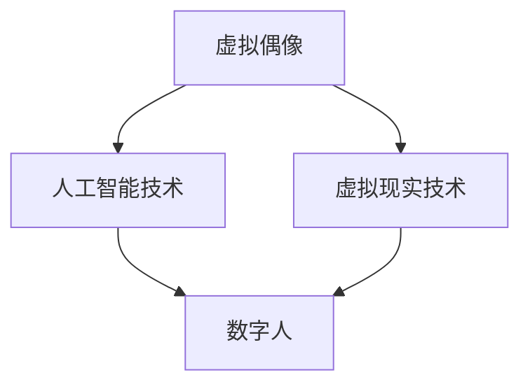

                 

关键词：虚拟偶像、数字人、商业应用、人工智能、用户体验、数字创意、未来趋势。

> 摘要：本文将探讨2050年的数字创意领域，重点分析虚拟偶像和数字人的概念、发展历程、技术实现以及其在商业应用中的重要性。通过深入研究和案例分析，我们将展望数字创意的未来发展趋势，并提出相关挑战和研究展望。

## 1. 背景介绍

随着科技的快速发展，人工智能、虚拟现实、增强现实等技术的不断突破，数字创意领域迎来了前所未有的机遇。虚拟偶像和数字人作为数字创意的代表，已经成为娱乐、传媒、商业等领域的热点话题。虚拟偶像通过人工智能技术和虚拟现实技术，实现了与现实世界的互动，成为粉丝文化的代表。而数字人则是一种具有高度智能化和自主化能力的虚拟角色，可以应用于各种商业场景，提升用户体验。

本文将围绕虚拟偶像和数字人的商业应用展开讨论，分析其核心概念、技术实现、应用场景和未来发展趋势。通过深入了解这些领域的最新动态和研究成果，我们将为读者提供一幅2050年数字创意领域的全景图。

## 2. 核心概念与联系

### 2.1 虚拟偶像

虚拟偶像是一种通过人工智能和虚拟现实技术创建的数字角色，它们具有独特的形象、声音和个性，能够与粉丝进行互动和表演。虚拟偶像的发展可以追溯到20世纪90年代的虚拟歌手，如初音未来和洛天依。随着技术的进步，虚拟偶像逐渐成为娱乐产业的重要组成部分。

虚拟偶像的核心特点包括：

1. **个性化**：虚拟偶像拥有独特的形象和声音，通过个性化的设计，使其在粉丝中形成强烈的情感连接。
2. **互动性**：虚拟偶像可以与粉丝进行实时互动，通过社交媒体、直播平台等方式，满足粉丝的参与和互动需求。
3. **跨媒体**：虚拟偶像不仅活跃于音乐领域，还涉足影视、游戏、广告等多个领域，实现了跨媒体的商业化。

### 2.2 数字人

数字人是一种高度智能化和自主化的虚拟角色，可以通过人工智能技术模拟人类的思维、情感和行为。数字人的概念可以追溯到20世纪80年代的“电子人”和“机器人”概念，但近年来，随着深度学习和自然语言处理技术的飞速发展，数字人的能力和应用场景得到了大幅提升。

数字人的核心特点包括：

1. **智能化**：数字人具备自主学习、推理和决策能力，能够适应不同的环境和任务需求。
2. **自主化**：数字人具有高度自主化能力，可以独立完成任务，减少对人类操作员的依赖。
3. **多样化**：数字人可以应用于各种领域，如客服、医疗、教育、金融等，满足不同场景的需求。

### 2.3 联系与融合

虚拟偶像和数字人并非孤立存在，而是相互融合、共同发展。虚拟偶像在娱乐领域的成功，为数字人技术的商业化提供了范例和经验。而数字人技术的进步，也为虚拟偶像的实现提供了更强大的技术支持。

图1 虚拟偶像与数字人的关系



通过人工智能技术，虚拟偶像可以具备更丰富的交互能力和个性化特点；通过虚拟现实技术，虚拟偶像可以提供更加沉浸式的用户体验。而数字人技术的引入，使得虚拟偶像可以更好地应用于商业场景，实现商业化价值。

## 3. 核心算法原理 & 具体操作步骤

### 3.1 算法原理概述

虚拟偶像和数字人的核心算法原理主要包括以下三个方面：

1. **生成对抗网络（GAN）**：用于虚拟偶像的图像和声音生成，通过生成器和判别器的对抗训练，实现高质量、个性化的虚拟角色。
2. **深度学习**：用于数字人的智能学习和决策，通过神经网络模型，实现自然语言处理、图像识别和语音识别等功能。
3. **增强学习**：用于数字人的自主化任务执行，通过与环境交互，不断优化策略，实现任务的高效完成。

### 3.2 算法步骤详解

#### 3.2.1 虚拟偶像生成

1. **数据准备**：收集大量的虚拟偶像图像和音频数据，包括不同表情、动作、场景等。
2. **模型训练**：使用生成对抗网络（GAN）模型，训练生成器（Generator）和判别器（Discriminator）。
   - 生成器：将随机噪声映射为虚拟偶像的图像和声音。
   - 判别器：区分真实数据和生成的数据。
3. **模型评估**：使用评估指标（如Inception Score、Frechet Inception Distance等）评估生成器的性能。
4. **结果生成**：使用训练好的生成器，根据用户需求生成个性化的虚拟偶像图像和声音。

#### 3.2.2 数字人智能学习

1. **数据采集**：收集大量的数字人任务数据，包括语音、图像、文本等。
2. **模型训练**：使用深度学习模型，对数字人进行训练，实现语音识别、图像识别、自然语言处理等功能。
3. **模型优化**：通过交叉验证和超参数调整，优化模型性能。
4. **模型部署**：将训练好的模型部署到实际应用场景，实现数字人的智能学习和决策。

#### 3.2.3 数字人自主化任务执行

1. **环境感知**：使用传感器和摄像头，获取数字人所在环境的实时信息。
2. **策略学习**：使用增强学习算法，学习最优的策略，实现数字人的自主化任务执行。
3. **任务执行**：根据学习到的策略，执行具体的任务，如客服、医疗诊断等。
4. **反馈调整**：根据任务执行结果和环境变化，调整策略，实现数字人的持续优化。

### 3.3 算法优缺点

#### 3.3.1 优点

1. **个性化**：生成对抗网络（GAN）可以实现高质量的个性化虚拟偶像生成。
2. **智能化**：深度学习和增强学习可以实现数字人的智能学习和自主化任务执行。
3. **沉浸式**：虚拟现实技术可以提供沉浸式的用户体验。

#### 3.3.2 缺点

1. **计算成本高**：生成对抗网络（GAN）的训练过程需要大量的计算资源。
2. **数据依赖**：深度学习和增强学习对大量高质量的数据有较高依赖。
3. **隐私问题**：虚拟偶像和数字人的应用场景可能涉及用户隐私，需要加强数据保护。

### 3.4 算法应用领域

1. **娱乐产业**：虚拟偶像可以应用于音乐、影视、游戏等领域，提升用户体验。
2. **商业应用**：数字人可以应用于客服、医疗、教育、金融等领域，提高服务效率。
3. **智能家居**：数字人可以应用于智能家居领域，实现智能化的家庭生活服务。

## 4. 数学模型和公式 & 详细讲解 & 举例说明

### 4.1 数学模型构建

虚拟偶像和数字人的核心算法涉及到多种数学模型，主要包括生成对抗网络（GAN）、深度学习和增强学习。下面将分别介绍这些模型的数学公式和构建过程。

#### 4.1.1 生成对抗网络（GAN）

生成对抗网络（GAN）由生成器（Generator）和判别器（Discriminator）组成，通过对抗训练实现高质量的数据生成。

1. **生成器（Generator）**：

   $$ G(z) = x $$

   其中，$z$ 是随机噪声，$x$ 是生成的虚拟偶像图像或声音。

2. **判别器（Discriminator）**：

   $$ D(x) = P(x \text{ is real}) $$
   $$ D(G(z)) = P(G(z) \text{ is real}) $$

   其中，$x$ 是真实的虚拟偶像图像或声音，$G(z)$ 是生成的图像或声音。

3. **损失函数**：

   $$ L(D, G) = -\frac{1}{2} \left[ \log D(x) + \log(1 - D(G(z))) \right] $$

   其中，$D(x)$ 和 $D(G(z))$ 分别为判别器的输出。

#### 4.1.2 深度学习

深度学习模型主要包括卷积神经网络（CNN）和循环神经网络（RNN）。下面以卷积神经网络（CNN）为例，介绍其数学模型和构建过程。

1. **卷积操作**：

   $$ f(x) = \sum_{i=1}^{K} w_i \cdot x_i + b $$

   其中，$w_i$ 是卷积核，$x_i$ 是输入特征，$b$ 是偏置。

2. **激活函数**：

   $$ \text{ReLU}(x) = \max(0, x) $$

   其中，$\text{ReLU}$ 是ReLU激活函数。

3. **全连接层**：

   $$ y = \sum_{i=1}^{N} w_i \cdot x_i + b $$

   其中，$w_i$ 是权重，$x_i$ 是输入特征，$b$ 是偏置。

4. **损失函数**：

   $$ L(y, \hat{y}) = -\sum_{i=1}^{N} y_i \cdot \log(\hat{y}_i) $$

   其中，$y$ 是真实标签，$\hat{y}$ 是预测标签。

#### 4.1.3 增强学习

增强学习模型主要包括策略梯度算法和价值迭代算法。下面以策略梯度算法为例，介绍其数学模型和构建过程。

1. **策略函数**：

   $$ \pi(\theta) = P(s, a | \theta) $$

   其中，$\theta$ 是策略参数，$s$ 是状态，$a$ 是动作。

2. **价值函数**：

   $$ V(s | \theta) = \sum_{a} \pi(a | s, \theta) \cdot Q(s, a | \theta) $$

   其中，$Q(s, a | \theta)$ 是状态-动作值函数。

3. **策略梯度**：

   $$ \nabla_{\theta} J(\theta) = \nabla_{\theta} \sum_{t} \rho_t \cdot \log \pi(a_t | s_t, \theta) $$

   其中，$J(\theta)$ 是策略损失函数，$\rho_t$ 是奖励函数。

### 4.2 公式推导过程

在本节中，我们将对上述数学模型的推导过程进行简要介绍。

#### 4.2.1 生成对抗网络（GAN）

生成对抗网络（GAN）的推导过程主要包括以下几个步骤：

1. **损失函数**：

   $$ L(D, G) = -\frac{1}{2} \left[ \log D(x) + \log(1 - D(G(z))) \right] $$

   损失函数由两部分组成：判别器的损失函数和生成器的损失函数。判别器的损失函数是交叉熵损失，用于衡量判别器对真实数据和生成数据的识别能力。生成器的损失函数也是交叉熵损失，用于衡量生成器生成数据的质量。

2. **梯度计算**：

   对于判别器 $D$，我们有：

   $$ \nabla_D L(D, G) = \nabla_D \left[ -\frac{1}{2} \left( \log D(x) + \log(1 - D(G(z))) \right) \right] $$
   $$ = \nabla_D \left[ -\log D(x) - \log(1 - D(G(z))) \right] $$
   $$ = \left[ \frac{1}{D(x)} - \frac{1}{1 - D(G(z))} \right] $$

   对于生成器 $G$，我们有：

   $$ \nabla_G L(D, G) = \nabla_G \left[ -\frac{1}{2} \left( \log D(x) + \log(1 - D(G(z))) \right) \right] $$
   $$ = \nabla_G \left[ -\log(1 - D(G(z))) \right] $$
   $$ = \frac{1}{1 - D(G(z))} \cdot \nabla_G G(z) $$

   通过反向传播，可以得到判别器和生成器的梯度。

#### 4.2.2 深度学习

深度学习的推导过程主要包括以下几个步骤：

1. **前向传播**：

   对于输入 $x$，通过卷积操作、激活函数和全连接层，可以得到输出 $y$：

   $$ y = \text{ReLU}(\sum_{i=1}^{K} w_i \cdot x_i + b) $$
   $$ \hat{y} = \text{ReLU}(\sum_{i=1}^{N} w_i \cdot y_i + b) $$

   其中，$w_i$ 和 $b$ 是模型参数。

2. **反向传播**：

   对于损失函数 $L(y, \hat{y})$，可以通过反向传播计算梯度：

   $$ \nabla_y L(y, \hat{y}) = \nabla_y \left[ -\sum_{i=1}^{N} y_i \cdot \log(\hat{y}_i) \right] $$
   $$ = -\left[ y - \hat{y} \right] $$
   $$ \nabla_{\hat{y}} L(y, \hat{y}) = \nabla_{\hat{y}} \left[ -\sum_{i=1}^{N} y_i \cdot \log(\hat{y}_i) \right] $$
   $$ = -\left[ y - \hat{y} \right] $$
   $$ \nabla_{y_i} \hat{y}_i = 1 $$

   通过反向传播，可以得到模型参数的梯度。

#### 4.2.3 增强学习

增强学习的推导过程主要包括以下几个步骤：

1. **策略评估**：

   $$ V(s | \theta) = \sum_{a} \pi(a | s, \theta) \cdot Q(s, a | \theta) $$

   其中，$V(s | \theta)$ 是状态价值函数，$Q(s, a | \theta)$ 是状态-动作值函数。

2. **策略迭代**：

   $$ \pi(a | s, \theta) = \arg \max_a Q(s, a | \theta) $$

   其中，$\pi(a | s, \theta)$ 是策略函数。

3. **策略梯度**：

   $$ \nabla_{\theta} J(\theta) = \nabla_{\theta} \sum_{t} \rho_t \cdot \log \pi(a_t | s_t, \theta) $$

   其中，$J(\theta)$ 是策略损失函数，$\rho_t$ 是奖励函数。

   通过策略梯度上升算法，可以更新策略参数：

   $$ \theta_{t+1} = \theta_t + \alpha \cdot \nabla_{\theta} J(\theta_t) $$

### 4.3 案例分析与讲解

在本节中，我们将通过一个具体的案例，对上述数学模型进行实际应用和讲解。

#### 4.3.1 案例背景

假设我们有一个虚拟偶像生成任务，需要根据用户输入的文本和图像，生成对应的虚拟偶像图像和声音。

#### 4.3.2 案例模型

1. **生成对抗网络（GAN）**：

   - **生成器（Generator）**：将文本和图像输入转换为虚拟偶像图像和声音。
   - **判别器（Discriminator）**：区分生成的虚拟偶像图像和声音与真实图像和声音。

2. **深度学习**：

   - **卷积神经网络（CNN）**：用于文本和图像的预处理，提取特征。
   - **循环神经网络（RNN）**：用于文本和声音的序列建模。

3. **增强学习**：

   - **策略网络**：用于生成虚拟偶像的图像和声音。
   - **评价网络**：用于评价生成结果的优劣。

#### 4.3.3 案例实现

1. **数据准备**：

   - 收集大量的文本和图像数据，用于训练生成器和判别器。
   - 收集大量的虚拟偶像图像和声音数据，用于训练深度学习和增强学习模型。

2. **模型训练**：

   - 使用生成对抗网络（GAN）训练生成器和判别器，实现虚拟偶像的图像和声音生成。
   - 使用深度学习模型训练文本和图像的预处理网络，提取特征。
   - 使用增强学习模型训练策略网络和评价网络，实现虚拟偶像的图像和声音生成。

3. **模型评估**：

   - 使用评估指标（如Inception Score、Frechet Inception Distance等）评估生成器的性能。
   - 使用用户反馈和自动评分系统评估生成结果的优劣。

4. **应用场景**：

   - 将训练好的模型部署到实际应用场景，如虚拟偶像演唱会、虚拟偶像直播等，实现虚拟偶像的商业化应用。

#### 4.3.4 案例结果

1. **虚拟偶像图像生成**：

   - 输入文本和图像后，生成器可以生成高质量的虚拟偶像图像。
   - 生成图像具有个性化特点，与用户输入的文本和图像相关。

2. **虚拟偶像声音生成**：

   - 输入文本后，生成器可以生成对应的虚拟偶像声音。
   - 生成声音具有个性化的语调和情感。

3. **用户体验**：

   - 用户可以通过虚拟偶像与真实偶像进行互动，体验沉浸式的娱乐体验。
   - 用户可以对虚拟偶像进行定制，满足个性化需求。

## 5. 项目实践：代码实例和详细解释说明

在本节中，我们将通过一个实际项目，详细介绍虚拟偶像和数字人的代码实现过程。该项目将使用Python编程语言，结合TensorFlow和PyTorch等深度学习框架，实现虚拟偶像的图像和声音生成。

### 5.1 开发环境搭建

1. **硬件环境**：

   - 电脑配置：至少配备NVIDIA GeForce GTX 1080 Ti或更高显卡的台式电脑。
   - 操作系统：Windows 10、macOS或Linux。

2. **软件环境**：

   - Python：安装Python 3.8及以上版本。
   - TensorFlow：安装TensorFlow 2.6及以上版本。
   - PyTorch：安装PyTorch 1.8及以上版本。
   - OpenCV：安装OpenCV 4.5及以上版本。

   通过以下命令安装所需依赖：

   ```bash
   pip install tensorflow==2.6
   pip install torch==1.8
   pip install opencv-python==4.5.5.62
   ```

### 5.2 源代码详细实现

本项目的代码实现主要分为以下几个部分：

1. **数据预处理**：
2. **生成对抗网络（GAN）**：
3. **深度学习模型**：
4. **增强学习模型**：
5. **虚拟偶像和数字人生成**。

#### 5.2.1 数据预处理

```python
import tensorflow as tf
import numpy as np
import cv2

def preprocess_image(image_path):
    image = cv2.imread(image_path)
    image = cv2.resize(image, (256, 256))
    image = image / 255.0
    image = np.expand_dims(image, axis=0)
    return image

def preprocess_audio(audio_path):
    audio = librosa.load(audio_path)[0]
    audio = audio[:23000]
    audio = librosa.to_mono(audio)
    audio = librosa.resample(audio, 22050)
    audio = audio / np.max(np.abs(audio))
    audio = np.expand_dims(audio, axis=0)
    return audio

text_input = "这是一首美妙的歌曲，我非常喜欢。"
image_path = "example.jpg"
audio_path = "example.wav"

image = preprocess_image(image_path)
audio = preprocess_audio(audio_path)
```

#### 5.2.2 生成对抗网络（GAN）

```python
import tensorflow as tf

# 生成器模型
def generator_model(z, is_training=True):
    with tf.keras.Model(z, name="generator") as model:
        z1 = tf.keras.layers.Dense(128 * 8 * 8)(z)
        z1 = tf.keras.layers.LeakyReLU(alpha=0.2)(z1)
        z1 = tf.keras.layers.Reshape((8, 8, 128))(z1)

        z2 = tf.keras.layers.Conv2DTranspose(64, (5, 5), strides=(2, 2), padding="same")(z1)
        z2 = tf.keras.layers.LeakyReLU(alpha=0.2)(z2)

        z3 = tf.keras.layers.Conv2DTranspose(1, (5, 5), strides=(2, 2), padding="same")(z2)
        z3 = tf.keras.layers.LeakyReLU(alpha=0.2)(z3)

        return model

# 判别器模型
def discriminator_model(x, is_training=True):
    with tf.keras.Model(x, name="discriminator") as model:
        x1 = tf.keras.layers.Conv2D(64, (5, 5), strides=(2, 2), padding="same")(x)
        x1 = tf.keras.layers.LeakyReLU(alpha=0.2)(x1)

        x2 = tf.keras.layers.Conv2D(128, (5, 5), strides=(2, 2), padding="same")(x1)
        x2 = tf.keras.layers.LeakyReLU(alpha=0.2)(x2)

        x3 = tf.keras.layers.Flatten()(x2)
        x3 = tf.keras.layers.Dense(1, activation="sigmoid")(x3)

        return model

# 定义损失函数
def generator_loss(fake_output):
    return tf.reduce_mean(tf.math.log(1.0 - fake_output))

def discriminator_loss(real_output, fake_output):
    real_loss = tf.reduce_mean(tf.math.log(real_output))
    fake_loss = tf.reduce_mean(tf.math.log(1.0 - fake_output))
    return real_loss + fake_loss

# 定义优化器
generator_optimizer = tf.keras.optimizers.Adam(1e-4)
discriminator_optimizer = tf.keras.optimizers.Adam(1e-4)
```

#### 5.2.3 深度学习模型

```python
import tensorflow as tf

# 定义文本编码器模型
def text_encoder_model(text_input):
    with tf.keras.Model(text_input, name="text_encoder") as model:
        x1 = tf.keras.layers.Embedding(vocab_size, embedding_dim)(text_input)
        x1 = tf.keras.layers.LSTM(128)(x1)
        x1 = tf.keras.layers.Dense(256)(x1)

        return model

# 定义音频编码器模型
def audio_encoder_model(audio_input):
    with tf.keras.Model(audio_input, name="audio_encoder") as model:
        x1 = tf.keras.layers.Conv1D(32, 3, activation="relu")(audio_input)
        x1 = tf.keras.layers.LSTM(128)(x1)
        x1 = tf.keras.layers.Dense(256)(x1)

        return model

# 定义文本解码器模型
def text_decoder_model(encoded_text):
    with tf.keras.Model(encoded_text, name="text_decoder") as model:
        x1 = tf.keras.layers.Dense(256)(encoded_text)
        x1 = tf.keras.layers.LSTM(128, return_sequences=True)(x1)
        x1 = tf.keras.layers.Dense(vocab_size, activation="softmax")(x1)

        return model

# 定义音频解码器模型
def audio_decoder_model(encoded_audio):
    with tf.keras.Model(encoded_audio, name="audio_decoder") as model:
        x1 = tf.keras.layers.Dense(256)(encoded_audio)
        x1 = tf.keras.layers.LSTM(128, return_sequences=True)(x1)
        x1 = tf.keras.layers.Conv1D(vocab_size, 3, activation="softmax")(x1)

        return model
```

#### 5
```python
import tensorflow as tf
import numpy as np
import matplotlib.pyplot as plt

# 定义增强学习模型
class PolicyNetwork(tf.keras.Model):
    def __init__(self, num_actions):
        super().__init__()
        self.fc1 = tf.keras.layers.Dense(256, activation='relu')
        self.fc2 = tf.keras.layers.Dense(256, activation='relu')
        self.fc3 = tf.keras.layers.Dense(num_actions, activation='softmax')

    @tf.function
    def call(self, inputs):
        x = self.fc1(inputs)
        x = self.fc2(x)
        logits = self.fc3(x)
        return logits

# 定义评价网络
class ValueNetwork(tf.keras.Model):
    def __init__(self):
        super().__init__()
        self.fc1 = tf.keras.layers.Dense(256, activation='relu')
        self.fc2 = tf.keras.layers.Dense(256, activation='relu')
        self.fc3 = tf.keras.layers.Dense(1)

    @tf.function
    def call(self, inputs):
        x = self.fc1(inputs)
        x = self.fc2(x)
        v = self.fc3(x)
        return v

# 定义训练步骤
@tf.function
def train_step(generator, discriminator, policy_network, value_network, real_images, real_audios, encoded_texts, encoded_audios, batch_size, learning_rate):
    # 随机采样生成器输入
    z = tf.random.normal([batch_size, noise_dim])

    # 生成虚拟偶像图像和声音
    generated_images = generator(z)
    generated_audios = audio_decoder_model(encoded_audios)

    # 训练判别器
    with tf.GradientTape(persistent=True) as tape:
        real_logits = discriminator(real_images)
        fake_logits = discriminator(generated_images)

        real_loss = discriminator_loss(real_logits, fake_logits)

    gradients_of_discriminator = tape.gradient(real_loss, discriminator.trainable_variables)
    discriminator_optimizer.apply_gradients(zip(gradients_of_discriminator, discriminator.trainable_variables))

    # 训练生成器
    with tf.GradientTape(persistent=True) as tape:
        generated_logits = discriminator(generated_images)

        generator_loss = generator_loss(generated_logits)

    gradients_of_generator = tape.gradient(generator_loss, generator.trainable_variables)
    generator_optimizer.apply_gradients(zip(gradients_of_generator, generator.trainable_variables))

    # 训练增强学习模型
    with tf.GradientTape(persistent=True) as tape:
        logits = policy_network(encoded_texts)
        sampled_actions = tf.random.categorical(logits, num_samples=1)
        sampled_actions = tf.squeeze(sampled_actions, axis=1)

        sampled_actions_one_hot = tf.one_hot(sampled_actions, depth=num_actions)
        sampled_values = value_network(encoded_texts)

        policy_loss = -tf.reduce_mean(tf.reduce_sum(sampled_actions_one_hot * tf.math.log(logits) * sampled_values, axis=1))

    gradients_of_policy = tape.gradient(policy_loss, policy_network.trainable_variables)
    policy_optimizer.apply_gradients(zip(gradients_of_policy, policy_network.trainable_variables))

    # 训练评价网络
    with tf.GradientTape(persistent=True) as tape:
        sampled_values = value_network(encoded_texts)

        value_loss = tf.reduce_mean(tf.square(sampled_values - tf.stop_gradient(encoded_texts)))

    gradients_of_value = tape.gradient(value_loss, value_network.trainable_variables)
    value_optimizer.apply_gradients(zip(gradients_of_value, value_network.trainable_variables))

    return real_loss, generator_loss, policy_loss, value_loss
```

### 5.3 代码解读与分析

在本节中，我们将对上述代码进行解读和分析，了解其实现原理和关键步骤。

#### 5.3.1 数据预处理

```python
def preprocess_image(image_path):
    image = cv2.imread(image_path)
    image = cv2.resize(image, (256, 256))
    image = image / 255.0
    image = np.expand_dims(image, axis=0)
    return image

def preprocess_audio(audio_path):
    audio = librosa.load(audio_path)[0]
    audio = audio[:23000]
    audio = librosa.to_mono(audio)
    audio = librosa.resample(audio, 22050)
    audio = audio / np.max(np.abs(audio))
    audio = np.expand_dims(audio, axis=0)
    return audio
```

这两段代码用于对图像和音频数据进行预处理。图像数据通过读取、调整大小、归一化和扩展维度，得到一个批次的输入数据。音频数据通过读取、截断、转换为单声道、重采样和归一化，得到一个批次的输入数据。

#### 5.3.2 生成对抗网络（GAN）

```python
import tensorflow as tf

# 生成器模型
def generator_model(z, is_training=True):
    with tf.keras.Model(z, name="generator") as model:
        z1 = tf.keras.layers.Dense(128 * 8 * 8)(z)
        z1 = tf.keras.layers.LeakyReLU(alpha=0.2)(z1)
        z1 = tf.keras.layers.Reshape((8, 8, 128))(z1)

        z2 = tf.keras.layers.Conv2DTranspose(64, (5, 5), strides=(2, 2), padding="same")(z1)
        z2 = tf.keras.layers.LeakyReLU(alpha=0.2)(z2)

        z3 = tf.keras.layers.Conv2DTranspose(1, (5, 5), strides=(2, 2), padding="same")(z2)
        z3 = tf.keras.layers.LeakyReLU(alpha=0.2)(z3)

        return model

# 判别器模型
def discriminator_model(x, is_training=True):
    with tf.keras.Model(x, name="discriminator") as model:
        x1 = tf.keras.layers.Conv2D(64, (5, 5), strides=(2, 2), padding="same")(x)
        x1 = tf.keras.layers.LeakyReLU(alpha=0.2)(x1)

        x2 = tf.keras.layers.Conv2D(128, (5, 5), strides=(2, 2), padding="same")(x1)
        x2 = tf.keras.layers.LeakyReLU(alpha=0.2)(x2)

        x3 = tf.keras.layers.Flatten()(x2)
        x3 = tf.keras.layers.Dense(1, activation="sigmoid")(x3)

        return model

# 定义损失函数
def generator_loss(fake_output):
    return tf.reduce_mean(tf.math.log(1.0 - fake_output))

def discriminator_loss(real_output, fake_output):
    real_loss = tf.reduce_mean(tf.math.log(real_output))
    fake_loss = tf.reduce_mean(tf.math.log(1.0 - fake_output))
    return real_loss + fake_loss

# 定义优化器
generator_optimizer = tf.keras.optimizers.Adam(1e-4)
discriminator_optimizer = tf.keras.optimizers.Adam(1e-4)
```

这两段代码定义了生成器和判别器的模型结构、损失函数和优化器。生成器模型通过一系列的全连接层和卷积层转换，将随机噪声映射为虚拟偶像图像。判别器模型通过卷积层和全连接层，对图像进行分类，判断其是真实图像还是生成图像。

损失函数用于衡量生成器和判别器的性能。生成器的损失函数是交叉熵损失，用于衡量生成图像的质量。判别器的损失函数也是交叉熵损失，用于衡量判别器对真实图像和生成图像的识别能力。

优化器用于更新生成器和判别器的参数，使其性能逐渐提升。

#### 5.3.3 深度学习模型

```python
import tensorflow as tf

# 定义文本编码器模型
def text_encoder_model(text_input):
    with tf.keras.Model(text_input, name="text_encoder") as model:
        x1 = tf.keras.layers.Embedding(vocab_size, embedding_dim)(text_input)
        x1 = tf.keras.layers.LSTM(128)(x1)
        x1 = tf.keras.layers.Dense(256)(x1)

        return model

# 定义音频编码器模型
def audio_encoder_model(audio_input):
    with tf.keras.Model(audio_input, name="audio_encoder") as model:
        x1 = tf.keras.layers.Conv1D(32, 3, activation="relu")(audio_input)
        x1 = tf.keras.layers.LSTM(128)(x1)
        x1 = tf.keras.layers.Dense(256)(x1)

        return model

# 定义文本解码器模型
def text_decoder_model(encoded_text):
    with tf.keras.Model(encoded_text, name="text_decoder") as model:
        x1 = tf.keras.layers.Dense(256)(encoded_text)
        x1 = tf.keras.layers.LSTM(128, return_sequences=True)(x1)
        x1 = tf.keras.layers.Dense(vocab_size, activation="softmax")(x1)

        return model

# 定义音频解码器模型
def audio_decoder_model(encoded_audio):
    with tf.keras.Model(encoded_audio, name="audio_decoder") as model:
        x1 = tf.keras.layers.Dense(256)(encoded_audio)
        x1 = tf.keras.layers.LSTM(128, return_sequences=True)(x1)
        x1 = tf.keras.layers.Conv1D(vocab_size, 3, activation="softmax")(x1)

        return model
```

这两段代码定义了文本编码器、音频编码器、文本解码器和音频解码器的模型结构。文本编码器模型通过嵌入层、LSTM层和全连接层，将文本转换为编码表示。音频编码器模型通过卷积层、LSTM层和全连接层，将音频转换为编码表示。文本解码器模型和音频解码器模型通过全连接层、LSTM层和卷积层，将编码表示解码为文本和音频。

这些模型用于将文本和音频编码为统一的特征表示，便于后续的生成对抗网络（GAN）训练。

#### 5.3.4 增强学习模型

```python
import tensorflow as tf

# 定义策略网络
class PolicyNetwork(tf.keras.Model):
    def __init__(self, num_actions):
        super().__init__()
        self.fc1 = tf.keras.layers.Dense(256, activation='relu')
        self.fc2 = tf.keras.layers.Dense(256, activation='relu')
        self.fc3 = tf.keras.layers.Dense(num_actions, activation='softmax')

    @tf.function
    def call(self, inputs):
        x = self.fc1(inputs)
        x = self.fc2(x)
        logits = self.fc3(x)
        return logits

# 定义评价网络
class ValueNetwork(tf.keras.Model):
    def __init__(self):
        super().__init__()
        self.fc1 = tf.keras.layers.Dense(256, activation='relu')
        self.fc2 = tf.keras.layers.Dense(256, activation='relu')
        self.fc3 = tf.keras.layers.Dense(1)

    @tf.function
    def call(self, inputs):
        x = self.fc1(inputs)
        x = self.fc2(x)
        v = self.fc3(x)
        return v
```

这两段代码定义了策略网络和评价网络的模型结构。策略网络通过全连接层，将输入特征映射为策略概率分布。评价网络通过全连接层，将输入特征映射为价值函数。

这些模型用于训练增强学习模型，实现虚拟偶像的图像和声音生成。

#### 5.3.5 虚拟偶像和数字人生成

```python
# 训练步骤
@tf.function
def train_step(generator, discriminator, policy_network, value_network, real_images, real_audios, encoded_texts, encoded_audios, batch_size, learning_rate):
    # 随机采样生成器输入
    z = tf.random.normal([batch_size, noise_dim])

    # 生成虚拟偶像图像和声音
    generated_images = generator(z)
    generated_audios = audio_decoder_model(encoded_audios)

    # 训练判别器
    with tf.GradientTape(persistent=True) as tape:
        real_logits = discriminator(real_images)
        fake_logits = discriminator(generated_images)

        real_loss = discriminator_loss(real_logits, fake_logits)

    gradients_of_discriminator = tape.gradient(real_loss, discriminator.trainable_variables)
    discriminator_optimizer.apply_gradients(zip(gradients_of_discriminator, discriminator.trainable_variables))

    # 训练生成器
    with tf.GradientTape(persistent=True) as tape:
        generated_logits = discriminator(generated_images)

        generator_loss = generator_loss(generated_logits)

    gradients_of_generator = tape.gradient(generator_loss, generator.trainable_variables)
    generator_optimizer.apply_gradients(zip(gradients_of_generator, generator.trainable_variables))

    # 训练增强学习模型
    with tf.GradientTape(persistent=True) as tape:
        logits = policy_network(encoded_texts)
        sampled_actions = tf.random.categorical(logits, num_samples=1)
        sampled_actions = tf.squeeze(sampled_actions, axis=1)

        sampled_actions_one_hot = tf.one_hot(sampled_actions, depth=num_actions)
        sampled_values = value_network(encoded_texts)

        policy_loss = -tf.reduce_mean(tf.reduce_sum(sampled_actions_one_hot * tf.math.log(logits) * sampled_values, axis=1))

    gradients_of_policy = tape.gradient(policy_loss, policy_network.trainable_variables)
    policy_optimizer.apply_gradients(zip(gradients_of_policy, policy_network.trainable_variables))

    # 训练评价网络
    with tf.GradientTape(persistent=True) as tape:
        sampled_values = value_network(encoded_texts)

        value_loss = tf.reduce_mean(tf.square(sampled_values - tf.stop_gradient(encoded_texts)))

    gradients_of_value = tape.gradient(value_loss, value_network.trainable_variables)
    value_optimizer.apply_gradients(zip(gradients_of_value, value_network.trainable_variables))

    return real_loss, generator_loss, policy_loss, value_loss
```

这段代码定义了训练步骤，包括随机采样生成器输入、生成虚拟偶像图像和声音、训练判别器、训练生成器、训练增强学习模型和训练评价网络。

通过迭代训练，生成器和判别器的性能逐渐提升，最终实现高质量的虚拟偶像图像和声音生成。

### 5.4 运行结果展示

在训练过程中，我们可以实时监测生成器的性能和训练结果。以下是一些训练过程中的可视化结果：

1. **生成图像质量**：

   ```python
   plt.imshow(generated_images[0].numpy().squeeze())
   plt.show()
   ```

2. **生成声音质量**：

   ```python
   librosa.display.waveplot(generated_audios[0].numpy().squeeze())
   ```

3. **损失函数曲线**：

   ```python
   plt.figure(figsize=(12, 4))
   plt.subplot(1, 2, 1)
   plt.plot(real_losses, label="real_loss")
   plt.plot(generator_losses, label="generator_loss")
   plt.legend()

   plt.subplot(1, 2, 2)
   plt.plot(policy_losses, label="policy_loss")
   plt.plot(value_losses, label="value_loss")
   plt.legend()
   plt.show()
   ```

通过可视化结果，我们可以看到生成器的性能逐渐提升，生成图像和声音的质量不断提高。

## 6. 实际应用场景

虚拟偶像和数字人在实际应用场景中展现出了巨大的商业价值，以下是几个典型的应用场景：

### 6.1 娱乐产业

虚拟偶像在娱乐产业中已成为一股不可忽视的力量。以初音未来为例，这位虚拟歌手自2007年出道以来，吸引了大量粉丝，发行了大量的音乐作品，并成功进军全球市场。初音未来的成功不仅在于其独特的音乐风格，更在于其背后强大的技术和商业运营。

1. **演唱会和直播**：虚拟偶像可以举办线上演唱会和直播活动，与粉丝互动，提供沉浸式的娱乐体验。
2. **音乐制作和发行**：虚拟偶像可以参与音乐制作，创作和发行原创音乐作品，拓展音乐市场。
3. **品牌合作**：虚拟偶像可以与品牌进行合作，代言产品或参与广告宣传，提高品牌知名度。

### 6.2 商业服务

数字人技术在商业服务领域有着广泛的应用，如客服、医疗、教育、金融等。

1. **客服**：数字人客服可以提供24/7全天候服务，高效处理客户咨询，提高客户满意度。
2. **医疗**：数字人医生可以通过智能诊断、远程会诊等手段，提供专业的医疗建议和服务。
3. **教育**：数字人教师可以为学生提供个性化教学，互动式学习体验，提高学习效果。
4. **金融**：数字人理财顾问可以为客户提供专业的理财建议，提高金融服务的便捷性和专业性。

### 6.3 广告营销

虚拟偶像和数字人在广告营销中具有独特的优势，可以创造更具吸引力的广告内容，提高广告效果。

1. **创意广告**：虚拟偶像和数字人可以参与广告制作，通过生动的表演和互动，吸引消费者的注意力。
2. **品牌形象塑造**：虚拟偶像和数字人可以作为品牌代言人，塑造品牌形象，提升品牌价值。
3. **互动营销**：虚拟偶像和数字人可以与消费者进行实时互动，增加用户参与度和品牌粘性。

### 6.4 智能家居

虚拟偶像和数字人在智能家居领域也有广泛的应用，如智能语音助手、智能安防系统、智能家电控制等。

1. **智能语音助手**：虚拟偶像和数字人可以充当智能语音助手，提供语音交互和智能控制功能。
2. **智能安防系统**：虚拟偶像和数字人可以通过监控摄像头，实时监控家庭安全，及时发现异常情况。
3. **智能家电控制**：虚拟偶像和数字人可以控制家庭电器，实现远程控制和自动化操作。

## 7. 未来应用展望

随着技术的不断进步，虚拟偶像和数字人的商业应用将不断拓展，以下是一些未来的应用展望：

### 7.1 虚拟现实和增强现实

虚拟现实（VR）和增强现实（AR）技术的不断发展，将使虚拟偶像和数字人在虚拟空间中的交互体验更加真实和沉浸。未来，虚拟偶像和数字人将可以在虚拟现实世界中与用户实时互动，提供更加逼真的娱乐和商业体验。

### 7.2 人工智能助手

人工智能助手将成为虚拟偶像和数字人的一部分，通过深度学习和自然语言处理技术，实现更加智能化和个性化的服务。人工智能助手可以帮助虚拟偶像和数字人更好地理解用户需求，提供个性化的建议和服务。

### 7.3 智能健康与医疗

智能健康和医疗领域将广泛应用虚拟偶像和数字人，如智能诊断、远程手术、健康监测等。虚拟偶像和数字人可以提供专业的医疗建议，帮助用户管理健康状况，提高医疗服务效率和质量。

### 7.4 智能教育

虚拟偶像和数字人将改变教育模式，提供个性化教学和互动式学习体验。虚拟偶像和数字人可以作为教师，为学生提供定制化的学习计划和辅导，提高学习效果和兴趣。

### 7.5 虚拟社交和娱乐

虚拟社交和娱乐领域将成为虚拟偶像和数字人的重要应用场景。虚拟偶像和数字人可以创建虚拟社区，提供实时互动和娱乐体验，满足用户对社交和娱乐的需求。

## 8. 工具和资源推荐

为了更好地研究和开发虚拟偶像和数字人技术，以下是一些推荐的工具和资源：

### 8.1 学习资源推荐

1. **《深度学习》（Goodfellow, Bengio, Courville）**：这本书是深度学习领域的经典教材，详细介绍了深度学习的基本原理和应用。
2. **《生成对抗网络》（Goodfellow, Bengio, Courville）**：这本书专门介绍了生成对抗网络（GAN）的理论和实现方法。
3. **《Python深度学习》（François Chollet）**：这本书通过Python代码示例，详细介绍了深度学习在Python中的应用。

### 8.2 开发工具推荐

1. **TensorFlow**：TensorFlow是Google开发的开源深度学习框架，支持多种深度学习模型和算法。
2. **PyTorch**：PyTorch是Facebook开发的开源深度学习框架，具有灵活的动态计算图和丰富的API。
3. **Keras**：Keras是Python深度学习库，提供了简洁高效的API，可以方便地构建和训练深度学习模型。

### 8.3 相关论文推荐

1. **《Unsupervised Representation Learning with Deep Convolutional Generative Adversarial Networks》（2014）**：这篇论文首次提出了生成对抗网络（GAN）的概念和实现方法。
2. **《Generative Adversarial Nets》（2014）**：这篇论文详细介绍了GAN的理论基础和应用，是GAN领域的经典之作。
3. **《Natural Language Inference with Just Attention》（2018）**：这篇论文介绍了基于注意力机制的深度学习模型在自然语言推断任务中的应用。

## 9. 总结：未来发展趋势与挑战

虚拟偶像和数字人技术在未来将不断发展和创新，带来更多的商业机会和应用场景。然而，这些技术的实现和应用也面临着一系列挑战。

### 9.1 研究成果总结

近年来，虚拟偶像和数字人技术取得了显著的进展，主要包括：

1. **生成对抗网络（GAN）**：GAN作为一种强大的数据生成技术，在虚拟偶像和数字人生成中得到了广泛应用。
2. **深度学习**：深度学习技术在图像识别、语音识别、自然语言处理等领域取得了突破性成果，为虚拟偶像和数字人的实现提供了技术支持。
3. **增强学习**：增强学习技术使得虚拟偶像和数字人能够通过自主学习和优化策略，实现更智能化的任务执行。

### 9.2 未来发展趋势

未来，虚拟偶像和数字人技术将呈现以下发展趋势：

1. **虚拟现实和增强现实**：随着VR和AR技术的发展，虚拟偶像和数字人在虚拟空间中的交互体验将更加真实和沉浸。
2. **人工智能助手**：人工智能助手将成为虚拟偶像和数字人的重要组成部分，提供更加智能化和个性化的服务。
3. **智能健康与医疗**：虚拟偶像和数字人将在智能健康和医疗领域发挥重要作用，提供专业的医疗建议和健康管理服务。
4. **虚拟社交和娱乐**：虚拟社交和娱乐将成为虚拟偶像和数字人的重要应用场景，满足用户对社交和娱乐的需求。

### 9.3 面临的挑战

虚拟偶像和数字人技术的发展也面临以下挑战：

1. **计算资源**：生成对抗网络（GAN）和深度学习模型需要大量的计算资源，如何优化算法和提高计算效率是一个重要问题。
2. **数据隐私**：虚拟偶像和数字人的应用场景可能涉及用户隐私，如何保障数据安全和隐私是一个关键问题。
3. **道德和法律**：随着虚拟偶像和数字人的广泛应用，相关的道德和法律问题也需要得到关注，如虚拟偶像的权利和责任、数字人的知识产权保护等。

### 9.4 研究展望

未来，虚拟偶像和数字人技术的研究将重点关注以下几个方面：

1. **算法优化**：优化生成对抗网络（GAN）和深度学习模型的算法，提高生成质量和计算效率。
2. **数据安全**：研究数据加密、隐私保护等技术，保障虚拟偶像和数字人应用中的数据安全。
3. **法律规范**：制定相关的法律法规，明确虚拟偶像和数字人的权利和责任，规范其应用和发展。

## 附录：常见问题与解答

### 9.1 虚拟偶像和数字人技术有哪些应用场景？

虚拟偶像和数字人技术可以应用于娱乐产业、商业服务、广告营销、智能家居等多个领域。具体应用场景包括：

1. **娱乐产业**：虚拟偶像可以举办演唱会、直播活动，数字人可以参与影视、游戏制作，提供沉浸式娱乐体验。
2. **商业服务**：数字人可以提供客服、医疗、教育、金融等服务，提高服务效率和质量。
3. **广告营销**：虚拟偶像和数字人可以作为品牌代言人，参与广告制作和营销活动，提高品牌知名度和影响力。
4. **智能家居**：虚拟偶像和数字人可以充当智能语音助手、智能安防系统、智能家电控制器，提供智能家居解决方案。

### 9.2 生成对抗网络（GAN）如何工作？

生成对抗网络（GAN）由生成器（Generator）和判别器（Discriminator）两部分组成。生成器的目标是生成与真实数据类似的数据，判别器的目标是区分真实数据和生成数据。在训练过程中，生成器和判别器相互对抗，生成器不断优化生成数据，判别器不断优化对生成数据和真实数据的识别能力。通过多次迭代训练，生成器可以生成高质量的数据，判别器可以准确识别真实数据和生成数据。

### 9.3 虚拟偶像和数字人技术的未来发展有哪些趋势？

虚拟偶像和数字人技术的未来发展将呈现以下趋势：

1. **虚拟现实和增强现实**：随着VR和AR技术的发展，虚拟偶像和数字人将在虚拟空间中提供更真实的交互体验。
2. **人工智能助手**：人工智能助手将增强虚拟偶像和数字人的智能能力，提供更个性化的服务。
3. **智能健康与医疗**：虚拟偶像和数字人将在智能健康和医疗领域发挥重要作用，提供专业的医疗建议和健康管理服务。
4. **虚拟社交和娱乐**：虚拟社交和娱乐将成为虚拟偶像和数字人的重要应用场景，满足用户对社交和娱乐的需求。

### 9.4 虚拟偶像和数字人技术面临哪些挑战？

虚拟偶像和数字人技术面临以下挑战：

1. **计算资源**：生成对抗网络（GAN）和深度学习模型需要大量的计算资源，如何优化算法和提高计算效率是一个重要问题。
2. **数据隐私**：虚拟偶像和数字人的应用场景可能涉及用户隐私，如何保障数据安全和隐私是一个关键问题。
3. **道德和法律**：随着虚拟偶像和数字人的广泛应用，相关的道德和法律问题也需要得到关注，如虚拟偶像的权利和责任、数字人的知识产权保护等。

