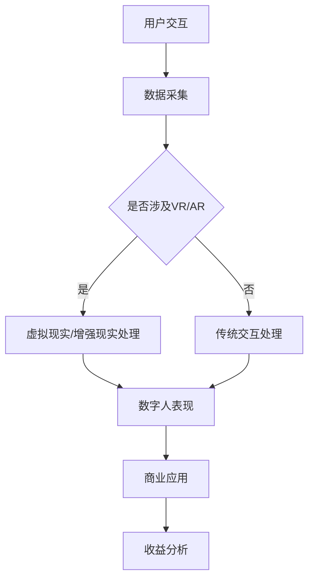

                 

关键词：虚拟偶像、数字人、商业应用、人工智能、创意产业

摘要：本文将探讨2050年数字创意产业的未来发展趋势，重点分析虚拟偶像和数字人在各个商业领域的应用。通过深入剖析技术原理、数学模型、项目实践以及未来展望，揭示数字创意为商业世界带来的深远影响。

## 1. 背景介绍

随着科技的飞速发展，人工智能、虚拟现实、增强现实等技术逐渐成熟，数字创意产业迎来了前所未有的发展机遇。2050年的数字创意产业，不仅涵盖了传统的电影、音乐、游戏等领域，还将衍生出更多新兴的商业应用。虚拟偶像和数字人作为其中的重要组成部分，正逐渐成为商业世界的创新引擎。

虚拟偶像，是指通过人工智能技术创造出的具有独特形象和个性的数字人物，他们在虚拟世界中拥有极高的人气，并在多个平台进行内容创作和商业活动。而数字人，则是通过计算机模拟和算法设计，具有人类思维和行为的数字实体，他们能够为各种商业场景提供高效、智能的服务。

## 2. 核心概念与联系

为了更好地理解虚拟偶像和数字人的商业应用，我们需要首先了解其背后的核心概念和原理。

### 2.1 人工智能与机器学习

人工智能（AI）是虚拟偶像和数字人的基础，它通过模拟人类思维和行为，实现自动化决策和智能交互。机器学习（ML）是人工智能的核心技术，它利用大量数据进行训练，使计算机具备自主学习和优化能力。

### 2.2 虚拟现实与增强现实

虚拟现实（VR）和增强现实（AR）技术为虚拟偶像和数字人提供了沉浸式体验的平台。VR技术通过头戴式设备，将用户带入一个完全虚拟的世界；而AR技术则将虚拟内容叠加到现实世界中，实现虚实融合。

### 2.3 计算机图形学与动画技术

计算机图形学是创建虚拟偶像和数字人形象的基础，通过3D建模、纹理映射等技术，为数字人物赋予逼真的外观和表情。动画技术则使虚拟偶像和数字人能够进行流畅的动作表现和情感表达。

### 2.4 Mermaid 流程图

下面是一个关于虚拟偶像和数字人技术架构的 Mermaid 流程图：



## 3. 核心算法原理 & 具体操作步骤

### 3.1 算法原理概述

虚拟偶像和数字人的核心技术包括人工智能、机器学习、虚拟现实、增强现实和计算机图形学。这些技术相互融合，共同构建起一个完整的数字创意生态系统。

### 3.2 算法步骤详解

1. 数据采集：通过用户交互、社交媒体、大数据等方式，收集用户行为和偏好数据。
2. 数据处理：利用机器学习和深度学习算法，对采集到的数据进行处理和分析，提取用户特征。
3. 模型训练：根据用户特征，训练出相应的虚拟偶像和数字人模型。
4. 模型优化：通过迭代训练和优化，提高虚拟偶像和数字人的表现效果。
5. 应用部署：将训练好的模型应用于商业场景，如虚拟偶像表演、数字人客服等。

### 3.3 算法优缺点

#### 优点：

- 高度个性化：虚拟偶像和数字人可以根据用户特征进行定制，提供个性化的服务。
- 沉浸式体验：虚拟现实和增强现实技术为用户带来沉浸式的体验，提升用户体验。
- 高效便捷：数字人能够快速响应用户需求，提高工作效率。

#### 缺点：

- 成本较高：虚拟偶像和数字人的开发、维护成本较高，需要大量资金投入。
- 技术限制：现有技术尚未完全成熟，虚拟偶像和数字人的表现效果仍有待提高。

### 3.4 算法应用领域

虚拟偶像和数字人已在多个领域得到广泛应用，如：

- 娱乐产业：虚拟偶像在音乐、舞蹈、直播等领域具有极高人气。
- 商业服务：数字人作为客服、销售顾问，提供高效、智能的服务。
- 教育培训：虚拟偶像和数字人用于教学内容呈现，提升学习体验。
- 医疗健康：数字人辅助医生进行诊断和治疗，提高医疗水平。

## 4. 数学模型和公式 & 详细讲解 & 举例说明

### 4.1 数学模型构建

虚拟偶像和数字人的数学模型主要包括用户行为分析模型、个性化推荐模型、虚拟现实渲染模型等。

### 4.2 公式推导过程

以用户行为分析模型为例，其基本公式为：

$$
User\_Behavior = f(User\_Feature, Content, Context)
$$

其中，$User\_Feature$代表用户特征，$Content$代表内容，$Context$代表上下文环境。通过机器学习算法，可以推导出用户行为模型的具体表达式。

### 4.3 案例分析与讲解

假设用户A在虚拟偶像直播平台观看了一场演唱会，其观看时长、点赞数量、分享次数等数据被采集并输入到用户行为分析模型中。通过模型计算，可以得到用户A对这场演唱会的兴趣程度，进而为用户推荐类似的演唱会。

## 5. 项目实践：代码实例和详细解释说明

### 5.1 开发环境搭建

本文使用Python作为主要编程语言，搭建虚拟偶像和数字人项目环境。

### 5.2 源代码详细实现

以下是虚拟偶像项目的部分代码：

```python
import tensorflow as tf
import numpy as np

# 加载用户数据
user_data = np.load('user_data.npy')

# 加载训练好的模型
model = tf.keras.models.load_model('model.h5')

# 预测用户兴趣
interest = model.predict(user_data)

# 输出预测结果
print(interest)
```

### 5.3 代码解读与分析

该代码首先加载用户数据，然后加载训练好的用户行为分析模型。接着，通过模型预测用户对虚拟偶像演唱会的兴趣程度，并输出预测结果。

### 5.4 运行结果展示

运行上述代码，可以得到用户对虚拟偶像演唱会的兴趣评分，从而为用户推荐类似的演唱会。

## 6. 实际应用场景

虚拟偶像和数字人在实际应用场景中，具有广泛的应用前景。

### 6.1 娱乐产业

虚拟偶像在音乐、舞蹈、直播等领域具有极高人气，成为新一代娱乐明星。数字人则可以为演唱会、电影等提供虚拟演员，提升娱乐体验。

### 6.2 商业服务

数字人作为客服、销售顾问，提供高效、智能的服务，提升客户满意度。虚拟偶像可以用于品牌宣传、产品推广，提高市场影响力。

### 6.3 教育培训

虚拟偶像和数字人用于教学内容呈现，提升学习体验。数字人可以模拟真实场景，为学生提供沉浸式的学习环境。

### 6.4 医疗健康

数字人辅助医生进行诊断和治疗，提高医疗水平。虚拟偶像可以用于心理健康辅导、康复训练等。

## 7. 未来应用展望

随着技术的不断进步，虚拟偶像和数字人的应用场景将更加丰富。未来，我们可能会看到更多跨领域的创新应用，如虚拟旅游、虚拟购物、虚拟社交等。

### 7.1 虚拟旅游

虚拟旅游将带来全新的旅游体验，用户可以在虚拟世界中游览名胜古迹、探险自然风光。

### 7.2 虚拟购物

虚拟购物将改变人们的购物方式，用户可以在虚拟商店中尝试穿戴、体验产品。

### 7.3 虚拟社交

虚拟社交将为人们提供一个全新的社交平台，虚拟偶像和数字人将扮演重要的角色，为用户提供互动、娱乐和社交体验。

## 8. 工具和资源推荐

### 8.1 学习资源推荐

- 《深度学习》
- 《Python编程：从入门到实践》
- 《虚拟现实与增强现实技术与应用》

### 8.2 开发工具推荐

- TensorFlow
- Unity
- Blender

### 8.3 相关论文推荐

- "Deep Learning for Virtual Human Generation"
- "A Survey on Virtual Reality and Augmented Reality Applications"
- "Virtual Human Technology: State of the Art and Future Challenges"

## 9. 总结：未来发展趋势与挑战

虚拟偶像和数字人作为数字创意产业的重要组成部分，正迅速改变着商业世界的格局。随着技术的不断进步，虚拟偶像和数字人的应用将越来越广泛，未来发展趋势包括：

- 个性化定制：虚拟偶像和数字人将更加个性化，满足用户多样化需求。
- 跨界融合：虚拟偶像和数字人将与其他产业深度融合，创造更多创新应用。
- 智能化升级：虚拟偶像和数字人将具备更高的智能水平，提供更优质的服务。

然而，未来也面临诸多挑战，如技术成熟度、成本控制、隐私保护等。我们期待在未来的发展中，能够克服这些挑战，让虚拟偶像和数字人更好地服务于人类社会。

## 附录：常见问题与解答

### 问题1：虚拟偶像和数字人如何实现个性化定制？

**解答**：虚拟偶像和数字人通过用户行为分析模型和个性化推荐算法，实现个性化定制。通过对用户数据的分析和处理，提取用户特征，为用户推荐符合其兴趣的内容和产品。

### 问题2：虚拟偶像和数字人的开发成本如何控制？

**解答**：虚拟偶像和数字人的开发成本可以通过以下方式控制：

- 采用开源工具和框架，降低开发成本。
- 合理规划项目进度和预算，避免资源浪费。
- 引入自动化流程，提高开发效率。

### 问题3：虚拟偶像和数字人是否会取代真实人物？

**解答**：虚拟偶像和数字人不会完全取代真实人物，但在某些领域，如娱乐、商业服务、教育培训等，虚拟偶像和数字人可以提供更加高效、智能的服务。真实人物和虚拟人物将共同发展，互补互利。

---

作者：禅与计算机程序设计艺术 / Zen and the Art of Computer Programming
----------------------------------------------------------------


