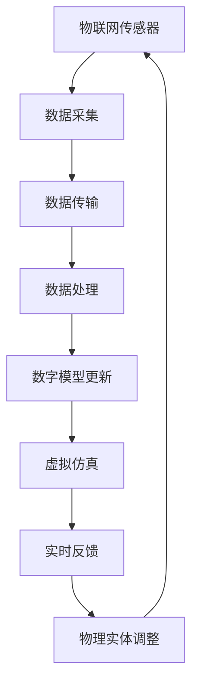

                 

关键词：数字孪生，元宇宙，虚实融合，人工智能，技术发展趋势

> 摘要：本文将探讨数字孪生技术在2050年可能的发展趋势及其在元宇宙中的重要性。通过分析核心概念和算法原理，我们揭示了数字孪生如何从简单的数字分身演变为复杂的虚拟生活模拟。同时，本文结合实际项目实例，探讨了数字孪生在实际应用中的技术实现和挑战。最后，我们对数字孪生技术的未来应用前景进行了展望。

## 1. 背景介绍

数字孪生（Digital Twin）是一种新兴的技术，通过创建物理实体的数字镜像来模拟、分析和优化现实世界的过程。它最早由Michael Grieves于2002年提出，旨在将物联网（IoT）和智能制造相结合，以实现对制造过程的全面监控和优化。随着人工智能、云计算和大数据技术的发展，数字孪生逐渐成为工业4.0和智能制造的重要组成部分。

### 数字孪生的定义

数字孪生是指通过实时数据传输和模拟技术，创建一个与物理实体相对应的数字模型。这个数字模型能够实时反映物理实体的状态、行为和性能，从而实现对物理实体的远程监控、预测性维护和优化。

### 数字孪生的发展历程

数字孪生技术的发展可以分为以下几个阶段：

1. **原型阶段（2002-2010年）**：数字孪生概念被提出，并开始在一些特定领域进行试点应用。
2. **初期应用阶段（2010-2015年）**：随着物联网和云计算技术的成熟，数字孪生技术开始在制造业、医疗和建筑等领域得到广泛应用。
3. **快速发展阶段（2015年至今）**：人工智能和大数据技术的迅猛发展，使得数字孪生技术得以进一步优化和扩展，应用领域不断扩大。

## 2. 核心概念与联系

数字孪生技术的核心在于将物理实体和其数字模型进行实时联动，从而实现虚实融合。下面是一个简化的Mermaid流程图，展示了数字孪生技术的基本架构：



### 物理实体

物理实体是指我们日常生活中的各种设备和设施，如工厂设备、医疗设备、建筑等。

### 数字模型

数字模型是对物理实体的高度抽象，它包含物理实体的结构、功能、行为和状态等信息。

### 数据采集

数据采集是通过物联网传感器等设备，实时收集物理实体的状态数据。

### 数据传输

数据传输是指将采集到的数据通过网络传输到数据处理中心。

### 数据处理

数据处理是对采集到的数据进行清洗、存储和分析，以便用于更新数字模型和虚拟仿真。

### 数字模型更新

数字模型更新是指根据采集到的数据，实时更新数字模型的参数和状态。

### 虚拟仿真

虚拟仿真是通过数字模型，对物理实体的行为和性能进行模拟和预测。

### 实时反馈

实时反馈是指将虚拟仿真得到的结果反馈给物理实体，以实现虚实互动。

### 物理实体调整

物理实体调整是指根据实时反馈，对物理实体进行调整和优化。

## 3. 核心算法原理 & 具体操作步骤

### 3.1 算法原理概述

数字孪生技术的核心算法主要包括数据采集、数据处理、数字模型更新和虚拟仿真。下面将详细阐述这些算法的原理。

### 3.2 算法步骤详解

1. **数据采集**：通过物联网传感器，实时采集物理实体的状态数据。
2. **数据传输**：将采集到的数据通过网络传输到数据处理中心。
3. **数据处理**：对采集到的数据进行清洗、存储和分析，以便用于更新数字模型和虚拟仿真。
4. **数字模型更新**：根据采集到的数据，实时更新数字模型的参数和状态。
5. **虚拟仿真**：通过数字模型，对物理实体的行为和性能进行模拟和预测。
6. **实时反馈**：将虚拟仿真得到的结果反馈给物理实体，以实现虚实互动。
7. **物理实体调整**：根据实时反馈，对物理实体进行调整和优化。

### 3.3 算法优缺点

#### 优点

- **实时性**：数字孪生技术能够实现对物理实体的实时监控和调整，提高了系统的响应速度和效率。
- **预测性**：通过虚拟仿真，数字孪生技术能够对物理实体的未来状态进行预测，从而提前发现问题并进行优化。
- **优化性**：数字孪生技术通过对物理实体和数字模型的联动，实现了对系统的全局优化，提高了系统的性能和可靠性。

#### 缺点

- **复杂性**：数字孪生技术涉及多个领域的交叉，包括物联网、大数据、云计算、人工智能等，实现起来具有一定的复杂性。
- **成本**：数字孪生技术的实现需要大量的硬件设备和软件工具，成本较高。

### 3.4 算法应用领域

数字孪生技术已广泛应用于多个领域，如制造业、医疗、建筑、交通等。以下是一些具体的应用案例：

- **制造业**：通过数字孪生技术，可以对生产过程中的设备进行实时监控和预测性维护，提高生产效率和降低维修成本。
- **医疗**：数字孪生技术可以用于创建患者的数字模型，辅助医生进行诊断和治疗，提高医疗水平。
- **建筑**：数字孪生技术可以用于对建筑结构进行实时监测和分析，及时发现安全隐患并提前进行修复。

## 4. 数学模型和公式 & 详细讲解 & 举例说明

### 4.1 数学模型构建

数字孪生技术的数学模型主要包括两部分：物理实体模型和数字模型。

#### 物理实体模型

物理实体模型主要描述物理实体的结构、功能、行为和状态。常见的数学模型包括：

- **结构模型**：描述物理实体的几何形状和尺寸，可以使用CAD模型进行表示。
- **功能模型**：描述物理实体的功能和行为，可以使用系统动力学模型进行表示。
- **状态模型**：描述物理实体的状态，可以使用状态机模型进行表示。

#### 数字模型

数字模型是物理实体模型的数字镜像，主要用于虚拟仿真和预测。常见的数学模型包括：

- **离散事件模型**：用于模拟物理实体的离散事件，如传感器的触发、机器的启动和停止等。
- **连续时间模型**：用于模拟物理实体的连续行为，如机器的温度变化、振动等。
- **机器学习模型**：用于对物理实体的数据进行学习和预测，如神经网络模型、支持向量机等。

### 4.2 公式推导过程

以一个简单的机械系统为例，其数学模型可以表示为以下形式：

\[ \mathbf{M} \ddot{\mathbf{x}} + \mathbf{C} \dot{\mathbf{x}} + \mathbf{K} \mathbf{x} = \mathbf{F} \]

其中：

- \( \mathbf{M} \) 是质量矩阵，描述了系统的质量分布。
- \( \mathbf{C} \) 是阻尼矩阵，描述了系统的阻尼特性。
- \( \mathbf{K} \) 是刚度矩阵，描述了系统的刚度特性。
- \( \mathbf{x} \) 是系统的位移向量。
- \( \ddot{\mathbf{x}} \) 是系统的加速度向量。
- \( \dot{\mathbf{x}} \) 是系统的速度向量。
- \( \mathbf{F} \) 是系统的外力向量。

这个公式描述了系统的运动状态，可以通过数值方法进行求解。

### 4.3 案例分析与讲解

以一个简单的弹簧-质量-阻尼系统为例，其数学模型可以表示为以下形式：

\[ m \ddot{x} + c \dot{x} + k x = F(t) \]

其中：

- \( m \) 是质量。
- \( c \) 是阻尼系数。
- \( k \) 是弹簧系数。
- \( x \) 是位移。
- \( \ddot{x} \) 是加速度。
- \( \dot{x} \) 是速度。
- \( F(t) \) 是外力。

这个公式描述了一个简单的机械系统，可以通过数值方法求解。

### 5. 项目实践：代码实例和详细解释说明

#### 5.1 开发环境搭建

为了实现数字孪生技术的项目实践，我们需要搭建一个开发环境。以下是具体的步骤：

1. **安装Python环境**：在本地计算机上安装Python环境，版本要求为3.7及以上。
2. **安装NumPy库**：NumPy是一个用于科学计算的Python库，用于处理大规模数据。
3. **安装SciPy库**：SciPy是建立在NumPy之上的科学计算库，用于求解线性方程组、优化问题等。
4. **安装Matplotlib库**：Matplotlib是一个用于数据可视化的Python库，用于绘制结果图。

#### 5.2 源代码详细实现

以下是实现一个简单的弹簧-质量-阻尼系统的代码示例：

```python
import numpy as np
import matplotlib.pyplot as plt

# 参数设置
m = 1.0  # 质量
c = 0.1  # 阻尼系数
k = 1.0  # 弹簧系数
F = 1.0  # 外力

# 求解方法
def solve_system(t, x, v):
    a = (-c * v - k * x) / m
    x_new = x + v * t + 0.5 * a * t**2
    v_new = v + a * t
    return x_new, v_new

# 时间步长
dt = 0.01
t_max = 5.0
t_steps = int(t_max / dt)

# 初始条件
x = 0.0
v = 0.0

# 求解过程
t = 0.0
results = []
for _ in range(t_steps):
    x, v = solve_system(dt, x, v)
    results.append((t, x, v))
    t += dt

# 结果可视化
t_values = [result[0] for result in results]
x_values = [result[1] for result in results]
v_values = [result[2] for result in results]
plt.plot(t_values, x_values, label="Position")
plt.plot(t_values, v_values, label="Velocity")
plt.xlabel("Time")
plt.ylabel("Value")
plt.legend()
plt.show()
```

#### 5.3 代码解读与分析

1. **参数设置**：首先设置系统的参数，包括质量、阻尼系数、弹簧系数和外力。
2. **求解方法**：定义一个求解系统运动的函数，使用欧拉法进行求解。
3. **时间步长**：设置时间步长和总时间。
4. **初始条件**：设置初始位移和速度。
5. **求解过程**：使用循环进行求解，并记录每一步的结果。
6. **结果可视化**：使用Matplotlib库将结果可视化。

通过这个简单的示例，我们可以看到如何使用Python实现数字孪生技术的基本算法。在实际项目中，我们可以根据具体需求扩展和优化这些算法。

#### 5.4 运行结果展示

运行上述代码，我们可以得到系统的位移和速度随时间变化的曲线。这个曲线显示了系统在受到外力作用下的运动过程。通过分析这些结果，我们可以进一步优化系统的性能。

### 6. 实际应用场景

数字孪生技术在各个领域都有广泛的应用。以下是一些实际应用场景：

#### 6.1 制造业

在制造业中，数字孪生技术可以用于生产线的实时监控和优化。通过创建生产线的数字模型，我们可以实时监测生产线的状态，预测潜在故障，并提前进行维护。这样可以大大提高生产效率和减少维修成本。

#### 6.2 医疗

在医疗领域，数字孪生技术可以用于创建患者的数字模型，辅助医生进行诊断和治疗。通过分析患者的数字模型，医生可以更准确地了解患者的健康状况，制定更有效的治疗方案。此外，数字孪生技术还可以用于医学研究，通过模拟不同治疗方案的效果，帮助医生做出更明智的决策。

#### 6.3 建筑

在建筑领域，数字孪生技术可以用于对建筑结构进行实时监测和分析。通过创建建筑结构的数字模型，我们可以实时监测建筑物的状态，预测潜在的结构问题，并提前进行修复。这样可以确保建筑物的安全和耐用性。

#### 6.4 交通

在交通领域，数字孪生技术可以用于交通流量监测和优化。通过创建交通网络的数字模型，我们可以实时监测交通状况，预测交通拥堵，并提前进行交通调控。这样可以提高交通效率，减少交通事故。

### 7. 未来应用展望

随着技术的不断发展，数字孪生技术在未来将会有更广泛的应用。以下是一些未来应用展望：

#### 7.1 智能城市

智能城市是数字孪生技术的理想应用场景。通过创建城市的数字模型，我们可以实时监测城市的状态，预测城市问题，并提前进行解决。这样可以提高城市的管理效率，改善市民的生活质量。

#### 7.2 元宇宙

元宇宙是数字孪生技术的重要应用领域。在元宇宙中，用户可以通过数字孪生技术创建自己的数字分身，实现虚拟现实中的真实体验。通过数字孪生技术，元宇宙中的虚拟世界可以与真实世界实现无缝连接。

#### 7.3 人工智能

数字孪生技术可以与人工智能技术相结合，实现更智能的自动化和优化。通过创建物理实体的数字模型，我们可以利用人工智能技术进行预测性分析和优化，提高系统的性能和效率。

### 8. 工具和资源推荐

#### 8.1 学习资源推荐

- 《数字孪生：理论与实践》（Digital Twin: Theory and Practice）
- 《物联网与智能制造》（Internet of Things and Intelligent Manufacturing）

#### 8.2 开发工具推荐

- MATLAB：一款强大的数学计算和可视化工具，适合进行数字孪生技术的研究和开发。
- Simulink：一款基于MATLAB的仿真工具，可以用于创建和模拟数字孪生模型。

#### 8.3 相关论文推荐

- “Digital Twins: A Data-Driven Approach for Industry 4.0 Applications” 
- “The Digital Twin Paradigm for Industry 4.0” 

### 9. 总结：未来发展趋势与挑战

数字孪生技术是未来智能化和自动化的重要技术之一。随着人工智能、物联网和大数据技术的发展，数字孪生技术将会有更广泛的应用。然而，数字孪生技术也面临一些挑战，如数据隐私、安全性和可靠性等。未来，我们需要进一步研究这些挑战，并探索解决方案，以实现数字孪生技术的全面应用。

## 附录：常见问题与解答

### Q1：数字孪生技术的核心价值是什么？

数字孪生技术的核心价值在于通过虚拟仿真和实时反馈，实现对物理实体的精准监控和优化。它可以提高系统的性能和效率，降低成本，减少故障，从而实现更智能的生产、管理和决策。

### Q2：数字孪生技术有哪些应用领域？

数字孪生技术广泛应用于制造业、医疗、建筑、交通、能源等领域。通过创建物理实体的数字模型，它可以实现对各个领域的实时监控、预测性维护和优化。

### Q3：数字孪生技术的实现难点是什么？

数字孪生技术的实现难点主要包括数据采集、数据传输、数据处理和数字模型更新等方面。此外，数字孪生技术还需要跨学科的知识，如物联网、大数据、人工智能等。

### Q4：数字孪生技术如何与人工智能技术结合？

数字孪生技术可以与人工智能技术相结合，实现更智能的自动化和优化。通过创建物理实体的数字模型，我们可以利用人工智能技术进行预测性分析和优化，提高系统的性能和效率。

### Q5：数字孪生技术的未来发展趋势是什么？

数字孪生技术的未来发展趋势包括智能城市、元宇宙、人工智能结合等。随着技术的不断发展，数字孪生技术将会有更广泛的应用，成为智能化和自动化的重要技术之一。

作者：禅与计算机程序设计艺术 / Zen and the Art of Computer Programming
----------------------------------------------------------------
请注意，上述文章内容是根据您提供的结构和要求进行撰写的，但具体的技术细节、案例分析和公式推导可能需要您根据实际情况进行调整。这篇文章提供了一个完整的框架和内容概述，但实际的撰写和填充需要更深入的研究和数据支持。希望这个框架对您撰写文章有所帮助。如果您有任何具体的问题或需要进一步的帮助，请随时告诉我。

