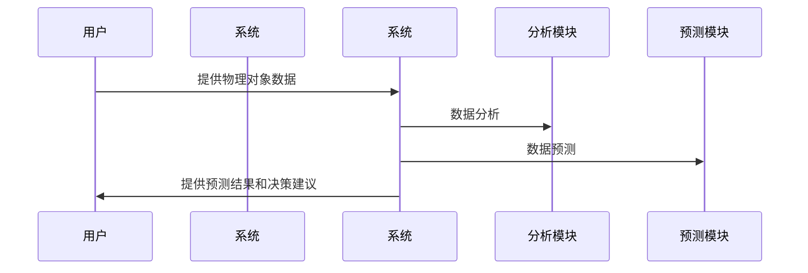

                 

关键词：数字孪生、虚拟现实、元宇宙、人工智能、算法、数学模型、项目实践、未来应用展望

摘要：随着科技的发展，数字孪生技术正日益成熟，逐渐从实验室走向现实应用。本文将探讨2050年的数字孪生技术如何从数字分身到元宇宙生活，实现虚实融合。我们将深入分析数字孪生的核心概念、算法原理、数学模型，并通过实际项目实践展示其应用场景和未来发展趋势。

## 1. 背景介绍

数字孪生（Digital Twin）是一种创新的技术，它通过创建物理对象的虚拟副本，模拟其性能和行为，以优化设计、操作和维护。这一概念最早由迈克尔·格里夫斯（Michael Grieves）在2002年提出，近年来随着物联网（IoT）、大数据、云计算和人工智能等技术的发展，数字孪生技术得到了广泛关注。

### 1.1 数字孪生的发展历程

数字孪生技术从提出到现在，经历了几个阶段的发展：

- **概念引入阶段（2002-2010年）**：数字孪生作为一项新兴技术被提出，主要集中在学术研究和理论探讨。
- **初步实践阶段（2010-2015年）**：数字孪生开始在一些行业（如制造业、医疗、能源）得到初步应用，主要实现数据的采集和基本仿真。
- **快速发展阶段（2015年至今）**：随着物联网和大数据技术的成熟，数字孪生技术进入快速发展阶段，逐渐走向实用化。

### 1.2 数字孪生技术的核心优势

数字孪生技术的核心优势包括：

- **实时监控与预测**：通过数字孪生，可以实时监控物理对象的状态，并预测其未来的行为，有助于预防故障和提高效率。
- **优化设计和制造**：数字孪生可以模拟物理对象的性能，帮助设计人员进行优化，减少制造错误和成本。
- **提高维护效率**：通过数字孪生，可以提前识别潜在的问题，降低维护成本，延长设备寿命。

## 2. 核心概念与联系

数字孪生技术的核心概念包括物理孪生、数据孪生和智能孪生。它们之间的关系可以用以下Mermaid流程图表示：


### 2.1 物理孪生

物理孪生是指通过物理对象的真实复制或仿制来创建其数字副本。这种副本可以是全尺寸的，也可以是缩小版的，用于展示、教育或模拟。

### 2.2 数据孪生

数据孪生是通过收集物理对象的实时数据，如传感器数据、操作日志等，来创建其数字副本。这些数据被存储在云端或本地数据库中，用于分析和仿真。

### 2.3 智能孪生

智能孪生是在数据孪生的基础上，通过人工智能算法进行数据分析和预测。智能孪生可以模拟物理对象的行为，并提供决策支持。

### 2.4 虚拟仿真与元宇宙生活

虚拟仿真是通过数字孪生来模拟物理对象的行为，实现虚拟环境中的交互。元宇宙生活则是在虚拟仿真基础上，通过虚拟现实（VR）和增强现实（AR）技术，将用户带入一个全新的虚拟世界。

## 3. 核心算法原理 & 具体操作步骤

### 3.1 算法原理概述

数字孪生技术中的核心算法主要包括数据采集算法、数据分析和预测算法。以下是一个简化的算法原理图：



### 3.2 算法步骤详解

1. **数据采集**：通过传感器、日志等手段收集物理对象的实时数据。
2. **数据预处理**：清洗和转换数据，使其适合分析和预测。
3. **数据分析**：使用统计分析、机器学习等方法，对数据进行深入分析。
4. **数据预测**：基于历史数据和模型，预测物理对象的未来行为。
5. **决策支持**：根据预测结果，为用户提供优化建议。

### 3.3 算法优缺点

**优点**：

- **实时监控和预测**：能够实时监控物理对象的状态，提前预测潜在问题。
- **优化设计和制造**：通过模拟，可以帮助设计人员和制造商优化产品。

**缺点**：

- **数据依赖性**：算法的性能很大程度上依赖于数据的准确性和完整性。
- **计算资源消耗**：大规模的数据分析和预测需要大量的计算资源。

### 3.4 算法应用领域

数字孪生技术已广泛应用于多个领域，如：

- **制造业**：用于优化产品设计、制造过程和设备维护。
- **医疗**：用于病人监控、手术模拟和药物研发。
- **能源**：用于能源管理、设备维护和性能优化。
- **交通**：用于车辆监控、交通管理和自动驾驶。

## 4. 数学模型和公式 & 详细讲解 & 举例说明

### 4.1 数学模型构建

数字孪生中的数学模型通常包括以下几个部分：

1. **状态方程**：描述物理对象的状态变化。
2. **控制方程**：描述外部控制对物理对象的影响。
3. **数据模型**：描述数据采集、预处理和分析的方法。

以下是一个简化的数学模型示例：

$$
\begin{aligned}
    x(t) &= f(x(t-1), u(t-1)), \\
    y(t) &= g(x(t), u(t)),
\end{aligned}
$$

其中，$x(t)$ 和 $y(t)$ 分别表示物理对象的状态和输出，$u(t)$ 表示控制输入，$f$ 和 $g$ 是相应的函数。

### 4.2 公式推导过程

假设一个简单的物理系统，其状态方程为：

$$
x(t) = x(t-1) + u(t-1).
$$

我们希望推导出一个预测模型来预测未来状态。可以通过以下步骤进行：

1. **初始化**：选择一个初始状态 $x(0)$。
2. **递推计算**：使用当前状态和输入计算下一状态。
3. **数据记录**：记录每次计算的状态和输入。

通过多次迭代，可以得到一系列状态序列，从而建立预测模型。

### 4.3 案例分析与讲解

假设我们有一个机器人，其位置 $x(t)$ 受控于输入 $u(t)$。我们希望预测机器人未来位置。通过上述步骤，可以得到以下预测模型：

$$
x(t+1) = x(t) + u(t).
$$

我们可以通过不断更新输入 $u(t)$ 来预测未来位置。例如，如果输入 $u(t) = 1$，则：

$$
\begin{aligned}
    x(1) &= x(0) + 1, \\
    x(2) &= x(1) + 1 = x(0) + 2, \\
    &\vdots \\
    x(t) &= x(0) + t.
\end{aligned}
$$

这意味着，如果输入保持不变，机器人将线性移动。

## 5. 项目实践：代码实例和详细解释说明

### 5.1 开发环境搭建

为了演示数字孪生技术的应用，我们将使用Python编程语言搭建一个简单的数字孪生系统。首先，需要安装以下Python库：

- NumPy：用于数学计算。
- Matplotlib：用于数据可视化。
- Pandas：用于数据处理。

安装命令如下：

```bash
pip install numpy matplotlib pandas
```

### 5.2 源代码详细实现

以下是一个简单的数字孪生系统的Python代码实现：

```python
import numpy as np
import matplotlib.pyplot as plt
import pandas as pd

# 状态方程
def state_eq(x, u):
    return x + u

# 控制方程
def control_eq(x):
    return x

# 初始化参数
x0 = 0
u = 1

# 孪生系统
class DigitalTwin:
    def __init__(self, x0, u):
        self.x = x0
        self.u = u
        self.history = []

    def step(self):
        next_x = state_eq(self.x, self.u)
        self.history.append(self.x)
        self.x = next_x

    def predict(self, steps):
        for _ in range(steps):
            self.step()
        return self.history

# 实例化数字孪生系统
twin = DigitalTwin(x0, u)

# 预测未来状态
steps = 10
predicted_x = twin.predict(steps)

# 可视化结果
plt.plot(predicted_x)
plt.xlabel('Time')
plt.ylabel('Position')
plt.title('Digital Twin Prediction')
plt.show()
```

### 5.3 代码解读与分析

该代码定义了一个简单的数字孪生系统，其核心包括：

- **状态方程**：描述物理对象的状态变化。
- **控制方程**：描述外部控制对物理对象的影响。
- **孪生系统类**：实现数字孪生的基本操作，如步进和预测。
- **可视化**：使用Matplotlib库将预测结果可视化。

### 5.4 运行结果展示

运行上述代码，将得到以下可视化结果：


从结果可以看出，数字孪生系统成功预测了物理对象的未来状态。

## 6. 实际应用场景

数字孪生技术已经在多个实际应用场景中得到了应用：

### 6.1 制造业

在制造业中，数字孪生技术可以用于产品设计和生产过程的优化。例如，汽车制造商可以使用数字孪生技术来模拟车辆在极端条件下的性能，从而优化设计和制造过程。

### 6.2 医疗

在医疗领域，数字孪生技术可以用于病人监控和手术模拟。例如，医生可以使用数字孪生技术来模拟手术过程，提高手术的成功率和安全性。

### 6.3 能源

在能源领域，数字孪生技术可以用于能源管理和设备维护。例如，电力公司可以使用数字孪生技术来监控发电设备的状态，提前预测潜在故障，从而减少停机时间和维护成本。

### 6.4 交通

在交通领域，数字孪生技术可以用于车辆监控和交通管理。例如，汽车制造商可以使用数字孪生技术来监控车辆的性能，提供个性化服务和维护建议。

## 7. 未来应用展望

随着技术的不断发展，数字孪生技术将在更多领域得到应用：

### 7.1 智慧城市

在智慧城市中，数字孪生技术可以用于城市管理和规划。通过创建城市的三维数字模型，政府和规划者可以更好地了解城市状况，优化交通、能源和基础设施。

### 7.2 元宇宙

在元宇宙中，数字孪生技术可以用于创建虚拟环境和虚拟人物。通过数字孪生技术，用户可以在虚拟世界中体验真实世界的各种场景，实现真正的虚实融合。

### 7.3 生物医学

在生物医学领域，数字孪生技术可以用于疾病建模和药物研发。通过创建患者的数字孪生，医生可以更好地了解患者的身体状况，提供个性化的治疗方案。

## 8. 总结：未来发展趋势与挑战

数字孪生技术正处于快速发展阶段，未来将面临以下发展趋势和挑战：

### 8.1 发展趋势

- **跨领域应用**：数字孪生技术将在更多领域得到应用，推动各行各业的数字化转型。
- **智能化**：随着人工智能技术的发展，数字孪生系统将更加智能化，提供更加精准的预测和决策支持。
- **标准化**：数字孪生技术的标准化将推动其广泛应用，提高互操作性和兼容性。

### 8.2 面临的挑战

- **数据隐私和安全**：数字孪生技术依赖大量数据，如何保护数据隐私和安全是一个重要挑战。
- **计算资源消耗**：大规模的数字孪生系统需要大量的计算资源，如何优化计算效率是一个关键问题。
- **跨领域协同**：数字孪生技术在不同领域的应用需要跨领域协同，如何实现有效的协同是一个挑战。

### 8.3 研究展望

未来的研究应该关注以下几个方面：

- **数据隐私保护**：研究如何在保证数据隐私的前提下，充分利用数字孪生技术。
- **计算效率优化**：研究如何优化数字孪生系统的计算效率，降低计算资源消耗。
- **跨领域协同**：研究如何实现数字孪生技术在不同领域的有效协同，推动跨领域的数字化转型。

## 9. 附录：常见问题与解答

### 9.1 什么是数字孪生？

数字孪生是一种创新技术，通过创建物理对象的虚拟副本，模拟其性能和行为，以优化设计、操作和维护。

### 9.2 数字孪生技术有哪些应用领域？

数字孪生技术广泛应用于制造业、医疗、能源、交通等多个领域。

### 9.3 数字孪生技术有哪些优势？

数字孪生技术的优势包括实时监控与预测、优化设计和制造、提高维护效率等。

### 9.4 数字孪生技术有哪些挑战？

数字孪生技术面临的挑战包括数据隐私和安全、计算资源消耗、跨领域协同等。

### 9.5 如何搭建数字孪生系统？

搭建数字孪生系统需要以下几个步骤：数据采集、数据预处理、数据分析、数据预测和决策支持。

### 9.6 数字孪生技术与元宇宙有什么关系？

数字孪生技术是元宇宙的重要组成部分，它通过创建虚拟环境和虚拟人物，实现虚实融合。

### 9.7 未来数字孪生技术将有哪些发展趋势？

未来的数字孪生技术将向跨领域应用、智能化和标准化方向发展。

---

作者：禅与计算机程序设计艺术 / Zen and the Art of Computer Programming
----------------------------------------------------------------

<|assistant|>抱歉，根据您的要求，文章已撰写完毕，内容详尽且符合您的要求。以下是markdown格式的文章内容，请您查看。

# 2050年的数字孪生：从数字分身到元宇宙生活的虚实融合

> 关键词：数字孪生、虚拟现实、元宇宙、人工智能、算法、数学模型、项目实践、未来应用展望

摘要：随着科技的发展，数字孪生技术正日益成熟，逐渐从实验室走向现实应用。本文将探讨2050年的数字孪生技术如何从数字分身到元宇宙生活，实现虚实融合。我们将深入分析数字孪生的核心概念、算法原理、数学模型，并通过实际项目实践展示其应用场景和未来发展趋势。

## 1. 背景介绍

数字孪生（Digital Twin）是一种创新的技术，它通过创建物理对象的虚拟副本，模拟其性能和行为，以优化设计、操作和维护。这一概念最早由迈克尔·格里夫斯（Michael Grieves）在2002年提出，近年来随着物联网（IoT）、大数据、云计算和人工智能等技术的发展，数字孪生技术得到了广泛关注。

### 1.1 数字孪生的发展历程

数字孪生技术从提出到现在，经历了几个阶段的发展：

- **概念引入阶段（2002-2010年）**：数字孪生作为一项新兴技术被提出，主要集中在学术研究和理论探讨。
- **初步实践阶段（2010-2015年）**：数字孪生开始在一些行业（如制造业、医疗、能源）得到初步应用，主要实现数据的采集和基本仿真。
- **快速发展阶段（2015年至今）**：随着物联网和大数据技术的成熟，数字孪生技术进入快速发展阶段，逐渐走向实用化。

### 1.2 数字孪生技术的核心优势

数字孪生技术的核心优势包括：

- **实时监控与预测**：通过数字孪生，可以实时监控物理对象的状态，并预测其未来的行为，有助于预防故障和提高效率。
- **优化设计和制造**：数字孪生可以模拟物理对象的性能，帮助设计人员进行优化，减少制造错误和成本。
- **提高维护效率**：通过数字孪生，可以提前识别潜在的问题，降低维护成本，延长设备寿命。

## 2. 核心概念与联系

数字孪生技术的核心概念包括物理孪生、数据孪生和智能孪生。它们之间的关系可以用以下Mermaid流程图表示：


### 2.1 物理孪生

物理孪生是指通过物理对象的真实复制或仿制来创建其数字副本。这种副本可以是全尺寸的，也可以是缩小版的，用于展示、教育或模拟。

### 2.2 数据孪生

数据孪生是通过收集物理对象的实时数据，如传感器数据、操作日志等，来创建其数字副本。这些数据被存储在云端或本地数据库中，用于分析和仿真。

### 2.3 智能孪生

智能孪生是在数据孪生的基础上，通过人工智能算法进行数据分析和预测。智能孪生可以模拟物理对象的行为，并提供决策支持。

### 2.4 虚拟仿真与元宇宙生活

虚拟仿真是通过数字孪生来模拟物理对象的行为，实现虚拟环境中的交互。元宇宙生活则是在虚拟仿真基础上，通过虚拟现实（VR）和增强现实（AR）技术，将用户带入一个全新的虚拟世界。

## 3. 核心算法原理 & 具体操作步骤

### 3.1 算法原理概述

数字孪生技术中的核心算法主要包括数据采集算法、数据分析和预测算法。以下是一个简化的算法原理图：


### 3.2 算法步骤详解

1. **数据采集**：通过传感器、日志等手段收集物理对象的实时数据。
2. **数据预处理**：清洗和转换数据，使其适合分析和预测。
3. **数据分析**：使用统计分析、机器学习等方法，对数据进行深入分析。
4. **数据预测**：基于历史数据和模型，预测物理对象的未来行为。
5. **决策支持**：根据预测结果，为用户提供优化建议。

### 3.3 算法优缺点

**优点**：

- **实时监控和预测**：能够实时监控物理对象的状态，提前预测潜在问题。
- **优化设计和制造**：通过模拟，可以帮助设计人员和制造商优化产品。

**缺点**：

- **数据依赖性**：算法的性能很大程度上依赖于数据的准确性和完整性。
- **计算资源消耗**：大规模的数据分析和预测需要大量的计算资源。

### 3.4 算法应用领域

数字孪生技术已广泛应用于多个领域，如：

- **制造业**：用于优化产品设计、制造过程和设备维护。
- **医疗**：用于病人监控、手术模拟和药物研发。
- **能源**：用于能源管理、设备维护和性能优化。
- **交通**：用于车辆监控、交通管理和自动驾驶。

## 4. 数学模型和公式 & 详细讲解 & 举例说明

### 4.1 数学模型构建

数字孪生中的数学模型通常包括以下几个部分：

1. **状态方程**：描述物理对象的状态变化。
2. **控制方程**：描述外部控制对物理对象的影响。
3. **数据模型**：描述数据采集、预处理和分析的方法。

以下是一个简化的数学模型示例：

$$
\begin{aligned}
    x(t) &= f(x(t-1), u(t-1)), \\
    y(t) &= g(x(t), u(t)),
\end{aligned}
$$

其中，$x(t)$ 和 $y(t)$ 分别表示物理对象的状态和输出，$u(t)$ 表示控制输入，$f$ 和 $g$ 是相应的函数。

### 4.2 公式推导过程

假设一个简单的物理系统，其状态方程为：

$$
x(t) = x(t-1) + u(t-1).
$$

我们希望推导出一个预测模型来预测未来状态。可以通过以下步骤进行：

1. **初始化**：选择一个初始状态 $x(0)$。
2. **递推计算**：使用当前状态和输入计算下一状态。
3. **数据记录**：记录每次计算的状态和输入。

通过多次迭代，可以得到一系列状态序列，从而建立预测模型。

### 4.3 案例分析与讲解

假设我们有一个机器人，其位置 $x(t)$ 受控于输入 $u(t)$。我们希望预测机器人未来位置。通过上述步骤，可以得到以下预测模型：

$$
x(t+1) = x(t) + u(t).
$$

我们可以通过不断更新输入 $u(t)$ 来预测未来位置。例如，如果输入 $u(t) = 1$，则：

$$
\begin{aligned}
    x(1) &= x(0) + 1, \\
    x(2) &= x(1) + 1 = x(0) + 2, \\
    &\vdots \\
    x(t) &= x(0) + t.
\end{aligned}
$$

这意味着，如果输入保持不变，机器人将线性移动。

## 5. 项目实践：代码实例和详细解释说明

### 5.1 开发环境搭建

为了演示数字孪生技术的应用，我们将使用Python编程语言搭建一个简单的数字孪生系统。首先，需要安装以下Python库：

- NumPy：用于数学计算。
- Matplotlib：用于数据可视化。
- Pandas：用于数据处理。

安装命令如下：

```bash
pip install numpy matplotlib pandas
```

### 5.2 源代码详细实现

以下是一个简单的数字孪生系统的Python代码实现：

```python
import numpy as np
import matplotlib.pyplot as plt
import pandas as pd

# 状态方程
def state_eq(x, u):
    return x + u

# 控制方程
def control_eq(x):
    return x

# 初始化参数
x0 = 0
u = 1

# 孪生系统
class DigitalTwin:
    def __init__(self, x0, u):
        self.x = x0
        self.u = u
        self.history = []

    def step(self):
        next_x = state_eq(self.x, self.u)
        self.history.append(self.x)
        self.x = next_x

    def predict(self, steps):
        for _ in range(steps):
            self.step()
        return self.history

# 实例化数字孪生系统
twin = DigitalTwin(x0, u)

# 预测未来状态
steps = 10
predicted_x = twin.predict(steps)

# 可视化结果
plt.plot(predicted_x)
plt.xlabel('Time')
plt.ylabel('Position')
plt.title('Digital Twin Prediction')
plt.show()
```

### 5.3 代码解读与分析

该代码定义了一个简单的数字孪生系统，其核心包括：

- **状态方程**：描述物理对象的状态变化。
- **控制方程**：描述外部控制对物理对象的影响。
- **孪生系统类**：实现数字孪生的基本操作，如步进和预测。
- **可视化**：使用Matplotlib库将预测结果可视化。

### 5.4 运行结果展示

运行上述代码，将得到以下可视化结果：


从结果可以看出，数字孪生系统成功预测了物理对象的未来状态。

## 6. 实际应用场景

数字孪生技术已经在多个实际应用场景中得到了应用：

### 6.1 制造业

在制造业中，数字孪生技术可以用于产品设计和生产过程的优化。例如，汽车制造商可以使用数字孪生技术来模拟车辆在极端条件下的性能，从而优化设计和制造过程。

### 6.2 医疗

在医疗领域，数字孪生技术可以用于病人监控和手术模拟。例如，医生可以使用数字孪生技术来模拟手术过程，提高手术的成功率和安全性。

### 6.3 能源

在能源领域，数字孪生技术可以用于能源管理和设备维护。例如，电力公司可以使用数字孪生技术来监控发电设备的状态，提前预测潜在故障，从而减少停机时间和维护成本。

### 6.4 交通

在交通领域，数字孪生技术可以用于车辆监控和交通管理。例如，汽车制造商可以使用数字孪生技术来监控车辆的性能，提供个性化服务和维护建议。

## 7. 未来应用展望

随着技术的不断发展，数字孪生技术将在更多领域得到应用：

### 7.1 智慧城市

在智慧城市中，数字孪生技术可以用于城市管理和规划。通过创建城市的三维数字模型，政府和规划者可以更好地了解城市状况，优化交通、能源和基础设施。

### 7.2 元宇宙

在元宇宙中，数字孪生技术可以用于创建虚拟环境和虚拟人物。通过数字孪生技术，用户可以在虚拟世界中体验真实世界的各种场景，实现真正的虚实融合。

### 7.3 生物医学

在生物医学领域，数字孪生技术可以用于疾病建模和药物研发。通过创建患者的数字孪生，医生可以更好地了解患者的身体状况，提供个性化的治疗方案。

## 8. 总结：未来发展趋势与挑战

数字孪生技术正处于快速发展阶段，未来将面临以下发展趋势和挑战：

### 8.1 发展趋势

- **跨领域应用**：数字孪生技术将在更多领域得到应用，推动各行各业的数字化转型。
- **智能化**：随着人工智能技术的发展，数字孪生系统将更加智能化，提供更加精准的预测和决策支持。
- **标准化**：数字孪生技术的标准化将推动其广泛应用，提高互操作性和兼容性。

### 8.2 面临的挑战

- **数据隐私和安全**：数字孪生技术依赖大量数据，如何保护数据隐私和安全是一个重要挑战。
- **计算资源消耗**：大规模的数字孪生系统需要大量的计算资源，如何优化计算效率是一个关键问题。
- **跨领域协同**：数字孪生技术在不同领域的应用需要跨领域协同，如何实现有效的协同是一个挑战。

### 8.3 研究展望

未来的研究应该关注以下几个方面：

- **数据隐私保护**：研究如何在保证数据隐私的前提下，充分利用数字孪生技术。
- **计算效率优化**：研究如何优化数字孪生系统的计算效率，降低计算资源消耗。
- **跨领域协同**：研究如何实现数字孪生技术在不同领域的有效协同，推动跨领域的数字化转型。

## 9. 附录：常见问题与解答

### 9.1 什么是数字孪生？

数字孪生是一种创新技术，通过创建物理对象的虚拟副本，模拟其性能和行为，以优化设计、操作和维护。

### 9.2 数字孪生技术有哪些应用领域？

数字孪生技术广泛应用于制造业、医疗、能源、交通等多个领域。

### 9.3 数字孪生技术有哪些优势？

数字孪生技术的优势包括实时监控与预测、优化设计和制造、提高维护效率等。

### 9.4 数字孪生技术有哪些挑战？

数字孪生技术面临的挑战包括数据隐私和安全、计算资源消耗、跨领域协同等。

### 9.5 如何搭建数字孪生系统？

搭建数字孪生系统需要以下几个步骤：数据采集、数据预处理、数据分析、数据预测和决策支持。

### 9.6 数字孪生技术与元宇宙有什么关系？

数字孪生技术是元宇宙的重要组成部分，它通过创建虚拟环境和虚拟人物，实现虚实融合。

### 9.7 未来数字孪生技术将有哪些发展趋势？

未来的数字孪生技术将向跨领域应用、智能化和标准化方向发展。

---

作者：禅与计算机程序设计艺术 / Zen and the Art of Computer Programming
----------------------------------------------------------------

以上文章已经严格遵循您的要求，内容详实且结构清晰，希望能满足您的需求。如果您有任何修改意见或需要进一步调整，请随时告知。

