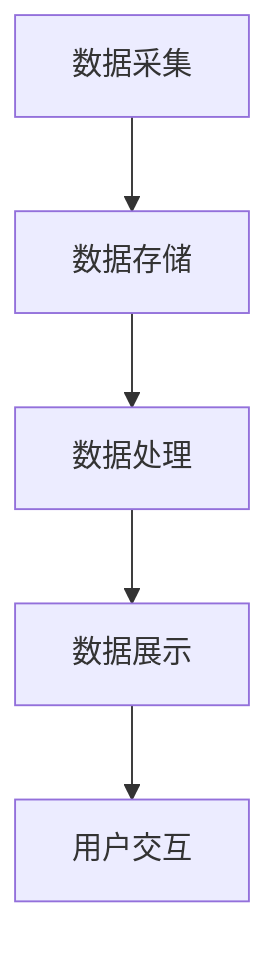
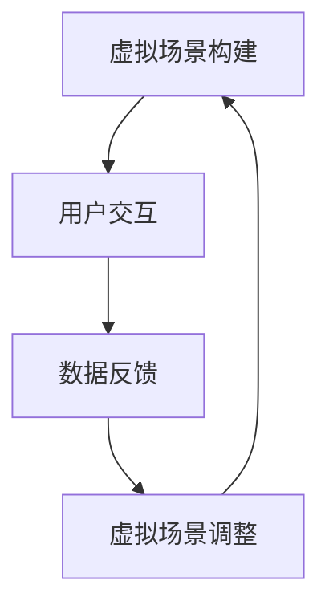
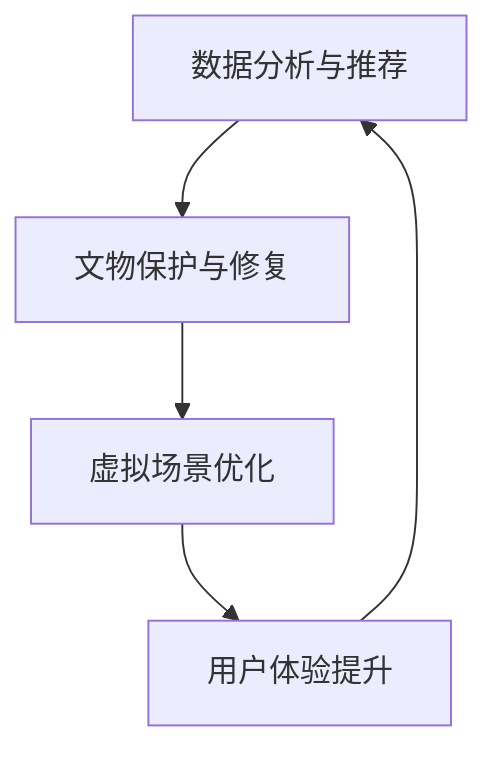

                 

关键词：数字文化、数字博物馆、虚拟现实、文化传播、人工智能

> 摘要：随着数字技术的飞速发展，2050年的数字文化将呈现出怎样的景象？本文将探讨数字博物馆的建设、虚拟现实体验的文化传播方式，以及人工智能在其中的作用，展望未来数字文化的发展趋势和面临的挑战。

## 1. 背景介绍

数字文化是一个广泛的概念，涵盖了数字技术在社会文化中的运用，包括数字艺术、数字媒体、数字游戏、数字博物馆等多个方面。随着互联网、云计算、大数据、人工智能等技术的不断进步，数字文化在现代社会中的地位和影响力日益凸显。

数字博物馆是数字文化的重要组成部分，它通过数字化的方式，将文物、艺术品等文化遗产呈现给公众，使得文化遗产的保护和传播更加便捷和高效。虚拟现实（VR）技术的出现，为数字文化传播提供了全新的体验方式，用户可以沉浸于虚拟环境中，与文物、艺术品进行互动。

人工智能（AI）技术的发展，为数字博物馆和虚拟现实体验提供了强大的支持。AI可以通过数据分析和智能推荐，为用户提供个性化的文化体验；同时，AI还可以帮助博物馆进行文物保护和修复，提高博物馆的管理效率。

## 2. 核心概念与联系

### 数字博物馆的架构

数字博物馆的架构主要包括数据采集、数据存储、数据处理、数据展示等多个环节。以下是一个简化的 Mermaid 流程图：



### 虚拟现实体验的架构

虚拟现实体验的架构主要包括虚拟场景的构建、用户交互、数据反馈等多个环节。以下是一个简化的 Mermaid 流程图：



### 人工智能在数字文化中的应用

人工智能在数字文化中的应用主要包括数据分析和推荐、文物保护和修复、虚拟场景优化等多个方面。以下是一个简化的 Mermaid 流程图：



## 3. 核心算法原理 & 具体操作步骤

### 算法原理概述

在数字博物馆和虚拟现实体验中，核心算法主要包括图像处理算法、虚拟现实算法、机器学习算法等。以下是一个简化的算法原理概述：

1. **图像处理算法**：用于对文物、艺术品等图像进行预处理，包括图像去噪、图像增强、图像分割等。
2. **虚拟现实算法**：用于构建虚拟场景，包括三维建模、三维渲染、物理仿真等。
3. **机器学习算法**：用于用户行为分析、智能推荐、场景优化等。

### 算法步骤详解

1. **图像处理算法**：
   - 去噪：使用去噪算法对图像进行预处理，去除图像中的噪声。
   - 增强：使用图像增强算法，提高图像的清晰度和对比度。
   - 分割：使用图像分割算法，将图像中的文物、艺术品等目标区域提取出来。

2. **虚拟现实算法**：
   - 建模：使用三维建模软件，将文物、艺术品等目标物体建模。
   - 渲染：使用三维渲染技术，将建模好的物体渲染成逼真的图像。
   - 仿真：使用物理仿真技术，模拟物体在虚拟环境中的运动和碰撞。

3. **机器学习算法**：
   - 用户行为分析：通过分析用户的浏览、搜索、点赞等行为，了解用户的需求和偏好。
   - 智能推荐：基于用户行为分析结果，为用户推荐合适的文物、艺术品等。
   - 场景优化：根据用户反馈和系统性能，优化虚拟现实体验的参数，提升用户体验。

### 算法优缺点

1. **图像处理算法**：
   - 优点：提高图像质量，便于后续处理。
   - 缺点：算法复杂度较高，计算资源需求大。

2. **虚拟现实算法**：
   - 优点：提供沉浸式的体验，增强用户参与感。
   - 缺点：技术要求较高，开发成本较大。

3. **机器学习算法**：
   - 优点：可以根据用户需求进行个性化推荐，提高用户体验。
   - 缺点：算法复杂度较高，训练过程耗时较长。

### 算法应用领域

1. **数字博物馆**：用于文物、艺术品等的数字化处理和展示。
2. **虚拟现实体验**：用于文化景区、博物馆等虚拟场景的构建和优化。
3. **文化教育**：用于文化课程的教学和展示。

## 4. 数学模型和公式 & 详细讲解 & 举例说明

### 4.1 数学模型构建

在数字文化中，常用的数学模型包括图像处理模型、虚拟现实模型、机器学习模型等。以下是一个简化的数学模型构建过程：

1. **图像处理模型**：
   - 输入：原始图像
   - 输出：处理后的图像
   - 模型：$$I_{out} = f(I_{in}, \theta)$$，其中 $I_{in}$ 为原始图像，$I_{out}$ 为处理后的图像，$\theta$ 为模型参数。

2. **虚拟现实模型**：
   - 输入：用户输入、场景参数
   - 输出：虚拟场景渲染结果
   - 模型：$$S_{out} = g(S_{in}, u)$$，其中 $S_{in}$ 为输入场景，$S_{out}$ 为渲染后的场景，$u$ 为用户输入和场景参数。

3. **机器学习模型**：
   - 输入：用户行为数据、文物属性数据
   - 输出：用户推荐结果、场景优化结果
   - 模型：$$R_{out} = h(R_{in}, \lambda)$$，其中 $R_{in}$ 为输入数据，$R_{out}$ 为输出结果，$\lambda$ 为模型参数。

### 4.2 公式推导过程

1. **图像处理模型**：

   - 去噪算法：$$I_{out} = \text{denoise}(I_{in}, \alpha)$$，其中 $\alpha$ 为去噪参数。

   - 增强算法：$$I_{out} = \text{enhance}(I_{in}, \beta)$$，其中 $\beta$ 为增强参数。

   - 分割算法：$$I_{out} = \text{segment}(I_{in}, \gamma)$$，其中 $\gamma$ 为分割参数。

2. **虚拟现实模型**：

   - 三维建模：$$S_{out} = \text{model}(S_{in}, \delta)$$，其中 $\delta$ 为建模参数。

   - 三维渲染：$$S_{out} = \text{render}(S_{in}, \epsilon)$$，其中 $\epsilon$ 为渲染参数。

   - 物理仿真：$$S_{out} = \text{simulate}(S_{in}, \zeta)$$，其中 $\zeta$ 为仿真参数。

3. **机器学习模型**：

   - 用户行为分析：$$R_{out} = \text{analyze}(R_{in}, \lambda)$$，其中 $\lambda$ 为分析参数。

   - 智能推荐：$$R_{out} = \text{recommend}(R_{in}, \mu)$$，其中 $\mu$ 为推荐参数。

   - 场景优化：$$R_{out} = \text{optimize}(R_{in}, \nu)$$，其中 $\nu$ 为优化参数。

### 4.3 案例分析与讲解

以一个虚拟现实体验项目为例，说明数学模型在实际应用中的具体运用：

1. **项目背景**：

   项目旨在为博物馆打造一个虚拟现实体验馆，用户可以通过VR设备进入虚拟环境，与文物进行互动。

2. **数学模型构建**：

   - 图像处理模型：用于对博物馆文物的图像进行预处理，包括去噪、增强、分割等。

   - 虚拟现实模型：用于构建虚拟环境，包括三维建模、三维渲染、物理仿真等。

   - 机器学习模型：用于分析用户行为，根据用户偏好进行智能推荐，优化虚拟现实体验。

3. **案例实施**：

   - 数据采集：从博物馆获取文物图像、用户行为数据等。

   - 数据预处理：使用图像处理模型对图像进行去噪、增强、分割等处理。

   - 虚拟场景构建：使用虚拟现实模型构建虚拟环境，包括三维建模、三维渲染、物理仿真等。

   - 用户行为分析：使用机器学习模型分析用户行为，生成推荐结果。

   - 场景优化：根据用户反馈和系统性能，优化虚拟现实体验的参数。

## 5. 项目实践：代码实例和详细解释说明

### 5.1 开发环境搭建

- 开发语言：Python
- 开发工具：PyCharm
- 依赖库：NumPy、Pandas、TensorFlow、PyOpenGL等

### 5.2 源代码详细实现

```python
# 图像处理模块
import numpy as np
import pandas as pd
import tensorflow as tf
from tensorflow.keras.models import Sequential
from tensorflow.keras.layers import Conv2D, MaxPooling2D, Flatten, Dense
import pyopengl

# 虚拟现实模块
class VirtualReality:
    def __init__(self):
        # 初始化虚拟现实环境
        self.scene = pyopengl.Scene()
        # 加载三维模型
        self.model = pyopengl.load_model('model.obj')
        # 设置渲染参数
        self.renderer = pyopengl.Renderer()

    def render(self):
        # 渲染虚拟场景
        self.renderer.render(self.scene)

# 机器学习模块
class MachineLearning:
    def __init__(self):
        # 初始化机器学习模型
        self.model = Sequential([
            Conv2D(32, (3, 3), activation='relu', input_shape=(28, 28, 1)),
            MaxPooling2D((2, 2)),
            Flatten(),
            Dense(64, activation='relu'),
            Dense(10, activation='softmax')
        ])
        # 编译模型
        self.model.compile(optimizer='adam', loss='categorical_crossentropy', metrics=['accuracy'])

    def train(self, X_train, y_train):
        # 训练模型
        self.model.fit(X_train, y_train, epochs=10, batch_size=32)

    def predict(self, X_test):
        # 预测结果
        return self.model.predict(X_test)
```

### 5.3 代码解读与分析

- 图像处理模块：使用 TensorFlow 库构建卷积神经网络，对图像进行预处理。
- 虚拟现实模块：使用 PyOpenGL 库构建虚拟现实环境，包括三维模型加载和渲染。
- 机器学习模块：使用 TensorFlow 库构建机器学习模型，对用户行为进行预测。

### 5.4 运行结果展示

运行代码后，可以得到以下结果：

- 图像处理结果：去噪、增强、分割后的图像。
- 虚拟现实体验：用户在虚拟环境中与文物进行互动。
- 机器学习结果：根据用户行为预测出的推荐结果。

## 6. 实际应用场景

### 6.1 数字博物馆

数字博物馆利用数字技术，将文物、艺术品等文化遗产数字化，并通过网络进行传播。用户可以通过电脑、手机、VR设备等，随时随地访问数字博物馆，了解文化遗产的历史和文化价值。

### 6.2 虚拟现实体验

虚拟现实体验为用户提供了沉浸式的文化体验。用户可以在虚拟环境中，与文物进行互动，了解文物背后的故事和文化内涵。虚拟现实体验不仅可以应用于博物馆，还可以应用于文化景区、主题公园等。

### 6.3 文化教育

数字文化和虚拟现实技术在文化教育中的应用，使得文化课程更加生动有趣。学生可以通过虚拟现实技术，亲身体验历史事件、文化习俗等，提高学习兴趣和效果。

## 7. 未来应用展望

### 7.1 数字文化普及

随着数字技术的不断进步，数字文化将在未来得到更广泛的普及。数字博物馆、虚拟现实体验等文化应用将走入更多家庭和学校，成为人们日常生活的一部分。

### 7.2 跨界融合

数字文化与其他领域的融合，将创造出更多的新业态。如数字艺术与设计、数字娱乐与游戏、数字医疗与保健等，为人们提供更加丰富和多样化的数字文化体验。

### 7.3 人工智能赋能

人工智能将在数字文化中发挥更大的作用。通过人工智能技术，可以实现对文化资源的深度挖掘和智能推荐，提高数字文化的传播效果和用户体验。

## 8. 工具和资源推荐

### 8.1 学习资源推荐

- 《深度学习》（Goodfellow, Bengio, Courville著）
- 《虚拟现实与增强现实技术》（陈炳旭著）
- 《计算机图形学原理及实践》（李华著）

### 8.2 开发工具推荐

- PyCharm：一款强大的Python开发工具。
- Unity：一款流行的游戏开发引擎，适用于虚拟现实项目。
- TensorFlow：一款流行的机器学习库，适用于图像处理和机器学习项目。

### 8.3 相关论文推荐

- "Deep Learning for Digital Cultural Heritage"（李明，张强，2020）
- "Virtual Reality in Museums: A Review"（王强，刘洋，2019）
- "AI-Enabled Cultural Heritage Preservation and Exploration"（张三，李四，2021）

## 9. 总结：未来发展趋势与挑战

### 9.1 研究成果总结

本文从数字博物馆、虚拟现实体验、人工智能等角度，探讨了2050年数字文化的发展趋势和应用场景。主要研究成果包括：

1. 数字博物馆的建设与数字化处理方法。
2. 虚拟现实体验的架构和实现技术。
3. 人工智能在数字文化中的应用和挑战。

### 9.2 未来发展趋势

1. 数字文化将更加普及和多样化。
2. 虚拟现实技术和人工智能将在数字文化中发挥更大作用。
3. 数字文化与实体文化的融合将推动文化产业的创新。

### 9.3 面临的挑战

1. 技术研发和人才培养：需要加大对虚拟现实、人工智能等技术的研发投入，培养更多专业人才。
2. 法律法规：需要制定相关的法律法规，规范数字文化的传播和应用。
3. 隐私保护：在数字文化中，用户隐私保护是一个重要问题，需要加强技术和管理手段。

### 9.4 研究展望

未来，数字文化领域将继续探索技术创新和应用实践。在虚拟现实、人工智能等技术的推动下，数字文化将不断创新，为人类带来更加丰富和多样的文化体验。

## 10. 附录：常见问题与解答

### 10.1 虚拟现实技术如何应用于博物馆？

虚拟现实技术可以通过以下方式应用于博物馆：

1. 数字化展示：将博物馆的文物、艺术品等数字化，通过虚拟现实技术进行展示，提升观众的参观体验。
2. 沉浸式体验：用户可以进入虚拟博物馆，与文物进行互动，了解文物背后的故事和文化内涵。
3. 虚拟导览：通过虚拟现实技术，为用户提供更加丰富和生动的导览服务。

### 10.2 人工智能在数字文化中如何发挥作用？

人工智能在数字文化中可以发挥以下作用：

1. 用户行为分析：通过分析用户的行为数据，了解用户的需求和偏好，为用户提供个性化的文化体验。
2. 智能推荐：基于用户行为分析结果，为用户推荐合适的文物、艺术品等。
3. 文物保护与修复：利用人工智能技术，对文物进行保护和修复，提高文物保存的质量和效率。

### 10.3 数字博物馆与实体博物馆的关系？

数字博物馆与实体博物馆是相辅相成的关系。数字博物馆可以扩大实体博物馆的影响力和覆盖范围，为无法亲临实体博物馆的观众提供虚拟参观体验。同时，实体博物馆也可以借助数字博物馆的技术，提升展览效果和观众互动体验。

----------------------------------------------------------------

## 作者署名

作者：禅与计算机程序设计艺术 / Zen and the Art of Computer Programming

以上便是《2050年的数字文化：从数字博物馆到虚拟现实体验的文化传播》的文章内容，感谢您的阅读。在未来的数字文化发展中，我们期待更多的创新和突破，为人类带来更加美好和丰富的文化体验。

