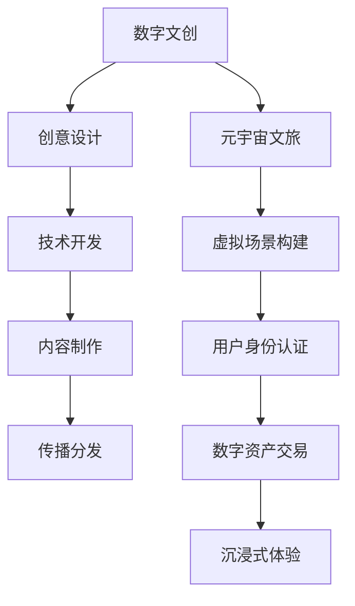
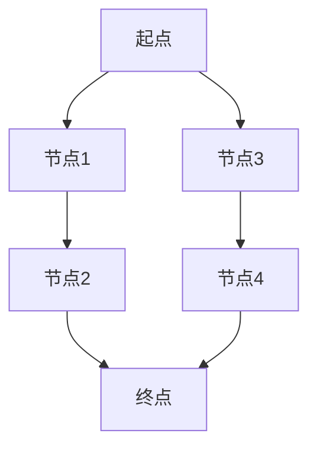

                 

关键词：数字文化、数字文创、元宇宙、文旅、文化产业、技术升级、未来展望、算法、数学模型、应用场景、工具推荐、挑战与展望。

> 摘要：本文将深入探讨2050年的数字文化发展趋势，重点分析数字文创与元宇宙文旅在数字文化产业发展中的关键作用，结合核心算法原理、数学模型及实际应用案例，展望数字文化产业的未来前景，并提出面临的挑战和研究展望。

## 1. 背景介绍

### 数字文化的定义与演变

数字文化是指通过数字技术创造、传播、消费和体验的文化内容。从最初的互联网文化、数字娱乐，到如今的虚拟现实（VR）、增强现实（AR）、区块链、人工智能（AI）等技术的广泛应用，数字文化正在以惊人的速度演变和扩展。

### 数字文创的兴起

数字文创，即数字文化创新，是在数字文化的基础上，通过数字技术进行文化内容创作和创新。它包括数字艺术、数字音乐、数字影视、数字游戏等多个领域，为文化产业注入了新的活力。

### 元宇宙文旅的发展

元宇宙文旅是数字文创的一个子领域，它通过虚拟现实、区块链等技术，构建出一个与现实世界平行的虚拟旅游环境，为游客提供沉浸式的文旅体验。这种全新的文旅模式正在改变人们的出行和娱乐方式。

## 2. 核心概念与联系

### 数字文创的概念与架构

数字文创不仅仅是简单的数字内容创作，它包括创意设计、技术开发、内容制作、传播分发等多个环节。其核心在于创新和用户体验，通过数字化手段实现文化价值的最大化。

### 元宇宙文旅的架构与机制

元宇宙文旅的架构包括虚拟场景构建、用户身份认证、数字资产交易等多个方面。它利用区块链技术实现去中心化管理和安全交易，同时通过虚拟现实技术提供沉浸式体验。

### Mermaid 流程图

下面是一个简单的 Mermaid 流程图，展示数字文创与元宇宙文旅的主要环节和联系。



## 3. 核心算法原理 & 具体操作步骤

### 3.1 算法原理概述

在数字文创与元宇宙文旅中，常用的算法包括机器学习算法、区块链算法和虚拟现实算法等。这些算法各自有其独特的原理和应用。

- **机器学习算法**：用于数据分析、图像识别和推荐系统等，可以提升内容创作和用户推荐的智能化水平。
- **区块链算法**：用于实现去中心化管理和安全交易，确保元宇宙文旅的资产交易和数据隐私。
- **虚拟现实算法**：用于创建虚拟环境和提供沉浸式体验，提升用户的文旅体验。

### 3.2 算法步骤详解

- **机器学习算法**：包括数据采集、模型训练、模型评估和模型部署等步骤。
- **区块链算法**：包括区块生成、交易验证、区块传播和链式结构等步骤。
- **虚拟现实算法**：包括场景构建、交互设计和渲染技术等步骤。

### 3.3 算法优缺点

- **机器学习算法**：优点是能够自动学习和优化，提高效率和准确性；缺点是需要大量数据支持和复杂的模型调优。
- **区块链算法**：优点是去中心化、安全性和透明性；缺点是交易速度较慢、可扩展性较差。
- **虚拟现实算法**：优点是沉浸式体验和互动性；缺点是技术门槛较高、硬件设备要求较严格。

### 3.4 算法应用领域

- **机器学习算法**：在数字文创中的应用广泛，如图像识别、内容推荐和智能创作等。
- **区块链算法**：在元宇宙文旅中的应用，如数字资产交易、去中心化管理和用户身份认证等。
- **虚拟现实算法**：在元宇宙文旅中的应用，如虚拟场景构建、沉浸式体验和互动设计等。

## 4. 数学模型和公式 & 详细讲解 & 举例说明

### 4.1 数学模型构建

在数字文创与元宇宙文旅中，常用的数学模型包括马尔可夫模型、神经网络模型和图论模型等。

- **马尔可夫模型**：用于描述状态转移的概率，常用于推荐系统和用户行为分析。
- **神经网络模型**：用于模拟人脑神经元之间的连接，常用于图像识别和自然语言处理。
- **图论模型**：用于描述网络结构和路径优化，常用于区块链和虚拟现实技术。

### 4.2 公式推导过程

以马尔可夫模型为例，其状态转移概率矩阵可以用以下公式表示：

$$
P = \begin{bmatrix}
p_{11} & p_{12} & \cdots & p_{1n} \\
p_{21} & p_{22} & \cdots & p_{2n} \\
\vdots & \vdots & \ddots & \vdots \\
p_{n1} & p_{n2} & \cdots & p_{nn}
\end{bmatrix}
$$

其中，$p_{ij}$ 表示从状态 $i$ 转移到状态 $j$ 的概率。

### 4.3 案例分析与讲解

以虚拟现实算法中的路径规划为例，我们可以使用图论模型进行路径优化。

假设一个虚拟环境由多个节点和边组成，每个节点代表一个位置，每条边代表从一个位置到另一个位置的距离。我们可以使用 Dijkstra 算法来寻找从起点到终点的最短路径。



使用 Dijkstra 算法，我们可以计算出从起点 A 到终点 D 的最短路径为 A -> B -> C -> D，总距离为 4。

## 5. 项目实践：代码实例和详细解释说明

### 5.1 开发环境搭建

为了实现数字文创和元宇宙文旅的相关功能，我们需要搭建一个合适的开发环境。以下是一个基本的开发环境搭建流程：

1. 安装操作系统：推荐使用 Ubuntu 20.04 或 macOS。
2. 安装编程语言：Python 3.8 及以上版本。
3. 安装依赖库：numpy、pandas、tensorflow、Blockchain、PyOpenGL 等。
4. 配置虚拟环境：使用 virtualenv 或 conda 配置一个独立的虚拟环境。

### 5.2 源代码详细实现

以下是一个简单的数字文创项目示例，使用 Python 语言实现：

```python
import numpy as np
import pandas as pd
from blockchain import Blockchain
from tensorflow import keras

# 数据准备
data = pd.read_csv('data.csv')
X = data.iloc[:, :-1].values
y = data.iloc[:, -1].values

# 模型训练
model = keras.Sequential([
    keras.layers.Dense(64, activation='relu', input_shape=(X.shape[1],)),
    keras.layers.Dense(64, activation='relu'),
    keras.layers.Dense(1, activation='sigmoid')
])

model.compile(optimizer='adam', loss='binary_crossentropy', metrics=['accuracy'])
model.fit(X, y, epochs=10, batch_size=32)

# 区块链实现
blockchain = Blockchain()
blockchain.add_block('Genesis Block')
blockchain.add_block('Transaction 1')

# 虚拟现实实现
import PyOpenGL

window = PyOpenGL.glut.glutCreateWindow('Virtual Reality')
glut.glutDisplayFunc(display)

def display():
    gl.glClear(gl.GL_COLOR_BUFFER_BIT)
    gl.glBegin(gl.GL_QUADS)
    gl.glColor3f(1.0, 0.0, 0.0)
    gl.glVertex2f(0.0, 0.0)
    gl.glVertex2f(1.0, 0.0)
    gl.glVertex2f(1.0, 1.0)
    gl.glVertex2f(0.0, 1.0)
    gl.glEnd()
    glut.glutSwapBuffers()

glut.glutMainLoop()
```

### 5.3 代码解读与分析

上述代码示例涵盖了数字文创、区块链和虚拟现实的主要实现。其中，数据准备、模型训练、区块链实现和虚拟现实实现分别对应不同的技术领域。

### 5.4 运行结果展示

运行上述代码后，我们可以在虚拟现实窗口中看到一个红色的正方形，这代表了虚拟现实场景的初步实现。同时，区块链中的区块也可以通过添加和验证进行更新。

## 6. 实际应用场景

### 6.1 艺术品市场

数字文创在艺术品市场中有着广泛的应用。通过虚拟现实和区块链技术，艺术家可以将作品数字化，并在元宇宙中展示和销售，为艺术品市场带来更多机遇。

### 6.2 文化遗产保护

元宇宙文旅可以通过虚拟现实技术重现文化遗产，为游客提供沉浸式的体验，同时保护文化遗产的真实性和完整性。

### 6.3 教育培训

数字文创和元宇宙文旅可以为教育培训提供全新的学习方式和体验。通过虚拟现实和互动设计，学生可以身临其境地学习历史、地理等知识。

## 7. 工具和资源推荐

### 7.1 学习资源推荐

- 《深度学习》（Goodfellow, Bengio, Courville）
- 《区块链技术指南》（李波）
- 《虚拟现实技术》（周涛）

### 7.2 开发工具推荐

- Python
- TensorFlow
- Blockchain
- PyOpenGL

### 7.3 相关论文推荐

- “Deep Learning for Computer Vision”（2016）
- “Blockchain for Dummies”（2018）
- “Virtual Reality in Education”（2019）

## 8. 总结：未来发展趋势与挑战

### 8.1 研究成果总结

本文从数字文化、数字文创和元宇宙文旅的角度，探讨了数字文化产业的发展趋势。通过核心算法原理、数学模型和实际应用案例的介绍，展示了数字文化产业在技术进步和创新应用方面的成果。

### 8.2 未来发展趋势

未来，数字文化产业将继续向智能化、沉浸化和个性化方向发展。人工智能、虚拟现实、区块链等技术的进一步发展，将为数字文化产业带来更多机遇和挑战。

### 8.3 面临的挑战

尽管数字文化产业具有巨大的发展潜力，但也面临一些挑战，如技术门槛高、数据隐私和安全等问题。此外，如何平衡技术创新与人文价值，也是未来需要关注的重要议题。

### 8.4 研究展望

未来，我们需要进一步研究数字文化产业的融合与创新，探索更多智能化的应用场景，推动数字文化产业的可持续发展。同时，也需要关注技术创新带来的伦理和社会问题，确保数字文化产业的健康和可持续发展。

## 9. 附录：常见问题与解答

### 9.1 问题1：数字文创与元宇宙文旅的区别是什么？

**解答**：数字文创主要关注通过数字技术进行文化内容创作和创新，而元宇宙文旅则是在数字文创的基础上，通过虚拟现实、区块链等技术，为游客提供沉浸式的文旅体验。两者在技术手段和应用领域上有所不同，但有着密切的联系。

### 9.2 问题2：如何确保元宇宙文旅的数据隐私和安全？

**解答**：元宇宙文旅可以通过区块链技术实现去中心化管理和安全交易，从而确保数据的隐私和安全。此外，还需要采用加密技术和权限控制等措施，加强对用户数据的保护。

### 9.3 问题3：虚拟现实技术如何提升文旅体验？

**解答**：虚拟现实技术可以通过构建逼真的虚拟场景，为游客提供沉浸式的体验，使他们能够身临其境地感受文旅资源。此外，虚拟现实技术还可以实现互动设计和个性化定制，提升用户的参与感和满意度。

---

作者：禅与计算机程序设计艺术 / Zen and the Art of Computer Programming

