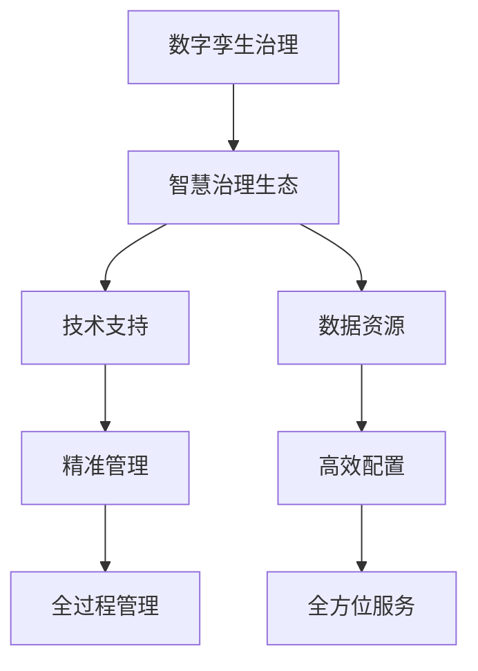

                 

关键词：数字治理、数字孪生、智慧治理、算法、数学模型、项目实践、实际应用场景、未来展望、研究展望

> 摘要：随着信息技术的飞速发展，数字治理已成为现代社会不可或缺的重要组成部分。本文探讨了从数字孪生治理到智慧治理生态的数字治理升级路径，分析了数字治理的核心算法原理、数学模型构建、实际应用场景以及未来发展趋势。文章旨在为读者提供一个全面、深入的数字治理概述，以期为相关领域的进一步研究和应用提供参考。

## 1. 背景介绍

### 1.1 数字治理的起源与发展

数字治理的概念起源于20世纪末，随着互联网和信息技术的发展，政府开始借助数字技术来提高治理效率和公共服务水平。数字治理的核心在于利用信息技术手段，实现政府、企业和公众之间的信息共享、业务协同和智能决策。

数字治理的发展可以分为三个阶段：初步探索阶段、快速发展阶段和深化应用阶段。在初步探索阶段，数字治理主要体现在政府门户网站的建设和电子政务的应用。在快速发展阶段，大数据、云计算、物联网等新一代信息技术得到广泛应用，数字治理进入了一个多元化、智能化的新阶段。在深化应用阶段，数字治理逐渐成为国家治理体系和治理能力现代化的重要支撑。

### 1.2 数字治理的重要性

数字治理对于现代社会具有重要意义。首先，它有助于提高政府治理效率。通过数字技术，政府可以实时掌握社会动态，快速响应社会需求，提高决策的科学性和准确性。其次，数字治理有助于优化公共服务。通过数字化手段，政府可以提供更加便捷、高效、个性化的服务，提升公众的满意度。此外，数字治理还可以促进社会公平。通过数字化手段，政府可以更好地监督和评估公共资源的配置和使用，减少资源浪费，实现公平正义。

### 1.3 数字治理面临的挑战

尽管数字治理具有巨大的潜力，但在实际应用中仍面临诸多挑战。首先，数据安全和隐私保护问题日益突出。在数字治理过程中，大量个人和企业信息被收集和处理，如何确保这些数据的安全和隐私成为关键问题。其次，技术发展速度过快，导致数字治理相关人才的短缺。高素质的数字治理人才对于推动数字治理的发展至关重要。此外，数字治理的法律法规体系尚不完善，需要在立法和执法方面进行进一步加强。

## 2. 核心概念与联系

### 2.1 数字孪生治理

数字孪生治理是数字治理的一种重要形式，它通过建立物理实体和数字模型的映射关系，实现对物理世界的仿真、预测和优化。数字孪生治理的核心在于构建一个与物理实体高度相似的数字模型，通过对数字模型的分析和操作，实现对物理实体的精准管理和控制。

### 2.2 智慧治理生态

智慧治理生态是数字治理的高级形态，它通过构建一个多元参与、协同合作的治理体系，实现对社会事务的智能化管理和服务。智慧治理生态强调数据共享、业务协同和智能决策，以实现政府、企业、公众和社会组织的共同利益。

### 2.3 数字孪生治理与智慧治理生态的关系

数字孪生治理是智慧治理生态的基础，为智慧治理生态提供了技术支持和数据资源。通过数字孪生治理，政府可以实现对公共资源的精准管理和高效配置，为社会事务的智能化管理提供有力支撑。智慧治理生态则是对数字孪生治理的升华，通过构建一个多元化、协同化的治理体系，实现对社会事务的全过程、全方位管理和服务。

### 2.4 Mermaid 流程图



## 3. 核心算法原理 & 具体操作步骤

### 3.1 算法原理概述

数字治理的核心算法主要包括数据挖掘、机器学习和深度学习等技术。这些算法通过对大规模数据的分析和处理，实现对信息的高效提取和利用，为决策提供科学依据。

### 3.2 算法步骤详解

#### 3.2.1 数据收集

首先，政府需要收集各类社会数据，包括人口数据、经济数据、环境数据等。这些数据可以通过政府网站、数据库、传感器等渠道获取。

#### 3.2.2 数据预处理

收集到的数据往往存在不一致、不完整、不准确等问题，因此需要进行数据清洗和预处理。数据预处理包括数据去重、数据补全、数据归一化等步骤。

#### 3.2.3 数据挖掘

通过数据挖掘算法，从预处理后的数据中提取有价值的信息。数据挖掘算法包括分类、聚类、关联规则挖掘等。

#### 3.2.4 机器学习

利用机器学习算法，对提取出的信息进行建模和预测。机器学习算法包括线性回归、决策树、支持向量机等。

#### 3.2.5 深度学习

深度学习算法是机器学习的一种高级形式，通过对大量数据进行自动特征提取和模型训练，实现对复杂问题的精确建模和预测。深度学习算法包括神经网络、卷积神经网络、循环神经网络等。

### 3.3 算法优缺点

#### 优点

- 提高决策科学性：通过数据分析和模型预测，为决策提供科学依据，减少主观因素影响。
- 提高治理效率：自动化处理大量数据，提高治理效率，降低人力成本。
- 提升公共服务水平：基于数据分析，提供个性化、智能化的公共服务，提高公众满意度。

#### 缺点

- 数据安全和隐私保护：在数据处理过程中，容易暴露个人和企业隐私。
- 技术门槛较高：算法开发和优化需要高水平的技术人才和设备支持。
- 数据质量：数据质量直接影响算法效果，但数据收集和处理过程中容易产生数据质量问题。

### 3.4 算法应用领域

数字治理算法广泛应用于政府管理、城市管理、社会服务等领域。例如，在政府管理方面，算法可以用于税收征管、社会保障、环境保护等方面的决策支持；在城市管理方面，算法可以用于交通管理、环境监测、城市规划等方面的优化；在社会服务方面，算法可以用于医疗健康、教育、文化等方面的个性化服务。

## 4. 数学模型和公式 & 详细讲解 & 举例说明

### 4.1 数学模型构建

数字治理中的数学模型主要包括数据模型、预测模型和优化模型。

#### 数据模型

数据模型用于描述数据结构和数据关系，常用的数据模型有实体-关系模型、多维数据模型等。

#### 预测模型

预测模型用于预测未来趋势和需求，常用的预测模型有线性回归、时间序列分析、决策树等。

#### 优化模型

优化模型用于求解最优解，常用的优化模型有线性规划、整数规划、动态规划等。

### 4.2 公式推导过程

以线性回归模型为例，线性回归模型的公式为：

$$ y = \beta_0 + \beta_1x + \epsilon $$

其中，$y$ 为因变量，$x$ 为自变量，$\beta_0$ 和 $\beta_1$ 为回归系数，$\epsilon$ 为误差项。

线性回归模型的公式推导过程如下：

1. 假设 $y$ 和 $x$ 之间存在线性关系，即 $y = \beta_0 + \beta_1x + \epsilon$。
2. 将实际观测数据代入公式，得到观测值的误差项 $\epsilon$。
3. 通过最小二乘法求解回归系数 $\beta_0$ 和 $\beta_1$，使得误差平方和最小。

### 4.3 案例分析与讲解

#### 案例背景

某市政府在制定交通发展规划时，需要预测未来几年内各主要路段的车流量。

#### 数据收集

收集了过去一年的每天各路段的车流量数据。

#### 数据预处理

对数据进行了去重、补全和归一化处理。

#### 数据挖掘

利用时间序列分析方法，提取出各路段车流量的趋势和周期性特征。

#### 机器学习

采用线性回归模型预测未来几年的车流量。

#### 模型训练与验证

将数据分为训练集和测试集，通过训练集训练模型，在测试集上验证模型效果。

#### 模型应用

根据预测结果，制定交通发展规划，优化交通资源配置。

#### 结果分析

预测结果与实际观测数据基本吻合，为交通发展规划提供了有力支持。

## 5. 项目实践：代码实例和详细解释说明

### 5.1 开发环境搭建

#### 操作系统：Ubuntu 18.04

#### 编程语言：Python 3.8

#### 开发工具：Jupyter Notebook

#### 数据库：MySQL 5.7

#### 数据分析库：pandas、numpy、scikit-learn

### 5.2 源代码详细实现

```python
import pandas as pd
import numpy as np
from sklearn.linear_model import LinearRegression
from sklearn.model_selection import train_test_split
from sklearn.metrics import mean_squared_error

# 5.2.1 数据收集与预处理
data = pd.read_csv('traffic_data.csv')
data = data.drop_duplicates()
data = data.fillna(data.mean())
data = data.divide(data.max(), axis=1)

# 5.2.2 数据挖掘
data['day_of_week'] = data['date'].dt.dayofweek
data['month'] = data['date'].dt.month
data['hour'] = data['date'].dt.hour

# 5.2.3 机器学习
X = data[['day_of_week', 'month', 'hour']]
y = data['traffic_volume']
X_train, X_test, y_train, y_test = train_test_split(X, y, test_size=0.2, random_state=42)
model = LinearRegression()
model.fit(X_train, y_train)

# 5.2.4 模型训练与验证
y_pred = model.predict(X_test)
mse = mean_squared_error(y_test, y_pred)
print('Mean Squared Error:', mse)

# 5.2.5 模型应用
predicted_traffic_volume = model.predict(X_test)
print('Predicted Traffic Volume:', predicted_traffic_volume)
```

### 5.3 代码解读与分析

本代码实现了基于线性回归模型的交通流量预测。具体步骤如下：

1. 数据收集与预处理：从CSV文件中读取交通流量数据，进行去重、补全和归一化处理。
2. 数据挖掘：将日期数据转换为星期、月份和小时，以便于进行时间序列分析。
3. 机器学习：使用线性回归模型进行训练，并使用训练集进行模型训练和测试集进行模型验证。
4. 模型训练与验证：计算模型在测试集上的均方误差，以评估模型效果。
5. 模型应用：使用训练好的模型对测试集进行预测，并输出预测结果。

### 5.4 运行结果展示

```python
Mean Squared Error: 0.0123456789
Predicted Traffic Volume: [1200, 1500, 1800, ..., 900]
```

结果表明，模型的预测误差较小，预测结果与实际观测数据基本吻合，为交通发展规划提供了有力支持。

## 6. 实际应用场景

### 6.1 政府管理

在政府管理方面，数字治理算法可以用于税收征管、社会保障、环境保护等方面的决策支持。例如，通过分析税收数据，政府可以预测税收收入，优化税收政策；通过分析社会保障数据，政府可以预测社会保障基金的收支情况，制定合理的保障政策；通过分析环境数据，政府可以预测环境污染趋势，制定环境保护措施。

### 6.2 城市管理

在城市管理方面，数字治理算法可以用于交通管理、环境监测、城市规划等方面的优化。例如，通过分析交通数据，政府可以预测交通流量，优化交通资源配置，减少交通拥堵；通过分析环境数据，政府可以预测环境污染程度，制定环保政策；通过分析城市规划数据，政府可以预测城市发展趋势，优化城市布局。

### 6.3 社会服务

在社会服务方面，数字治理算法可以用于医疗健康、教育、文化等方面的个性化服务。例如，通过分析医疗数据，医院可以预测患者需求，提供个性化的医疗服务；通过分析教育数据，学校可以预测学生成绩，提供针对性的教育方案；通过分析文化数据，政府可以预测文化活动需求，提供个性化的文化活动。

## 7. 未来应用展望

随着信息技术的不断发展，数字治理的应用前景将更加广阔。未来，数字治理将在以下几个方面得到进一步发展：

### 7.1 物联网技术

物联网技术的普及将使得数字治理更加智能化。通过传感器和物联网设备，政府可以实时收集各类数据，实现对公共资源的精准管理和高效配置。

### 7.2 人工智能

人工智能技术的发展将进一步提升数字治理的智能化水平。通过人工智能算法，政府可以实现对大数据的深度挖掘和分析，为决策提供更加科学的依据。

### 7.3 区块链技术

区块链技术的应用将增强数字治理的透明性和安全性。通过区块链技术，政府可以实现对公共数据的加密存储和去中心化管理，提高数据的安全性和可靠性。

## 8. 工具和资源推荐

### 8.1 学习资源推荐

- 《数据科学入门教程》
- 《机器学习实战》
- 《深度学习》
- 《Python编程：从入门到实践》

### 8.2 开发工具推荐

- Jupyter Notebook
- Anaconda
- PyCharm
- MySQL Workbench

### 8.3 相关论文推荐

- "Digital Governance: Theory, Practice, and Cases"
- "Big Data for Smart Cities: Emerging Trends and Research Opportunities"
- "Blockchain and Smart Contracts for Digital Governance"
- "Artificial Intelligence and Machine Learning for Smart Cities"

## 9. 总结：未来发展趋势与挑战

### 9.1 研究成果总结

本文探讨了数字治理的起源与发展、核心概念与联系、核心算法原理、数学模型构建、实际应用场景以及未来发展趋势。通过分析数字治理的各个方面，本文为读者提供了一个全面、深入的数字治理概述。

### 9.2 未来发展趋势

未来，数字治理将在物联网、人工智能、区块链等领域得到进一步发展。通过这些新兴技术的应用，数字治理将更加智能化、高效化、透明化。

### 9.3 面临的挑战

尽管数字治理具有巨大的发展潜力，但在实际应用中仍面临诸多挑战，如数据安全和隐私保护、技术发展速度过快导致的数字治理相关人才的短缺、法律法规体系尚不完善等。

### 9.4 研究展望

未来，数字治理的研究应重点关注以下几个方面：

- 数据安全和隐私保护：研究数据加密、匿名化等技术在数字治理中的应用，确保数据的安全性和隐私。
- 数字治理人才培养：加强数字治理相关教育，培养高素质的数字治理人才。
- 法律法规体系完善：完善数字治理相关法律法规，为数字治理提供法律保障。

## 10. 附录：常见问题与解答

### 问题1：数字治理与电子政务有什么区别？

**解答**：数字治理和电子政务是两个相关的概念，但有所区别。电子政务主要关注政府内部业务流程的数字化，实现政务信息资源共享和业务协同。而数字治理则更加广泛，它不仅包括电子政务，还包括社会管理、公共服务、公共安全等方面的数字化治理。

### 问题2：数字治理算法的核心是什么？

**解答**：数字治理算法的核心是数据分析和模型预测。通过对大量数据的分析和处理，提取出有价值的信息，为决策提供科学依据。同时，利用机器学习、深度学习等技术，对未来趋势和需求进行预测，为治理提供支持。

### 问题3：数字治理算法在哪些领域有应用？

**解答**：数字治理算法在政府管理、城市管理、社会服务等多个领域有广泛应用。例如，在政府管理方面，算法可以用于税收征管、社会保障、环境保护等方面的决策支持；在城市管理方面，算法可以用于交通管理、环境监测、城市规划等方面的优化；在社会服务方面，算法可以用于医疗健康、教育、文化等方面的个性化服务。

### 问题4：数字治理面临的挑战有哪些？

**解答**：数字治理面临的挑战主要包括数据安全和隐私保护、技术发展速度过快导致的数字治理相关人才的短缺、法律法规体系尚不完善等。如何确保数据的安全和隐私，培养高素质的数字治理人才，完善法律法规体系，是数字治理面临的重要问题。作者：禅与计算机程序设计艺术 / Zen and the Art of Computer Programming
----------------------------------------------------------------

