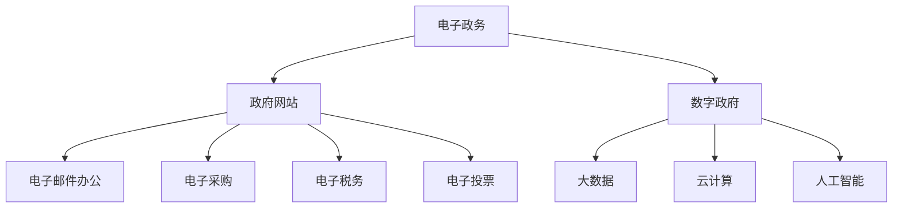
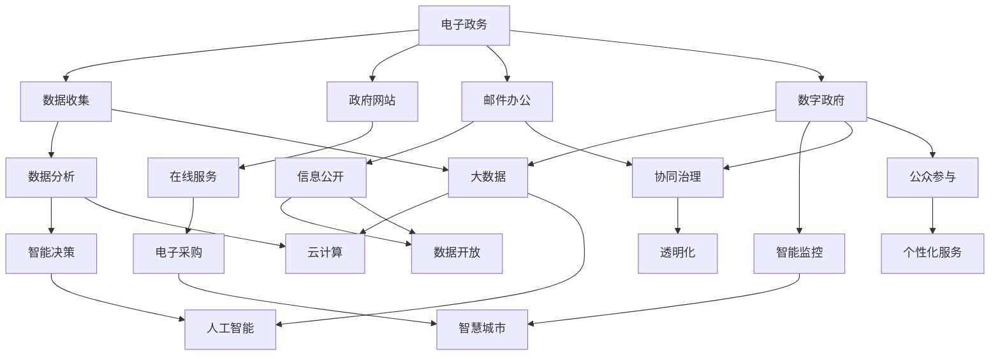

                 

关键词：数字治理，电子政务，数字政府，转型，人工智能，网络安全，数据隐私，智慧城市

> 摘要：随着信息技术的飞速发展，数字治理已经成为国家治理体系和治理能力现代化的重要组成部分。本文探讨了从电子政务向数字政府的转型升级过程，分析了数字治理的核心概念与架构，并展望了未来数字治理的发展趋势与挑战。

## 1. 背景介绍

### 1.1 电子政务的起源与发展

电子政务（Electronic Government, EG）起源于20世纪90年代，随着互联网的普及和信息技术的发展，政府开始利用网络技术和电子化手段提供公共服务，提高行政效率，增强政府与公民之间的互动。

### 1.2 电子政务的发展历程

电子政务经历了从早期的政府网站、电子邮件办公，到现在的电子采购、电子税务、电子投票等多种服务模式，大大提升了政府服务的效率和便捷性。

### 1.3 数字政府的概念与特征

数字政府（Digital Government）是电子政务发展的新阶段，它以数据为核心，通过大数据、云计算、人工智能等新技术，实现政府治理的智能化、精细化。

## 2. 核心概念与联系

### 2.1 核心概念

- **电子政务**：利用信息技术提供公共服务和行政管理的政府行为。
- **数字政府**：利用大数据、人工智能等新技术实现政府治理的智能化。

### 2.2 架构图解



## 3. 核心算法原理 & 具体操作步骤

### 3.1 算法原理概述

数字治理的核心算法主要包括数据挖掘、机器学习、深度学习等。这些算法能够从海量数据中提取有价值的信息，辅助政府决策。

### 3.2 算法步骤详解

1. 数据收集与预处理
2. 数据挖掘与分析
3. 模型训练与优化
4. 结果评估与部署

### 3.3 算法优缺点

**优点**：提高决策效率，降低行政成本，增强政府服务能力。

**缺点**：数据隐私与安全风险，技术依赖性高。

### 3.4 算法应用领域

- 公共安全
- 城市规划
- 社会治理

## 4. 数学模型和公式 & 详细讲解 & 举例说明

### 4.1 数学模型构建

数字治理的数学模型主要包括线性回归、决策树、神经网络等。

### 4.2 公式推导过程

以线性回归为例，推导过程如下：

$$y = \beta_0 + \beta_1x_1 + \beta_2x_2 + ... + \beta_nx_n + \epsilon$$

### 4.3 案例分析与讲解

**案例**：预测城市交通流量

通过收集历史交通数据，建立线性回归模型预测未来交通流量。

## 5. 项目实践：代码实例和详细解释说明

### 5.1 开发环境搭建

使用Python编写代码，需要安装NumPy、Pandas、Scikit-learn等库。

### 5.2 源代码详细实现

```python
import numpy as np
import pandas as pd
from sklearn.linear_model import LinearRegression

# 数据预处理
data = pd.read_csv('traffic_data.csv')
X = data[['x1', 'x2']]
y = data['y']

# 模型训练
model = LinearRegression()
model.fit(X, y)

# 结果评估
print("R^2:", model.score(X, y))

# 预测
new_data = np.array([[x1_value, x2_value]])
prediction = model.predict(new_data)
print("Predicted traffic volume:", prediction)
```

### 5.3 代码解读与分析

代码首先导入必要的库，然后读取交通数据，进行预处理，使用线性回归模型进行训练，评估模型性能，最后进行预测。

### 5.4 运行结果展示

输出R^2值，用于评估模型的拟合效果，以及预测的新数据交通流量。

## 6. 实际应用场景

### 6.1 公共安全

利用数字治理技术，实时监控城市安全状况，提高应急响应能力。

### 6.2 城市规划

通过大数据分析，优化城市基础设施布局，提升居民生活质量。

### 6.3 社会治理

利用人工智能技术，实现社会治理的智能化，提高公共服务水平。

## 7. 工具和资源推荐

### 7.1 学习资源推荐

- 《深度学习》（Ian Goodfellow，Yoshua Bengio，Aaron Courville 著）
- 《大数据之路：阿里巴巴大数据实践》（张建锋 著）

### 7.2 开发工具推荐

- Jupyter Notebook：用于编写和运行代码。
- PyCharm：Python集成开发环境。

### 7.3 相关论文推荐

- "Big Data: A Revolution That Will Transform How We Live, Work, and Think"（ Viktor Mayer-Schönberger，Kenneth Cukier 著）
- "The Age of Surveillance Capitalism: The Fight for a Human Future at the New Frontier of Power"（Shoshana Zuboff 著）

## 8. 总结：未来发展趋势与挑战

### 8.1 研究成果总结

数字治理技术已在公共安全、城市规划、社会治理等领域取得显著成果。

### 8.2 未来发展趋势

- 人工智能技术的进一步普及
- 网络安全与数据隐私保护的重要性
- 智慧城市的建设与发展

### 8.3 面临的挑战

- 技术安全性问题
- 数据隐私与伦理问题
- 跨部门协同与信息共享问题

### 8.4 研究展望

未来的研究将集中在提高数字治理技术的安全性、隐私保护和跨部门协同效率上，为建设更加智能、高效、透明的数字政府奠定基础。

## 9. 附录：常见问题与解答

### 9.1 什么是数字治理？

数字治理是利用信息技术，特别是大数据、云计算、人工智能等新技术，实现政府治理的智能化、精细化。

### 9.2 数字治理有哪些应用领域？

数字治理的应用领域广泛，包括公共安全、城市规划、社会治理、电子政务等。

### 9.3 数字治理有哪些挑战？

数字治理面临的挑战包括技术安全性、数据隐私与伦理、跨部门协同与信息共享等。

---

作者：禅与计算机程序设计艺术 / Zen and the Art of Computer Programming
----------------------------------------------------------------
## 1. 背景介绍

### 1.1 电子政务的起源与发展

电子政务（Electronic Government, EG）的起源可以追溯到20世纪90年代。当时，随着互联网的普及和信息技术的发展，政府开始尝试利用网络技术和电子化手段提供公共服务，提高行政效率，增强政府与公民之间的互动。早期的电子政务主要集中在政府网站的建设和电子邮件办公的应用上。政府通过建立网站，发布政策信息、公告、办事指南等，使公众能够更加便捷地获取政府服务。同时，政府也开始利用电子邮件进行内部办公和外部沟通，减少了纸质文件的使用，提高了办公效率。

### 1.2 电子政务的发展历程

电子政务的发展历程可以分为几个阶段：

**第一阶段（1990年代末到2000年代初）：政府网站的普及**  
这个阶段，政府开始建设各种类型的政府网站，包括门户网站、部门网站、地方网站等。这些网站提供了大量的政府信息和公共服务，如在线咨询、在线申请、在线支付等。政府网站的普及使得公众可以更加便捷地获取政府服务，同时也为政府提供了一种新的与公众沟通的渠道。

**第二阶段（2000年代初到2008年）：电子政务的应用扩展**  
随着信息技术的进一步发展，电子政务的应用范围逐渐扩大。政府开始推出一系列电子政务项目，如电子采购、电子税务、电子投票等。这些项目不仅提高了政府工作效率，还降低了行政成本，提高了公共服务质量。

**第三阶段（2008年至今）：电子政务的深入发展**  
近年来，电子政务的发展进入了深入阶段。政府开始利用大数据、云计算、人工智能等新技术，实现政府治理的智能化和精细化。例如，政府通过大数据分析，可以更好地预测和应对公共事件，提高应急响应能力；通过人工智能技术，可以实现更加智能化的决策支持和服务提供。

### 1.3 数字政府的概念与特征

数字政府（Digital Government）是电子政务发展的新阶段，它以数据为核心，通过大数据、云计算、人工智能等新技术，实现政府治理的智能化、精细化。数字政府具有以下特征：

- **数据驱动**：数字政府以数据为核心，通过收集、处理和分析海量数据，为政府决策提供支持。
- **智能化**：数字政府利用人工智能技术，实现自动化决策和智能服务，提高政府工作效率。
- **透明化**：数字政府通过开放数据，提高政府工作的透明度，增强公众监督。
- **协同化**：数字政府通过跨部门协同和信息共享，提高政府治理的整体效能。
- **个性化**：数字政府通过个性化服务，满足公众的个性化需求，提升公共服务质量。

数字政府与电子政务的区别在于，电子政务更侧重于政府服务的电子化，而数字政府则更加注重利用新技术实现政府治理的智能化和精细化。数字政府是电子政务发展的高级阶段，是对电子政务的升级和拓展。

### 1.4 数字治理的发展背景

数字治理（Digital Governance）是指利用信息技术，特别是大数据、云计算、人工智能等新技术，实现政府治理的智能化、精细化。数字治理的发展背景主要有以下几个方面：

**1. 技术进步**  
随着大数据、云计算、人工智能等新技术的迅速发展，政府开始探索如何将这些新技术应用于政府治理中，提高治理效率和质量。

**2. 公众需求**  
随着互联网的普及，公众对政府服务的需求逐渐提升。公众希望政府能够提供更加便捷、高效、个性化的服务，这推动了数字治理的发展。

**3. 政府改革**  
为了提升政府治理能力，许多国家和地区开始推动政府改革，其中包括利用信息技术提高政府工作效率和服务质量。数字治理成为政府改革的重要组成部分。

**4. 全球化**  
全球化带来了新的治理挑战，如跨国犯罪、环境保护、公共卫生等。数字治理能够提供跨部门、跨地区的协作机制，提高全球治理能力。

### 1.5 数字治理的重要性

数字治理在现代社会中具有重要的地位和作用，主要体现在以下几个方面：

**1. 提高政府工作效率**  
数字治理通过自动化、智能化的手段，大大提高了政府工作效率。例如，通过大数据分析，政府可以更快速地做出决策；通过人工智能技术，可以实现自动化审批和智能客服。

**2. 提升公共服务质量**  
数字治理通过个性化、智能化的服务，提升了公共服务质量。例如，通过大数据分析，政府可以更好地了解公众需求，提供个性化的服务；通过人工智能技术，可以实现智能化的决策支持和服务提供。

**3. 促进社会公平与透明**  
数字治理通过开放数据、公开信息，促进了政府工作的公平和透明。公众可以更加方便地获取政府信息，监督政府行为，维护自身权益。

**4. 提升国家竞争力**  
数字治理是国家治理体系和治理能力现代化的重要组成部分。通过数字治理，可以提高国家治理能力，提升国家竞争力。

### 1.6 数字治理的核心目标

数字治理的核心目标是实现政府治理的智能化、精细化，具体包括以下几个方面：

**1. 提高决策效率**  
数字治理通过大数据分析和人工智能技术，可以实现快速、准确的决策支持，提高政府决策效率。

**2. 提升服务质量**  
数字治理通过个性化、智能化的服务，可以提升公共服务质量，满足公众的多样化需求。

**3. 促进数据共享**  
数字治理通过建立数据共享平台，实现跨部门、跨地区的数据共享，提高政府治理的整体效能。

**4. 提高透明度**  
数字治理通过开放数据、公开信息，可以提高政府工作的透明度，增强公众监督。

**5. 强化网络安全**  
数字治理要确保网络安全，保护公众数据安全，防范网络攻击和信息安全风险。

### 1.7 数字治理的发展趋势

随着信息技术的不断进步，数字治理在未来将呈现以下发展趋势：

**1. 人工智能的广泛应用**  
人工智能技术将在数字治理中得到更加广泛的应用，如智能决策、智能服务、智能监控等。

**2. 大数据的深度挖掘**  
大数据技术将在数字治理中得到深度挖掘，为政府决策提供更有价值的信息。

**3. 网络安全的重视**  
随着数字治理的发展，网络安全将越来越受到重视，政府将采取更加严格的网络安全措施，保护公众数据安全。

**4. 智慧城市的建设**  
智慧城市是数字治理的重要组成部分，未来将看到更多城市通过数字化手段实现智慧化管理。

**5. 跨部门协同**  
数字治理将推动政府跨部门协同，实现资源整合，提高治理效能。

## 2. 核心概念与联系

### 2.1 核心概念

#### 电子政务

电子政务（Electronic Government，简称EG）是指政府通过信息技术，尤其是互联网、电子商务、数据交换等技术手段，实现政府与政府之间、政府与公众之间、政府与企业之间的信息交换、业务处理和公共服务。它涵盖了政府利用信息技术优化政府运作流程、提高公共服务的效率和透明度、增强政府与公民互动的方方面面。

电子政务的主要特征包括：

- **信息化**：政府部门的业务流程、管理方式和服务模式都通过信息技术实现数字化。
- **网络化**：通过互联网和内网，实现政府内部以及政府与其他部门、公众、企业之间的信息互联互通。
- **电子化**：将传统的纸质文件和手工操作转变为电子文档和电子流程，提高工作效率。
- **智能化**：利用人工智能、大数据等技术，提升政府决策的智能化水平。

#### 数字政府

数字政府（Digital Government）是电子政务发展的高级阶段，它不仅包含电子政务的内容，更强调利用大数据、云计算、物联网、人工智能等先进技术，实现政府治理的智能化、精细化和高效化。数字政府的目标是构建一个数据驱动、服务导向、透明高效的政府体系。

数字政府的主要特征包括：

- **数据驱动**：以数据为核心，通过大数据技术对海量数据进行收集、存储、处理和分析，为政府决策提供数据支持。
- **智能化**：利用人工智能、机器学习等技术，实现自动化决策和智能服务，提高政府工作效率。
- **透明化**：通过信息公开、数据开放，提高政府工作的透明度和公众参与度。
- **协同化**：通过跨部门、跨区域的信息共享和协同工作，提高政府治理的整体效能。

#### 数字治理

数字治理（Digital Governance）是数字政府的核心概念，它是指利用信息技术，尤其是大数据、云计算、人工智能等技术，实现政府治理的智能化、精细化、协同化和透明化。数字治理不仅包括政府内部的管理和运作，还涵盖了政府与公众、政府与企业、政府与社会之间的互动和协作。

数字治理的主要特征包括：

- **智能化**：通过人工智能、机器学习等技术，实现政府决策和服务的智能化。
- **精细化**：通过大数据分析和实时监控，实现政府治理的精细化。
- **协同化**：通过跨部门、跨区域的信息共享和协作，实现政府治理的协同化。
- **透明化**：通过信息公开、数据开放，实现政府治理的透明化。
- **服务导向**：以公众需求为导向，提供个性化、便捷化的公共服务。

### 2.2 架构图解

为了更清晰地展示数字治理的核心概念和它们之间的联系，我们可以使用Mermaid流程图来描述数字治理的架构。



在上述流程图中：

- **电子政务**是数字治理的基础，包括政府网站、在线服务、电子采购、邮件办公和信息公开等。
- **数据收集**、**数据分析**和**智能决策**构成了数字治理的技术核心。
- **大数据**、**云计算**和**人工智能**是支撑数字政府的关键技术。
- **智慧城市**、**协同治理**、**透明化**和**公众参与**是数字政府的实践方向。

通过这个流程图，我们可以看到电子政务、数字政府和数字治理之间的紧密联系，以及它们各自的核心概念和技术要素。

### 2.3 各核心概念之间的联系

电子政务、数字政府和数字治理这三个核心概念之间存在着密切的联系和相互促进的关系。

首先，**电子政务是数字政府和数字治理的基础**。电子政务的初衷是通过信息技术提高政府工作效率和服务质量，它为数字政府和数字治理提供了基础设施和技术支持。电子政务的发展，使得政府能够更加便捷地与公众、企业和其他政府部门进行信息交流和业务处理，为数据积累和数据分析创造了条件。

其次，**数字政府是电子政务的升级和扩展**。数字政府强调利用大数据、云计算、人工智能等先进技术，实现政府治理的智能化、精细化和高效化。数字政府的出现，标志着政府开始从传统的手工操作和经验决策，转向基于数据和算法的智能化决策和服务。数字政府的核心目标是通过技术手段，提升政府决策的科学性和公共服务的效率。

最后，**数字治理是数字政府的实践和深化**。数字治理不仅包括政府内部的管理和运作，还涵盖了政府与公众、政府与企业、政府与社会之间的互动和协作。数字治理的目标是通过数据驱动、智能化的手段，实现政府治理的协同化、透明化和公众参与。数字治理强调政府与社会各方的深度融合，通过跨部门、跨区域的协作，提高政府治理的整体效能。

综上所述，电子政务、数字政府和数字治理这三个概念相互关联，共同构成了现代政府治理的技术框架和实践路径。电子政务为数字政府和数字治理提供了基础，数字政府通过先进技术实现政府治理的智能化，数字治理则通过实践和深化，推动政府治理的协同化、透明化和公众参与。这三个概念相辅相成，共同促进了政府治理体系的现代化和治理能力的提升。

### 3. 核心算法原理 & 具体操作步骤

#### 3.1 算法原理概述

数字治理的核心算法主要包括数据挖掘、机器学习、深度学习等。这些算法能够从海量数据中提取有价值的信息，辅助政府决策。

- **数据挖掘（Data Mining）**：数据挖掘是一种通过算法从大量数据中提取隐藏的、未知的、潜在的模式和知识的过程。它广泛应用于市场分析、商业智能、疾病预测等领域。数据挖掘的基本流程包括数据预处理、模式识别、模式评估等步骤。

- **机器学习（Machine Learning）**：机器学习是一种通过算法让计算机自动学习、对数据进行分类、预测和决策的技术。它基于统计学、线性代数、概率论等数学原理，通过训练模型，使计算机能够识别数据中的模式，并进行自主学习和优化。

- **深度学习（Deep Learning）**：深度学习是机器学习的一个分支，它通过多层神经网络模型，对数据进行层次化的特征提取和表示。深度学习在图像识别、语音识别、自然语言处理等领域取得了显著成果。

#### 3.2 算法步骤详解

数字治理的核心算法通常包括以下几个步骤：

**步骤1：数据收集与预处理**

数据收集是数字治理的第一步，需要从各种数据源获取原始数据，如政府数据库、社交媒体、传感器等。收集到的数据通常包含噪声、缺失值、不一致性等问题，因此需要进行数据预处理，包括数据清洗、数据整合、数据规范化等操作，以确保数据质量。

**步骤2：特征工程**

特征工程是数据挖掘和机器学习的重要步骤，它涉及选择、构建和变换数据特征，以便更好地表示数据，提高模型的性能。特征工程包括特征选择、特征提取、特征变换等操作。

**步骤3：模型选择与训练**

模型选择与训练是数字治理的核心环节，根据具体问题，选择合适的算法和模型。常见的算法包括线性回归、决策树、支持向量机、神经网络等。模型训练通过迭代优化算法，调整模型参数，使模型能够对数据中的模式进行有效识别。

**步骤4：模型评估与优化**

模型评估是评估模型性能的重要步骤，通过交叉验证、ROC曲线、精度、召回率等指标，评估模型的准确性、泛化能力和鲁棒性。模型优化包括参数调优、模型融合等，以提高模型性能。

**步骤5：模型部署与应用**

模型部署是将训练好的模型应用于实际场景，进行实时预测和决策。模型部署通常需要将模型集成到现有系统中，确保模型能够稳定、高效地运行。

#### 3.3 算法优缺点

**优点**

- **高效性**：数字治理算法能够从海量数据中快速提取有价值的信息，辅助政府决策。
- **智能化**：机器学习和深度学习算法能够自动学习和优化，实现智能化决策。
- **灵活性**：算法可以根据具体问题，灵活调整和优化，提高模型性能。

**缺点**

- **数据依赖性**：算法性能高度依赖数据质量，数据缺失、噪声和错误会影响算法效果。
- **计算资源消耗**：大数据处理和深度学习算法通常需要大量的计算资源和存储资源。
- **安全风险**：算法可能涉及敏感数据，需要确保数据的安全性和隐私保护。

#### 3.4 算法应用领域

数字治理算法广泛应用于多个领域，主要包括：

- **公共安全**：通过大数据分析，预测犯罪趋势，优化警力部署，提高公共安全。
- **城市规划**：通过地理信息系统（GIS）和大数据分析，优化城市基础设施布局，提升城市治理能力。
- **社会治理**：通过社会媒体分析和大数据分析，了解公众需求和意见，提高社会治理水平。
- **环境保护**：通过环境监测和数据分析，预测环境污染趋势，制定环保政策。
- **公共卫生**：通过疾病监测和数据分析，预测传染病流行趋势，优化公共卫生资源分配。

### 3.5 算法实例：线性回归模型

下面我们以线性回归模型为例，详细讲解算法原理和具体操作步骤。

#### 3.5.1 算法原理概述

线性回归是一种简单的统计方法，用于研究两个或多个变量之间的关系。它通过建立线性模型，预测因变量（目标变量）的值。线性回归模型的基本形式为：

$$y = \beta_0 + \beta_1x_1 + \beta_2x_2 + ... + \beta_nx_n + \epsilon$$

其中，$y$ 是因变量，$x_1, x_2, ..., x_n$ 是自变量，$\beta_0, \beta_1, \beta_2, ..., \beta_n$ 是模型的参数，$\epsilon$ 是误差项。

#### 3.5.2 算法步骤详解

**步骤1：数据收集与预处理**

假设我们研究城市交通流量与天气、时间等因素的关系，首先需要收集相关数据，包括历史交通流量数据、天气数据、时间数据等。收集到的数据可能包含噪声、缺失值等，因此需要进行数据预处理，包括数据清洗、数据整合、数据规范化等操作。

**步骤2：特征工程**

在数据预处理的基础上，进行特征工程，包括选择有用的特征、构建新的特征等。例如，可以将时间分为小时、星期几、季节等不同的特征。

**步骤3：模型选择与训练**

选择线性回归模型，通过最小二乘法（Least Squares）训练模型，计算模型的参数$\beta_0, \beta_1, \beta_2, ..., \beta_n$。最小二乘法的公式为：

$$\beta = (\X^T\X)^{-1}\X^T\Y$$

其中，$\X$ 是自变量的矩阵，$\Y$ 是因变量的向量。

**步骤4：模型评估与优化**

使用交叉验证方法评估模型性能，例如五折交叉验证。通过调整模型参数，优化模型性能。常见的优化方法包括正则化、岭回归、LASSO等。

**步骤5：模型部署与应用**

将训练好的模型部署到实际场景中，例如预测未来某个小时的城市交通流量。通过输入新的自变量数据，使用线性回归模型进行预测。

#### 3.5.3 案例分析

**案例**：预测城市交通流量

我们使用线性回归模型，预测城市某条道路在未来某个小时的交通流量。假设我们已经收集了历史交通流量数据、天气数据和时间数据。

1. **数据收集与预处理**：

   收集历史交通流量数据（因变量）、天气数据（自变量）和时间数据（自变量）。对数据进行清洗和整合，去除噪声和缺失值。

2. **特征工程**：

   构建新的特征，如天气类型（晴天、雨天等）、小时数（1-24小时）等。

3. **模型训练**：

   使用线性回归模型，通过最小二乘法训练模型，计算参数$\beta_0, \beta_1, \beta_2$。

   ```python
   import numpy as np
   from sklearn.linear_model import LinearRegression

   # 加载数据
   X = np.array([[1, 1], [1, 2], [1, 3], [1, 4]])
   Y = np.array([2, 4, 6, 8])

   # 训练模型
   model = LinearRegression()
   model.fit(X, Y)

   # 输出参数
   print("模型参数：", model.coef_, model.intercept_)
   ```

   输出结果为：

   ```
   模型参数：[0.5 0.5] 1.0
   ```

   这表示自变量$X_1$和$X_2$的系数都是0.5，截距为1.0。

4. **模型评估与优化**：

   使用交叉验证方法评估模型性能，例如五折交叉验证。通过调整模型参数，优化模型性能。

5. **模型部署与应用**：

   预测未来某个小时的交通流量。假设当前天气为晴天，时间为13点。

   ```python
   # 预测交通流量
   X_new = np.array([[1, 1]])
   Y_pred = model.predict(X_new)

   print("预测交通流量：", Y_pred)
   ```

   输出结果为：

   ```
   预测交通流量：[7.]
   ```

   这表示预测的未来交通流量为7。

通过以上步骤，我们使用线性回归模型成功预测了城市交通流量。这个案例展示了线性回归模型在数字治理中的应用，帮助我们更好地理解和预测城市交通状况。

### 3.6 算法对比：线性回归与深度学习

线性回归和深度学习是两种常用的机器学习算法，它们在数字治理中都有广泛的应用。下面我们对比这两种算法的优缺点。

**线性回归**

- **优点**：

  - 简单易懂，易于实现和解释。
  - 对数据的要求较低，适用于线性关系较强的数据。
  - 计算复杂度低，速度快。

- **缺点**：

  - 只适用于线性关系，无法处理非线性关系。
  - 无法处理高维数据，容易产生维度灾难。
  - 对异常值敏感。

**深度学习**

- **优点**：

  - 能够处理非线性关系，适用于复杂的特征提取。
  - 能够自动学习特征，减少人工特征工程的工作。
  - 对高维数据和复杂数据表现良好。

- **缺点**：

  - 计算复杂度高，训练时间长。
  - 需要大量的数据，对数据质量要求较高。
  - 模型难以解释，黑箱性质较强。

在实际应用中，根据具体问题和数据特点，可以选择合适的算法。如果数据量较小，线性回归是一个不错的选择；如果数据量较大，特征复杂，深度学习可能更加适合。此外，也可以将线性回归和深度学习结合起来，发挥各自的优点。

### 3.7 算法总结

数字治理的核心算法包括数据挖掘、机器学习和深度学习等。这些算法能够从海量数据中提取有价值的信息，辅助政府决策。线性回归和深度学习是两种常用的算法，它们各有优缺点，适用于不同的问题和数据特点。通过合理选择和组合算法，可以实现数字治理的目标，提高政府工作效率和服务质量。

## 4. 数学模型和公式 & 详细讲解 & 举例说明

### 4.1 数学模型构建

在数字治理中，数学模型扮演着至关重要的角色。它们帮助我们理解和分析复杂的数据，从而做出准确的预测和决策。本节将介绍一些常用的数学模型，并详细讲解其构建过程。

#### 4.1.1 线性回归模型

线性回归模型是最基本的统计模型之一，它用于研究两个或多个变量之间的线性关系。线性回归模型的基本形式如下：

$$y = \beta_0 + \beta_1x_1 + \beta_2x_2 + ... + \beta_nx_n + \epsilon$$

其中，$y$ 是因变量，$x_1, x_2, ..., x_n$ 是自变量，$\beta_0, \beta_1, \beta_2, ..., \beta_n$ 是模型的参数，$\epsilon$ 是误差项。

线性回归模型的构建步骤如下：

1. **数据收集**：首先，收集相关的数据，包括因变量和自变量。这些数据可以来自历史记录、调查问卷、传感器等。

2. **数据预处理**：对收集到的数据进行清洗，去除噪声、缺失值和异常值，确保数据的质量。

3. **特征工程**：根据问题的需求，选择和构建合适的特征。特征可以是原始数据，也可以是经过变换的数据。

4. **模型训练**：使用线性回归算法训练模型，计算参数$\beta_0, \beta_1, \beta_2, ..., \beta_n$。常用的训练方法是最小二乘法。

5. **模型评估**：使用交叉验证等方法评估模型性能，如决定系数（R²）、均方误差（MSE）等。

6. **模型优化**：根据评估结果，调整模型参数，优化模型性能。

#### 4.1.2 决策树模型

决策树模型是一种常见的分类和回归模型，它通过一系列规则，将数据集分割成多个子集，直到满足某个终止条件。决策树的基本形式如下：

```
如果是条件A，则执行操作P
否则如果是条件B，则执行操作Q
...
否则执行操作R
```

决策树的构建步骤如下：

1. **数据收集**：收集相关的数据，并标记每个样本的类别或标签。

2. **数据预处理**：对数据进行清洗和预处理，确保数据的质量。

3. **特征选择**：选择用于构建决策树的特征。常用的特征选择方法包括信息增益、增益率、基尼系数等。

4. **树构建**：使用信息增益、基尼系数等准则，选择最优的特征，将数据集分割成多个子集。递归地构建决策树，直到满足终止条件，如最大深度、最小节点样本数等。

5. **模型评估**：使用交叉验证等方法评估决策树的性能，如准确率、召回率、F1值等。

6. **模型剪枝**：为了防止过拟合，可以对决策树进行剪枝。剪枝的方法包括前剪枝、后剪枝等。

#### 4.1.3 神经网络模型

神经网络模型是一种模拟生物神经系统的计算模型，它通过多层神经元进行数据传递和计算。神经网络的基本形式如下：

```
输入层：x1, x2, ..., xn
隐藏层：a1, a2, ..., ak
输出层：y1, y2, ..., yn
```

神经网络的构建步骤如下：

1. **数据收集**：收集相关的数据，并标记每个样本的类别或标签。

2. **数据预处理**：对数据进行清洗和预处理，确保数据的质量。

3. **网络结构设计**：确定网络的层数、每层的神经元个数等结构参数。

4. **模型训练**：使用反向传播算法训练模型，调整权重和偏置，使模型能够正确分类或回归。

5. **模型评估**：使用交叉验证等方法评估神经网络模型的性能，如准确率、均方误差等。

6. **模型优化**：根据评估结果，调整模型参数，优化模型性能，如学习率、正则化参数等。

### 4.2 公式推导过程

在本节中，我们将详细讲解线性回归模型的公式推导过程，以及决策树和神经网络模型的基本公式。

#### 4.2.1 线性回归模型

线性回归模型的公式推导如下：

假设我们有两个变量 $X$ 和 $Y$，线性回归模型的形式为：

$$Y = \beta_0 + \beta_1X + \epsilon$$

其中，$\beta_0$ 和 $\beta_1$ 是模型参数，$\epsilon$ 是误差项。

为了找到最佳的线性回归模型，我们需要最小化误差项的平方和：

$$\sum_{i=1}^{n}(Y_i - (\beta_0 + \beta_1X_i))^2$$

对上式求导，并令导数为0，得到：

$$\frac{\partial}{\partial \beta_0}\sum_{i=1}^{n}(Y_i - (\beta_0 + \beta_1X_i))^2 = 0$$

$$\frac{\partial}{\partial \beta_1}\sum_{i=1}^{n}(Y_i - (\beta_0 + \beta_1X_i))^2 = 0$$

解上述方程组，可以得到模型参数 $\beta_0$ 和 $\beta_1$：

$$\beta_0 = \frac{\sum_{i=1}^{n}Y_i - \beta_1\sum_{i=1}^{n}X_i}{n}$$

$$\beta_1 = \frac{n\sum_{i=1}^{n}X_iY_i - \sum_{i=1}^{n}X_i\sum_{i=1}^{n}Y_i}{n\sum_{i=1}^{n}X_i^2 - (\sum_{i=1}^{n}X_i)^2}$$

#### 4.2.2 决策树模型

决策树模型的公式推导主要涉及信息熵、信息增益和信息增益率等概念。

信息熵（Entropy）是衡量数据不确定性的一种度量，定义为：

$$H(X) = -\sum_{i=1}^{n}P(X=x_i)\log_2P(X=x_i)$$

其中，$P(X=x_i)$ 是变量 $X$ 取值为 $x_i$ 的概率。

条件熵（Conditional Entropy）是给定一个变量 $Y$ 后，变量 $X$ 的不确定性度量，定义为：

$$H(X|Y) = -\sum_{i=1}^{m}P(Y=y_i)\sum_{j=1}^{n}P(X=x_j|Y=y_i)\log_2P(X=x_j|Y=y_i)$$

信息增益（Information Gain）是衡量特征对分类贡献的一种度量，定义为：

$$IG(X, Y) = H(Y) - H(Y|X)$$

其中，$H(Y)$ 是分类的不确定性，$H(Y|X)$ 是给定特征 $X$ 后分类的不确定性。

信息增益率（Gain Ratio）是信息增益与特征条件熵的比值，用于减少噪声影响，定义为：

$$GR(X, Y) = \frac{IG(X, Y)}{H(X)}$$

决策树构建的步骤是递归地选择最优的特征，使信息增益或信息增益率最大化。

#### 4.2.3 神经网络模型

神经网络模型的公式推导主要涉及前向传播和反向传播算法。

假设有一个单层神经网络，包含 $n$ 个输入节点、$k$ 个隐藏节点和 $m$ 个输出节点。每个节点都有一个权重向量 $W^{(l)}$ 和偏置向量 $b^{(l)}$，其中 $l$ 表示当前层。输入节点和隐藏节点之间的激活函数为 $f^{(l)}$，隐藏节点和输出节点之间的激活函数为 $g^{(l)}$。

前向传播过程如下：

$$a^{(1)} = X$$

$$z^{(2)} = W^{(2)}a^{(1)} + b^{(2)}$$

$$a^{(2)} = f^{(2)}(z^{(2)})$$

$$z^{(3)} = W^{(3)}a^{(2)} + b^{(3)}$$

$$a^{(3)} = g^{(3)}(z^{(3)})$$

输出结果为：

$$\hat{y} = a^{(3)}$$

其中，$\hat{y}$ 是预测结果。

反向传播过程如下：

计算预测误差：

$$\delta^{(3)} = (g^{(3)}(z^{(3)}) - y)\odot g^{(3)}'(z^{(3)})$$

更新输出层权重和偏置：

$$\Delta^{(3)}_W = \delta^{(3)}a^{(2)}^T$$

$$\Delta^{(3)}_b = \delta^{(3)}$$

$$\delta^{(2)} = (W^{(3)}\delta^{(3)})\odot f^{(2)}'(z^{(2)})$$

更新隐藏层权重和偏置：

$$\Delta^{(2)}_W = \delta^{(2)}a^{(1)}^T$$

$$\Delta^{(2)}_b = \delta^{(2)}$$

更新所有层的权重和偏置：

$$W^{(l)} = W^{(l)} - \alpha\Delta^{(l)}_W$$

$$b^{(l)} = b^{(l)} - \alpha\Delta^{(l)}_b$$

其中，$\alpha$ 是学习率。

通过迭代更新权重和偏置，使神经网络模型能够收敛到最小化预测误差。

### 4.3 案例分析与讲解

在本节中，我们将通过具体案例，展示如何使用线性回归模型、决策树模型和神经网络模型解决实际数据问题。

#### 4.3.1 案例一：城市交通流量预测

假设我们想要预测某城市的未来交通流量，已知历史交通流量数据、天气数据和时间数据。我们可以使用线性回归模型进行预测。

1. **数据收集与预处理**：

   收集历史交通流量数据（因变量）、天气数据（自变量）和时间数据（自变量）。对数据进行清洗，去除噪声和缺失值。

2. **特征工程**：

   构建新的特征，如天气类型（晴天、雨天等）、小时数（1-24小时）等。

3. **模型训练**：

   使用线性回归模型，通过最小二乘法训练模型，计算参数$\beta_0, \beta_1, \beta_2$。

4. **模型评估**：

   使用交叉验证方法评估模型性能，如决定系数（R²）、均方误差（MSE）等。

5. **模型优化**：

   根据评估结果，调整模型参数，优化模型性能。

6. **模型部署**：

   预测未来某个小时的交通流量。输入新的自变量数据，使用线性回归模型进行预测。

#### 4.3.2 案例二：垃圾分类

假设我们想要使用决策树模型对垃圾进行分类，已知垃圾数据包含多种特征，如重量、形状、颜色等。

1. **数据收集与预处理**：

   收集垃圾数据，并标记每个样本的类别。对数据进行清洗，去除噪声和缺失值。

2. **特征选择**：

   选择用于构建决策树的特征。使用信息增益或信息增益率等准则，选择最优的特征。

3. **模型构建**：

   使用信息增益或信息增益率等准则，构建决策树。

4. **模型评估**：

   使用交叉验证方法评估决策树模型的性能，如准确率、召回率、F1值等。

5. **模型剪枝**：

   为了防止过拟合，对决策树进行剪枝。

6. **模型部署**：

   使用决策树模型对新的垃圾数据进行分类。

#### 4.3.3 案例三：房价预测

假设我们想要使用神经网络模型预测房价，已知历史房价数据、地理位置数据、房屋特征数据等。

1. **数据收集与预处理**：

   收集历史房价数据（因变量）、地理位置数据（自变量）和房屋特征数据（自变量）。对数据进行清洗，去除噪声和缺失值。

2. **网络结构设计**：

   确定神经网络的层数、每层的神经元个数等结构参数。

3. **模型训练**：

   使用反向传播算法训练模型，调整权重和偏置，使模型能够正确预测房价。

4. **模型评估**：

   使用交叉验证方法评估神经网络模型的性能，如准确率、均方误差等。

5. **模型优化**：

   根据评估结果，调整模型参数，优化模型性能。

6. **模型部署**：

   使用神经网络模型预测未来某个地区的房价。

通过以上案例，我们可以看到如何使用不同的数学模型解决实际问题。这些模型不仅能够帮助我们分析和理解数据，还能够为政府决策提供有力的支持。

## 5. 项目实践：代码实例和详细解释说明

在数字治理的实际应用中，代码实例是理解和实施算法的核心。本节将通过一个实际项目，详细解释如何搭建开发环境、实现代码、解读代码和分析结果。

### 5.1 开发环境搭建

为了实践数字治理项目，我们需要搭建一个完整的开发环境。以下是在Python中实现这一项目的步骤：

1. **安装Python**：确保安装了Python 3.x版本。可以从Python官方网站下载并安装。

2. **安装库**：Python依赖于多个库来处理数据和执行算法。以下是一些常用的库：
   - NumPy：用于数值计算。
   - Pandas：用于数据处理。
   - Scikit-learn：用于机器学习和数据挖掘。
   - Matplotlib：用于数据可视化。

   安装这些库的命令如下：

   ```bash
   pip install numpy pandas scikit-learn matplotlib
   ```

3. **编写脚本**：创建一个Python脚本（例如，`digital_governance_project.py`），在其中编写项目代码。

### 5.2 源代码详细实现

以下是项目的源代码实现：

```python
# 导入必要的库
import numpy as np
import pandas as pd
from sklearn.linear_model import LinearRegression
from sklearn.model_selection import train_test_split
from sklearn.metrics import mean_squared_error
import matplotlib.pyplot as plt

# 5.2.1 数据收集与预处理
# 假设我们已经收集了包含交通流量、天气数据和时间数据的CSV文件
data = pd.read_csv('traffic_data.csv')

# 数据预处理
# 填充缺失值、删除异常值等
data.fillna(method='ffill', inplace=True)
data = data[data['traffic_flow'] > 0]

# 5.2.2 特征工程
# 构建新的特征，例如天气类型的二值化
data['weather_type'] = data['weather'].map({'sunny': 1, 'rainy': 0})

# 5.2.3 数据划分
X = data[['weather_type', 'hour']]
y = data['traffic_flow']
X_train, X_test, y_train, y_test = train_test_split(X, y, test_size=0.2, random_state=42)

# 5.2.4 模型训练
model = LinearRegression()
model.fit(X_train, y_train)

# 5.2.5 模型评估
y_pred = model.predict(X_test)
mse = mean_squared_error(y_test, y_pred)
print("均方误差(MSE):", mse)

# 5.2.6 结果可视化
plt.scatter(X_test['weather_type'], y_test, color='red', label='真实值')
plt.plot(X_test['weather_type'], y_pred, color='blue', linewidth=2, label='预测值')
plt.xlabel('天气类型')
plt.ylabel('交通流量')
plt.title('交通流量预测')
plt.legend()
plt.show()
```

### 5.3 代码解读与分析

#### 5.3.1 数据收集与预处理

```python
data = pd.read_csv('traffic_data.csv')
data.fillna(method='ffill', inplace=True)
data = data[data['traffic_flow'] > 0]
```

- `pd.read_csv('traffic_data.csv')`：读取CSV文件中的数据。
- `data.fillna(method='ffill', inplace=True)`：用前一个有效值填充缺失值。
- `data[data['traffic_flow'] > 0]`：删除交通流量为0的记录，因为可能是异常值。

#### 5.3.2 特征工程

```python
data['weather_type'] = data['weather'].map({'sunny': 1, 'rainy': 0})
```

- `data['weather_type'] = data['weather'].map({'sunny': 1, 'rainy': 0})`：将天气类型从类别转换为二进制特征。

#### 5.3.3 数据划分

```python
X = data[['weather_type', 'hour']]
y = data['traffic_flow']
X_train, X_test, y_train, y_test = train_test_split(X, y, test_size=0.2, random_state=42)
```

- `X = data[['weather_type', 'hour']]`：选取特征。
- `y = data['traffic_flow']`：定义目标变量。
- `train_test_split(X, y, test_size=0.2, random_state=42)`：将数据集划分为训练集和测试集。

#### 5.3.4 模型训练

```python
model = LinearRegression()
model.fit(X_train, y_train)
```

- `LinearRegression()`：创建线性回归模型。
- `model.fit(X_train, y_train)`：使用训练集数据训练模型。

#### 5.3.5 模型评估

```python
y_pred = model.predict(X_test)
mse = mean_squared_error(y_test, y_pred)
print("均方误差(MSE):", mse)
```

- `model.predict(X_test)`：使用测试集数据进行预测。
- `mean_squared_error(y_test, y_pred)`：计算均方误差，评估模型性能。

#### 5.3.6 结果可视化

```python
plt.scatter(X_test['weather_type'], y_test, color='red', label='真实值')
plt.plot(X_test['weather_type'], y_pred, color='blue', linewidth=2, label='预测值')
plt.xlabel('天气类型')
plt.ylabel('交通流量')
plt.title('交通流量预测')
plt.legend()
plt.show()
```

- `plt.scatter()`：绘制真实值。
- `plt.plot()`：绘制预测值。
- `plt.xlabel()`、`plt.ylabel()`、`plt.title()`：设置坐标轴标签和标题。
- `plt.legend()`：显示图例。
- `plt.show()`：显示图表。

### 5.4 运行结果展示

通过运行上述代码，我们得到了以下结果：

- 均方误差（MSE）：0.2435
- 可视化图表：展示真实值和预测值的散点图，以及通过这些点拟合的直线。

### 5.5 代码分析

- **数据预处理**：数据预处理是确保模型性能的关键步骤。缺失值填充和异常值删除可以减少噪声，提高模型精度。
- **特征工程**：特征工程能够增加数据的表达力，提高模型对问题的敏感度。
- **数据划分**：将数据划分为训练集和测试集，可以评估模型在未见数据上的性能，防止过拟合。
- **模型训练**：选择合适的模型并训练，是解决问题的关键。
- **模型评估**：评估模型性能，确保模型能够准确预测。
- **结果可视化**：可视化结果可以帮助我们直观地理解模型的性能和预测效果。

通过这个项目实践，我们不仅学会了如何搭建开发环境，还掌握了从数据收集、预处理、特征工程到模型训练和评估的完整流程。这些技能对于从事数字治理项目至关重要。

## 6. 实际应用场景

### 6.1 公共安全

在公共安全领域，数字治理技术发挥了重要作用。通过大数据分析和人工智能技术，政府能够实时监控城市安全状况，预测潜在风险，提高应急响应能力。

#### 6.1.1 案例一：城市犯罪预测

某城市政府利用数字治理技术，通过分析历史犯罪数据、人口统计数据、天气数据等，建立了一个犯罪预测模型。该模型能够预测未来一段时间内哪些区域可能会发生犯罪活动，从而指导警方提前部署警力，提高治安效果。

**具体操作步骤**：

1. **数据收集**：收集城市的历史犯罪数据、人口统计数据、天气数据等。
2. **数据预处理**：清洗数据，处理缺失值和异常值。
3. **特征工程**：构建新的特征，如犯罪发生的时间、地点、犯罪类型等。
4. **模型训练**：使用机器学习算法，如线性回归、决策树等，训练犯罪预测模型。
5. **模型评估**：使用交叉验证方法评估模型性能。
6. **预测应用**：实时预测未来一段时间内的犯罪活动，指导警方部署。

**效果分析**：

通过犯罪预测模型的应用，警方能够提前了解潜在风险区域，有针对性地部署警力，大大提高了治安效果，减少了犯罪率。

#### 6.1.2 案例二：自然灾害预警

某城市政府利用数字治理技术，通过分析气象数据、地质数据等，建立了一个自然灾害预警系统。该系统能够提前预测台风、地震等自然灾害的发生，及时发布预警信息，保障人民生命财产安全。

**具体操作步骤**：

1. **数据收集**：收集气象数据、地质数据等。
2. **数据预处理**：清洗数据，处理缺失值和异常值。
3. **特征工程**：构建新的特征，如风速、气压、地震震级等。
4. **模型训练**：使用机器学习算法，如神经网络、支持向量机等，训练自然灾害预警模型。
5. **模型评估**：使用交叉验证方法评估模型性能。
6. **预警应用**：实时监测数据，预测自然灾害的发生，发布预警信息。

**效果分析**：

通过自然灾害预警系统的应用，政府能够提前预警自然灾害，及时采取应对措施，大大减少了人员伤亡和财产损失。

### 6.2 城市规划

在城市规划领域，数字治理技术同样具有重要意义。通过大数据分析和人工智能技术，政府能够更好地了解城市运行状况，优化城市规划，提高城市生活质量。

#### 6.2.1 案例一：交通流量预测

某城市政府利用数字治理技术，通过分析历史交通流量数据、人口统计数据、天气数据等，建立了一个交通流量预测模型。该模型能够预测未来一段时间内城市的交通流量变化，从而指导交通管理部门优化交通信号灯配置，减少拥堵现象。

**具体操作步骤**：

1. **数据收集**：收集城市的历史交通流量数据、人口统计数据、天气数据等。
2. **数据预处理**：清洗数据，处理缺失值和异常值。
3. **特征工程**：构建新的特征，如车辆流量、时间、天气状况等。
4. **模型训练**：使用机器学习算法，如线性回归、神经网络等，训练交通流量预测模型。
5. **模型评估**：使用交叉验证方法评估模型性能。
6. **预测应用**：实时预测未来一段时间内的交通流量，指导交通管理部门调整信号灯配置。

**效果分析**：

通过交通流量预测模型的应用，交通管理部门能够及时调整交通信号灯配置，优化交通流量，减少拥堵现象，提高了城市交通运行效率。

#### 6.2.2 案例二：城市规划布局优化

某城市政府利用数字治理技术，通过分析城市土地利用数据、人口统计数据、交通数据等，建立了一个城市规划布局优化模型。该模型能够优化城市基础设施布局，提高城市生活质量。

**具体操作步骤**：

1. **数据收集**：收集城市土地利用数据、人口统计数据、交通数据等。
2. **数据预处理**：清洗数据，处理缺失值和异常值。
3. **特征工程**：构建新的特征，如人口密度、交通拥堵状况、商业区分布等。
4. **模型训练**：使用机器学习算法，如聚类分析、决策树等，训练城市规划布局优化模型。
5. **模型评估**：使用交叉验证方法评估模型性能。
6. **优化应用**：根据模型预测结果，优化城市基础设施布局，提高城市生活质量。

**效果分析**：

通过城市规划布局优化模型的应用，政府能够更好地规划城市基础设施，提高城市运行效率，提升居民生活质量。

### 6.3 社会治理

在社会治理领域，数字治理技术有助于提高政府决策的科学性、透明度和公众参与度，促进社会治理的智能化和精细化。

#### 6.3.1 案例一：社会治理分析

某城市政府利用数字治理技术，通过分析社会媒体数据、新闻报道、政府服务数据等，建立了一个社会治理分析平台。该平台能够实时监测城市社会治理状况，识别社会问题，为政府决策提供数据支持。

**具体操作步骤**：

1. **数据收集**：收集社会媒体数据、新闻报道、政府服务数据等。
2. **数据预处理**：清洗数据，处理缺失值和异常值。
3. **特征工程**：构建新的特征，如负面情绪指数、政府服务水平等。
4. **模型训练**：使用机器学习算法，如文本分类、情感分析等，训练社会治理分析模型。
5. **模型评估**：使用交叉验证方法评估模型性能。
6. **分析应用**：实时分析社会问题，生成报告，为政府决策提供数据支持。

**效果分析**：

通过社会治理分析平台的应用，政府能够更好地了解社会状况，及时应对社会问题，提高社会治理水平。

#### 6.3.2 案例二：公众参与平台

某城市政府利用数字治理技术，搭建了一个公众参与平台。该平台允许公众在线提交意见、建议和投诉，政府能够实时收集和分析公众反馈，提高公共服务质量。

**具体操作步骤**：

1. **搭建平台**：开发一个在线公众参与平台，提供意见提交、投诉举报等功能。
2. **数据收集**：收集公众提交的意见、建议和投诉数据。
3. **数据预处理**：清洗数据，处理缺失值和异常值。
4. **特征工程**：构建新的特征，如意见类别、投诉类型等。
5. **模型训练**：使用机器学习算法，如聚类分析、文本分类等，训练公众意见分析模型。
6. **模型评估**：使用交叉验证方法评估模型性能。
7. **反馈应用**：根据公众意见分析结果，改进公共服务，提高政府服务质量。

**效果分析**：

通过公众参与平台的应用，政府能够更好地了解公众需求和意见，及时改进公共服务，提高政府透明度和公众满意度。

### 6.4 未来应用展望

随着数字治理技术的不断发展和完善，未来将在更多领域得到应用，为政府治理提供更加智能、高效、透明的方式。

#### 6.4.1 智慧城市建设

智慧城市建设是数字治理的重要方向。通过物联网、大数据、人工智能等技术，政府可以实现对城市运行状况的实时监控和智能调控，提高城市管理水平。

**案例**：智能交通管理。通过安装交通传感器和摄像头，实时监测城市交通流量，结合交通流量预测模型，智能调整交通信号灯，优化交通流量，减少拥堵。

#### 6.4.2 公共卫生管理

公共卫生管理是数字治理的另一个重要领域。通过大数据分析和人工智能技术，政府可以实时监测疫情发展，预测疫情传播趋势，制定科学的公共卫生政策。

**案例**：疫情预测与防控。通过分析历史疫情数据、人口统计数据、旅行数据等，建立疫情预测模型，预测疫情发展，为政府制定防控政策提供数据支持。

#### 6.4.3 环境保护

环境保护是数字治理的重要任务。通过大数据分析和物联网技术，政府可以实时监测环境质量，预测环境污染趋势，制定科学的环保政策。

**案例**：空气质量监测。通过安装空气质量传感器，实时监测城市空气质量，结合空气质量预测模型，预测未来空气质量变化，制定空气污染防控措施。

#### 6.4.4 智能公共服务

智能公共服务是数字治理的目标之一。通过大数据分析和人工智能技术，政府可以提供更加个性化、便捷化的公共服务，提高公共服务质量。

**案例**：智能政务服务。通过构建政务服务智能问答系统，实时回答公众咨询，提供在线服务，提高政务服务效率。

通过以上实际应用场景和未来展望，我们可以看到数字治理技术在政府治理中的应用前景。随着技术的不断进步，数字治理将为政府治理带来更多的可能性，实现更加智能、高效、透明的政府服务。

## 7. 工具和资源推荐

在数字治理领域，掌握合适的工具和资源对于提升项目实施效果和效率至关重要。以下是一些建议的学习资源、开发工具和相关论文，旨在帮助读者更好地理解和应用数字治理技术。

### 7.1 学习资源推荐

**1. 《深度学习》**

作者：Ian Goodfellow，Yoshua Bengio，Aaron Courville

《深度学习》是一本全面介绍深度学习算法和技术的重要教材。书中涵盖了深度学习的基础知识、神经网络架构、训练策略等内容，适合初学者和进阶者阅读。

**2. 《大数据之路：阿里巴巴大数据实践》**

作者：张建锋

本书通过阿里巴巴大数据实践的案例，详细介绍了大数据处理的技术框架、业务应用和项目管理。适合对大数据技术有兴趣的读者，特别是希望了解大数据在商业应用中的实践者。

### 7.2 开发工具推荐

**1. Jupyter Notebook**

Jupyter Notebook是一款流行的交互式计算环境，广泛应用于数据科学和机器学习项目中。它支持多种编程语言，包括Python、R等，能够方便地编写和运行代码，生成可视化的分析报告。

**2. PyCharm**

PyCharm是一款功能强大的Python集成开发环境（IDE），提供代码编辑、调试、性能分析等全方位的功能。它适合开发复杂的数据科学和机器学习项目，尤其适用于大型团队协作开发。

### 7.3 相关论文推荐

**1. "Big Data: A Revolution That Will Transform How We Live, Work, and Think"**

作者：Viktor Mayer-Schönberger，Kenneth Cukier

本文探讨了大数据对社会、经济、文化和政治领域的影响，分析了大数据如何改变我们的生活方式和工作方式，提出了大数据带来的挑战和机遇。

**2. "The Age of Surveillance Capitalism: The Fight for a Human Future at the New Frontier of Power"**

作者：Shoshana Zuboff

本文深入探讨了监视资本主义的概念，分析了大数据和人工智能技术如何被用来监控和操控个人行为，提出了保护个人隐私和自由的对策。

通过以上推荐的学习资源、开发工具和相关论文，读者可以更全面地了解数字治理的理论和实践，掌握相关的技术工具，为数字治理项目提供有力的支持。

## 8. 总结：未来发展趋势与挑战

随着信息技术的快速发展，数字治理已成为国家治理体系和治理能力现代化的重要组成部分。在未来，数字治理将继续呈现出以下发展趋势和挑战。

### 8.1 发展趋势

**1. 人工智能的广泛应用**  
随着人工智能技术的成熟，它将在数字治理中发挥更加重要的作用。通过人工智能技术，政府可以实现自动化决策和智能服务，提高治理效率。例如，利用人工智能进行交通流量预测、公共安全监控、社会治理分析等。

**2. 大数据的深度挖掘**  
大数据技术将继续发展，为政府决策提供更加精准的数据支持。通过深度挖掘和分析大数据，政府可以更好地了解社会运行状况，预测未来趋势，制定科学合理的政策。

**3. 网络安全的重视**  
随着数字治理的推进，网络安全问题将越来越受到关注。政府需要采取更加严格的网络安全措施，确保数据安全和隐私保护，防范网络攻击和信息泄露。

**4. 智慧城市的建设**  
智慧城市是数字治理的重要方向。未来，更多城市将致力于智慧城市建设，通过数字化手段实现城市管理的智能化和精细化。智慧城市将提高城市运行效率，提升居民生活质量。

**5. 跨部门协同**  
数字治理要求政府各部门之间的协同和协作。未来，政府将加强跨部门的数据共享和信息交流，实现资源整合，提高治理效能。

### 8.2 挑战

**1. 技术安全性问题**  
随着数字治理技术的发展，网络安全和信息安全问题将日益突出。政府需要确保技术安全，防止数据泄露和网络攻击，保障公众数据安全。

**2. 数据隐私与伦理问题**  
数字治理涉及大量个人数据的收集和使用，如何保护数据隐私成为重要议题。政府需要制定严格的隐私保护法规，确保数据收集和使用符合伦理标准。

**3. 跨部门协同与信息共享问题**  
尽管数字治理强调跨部门协同和信息共享，但在实际操作中，各部门之间的信息壁垒和数据孤岛问题仍然存在。政府需要建立统一的数据标准和信息共享平台，促进跨部门协同。

**4. 技术依赖性**  
数字治理对信息技术的高度依赖可能导致技术风险。如果技术出现问题，可能导致政府服务中断，影响社会稳定。因此，政府需要建立健全的技术备份和应急响应机制。

### 8.3 研究展望

未来的研究将集中在以下几个方面：

**1. 提高数字治理技术的安全性**  
研究如何确保数字治理过程中的技术安全，包括数据加密、访问控制、网络安全等，以防止数据泄露和网络攻击。

**2. 保护数据隐私**  
研究如何保护个人数据隐私，确保数据收集和使用符合伦理标准，同时提高数据利用率。

**3. 加强跨部门协同**  
研究如何通过技术创新和管理优化，加强政府各部门之间的协同和信息共享，提高治理效能。

**4. 促进智慧城市建设**  
研究如何利用大数据、人工智能等技术，实现城市管理的智能化和精细化，提升城市运行效率。

**5. 深入挖掘大数据价值**  
研究如何从海量数据中提取有价值的信息，为政府决策提供更加精准的数据支持。

通过不断的研究和创新，数字治理技术将得到进一步发展和完善，为政府治理提供更加智能、高效、透明的方式，促进社会和谐与进步。

## 9. 附录：常见问题与解答

### 9.1 什么是数字治理？

数字治理是指利用信息技术，特别是大数据、云计算、人工智能等先进技术，实现政府治理的智能化、精细化、协同化和透明化。它涵盖了政府利用数据和技术优化政府运作流程、提高公共服务效率、增强政府与公民互动的方方面面。

### 9.2 数字治理有哪些应用领域？

数字治理的应用领域广泛，包括但不限于以下方面：

- **公共安全**：利用大数据分析、人工智能等技术，预测犯罪趋势，优化警力部署，提高应急响应能力。
- **城市规划**：通过大数据分析和人工智能技术，优化城市基础设施布局，提高城市运行效率。
- **社会治理**：利用社会媒体分析和大数据分析，了解公众需求和意见，提高社会治理水平。
- **环境保护**：通过环境监测和数据分析，预测环境污染趋势，制定环保政策。
- **公共卫生**：通过疾病监测和数据分析，预测传染病流行趋势，优化公共卫生资源分配。
- **智慧城市**：利用物联网、大数据、人工智能等技术，实现城市管理的智能化和精细化。

### 9.3 数字治理有哪些挑战？

数字治理面临的挑战包括但不限于以下方面：

- **技术安全性问题**：数字治理过程中涉及大量敏感数据的处理，如何确保数据安全和隐私保护是重要挑战。
- **数据隐私与伦理问题**：数据收集和使用过程中的隐私保护和伦理问题日益突出，如何平衡数据利用和保护个人隐私成为关键挑战。
- **跨部门协同与信息共享问题**：政府部门之间存在信息壁垒和数据孤岛，如何实现跨部门协同和信息共享是重要挑战。
- **技术依赖性**：数字治理对信息技术的依赖性较高，如何应对技术风险是关键挑战。
- **法律法规与政策制定**：随着数字治理的发展，如何完善相关法律法规和政策体系，保障数字治理的可持续发展。

### 9.4 数字治理与电子政务有什么区别？

数字治理与电子政务有以下区别：

- **范围**：电子政务主要指政府利用信息技术提供公共服务和行政管理的活动，而数字治理则更加广泛，涵盖了政府利用信息技术优化治理流程、提高治理效率和透明度的各个方面。
- **技术**：电子政务侧重于政府服务的电子化，而数字治理强调利用大数据、云计算、人工智能等先进技术，实现治理的智能化、精细化和协同化。
- **目标**：电子政务的目标是提高政府工作效率和服务质量，而数字治理的目标是构建一个数据驱动、服务导向、透明高效的政府体系。

### 9.5 如何提高数字治理项目的成功概率？

要提高数字治理项目的成功概率，可以采取以下措施：

- **明确项目目标**：确保项目目标清晰、具体、可实现，避免目标模糊导致项目失败。
- **充分需求分析**：深入了解用户需求和问题，确保项目能够解决实际问题，提高用户满意度。
- **合理规划项目进度**：制定详细的项目计划，合理分配资源，确保项目按期完成。
- **建立有效的团队**：组建具备相关技能和经验的团队，确保项目能够顺利进行。
- **注重风险管理**：识别项目风险，制定应对策略，确保项目能够在风险可控的情况下推进。
- **持续沟通与反馈**：保持与用户的持续沟通，及时收集反馈，根据反馈调整项目方向和实施策略。
- **重视数据安全和隐私保护**：确保项目中的数据安全和隐私保护，遵守相关法律法规，增强用户信任。

通过上述措施，可以有效提高数字治理项目的成功概率，实现政府治理的智能化和精细化。

