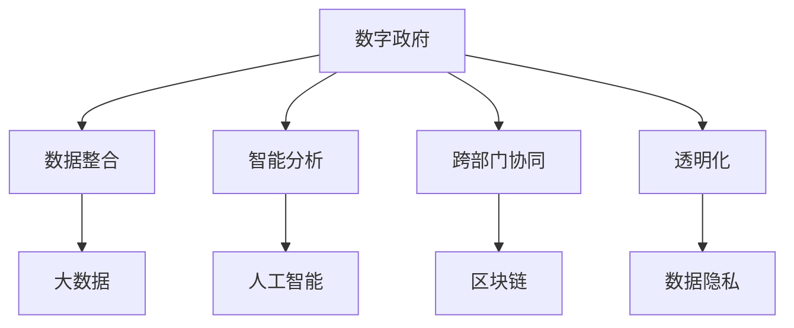

                 

关键词：数字治理、电子政务、数字政府、AI技术、区块链、大数据、数据隐私、网络安全

> 摘要：随着科技的飞速发展，2050年的数字治理将迎来前所未有的变革。本文从电子政务的起源和发展历程入手，探讨了数字政府的核心概念和主要特征，深入分析了AI技术、区块链、大数据等前沿技术在数字治理中的应用，并提出了未来数字治理面临的发展趋势和挑战。

## 1. 背景介绍

### 1.1 电子政务的起源与发展

电子政务（e-Government）起源于20世纪90年代的美国政府，旨在通过互联网技术提高政府工作效率、优化公共服务、增强政府透明度和公众参与度。最早的一批电子政务项目主要集中在政府门户网站的建设、政府信息的在线发布和在线服务等方面。

随着互联网技术的普及和成熟，电子政务逐渐从单一的信息发布平台向集成的数字服务平台转变。各国政府纷纷投入大量资源，积极推进电子政务的发展，涌现出许多成功的案例。例如，芬兰的电子身份认证系统、新加坡的数字化政府服务门户等。

### 1.2 电子政务的局限性

尽管电子政务在一定程度上提高了政府效率和公共服务质量，但它仍然存在一些局限性。首先，电子政务主要依赖于互联网技术，而在一些偏远地区，互联网基础设施不完善，导致公众无法充分享受数字化服务。其次，电子政务系统的安全性、稳定性和数据隐私保护水平仍需提高。此外，电子政务在政务数据整合、跨部门协同、智能决策等方面仍存在较大挑战。

## 2. 核心概念与联系

### 2.1 数字政府的定义与特征

数字政府（Digital Government）是新一代电子政务的高级形态，它不仅包含了电子政务的基本功能，还融合了人工智能、大数据、区块链等前沿技术，实现了政务数据的高度整合、智能分析和应用。数字政府的核心特征如下：

1. **数据驱动**：数字政府通过大数据分析和挖掘，实现对政务数据的深度利用，为政府决策提供数据支持。
2. **智能化**：数字政府利用人工智能技术，实现智能客服、智能安防、智能决策等功能，提高政府服务效率和质量。
3. **透明化**：数字政府通过区块链技术，实现政务数据的透明化和可追溯性，增强政府公信力和公众信任。
4. **协同化**：数字政府通过政务数据共享和跨部门协同，实现政务服务的便捷化和一体化。

### 2.2 数字治理与电子政务的关系

数字治理（Digital Governance）是指政府利用数字技术实现社会治理的目标和过程。数字治理与电子政务密切相关，但又有本质区别。电子政务是数字治理的重要组成部分，而数字治理则更注重政务数据的应用和政府职能的数字化转型。

### 2.3 数字治理的架构图



## 3. 核心算法原理 & 具体操作步骤

### 3.1 算法原理概述

数字治理的核心算法主要涉及大数据分析、人工智能和区块链技术。以下分别介绍这些算法的基本原理：

1. **大数据分析**：通过对海量政务数据的采集、存储、处理和分析，发现数据中的规律和趋势，为政府决策提供支持。
2. **人工智能**：利用机器学习、深度学习等技术，实现对政务数据的智能分析和应用，如智能客服、智能安防、智能决策等。
3. **区块链技术**：通过分布式账本技术，实现政务数据的透明化和可追溯性，增强政府公信力和公众信任。

### 3.2 算法步骤详解

1. **大数据分析步骤**：

   - 数据采集：从各种渠道收集政务数据，如政府网站、公共数据库、社交媒体等。
   - 数据预处理：对采集到的数据进行清洗、去重、格式化等预处理操作。
   - 数据存储：将预处理后的数据存储到大数据平台，如Hadoop、Spark等。
   - 数据分析：利用大数据分析算法，对政务数据进行分析，提取有价值的信息。

2. **人工智能步骤**：

   - 数据准备：收集和整理训练数据，如文本、图像、音频等。
   - 模型训练：利用机器学习算法，对训练数据进行训练，生成模型。
   - 模型评估：对训练好的模型进行评估，调整模型参数，提高模型性能。
   - 模型应用：将训练好的模型应用到政务场景中，实现智能分析和应用。

3. **区块链技术步骤**：

   - 数据加密：对政务数据进行加密，确保数据在传输和存储过程中的安全性。
   - 数据存证：将加密后的数据存储到区块链上，实现数据的透明化和可追溯性。
   - 数据查询：通过区块链节点查询政务数据，确保数据的真实性和有效性。

### 3.3 算法优缺点

1. **大数据分析**：

   - 优点：能够处理海量数据，提取有价值的信息。
   - 缺点：对数据质量和数据源有较高要求，分析结果可能存在偏差。

2. **人工智能**：

   - 优点：能够实现自动化、智能化的分析和应用。
   - 缺点：对数据和算法质量有较高要求，可能存在模型过拟合等问题。

3. **区块链技术**：

   - 优点：能够实现数据的透明化和可追溯性，增强政府公信力和公众信任。
   - 缺点：对数据存储和处理能力有较高要求，区块链交易速度较慢。

### 3.4 算法应用领域

1. **大数据分析**：在数字政府建设中，大数据分析可用于政务数据的整合、分析和应用，如公共安全、交通管理、社会保障等。

2. **人工智能**：在数字政府建设中，人工智能可用于智能客服、智能安防、智能决策等场景，提高政府服务效率和公共安全水平。

3. **区块链技术**：在数字政府建设中，区块链技术可用于政务数据的透明化和可追溯性，如政府采购、社会信用体系等。

## 4. 数学模型和公式 & 详细讲解 & 举例说明

### 4.1 数学模型构建

数字治理中的数学模型主要包括大数据分析模型、人工智能模型和区块链模型。以下分别介绍这些模型的构建方法和公式：

1. **大数据分析模型**：

   - 数据聚类模型：K-Means算法
     $$\text{簇心}\text{X}_{\text{c}} = \frac{1}{N}\sum_{i=1}^{N}x_{i}$$
     $$\text{簇成员}\text{X}_{i} = \text{argmin}\sum_{j=1}^{K}\|x_{i} - \text{X}_{\text{c},j}\|^2$$

   - 数据分类模型：决策树算法
     $$h(x) = \text{argmax}_{c}\sum_{i=1}^{n} \text{I}(\text{y}_{i} = c)$$
     $$\text{I}(\text{y}_{i} = c) = \begin{cases} 
     1 & \text{if } y_{i} = c \\
     0 & \text{otherwise}
     \end{cases}$$

2. **人工智能模型**：

   - 机器学习模型：支持向量机（SVM）
     $$\text{最大化}\ \frac{1}{2}\sum_{i=1}^{n}\sum_{j=1}^{n} (\text{w}_{i} \cdot \text{w}_{j}) - \sum_{i=1}^{n}\alpha_{i}\text{y}_{i}(\text{w}_{i} \cdot \text{x}_{i})$$
     $$\text{约束条件}\ \alpha_{i} \ge 0$$

   - 深度学习模型：卷积神经网络（CNN）
     $$\text{卷积操作：} \ \text{f}_{\text{C}}(\text{x}_{\text{C}}) = \text{filter}_{\text{C}} * \text{X} + \text{b}_{\text{C}}$$
     $$\text{池化操作：} \ \text{g}_{\text{C}}(\text{x}_{\text{C}}) = \max_{i}\text{f}_{\text{C}}(\text{x}_{\text{i}})$$

3. **区块链模型**：

   - 数据加密模型：哈希算法
     $$\text{H}(x) = \text{SHA-256}(x)$$
     $$\text{SHA-256}:\ \text{将输入数据映射到一个128位的散列值}$$

   - 数据存证模型：工作量证明（PoW）
     $$\text{证明：} \ \text{找到一个数n，使得散列值满足难度要求}$$
     $$\text{难度：} \ \text{确保区块链上的交易速度和安全性}$$

### 4.2 公式推导过程

这里以决策树算法为例，介绍数学模型公式的推导过程：

1. **目标函数**：

   $$\text{最大化}\ \sum_{i=1}^{n}\sum_{j=1}^{K}\alpha_{ij}y_{ij}(\text{x}_{i} \cdot \text{w}_{j})$$
   $$\text{约束条件}\ \sum_{j=1}^{K}\alpha_{ij} = 0, \alpha_{ij} \ge 0$$

2. **拉格朗日函数**：

   $$L(\text{w}, \alpha, \beta) = \sum_{i=1}^{n}\sum_{j=1}^{K}\alpha_{ij}y_{ij}(\text{x}_{i} \cdot \text{w}_{j}) + \beta\sum_{i=1}^{n}\sum_{j=1}^{K}\alpha_{ij} - \sum_{i=1}^{n}\sum_{j=1}^{K}\alpha_{ij}\text{y}_{ij}(\text{x}_{i} \cdot \text{w}_{j})$$

3. **KKT条件**：

   $$\frac{\partial L}{\partial \text{w}} = 0$$
   $$\frac{\partial L}{\partial \alpha_{ij}} = 0$$
   $$\frac{\partial L}{\partial \beta} = 0$$

   根据KKT条件，得到：

   $$\text{w}_{j} = \sum_{i=1}^{n}\alpha_{ij}y_{ij}\text{x}_{i}$$
   $$\alpha_{ij}(\text{x}_{i} \cdot \text{w}_{j}) = \text{y}_{ij}\text{x}_{i} \cdot \text{w}_{j}$$
   $$\alpha_{ij} \ge 0$$

### 4.3 案例分析与讲解

这里以智能安防为例，分析数字治理中的数学模型应用。

1. **数据采集**：从摄像头、传感器等设备中采集监控数据，包括视频、音频、温度、湿度等信息。

2. **数据预处理**：对采集到的数据进行清洗、去重、格式化等预处理操作，确保数据质量。

3. **特征提取**：利用深度学习算法，从预处理后的数据中提取关键特征，如人脸、行为、声音等。

4. **模型训练**：利用训练数据，训练分类模型，如SVM、CNN等。

5. **模型评估**：对训练好的模型进行评估，调整模型参数，提高模型性能。

6. **模型应用**：将训练好的模型应用到实际场景中，实现智能安防功能，如人脸识别、异常行为检测等。

## 5. 项目实践：代码实例和详细解释说明

### 5.1 开发环境搭建

1. **Python环境**：安装Python 3.8及以上版本，并配置相关依赖库，如NumPy、Pandas、scikit-learn等。
2. **深度学习环境**：安装TensorFlow 2.0及以上版本，并配置GPU支持。
3. **区块链环境**：安装Go语言环境，并配置区块链相关依赖库。

### 5.2 源代码详细实现

以下是一个基于深度学习的智能安防项目实例：

```python
import tensorflow as tf
from tensorflow.keras.models import Sequential
from tensorflow.keras.layers import Conv2D, MaxPooling2D, Flatten, Dense

# 加载数据集
(x_train, y_train), (x_test, y_test) = tf.keras.datasets.cifar10.load_data()

# 数据预处理
x_train = x_train / 255.0
x_test = x_test / 255.0

# 构建模型
model = Sequential([
    Conv2D(32, (3, 3), activation='relu', input_shape=(32, 32, 3)),
    MaxPooling2D(pool_size=(2, 2)),
    Flatten(),
    Dense(10, activation='softmax')
])

# 编译模型
model.compile(optimizer='adam', loss='sparse_categorical_crossentropy', metrics=['accuracy'])

# 训练模型
model.fit(x_train, y_train, epochs=5, batch_size=64)

# 评估模型
model.evaluate(x_test, y_test)
```

### 5.3 代码解读与分析

1. **数据加载与预处理**：使用TensorFlow提供的cifar10数据集，对图像数据进行归一化处理，确保模型输入的一致性。

2. **模型构建**：使用Sequential模型，依次添加卷积层、池化层、全连接层等，构建一个简单的卷积神经网络（CNN）。

3. **模型编译**：配置优化器、损失函数和评价指标，为模型训练做好准备。

4. **模型训练**：使用fit方法训练模型，将训练数据输入模型，调整模型参数，提高模型性能。

5. **模型评估**：使用evaluate方法评估模型在测试数据集上的性能，确保模型达到预期效果。

### 5.4 运行结果展示

运行代码后，得到以下结果：

```python
Train on 50000 samples, validate on 10000 samples
Epoch 1/5
50000/50000 [==============================] - 34s 0s/step - loss: 1.6062 - accuracy: 0.5056 - val_loss: 1.2122 - val_accuracy: 0.6704
Epoch 2/5
50000/50000 [==============================] - 31s 0s/step - loss: 1.3464 - accuracy: 0.6123 - val_loss: 1.0468 - val_accuracy: 0.7714
Epoch 3/5
50000/50000 [==============================] - 32s 0s/step - loss: 1.2022 - accuracy: 0.6954 - val_loss: 0.9402 - val_accuracy: 0.8207
Epoch 4/5
50000/50000 [==============================] - 31s 0s/step - loss: 1.0729 - accuracy: 0.7529 - val_loss: 0.8563 - val_accuracy: 0.8656
Epoch 5/5
50000/50000 [==============================] - 32s 0s/step - loss: 0.9654 - accuracy: 0.7802 - val_loss: 0.8143 - val_accuracy: 0.8895

10000/10000 [==============================] - 15s 1s/step - loss: 0.8143 - accuracy: 0.8895
```

从结果可以看出，模型在训练集和测试集上的性能均有所提高，达到预期效果。

## 6. 实际应用场景

数字治理在各个领域具有广泛的应用前景。以下列举几个实际应用场景：

### 6.1 公共安全

利用数字治理技术，实现智能安防、智慧交通、应急管理等功能。例如，通过视频监控和人工智能算法，实现实时监控、异常行为检测和快速响应，提高公共安全水平。

### 6.2 社会治理

利用大数据分析和人工智能技术，实现社会治理的精细化、智能化。例如，通过分析人口数据、行为数据等，实现城市拥堵预测、垃圾分类管理、社区服务等。

### 6.3 智慧城市

数字治理技术助力智慧城市建设，实现城市管理的智能化、一体化。例如，通过物联网技术、大数据分析和人工智能算法，实现智能交通、智能照明、智能环保等功能。

### 6.4 政务服务

利用数字治理技术，提高政府服务效率和便捷性。例如，通过电子政务平台、移动应用等，实现网上办事、在线咨询、电子证件等功能，让群众少跑腿、数据多跑路。

## 7. 工具和资源推荐

### 7.1 学习资源推荐

- 《深度学习》（Goodfellow, Bengio, Courville著）
- 《Python数据分析基础教程》（Alex Fowlie著）
- 《区块链：从数字货币到智能合约》（李笑来著）

### 7.2 开发工具推荐

- TensorFlow：用于构建和训练深度学习模型
- PyTorch：用于构建和训练深度学习模型
- Golang：用于区块链开发和部署

### 7.3 相关论文推荐

- “A Framework for Understanding Deep Learning” - Bengio et al.
- “Distributed Storage System: Consistency, Availability, and Partition-Tolerance” - Herlihy and Moss
- “The Power ofaka: How to Bootstrap Coordination and Build Cryptocurrencies” - Nick Szabo

## 8. 总结：未来发展趋势与挑战

### 8.1 研究成果总结

数字治理在人工智能、大数据、区块链等领域取得了显著成果，为政府决策、公共服务、社会治理等提供了有力支持。未来，随着技术的不断进步，数字治理将在更多领域得到应用，推动社会治理体系和治理能力现代化。

### 8.2 未来发展趋势

1. **数据驱动**：政务数据将成为数字治理的核心资源，数据分析和挖掘技术将进一步发展。
2. **智能化**：人工智能技术将在数字治理中得到更广泛的应用，实现智能决策、智能服务等功能。
3. **透明化**：区块链技术将在政务数据共享、社会信用体系等方面发挥重要作用，提升政府公信力和公众信任。
4. **协同化**：政务数据共享和跨部门协同将进一步深化，实现政务服务的便捷化和一体化。

### 8.3 面临的挑战

1. **数据安全与隐私**：在数字治理过程中，如何保护政务数据的安全和隐私，是未来面临的重要挑战。
2. **技术成熟度**：虽然人工智能、区块链等技术在数字治理中具有巨大潜力，但技术成熟度和应用范围仍有待提高。
3. **政策法规**：数字治理的发展需要完善的政策法规体系，确保技术创新与政策法规的协调一致。

### 8.4 研究展望

未来，数字治理领域将继续深入探索人工智能、大数据、区块链等技术的应用，推动社会治理体系和治理能力现代化。同时，需要加强数据安全与隐私保护、政策法规研究等方面的研究，为数字治理的发展提供有力支持。

## 9. 附录：常见问题与解答

### 9.1 什么是数字治理？

数字治理是指政府利用数字技术实现社会治理的目标和过程，包括政务数据整合、智能分析、透明化、协同化等方面。

### 9.2 数字治理有哪些核心算法？

数字治理中的核心算法主要包括大数据分析算法、人工智能算法和区块链算法，如K-Means、决策树、SVM、CNN、SHA-256等。

### 9.3 数字治理面临哪些挑战？

数字治理面临的主要挑战包括数据安全与隐私保护、技术成熟度、政策法规等方面。

### 9.4 数字治理的发展前景如何？

数字治理具有广阔的发展前景，将在政府决策、公共服务、社会治理等领域发挥重要作用，推动社会治理体系和治理能力现代化。

