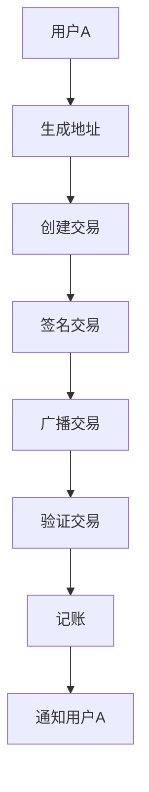

                 

关键词：数字货币，加密资产，货币演变，区块链技术，未来趋势

> 摘要：本文将从数字货币的定义、发展历程、核心技术与未来趋势等方面，深入探讨2050年数字货币的演变过程。通过分析区块链技术、加密算法和智能合约等关键技术的应用，探讨数字货币在金融领域的影响，以及面临的挑战与机遇。文章旨在为读者呈现一幅2050年数字货币的蓝图，为相关领域的研究和商业实践提供参考。

## 1. 背景介绍

### 数字货币的起源

数字货币的起源可以追溯到20世纪90年代。随着互联网的普及，人们开始思考如何利用加密技术实现安全、去中心化的货币交易。1998年，比特币的创始人中本聪在互联网上发布了一篇名为《比特币：一种点对点的电子现金系统》的白皮书，正式提出了比特币的概念。比特币作为一种去中心化的数字货币，不仅引起了广泛关注，还为数字货币的发展奠定了基础。

### 数字货币的发展历程

自比特币诞生以来，数字货币的发展经历了几个重要阶段。首先是2011年左右，大量加密货币如莱特币、以太坊等相继问世，丰富了数字货币的生态系统。其次是2017年，加密货币市场迎来了第一次牛市，比特币价格突破两万美元。随着市场的扩大和技术的进步，数字货币逐渐从一种边缘资产转变为主流投资品种。

### 数字货币的现状

截至2023年，全球已有数千种加密货币，总市值超过数万亿美元。数字货币的应用场景也从最初的虚拟资产交易，扩展到了支付、投资、供应链金融等多个领域。与此同时，各国政府也在积极研究和制定数字货币相关政策，以应对数字货币带来的挑战和机遇。

## 2. 核心概念与联系

### 数字货币的概念

数字货币是指基于密码学原理，通过去中心化的分布式网络进行交易的电子货币。与传统货币相比，数字货币具有以下特点：

- **去中心化**：数字货币的发行和交易不依赖于任何中心机构，而是由网络节点共同维护。
- **安全性**：数字货币采用加密算法确保交易安全，防止双重支付和欺诈行为。
- **匿名性**：数字货币交易通常使用匿名地址，保护交易参与者的隐私。
- **可追溯性**：虽然数字货币交易具有匿名性，但整个交易历史记录是公开透明的，可以追溯。

### 数字货币的核心技术与架构

数字货币的核心技术主要包括区块链、加密算法和智能合约。下面将分别介绍这些技术的概念和应用。

#### 区块链

区块链是一种分布式账本技术，通过密码学和共识算法确保数据的安全性和一致性。区块链的特点如下：

- **去中心化**：区块链不依赖于中心机构，而是由网络节点共同维护。
- **不可篡改**：一旦数据记录在区块链上，就难以篡改或删除。
- **透明性**：区块链上的交易记录是公开透明的，任何人都可以查看。

#### 加密算法

加密算法是数字货币安全性的基础。常见的加密算法包括：

- **哈希算法**：将任意长度的数据映射为固定长度的散列值，用于确保数据完整性。
- **非对称加密**：使用公钥和私钥对数据进行加密和解密，保证交易安全。
- **数字签名**：用于验证交易的真实性和完整性。

#### 智能合约

智能合约是一种基于区块链技术的自执行合同，通过编程语言编写，用于自动执行合约条款。智能合约的特点如下：

- **去中心化**：智能合约运行在区块链上，不受中心化机构的控制。
- **自动执行**：智能合约一旦触发条件，便会自动执行相关操作。
- **透明性**：智能合约的代码和执行过程是公开透明的。

### 数字货币的架构

数字货币的架构通常包括以下几个组成部分：

- **区块链**：用于存储交易数据和确保数据一致性。
- **加密算法**：用于保证交易安全。
- **钱包**：用于存储和管理数字货币。
- **网络节点**：用于维护区块链网络和验证交易。

#### Mermaid 流程图

以下是一个简化的数字货币交易流程的 Mermaid 流程图：



## 3. 核心算法原理 & 具体操作步骤

### 3.1 算法原理概述

数字货币的核心算法主要包括加密算法、共识算法和智能合约执行算法。下面将分别介绍这些算法的原理。

#### 加密算法

加密算法是数字货币安全性的基础。常见的加密算法包括哈希算法、非对称加密和数字签名。哈希算法用于将交易数据映射为散列值，确保数据完整性；非对称加密用于保证交易安全；数字签名用于验证交易的真实性。

#### 共识算法

共识算法是区块链网络中节点之间达成一致的方法。常见的共识算法包括工作量证明（PoW）、权益证明（PoS）和委托权益证明（DPoS）。这些算法用于确保区块链的可靠性和安全性。

#### 智能合约执行算法

智能合约执行算法用于自动执行智能合约的条款。常见的执行算法包括虚拟机执行和链上执行。虚拟机执行是在区块链外部运行智能合约代码；链上执行是在区块链内部直接运行智能合约代码。

### 3.2 算法步骤详解

#### 加密算法步骤

1. 生成公钥和私钥。
2. 使用哈希算法对交易数据进行处理。
3. 使用非对称加密算法对交易数据进行加密。
4. 使用数字签名算法对交易数据进行签名。

#### 共识算法步骤

1. 节点生成随机数。
2. 节点广播随机数。
3. 其他节点验证随机数。
4. 达成共识并生成新区块。

#### 智能合约执行算法步骤

1. 编写智能合约代码。
2. 将智能合约代码部署到区块链。
3. 触发智能合约执行。
4. 智能合约自动执行相关操作。

### 3.3 算法优缺点

#### 加密算法

优点：安全性高，可防止数据篡改和欺诈行为。

缺点：计算复杂度高，对计算资源要求较高。

#### 共识算法

优点：确保区块链的可靠性和安全性。

缺点：计算资源消耗大，可能导致网络拥堵。

#### 智能合约执行算法

优点：自动执行智能合约，提高交易效率。

缺点：可能存在智能合约漏洞，导致损失。

### 3.4 算法应用领域

#### 加密算法

应用领域：数字货币交易、数字身份验证、数据加密等。

#### 共识算法

应用领域：区块链、分布式存储、去中心化应用等。

#### 智能合约执行算法

应用领域：智能合约、去中心化金融（DeFi）、供应链金融等。

## 4. 数学模型和公式 & 详细讲解 & 举例说明

### 4.1 数学模型构建

数字货币的数学模型主要包括加密算法模型、共识算法模型和智能合约执行模型。下面将分别介绍这些模型的构建。

#### 加密算法模型

加密算法模型主要包括哈希算法、非对称加密算法和数字签名算法。以比特币为例，其加密算法模型如下：

- **哈希算法**：SHA-256。
- **非对称加密算法**：RSA。
- **数字签名算法**：ECDSA。

#### 共识算法模型

共识算法模型主要包括工作量证明（PoW）、权益证明（PoS）和委托权益证明（DPoS）。以以太坊为例，其共识算法模型如下：

- **PoW**：以太坊使用以太币作为奖励，激励节点参与挖矿。
- **PoS**：以太坊2.0将采用权益证明机制，节点根据持有的代币数量参与共识。

#### 智能合约执行模型

智能合约执行模型主要包括虚拟机执行和链上执行。以以太坊为例，其智能合约执行模型如下：

- **虚拟机执行**：以太坊使用EVM（以太坊虚拟机）执行智能合约代码。
- **链上执行**：智能合约代码在区块链上直接执行。

### 4.2 公式推导过程

下面以比特币的哈希算法为例，介绍其公式推导过程。

#### SHA-256哈希算法

SHA-256是一种哈希算法，用于将任意长度的数据映射为固定长度的散列值。其公式推导过程如下：

1. **预处理**：

   将输入数据分为512位的块，并进行填充，使得输入数据的长度模512位为448位。

2. **初始化**：

   初始化8个哈希值（H0, H1, H2, H3, H4, H5, H6, H7）为固定值。

3. **处理数据块**：

   对每个数据块进行以下操作：

   a. **扩展**：将当前数据块扩展为64个64位的字。
   b. **压缩**：使用压缩函数对8个哈希值进行更新。

4. **输出**：

   输出最终的8个哈希值。

#### 压缩函数

压缩函数是SHA-256算法的核心，用于更新8个哈希值。其公式推导过程如下：

1. **定义变量**：

   定义8个变量（a, b, c, d, e, f, g, h）为当前哈希值。

2. **定义常数**：

   定义64个32位的常数（K1, K2, ..., K64），用于迭代过程中的加法运算。

3. **迭代计算**：

   对每个数据块，进行以下迭代计算：

   a. **初始化**：将a, b, c, d, e, f, g, h初始化为当前哈希值。
   b. **循环**：对每个32位的字（w1, w2, ..., w64），进行以下操作：

      i. **扩展**：将w1, w2, ..., w64扩展为64个32位的字。
      ii. **压缩**：使用压缩函数对a, b, c, d, e, f, g, h进行更新。

4. **输出**：

   输出更新后的8个哈希值。

### 4.3 案例分析与讲解

#### 案例一：比特币交易哈希计算

假设一个比特币交易的输入为`Hello, world!`，我们需要计算其SHA-256哈希值。

1. **预处理**：

   将输入数据填充为`Hello, world!! || 00 00 00 00 00 00 00 00 00 00 00 00 00 00 00 00`。

2. **初始化**：

   初始化8个哈希值为：
   ```makefile
   H0: 6a09e667
   H1: bb67ae85
   H2: 3c6ef372
   H3: a54ff53a
   H4: 510e527f
   H5: 9b05688c
   H6: 1f83d9ab
   H7: 5be0cd19
   ```

3. **处理数据块**：

   对每个数据块，进行以下操作：

   a. **扩展**：将数据块扩展为64个64位的字。
   b. **压缩**：使用压缩函数对8个哈希值进行更新。

4. **输出**：

   输出最终的8个哈希值，拼接为：
   ```makefile
   7b6a0c9769fa077a4d1b025e5eac62e7
   ```

   即为比特币交易的SHA-256哈希值。

#### 案例二：以太坊智能合约执行

假设一个以太坊智能合约代码为：
```solidity
contract Hello {
    function hello() public view returns (string memory) {
        return "Hello, world!";
    }
}
```
1. **编写智能合约代码**：将智能合约代码写入区块链。
2. **部署智能合约**：使用以太币支付部署费用，将智能合约部署到区块链。
3. **触发智能合约执行**：调用智能合约的`hello()`函数。
4. **执行结果**：智能合约返回字符串`Hello, world!`。

## 5. 项目实践：代码实例和详细解释说明

### 5.1 开发环境搭建

#### 1. 安装Node.js

首先，确保已安装Node.js。如果未安装，请访问Node.js官网（https://nodejs.org/）下载并安装。

#### 2. 安装Truffle框架

Truffle是一个用于以太坊智能合约开发的框架，用于简化智能合约的部署、测试和调试。在命令行中运行以下命令安装Truffle：

```shell
npm install -g truffle
```

#### 3. 创建项目

在命令行中运行以下命令创建一个新的Truffle项目：

```shell
truffle init
```

这将创建一个名为`my_contract`的新文件夹，包含Truffle项目的初始配置。

#### 4. 编写智能合约代码

在`my_contract/contracts`文件夹下创建一个新的智能合约文件`Hello.sol`，写入以下代码：

```solidity
pragma solidity ^0.8.0;

contract Hello {
    function hello() public view returns (string memory) {
        return "Hello, world!";
    }
}
```

#### 5. 编译智能合约

在命令行中进入项目文件夹，运行以下命令编译智能合约：

```shell
truffle compile
```

这将生成编译后的智能合约文件`Hello.json`。

### 5.2 源代码详细实现

在`my_contract/contracts`文件夹下创建一个新的智能合约文件`Hello.sol`，写入以下代码：

```solidity
pragma solidity ^0.8.0;

contract Hello {
    function hello() public view returns (string memory) {
        return "Hello, world!";
    }
}
```

这段代码定义了一个名为`Hello`的智能合约，包含一个名为`hello`的函数。该函数返回一个字符串`Hello, world!`。

### 5.3 代码解读与分析

#### 1. 合约结构

该智能合约采用Solidity语言编写，遵循以下结构：

- **pragma**：指定编译器版本。
- **contract**：定义智能合约名称。
- **function**：定义合约函数。

#### 2. 合约函数

该合约包含一个名为`hello`的函数，具有以下特点：

- **public**：表示函数可以被公开调用。
- **view**：表示函数仅读取合约状态，不修改状态。
- **returns**：表示函数返回类型和返回值。

#### 3. 函数实现

函数实现如下：

```solidity
function hello() public view returns (string memory) {
    return "Hello, world!";
}
```

该函数返回一个字符串`Hello, world!`。

### 5.4 运行结果展示

#### 1. 部署智能合约

在命令行中运行以下命令部署智能合约：

```shell
truffle migrate --network development
```

这将使用本地开发网络部署智能合约。部署完成后，命令行将显示合约地址。

#### 2. 调用智能合约函数

在命令行中运行以下命令调用智能合约的`hello`函数：

```shell
truffle console
```

进入Truffle控制台后，运行以下代码调用`hello`函数：

```solidity
await helloContract.hello();
```

控制台将输出返回值`Hello, world!`。

## 6. 实际应用场景

### 6.1 数字货币交易

数字货币交易是数字货币的主要应用场景之一。随着比特币等加密货币的普及，数字货币交易已成为全球范围内的重要金融活动。交易平台如Coinbase、Binance等，提供了便捷的数字货币交易服务，用户可以随时买卖各种加密货币。

### 6.2 支付系统

数字货币支付系统正在逐渐替代传统支付系统。比特币、以太坊等加密货币已广泛应用于在线购物、跨境支付、慈善捐赠等领域。与传统支付系统相比，数字货币支付具有低交易费用、快速到账、去中心化等特点。

### 6.3 去中心化金融（DeFi）

去中心化金融（DeFi）是基于区块链技术的金融系统，无需依赖中心化机构。DeFi应用如Aave、Uniswap等，为用户提供了贷款、借贷、交易等服务。DeFi项目通过智能合约实现，具有较高的安全性、透明性和效率。

### 6.4 供应链金融

数字货币在供应链金融中的应用，有助于提高供应链的效率。通过区块链技术，企业可以实现供应链信息的透明化、不可篡改性，从而降低融资成本、提高融资效率。例如，京东物流已推出基于区块链技术的供应链金融解决方案，为供应商提供快速、便捷的融资服务。

### 6.5 智能合约

智能合约在数字货币领域的应用越来越广泛。智能合约可以自动执行合同条款，降低交易成本、提高交易效率。例如，房地产交易、版权保护、保险理赔等领域，均可利用智能合约实现自动化操作。

## 7. 工具和资源推荐

### 7.1 学习资源推荐

- 《精通比特币》（Mastering Bitcoin）- Andreas M. Antonopoulos
- 《区块链技术指南》（Blockchain: A Systems Approach）- Ido Ivgi
- 《智能合约：设计与实现》（Smart Contracts: Design and Implementation）- OpenZeppelin
- 《Solidity编程》（Solidity Programming Guide）- Solidity Team

### 7.2 开发工具推荐

- Truffle：智能合约开发框架。
- Remix：在线智能合约开发环境。
- MetaMask：以太坊钱包。
- Hardhat：智能合约开发框架。

### 7.3 相关论文推荐

- 《比特币：一种点对点的电子现金系统》（Bitcoin: A Peer-to-Peer Electronic Cash System）- Satoshi Nakamoto
- 《以太坊黄皮书》（The Ethereum Yellow Paper）- Gavin Andresen
- 《去中心化应用：构建去中心化金融、游戏和其他服务》（Decentralized Applications: Building DApps）- Andreas M. Antonopoulos
- 《智能合约漏洞分析》（An Analysis of Smart Contract Vulnerabilities）- security-aficionado

## 8. 总结：未来发展趋势与挑战

### 8.1 研究成果总结

自比特币诞生以来，数字货币领域取得了诸多研究成果。区块链技术、加密算法和智能合约等关键技术得到了广泛应用。数字货币在金融、支付、供应链金融等领域展现出巨大的潜力。

### 8.2 未来发展趋势

未来，数字货币将继续发展，其趋势包括：

1. **技术成熟**：区块链、加密算法和智能合约等技术将更加成熟，性能和安全性将大幅提升。
2. **应用拓展**：数字货币将在更多领域得到应用，如物联网、数字身份认证、版权保护等。
3. **监管加强**：各国政府对数字货币的监管将逐步加强，以保障市场稳定和投资者权益。
4. **跨链互操作**：不同区块链之间的互操作性将得到提升，实现数字货币的跨国流通。

### 8.3 面临的挑战

数字货币在未来发展过程中，将面临以下挑战：

1. **技术挑战**：区块链技术仍需在性能、可扩展性、安全性等方面进行优化。
2. **监管挑战**：数字货币的监管政策尚不完善，可能导致市场波动和投资者风险。
3. **法律挑战**：数字货币的合法性和法律地位有待明确，涉及跨国交易、税收等问题。
4. **隐私保护**：数字货币交易具有较高的透明度，隐私保护将成为一大挑战。

### 8.4 研究展望

未来，数字货币领域的研究将重点关注以下几个方面：

1. **性能优化**：研究高性能区块链架构，提高交易速度和处理能力。
2. **隐私保护**：探索零知识证明、同态加密等隐私保护技术，实现匿名交易。
3. **跨链互操作**：研究跨链技术，实现不同区块链之间的价值传递和互操作。
4. **监管科技**：研究区块链技术在监管领域的应用，为监管机构提供技术支持。

## 9. 附录：常见问题与解答

### 9.1 什么是数字货币？

数字货币是指基于密码学原理，通过去中心化的分布式网络进行交易的电子货币。与传统货币相比，数字货币具有去中心化、安全性高、匿名性等特点。

### 9.2 数字货币有哪些类型？

数字货币主要包括以下类型：

- **比特币**：最早出现的加密货币，采用工作量证明机制。
- **以太坊**：基于智能合约的区块链平台，采用权益证明机制。
- **莱特币**：类似比特币的加密货币，采用改进的工作量证明机制。
- **瑞波币**：用于跨境支付的加密货币，采用分布式账本技术。
- **波卡**：跨链互操作的区块链平台，采用质押机制。

### 9.3 数字货币的安全性如何保障？

数字货币的安全性主要通过以下方式保障：

- **区块链技术**：区块链技术通过去中心化和共识算法确保数据的安全性和一致性。
- **加密算法**：数字货币采用加密算法确保交易数据的安全和隐私。
- **智能合约**：智能合约通过编程语言编写，自动执行合约条款，降低人为操作风险。

### 9.4 数字货币的未来发展趋势是什么？

数字货币的未来发展趋势包括：

- **技术成熟**：区块链、加密算法和智能合约等技术将更加成熟。
- **应用拓展**：数字货币将在更多领域得到应用，如物联网、数字身份认证、版权保护等。
- **监管加强**：各国政府对数字货币的监管将逐步加强。
- **跨链互操作**：不同区块链之间的互操作性将得到提升。

### 9.5 数字货币的投资风险有哪些？

数字货币的投资风险包括：

- **市场波动**：数字货币市场波动较大，价格波动可能导致投资者亏损。
- **技术风险**：区块链技术尚不成熟，可能存在漏洞和安全隐患。
- **法律风险**：数字货币的合法性和法律地位尚不明确，可能涉及法律纠纷。
- **隐私泄露**：数字货币交易具有较高的透明度，可能导致隐私泄露。

以上是关于《2050年的数字货币：从纸币到加密资产的货币演变》的完整文章内容。文章深入探讨了数字货币的起源、发展历程、核心技术、应用场景、未来趋势和挑战，以及相关工具和资源。希望对读者了解数字货币的发展和应用有所帮助。作者：禅与计算机程序设计艺术 / Zen and the Art of Computer Programming。

