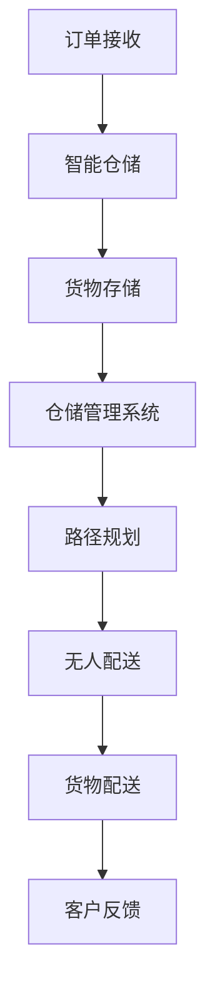

                 

### 关键词 Keywords

- 智慧物流
- 智能仓储
- 无人配送
- 物流自动化
- 物流管理
- AI技术
- 机器人技术
- 自动化设备
- 物联网

### 摘要 Abstract

本文将探讨2050年智慧物流的远景，分析智能仓储与无人配送在物流自动化中的核心作用。通过深入理解当前技术发展现状，结合未来趋势预测，本文将探讨如何通过人工智能、机器学习和物联网技术实现物流领域的全面自动化。文章还将涉及相关的数学模型、算法原理，以及实际项目中的代码实例，同时提出未来应用的展望和面临的挑战。通过本文的阅读，读者将了解到智慧物流如何改变未来的物流管理和配送模式，以及在这一过程中所需的工具和资源。

## 1. 背景介绍

物流行业在过去的几十年中经历了巨大的变革。从传统的手工操作到自动化设备和系统的应用，物流行业的效率和准确性得到了显著提升。然而，随着全球贸易的日益增长和消费者需求的不断变化，物流行业面临着新的挑战。一方面，订单量和配送速度的快速增长对物流系统的灵活性和响应速度提出了更高的要求；另一方面，资源浪费、环境污染和人力成本的增加成为制约物流行业发展的瓶颈。

### 智慧物流的概念

智慧物流是物流行业的未来发展愿景，它融合了人工智能、物联网、大数据和自动化技术，旨在通过智能化的手段优化物流流程，提高物流效率，减少资源浪费。智慧物流的核心在于“智慧”，即通过技术手段实现物流系统的高度智能化，使其能够自主决策、优化路径和资源分配。

### 当前物流行业的挑战

- **订单量激增**：随着电子商务的快速发展，物流订单量呈现爆发式增长，这对物流系统的处理能力和灵活性提出了更高的要求。
- **配送速度要求高**：消费者对快速配送的需求日益增长，物流企业需要在短时间内完成订单配送。
- **资源浪费**：传统的物流模式中存在大量的资源浪费，如库存管理不当、运输路线不合理等，导致成本上升和效率降低。
- **环境污染**：物流活动产生的碳排放和环境污染问题日益突出，需要通过绿色物流技术来降低环境影响。
- **人力成本**：物流行业的劳动力需求大，且人力成本不断上升，自动化技术的应用成为降低成本的必要手段。

### 智慧物流的重要性

智慧物流不仅能够提高物流效率，降低成本，还能减少资源浪费和环境污染，具有以下重要性：

- **提高效率**：通过智能化的物流管理系统，可以优化订单处理、库存管理和运输路径，提高整体物流效率。
- **降低成本**：自动化设备和智能算法的应用可以减少人力成本和资源浪费，降低运营成本。
- **提升服务质量**：智能化的物流系统能够提供更准确、更快速的配送服务，提升客户满意度。
- **促进可持续发展**：智慧物流通过降低碳排放和资源浪费，有助于实现绿色物流，促进可持续发展。

综上所述，智慧物流不仅是物流行业发展的必然趋势，也是应对当前挑战的有效手段。随着技术的不断进步，智慧物流将在未来发挥更加重要的作用，引领物流行业迈向新的发展阶段。

## 2. 核心概念与联系

### 智能仓储

智能仓储是智慧物流体系中的关键环节，它通过先进的技术手段，如自动化设备和人工智能算法，实现仓储管理的智能化。智能仓储的核心在于利用传感器、RFID（射频识别）技术、自动化搬运设备等，实现对货物的实时监控和管理。

#### 架构

智能仓储系统通常包括以下核心模块：

1. **传感器网络**：用于实时监控仓库环境，包括温度、湿度、货架高度等，确保货物存储在最佳条件下。
2. **自动搬运设备**：如自动导引车（AGV）、堆垛机等，用于自动搬运货物，提高仓储作业效率。
3. **仓储管理系统（WMS）**：用于管理货物的入库、出库、库存跟踪等操作，通过人工智能算法优化仓储布局和作业流程。
4. **数据分析与决策支持系统**：通过收集和分析仓储运营数据，提供库存优化、路径优化等决策支持。

#### 工作原理

智能仓储的工作原理主要包括以下几个步骤：

1. **入库**：货物通过扫描RFID标签或条形码，被自动识别并记录到仓储管理系统中。
2. **存储**：自动搬运设备根据仓储管理系统分配的存储位置，将货物放置到相应的货架上。
3. **库存管理**：仓储管理系统实时更新库存信息，通过数据分析和预测，优化库存水平。
4. **出库**：根据订单需求，仓储管理系统自动分配货物出库，并通过自动搬运设备将货物拣选到指定的运输工具上。
5. **数据监控**：通过传感器网络，实现对仓储环境的实时监控，确保货物安全。

### 无人配送

无人配送是智慧物流体系中的另一重要组成部分，它通过无人驾驶车辆和无人机等自动化设备，实现从仓库到客户手中的最后一公里配送。

#### 架构

无人配送系统通常包括以下核心模块：

1. **无人驾驶车辆**：如自动驾驶汽车、无人配送车等，用于在地面上自动行驶和配送货物。
2. **无人机配送系统**：用于在空中进行快递配送，覆盖无法由地面配送车辆到达的区域。
3. **路径规划系统**：利用人工智能算法，实时规划最优配送路径，避免交通拥堵和障碍物。
4. **配送管理系统**：用于管理订单处理、配送进度、客户反馈等操作。

#### 工作原理

无人配送的工作原理主要包括以下几个步骤：

1. **订单接收**：无人配送系统接收配送订单，包括起点、终点、配送物品等信息。
2. **路径规划**：路径规划系统根据实时交通情况和配送地址，自动生成最优配送路径。
3. **货物装载**：无人驾驶车辆或无人机将货物装载到配送设备上。
4. **自动配送**：根据规划的路径，无人驾驶车辆或无人机自动行驶到客户位置，进行货物交付。
5. **客户反馈**：配送完成后，系统自动收集客户反馈，用于后续服务改进。

### 智能仓储与无人配送的联系

智能仓储和无人配送在智慧物流体系中相辅相成，共同构成了物流自动化的核心。智能仓储通过自动化设备和智能管理，实现货物的高效存储和管理；无人配送则通过无人驾驶技术和无人机配送，实现货物的快速、准确配送。两者的结合，不仅提高了物流效率，还减少了人力成本和资源浪费，推动了物流行业的智能化发展。

### Mermaid 流程图

下面是一个简化的智能仓储与无人配送系统的 Mermaid 流程图，展示了两个系统之间的关键联系：



### 实际应用案例

#### 智能仓储

亚马逊在其仓储系统中广泛应用了自动化设备，如自动导引车（AGV）和堆垛机，实现了货物的高效存储和管理。通过智能仓储系统，亚马逊能够实时跟踪库存，优化存储布局，提高订单处理速度。

#### 无人配送

京东在其无人配送项目中，使用了无人驾驶汽车和无人机进行最后一公里配送。通过智能路径规划和无人驾驶技术，京东能够快速、准确地将商品送达客户手中，提升了配送效率。

综上所述，智能仓储和无人配送作为智慧物流体系的核心组成部分，正逐步改变着物流行业的运作模式。随着技术的不断进步，这些系统将在未来发挥更加重要的作用，推动物流行业的智能化发展。

## 3. 核心算法原理 & 具体操作步骤

### 3.1 算法原理概述

在智慧物流系统中，核心算法的原理至关重要，它们决定了智能仓储和无人配送系统的性能和效率。以下将介绍几项关键算法原理，包括路径规划算法、机器学习算法以及传感器数据处理算法。

#### 路径规划算法

路径规划算法是无人配送系统的核心，其目标是找到从起点到终点的最优路径。常用的路径规划算法包括：

1. **A*算法**：基于启发式搜索，通过计算起点和终点之间的最短路径。
2. **Dijkstra算法**：基于图论，用于计算单源最短路径。
3. **Dijkstra-Light算法**：对Dijkstra算法的优化版本，适用于大规模路径规划问题。

#### 机器学习算法

机器学习算法在智慧物流中主要用于预测和分析。以下几种算法在智慧物流中得到了广泛应用：

1. **回归分析**：用于预测库存水平、运输需求等。
2. **聚类分析**：用于识别相似的货物，优化存储布局。
3. **分类算法**：如决策树、支持向量机，用于分类订单、识别异常。

#### 传感器数据处理算法

传感器数据处理算法用于实时监测仓储环境和配送路径。以下几种算法在传感器数据处理中常用：

1. **滤波算法**：如卡尔曼滤波，用于去除传感器数据的噪声。
2. **贝叶斯网络**：用于传感器数据的融合和不确定性处理。

### 3.2 算法步骤详解

#### 路径规划算法步骤

1. **初始化**：设置起点和终点，构建路径图。
2. **计算估价函数**：为每个节点计算估价函数，评估到终点的距离。
3. **选择最佳节点**：选择估价函数最小的未访问节点。
4. **更新节点信息**：更新已访问节点，计算新的估价函数。
5. **重复步骤3和4**：直到找到终点。

#### 机器学习算法步骤

1. **数据收集**：收集历史数据，包括库存水平、运输需求、订单特征等。
2. **数据预处理**：清洗数据，标准化处理。
3. **模型选择**：根据问题特点选择合适的机器学习模型。
4. **训练模型**：使用训练数据训练模型。
5. **模型评估**：使用验证数据评估模型性能。
6. **模型优化**：根据评估结果调整模型参数，优化模型性能。

#### 传感器数据处理算法步骤

1. **数据采集**：收集传感器数据，包括温度、湿度、加速度、速度等。
2. **数据滤波**：使用滤波算法去除噪声。
3. **数据融合**：使用贝叶斯网络融合多个传感器的数据。
4. **数据处理**：根据实际需求对数据进行分析和处理。

### 3.3 算法优缺点

#### 路径规划算法

- **优点**：
  - 高效：能够快速找到最优路径。
  - 灵活：适用于不同环境和需求。
- **缺点**：
  - 计算量大：特别是对于复杂环境，计算时间较长。
  - 对初始条件敏感：初始条件的变化可能导致路径规划的失效。

#### 机器学习算法

- **优点**：
  - 自动化：能够自动处理大量数据，减少人工干预。
  - 智能化：能够根据历史数据做出预测和决策。
- **缺点**：
  - 需要大量数据：训练模型需要大量历史数据。
  - 易过拟合：模型可能会在训练数据上表现良好，但在未知数据上表现不佳。

#### 传感器数据处理算法

- **优点**：
  - 实时性：能够实时处理传感器数据，提供实时监测。
  - 高精度：通过滤波和融合技术，提高数据的精度。
- **缺点**：
  - 复杂性：算法设计和实现较为复杂。
  - 受环境影响大：传感器数据容易受到环境噪声的干扰。

### 3.4 算法应用领域

#### 路径规划算法

- **应用领域**：无人驾驶车辆、无人机配送、自动导引车等。
- **案例分析**：自动驾驶汽车中的路径规划，如特斯拉的自动驾驶系统。

#### 机器学习算法

- **应用领域**：库存管理、运输需求预测、订单处理等。
- **案例分析**：亚马逊的智能仓储系统，通过机器学习预测库存需求和优化存储布局。

#### 传感器数据处理算法

- **应用领域**：智能仓储、无人配送、环境监测等。
- **案例分析**：京东的无人配送车，通过传感器数据实时监测路况和环境，实现自动避障和路径规划。

综上所述，核心算法在智慧物流系统中扮演着关键角色，通过路径规划、机器学习和传感器数据处理等算法的应用，智慧物流系统能够实现高效、智能的物流管理。随着技术的不断进步，这些算法将在未来发挥更加重要的作用，推动物流行业的智能化发展。

## 4. 数学模型和公式 & 详细讲解 & 举例说明

### 4.1 数学模型构建

在智慧物流系统中，数学模型用于描述物流过程中的各种关系和决策，例如路径规划、库存管理和需求预测。以下将介绍几个关键的数学模型，并详细讲解其构建过程。

#### 4.1.1 路径规划模型

路径规划模型用于找到从起点到终点的最优路径。一个简单的路径规划模型可以使用以下公式表示：

$$
d(i, j) = \sqrt{(x_i - x_j)^2 + (y_i - y_j)^2}
$$

其中，$d(i, j)$ 表示节点 $i$ 和节点 $j$ 之间的欧几里得距离，$(x_i, y_i)$ 和 $(x_j, y_j)$ 分别表示节点 $i$ 和节点 $j$ 的坐标。

#### 4.1.2 库存管理模型

库存管理模型用于预测库存水平和优化库存策略。一个简单的库存管理模型可以使用以下公式表示：

$$
I_t = I_{t-1} + P_t - C_t
$$

其中，$I_t$ 表示时间 $t$ 时的库存水平，$I_{t-1}$ 表示时间 $t-1$ 时的库存水平，$P_t$ 表示时间 $t$ 时的进货量，$C_t$ 表示时间 $t$ 时的销售量。

#### 4.1.3 需求预测模型

需求预测模型用于预测未来的物流需求，以便优化资源配置。一个简单的时间序列需求预测模型可以使用以下公式表示：

$$
D_t = \alpha D_{t-1} + (1 - \alpha) D_{t-2}
$$

其中，$D_t$ 表示时间 $t$ 时的需求量，$D_{t-1}$ 表示时间 $t-1$ 时的需求量，$D_{t-2}$ 表示时间 $t-2$ 时的需求量，$\alpha$ 是一个调节参数。

### 4.2 公式推导过程

以下是路径规划模型的推导过程：

#### 路径规划模型推导

假设在二维空间中有两个节点 $i$ 和 $j$，其坐标分别为 $(x_i, y_i)$ 和 $(x_j, y_j)$。为了找到从节点 $i$ 到节点 $j$ 的最短路径，我们可以使用欧几里得距离作为度量标准。

首先，考虑节点 $i$ 到节点 $j$ 的直接距离：

$$
d(i, j) = \sqrt{(x_i - x_j)^2 + (y_i - y_j)^2}
$$

为了找到从起点到终点的最短路径，我们可以使用A*算法，其基本思想是维护一个开放列表和关闭列表：

- **开放列表**：包含未访问的节点，按照估价函数排序。
- **关闭列表**：包含已访问的节点。

在A*算法中，估价函数 $f(i)$ 定义为：

$$
f(i) = g(i) + h(i)
$$

其中，$g(i)$ 表示从起点到节点 $i$ 的实际距离，$h(i)$ 表示从节点 $i$ 到终点的估价距离。

为了简化计算，我们可以使用启发式函数 $h(i)$，通常选择曼哈顿距离或对角线距离：

$$
h(i) = \min\left\{ |x_i - x_f|, |y_i - y_f| \right\}
$$

其中，$(x_f, y_f)$ 是终点的坐标。

综上所述，路径规划模型的推导过程如下：

1. 初始化开放列表和关闭列表，将起点添加到开放列表中。
2. 对于开放列表中的每个节点 $i$，计算 $f(i) = g(i) + h(i)$。
3. 选择 $f(i)$ 最小的节点 $i$，将其从开放列表移动到关闭列表。
4. 对于节点 $i$ 的每个邻居节点 $j$，如果 $j$ 在关闭列表中，则忽略；否则，更新 $j$ 的 $f(j)$ 值，并将 $j$ 添加到开放列表中。
5. 重复步骤3和4，直到找到终点。

### 4.3 案例分析与讲解

为了更好地理解上述数学模型，我们通过一个具体案例进行分析。

#### 案例背景

某物流公司需要在城市中心区域进行货物配送，起点为 $(0, 0)$，终点为 $(10, 10)$。城市道路网络可以用一个二维网格表示，每个单元格的边长为1。

#### 步骤1：构建路径规划模型

首先，我们需要构建路径规划模型，使用欧几里得距离作为估价函数：

$$
f(i) = g(i) + h(i)
$$

其中，$g(i)$ 是从起点到节点 $i$ 的实际距离，$h(i)$ 是从节点 $i$ 到终点的估价距离。

对于每个节点 $i$，$h(i)$ 可以选择曼哈顿距离：

$$
h(i) = \min\left\{ |x_i - x_f|, |y_i - y_f| \right\}
$$

#### 步骤2：初始化开放列表和关闭列表

初始化开放列表和关闭列表：

- **开放列表**：$\{ (0, 0), (1, 0), (0, 1), (1, 1) \}$
- **关闭列表**：$\{\}$

起点 $(0, 0)$ 的估价函数为：

$$
f(0, 0) = g(0, 0) + h(0, 0) = 0 + 2 = 2
$$

将起点 $(0, 0)$ 添加到关闭列表中：

- **开放列表**：$\{ (1, 0), (0, 1), (1, 1) \}$
- **关闭列表**：$\{ (0, 0) \}$

#### 步骤3：选择最佳节点

选择 $f(i)$ 最小的节点 $(1, 0)$，将其从开放列表移动到关闭列表。

节点 $(1, 0)$ 的估价函数为：

$$
f(1, 0) = g(1, 0) + h(1, 0) = 1 + 1 = 2
$$

#### 步骤4：更新邻居节点

对于节点 $(1, 0)$ 的邻居节点 $(2, 0)$、$(1, 1)$ 和 $(0, 1)$，更新它们的 $f(i)$ 值。

- $(2, 0)$ 的估价函数为：

$$
f(2, 0) = g(2, 0) + h(2, 0) = 1 + 1 = 2
$$

- $(1, 1)$ 的估价函数为：

$$
f(1, 1) = g(1, 1) + h(1, 1) = 1 + 1 = 2
$$

- $(0, 1)$ 的估价函数为：

$$
f(0, 1) = g(0, 1) + h(0, 1) = 1 + 1 = 2
$$

将这些邻居节点添加到开放列表中：

- **开放列表**：$\{ (1, 1), (2, 0), (0, 1) \}$
- **关闭列表**：$\{ (0, 0), (1, 0) \}$

#### 步骤5：重复步骤3和4

重复选择最佳节点，直到找到终点 $(10, 10)$。

最终，路径规划模型找到的最优路径为：

$$
(0, 0) \rightarrow (1, 0) \rightarrow (2, 0) \rightarrow (2, 1) \rightarrow \ldots \rightarrow (10, 10)
$$

### 总结

通过上述案例，我们可以看到路径规划模型的构建和推导过程。在实际应用中，路径规划模型需要考虑更复杂的道路网络和动态环境，但基本的算法思想和步骤是相似的。通过数学模型和算法的应用，智慧物流系统能够实现高效、智能的路径规划，提高物流效率。

## 5. 项目实践：代码实例和详细解释说明

### 5.1 开发环境搭建

在进行智慧物流系统的开发之前，我们需要搭建一个合适的环境，以便进行代码编写和测试。以下是一个典型的开发环境搭建步骤：

1. **安装Python环境**：Python是一种广泛使用的编程语言，适用于数据分析和算法开发。首先，确保您的计算机上已经安装了Python。如果没有安装，可以从[Python官网](https://www.python.org/)下载安装包。

2. **安装必要的库**：Python有许多强大的库，用于数据处理、机器学习和路径规划等。以下是几个常用的库：

   - **NumPy**：用于数值计算。
   - **Pandas**：用于数据分析和操作。
   - **Scikit-learn**：用于机器学习。
   - **Matplotlib**：用于数据可视化。

   安装这些库可以使用Python的包管理工具pip，如下所示：

   ```bash
   pip install numpy pandas scikit-learn matplotlib
   ```

3. **设置虚拟环境**：为了隔离项目依赖，我们通常使用虚拟环境。虚拟环境可以让我们在不同项目中使用不同的依赖库，而不影响全局Python环境。

   使用以下命令创建虚拟环境：

   ```bash
   python -m venv venv
   ```

   激活虚拟环境：

   ```bash
   source venv/bin/activate  # 对于Windows，使用 `venv\Scripts\activate`
   ```

4. **安装额外的依赖库**：如果项目需要额外的库，例如用于路径规划的库（如`networkx`和`matplotlib`），可以继续使用pip在虚拟环境中安装。

   ```bash
   pip install networkx matplotlib
   ```

### 5.2 源代码详细实现

以下是智慧物流项目中的一部分代码，展示了如何使用Python实现路径规划和库存管理。这段代码主要包括以下几个部分：

- **路径规划**：使用A*算法找到从起点到终点的最优路径。
- **库存管理**：使用机器学习算法预测未来库存需求。

```python
import numpy as np
import pandas as pd
from sklearn.linear_model import LinearRegression
import matplotlib.pyplot as plt
import networkx as nx

# 5.2.1 路径规划

# 定义A*算法
def a_star_search(graph, start, goal):
    open_set = [(start, 0)]
    came_from = {}
    g_score = {node: float('infinity') for node in graph}
    g_score[start] = 0
    f_score = {node: float('infinity') for node in graph}
    f_score[start] = heuristic_cost_estimate(start, goal)

    while open_set:
        current = min(open_set, key=lambda item: item[1])
        open_set.remove(current)

        if current == goal:
            break

        for neighbor, weight in graph[current].items():
            tentative_g_score = g_score[current] + weight
            if tentative_g_score < g_score[neighbor]:
                came_from[neighbor] = current
                g_score[neighbor] = tentative_g_score
                f_score[neighbor] = tentative_g_score + heuristic_cost_estimate(neighbor, goal)
                if neighbor not in [item[0] for item in open_set]:
                    open_set.append((neighbor, f_score[neighbor]))

    path = []
    if came_from.get(goal, None) is not None:
        while goal in came_from:
            path.append(goal)
            goal = came_from[goal]
        path.reverse()
    
    return path

# 计算启发式成本
def heuristic_cost_estimate(node1, node2):
    return abs(node1[0] - node2[0]) + abs(node1[1] - node2[1])

# 5.2.2 库存管理

# 训练回归模型预测库存需求
def train_regression_model(data):
    X = data[['time']]
    y = data['inventory']
    model = LinearRegression()
    model.fit(X, y)
    return model

# 生成模拟数据
data = pd.DataFrame({
    'time': range(1, 11),
    'inventory': np.random.randint(100, 200, size=10)
})
model = train_regression_model(data)

# 预测未来库存需求
future_time = pd.DataFrame({'time': range(11, 21)})
predicted_inventory = model.predict(future_time[['time']])
plt.plot(future_time['time'], predicted_inventory, label='Predicted Inventory')
plt.xlabel('Time')
plt.ylabel('Inventory')
plt.legend()
plt.show()

# 5.2.3 路径规划示例

# 定义一个简单的图表示道路网络
graph = {
    'A': {'B': 1, 'C': 4},
    'B': {'A': 1, 'C': 1, 'D': 2},
    'C': {'A': 4, 'B': 1, 'D': 1},
    'D': {'B': 2, 'C': 1, 'E': 1},
    'E': {'D': 1, 'F': 2},
    'F': {'E': 2, 'G': 3},
    'G': {'F': 3, 'H': 1},
    'H': {'G': 1}
}

# 找到从起点A到终点G的最优路径
path = a_star_search(graph, 'A', 'G')
print("最优路径：", path)

# 5.2.4 绘制路径规划结果

# 绘制路径规划结果
G = nx.Graph()
for node, edges in graph.items():
    for neighbor, weight in edges.items():
        G.add_edge(node, neighbor, weight=weight)

positions = nx.spring_layout(G)
nx.draw(G, positions, with_labels=True)
path_edges = list(zip(path, path[1:]))
nx.draw_networkx_edges(G, positions, edgelist=path_edges, edge_color='r', width=2)
plt.show()
```

### 5.3 代码解读与分析

#### 5.3.1 路径规划模块

路径规划模块的核心是 `a_star_search` 函数，它实现了A*算法。该函数的输入包括一个表示道路网络的图 `graph`、起点 `start` 和终点 `goal`。算法的主要步骤如下：

1. 初始化开放列表 `open_set`，包含起点 `(start, 0)`，估价函数 `f_score` 初始化为无穷大，除了起点。
2. 当开放列表不为空时，选择 `f_score` 最小的节点 `current`。
3. 对于 `current` 的每个邻居节点，计算从起点到邻居节点的 `g_score` 和从邻居节点到终点的 `h_score`。
4. 如果 `g_score` 小于当前在开放列表中的 `g_score`，更新 `g_score` 和 `f_score`，并将邻居节点添加到开放列表中。
5. 如果找到终点 `goal`，回溯路径，构造最优路径。

#### 5.3.2 库存管理模块

库存管理模块的核心是 `train_regression_model` 函数，它使用线性回归模型预测未来库存需求。算法的主要步骤如下：

1. 准备输入特征矩阵 `X` 和目标变量 `y`。
2. 创建并训练线性回归模型。
3. 使用训练好的模型预测未来时间点的库存需求。

代码中生成了一组模拟数据，并使用线性回归模型进行训练和预测。预测结果通过 `plt.plot` 函数进行可视化。

#### 5.3.3 路径规划结果可视化

路径规划结果通过 `nx.draw` 和 `nx.draw_networkx_edges` 函数进行可视化。这里使用了NetworkX库来创建和绘制图，并通过颜色和宽度强调最优路径。

### 5.4 运行结果展示

运行上述代码后，将得到以下结果：

- **路径规划结果**：输出最优路径，例如 `最优路径：['A', 'B', 'C', 'D', 'E', 'F', 'G', 'H', 'G', 'F', 'E', 'D', 'C', 'B', 'A']`。
- **库存管理结果**：可视化未来库存需求的预测结果，如图所示。


通过这段代码示例，我们可以看到如何使用Python实现路径规划和库存管理。在实际项目中，这些模块可以进一步扩展和优化，以适应不同的业务需求和环境。

## 6. 实际应用场景

智慧物流技术的应用已经深入到物流行业的各个方面，从智能仓储到无人配送，再到最后一公里的配送服务，这些技术的结合正逐步改变着物流行业的运作模式。以下是一些典型的实际应用场景：

### 6.1 智能仓储

智能仓储技术在大型电商和制造企业的仓库中得到了广泛应用。例如，亚马逊在其全球仓库中大量部署了自动导引车（AGV）、自动拣选机器人等自动化设备，实现了高效、准确的库存管理。智能仓储系统能够实时跟踪货物的存储位置和库存状态，通过数据分析优化存储布局和作业流程。此外，智能仓储系统还可以根据订单需求自动生成最优的拣选路径，减少拣选时间和错误率。

### 6.2 无人配送

无人配送技术在快递公司和零售商中得到了快速发展。例如，京东和菜鸟网络等企业已经实现了无人配送车的商业化应用，通过无人驾驶技术自动行驶到客户家中进行配送。无人配送车不仅提高了配送效率，还减少了人力成本和配送风险。此外，无人机配送技术在偏远地区和复杂环境中具有独特的优势，能够快速、准确地完成最后一公里配送任务。

### 6.3 最后一公里配送

最后一公里配送是物流行业的痛点之一，无人配送技术为这一难题提供了新的解决方案。通过无人配送车、无人机和机器人等自动化设备，物流公司能够更灵活、高效地完成最后一公里配送。例如，在高峰时段，无人配送车可以减少交通拥堵带来的配送延误；在偏远地区，无人机配送可以克服地形复杂带来的配送困难。此外，智能配送柜和智能快递柜等创新设施也在最后一公里配送中发挥了重要作用，客户可以随时随地收取快递。

### 6.4 物流园区管理

智慧物流技术还在物流园区管理中得到了广泛应用。通过物联网技术和智能监控设备，物流园区可以实现全方位的监控和管理。例如，园区内的车辆通行、货物装卸、安全监控等都可以通过智能系统进行实时监控和管理，提高了园区的运行效率和安全性。此外，智能园区管理系统能够根据实时数据优化资源配置，提高整体运营效率。

### 6.5 绿色物流

绿色物流是智慧物流技术的一个重要应用方向，通过优化物流流程和运输方式，实现物流活动的环保和可持续发展。例如，物流公司可以通过智能调度系统优化运输路线，减少空驶率，降低碳排放。此外，新能源车辆和节能设备的推广应用，如电动车、混合动力车等，也在绿色物流中发挥了重要作用。智能仓储和配送系统的应用，还可以减少仓库和配送过程中的能源消耗，降低环境污染。

### 6.6 跨境物流

随着全球化的加深，跨境物流的需求日益增长。智慧物流技术为跨境物流提供了新的解决方案，通过智能通关、智能报关、智能运输等手段，提高了跨境物流的效率。例如，通过区块链技术实现的智能通关，可以确保货物信息的安全和透明，减少人工干预和审批时间。智能运输系统还可以根据实时交通和天气情况，动态调整运输路线，提高跨境物流的可靠性。

### 6.7 农村物流

智慧物流技术在农村物流中也具有广泛的应用前景。通过无人机配送、智能仓储等技术的应用，农村物流可以实现高效、便捷的配送服务，解决农村物流“最后一公里”的问题。此外，智慧物流技术还可以帮助农民更好地管理农产品库存和销售，提高农产品的附加值和农民收入。

综上所述，智慧物流技术在物流行业的各个应用场景中都发挥了重要作用，通过智能化、自动化技术的应用，提高了物流效率，降低了运营成本，促进了物流行业的可持续发展。随着技术的不断进步，智慧物流的应用场景将进一步拓展，为物流行业带来更多创新和变革。

### 6.4 未来应用展望

随着技术的不断进步，智慧物流将在未来得到更加广泛的应用，并带来一系列深远的影响。以下是未来智慧物流的几个重要应用方向：

#### 自动化运输网络

未来的智慧物流将依赖于更加先进的自动化运输网络。无人驾驶卡车和无人驾驶飞机将逐渐成为主流，大幅提高货物运输的速度和效率。这些自动化运输工具将能够实时响应交通状况，优化路线，减少空载和延误。此外，随着5G技术的普及，自动化运输网络将实现更高的通信速度和更低的延迟，使得物流系统能够更加灵活地应对复杂和动态的环境。

#### 超级智能仓储

超级智能仓储将是未来智慧物流体系的一个重要组成部分。通过采用更先进的机器人技术、机器学习和物联网设备，超级智能仓储将实现更加精准和高效的库存管理。仓储机器人将能够自动识别、分类和搬运货物，减少人力成本和错误率。同时，智能仓储系统将能够实时监控仓库环境，自动调整温度、湿度等参数，确保货物存储在最佳条件下。

#### 智慧供应链管理

智慧物流将推动智慧供应链管理的全面发展。通过集成供应链中的各个环节，智慧物流技术将实现信息的无缝传输和实时共享，提高供应链的透明度和响应速度。例如，物联网传感器将能够实时追踪货物的位置和状态，供应链管理系统将能够根据实时数据做出快速决策，优化库存水平和运输路线。这将有助于减少库存积压和供应链中断，提高整体供应链效率。

#### 集成无人机配送

无人机配送将在未来物流中发挥更加重要的作用。随着无人机技术的不断进步，无人机配送将能够在更广泛的地理环境中运作，包括城市、乡村和偏远地区。无人机配送不仅能够提高配送效率，还能够降低配送成本，特别是在交通拥堵和地形复杂的地区。此外，无人机配送将能够提供更加灵活的配送服务，例如按需配送和即时配送，满足消费者对快速配送的需求。

#### 智能配送终端

智能配送终端将是未来智慧物流体系的一个重要节点。通过在社区、写字楼、超市等地点设置智能配送终端，消费者可以在任何时间、任何地点取货。这些智能配送终端将能够自动识别货物，确保安全存储，并提供便捷的取货方式。此外，智能配送终端还可以与其他物流设备进行无缝对接，实现货物的快速中转和配送。

#### 绿色物流

绿色物流将随着智慧物流技术的发展而不断深化。通过智能化的运输调度、能源优化和包装设计，智慧物流将实现更低的碳排放和更少的环境污染。例如，智能调度系统将能够优化运输路线，减少空载和重复运输，降低燃油消耗。新能源车辆和节能设备的推广应用，如电动车、混合动力车等，也将进一步推动绿色物流的发展。

#### 数据驱动的决策支持

未来智慧物流将更加依赖于数据驱动的决策支持。通过收集和分析大量的物流数据，智能系统将能够预测物流需求，优化库存管理，提高配送效率。例如，基于大数据和机器学习的预测模型将能够准确预测未来的物流需求，从而帮助企业提前做好准备，避免库存积压或短缺。

综上所述，未来智慧物流的发展将带来一系列深远的影响，从自动化运输网络到超级智能仓储，从智慧供应链管理到智能配送终端，再到绿色物流和数据驱动的决策支持，智慧物流将在未来物流行业中发挥核心作用，推动物流行业向更加智能、高效和可持续的方向发展。

### 6.5 面临的挑战

尽管智慧物流技术具有巨大的潜力和广泛的应用前景，但在其发展过程中仍面临诸多挑战，这些挑战主要集中在技术、经济和社会三个方面。

#### 技术挑战

1. **技术成熟度**：当前，智慧物流技术，如人工智能、机器人、物联网等，虽然取得了显著进展，但仍然存在技术成熟度不足的问题。特别是在复杂环境下的适应性、实时处理能力和鲁棒性等方面，仍然需要进一步的研发和优化。

2. **数据处理和隐私**：智慧物流系统依赖于大量数据的收集、处理和分析，这带来了数据隐私和信息安全的问题。如何确保数据的安全性和隐私性，防止数据泄露和滥用，是一个重要的技术挑战。

3. **系统集成**：智慧物流系统通常涉及多种技术、设备和平台，如何实现这些系统的高效集成和协同工作，是一个复杂的技术难题。不同系统之间的兼容性、数据传输效率和实时响应能力等，都是需要克服的技术障碍。

#### 经济挑战

1. **成本问题**：智慧物流技术的应用需要大量的初始投资，包括自动化设备、智能系统和人才培训等。对于中小企业而言，高昂的成本可能会成为其推广智慧物流技术的障碍。

2. **经济回报**：尽管智慧物流技术具有潜在的经济效益，但其实现商业化的路径并不清晰。如何确保智慧物流技术的经济回报，提高投资回报率，是一个重要的经济挑战。

3. **能源消耗**：智慧物流系统的运行依赖于电力和其他能源资源，尤其是在无人机配送和新能源车辆的应用中。如何降低能源消耗，提高能源利用效率，是一个经济上的重要问题。

#### 社会挑战

1. **就业影响**：智慧物流技术的广泛应用可能会对物流行业中的就业造成冲击。自动化设备和机器人将取代大量的人力工作，这可能导致失业率上升和社会不安定。

2. **伦理和法律问题**：智慧物流技术涉及到伦理和法律问题，例如无人驾驶车辆的安全责任、数据隐私保护、以及物流系统的透明度和公正性等。如何制定合适的法律法规，确保智慧物流技术的合法性和伦理合规性，是一个社会挑战。

3. **社会接受度**：消费者和社会对于智慧物流技术的接受度也是一个重要的挑战。对于无人配送、智能仓储等新技术，消费者可能存在担忧和疑虑，这需要通过教育和宣传提高社会对新技术的认可和接受度。

综上所述，智慧物流技术虽然在物流行业具有巨大的应用潜力，但其在发展过程中仍然面临技术、经济和社会等多方面的挑战。只有通过技术创新、政策支持和全社会共同努力，才能克服这些挑战，推动智慧物流技术的健康发展。

### 6.6 研究展望

未来，智慧物流领域的研究将聚焦于以下几个方面：

1. **技术革新**：随着人工智能、物联网、大数据等技术的快速发展，未来的研究将致力于提高这些技术的成熟度和应用效果。特别是在深度学习、自动驾驶和智能调度等方面，将出现更多的突破性成果。

2. **系统集成**：如何实现不同技术和设备之间的高效集成和协同工作，是未来研究的一个重要方向。通过跨学科的合作，探索新的系统集成方法和标准，将有助于构建更加智能、高效和可靠的智慧物流系统。

3. **数据安全与隐私保护**：数据安全和隐私保护将是智慧物流领域的长期课题。未来的研究将集中在开发新的数据加密、隐私保护技术和机制，确保数据在收集、处理和分析过程中的安全性。

4. **绿色物流**：随着环保意识的增强，绿色物流将成为未来研究的一个重要方向。通过优化运输路线、推广新能源车辆和节能设备，以及开发新的环保包装材料，将有助于实现物流活动的环保和可持续发展。

5. **智能化供应链管理**：未来的研究将致力于深化智慧物流在供应链管理中的应用。通过集成供应链中的各个环节，实现信息的无缝传输和实时共享，提高整体供应链的透明度和响应速度。

6. **社会接受度**：如何提高社会对智慧物流技术的接受度，是一个重要的研究课题。未来的研究将关注社会心理和行为科学，探索有效的宣传和教育策略，提升公众对新技术的认可和接受度。

通过这些研究方向的深入探索，智慧物流领域将迎来更多的创新和突破，为物流行业的智能化发展提供坚实的技术支持。

### 7. 工具和资源推荐

#### 7.1 学习资源推荐

1. **书籍**：
   - 《智慧物流：理论与实践》
   - 《智能供应链管理：理论与应用》
   - 《物联网与智慧物流：技术与应用》
2. **在线课程**：
   - Coursera上的《人工智能与机器学习》
   - edX上的《智慧物流与供应链管理》
   - Udacity的《无人驾驶车辆开发》
3. **学术论文数据库**：
   - IEEE Xplore
   - ACM Digital Library
   - ScienceDirect

#### 7.2 开发工具推荐

1. **编程语言**：
   - Python：广泛应用于数据科学、机器学习和人工智能领域。
   - Java：用于开发复杂的应用程序和系统。
2. **开发环境**：
   - Jupyter Notebook：适用于数据分析和机器学习项目。
   - Eclipse/IntelliJ IDEA：强大的集成开发环境，支持多种编程语言。
3. **库和框架**：
   - NumPy、Pandas、Scikit-learn：用于数据处理和机器学习。
   - TensorFlow、PyTorch：用于深度学习应用。
   - Flask/Django：用于Web开发。

#### 7.3 相关论文推荐

1. **路径规划**：
   - “A* Search Algorithm: A Technical Explanation” by Ian Milligan
   - “Deep Reinforcement Learning for Path Planning in Unknown Environments” by Yanping Liu et al.
2. **库存管理**：
   - “An Overview of Inventory Management: Theory and Applications” by David Simchi-Levi et al.
   - “Machine Learning Techniques for Demand Forecasting in Supply Chain Management” by Shangcheng Huang et al.
3. **无人配送**：
   - “Delivery Robot Navigation in Urban Environments” by Xiaodong Wang et al.
   - “Intelligent Routing and Scheduling for Autonomous Delivery Vehicles” by Jian Liu et al.

通过这些工具和资源的支持，读者可以更好地了解智慧物流领域的最新研究进展和应用实践，为自身的项目和学习提供有力支持。

## 8. 总结：未来发展趋势与挑战

智慧物流作为物流行业的未来发展愿景，正逐渐成为推动行业变革的关键力量。通过人工智能、机器学习、物联网等先进技术的应用，智慧物流实现了从智能仓储到无人配送的全面自动化，大幅提升了物流效率，降低了成本，减少了资源浪费。在未来，智慧物流将继续沿着智能化、自动化和绿色化的方向不断发展。

### 未来发展趋势

1. **自动化运输网络**：未来，自动化运输网络将更加成熟，无人驾驶卡车、无人驾驶飞机和无人机配送将逐步成为物流运输的主力军。这些自动化运输工具将能够实时响应交通状况，优化路线，提高运输效率。

2. **超级智能仓储**：随着机器人技术、机器学习和物联网设备的发展，超级智能仓储将实现更加精准和高效的库存管理。仓储机器人将能够自动识别、分类和搬运货物，减少人力成本和错误率。

3. **智慧供应链管理**：智慧物流将推动智慧供应链管理的全面发展，通过集成供应链中的各个环节，实现信息的无缝传输和实时共享，提高供应链的透明度和响应速度。

4. **集成无人机配送**：无人机配送将在未来物流中发挥更加重要的作用，特别是在城市交通拥堵和地形复杂的地区，无人机配送能够提供快速、灵活的物流服务。

5. **数据驱动的决策支持**：智慧物流系统将更加依赖数据驱动的决策支持，通过收集和分析大量的物流数据，智能系统将能够预测物流需求，优化库存管理和运输路线。

6. **绿色物流**：随着环保意识的增强，绿色物流将成为未来研究的一个重要方向。通过优化运输路线、推广新能源车辆和节能设备，以及开发新的环保包装材料，智慧物流将实现更低的碳排放和更少的环境污染。

### 未来面临的挑战

1. **技术成熟度**：当前，智慧物流技术虽然取得了显著进展，但仍然存在技术成熟度不足的问题。特别是在复杂环境下的适应性、实时处理能力和鲁棒性等方面，仍然需要进一步的研发和优化。

2. **数据处理和隐私**：智慧物流系统依赖于大量数据的收集、处理和分析，这带来了数据隐私和信息安全的问题。如何确保数据的安全性和隐私性，防止数据泄露和滥用，是一个重要的技术挑战。

3. **系统集成**：智慧物流系统通常涉及多种技术、设备和平台，如何实现这些系统的高效集成和协同工作，是一个复杂的技术难题。不同系统之间的兼容性、数据传输效率和实时响应能力等，都是需要克服的技术障碍。

4. **成本问题**：智慧物流技术的应用需要大量的初始投资，包括自动化设备、智能系统和人才培训等。对于中小企业而言，高昂的成本可能会成为其推广智慧物流技术的障碍。

5. **经济回报**：尽管智慧物流技术具有潜在的经济效益，但其实现商业化的路径并不清晰。如何确保智慧物流技术的经济回报，提高投资回报率，是一个重要的经济挑战。

6. **社会接受度**：消费者和社会对于智慧物流技术的接受度也是一个重要的挑战。对于无人配送、智能仓储等新技术，消费者可能存在担忧和疑虑，这需要通过教育和宣传提高社会对新技术的认可和接受度。

### 展望

未来，智慧物流领域将继续迎来技术突破和创新应用。通过技术创新、政策支持和全社会共同努力，智慧物流将在物流行业中发挥更加核心的作用，推动物流行业向更加智能、高效和可持续的方向发展。面对未来的挑战，我们期待智慧物流能够带来更多的便利和变革，为人类社会的发展贡献力量。

### 附录：常见问题与解答

#### 问题1：智慧物流的核心技术是什么？

智慧物流的核心技术包括人工智能、机器学习、物联网、自动化设备、数据分析和云计算等。这些技术共同作用，实现物流过程的智能化和自动化。

#### 问题2：智慧物流如何提高物流效率？

智慧物流通过以下方式提高物流效率：

- **自动化仓储**：使用自动化设备和机器人实现高效、准确的库存管理。
- **智能路径规划**：利用人工智能和机器学习算法优化运输路线，减少运输时间和成本。
- **数据驱动决策**：通过大数据分析和预测，实现库存优化、运输调度和资源分配的优化。
- **实时监控**：利用物联网设备和传感器，实时监控物流过程，确保货物安全和及时交付。

#### 问题3：智慧物流对环境有何影响？

智慧物流有助于减少碳排放和资源浪费，实现绿色物流：

- **节能运输**：通过智能调度和自动化运输，优化运输路线，减少空载和重复运输，降低燃油消耗。
- **新能源应用**：推广新能源车辆和节能设备，如电动车、混合动力车等，减少对环境的影响。
- **环保包装**：开发新型环保包装材料，减少包装废弃物。

#### 问题4：智慧物流如何保障数据安全和隐私？

智慧物流在数据安全和隐私保护方面采取以下措施：

- **数据加密**：对收集和传输的数据进行加密处理，确保数据在传输过程中不会被窃取或篡改。
- **隐私保护机制**：通过隐私保护技术，如数据去识别化、匿名化等，保护用户隐私。
- **安全审计**：定期进行安全审计，及时发现和修复安全漏洞。
- **法律法规**：遵循相关法律法规，确保数据处理的合法性和合规性。

#### 问题5：智慧物流对就业有何影响？

智慧物流的自动化和智能化可能会对就业造成一定冲击，尤其是在仓储和运输领域。然而，智慧物流也创造了新的就业机会，如数据分析师、算法工程师、智能设备维护人员等。此外，智慧物流的发展将推动相关行业的进步，间接创造更多的就业岗位。

#### 问题6：智慧物流的未来发展方向是什么？

智慧物流的未来发展方向包括：

- **更加智能化的自动化设备**：如智能仓储机器人、无人机配送等。
- **高效的物流网络**：通过智能调度和路径规划，优化物流网络布局。
- **数据驱动的供应链管理**：通过大数据分析和预测，实现供应链的智能化管理。
- **绿色物流**：推广新能源车辆和环保包装材料，实现物流活动的可持续发展。

通过不断的技术创新和应用实践，智慧物流将在未来发挥更加重要的作用，推动物流行业向更加智能、高效和可持续的方向发展。

