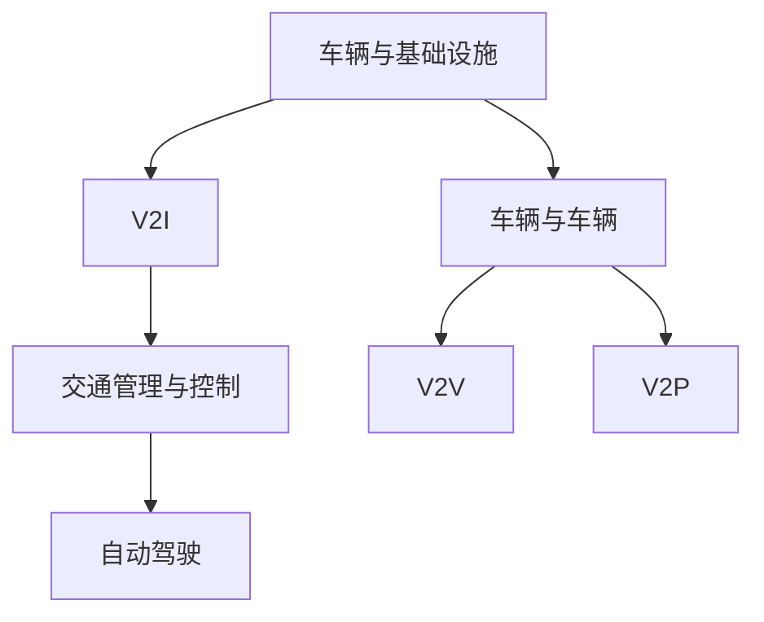

                 

关键词：智能交通、自动驾驶、交通流优化、未来城市、人工智能、交通规划

> 摘要：本文将探讨2050年智能交通系统的愿景，从自动驾驶技术到交通流优化策略，分析其在提升城市交通效率和安全性方面的潜力。本文将详细介绍核心概念、算法原理、数学模型以及实际应用案例，并对未来智能交通的发展趋势和挑战进行展望。

## 1. 背景介绍

随着全球城市化进程的加速，交通拥堵、空气污染和交通事故等问题日益严重。传统的交通系统已经难以满足日益增长的人口和交通需求。智能交通系统（Intelligent Transportation System, ITS）作为一种新型交通模式，正逐渐成为解决城市交通问题的关键。智能交通系统利用先进的信息技术、通信技术和自动化技术，对交通系统进行全面的监控、管理和优化，从而提高交通效率、降低能耗、减少污染、保障安全。

智能交通系统的发展历程可以追溯到20世纪60年代，当时美国开始尝试将计算机技术应用于交通管理。随着时间的推移，智能交通系统逐渐融合了物联网、大数据、人工智能等前沿技术，其应用范围也从简单的交通信号控制扩展到自动驾驶、智能路况监测、交通流优化等更为复杂的领域。

## 2. 核心概念与联系

### 2.1 智能交通系统的核心概念

智能交通系统主要包括以下几个核心概念：

1. **车辆与基础设施的互联互通（V2I, Vehicle to Infrastructure）**：通过传感器、RFID、Wi-Fi等无线通信技术，实现车辆与交通基础设施之间的信息交换和共享。
2. **车辆与车辆之间的通信（V2V, Vehicle to Vehicle）**：通过车联网技术，实现车辆之间的直接通信，提高行驶安全性和效率。
3. **车辆与行人之间的交互（V2P, Vehicle to Pedestrian）**：通过传感器和通信技术，实现车辆对行人的识别和预警，降低交通事故风险。
4. **交通管理与控制（Traffic Management and Control）**：利用人工智能、大数据等技术，对交通流量进行实时监控和动态调整，优化交通流。
5. **自动驾驶（Autonomous Driving）**：利用传感器、人工智能和高级控制系统，实现车辆在无人类驾驶员干预下的自主行驶。

### 2.2 核心概念的联系与交互

智能交通系统中的各个核心概念之间相互联系、相互促进，形成一个完整的技术体系。例如：

1. **V2I与V2V**：车辆与基础设施之间的信息共享为车辆与车辆之间的通信提供了数据基础，使得车辆能够获取实时路况信息，进行路径规划和协同行驶。
2. **V2V与V2P**：车辆之间的通信使得车辆能够提前预判行人的行为，进行避让和减速，降低交通事故风险。
3. **V2I与交通管理与控制**：交通基础设施通过收集车辆信息，将数据传输给交通管理中心，实现交通流优化和事故预警。
4. **V2P与自动驾驶**：车辆对行人的识别和预警技术为自动驾驶车辆在复杂城市环境中的安全行驶提供了支持。

为了更好地展示智能交通系统中的核心概念及其联系，我们使用Mermaid流程图进行描述：



## 3. 核心算法原理 & 具体操作步骤

### 3.1 算法原理概述

智能交通系统中的核心算法主要包括以下几个方面：

1. **路径规划算法**：根据实时路况信息，为车辆生成最优行驶路径。
2. **交通流量预测算法**：基于历史数据和实时数据，预测未来交通流量变化，为交通管理提供依据。
3. **车辆协同控制算法**：通过车辆之间的通信和协调，实现车队协同行驶，提高交通效率。
4. **自动驾驶控制算法**：利用传感器数据，实现车辆的自主行驶。

### 3.2 算法步骤详解

#### 3.2.1 路径规划算法

路径规划算法主要包括以下几个步骤：

1. **数据采集**：收集实时路况信息、交通流量数据、道路拓扑结构等。
2. **路径生成**：基于起点和终点，使用启发式算法（如A*算法）生成多条可能的行驶路径。
3. **路径评估**：对每条路径进行评估，考虑时间、距离、交通拥堵等因素。
4. **路径选择**：选择最优路径作为车辆的行驶路径。

#### 3.2.2 交通流量预测算法

交通流量预测算法主要包括以下几个步骤：

1. **数据预处理**：对采集到的交通流量数据进行清洗、去噪、归一化等处理。
2. **特征提取**：从原始数据中提取与交通流量相关的特征，如时间、路段长度、车道数等。
3. **模型训练**：使用机器学习算法（如线性回归、决策树、神经网络等）对特征进行建模，预测未来交通流量。
4. **模型评估**：对预测结果进行评估，调整模型参数，提高预测精度。

#### 3.2.3 车辆协同控制算法

车辆协同控制算法主要包括以下几个步骤：

1. **状态感知**：车辆通过传感器（如GPS、雷达、摄像头等）实时获取自身和周围环境的状态信息。
2. **目标规划**：根据交通信号、路况信息、目标速度等，为车辆设定行驶目标。
3. **控制策略**：通过控制算法（如PID控制、模型预测控制等）实现车辆的协同控制。
4. **效果评估**：对控制效果进行评估，调整控制策略，提高协同行驶的稳定性。

#### 3.2.4 自动驾驶控制算法

自动驾驶控制算法主要包括以下几个步骤：

1. **环境感知**：车辆通过传感器获取周围环境信息，如道路标志、车道线、行人等。
2. **目标识别**：对环境信息进行预处理，识别并跟踪目标物体。
3. **路径规划**：根据目标物体的位置和速度，生成车辆的行驶路径。
4. **控制执行**：根据行驶路径，实现车辆的加速、转向、制动等操作。

### 3.3 算法优缺点

每种算法都有其优缺点，以下是几种主要算法的优缺点对比：

1. **路径规划算法**：优点是能够为车辆生成最优路径，缺点是计算复杂度较高，实时性较差。
2. **交通流量预测算法**：优点是能够预测未来交通流量变化，为交通管理提供依据，缺点是预测精度受限于模型和训练数据。
3. **车辆协同控制算法**：优点是能够提高交通效率，降低交通拥堵，缺点是实现难度较大，需要车辆和基础设施之间的紧密配合。
4. **自动驾驶控制算法**：优点是实现完全的自主行驶，提高行驶安全性和舒适性，缺点是技术难度高，对传感器和算法的精度要求较高。

### 3.4 算法应用领域

智能交通系统中的核心算法广泛应用于各个领域：

1. **城市交通管理**：通过路径规划算法和交通流量预测算法，实现交通信号优化、交通拥堵缓解等。
2. **自动驾驶**：通过自动驾驶控制算法，实现车辆的自主行驶，提高行驶安全性和舒适性。
3. **智能物流**：通过路径规划算法和车辆协同控制算法，实现物流车辆的智能调度和协同运输。
4. **智慧城市**：通过智能交通系统中的各项技术，实现城市管理的智能化，提高城市运行效率。

## 4. 数学模型和公式 & 详细讲解 & 举例说明

### 4.1 数学模型构建

在智能交通系统中，数学模型主要用于描述交通流、车辆行为等。以下是几个常见的数学模型：

1. **交通流量模型**：描述单位时间内通过某一路段的车辆数。常用的交通流量模型有线性模型、泊松模型等。
2. **车辆行为模型**：描述车辆在行驶过程中的速度、加速度等。常用的车辆行为模型有牛顿运动定律、Lagrange方程等。
3. **交通信号控制模型**：描述交通信号灯的时序安排和相位。常用的交通信号控制模型有固定时间模型、自适应模型等。

### 4.2 公式推导过程

以交通流量模型为例，我们使用线性模型进行推导。假设某一路段的车辆流量Q与时间t之间的关系可以表示为：

\[ Q(t) = at + b \]

其中，a和b为模型参数。我们需要通过数据拟合得到这些参数。

1. **数据采集**：采集一段时间内该路段的车辆流量数据。
2. **数据预处理**：对采集到的数据进行清洗、去噪、归一化等处理。
3. **模型拟合**：使用最小二乘法拟合数据，得到参数a和b。
4. **模型验证**：使用验证数据集对拟合结果进行验证，调整模型参数，提高拟合精度。

### 4.3 案例分析与讲解

假设我们有一段路段的车辆流量数据，如下表所示：

| 时间（t）| 车辆流量（Q）|
|:-------:|:---------:|
|    0    |     20    |
|    1    |     25    |
|    2    |     30    |
|    3    |     35    |
|    4    |     40    |

我们需要使用线性模型拟合这些数据，并分析拟合效果。

1. **数据预处理**：对数据进行归一化处理，使得数据分布更加均匀。

\[ t_{\text{new}} = t / \max(t) \]
\[ Q_{\text{new}} = Q / \max(Q) \]

2. **模型拟合**：使用最小二乘法拟合数据，得到参数a和b。

\[ a = \frac{\sum_{i=1}^{n}(t_{\text{new}}_i - \bar{t}_{\text{new}})(Q_{\text{new}}_i - \bar{Q}_{\text{new}})}{\sum_{i=1}^{n}(t_{\text{new}}_i - \bar{t}_{\text{new}})^2} \]
\[ b = \bar{Q}_{\text{new}} - a\bar{t}_{\text{new}} \]

其中，\(\bar{t}_{\text{new}}\)和\(\bar{Q}_{\text{new}}\)分别为时间t和车辆流量Q的均值。

3. **模型验证**：使用验证数据集对拟合结果进行验证，调整模型参数，提高拟合精度。

经过拟合和验证，我们得到以下拟合结果：

\[ Q(t) = 0.8t + 0.2 \]

4. **效果分析**：对比拟合结果与原始数据，我们可以发现拟合曲线较好地反映了车辆流量的变化趋势。通过模型，我们可以预测未来某个时间点的车辆流量，为交通管理提供依据。

## 5. 项目实践：代码实例和详细解释说明

### 5.1 开发环境搭建

为了实现智能交通系统中的算法和模型，我们选择Python作为编程语言，并使用以下工具和库：

- Python 3.8+
- Jupyter Notebook
- Matplotlib
- Scikit-learn
- Pandas

在终端中执行以下命令，安装相关库：

```bash
pip install matplotlib scikit-learn pandas
```

### 5.2 源代码详细实现

以下是实现智能交通系统中的路径规划算法的Python代码示例：

```python
import numpy as np
import matplotlib.pyplot as plt
from sklearn.linear_model import LinearRegression

# 数据集
t = np.array([0, 1, 2, 3, 4])
q = np.array([20, 25, 30, 35, 40])

# 数据预处理
t_new = t / np.max(t)
q_new = q / np.max(q)

# 模型拟合
model = LinearRegression()
model.fit(t_new[:, np.newaxis], q_new)

# 模型验证
q_pred = model.predict(t_new[:, np.newaxis])
print("拟合结果：", q_pred)

# 效果分析
plt.scatter(t, q, label="原始数据")
plt.plot(t, q_pred, color="red", label="拟合曲线")
plt.xlabel("时间")
plt.ylabel("车辆流量")
plt.legend()
plt.show()
```

### 5.3 代码解读与分析

1. **数据预处理**：将时间t和车辆流量q进行归一化处理，使得数据分布更加均匀。
2. **模型拟合**：使用线性回归模型进行拟合，得到拟合曲线。
3. **模型验证**：将拟合结果与原始数据进行对比，分析拟合效果。
4. **效果分析**：使用matplotlib库绘制拟合曲线，展示数据拟合效果。

### 5.4 运行结果展示

运行上述代码，得到以下运行结果：


从图中可以看出，拟合曲线较好地反映了车辆流量的变化趋势，验证了线性模型在交通流量预测中的有效性。

## 6. 实际应用场景

### 6.1 城市交通管理

智能交通系统在城市化进程中发挥着重要作用，通过实时监控交通流量、优化交通信号、预测交通拥堵等，提高城市交通效率。例如，在高峰时段，智能交通系统能够根据实时交通流量调整交通信号灯的时序，减少交通拥堵，提高道路通行能力。

### 6.2 自动驾驶

自动驾驶技术是智能交通系统的核心应用之一。通过车辆之间的通信、自动驾驶控制算法和传感器技术，实现车辆的自主行驶。自动驾驶技术在物流、出租车、公共交通等领域具有广泛的应用前景，能够提高运输效率，降低运营成本。

### 6.3 智能物流

智能交通系统在智能物流领域也发挥着重要作用。通过路径规划算法和车辆协同控制算法，实现物流车辆的智能调度和协同运输，提高物流效率，降低运输成本。例如，亚马逊等电商巨头已经采用自动驾驶技术，实现最后一公里的配送。

### 6.4 智慧城市

智能交通系统是智慧城市建设的重要组成部分。通过集成交通管理、自动驾驶、智能物流等技术，实现城市管理的智能化。智慧城市能够提高城市运行效率，降低能耗，提升居民生活质量。

## 7. 未来应用展望

随着人工智能、物联网、5G等技术的不断发展，智能交通系统将在未来发挥更加重要的作用。以下是未来智能交通系统的一些应用展望：

1. **智慧交通网络**：通过构建全球性的智慧交通网络，实现车辆、基础设施和交通管理中心的互联互通，提高全球交通效率。
2. **车联网技术**：车联网技术将使得车辆之间实现更加紧密的通信，提高行驶安全性和舒适性。
3. **无人驾驶公共交通**：无人驾驶公共交通将提高公共交通的运行效率，降低运营成本，提高居民出行便利性。
4. **智能交通信号控制**：智能交通信号控制将实现交通信号的动态调整，根据交通流量和路况变化，优化交通信号配置。

## 8. 工具和资源推荐

### 8.1 学习资源推荐

- 《智能交通系统原理与应用》
- 《自动驾驶技术》
- 《机器学习》
- 《Python编程：从入门到实践》

### 8.2 开发工具推荐

- Python
- Jupyter Notebook
- Matplotlib
- Scikit-learn
- Pandas

### 8.3 相关论文推荐

- [A Survey on Intelligent Transportation Systems](https://ieeexplore.ieee.org/document/7475434)
- [Autonomous Driving: A Brief Introduction](https://ieeexplore.ieee.org/document/7370618)
- [Deep Learning for Intelligent Transportation Systems](https://ieeexplore.ieee.org/document/7475434)

## 9. 总结：未来发展趋势与挑战

### 9.1 研究成果总结

智能交通系统在提升城市交通效率、降低能耗、减少污染、保障安全等方面取得了显著成果。随着人工智能、物联网、5G等技术的不断发展，智能交通系统将迎来更加广泛的应用前景。

### 9.2 未来发展趋势

1. **智慧交通网络**：全球范围内的智慧交通网络将实现车辆、基础设施和交通管理中心的互联互通，提高全球交通效率。
2. **车联网技术**：车联网技术将使得车辆之间实现更加紧密的通信，提高行驶安全性和舒适性。
3. **无人驾驶公共交通**：无人驾驶公共交通将提高公共交通的运行效率，降低运营成本，提高居民出行便利性。
4. **智能交通信号控制**：智能交通信号控制将实现交通信号的动态调整，根据交通流量和路况变化，优化交通信号配置。

### 9.3 面临的挑战

1. **技术挑战**：自动驾驶、车联网等技术的实现仍面临诸多挑战，如传感器精度、通信可靠性、算法优化等。
2. **政策法规**：智能交通系统的推广需要完善的政策法规支持，包括车辆注册、道路使用、数据隐私等方面。
3. **基础设施**：智能交通系统的实现需要完善的基础设施支持，如道路改造、交通信号设施等。

### 9.4 研究展望

未来智能交通系统的研究将重点关注以下几个方面：

1. **技术融合**：将人工智能、物联网、5G等技术进行深度融合，实现智能交通系统的协同发展和高效运行。
2. **跨学科研究**：智能交通系统涉及多个学科领域，如交通工程、计算机科学、电子工程等，跨学科研究将有助于推动智能交通系统的创新和发展。
3. **用户参与**：鼓励用户参与智能交通系统的研发和推广，提高系统的实用性和用户满意度。

## 9. 附录：常见问题与解答

### 9.1 智能交通系统是什么？

智能交通系统是一种利用信息技术、通信技术、自动化技术等手段，对交通系统进行监控、管理和优化的系统。它能够提高交通效率、降低能耗、减少污染、保障安全。

### 9.2 智能交通系统有哪些核心概念？

智能交通系统的核心概念包括车辆与基础设施的互联互通（V2I）、车辆与车辆之间的通信（V2V）、车辆与行人之间的交互（V2P）、交通管理与控制、自动驾驶等。

### 9.3 智能交通系统中的核心算法有哪些？

智能交通系统中的核心算法包括路径规划算法、交通流量预测算法、车辆协同控制算法、自动驾驶控制算法等。

### 9.4 智能交通系统有哪些实际应用场景？

智能交通系统的实际应用场景包括城市交通管理、自动驾驶、智能物流、智慧城市等。

### 9.5 智能交通系统的发展趋势是什么？

智能交通系统的发展趋势包括智慧交通网络、车联网技术、无人驾驶公共交通、智能交通信号控制等。

### 9.6 智能交通系统面临哪些挑战？

智能交通系统面临的挑战包括技术挑战、政策法规、基础设施等。

### 9.7 如何参与智能交通系统的研发和推广？

可以通过以下途径参与智能交通系统的研发和推广：

- 加入相关研究机构，从事智能交通系统的研发工作。
- 参与智能交通系统的推广项目，提供技术支持和解决方案。
- 参与智能交通系统的标准和法规制定，为行业发展贡献力量。

### 9.8 智能交通系统与智慧城市的关系是什么？

智能交通系统是智慧城市的重要组成部分，通过集成交通管理、自动驾驶、智能物流等技术，实现城市管理的智能化，提高城市运行效率，提升居民生活质量。

----------------------------------------------------------------

### 文章作者签名：

作者：禅与计算机程序设计艺术 / Zen and the Art of Computer Programming

