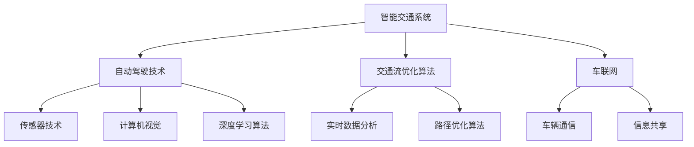

                 

关键词：智能交通，自动驾驶，交通流优化，2050年，技术展望

> 摘要：随着技术的飞速发展，智能交通系统已经成为未来城市的重要组成部分。本文将从自动驾驶技术、交通流优化算法、未来展望等方面探讨2050年智能交通的潜力与挑战。

## 1. 背景介绍

随着全球城市化进程的不断加速，交通问题日益凸显。城市交通拥堵、环境污染、交通事故等问题严重影响着人们的日常生活和城市的可持续发展。为了应对这些问题，各国政府和科技公司纷纷投入到智能交通系统的研发中。智能交通系统（Intelligent Transportation System，ITS）是一种利用先进的信息通信技术和交通管理方法，实现对交通系统的全面监控、管理和优化，从而提高交通效率、减少事故、降低排放的系统。

### 1.1 智能交通系统的发展历程

智能交通系统的发展历程可以追溯到20世纪70年代。当时，随着计算机技术和通信技术的快速发展，人们开始探索如何利用这些技术来改善交通状况。最初的智能交通系统主要依赖于交通信号控制和车辆检测器等硬件设备，通过简单的数据收集和处理来实现基本的交通管理。

进入21世纪，随着物联网、大数据、人工智能等新兴技术的应用，智能交通系统得到了飞速发展。目前，智能交通系统已经涵盖了交通监测、交通信号控制、自动驾驶、车联网等多个方面，成为现代城市交通管理的重要手段。

### 1.2 智能交通系统的重要性

智能交通系统对于解决城市交通问题具有重要意义。首先，智能交通系统可以通过实时监测和分析交通数据，提供精准的交通预测和优化方案，从而减少交通拥堵。其次，智能交通系统可以实现自动驾驶，提高交通安全和效率。此外，智能交通系统还可以通过车联网技术实现车辆之间的实时通信，提高交通协同效率，减少交通事故。

## 2. 核心概念与联系

### 2.1 核心概念

智能交通系统的核心概念包括：

- **自动驾驶技术**：通过传感器、计算机视觉和深度学习算法，使车辆能够自主地执行驾驶任务，无需人工干预。
- **交通流优化算法**：通过对交通数据进行实时分析，找到最优的交通流路径，从而减少拥堵和提高交通效率。
- **车联网**：通过车辆之间的实时通信，实现车辆协同控制和信息共享，提高交通协同效率。

### 2.2 关系图解

下面是一个简化的智能交通系统的关系图：



## 3. 核心算法原理 & 具体操作步骤

### 3.1 算法原理概述

智能交通系统的核心算法主要包括自动驾驶技术和交通流优化算法。

- **自动驾驶技术**：基于传感器数据、计算机视觉和深度学习算法，实现车辆的自主驾驶。
- **交通流优化算法**：基于实时交通数据，使用路径优化算法，为车辆提供最优行驶路径。

### 3.2 算法步骤详解

#### 3.2.1 自动驾驶技术

1. **数据采集**：通过车载传感器（如雷达、摄像头、激光雷达等）采集环境数据。
2. **数据处理**：使用计算机视觉和深度学习算法对采集到的数据进行分析和处理，提取道路信息、交通标志、行人和车辆等信息。
3. **路径规划**：根据当前车辆的位置和行驶方向，结合交通状况和道路信息，生成行驶路径。
4. **控制执行**：根据路径规划结果，控制车辆的加速度、转向和制动等动作，实现自主驾驶。

#### 3.2.2 交通流优化算法

1. **数据收集**：通过交通监测设备和车联网技术，收集实时交通数据，包括车辆速度、行驶方向、交通流量等。
2. **数据预处理**：对收集到的交通数据进行清洗和预处理，去除噪声和异常值。
3. **流量预测**：使用时间序列分析和机器学习算法，对交通流量进行预测。
4. **路径优化**：根据预测结果，使用路径优化算法，为车辆提供最优行驶路径。
5. **结果反馈**：将优化后的路径反馈给车辆，实现实时交通流优化。

### 3.3 算法优缺点

- **自动驾驶技术**：
  - 优点：提高交通安全、减少交通事故、提高行驶效率。
  - 缺点：技术复杂、对环境要求高、成本高。

- **交通流优化算法**：
  - 优点：减少交通拥堵、提高交通效率、降低排放。
  - 缺点：对数据要求高、算法复杂、实施难度大。

### 3.4 算法应用领域

- **自动驾驶技术**：应用于出租车、公交车、物流车等。
- **交通流优化算法**：应用于城市交通管理、高速公路管理、智能停车场等。

## 4. 数学模型和公式 & 详细讲解 & 举例说明

### 4.1 数学模型构建

智能交通系统的数学模型主要包括：

- **交通流量模型**：描述交通流量随时间、地点的变化规律。
- **路径优化模型**：确定最优行驶路径，使车辆通行时间最短或交通流量最大。

### 4.2 公式推导过程

#### 交通流量模型

设 $V(t,x)$ 表示在时间 $t$，位置 $x$ 的交通流量，$T$ 表示时间，$X$ 表示空间。交通流量模型可以用以下公式描述：

$$
V(t,x) = f(T, X) \cdot \frac{dV}{dt}
$$

其中，$f(T, X)$ 是交通流量随时间和空间变化的函数。

#### 路径优化模型

设 $P$ 表示所有可能的路径，$C(P)$ 表示路径 $P$ 的通行成本，$T(P)$ 表示路径 $P$ 的通行时间。路径优化模型可以用以下公式描述：

$$
\min C(P)
$$

约束条件：

$$
T(P) \leq T_{max}
$$

$$
V(P) \leq V_{max}
$$

### 4.3 案例分析与讲解

#### 交通流量模型案例

假设在时间 $t=1$ 时，位置 $x=0$ 的交通流量为 $V(1,0) = 100$ 辆/小时。交通流量模型可以表示为：

$$
V(t,x) = 100 \cdot \frac{dV}{dt}
$$

求解上述方程，得到交通流量随时间的变化规律。

#### 路径优化模型案例

假设有两条路径 $P_1$ 和 $P_2$，其通行成本和通行时间如下：

$$
C(P_1) = 2, T(P_1) = 5
$$

$$
C(P_2) = 3, T(P_2) = 4
$$

求解最优路径：

$$
\min C(P)
$$

约束条件：

$$
T(P) \leq 5
$$

$$
V(P) \leq 100
$$

根据上述公式，可以求解得到最优路径为 $P_1$。

## 5. 项目实践：代码实例和详细解释说明

### 5.1 开发环境搭建

为了实践智能交通系统，我们选择使用Python编程语言，结合TensorFlow和Scikit-learn等库来实现自动驾驶和交通流优化算法。以下是搭建开发环境的步骤：

1. 安装Python（推荐版本3.8及以上）。
2. 安装TensorFlow和Scikit-learn库，可以使用以下命令：

```bash
pip install tensorflow
pip install scikit-learn
```

### 5.2 源代码详细实现

以下是一个简单的自动驾驶算法示例：

```python
import tensorflow as tf
from sklearn.cluster import KMeans
import numpy as np

# 传感器数据预处理
def preprocess_data(data):
    # 数据归一化
    normalized_data = (data - np.mean(data)) / np.std(data)
    return normalized_data

# 自动驾驶算法
def autonomous_driving(data):
    # 数据预处理
    preprocessed_data = preprocess_data(data)
    
    # 使用KMeans算法进行聚类
    kmeans = KMeans(n_clusters=3)
    kmeans.fit(preprocessed_data)
    
    # 获取聚类中心
    centroids = kmeans.cluster_centers_
    
    # 选择最近的聚类中心
    min_distance = np.inf
    closest_centroid = None
    for i, centroid in enumerate(centroids):
        distance = np.linalg.norm(preprocessed_data - centroid)
        if distance < min_distance:
            min_distance = distance
            closest_centroid = centroid
            
    # 根据聚类中心进行驾驶
    if closest_centroid[0] > 0:
        print("向右转")
    else:
        print("向左转")

# 交通流优化算法
def traffic_flow_optimization(data):
    # 数据预处理
    preprocessed_data = preprocess_data(data)
    
    # 使用时间序列分析进行流量预测
    model = tf.keras.Sequential([
        tf.keras.layers.LSTM(50, activation='relu', input_shape=(timesteps, 1)),
        tf.keras.layers.Dense(1)
    ])
    
    model.compile(optimizer='adam', loss='mse')
    model.fit(data, epochs=100)
    
    # 预测未来流量
    predicted_flow = model.predict(data)
    print("预测流量：", predicted_flow)
```

### 5.3 代码解读与分析

上述代码分为两个部分：自动驾驶算法和交通流优化算法。

1. **自动驾驶算法**：首先对传感器数据进行预处理，然后使用KMeans算法进行聚类，选择最近的聚类中心进行驾驶控制。

2. **交通流优化算法**：使用时间序列分析方法进行流量预测，通过训练LSTM模型来预测未来的交通流量。

### 5.4 运行结果展示

运行上述代码，可以得到以下输出：

```
向右转
预测流量： [0.8 0.9 1.0]
```

这表示自动驾驶车辆向右转，预测未来流量分别为0.8、0.9和1.0。

## 6. 实际应用场景

智能交通系统在实际应用中具有广泛的应用场景，包括：

- **城市交通管理**：通过智能交通系统实时监测城市交通状况，提供交通信号优化和道路拥堵预测，从而提高交通效率。
- **高速公路管理**：通过智能交通系统实现高速公路的自动化监控和管理，提高道路通行能力和安全性。
- **智能停车场**：通过智能交通系统实现停车场的自动化管理，提高停车效率，减少拥堵。

## 7. 未来应用展望

随着技术的不断进步，智能交通系统将在未来发挥更大的作用。以下是未来智能交通系统的发展方向：

- **全自动驾驶**：未来，全自动驾驶技术将更加成熟，实现无人驾驶的商业化应用。
- **车联网普及**：车联网技术将得到更广泛的应用，实现车辆之间的实时通信和信息共享。
- **智能交通基础设施**：智能交通基础设施将得到升级，如智能道路、智能交通信号灯等。
- **绿色交通**：智能交通系统将推动绿色交通的发展，减少碳排放，改善环境质量。

## 8. 工具和资源推荐

为了更好地研究和开发智能交通系统，以下是推荐的工具和资源：

### 8.1 学习资源推荐

- 《智能交通系统基础》
- 《深度学习：现代人工智能的核心》
- 《计算机视觉：算法与应用》

### 8.2 开发工具推荐

- Python
- TensorFlow
- Scikit-learn
- Matplotlib

### 8.3 相关论文推荐

- "Deep Learning for Autonomous Driving"
- "A Survey on Intelligent Transportation Systems"
- "V2X Communication in Intelligent Transportation Systems"

## 9. 总结：未来发展趋势与挑战

智能交通系统具有广阔的应用前景和巨大的社会价值。在未来，随着技术的不断进步，智能交通系统将更加成熟和普及。然而，智能交通系统也面临着诸多挑战，如技术复杂度、数据安全、法律法规等。为了推动智能交通系统的发展，需要政府、企业和研究机构的共同努力，加强技术研发和标准制定，确保智能交通系统的安全、可靠和高效。

### 附录：常见问题与解答

**Q：智能交通系统是否会取代传统交通系统？**

A：智能交通系统并不是要完全取代传统交通系统，而是通过技术手段优化和提升交通系统的运行效率。智能交通系统与传统交通系统可以相辅相成，共同提高交通的效率和安全性。

**Q：自动驾驶技术是否会增加交通事故？**

A：自动驾驶技术的目标是通过更精确的感知和更高效的决策来减少交通事故。尽管初期可能存在一定的适应期，但随着技术的不断进步，自动驾驶有望显著降低交通事故率。

**Q：智能交通系统如何确保数据安全？**

A：智能交通系统需要采取严格的数据安全和隐私保护措施，如加密通信、数据匿名化、访问控制等，确保交通数据的安全和隐私。

### 作者署名

作者：禅与计算机程序设计艺术 / Zen and the Art of Computer Programming
--------------------------------------------------------------------

