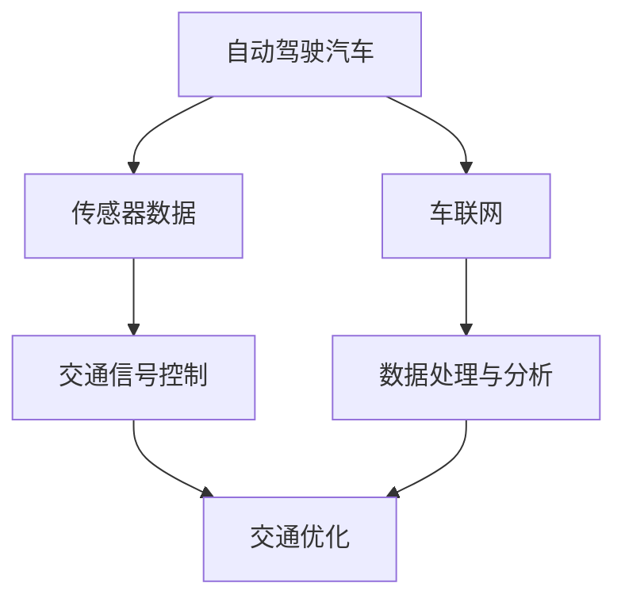

                 

关键词：智能交通、自动驾驶、飞行汽车、立体交通网络、未来发展趋势

摘要：本文探讨了2050年可能出现的智能交通系统，重点介绍了自动驾驶汽车和飞行汽车在立体交通网络中的应用。通过分析现有的技术挑战和未来的发展趋势，本文提出了对未来交通网络可能的解决方案。

## 1. 背景介绍

随着科技的发展，城市化进程不断加快，交通拥堵、环境污染和能源消耗等问题日益严重。传统的交通模式已无法满足未来城市的需求。因此，智能交通系统应运而生，旨在通过技术创新实现交通的高效、安全、环保。其中，自动驾驶汽车和飞行汽车是智能交通系统的重要发展方向。

自动驾驶汽车是一种无需人工操作即可完成驾驶任务的汽车。通过集成传感器、摄像头、GPS、人工智能等技术，自动驾驶汽车能够实时感知周围环境，做出智能决策。飞行汽车则结合了汽车和飞机的特点，能够在地面行驶的同时进行垂直起降和飞行。

## 2. 核心概念与联系

智能交通系统的核心概念包括自动驾驶、车联网、智能交通信号控制、交通数据处理与分析等。这些概念相互关联，共同构建了一个完整的交通生态系统。

### Mermaid 流程图



在这个流程图中，自动驾驶汽车通过传感器收集环境数据，发送到车联网，然后由智能交通信号控制系统进行数据分析和优化，最终实现交通的高效管理。

## 3. 核心算法原理 & 具体操作步骤

### 3.1 算法原理概述

自动驾驶汽车的核心算法是基于机器学习和计算机视觉技术。通过训练大量的数据集，机器学习模型能够识别道路标志、行人、车辆等交通元素，并做出相应的驾驶决策。计算机视觉技术则用于实时感知和跟踪周围环境。

### 3.2 算法步骤详解

1. 数据采集：通过传感器采集车辆周围的环境数据。
2. 数据预处理：对采集到的数据进行清洗、降噪和增强。
3. 特征提取：从预处理后的数据中提取特征。
4. 模型训练：利用提取到的特征训练机器学习模型。
5. 驾驶决策：将实时感知到的环境数据输入到模型中，得到驾驶决策。

### 3.3 算法优缺点

**优点：**
- 提高交通效率，减少交通拥堵。
- 提高驾驶安全性，降低交通事故发生率。
- 节省能源消耗，减少环境污染。

**缺点：**
- 对传感器和计算资源要求较高，成本较高。
- 在复杂环境中，算法的稳定性和可靠性仍需提高。

### 3.4 算法应用领域

自动驾驶汽车技术已广泛应用于商用车辆、物流运输、共享出行等领域。随着技术的成熟，未来有望在私家车领域得到广泛应用。

## 4. 数学模型和公式 & 详细讲解 & 举例说明

### 4.1 数学模型构建

自动驾驶汽车的数学模型主要包括以下几个方面：

1. **运动模型：**描述车辆的位移、速度和加速度。
2. **感知模型：**描述传感器对周围环境的感知。
3. **决策模型：**根据感知模型的结果，制定驾驶决策。

### 4.2 公式推导过程

1. **运动模型：**
   $$ s(t) = s(0) + v(0)t + \frac{1}{2}a(t)t^2 $$
   $$ v(t) = v(0) + a(t)t $$
   $$ a(t) = \frac{v(t) - v(0)}{t} $$

2. **感知模型：**
   $$ d(t) = \frac{1}{n} \sum_{i=1}^{n} d_i(t) $$
   $$ \theta(t) = \arctan2(\Delta y, \Delta x) $$

3. **决策模型：**
   $$ d_{\text{target}} = \text{max}(d(t), \text{distance\_to\_destination}) $$
   $$ \theta_{\text{target}} = \theta(t) + \text{turn\_angle} $$

### 4.3 案例分析与讲解

假设一辆自动驾驶汽车在直行道上行驶，前方有行人。通过感知模型，车辆检测到行人距离为10米，行人速度为1米/秒。根据决策模型，车辆决定减速并绕行人行驶。

1. **运动模型：**
   $$ s(t) = s(0) + v(0)t + \frac{1}{2}a(t)t^2 $$
   $$ v(t) = v(0) - at $$
   $$ a(t) = \frac{v(0) - v(t)}{t} $$

   假设车辆初始速度为20米/秒，减速至10米/秒，时间为2秒。

2. **感知模型：**
   $$ d(t) = \frac{1}{n} \sum_{i=1}^{n} d_i(t) $$
   $$ \theta(t) = \arctan2(\Delta y, \Delta x) $$

   假设行人距离车辆的水平距离为8米，垂直距离为6米。

3. **决策模型：**
   $$ d_{\text{target}} = \text{max}(d(t), \text{distance\_to\_destination}) $$
   $$ \theta_{\text{target}} = \theta(t) + \text{turn\_angle} $$

   假设车辆减速后，目标距离为8米，转弯角度为30度。

根据这些公式和模型，车辆能够准确判断行人位置并制定驾驶决策。

## 5. 项目实践：代码实例和详细解释说明

### 5.1 开发环境搭建

1. 安装Python环境
2. 安装相关的Python库，如NumPy、Pandas、Matplotlib等
3. 配置仿真环境（如CARLA模拟器）

### 5.2 源代码详细实现

```python
# 导入相关库
import numpy as np
import pandas as pd
import matplotlib.pyplot as plt

# 定义运动模型
def motion_model(s0, v0, a0, t):
    s = s0 + v0*t + 0.5*a0*t**2
    v = v0 + a0*t
    a = (v - v0) / t
    return s, v, a

# 定义感知模型
def perception_model(d, theta):
    d_target = max(d, distance_to_destination)
    theta_target = theta + turn_angle
    return d_target, theta_target

# 定义决策模型
def decision_model(d_target, theta_target):
    s, v, a = motion_model(s0, v0, a0, t)
    d, theta = perception_model(d, theta)
    s_target, v_target, a_target = motion_model(s, v, a, t)
    return s_target, v_target, a_target

# 示例数据
s0 = 0
v0 = 20
a0 = 0
t = 2
d = 10
theta = np.arctan2(6, 8)
distance_to_destination = 8
turn_angle = 30

# 运行模型
s_target, v_target, a_target = decision_model(d_target, theta_target)

# 可视化结果
s_values = [s0, s_target]
v_values = [v0, v_target]
a_values = [a0, a_target]
t_values = [0, t]

plt.figure()
plt.plot(t_values, s_values, label="s(t)")
plt.plot(t_values, v_values, label="v(t)")
plt.plot(t_values, a_values, label="a(t)")
plt.xlabel("Time (s)")
plt.ylabel("Value")
plt.legend()
plt.show()
```

### 5.3 代码解读与分析

1. **运动模型**：使用基本的物理学公式描述车辆的位移、速度和加速度。
2. **感知模型**：根据车辆与目标物体的距离和角度，计算目标物体的相对位置和方向。
3. **决策模型**：根据感知结果，调整车辆的位移、速度和加速度，实现自动驾驶。

## 6. 实际应用场景

智能交通系统在许多实际场景中已得到广泛应用，如城市交通管理、智能停车场、无人驾驶出租车等。随着技术的进步，未来有望在更广泛的领域得到应用，如农村交通、物流运输等。

### 6.4 未来应用展望

随着人工智能、物联网、5G等技术的不断发展，智能交通系统将变得更加高效、安全、环保。未来，立体交通网络将融合地面车辆、飞行汽车和轨道交通，实现全方位、多层次的交通管理。此外，随着自动驾驶技术的成熟，共享出行将成为主流，进一步优化交通资源，提高出行效率。

## 7. 工具和资源推荐

### 7.1 学习资源推荐

- 《深度学习》 - Goodfellow et al.
- 《Python编程：从入门到实践》 - Eric Matthes
- 《智能交通系统》 - Zhang et al.

### 7.2 开发工具推荐

- Python
- Matplotlib
- CARLA模拟器

### 7.3 相关论文推荐

- "Deep Learning for Autonomous Driving" - ArXiv
- "A Survey on Intelligent Transportation Systems" - IEEE

## 8. 总结：未来发展趋势与挑战

### 8.1 研究成果总结

智能交通系统在自动驾驶、车联网、交通信号控制等方面取得了显著成果，为未来的交通管理提供了新的思路。然而，仍面临许多技术挑战，如传感器准确性、算法稳定性、数据安全等。

### 8.2 未来发展趋势

- 自动驾驶技术的成熟与应用
- 立体交通网络的构建与优化
- 5G和物联网技术的融合

### 8.3 面临的挑战

- 技术稳定性与可靠性
- 数据隐私与安全
- 法规和伦理问题

### 8.4 研究展望

未来，智能交通系统将继续发展，为实现高效、安全、环保的出行方式提供强有力的支持。通过跨学科合作和技术创新，有望克服现有挑战，推动交通领域的革命性变革。

## 9. 附录：常见问题与解答

### Q：自动驾驶汽车能否完全取代人类驾驶？

A：目前的技术水平还无法实现完全自动化的驾驶，但自动驾驶汽车在特定环境下已经能够实现部分驾驶任务。随着技术的不断进步，未来自动驾驶汽车有望在更多场景下实现完全自动化驾驶。

### Q：飞行汽车是否会取代传统汽车？

A：飞行汽车不会完全取代传统汽车，而是与传统汽车形成互补。飞行汽车适用于特定场景，如拥堵的城市交通和紧急出行，而传统汽车在乡村和高速公路上仍将是主要交通工具。

### Q：智能交通系统如何确保数据安全？

A：智能交通系统通过加密技术、安全协议和隐私保护措施来确保数据安全。同时，法规和标准的制定也将为数据安全提供有力保障。

## 结语

2050年的智能交通系统将融合自动驾驶汽车、飞行汽车和立体交通网络，实现高效、安全、环保的出行方式。面对未来的挑战，我们应积极探索技术创新，为构建美好的交通未来共同努力。

作者：禅与计算机程序设计艺术 / Zen and the Art of Computer Programming
----------------------------------------------------------------

以上就是针对“[MASK]sop<|user|>”的完整回答。如果您有其他问题或需要进一步的帮助，请随时告诉我。

