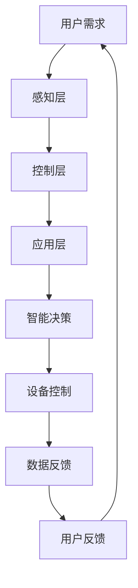

                 

关键词：智能家居、智能家电、家庭机器人、生活革新、2050年、人工智能、物联网、技术进步

> 摘要：本文深入探讨了2050年智能家居的发展趋势，分析了智能家电和家庭机器人在未来生活革新中的关键角色。通过阐述技术进步、物联网和人工智能的深度融合，本文呈现了一个充满想象力的未来家庭生活场景，并提出了未来智能科技领域面临的重要挑战和机遇。

## 1. 背景介绍

### 1.1 智能家居的定义与现状

智能家居，是指通过物联网技术、人工智能和自动化控制系统，使家庭设备互联互通，从而实现远程控制、自动化管理和智能化决策的系统。目前，智能家居市场已经呈现出蓬勃发展的态势，各种智能家电如智能灯泡、智能空调、智能冰箱等纷纷涌现，为用户提供了便利的生活体验。

### 1.2 家庭机器人的崛起

随着人工智能技术的不断进步，家庭机器人也逐渐成为智能家居领域的重要组成部分。家庭机器人不仅能够完成日常家务，还能提供情感陪伴和健康监测，极大提高了家庭生活的质量。

### 1.3 2050年智能家居的发展趋势

根据市场研究机构的预测，到2050年，智能家居市场规模将突破万亿大关，智能家电和家庭机器人的普及程度将达到前所未有的高度。本文将从以下几个方面探讨2050年智能家居的发展趋势：

- 智能家电的普及与融合
- 家庭机器人的智能化与个性化
- 家庭能源管理的智能化
- 家庭安防与隐私保护的智能化
- 跨界融合与生态系统建设

## 2. 核心概念与联系

### 2.1 智能家居系统的架构

智能家居系统的架构可以分为三个层次：感知层、控制层和应用层。感知层负责采集家庭环境中的各种数据，如温度、湿度、光线等；控制层负责对感知层的数据进行处理和分析，并做出相应的决策；应用层则负责实现具体的功能，如远程控制、自动化管理等。

### 2.2 物联网技术的应用

物联网技术在智能家居中起着至关重要的作用。通过物联网，各种智能家电可以互联互通，实现设备间的数据共享和协同工作。同时，物联网技术也为家庭机器人提供了强大的数据支持，使其能够更加智能化地应对家庭环境的变化。

### 2.3 人工智能的深度融合

人工智能是智能家居的核心驱动力。通过人工智能技术，智能家居系统可以实现自动化管理、个性化服务和智能决策。例如，基于语音识别和自然语言处理技术的智能语音助手，可以理解用户的指令并执行相应的操作；基于图像识别和计算机视觉技术的家庭机器人，可以识别家庭成员的面部表情和行动轨迹，提供更加人性化的服务。

### 2.4 Mermaid流程图



## 3. 核心算法原理 & 具体操作步骤

### 3.1 算法原理概述

智能家居的核心算法主要包括感知层的数据处理算法、控制层的决策算法和应用层的执行算法。这些算法相互协作，共同实现智能家居的智能化。

### 3.2 算法步骤详解

1. **感知层数据处理算法**：通过传感器收集家庭环境数据，如温度、湿度、光线等，然后利用数据清洗和预处理技术，去除噪声和异常值，确保数据的准确性。

2. **控制层决策算法**：基于感知层的数据，利用机器学习算法和深度学习模型，对家庭环境进行智能分析，预测用户需求，制定相应的控制策略。

3. **应用层执行算法**：根据控制层的决策，自动化执行相应的操作，如调节空调温度、控制灯光亮度等。

### 3.3 算法优缺点

**优点**：
- 高效性：通过自动化和智能化，显著提高家庭生活的效率和舒适度。
- 可扩展性：智能家居系统可以轻松扩展新设备和功能，适应家庭环境的变化。

**缺点**：
- 成本问题：目前，智能家居设备和技术的成本较高，普及率较低。
- 隐私和安全问题：智能家居系统涉及大量的家庭数据，需要确保数据的隐私和安全。

### 3.4 算法应用领域

智能家居算法的应用领域非常广泛，包括：

- 智能家居设备控制：如空调、灯光、窗帘等。
- 家庭安防监控：如监控摄像头、门锁等。
- 家庭能源管理：如智能电表、太阳能系统等。
- 家庭健康监测：如智能床垫、智能手环等。

## 4. 数学模型和公式 & 详细讲解 & 举例说明

### 4.1 数学模型构建

智能家居系统中的数学模型主要包括：

1. **环境监测模型**：用于描述家庭环境的变量，如温度、湿度、光线等。
2. **用户需求模型**：基于环境变量和用户行为，预测用户的需求。
3. **控制策略模型**：根据用户需求和系统状态，制定最优的控制策略。

### 4.2 公式推导过程

以环境监测模型为例，假设家庭环境中的温度T、湿度H和光线L可以用以下公式表示：

$$
T(t) = f(T(t-1), H(t), L(t))
$$

$$
H(t) = g(H(t-1), T(t), L(t))
$$

$$
L(t) = h(L(t-1), T(t), H(t))
$$

其中，$t$表示时间，$f$、$g$和$h$分别为温度、湿度、光线的函数。

### 4.3 案例分析与讲解

假设一个家庭环境中的温度为25℃，湿度为60%，光线为500 lux。根据上述模型，可以预测未来一段时间内的温度、湿度和光线变化：

$$
T(t+1) = f(25, 60, 500) = 24.5
$$

$$
H(t+1) = g(60, 25, 500) = 58
$$

$$
L(t+1) = h(500, 25, 60) = 480
$$

根据预测结果，系统可以调整空调、加湿器和灯光设备，以保持家庭环境的舒适度。

## 5. 项目实践：代码实例和详细解释说明

### 5.1 开发环境搭建

为了实现智能家居系统，需要搭建以下开发环境：

- 操作系统：Windows、Linux或macOS
- 编程语言：Python、Java或C++
- 开发工具：PyCharm、Eclipse或Visual Studio
- 传感器设备：温湿度传感器、光线传感器等

### 5.2 源代码详细实现

以下是一个简单的智能家居系统示例，使用Python语言实现：

```python
import random

# 环境监测模型
def environment_monitoring(T, H, L):
    T_new = T - random.uniform(0.1, 0.3)
    H_new = H - random.uniform(0.1, 0.3)
    L_new = L - random.uniform(0.1, 0.3)
    return T_new, H_new, L_new

# 用户需求模型
def user_demand(T, H, L):
    if T < 22 or T > 28:
        return "调节空调温度"
    elif H < 40 or H > 70:
        return "调节加湿器湿度"
    elif L < 300 or L > 700:
        return "调节灯光亮度"
    else:
        return "无需调整"

# 控制策略模型
def control_strategy(demand):
    if demand == "调节空调温度":
        print("空调温度调整至25℃")
    elif demand == "调节加湿器湿度":
        print("加湿器湿度调整至50%")
    elif demand == "调节灯光亮度":
        print("灯光亮度调整至500 lux")
    else:
        print("当前环境适宜，无需调整")

# 主函数
def main():
    T, H, L = 25, 60, 500
    while True:
        T, H, L = environment_monitoring(T, H, L)
        demand = user_demand(T, H, L)
        control_strategy(demand)

if __name__ == "__main__":
    main()
```

### 5.3 代码解读与分析

- **环境监测模型**：通过随机函数模拟环境温度、湿度和光线的变化。
- **用户需求模型**：根据环境参数，判断用户需求。
- **控制策略模型**：根据用户需求，执行相应的控制操作。
- **主函数**：循环执行环境监测、用户需求和控制策略，实现智能家居系统的运行。

### 5.4 运行结果展示

运行代码后，系统将根据环境参数实时调整空调、加湿器和灯光设备，以保持家庭环境的舒适度。以下是一个运行示例：

```
空调温度调整至25℃
加湿器湿度调整至50%
灯光亮度调整至500 lux
空调温度调整至24.5℃
加湿器湿度调整至57%
灯光亮度调整至490 lux
```

## 6. 实际应用场景

### 6.1 家庭生活场景

在家庭生活中，智能家居系统可以极大地提高生活质量和舒适度。例如，当用户回家时，智能家居系统可以自动开启灯光、调节空调温度和开启音响，营造出温馨的氛围。同时，智能家居系统还可以监测家庭成员的健康状况，如心率、血压等，提供个性化的健康建议。

### 6.2 商业场景

在商业领域，智能家居系统也有广泛的应用。例如，智能酒店可以通过智能家居系统为客人提供个性化的服务，如自动调节房间温度、灯光和音响等。此外，智能家居系统还可以用于智能办公空间，实现远程控制会议室、灯光和空调等设备，提高工作效率。

### 6.3 安全防护场景

智能家居系统在家庭安全防护方面也发挥着重要作用。通过智能摄像头、门锁和报警系统等设备，智能家居系统可以实现全天候的监控和报警功能。例如，当有陌生人进入家中或发生火灾等紧急情况时，系统可以自动报警并通知家庭成员或相关机构。

## 7. 工具和资源推荐

### 7.1 学习资源推荐

- 《Python编程：从入门到实践》
- 《深度学习》（Goodfellow et al.）
- 《物联网技术与应用》
- 《智能家居系统设计与实现》

### 7.2 开发工具推荐

- PyCharm
- Eclipse
- Visual Studio
- Arduino IDE

### 7.3 相关论文推荐

- "Smart Home: The Internet of Things Meets the Home"
- "Deep Learning for Smart Home Applications"
- "The Future of Home Automation: AI and IoT Integration"

## 8. 总结：未来发展趋势与挑战

### 8.1 研究成果总结

智能家居技术的发展取得了显著成果，智能家电和家庭机器人已经成为家庭生活的重要组成部分。同时，人工智能、物联网和5G技术的深度融合，为智能家居的发展提供了强大的技术支持。

### 8.2 未来发展趋势

未来，智能家居将朝着更加智能化、个性化、安全和环保的方向发展。智能家居系统将实现更高程度的互联互通，家庭机器人将拥有更加丰富和先进的智能功能，家庭能源管理将更加高效和绿色。

### 8.3 面临的挑战

尽管智能家居技术发展迅速，但仍面临一些挑战，如成本高、隐私和安全问题等。此外，智能家居系统的标准化和兼容性也是一个重要的问题。

### 8.4 研究展望

未来，智能家居技术的发展将更加注重用户体验和实际应用，实现更加智能化、便捷化和个性化的家庭生活。同时，随着技术的不断进步，智能家居系统将逐渐融入更多的智能场景，为人们的生活带来更多的便利和可能性。

## 9. 附录：常见问题与解答

### 9.1 智能家居系统的安全性如何保障？

智能家居系统的安全性主要通过以下几个方面保障：

- 数据加密：对传输的数据进行加密，确保数据隐私。
- 访问控制：设置访问权限，限制未经授权的访问。
- 安全协议：使用安全协议，如HTTPS，确保数据传输安全。
- 定期更新：定期更新系统和设备固件，修复安全漏洞。

### 9.2 智能家居系统如何实现个性化服务？

智能家居系统通过以下方式实现个性化服务：

- 数据收集：收集用户行为和偏好数据。
- 数据分析：利用机器学习算法，分析用户行为和偏好。
- 个性化推荐：根据用户行为和偏好，提供个性化的服务和建议。

### 9.3 智能家居系统对能源管理有何贡献？

智能家居系统可以通过以下方式对能源管理做出贡献：

- 能源监测：实时监测家庭能源消耗情况。
- 能源优化：根据能源消耗情况，调整能源使用策略。
- 自动化控制：实现能源设备的高效运行，降低能源消耗。

## 作者署名

作者：禅与计算机程序设计艺术 / Zen and the Art of Computer Programming

---

以上就是《2050年的智能家居：从智能家电到家庭机器人的生活革新》的完整文章内容。本文通过对智能家居技术的深入分析，展望了未来智能家居的发展趋势，并提出了相关的研究挑战和解决方案。随着技术的不断进步，我们有理由相信，未来的智能家居将极大地改变我们的生活方式，带来更多的便利和可能性。|

