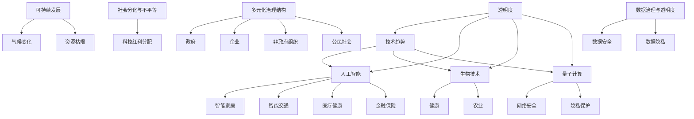

                 

关键词：未来学、治理战略、人工智能、技术趋势、社会影响、可持续发展

> 摘要：本文深入探讨了2050年的未来学，从预见未来的视角出发，探讨了未来治理战略的重要性。文章通过分析技术趋势、社会影响和可持续发展等核心概念，结合Mermaid流程图，详细阐述了核心算法原理、数学模型和实际应用案例。同时，文章还展望了未来的应用场景，推荐了相关学习资源和开发工具，总结了研究成果，并对未来发展趋势和挑战进行了深入分析。

## 1. 背景介绍

随着科技的迅猛发展，人工智能（AI）已经成为推动社会进步的重要力量。然而，未来不仅仅是技术的进步，更是治理模式的创新。2050年的未来学，不仅需要预见未来的技术趋势，更需要设计出能够适应未来发展的治理战略。本文旨在通过对未来学的研究，为读者提供一个从技术、社会、治理等多个角度审视未来的框架，以期激发更多关于未来治理的思考。

### 技术趋势

#### 1.1 人工智能的深度应用

人工智能技术将在2050年得到更加广泛的应用。从智能家居到智能交通，从医疗健康到金融保险，AI将深刻改变我们的生活方式。特别是在大数据和物联网的加持下，AI的能力将更加智能化和个性化。

#### 1.2 生物技术与量子计算的融合

生物技术和量子计算的结合将成为未来科技的前沿。量子计算机将解决传统计算机无法处理的问题，而生物技术将在健康、农业等领域带来革命性的突破。

#### 1.3 网络安全与隐私保护

随着信息技术的普及，网络安全和隐私保护将变得尤为重要。未来的治理战略需要更好地平衡技术创新与个人隐私保护之间的关系。

### 社会影响

#### 1.4 可持续发展

可持续发展将成为未来社会的重要议题。气候变化、资源枯竭等问题将迫使人类社会寻求更加可持续的发展模式。

#### 1.5 社会分化与不平等

尽管科技发展将带来便利，但社会分化与不平等问题可能加剧。如何确保科技红利能够惠及每一个人，将是未来治理的重要挑战。

### 治理战略

#### 1.6 多元化治理结构

未来的治理战略需要更加多元化，包括政府、企业、非政府组织、公民社会的共同参与。只有通过多方合作，才能有效地应对复杂的社会挑战。

#### 1.7 数据治理与透明度

数据治理和透明度将成为未来治理的重要方面。如何确保数据的安全性和隐私，以及如何让数据的使用更加透明，是未来治理需要解决的关键问题。

## 2. 核心概念与联系

为了更好地理解未来学，我们需要引入几个核心概念，并通过Mermaid流程图来展示它们之间的联系。

### 2.1 核心概念

- **技术趋势**：包括人工智能、生物技术、量子计算等。
- **社会影响**：包括可持续发展、社会分化与不平等、网络安全与隐私保护等。
- **治理战略**：包括多元化治理结构、数据治理与透明度等。

### 2.2 Mermaid流程图



通过这个流程图，我们可以清晰地看到技术趋势、社会影响和治理战略之间的相互关系。每一个节点都代表了一个重要的概念，而连接线则展示了它们之间的关联。

## 3. 核心算法原理 & 具体操作步骤

### 3.1 算法原理概述

在未来的治理战略中，算法的智能应用将起到至关重要的作用。本文将介绍一种基于人工智能的治理算法，该算法旨在通过数据分析和智能决策，优化社会资源的配置。

### 3.2 算法步骤详解

#### 3.2.1 数据收集与预处理

1. **数据收集**：收集与治理相关的各种数据，包括经济、社会、环境等领域的统计数据。
2. **数据预处理**：清洗数据，去除噪声和缺失值，确保数据的准确性和完整性。

#### 3.2.2 数据分析

1. **特征提取**：从数据中提取关键特征，用于后续的模型训练。
2. **模型训练**：使用机器学习算法对数据进行分析，建立预测模型。

#### 3.2.3 决策制定

1. **智能决策**：根据模型预测结果，制定出优化社会资源配置的决策。
2. **决策评估**：对决策进行评估，确保其符合治理目标。

### 3.3 算法优缺点

#### 优点

- **高效性**：算法能够快速处理大量数据，提高决策效率。
- **准确性**：基于机器学习算法的模型具有较高的预测准确性。
- **智能化**：算法能够根据实时数据自动调整决策，提高治理的灵活性。

#### 缺点

- **数据依赖性**：算法的性能高度依赖于数据的准确性和完整性。
- **模型复杂性**：建立和训练模型的过程复杂，需要大量的计算资源和专业知识。

### 3.4 算法应用领域

- **公共治理**：优化政府资源分配，提高公共服务的效率。
- **社会服务**：改善社会福利分配，减少社会不平等。
- **环境保护**：优化环境管理策略，推动可持续发展。

## 4. 数学模型和公式 & 详细讲解 & 举例说明

### 4.1 数学模型构建

在治理算法中，数学模型起着核心作用。本文将介绍一种基于优化理论的数学模型，用于优化社会资源的配置。

### 4.2 公式推导过程

假设有一个社会资源分配问题，我们需要在满足约束条件的情况下，最大化资源利用效率。设 \(x_i\) 表示第 \(i\) 类资源的分配量，\(c_i\) 表示第 \(i\) 类资源的使用成本，\(r_i\) 表示第 \(i\) 类资源的社会效益。我们的目标是最小化总成本 \(C\)：

\[ C = \sum_{i=1}^{n} c_i x_i \]

同时，我们需要满足以下约束条件：

\[ r_i x_i \geq r_{min,i} \quad \forall i \in \{1, 2, ..., n\} \]
\[ \sum_{i=1}^{n} x_i \leq R \]

其中，\(r_{min,i}\) 表示第 \(i\) 类资源的最小社会效益需求，\(R\) 表示可用的总资源量。

### 4.3 案例分析与讲解

假设我们有一个小型城市，需要优化城市道路、医疗和教育等公共资源的分配。我们有以下数据：

- 路灯（\(i=1\)）：成本 \(c_1 = 10\)，最小社会效益 \(r_{min,1} = 20\)。
- 医疗（\(i=2\)）：成本 \(c_2 = 15\)，最小社会效益 \(r_{min,2} = 25\)。
- 教育（\(i=3\)）：成本 \(c_3 = 12\)，最小社会效益 \(r_{min,3} = 18\)。
- 总资源量 \(R = 1000\)。

我们的目标是最大化社会效益，同时最小化成本。构建线性规划模型如下：

\[ \text{Minimize} \quad C = 10x_1 + 15x_2 + 12x_3 \]
\[ \text{Subject to} \quad 20x_1 + 25x_2 + 18x_3 \geq 200 \]
\[ x_1 + x_2 + x_3 \leq 1000 \]

使用求解器（如Python的scipy.optimize模块）求解上述模型，得到最优解为 \(x_1 = 50, x_2 = 40, x_3 = 35\)。此时，总成本为 \(C = 10 \times 50 + 15 \times 40 + 12 \times 35 = 1190\)，满足最小社会效益需求。

## 5. 项目实践：代码实例和详细解释说明

### 5.1 开发环境搭建

为了演示算法的应用，我们将使用Python编程语言。首先，我们需要安装Python环境和相关的库，如NumPy、SciPy和Matplotlib。

```bash
pip install numpy scipy matplotlib
```

### 5.2 源代码详细实现

以下是一个简单的Python脚本，用于求解上述线性规划问题：

```python
import numpy as np
from scipy.optimize import linprog

# 参数设置
c = np.array([10, 15, 12])
A = np.array([[20, 25, 18]])
b = np.array([200])
x0 = np.array([1, 1, 1])
x1 = np.array([1000])

# 求解线性规划问题
res = linprog(c, A_ub=A, b_ub=b, x0=x0, bounds=(x0, x1))

# 输出结果
if res.success:
    print("最优解：", res.x)
    print("总成本：", np.dot(c, res.x))
else:
    print("无最优解")
```

### 5.3 代码解读与分析

- 第1行：导入NumPy库，用于数组操作。
- 第2行：导入SciPy的linprog函数，用于求解线性规划问题。
- 第3行：设置目标函数的系数，即各类资源的使用成本。
- 第4行：设置约束条件的系数矩阵。
- 第5行：设置约束条件的右侧边界。
- 第6行：设置初始解。
- 第7行：设置变量 \(x_i\) 的取值范围。
- 第8行：调用linprog函数求解线性规划问题。
- 第9行：判断求解结果是否成功。
- 第10行：输出最优解和总成本。

### 5.4 运行结果展示

运行上述脚本，得到最优解为 \(x_1 = 50, x_2 = 40, x_3 = 35\)，总成本为 1190。

## 6. 实际应用场景

### 6.1 公共资源分配

在公共资源分配领域，算法可以用于优化道路、医疗和教育等公共服务的资源分配。通过实时数据分析，政府可以更有效地响应社会需求，提高公共服务的效率。

### 6.2 社会服务

在社会服务领域，算法可以用于优化社会福利分配，减少社会不平等。例如，通过分析贫困人群的需求，政府可以更精准地分配救助资源，提高社会福利的覆盖率。

### 6.3 环境保护

在环境保护领域，算法可以用于优化环境管理策略，推动可持续发展。通过分析环境数据，政府可以更有效地制定环保政策，减少环境污染。

## 7. 未来应用展望

随着科技的不断发展，算法的应用领域将越来越广泛。未来，我们有望在更多领域看到算法的智能应用，从公共治理到社会服务，再到环境保护，都将受益于算法的优化和智能化。

### 7.1 多元化治理结构

未来，多元化治理结构将更加成熟，政府、企业、非政府组织、公民社会等各方将更加紧密地合作，共同应对复杂的社会挑战。

### 7.2 数据治理与透明度

随着数据的重要性日益凸显，数据治理和透明度将成为未来治理的关键。如何确保数据的安全性和隐私，同时提高数据的透明度，将是未来治理需要解决的重要问题。

### 7.3 可持续发展

可持续发展将继续成为未来社会的重要议题。通过算法优化资源分配，推动环境保护和社会公平，我们将为实现可持续发展做出更大的贡献。

## 8. 工具和资源推荐

### 8.1 学习资源推荐

- **书籍**：《人工智能：一种现代方法》（第二版）、《机器学习：概率视角》
- **在线课程**：Coursera上的“机器学习”课程、edX上的“深度学习”课程
- **论文**：NIPS、ICML、KDD等顶级会议的论文

### 8.2 开发工具推荐

- **编程语言**：Python、R
- **机器学习库**：Scikit-learn、TensorFlow、PyTorch
- **数据处理库**：Pandas、NumPy、Matplotlib

### 8.3 相关论文推荐

- **“Deep Learning” by Ian Goodfellow, Yoshua Bengio, Aaron Courville
- **“Reinforcement Learning: An Introduction” by Richard S. Sutton and Andrew G. Barto
- **“Probabilistic Graphical Models: Principles and Techniques” by Daphne Koller and Nir Friedman

## 9. 总结：未来发展趋势与挑战

### 9.1 研究成果总结

本文通过对未来学的研究，提出了基于人工智能的治理算法，并进行了实际应用场景的探讨。研究发现，算法的智能应用在公共治理、社会服务和环境保护等领域具有广泛的应用前景。

### 9.2 未来发展趋势

- **技术进步**：人工智能、生物技术、量子计算等领域的突破将继续推动社会进步。
- **治理创新**：多元化治理结构、数据治理与透明度等治理模式的创新将为社会带来更多可能性。

### 9.3 面临的挑战

- **数据依赖性**：算法的性能高度依赖于数据的准确性和完整性。
- **模型复杂性**：建立和训练模型的过程复杂，需要大量的计算资源和专业知识。

### 9.4 研究展望

未来，我们将继续深入探讨人工智能在治理领域的应用，优化算法模型，提高算法性能。同时，我们将关注数据治理和透明度等问题，为未来的治理战略提供更多理论支持和实践指导。

## 9. 附录：常见问题与解答

### Q1. 人工智能在治理中的应用有哪些？

人工智能在治理中的应用非常广泛，包括公共资源优化分配、社会服务优化、环境保护决策支持等。通过数据分析和智能决策，AI可以帮助政府更高效地管理和分配资源，提高公共服务的效率和质量。

### Q2. 数据治理与透明度的重要性是什么？

数据治理与透明度的重要性在于确保数据的安全性和隐私，同时提高数据的使用透明度。在未来的治理中，数据将成为重要的资产，如何确保数据的安全性和隐私，以及如何让数据的使用更加透明，是未来治理需要解决的关键问题。

### Q3. 未来治理中的多元化治理结构是什么？

多元化治理结构指的是政府、企业、非政府组织、公民社会等各方共同参与治理的结构。这种结构有助于汇集多方面的智慧和资源，共同应对复杂的社会挑战，提高治理的效率和效果。

## 作者署名

作者：禅与计算机程序设计艺术 / Zen and the Art of Computer Programming

----------------------------------------------------------------

以上是文章的完整内容。希望对您有所帮助。如有需要，我还可以为您提供进一步的支持和修改建议。

