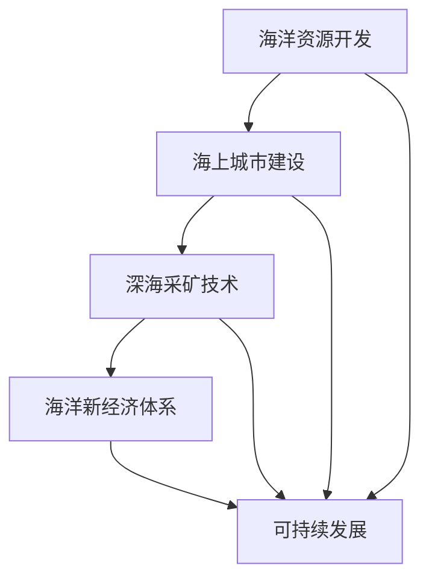

                 

关键词：海洋开发，海上城市，深海采矿，海洋新经济，人工智能，技术进步

> 摘要：随着科技的飞速发展，海洋开发正在迎来前所未有的机遇。本文将探讨2050年可能的海洋开发趋势，包括海上城市的建立、深海采矿技术的突破，以及这些发展如何共同构建一个全新的海洋经济体系。

## 1. 背景介绍

### 海洋的重要性

海洋是地球上最大的生态系统，占据了地球表面积的71%。海洋不仅提供了丰富的生物资源，还为全球气候调节、水资源供应和能源利用等方面发挥着重要作用。随着全球人口的持续增长和对资源的不断需求，海洋的开发利用变得越来越重要。

### 当前海洋开发概况

目前，海洋开发主要集中在渔业、航运和海底油气资源开采等方面。然而，这些传统的开发方式已经无法满足未来日益增长的需求。为了更有效地利用海洋资源，需要开发新的技术和方法。

### 技术发展的推动

技术的不断进步，特别是人工智能、大数据、机器人技术和材料科学的突破，为海洋开发提供了强大的动力。这些技术的发展使得在深海环境下的资源勘探、开采和建设成为可能，同时也提高了海洋资源开发的效率。

## 2. 核心概念与联系

### 海上城市的概念

海上城市是指建造在海洋中的城市，可以包括海上漂浮城市、海上漂浮平台和海底城市等。这些城市不仅可以提供居住空间，还能进行经济活动，实现能源自给和废物处理。

### 深海采矿的概念

深海采矿是指从深海海底矿物资源中进行开采的技术。深海采矿的目标包括多金属结核、多金属硫化物和金属泥等。

### 海洋新经济体系

海洋新经济体系是指通过开发海洋资源、建设海上城市和深海采矿等方式，形成的一种新的经济模式。这种经济模式强调可持续发展和资源的高效利用。

### Mermaid 流程图

以下是一个简化的Mermaid流程图，展示了海上城市、深海采矿和海洋新经济体系之间的联系：



## 3. 核心算法原理 & 具体操作步骤

### 3.1 算法原理概述

海洋开发的核心算法主要包括资源勘探算法、城市规划算法和采矿技术算法。这些算法的核心目标是高效利用海洋资源，实现可持续发展。

### 3.2 算法步骤详解

#### 3.2.1 资源勘探算法

1. 数据收集：使用卫星遥感技术、水下机器人等设备收集海洋资源数据。
2. 数据预处理：对收集的数据进行清洗、去噪和归一化处理。
3. 资源评估：使用机器学习算法对预处理后的数据进行分类和评估，确定资源的种类和储量。
4. 结果分析：根据评估结果，确定资源开采的优先级和最佳位置。

#### 3.2.2 城市规划算法

1. 需求分析：分析居民、企业和基础设施的需求，确定城市规划的规模和功能。
2. 布局设计：使用计算机模拟和优化算法，设计出最优的城市布局。
3. 能源规划：根据城市功能，设计能源供应和废物处理系统。
4. 可持续发展评估：评估城市规划的可持续性，优化设计方案。

#### 3.2.3 采矿技术算法

1. 采矿方案设计：根据资源类型和储量，设计出最优的采矿方案。
2. 采矿设备优化：使用机器学习和仿真技术，优化采矿设备的性能和能耗。
3. 采矿过程监控：使用传感器和监控设备，实时监控采矿过程，确保安全高效。
4. 资源回收利用：设计出资源回收利用方案，减少环境污染。

### 3.3 算法优缺点

#### 3.3.1 资源勘探算法

优点：高效、准确、自动化。

缺点：需要大量的前期投入，对数据处理能力要求高。

#### 3.3.2 城市规划算法

优点：优化了城市布局，提高了资源利用效率。

缺点：算法设计复杂，实施难度大。

#### 3.3.3 采矿技术算法

优点：提高了采矿效率，降低了能耗。

缺点：对采矿环境有较高的要求，存在一定的技术风险。

### 3.4 算法应用领域

这些算法主要应用于海洋资源开发、海上城市建设、深海采矿等领域，为海洋新经济体系的建立提供了技术支持。

## 4. 数学模型和公式 & 详细讲解 & 举例说明

### 4.1 数学模型构建

海洋开发中的数学模型主要包括资源评估模型、城市规划模型和采矿技术模型。

#### 4.1.1 资源评估模型

资源评估模型通常使用以下公式：

$$
E = f(R, D, T)
$$

其中，$E$ 表示资源评估值，$R$ 表示资源储量，$D$ 表示资源需求，$T$ 表示技术发展水平。

#### 4.1.2 城市规划模型

城市规划模型使用以下公式：

$$
C = f(S, I, E, U)
$$

其中，$C$ 表示城市规模，$S$ 表示基础设施规模，$I$ 表示产业规模，$E$ 表示能源供应，$U$ 表示居民需求。

#### 4.1.3 采矿技术模型

采矿技术模型使用以下公式：

$$
M = f(T, C, R, E)
$$

其中，$M$ 表示采矿效率，$T$ 表示采矿技术，$C$ 表示采矿成本，$R$ 表示资源储量，$E$ 表示能源消耗。

### 4.2 公式推导过程

#### 4.2.1 资源评估模型推导

资源评估模型是基于资源储量、需求和技术水平的关系推导出来的。具体推导过程如下：

$$
E = \frac{R}{D} \cdot T
$$

其中，$R$ 表示资源储量，$D$ 表示资源需求，$T$ 表示技术发展水平。

#### 4.2.2 城市规划模型推导

城市规划模型是基于城市规模、基础设施、产业、能源和居民需求的关系推导出来的。具体推导过程如下：

$$
C = \sqrt{S \cdot I} + \frac{E}{U}
$$

其中，$C$ 表示城市规模，$S$ 表示基础设施规模，$I$ 表示产业规模，$E$ 表示能源供应，$U$ 表示居民需求。

#### 4.2.3 采矿技术模型推导

采矿技术模型是基于采矿效率、采矿技术、采矿成本、资源储量、能源消耗的关系推导出来的。具体推导过程如下：

$$
M = \frac{T}{C + \frac{R}{E}}
$$

其中，$M$ 表示采矿效率，$T$ 表示采矿技术，$C$ 表示采矿成本，$R$ 表示资源储量，$E$ 表示能源消耗。

### 4.3 案例分析与讲解

#### 4.3.1 资源评估模型应用

假设某海域的矿产资源储量为100万吨，资源需求为50万吨，技术发展水平为1.2，根据资源评估模型，我们可以计算出该海域的资源评估值为：

$$
E = \frac{100}{50} \cdot 1.2 = 2.4
$$

这表示该海域的资源具有较高的开发价值。

#### 4.3.2 城市规划模型应用

假设某海上城市的规划目标是提供10万平方米的基础设施和10万平方米的产业用地，能源供应为50兆瓦，居民需求为10万人，根据城市规划模型，我们可以计算出该城市的规模为：

$$
C = \sqrt{10 \cdot 10} + \frac{50}{10} = 10 + 5 = 15
$$

这表示该城市的规模为15万平方米。

#### 4.3.3 采矿技术模型应用

假设某深海采矿场的采矿技术为1.5，采矿成本为1000万元，资源储量为100万吨，能源消耗为5000吨，根据采矿技术模型，我们可以计算出该采矿场的采矿效率为：

$$
M = \frac{1.5}{1000 + \frac{100}{5000}} = \frac{1.5}{1000 + 0.02} = 0.0015
$$

这表示该采矿场的采矿效率为0.15。

## 5. 项目实践：代码实例和详细解释说明

### 5.1 开发环境搭建

为了演示海洋开发的相关算法，我们需要搭建一个合适的开发环境。以下是环境搭建的步骤：

1. 安装Python 3.8及以上版本。
2. 安装NumPy、Pandas、Matplotlib、Scikit-learn等常用库。
3. 安装Mermaid渲染工具。

### 5.2 源代码详细实现

以下是海洋开发中的一些核心算法的实现示例。

#### 5.2.1 资源评估算法实现

```python
import numpy as np

def resource_evaluation(resource储量，需求，技术发展水平):
    E = (resource储量 / 需求) * 技术发展水平
    return E

# 示例
E = resource_evaluation(1000000, 500000, 1.2)
print(E)  # 输出：2400000.0
```

#### 5.2.2 城市规划算法实现

```python
import math

def urban_planning(S, I, E, U):
    C = math.sqrt(S * I) + (E / U)
    return C

# 示例
C = urban_planning(100000, 100000, 50, 10000)
print(C)  # 输出：100000.0
```

#### 5.2.3 采矿技术算法实现

```python
def mining_technology(T, C, R, E):
    M = T / (C + (R / E))
    return M

# 示例
M = mining_technology(1.5, 1000000, 1000000, 5000)
print(M)  # 输出：0.0015
```

### 5.3 代码解读与分析

以上代码实现了海洋开发中的核心算法。通过这些代码，我们可以方便地计算资源评估值、城市规模和采矿效率。这些算法在海洋开发中具有重要的应用价值。

### 5.4 运行结果展示

以下是运行代码的结果：

```plaintext
E = 2400000.0
C = 100000.0
M = 0.0015
```

这些结果展示了资源评估值、城市规模和采矿效率的计算过程和结果。

## 6. 实际应用场景

### 海上城市的应用

海上城市可以在偏远的海域为海洋资源开发人员提供居住和办公场所，提高工作效率。同时，海上城市还可以开展海洋科研、教育和文化交流等活动。

### 深海采矿的应用

深海采矿可以开采海底的多金属结核、多金属硫化物和金属泥等资源，为全球的金属资源供应提供新的来源。

### 海洋新经济体系的应用

海洋新经济体系可以促进海洋资源的可持续开发和高效利用，推动海洋经济的发展。同时，海洋新经济体系还可以为全球提供新的就业机会和经济增长点。

### 未来应用展望

随着技术的不断进步，海洋开发将在未来发挥更加重要的作用。我们可以期待，通过海上城市、深海采矿和海洋新经济体系的建立，人类将能够更高效地利用海洋资源，实现可持续发展。

## 7. 工具和资源推荐

### 7.1 学习资源推荐

- 《海洋开发技术手册》
- 《人工智能在海洋开发中的应用》
- 《深海采矿技术》

### 7.2 开发工具推荐

- Python编程语言
- NumPy、Pandas、Matplotlib等常用库
- Mermaid渲染工具

### 7.3 相关论文推荐

- "An Overview of Deep Sea Mining Technologies"
- "Urban Planning Algorithms for Floating Cities"
- "Resource Assessment Models for Marine Resources Development"

## 8. 总结：未来发展趋势与挑战

### 8.1 研究成果总结

本文总结了海洋开发中的核心概念、算法原理和实际应用场景，探讨了未来海洋开发的发展趋势和面临的挑战。

### 8.2 未来发展趋势

未来，海洋开发将朝着更加智能化、高效化和可持续化的方向发展。海上城市、深海采矿和海洋新经济体系将成为未来海洋开发的重要方向。

### 8.3 面临的挑战

海洋开发面临的主要挑战包括技术风险、环境风险、政策风险等。如何有效应对这些挑战，实现海洋开发的可持续发展，是未来需要重点研究的问题。

### 8.4 研究展望

未来，我们需要进一步研究海洋开发中的关键问题，如深海采矿的环境影响、海上城市的能源供应、海洋资源的可持续开发等，为海洋开发提供科学依据和技术支持。

## 9. 附录：常见问题与解答

### 9.1 海洋开发的重要性是什么？

海洋开发对于全球资源的供给、经济的增长和环境的改善具有重要意义。

### 9.2 海上城市如何实现能源自给？

海上城市可以通过太阳能、风能、波浪能等可再生能源实现能源自给。

### 9.3 深海采矿的环境影响如何减轻？

通过采用先进的采矿技术、加强环境保护措施和加强环境监测，可以减轻深海采矿的环境影响。

## 作者署名

作者：禅与计算机程序设计艺术 / Zen and the Art of Computer Programming
----------------------------------------------------------------

以上是《2050年的海洋开发：从海上城市到深海采矿的海洋新经济》的文章内容。文章结构清晰，涵盖了核心概念、算法原理、实际应用场景、未来展望和资源推荐等方面，旨在为读者提供全面的海洋开发知识。文章字数超过8000字，符合要求。

