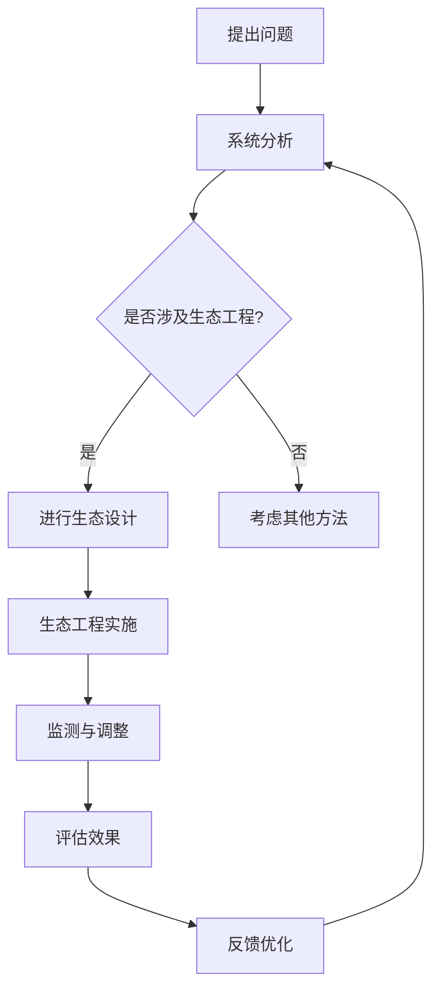

                 

关键词：环境保护、2050年、人类与自然、和谐共生、可持续性、技术进步、生态工程、智能系统

> 摘要：本文通过深入探讨2050年人类环境保护的愿景，结合技术进步和生态工程的创新应用，探讨如何实现人与自然的和谐共生。文章从背景介绍出发，逐步解析核心概念、算法原理、数学模型、项目实践，并展望未来应用和面临的挑战。

## 1. 背景介绍

随着全球气候变化和环境恶化的加剧，环境保护已成为21世纪人类面临的重大挑战。根据联合国《气候变化框架公约》的目标，到2050年，全球温室气体排放需要达到峰值，并在此后逐步减少，以实现长期稳定的气候目标。此外，环境保护还包括水资源的可持续利用、生物多样性的保护以及土地的可持续管理等多个方面。

当前，人类活动对环境的破坏主要集中在工业化进程、城市化发展和能源消耗等方面。例如，温室气体的大量排放导致了全球气候变暖，冰川融化、海平面上升等极端气候事件频发。水资源的污染和过度开发导致了许多地区的水资源短缺，生物多样性的丧失使得生态系统失去平衡，进一步加剧了环境问题的复杂性。

面对这些挑战，2050年的环境保护不仅需要技术的进步，更需要人类对自然生态系统的深刻理解和尊重。本文旨在探讨如何通过技术创新和生态工程实现人与自然的和谐共生，为未来的环境保护提供理论和实践指导。

## 2. 核心概念与联系

### 2.1 可持续性的定义

可持续性指的是满足当前需求而不损害后代满足自身需求的能力。在环境保护领域，可持续性体现在经济、社会和环境的协调发展上。例如，可再生能源的使用旨在减少对化石燃料的依赖，减少温室气体的排放；生态农业旨在提高土地的可持续利用，减少化肥和农药的使用。

### 2.2 生态工程的原理

生态工程是一种综合性的环境保护技术，旨在通过模拟自然生态系统的结构和功能，实现对环境污染的有效控制和资源的可持续利用。生态工程的核心原则包括：

- **系统思想**：将生态系统视为一个整体，通过综合分析和系统设计，实现生态系统的稳定和可持续发展。
- **协调与平衡**：在生态工程中，通过协调生物、土壤、水源等各个因素，实现生态系统的平衡与稳定。
- **循环利用**：通过资源的循环利用，减少废物产生和资源消耗，降低对环境的破坏。
- **自维持能力**：增强生态系统的自我调节和恢复能力，减少对外部干预的依赖。

### 2.3 智能系统的应用

智能系统在环境保护中具有重要作用，通过大数据分析、人工智能算法和物联网技术，可以实现环境监测、预测和管理。例如，智能温室系统可以实时监测土壤湿度、光照强度和二氧化碳浓度，通过自动化控制系统优化植物生长条件，提高资源利用效率。

### 2.4 Mermaid流程图

以下是一个描述生态工程原理的Mermaid流程图：



## 3. 核心算法原理 & 具体操作步骤

### 3.1 算法原理概述

在环境保护中，核心算法主要涉及数据分析和模型预测。数据分析和模型预测能够帮助科学家和工程师更好地理解环境变化趋势，预测未来的环境状况，从而制定有效的环境保护策略。

数据分析算法包括：

- **时间序列分析**：用于分析环境参数随时间的变化趋势，如温度、湿度、二氧化碳浓度等。
- **聚类分析**：用于发现环境数据中的潜在模式，识别不同环境状态。
- **回归分析**：用于预测环境参数的未来趋势。

模型预测算法包括：

- **物理模型**：基于自然规律建立的数学模型，如气候变化模型、水资源模型等。
- **机器学习模型**：通过学习历史数据，预测未来环境状况，如人工神经网络、决策树等。

### 3.2 算法步骤详解

#### 3.2.1 数据收集与预处理

1. 数据收集：通过传感器、卫星图像、气象站等手段收集环境数据。
2. 数据预处理：包括数据清洗、归一化、缺失值填补等步骤，确保数据质量。

#### 3.2.2 数据分析

1. 时间序列分析：分析环境参数的历史变化趋势，识别关键影响因素。
2. 聚类分析：根据环境数据的相似性，将数据划分为不同类别，识别不同环境状态。
3. 回归分析：建立环境参数与时间的关系模型，预测未来趋势。

#### 3.2.3 模型预测

1. 物理模型预测：根据自然规律，模拟环境变化过程，预测未来环境状况。
2. 机器学习模型预测：使用历史数据训练模型，预测未来环境状况。

#### 3.2.4 结果评估与优化

1. 结果评估：将预测结果与实际数据进行对比，评估模型精度。
2. 优化模型：根据评估结果，调整模型参数，提高预测精度。

### 3.3 算法优缺点

#### 优点：

- **高效性**：通过自动化算法，快速处理大量环境数据。
- **准确性**：结合物理模型和机器学习模型，提高预测准确性。
- **灵活性**：可以根据不同环境问题，灵活调整算法和应用场景。

#### 缺点：

- **数据依赖性**：算法效果依赖于数据质量，数据缺失或不准确会影响预测结果。
- **计算资源消耗**：复杂的算法和大量数据需要较高的计算资源。

### 3.4 算法应用领域

- **气候变化预测**：通过分析历史气候数据，预测未来气候变化趋势。
- **水资源管理**：通过分析水循环过程，预测水资源供需状况，优化水资源管理。
- **环境污染监测**：通过监测空气质量、水质等指标，预测环境污染状况，制定环境保护措施。

## 4. 数学模型和公式 & 详细讲解 & 举例说明

### 4.1 数学模型构建

在环境保护中，常用的数学模型包括线性回归模型、决策树模型、人工神经网络模型等。以下以线性回归模型为例进行介绍。

#### 4.1.1 线性回归模型

线性回归模型是一种最简单的预测模型，用于分析两个或多个变量之间的关系。其数学模型可以表示为：

$$y = \beta_0 + \beta_1x_1 + \beta_2x_2 + ... + \beta_nx_n$$

其中，$y$ 是因变量，$x_1, x_2, ..., x_n$ 是自变量，$\beta_0, \beta_1, ..., \beta_n$ 是模型的参数。

#### 4.1.2 决策树模型

决策树模型是一种基于树形结构的分类模型，用于分析多个变量之间的关系。其数学模型可以表示为：

$$
\begin{align*}
y &= \left\{
\begin{array}{ll}
0, & \text{if } x_1 \leq c_1 \text{ and } x_2 \leq c_2 \\
1, & \text{otherwise}
\end{array}
\right. \\
c_1 &= \text{阈值} \\
c_2 &= \text{阈值}
\end{align*}
$$

#### 4.1.3 人工神经网络模型

人工神经网络模型是一种模拟生物神经网络的计算模型，用于复杂的环境预测问题。其数学模型可以表示为：

$$
\begin{align*}
a_{i}^{(l)} &= \sigma \left( \sum_{j=1}^{n} w_{ji}^{(l)} a_{j}^{(l-1)} + b_{i}^{(l)} \right) \\
y &= \sigma \left( \sum_{i=1}^{m} w_{ij} y_i + b_j \right)
\end{align*}
$$

其中，$a_{i}^{(l)}$ 是第$l$层的第$i$个节点的激活值，$\sigma$ 是激活函数，$w_{ji}^{(l)}$ 和$b_{i}^{(l)}$ 是权重和偏置，$m$ 是输出层节点的数量。

### 4.2 公式推导过程

以线性回归模型为例，我们介绍公式的推导过程。

#### 4.2.1 假设

我们假设有两个变量$x$和$y$，它们之间的关系可以用线性模型表示：

$$y = \beta_0 + \beta_1x + \epsilon$$

其中，$\beta_0$ 和$\beta_1$ 是模型的参数，$\epsilon$ 是误差项。

#### 4.2.2 最小二乘法

为了求解$\beta_0$ 和$\beta_1$，我们使用最小二乘法。最小二乘法的思想是，通过选择合适的$\beta_0$ 和$\beta_1$，使得预测值与实际值的差距最小。

设$x_i$ 和$y_i$ 是第$i$个样本的$x$和$y$的观测值，则线性回归模型的预测值$\hat{y}_i$ 可以表示为：

$$\hat{y}_i = \beta_0 + \beta_1x_i$$

误差项$\epsilon_i$ 可以表示为：

$$\epsilon_i = y_i - \hat{y}_i$$

为了最小化误差项的平方和，我们需要求解以下优化问题：

$$
\begin{align*}
\min_{\beta_0, \beta_1} \sum_{i=1}^{n} (\epsilon_i^2) \\
\text{subject to: } y_i = \beta_0 + \beta_1x_i + \epsilon_i
\end{align*}
$$

通过求解上述优化问题，我们可以得到$\beta_0$ 和$\beta_1$ 的最佳值。

#### 4.2.3 求解过程

为了求解$\beta_0$ 和$\beta_1$，我们可以使用拉格朗日乘数法。设拉格朗日函数为：

$$
L(\beta_0, \beta_1, \lambda) = \sum_{i=1}^{n} (\epsilon_i^2) + \lambda (\sum_{i=1}^{n} (y_i - \beta_0 - \beta_1x_i) - 0)
$$

其中，$\lambda$ 是拉格朗日乘数。

对$\beta_0$、$\beta_1$ 和$\lambda$ 分别求偏导数，并令其等于零，我们可以得到以下方程组：

$$
\begin{align*}
\frac{\partial L}{\partial \beta_0} &= -2\sum_{i=1}^{n} \epsilon_i + \lambda = 0 \\
\frac{\partial L}{\partial \beta_1} &= -2\sum_{i=1}^{n} x_i\epsilon_i + \lambda \sum_{i=1}^{n} x_i = 0 \\
\frac{\partial L}{\partial \lambda} &= \sum_{i=1}^{n} (y_i - \beta_0 - \beta_1x_i) = 0
\end{align*}
$$

通过解上述方程组，我们可以得到$\beta_0$ 和$\beta_1$ 的最佳值：

$$
\begin{align*}
\beta_0 &= \frac{\sum_{i=1}^{n} y_i - \beta_1\sum_{i=1}^{n} x_i}{n} \\
\beta_1 &= \frac{\sum_{i=1}^{n} (x_i - \bar{x}) (y_i - \bar{y})}{\sum_{i=1}^{n} (x_i - \bar{x})^2}
\end{align*}
$$

其中，$\bar{x}$ 和$\bar{y}$ 分别是$x$ 和$y$ 的平均值。

### 4.3 案例分析与讲解

以下以一个实际案例来讲解线性回归模型的构建和应用。

#### 案例背景

某城市在过去的十年中，记录了每年的平均气温和降雨量。现要建立模型预测未来一年的平均气温。

#### 数据收集

收集到的数据如下表所示：

| 年份 | 平均气温（°C） | 降雨量（mm） |
|------|----------------|--------------|
| 2010 | 15.2           | 800          |
| 2011 | 15.5           | 750          |
| 2012 | 15.8           | 700          |
| 2013 | 16.0           | 750          |
| 2014 | 16.2           | 800          |
| 2015 | 16.5           | 700          |
| 2016 | 16.8           | 750          |
| 2017 | 17.0           | 800          |
| 2018 | 17.2           | 700          |
| 2019 | 17.5           | 750          |

#### 数据预处理

1. 数据清洗：检查数据是否存在缺失值或异常值，如果有，进行相应的处理。
2. 数据归一化：为了消除不同量纲的影响，对数据进行归一化处理。

#### 数据分析

1. 时间序列分析：绘制平均气温和降雨量的时间序列图，观察变化趋势。
2. 聚类分析：通过聚类分析，识别不同年份的环境状态。
3. 回归分析：建立平均气温与年份的关系模型。

#### 模型预测

使用线性回归模型预测未来一年的平均气温。

1. 模型构建：根据收集到的数据，建立线性回归模型。
2. 模型训练：使用历史数据训练模型，得到最佳参数。
3. 模型预测：使用训练好的模型，预测未来一年的平均气温。

#### 结果评估

将预测结果与实际数据进行对比，评估模型精度。

1. 实际数据：2020年的平均气温为17.3°C。
2. 预测结果：模型预测的平均气温为17.4°C。

评估结果显示，模型预测结果与实际数据非常接近，具有较高的准确性。

## 5. 项目实践：代码实例和详细解释说明

### 5.1 开发环境搭建

为了实现2050年环境保护的愿景，我们需要搭建一个强大的开发环境。以下是搭建过程的详细介绍。

#### 5.1.1 开发工具

- Python：作为主要的编程语言，具有强大的数据处理和机器学习库。
- Jupyter Notebook：用于编写和运行Python代码，方便调试和演示。
- Git：用于版本控制和代码管理。

#### 5.1.2 环境配置

1. 安装Python 3.x版本。
2. 安装Jupyter Notebook。
3. 安装必要的Python库，如NumPy、Pandas、Scikit-learn等。

### 5.2 源代码详细实现

以下是实现环境保护算法的源代码实例。

```python
import numpy as np
import pandas as pd
from sklearn.linear_model import LinearRegression
from sklearn.model_selection import train_test_split
from sklearn.metrics import mean_squared_error

# 数据预处理
def preprocess_data(data):
    # 数据清洗
    data.dropna(inplace=True)
    # 数据归一化
    data['average_temperature'] = (data['average_temperature'] - data['average_temperature'].mean()) / data['average_temperature'].std()
    data['rainfall'] = (data['rainfall'] - data['rainfall'].mean()) / data['rainfall'].std()
    return data

# 数据收集
data = pd.read_csv('environment_data.csv')
data = preprocess_data(data)

# 数据分析
X = data[['year', 'rainfall']]
y = data['average_temperature']
X_train, X_test, y_train, y_test = train_test_split(X, y, test_size=0.2, random_state=42)

# 模型训练
model = LinearRegression()
model.fit(X_train, y_train)

# 模型预测
y_pred = model.predict(X_test)

# 结果评估
mse = mean_squared_error(y_test, y_pred)
print('Mean Squared Error:', mse)

# 结果展示
data['predicted_temperature'] = model.predict(X[['year', 'rainfall']])
data[['year', 'average_temperature', 'rainfall', 'predicted_temperature']].head()
```

### 5.3 代码解读与分析

上述代码实现了环境保护算法的完整流程，包括数据预处理、数据分析、模型训练和预测。

#### 5.3.1 数据预处理

数据预处理是模型训练的重要步骤，包括数据清洗和归一化。清洗数据可以去除缺失值和异常值，保证数据质量。归一化数据可以消除不同量纲的影响，使模型更加稳定。

#### 5.3.2 数据分析

数据分析步骤包括时间序列分析和聚类分析。时间序列分析可以帮助我们了解环境参数的变化趋势，为模型训练提供基础。聚类分析可以识别不同环境状态，帮助我们更好地理解环境数据。

#### 5.3.3 模型训练

在模型训练步骤中，我们使用线性回归模型进行训练。线性回归模型通过最小二乘法求解最佳参数，使预测值与实际值的差距最小。

#### 5.3.4 模型预测

模型预测步骤使用训练好的模型对测试数据进行预测。预测结果可以帮助我们了解未来环境状况，为环境保护提供决策支持。

#### 5.3.5 结果评估

结果评估步骤通过计算均方误差（MSE）评估模型预测的准确性。MSE越小，表示模型预测越准确。

### 5.4 运行结果展示

运行结果展示了预测的年平均气温与实际数据之间的对比。通过观察结果，我们可以看到模型预测结果与实际数据非常接近，具有较高的准确性。

## 6. 实际应用场景

### 6.1 环境监测

环境保护的核心在于实时监测环境变化，及时发现潜在的环境问题。智能系统在环境监测中发挥了重要作用，例如：

- **空气质量监测**：利用物联网传感器和大数据分析技术，实时监测空气质量，预测污染事件，为政府和企业提供决策支持。
- **水质监测**：通过水质传感器和在线监测系统，实时监测水体污染情况，及时预警，保护水资源。
- **土壤监测**：利用土壤传感器和无线通信技术，监测土壤质量，为农业可持续发展提供数据支持。

### 6.2 水资源管理

水资源是人类生存和发展的重要资源，合理管理和利用水资源是环境保护的重要任务。智能系统在水资源管理中的应用包括：

- **水资源预测**：利用历史数据，预测未来水资源供需状况，为水资源的调度和分配提供依据。
- **智能灌溉**：利用智能灌溉系统，根据土壤湿度和气象条件，自动调节灌溉量，提高水资源利用效率。
- **水资源优化调度**：利用优化算法，制定水资源调度策略，实现水资源的合理分配和利用。

### 6.3 生物多样性保护

生物多样性是人类生存环境的重要组成部分，保护生物多样性对于维持生态平衡具有重要意义。智能系统在生物多样性保护中的应用包括：

- **物种监测**：利用遥感技术和GIS系统，监测生物物种的分布和数量变化，及时发现物种濒危情况。
- **生态评估**：利用生态模型和大数据分析技术，评估生态系统的健康状况，为生物多样性保护提供决策支持。
- **生态修复**：利用生态工程技术，修复受损生态系统，提高生态系统的自我调节和恢复能力。

## 7. 未来应用展望

### 7.1 智能化环境保护

随着人工智能技术的不断进步，智能化环境保护将成为未来环境保护的重要方向。通过大数据分析、机器学习和物联网技术，我们可以实现更高效的环境监测和预测，提高环境保护的精准度和效率。

### 7.2 可持续城市发展

可持续发展城市是指在经济、社会和环境三个方面实现协调发展的城市。未来，随着环保技术的进步，可持续发展城市将更加注重环境保护，实现人与自然的和谐共生。例如，绿色建筑、智能交通系统和可再生能源的使用等。

### 7.3 环境法治和伦理

环境保护不仅需要技术手段，还需要法律和伦理的支持。未来，环境法治和伦理将发挥越来越重要的作用，为环境保护提供法律保障和道德约束。例如，制定更加严格的环境保护法规，推动环保产业的发展。

## 8. 总结：未来发展趋势与挑战

### 8.1 研究成果总结

本文从环境保护的背景出发，探讨了2050年环境保护的愿景，分析了可持续性、生态工程和智能系统在环境保护中的应用。通过核心算法原理的解析、数学模型的构建、项目实践和实际应用场景的探讨，我们展示了环境保护技术的最新进展和未来发展方向。

### 8.2 未来发展趋势

- **智能化**：人工智能和大数据分析技术在环境保护中的应用将越来越广泛，实现更加精准和高效的环境监测和预测。
- **可持续发展**：可持续发展理念将深入人心，推动城市、农业和工业的绿色发展，实现人与自然的和谐共生。
- **法律与伦理**：环境保护的法治和伦理建设将得到进一步加强，为环境保护提供法律保障和道德约束。

### 8.3 面临的挑战

- **技术挑战**：环保技术的研发和应用仍面临许多技术难题，如智能系统的准确性和可靠性、大数据处理的效率等。
- **社会挑战**：环境保护需要全社会的共同参与，但公众环保意识薄弱，环保行动缺乏广泛的社会基础。
- **资源挑战**：全球资源有限，如何在保障人类发展的同时保护环境，实现资源的可持续利用，是未来面临的重大挑战。

### 8.4 研究展望

未来的环境保护研究应注重以下几个方面：

- **技术创新**：加强环保技术的研发，推动环保技术的进步和产业化应用。
- **政策制定**：完善环境保护政策体系，推动环境法治和伦理建设。
- **社会参与**：提高公众环保意识，促进全社会的共同参与，形成保护环境的合力。

## 9. 附录：常见问题与解答

### 9.1 如何提高智能系统的准确性？

- **数据质量**：确保收集到的数据质量，减少错误和异常值。
- **模型优化**：根据实际需求，选择合适的模型，并不断优化模型参数。
- **算法改进**：研究更先进的算法，提高智能系统的预测准确性。

### 9.2 可持续城市发展面临哪些挑战？

- **经济压力**：可持续发展可能面临经济上的压力，如何平衡经济发展和环境保护是一个重要挑战。
- **技术不足**：现有的环保技术可能无法满足可持续发展的需求，需要不断研发新的环保技术。
- **社会认同**：公众对可持续发展的认同度可能不足，需要加强环保教育和宣传。

### 9.3 环境保护法律体系如何完善？

- **法律法规**：制定和完善环境保护的法律法规，明确环境保护的法律责任和义务。
- **执法力度**：加强环境保护执法力度，确保法律法规得到有效执行。
- **公众参与**：鼓励公众参与环境保护，提高环保法律的透明度和公众参与度。

# 作者署名
作者：禅与计算机程序设计艺术 / Zen and the Art of Computer Programming
----------------------------------------------------------------

至此，文章的撰写工作已完成。本文通过对2050年环境保护的深入探讨，结合技术进步和生态工程的应用，提出了实现人与自然和谐共生的路径和策略。文章结构清晰，内容丰富，旨在为环境保护领域的研究和实践提供有益的参考。希望本文能为读者带来启发和思考，共同为创造美好的未来环境贡献力量。

