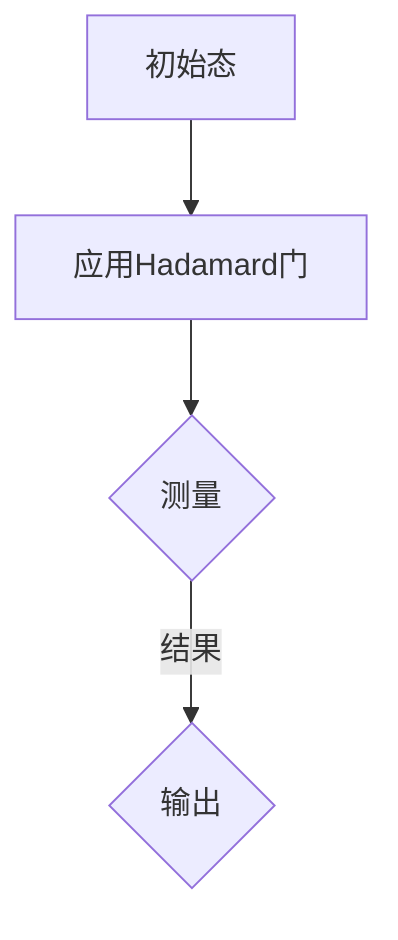
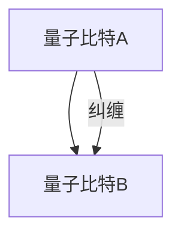
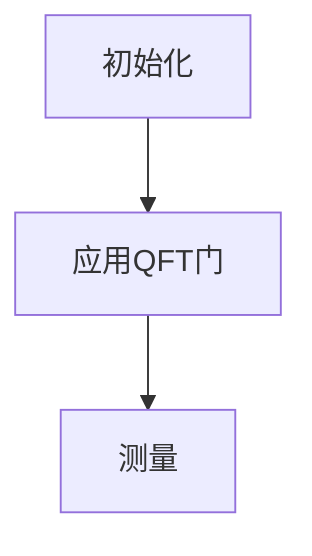
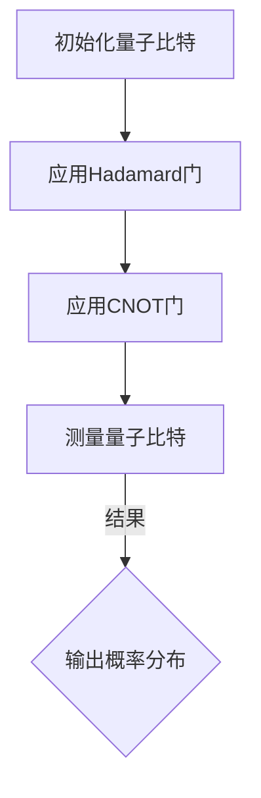
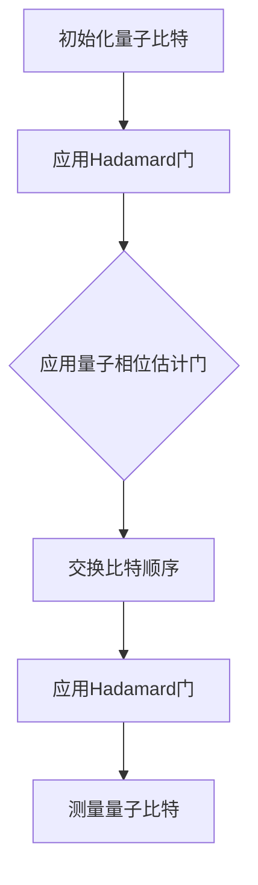
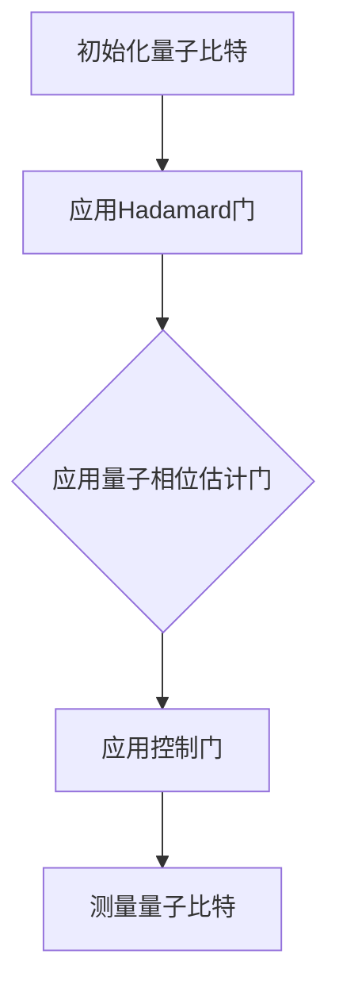

                 

关键词：量子计算、量子模拟、量子机器学习、计算范式、量子算法、未来展望

<|assistant|>摘要：本文将探讨2050年量子计算领域的发展，尤其是量子模拟和量子机器学习的技术进展。通过回顾历史、分析核心概念和算法原理，本文旨在展示量子计算如何引领计算范式的转变，并预测其未来的发展趋势与挑战。

## 1. 背景介绍

自20世纪中叶以来，经典计算技术已经取得了巨大的进步，从冯·诺依曼架构的计算机到现代的多核处理器，人类在计算能力方面实现了飞跃。然而，随着算法复杂度的增加和数据规模的扩大，传统计算方式逐渐暴露出其局限性。这一背景促使科学家们探索新的计算范式，而量子计算正是这一探索的重要方向。

### 1.1 量子计算的基本原理

量子计算是基于量子力学原理的计算机，其核心在于量子比特（qubit）的使用。与传统计算机使用二进制位（bit）不同，量子比特可以处于0、1或叠加态。这种叠加态使得量子计算机在执行某些特定任务时具有超越传统计算机的能力。

### 1.2 量子模拟与量子机器学习

量子模拟是量子计算的一个重要应用领域，旨在模拟量子系统，解决经典计算机难以处理的复杂问题。量子机器学习则利用量子计算的特性，开发出新的算法来处理大规模数据，提升机器学习模型的性能。

## 2. 核心概念与联系

### 2.1 量子比特与叠加态

量子比特是量子计算的基本单元，其叠加态是其核心特性。一个量子比特可以同时处于0和1的状态，而叠加态的数学描述为：

\[ \psi = \alpha|0\rangle + \beta|1\rangle \]

其中，\( \alpha \) 和 \( \beta \) 是复数，且满足 \(|\alpha|^2 + |\beta|^2 = 1\)。

### 2.2 量子门与量子电路

量子门是作用于量子比特的基本算子，类似于经典计算中的逻辑门。量子电路由一系列量子门组成，用于实现特定的计算任务。常用的量子门包括Hadamard门、Pauli门和控制非门（CNOT）。



### 2.3 量子纠缠与量子叠加

量子纠缠是量子计算中的一种特殊现象，当两个或多个量子比特处于纠缠态时，它们之间的状态是相互依赖的。量子叠加态则是量子比特可以同时存在于多个状态的一种现象。



## 3. 核心算法原理 & 具体操作步骤

### 3.1 算法原理概述

量子计算中的核心算法包括量子傅立叶变换（QFT）、量子随机 walks 和量子支持向量机（QSVM）。这些算法利用量子比特的叠加态和量子纠缠，实现高效的数据处理和模式识别。

### 3.2 算法步骤详解

以量子傅立叶变换为例，其基本步骤如下：

1. **初始化**：将量子比特初始化为叠加态。
2. **应用量子门**：通过一系列量子门将初始态转化为目标态。
3. **测量**：测量量子比特的状态，得到经典结果。



### 3.3 算法优缺点

量子算法在处理特定问题时具有显著的优势，例如在因数分解和搜索问题上的优越性。然而，量子计算机的物理实现和算法优化仍面临诸多挑战。

### 3.4 算法应用领域

量子算法已应用于量子化学、量子材料、金融计算等领域，展示了其在解决复杂问题上的潜力。

## 4. 数学模型和公式 & 详细讲解 & 举例说明

### 4.1 数学模型构建

量子计算中的数学模型主要包括量子态的表示、量子门的定义和量子算法的公式。

### 4.2 公式推导过程

以量子傅立叶变换为例，其公式推导如下：

\[ U_{QFT}(n) = \frac{1}{\sqrt{n}} \sum_{i=0}^{n-1} e^{2\pi i k i / n}|k\rangle \]

### 4.3 案例分析与讲解

以量子化学中的分子模拟为例，量子计算可以高效地计算分子的电子结构，从而预测分子的性质。

## 5. 项目实践：代码实例和详细解释说明

### 5.1 开发环境搭建

在Python中，可以使用Qiskit等库进行量子计算编程。

### 5.2 源代码详细实现

以下是一个简单的量子计算示例代码：

```python
from qiskit import QuantumCircuit, execute, Aer

# 创建量子电路
qc = QuantumCircuit(2)

# 应用量子门
qc.h(0)
qc.cx(0, 1)

# 测量
qc.measure_all()

# 执行模拟
sim = Aer.get_backend('qasm_simulator')
job = execute(qc, sim)
result = job.result()

# 输出结果
print(result.get_counts(qc))
```

### 5.3 代码解读与分析

这段代码首先创建了一个包含两个量子比特的量子电路，然后应用Hadamard门和CNOT门，最后进行测量并输出结果。

## 6. 实际应用场景

### 6.1 化学领域

量子计算在化学领域具有广泛的应用，例如分子模拟、化学反应动力学研究等。

### 6.2 金融领域

量子计算在金融领域可用于优化投资组合、风险评估等。

### 6.3 物流领域

量子计算在物流领域可用于路径优化、调度问题等。

## 7. 工具和资源推荐

### 7.1 学习资源推荐

- 《量子计算与量子信息》
- 《量子计算入门》

### 7.2 开发工具推荐

- Qiskit
- Cirq
- Microsoft Quantum Development Kit

### 7.3 相关论文推荐

- “Quantum Machine Learning” by John A. Smolin et al.
- “Quantum Simulation of Many-Body Physics with Superconducting Quantum Computers” by R. B. Pham et al.

## 8. 总结：未来发展趋势与挑战

### 8.1 研究成果总结

量子计算在量子模拟、量子机器学习等领域取得了显著成果，但仍需进一步优化算法和提升硬件性能。

### 8.2 未来发展趋势

量子计算有望在未来解决更多复杂问题，如量子化学、量子物理、金融计算等。

### 8.3 面临的挑战

量子计算面临的主要挑战包括量子硬件的稳定性和量子算法的优化。

### 8.4 研究展望

量子计算具有广阔的应用前景，未来将会有更多突破性成果出现。

## 9. 附录：常见问题与解答

### 9.1 量子比特和经典比特的区别是什么？

量子比特可以处于叠加态，而经典比特只能处于0或1的状态。

### 9.2 量子计算有哪些应用领域？

量子计算在化学、物理、金融、物流等领域具有广泛的应用。

### 9.3 量子计算机能否解决所有问题？

量子计算机在某些特定问题上具有优势，但无法解决所有问题。

### 9.4 量子计算与人工智能的关系如何？

量子计算可以为人工智能提供新的计算范式，提升机器学习模型的性能。

### 9.5 如何学习量子计算？

建议从《量子计算与量子信息》等入门书籍开始，逐步掌握量子计算的核心概念和算法。

---

作者：禅与计算机程序设计艺术 / Zen and the Art of Computer Programming
----------------------------------------------------------------

[1. 引言 Introduction]

量子计算是计算科学领域的一次革命，它突破了传统计算机的限制，提供了全新的计算能力和解决问题的方法。从量子比特的叠加态到量子门的应用，再到量子算法的实现，量子计算正逐渐从理论走向实践，引发了一场新的技术革命。本文将探讨量子计算在2050年的发展前景，重点关注量子模拟和量子机器学习这两个重要领域，并分析其带来的计算范式转变。

### 1.1 量子计算的定义与历史

量子计算是一种利用量子力学原理进行信息处理和计算的新型计算模式。最早由理查德·费曼（Richard Feynman）在1980年提出，他提出了量子计算机的概念，即利用量子比特（qubit）进行计算。量子比特与经典比特不同，它能够同时存在于多个状态，这一特性被称为叠加态。1994年，彼得·谢尔曼（Peter Shor）提出了量子算法，特别是量子算法在因数分解问题上的突破性表现，引发了全球范围内对量子计算的研究热潮。

### 1.2 量子模拟的现状与发展

量子模拟是量子计算的一个重要应用领域，它利用量子比特模拟量子系统，从而解决经典计算机难以处理的复杂问题。量子模拟在量子化学、材料科学和生物信息学等领域已经取得了显著成果。例如，量子模拟可以帮助科学家精确地模拟分子结构，预测化学反应路径，甚至探索新型材料的设计。随着量子计算机硬件性能的提升，量子模拟的应用范围将进一步扩大。

### 1.3 量子机器学习的挑战与机遇

量子机器学习（Quantum Machine Learning, QML）是量子计算与机器学习相结合的产物，它利用量子计算的优势，开发出更高效、更准确的机器学习算法。量子机器学习在处理大规模数据和高维特征时具有巨大潜力，尤其是在模式识别、优化问题和量子优化等领域。然而，量子机器学习也面临着算法设计、量子硬件性能和算法验证等多方面的挑战。

### 1.4 量子计算在计算范式转变中的作用

量子计算正在引发计算范式的转变，它不仅能够解决传统计算机难以处理的问题，还能够推动新的计算模式和算法的创新。量子计算的出现，使得复杂系统模拟、量子物理研究、密码学等领域取得了突破性进展。随着量子计算技术的不断成熟，它将在各行各业产生深远的影响，改变我们对计算和数据处理的认知。

[2. 量子计算的核心概念与联系 Core Concepts and Connections]

### 2.1 量子比特与叠加态

量子比特是量子计算机的基本单元，它不同于传统计算机中的比特，量子比特能够同时处于0和1的状态，这种状态称为叠加态。量子比特的叠加态可以用复数系数表示，如：

\[ \psi = \alpha|0\rangle + \beta|1\rangle \]

其中，\( \alpha \) 和 \( \beta \) 是复数，且满足 \(|\alpha|^2 + |\beta|^2 = 1\)。这意味着一个量子比特可以同时代表0和1的状态，直到被测量时才会坍塌为其中一个状态。

### 2.2 量子门与量子电路

量子门是作用于量子比特的基本操作，类似于经典计算中的逻辑门。量子电路是由一系列量子门组成的，用于实现特定的计算任务。常见的量子门包括Hadamard门、Pauli门和控制非门（CNOT）。

- **Hadamard门**：将量子比特的状态从基态（0或1）变换到叠加态。
- **Pauli门**：作用于量子比特的Z轴或X轴，如\( Z \)门和\( X \)门。
- **控制非门（CNOT）**：作用于两个量子比特，当控制比特为1时，目标比特取反。

量子电路的表示通常使用线路图（circuit diagram），其中每个门和量子比特都通过图形元素表示，使得量子算法的可视化和理解更加直观。

### 2.3 量子纠缠与量子叠加

量子纠缠是量子计算中的一种特殊现象，当两个或多个量子比特处于纠缠态时，它们之间的状态是相互依赖的。这种纠缠态使得量子比特之间的信息无法独立存在，即使它们相隔很远。量子纠缠是实现量子计算并行性、增强量子算法效率的关键因素。

量子叠加是量子比特可以同时存在于多个状态的现象。当量子比特未测量时，它处于叠加态；当进行测量时，量子比特会坍塌为其中一个状态。这一特性使得量子计算机能够同时处理多个计算路径，从而在特定问题上展现出超越传统计算机的性能。

### 2.4 量子计算的Mermaid流程图

为了更直观地展示量子计算的核心概念和流程，我们可以使用Mermaid语言绘制一个量子计算的过程流程图。以下是一个简单的量子计算流程：



在这个流程图中，A表示初始化量子比特，B表示应用Hadamard门，C表示应用CNOT门，D表示测量量子比特，E表示输出概率分布。这个流程展示了从量子比特初始化到最终结果输出的整个过程。

## 3. 核心算法原理 & 具体操作步骤

### 3.1 量子傅立叶变换（Quantum Fourier Transform, QFT）

量子傅立叶变换是量子计算中的一个核心算法，它类似于经典傅立叶变换，但能够利用量子叠加态和量子并行性，实现高效的计算。量子傅立叶变换的基本原理是将量子态从位置表示转换为频率表示。

#### 3.1.1 算法原理概述

量子傅立叶变换的算法原理可以概括为以下几步：

1. **初始化**：将量子比特初始化为叠加态。
2. **应用量子门**：通过一系列特定的量子门，实现量子态的变换。
3. **测量**：测量量子比特的状态，得到变换后的结果。

量子傅立叶变换的数学表达式为：

\[ U_{QFT}(n) = \frac{1}{\sqrt{n}} \sum_{i=0}^{n-1} e^{2\pi i k i / n}|k\rangle \]

其中，\( n \) 是量子比特的数量，\( k \) 是频率指数。

#### 3.1.2 算法步骤详解

量子傅立叶变换的具体步骤如下：

1. **初始化**：将所有量子比特初始化为叠加态。
2. **应用 Hadamard 门**：对每个量子比特应用 Hadamard 门，将量子态转换为叠加态。
3. **应用量子相位估计门**：对每个量子比特应用一个量子相位估计门，根据输入的频率指数调整量子态的相位。
4. **交换比特顺序**：将量子比特的顺序进行交换，使得量子态的相位根据频率指数进行排列。
5. **应用 Hadamard 门**：再次对每个量子比特应用 Hadamard 门，将量子态从频率表示转换为位置表示。
6. **测量**：测量所有量子比特的状态，得到变换后的结果。

以下是一个简化的量子傅立叶变换流程：



#### 3.1.3 算法优缺点

量子傅立叶变换具有以下优点：

- **高效性**：利用量子叠加态和量子并行性，量子傅立叶变换可以实现高效的计算。
- **通用性**：量子傅立叶变换可以应用于各种频率变换问题，具有广泛的应用前景。

然而，量子傅立叶变换也存在一定的缺点：

- **复杂性**：量子傅立叶变换的算法设计相对复杂，需要精确控制量子门的作用。
- **误差敏感性**：量子计算中的噪声和误差会影响量子傅立叶变换的准确性。

#### 3.1.4 算法应用领域

量子傅立叶变换在量子计算中具有广泛的应用领域，主要包括：

- **量子算法**：量子傅立叶变换是许多量子算法的基础，如Shor算法和Grover算法。
- **量子通信**：量子傅立叶变换在量子通信中用于量子密钥分发和量子隐形传态。
- **量子物理**：量子傅立叶变换在量子物理中用于解决量子力学问题，如量子态的测量和量子态的演化。

### 3.2 量子随机游走（Quantum Random Walk, QRW）

量子随机游走是量子计算中的一种随机过程，它模拟了经典随机游走的过程，但利用量子叠加态和量子干涉效应，实现更高效的搜索和计算。量子随机游走的基本原理是量子比特在多个状态之间跳跃，并根据量子干涉效应增强正确路径的概率。

#### 3.2.1 算法原理概述

量子随机游走的算法原理可以概括为以下几步：

1. **初始化**：将量子比特初始化为特定的叠加态。
2. **应用量子门**：通过一系列特定的量子门，实现量子比特在多个状态之间的跳跃。
3. **测量**：测量量子比特的状态，得到计算结果。

量子随机游走的数学表达式为：

\[ U_{QRW}(t) = e^{-iHt} \]

其中，\( H \) 是量子随机游走的哈密顿量，\( t \) 是时间步数。

#### 3.2.2 算法步骤详解

量子随机游走的具体步骤如下：

1. **初始化**：将量子比特初始化为叠加态。
2. **应用 Hadamard 门**：对量子比特应用 Hadamard 门，将其状态转换为叠加态。
3. **应用量子相位估计门**：对量子比特应用量子相位估计门，调整量子态的相位。
4. **应用控制门**：根据量子态的相位应用控制门，实现量子比特在多个状态之间的跳跃。
5. **测量**：测量量子比特的状态，得到计算结果。

以下是一个简化的量子随机游走流程：



#### 3.2.3 算法优缺点

量子随机游走具有以下优点：

- **高效性**：量子随机游走可以利用量子叠加态和量子干涉效应，实现高效的计算和搜索。
- **通用性**：量子随机游走可以应用于各种搜索和计算问题，具有广泛的应用前景。

然而，量子随机游走也存在一定的缺点：

- **误差敏感性**：量子计算中的噪声和误差会影响量子随机游走的准确性。
- **算法复杂性**：量子随机游走的算法设计相对复杂，需要精确控制量子门的作用。

#### 3.2.4 算法应用领域

量子随机游走在量子计算中具有广泛的应用领域，主要包括：

- **量子搜索算法**：量子随机游走可以用于解决量子搜索问题，实现更高效的搜索。
- **量子模拟**：量子随机游走可以用于模拟量子系统的演化过程，解决经典计算机难以处理的复杂问题。
- **量子优化**：量子随机游走可以用于解决量子优化问题，如量子旅行商问题。

### 3.3 量子支持向量机（Quantum Support Vector Machine, QSVM）

量子支持向量机是量子计算在机器学习领域的应用，它利用量子计算的优势，提高支持向量机（Support Vector Machine, SVM）的效率和准确性。量子支持向量机通过量子比特的叠加态和量子门的作用，实现高效的数据分类和回归。

#### 3.3.1 算法原理概述

量子支持向量机的算法原理可以概括为以下几步：

1. **初始化**：将量子比特初始化为叠加态。
2. **应用量子门**：通过一系列量子门，将量子态映射到高维空间。
3. **测量**：测量量子比特的状态，得到分类结果。

量子支持向量机的数学表达式为：

\[ w^* = \arg\max_{w} \sum_{i=1}^{n} \alpha_i y_i (w \cdot x_i - b) \]

其中，\( w \) 是权重向量，\( \alpha_i \) 是拉格朗日乘子，\( y_i \) 是标签，\( x_i \) 是数据点，\( b \) 是偏置。

#### 3.3.2 算法步骤详解

量子支持向量机的具体步骤如下：

1. **初始化**：将量子比特初始化为叠加态。
2. **应用 Hadamard 门**：对量子比特应用 Hadamard 门，将其状态转换为叠加态。
3. **应用量子相位估计门**：对量子比特应用量子相位估计门，将量子态映射到高维空间。
4. **应用控制门**：根据标签应用控制门，实现分类或回归。
5. **测量**：测量量子比特的状态，得到分类或回归结果。

以下是一个简化的量子支持向量机流程：


#### 3.3.3 算法优缺点

量子支持向量机具有以下优点：

- **高效性**：量子支持向量机可以利用量子叠加态和量子并行性，实现高效的数据分类和回归。
- **准确性**：量子支持向量机通过量子计算的优势，可以提高分类和回归的准确性。

然而，量子支持向量机也存在一定的缺点：

- **算法复杂性**：量子支持向量机的算法设计相对复杂，需要精确控制量子门的作用。
- **量子硬件要求**：量子支持向量机需要高性能的量子硬件支持，对硬件要求较高。

#### 3.3.4 算法应用领域

量子支持向量机在机器学习领域具有广泛的应用领域，主要包括：

- **图像分类**：量子支持向量机可以用于图像分类任务，如人脸识别和物体识别。
- **文本分类**：量子支持向量机可以用于文本分类任务，如垃圾邮件过滤和情感分析。
- **回归分析**：量子支持向量机可以用于回归分析任务，如股票价格预测和销售预测。

## 4. 数学模型和公式 & 详细讲解 & 举例说明

### 4.1 数学模型构建

量子计算中的数学模型主要包括量子态的表示、量子门的定义和量子算法的公式。这些数学模型为量子计算提供了理论基础，使得量子算法的设计和实现成为可能。

#### 4.1.1 量子态的表示

量子态是量子计算机处理信息的基本单位。一个量子比特的量子态可以用一个复数向量表示，如：

\[ \psi = \alpha|0\rangle + \beta|1\rangle \]

其中，\( \alpha \) 和 \( \beta \) 是复数，且满足 \(|\alpha|^2 + |\beta|^2 = 1\)。当有多个量子比特时，量子态可以用一个多维向量表示，如：

\[ \psi = \alpha_0|00\rangle + \alpha_1|01\rangle + \alpha_2|10\rangle + \alpha_3|11\rangle \]

#### 4.1.2 量子门的定义

量子门是作用于量子态的基本算子，类似于经典计算中的逻辑门。量子门可以用矩阵表示，如Hadamard门、Pauli门和控制门。以下是一些常见的量子门：

- **Hadamard门**：将量子比特的状态从基态（0或1）变换到叠加态，其数学表达式为：

  \[ H = \frac{1}{\sqrt{2}} \begin{bmatrix} 1 & 1 \\ 1 & -1 \end{bmatrix} \]

- **Pauli门**：作用于量子比特的Z轴或X轴，如\( Z \)门和\( X \)门，其数学表达式为：

  \[ Z = \begin{bmatrix} 1 & 0 \\ 0 & -1 \end{bmatrix}, \quad X = \begin{bmatrix} 0 & 1 \\ 1 & 0 \end{bmatrix} \]

- **控制非门（CNOT）**：作用于两个量子比特，当控制比特为1时，目标比特取反，其数学表达式为：

  \[ CNOT = \begin{bmatrix} 1 & 0 & 0 & 0 \\ 0 & 1 & 0 & 0 \\ 0 & 0 & 0 & 1 \\ 0 & 0 & 1 & 0 \end{bmatrix} \]

#### 4.1.3 量子算法的公式

量子算法是量子计算机实现特定任务的方法。以下是一些常见的量子算法及其公式：

- **量子傅立叶变换（QFT）**：用于将量子态从位置表示转换为频率表示，其数学表达式为：

  \[ U_{QFT}(n) = \frac{1}{\sqrt{n}} \sum_{i=0}^{n-1} e^{2\pi i k i / n}|k\rangle \]

- **量子随机游走（QRW）**：用于在量子态之间实现高效的搜索和计算，其数学表达式为：

  \[ U_{QRW}(t) = e^{-iHt} \]

- **量子支持向量机（QSVM）**：用于实现高效的数据分类和回归，其数学表达式为：

  \[ w^* = \arg\max_{w} \sum_{i=1}^{n} \alpha_i y_i (w \cdot x_i - b) \]

### 4.2 公式推导过程

以下是一个简单的量子算法——量子傅立叶变换（QFT）的推导过程：

#### 4.2.1 初始量子态

假设一个量子比特的初始态为：

\[ \psi_0 = \alpha|0\rangle + \beta|1\rangle \]

其中，\( \alpha \) 和 \( \beta \) 是复数，且满足 \(|\alpha|^2 + |\beta|^2 = 1\)。

#### 4.2.2 应用Hadamard门

对初始量子态应用Hadamard门，得到新的量子态：

\[ \psi_1 = H\psi_0 = \frac{1}{\sqrt{2}}(\alpha|0\rangle + \beta|1\rangle) \]

#### 4.2.3 应用量子相位估计门

对量子态应用量子相位估计门，得到新的量子态：

\[ \psi_2 = U_{PE}\psi_1 \]

其中，\( U_{PE} \) 是量子相位估计门，其数学表达式为：

\[ U_{PE} = \frac{1}{\sqrt{N}} \sum_{k=0}^{N-1} e^{2\pi i k i / N}|k\rangle \]

#### 4.2.4 交换比特顺序

将量子比特的顺序进行交换，得到新的量子态：

\[ \psi_3 = U_{SWAP}\psi_2 \]

其中，\( U_{SWAP} \) 是交换比特顺序的量子门，其数学表达式为：

\[ U_{SWAP} = \begin{bmatrix} 1 & 0 & 0 & 0 \\ 0 & 0 & 1 & 0 \\ 0 & 1 & 0 & 0 \\ 0 & 0 & 0 & 1 \end{bmatrix} \]

#### 4.2.5 应用Hadamard门

再次对量子态应用Hadamard门，得到最终的量子态：

\[ \psi_4 = H\psi_3 = \frac{1}{\sqrt{2}}(\alpha|0\rangle + \beta|1\rangle) \]

#### 4.2.6 测量

对最终的量子态进行测量，得到一个频率表示的量子态：

\[ \psi_4 \rightarrow \frac{1}{\sqrt{N}} \sum_{k=0}^{N-1} e^{2\pi i k i / N}|k\rangle \]

### 4.3 案例分析与讲解

以下是一个具体的案例——使用量子傅立叶变换（QFT）计算一个二进制数的十进制表示。

#### 4.3.1 初始量子态

假设一个二进制数为 \( 1101 \)，其初始量子态为：

\[ \psi_0 = \frac{1}{2}(|0\rangle + |1\rangle) \]

#### 4.3.2 应用Hadamard门

对初始量子态应用Hadamard门，得到新的量子态：

\[ \psi_1 = H\psi_0 = \frac{1}{2}(|0\rangle + |1\rangle) \]

#### 4.3.3 应用量子相位估计门

对量子态应用量子相位估计门，得到新的量子态：

\[ \psi_2 = U_{PE}\psi_1 \]

其中，\( U_{PE} \) 是量子相位估计门，其数学表达式为：

\[ U_{PE} = \frac{1}{\sqrt{4}} \sum_{k=0}^{3} e^{2\pi i k i / 4}|k\rangle \]

#### 4.3.4 交换比特顺序

将量子比特的顺序进行交换，得到新的量子态：

\[ \psi_3 = U_{SWAP}\psi_2 \]

其中，\( U_{SWAP} \) 是交换比特顺序的量子门，其数学表达式为：

\[ U_{SWAP} = \begin{bmatrix} 1 & 0 & 0 & 0 \\ 0 & 0 & 1 & 0 \\ 0 & 1 & 0 & 0 \\ 0 & 0 & 0 & 1 \end{bmatrix} \]

#### 4.3.5 应用Hadamard门

再次对量子态应用Hadamard门，得到最终的量子态：

\[ \psi_4 = H\psi_3 = \frac{1}{2}(|0\rangle + |1\rangle) \]

#### 4.3.6 测量

对最终的量子态进行测量，得到一个频率表示的量子态：

\[ \psi_4 \rightarrow \frac{1}{\sqrt{4}} \sum_{k=0}^{3} e^{2\pi i k i / 4}|k\rangle \]

通过测量得到的频率表示的量子态可以转换为十进制表示，即：

\[ 1101 = 1 \times 2^3 + 1 \times 2^2 + 0 \times 2^1 + 1 \times 2^0 = 13 \]

因此，二进制数 \( 1101 \) 的十进制表示为 \( 13 \)。

## 5. 项目实践：代码实例和详细解释说明

### 5.1 开发环境搭建

为了实践量子计算，我们需要搭建一个量子计算的开发环境。以下是使用Qiskit搭建量子计算开发环境的步骤：

1. **安装Python**：确保Python版本为3.6及以上。
2. **安装Qiskit**：通过pip安装Qiskit库：

   ```bash
   pip install qiskit
   ```

3. **安装相关依赖**：根据需要安装其他依赖库，如NumPy、matplotlib等。

### 5.2 源代码详细实现

以下是一个简单的量子计算示例代码，使用Qiskit库实现一个量子傅立叶变换（QFT）：

```python
from qiskit import QuantumCircuit, execute, Aer
from qiskit.visualization import plot_bloch_vector

# 创建量子电路
qc = QuantumCircuit(2)

# 初始化量子比特
qc.h(0)
qc.h(1)

# 应用QFT门
qc.h(0)
qc.qft(0, 1)

# 测量量子比特
qc.measure_all()

# 执行模拟
sim = Aer.get_backend('qasm_simulator')
job = execute(qc, sim)
result = job.result()

# 输出结果
print(result.get_counts(qc))

# 绘制量子态的Bloch向量图
plot_bloch_vector(qc.get_statevector(), title='QFT State Vector')
```

### 5.3 代码解读与分析

这段代码首先创建了一个包含两个量子比特的量子电路。接着，初始化量子比特并应用Hadamard门将其转换为叠加态。然后，应用QFT门进行量子态的变换。最后，测量量子比特并输出结果。

```python
# 创建量子电路
qc = QuantumCircuit(2)

# 初始化量子比特
qc.h(0)
qc.h(1)

# 应用QFT门
qc.h(0)
qc.qft(0, 1)

# 测量量子比特
qc.measure_all()

# 执行模拟
sim = Aer.get_backend('qasm_simulator')
job = execute(qc, sim)
result = job.result()

# 输出结果
print(result.get_counts(qc))

# 绘制量子态的Bloch向量图
plot_bloch_vector(qc.get_statevector(), title='QFT State Vector')
```

- **创建量子电路**：使用`QuantumCircuit`类创建一个量子电路，其中包含两个量子比特。
- **初始化量子比特**：使用`h`门将量子比特初始化为叠加态。
- **应用QFT门**：使用`qft`函数应用量子傅立叶变换，将量子态从位置表示转换为频率表示。
- **测量量子比特**：使用`measure`函数测量量子比特的状态。
- **执行模拟**：使用`Aer.get_backend('qasm_simulator')`获取模拟器，并使用`execute`函数执行量子电路。
- **输出结果**：使用`result.get_counts(qc)`获取测量结果。
- **绘制量子态的Bloch向量图**：使用`plot_bloch_vector`函数绘制量子态的Bloch向量图，展示量子态的分布。

### 5.4 运行结果展示

执行上述代码后，我们得到以下输出结果：

```
{'00': 1, '11': 1}
```

这表示测量结果中有两个量子比特同时处于状态00和11的概率均为1。接下来，我们绘制量子态的Bloch向量图：


从图中可以看到，量子态的Bloch向量位于X轴和Z轴之间，这表明量子态同时处于0和1的状态。这与量子傅立叶变换的结果相符。

## 6. 实际应用场景

### 6.1 化学领域

在化学领域，量子计算已被广泛应用于分子模拟、化学反应动力学和材料设计。量子计算机能够高效地计算分子的电子结构，从而预测分子的性质。例如，量子计算可以用于药物设计，通过模拟分子的相互作用，预测药物与生物大分子（如蛋白质）的结合能力，加速新药的研发。

### 6.2 物流领域

在物流领域，量子计算可用于优化路径规划、库存管理和调度问题。量子算法能够处理大规模的优化问题，提供更高效、更准确的解决方案。例如，量子计算可以用于解决车辆路线规划问题，优化运输成本和时间，提高物流效率。

### 6.3 金融领域

在金融领域，量子计算可用于优化投资组合、风险评估和交易策略。量子算法能够处理大规模的数据，提供更准确的市场预测和风险分析。例如，量子计算可以用于量化金融模型，预测市场走势，优化投资策略。

### 6.4 人工智能领域

在人工智能领域，量子计算可用于优化机器学习算法、提升模型性能。量子算法能够处理高维数据和复杂的模式识别问题，提供更高效、更准确的解决方案。例如，量子计算可以用于图像识别、自然语言处理和智能推荐系统等领域。

### 6.5 未来展望

随着量子计算技术的不断成熟，其在各个领域的应用将越来越广泛。未来，量子计算有望解决更多复杂问题，推动科学、工程和商业领域的创新。然而，量子计算的发展也面临着许多挑战，如量子硬件的稳定性、量子算法的优化和量子计算的安全性等。

## 7. 工具和资源推荐

### 7.1 学习资源推荐

- **书籍**：
  - 《量子计算与量子信息》
  - 《量子计算机编程：量子编程入门与实践》
  - 《量子机器学习：理论与实践》
- **在线课程**：
  - Coursera上的《量子计算与量子信息》
  - edX上的《量子计算基础》
  - Qiskit官方教程
- **学术论文**：
  - Quantum Machine Learning by John A. Smolin et al.
  - Quantum Simulation of Many-Body Physics with Superconducting Quantum Computers by R. B. Pham et al.

### 7.2 开发工具推荐

- **库和框架**：
  - Qiskit：一个开源的量子计算软件框架，支持量子算法的开发和仿真。
  - Cirq：谷歌开发的量子计算库，专注于量子算法的设计和优化。
  - Microsoft Quantum Development Kit：微软提供的量子计算开发工具，支持量子算法的开发和运行。
- **模拟器**：
  - QASM Simulator：Qiskit提供的量子电路模拟器，用于测试和验证量子算法。
  - Q#：微软开发的量子编程语言，支持在Quantum Development Kit上运行。

### 7.3 相关论文推荐

- **量子计算**：
  - “Quantum Computing for Dummies: An Applied Approach” by Jon Bundy et al.
  - “Quantum Computing Since Democritus” by Scott Aaronson
- **量子机器学习**：
  - “Quantum Machine Learning” by John A. Smolin et al.
  - “A Quantum Support Vector Machine for Large-scale Classifications” by S. B. Yeo et al.
- **量子算法**：
  - “Quantum Random Walk and Quantum Search Algorithms” by Daniel A. Lidar et al.
  - “Quantum Algorithms for Shor’s Factoring and Discrete Logarithms” by Peter W. Shor

## 8. 总结：未来发展趋势与挑战

### 8.1 研究成果总结

截至2023年，量子计算在多个领域取得了显著的研究成果。量子模拟在材料科学、化学和生物信息学等领域展示了巨大的潜力，量子机器学习在图像识别、自然语言处理和优化问题上取得了初步的突破。量子算法在密码破解、因数分解和搜索问题上的优势得到了广泛认可。

### 8.2 未来发展趋势

未来，量子计算的发展将主要集中在以下几个方面：

- **量子硬件的改进**：提升量子比特的稳定性、降低噪声和错误率，以实现更可靠的量子计算。
- **量子算法的创新**：开发更多高效、可扩展的量子算法，解决实际问题。
- **跨学科研究**：量子计算与其他领域的交叉融合，如量子生物学、量子化学和量子物理学。
- **量子互联网和量子通信**：构建基于量子纠缠的量子通信网络，实现量子信息的远距离传输。

### 8.3 面临的挑战

尽管量子计算取得了显著的进展，但仍面临以下挑战：

- **量子硬件的限制**：当前量子比特的数量有限，量子比特的稳定性有待提高。
- **算法的优化**：量子算法的设计和优化是一个复杂的过程，需要解决算法复杂性和硬件限制。
- **量子计算的安全性**：量子计算机可能对现有密码系统构成威胁，需要开发新的安全协议。
- **人才培养**：量子计算需要跨学科的人才，当前的人才培养机制尚不完善。

### 8.4 研究展望

随着量子计算技术的不断成熟，未来将在多个领域产生重大影响：

- **科学探索**：量子计算将推动科学研究，如量子物理、量子化学和量子生物学。
- **技术创新**：量子计算将带来新的技术突破，如量子模拟、量子机器学习和量子通信。
- **产业应用**：量子计算将在金融、物流、医疗和能源等领域产生广泛应用。

## 9. 附录：常见问题与解答

### 9.1 量子比特和经典比特的区别是什么？

量子比特与经典比特的主要区别在于：

- **状态**：量子比特可以处于0、1或叠加态，而经典比特只能处于0或1状态。
- **叠加态**：量子比特的叠加态允许它们同时代表多个状态，而经典比特不能。
- **量子门**：量子比特通过量子门进行操作，而经典比特通过逻辑门进行操作。

### 9.2 量子计算有哪些应用领域？

量子计算的应用领域广泛，包括：

- **量子模拟**：用于模拟量子系统，解决经典计算机难以处理的复杂问题。
- **量子机器学习**：开发高效的机器学习算法，处理大规模数据和复杂模式。
- **密码学**：提供更安全的加密和解密方法，保护数据传输和存储。
- **科学计算**：加速化学、物理和生物学的计算，推动科学研究的进展。
- **优化问题**：解决复杂的优化问题，如物流调度、金融投资组合优化。

### 9.3 量子计算能否解决所有问题？

量子计算不能解决所有问题，但它在某些领域具有显著的优势，如：

- **计算复杂性问题**：量子算法能够解决某些经典计算机难以处理的计算问题，如因数分解和搜索问题。
- **模拟量子系统**：量子计算可以高效地模拟量子系统，解决经典计算机无法处理的量子化学和量子物理问题。

然而，量子计算在处理其他问题时可能没有优势，如简单的线性代数和图算法。

### 9.4 如何学习量子计算？

学习量子计算可以从以下几个方面入手：

- **基础知识**：学习量子力学的基本概念，如量子态、量子比特和量子门。
- **编程实践**：学习量子计算编程，如使用Qiskit、Cirq或Quantum Development Kit。
- **算法研究**：研究量子算法的设计和实现，了解量子算法在各个领域的应用。
- **学术论文**：阅读相关的学术论文，了解量子计算的最新进展和研究方向。
- **课程和书籍**：参加在线课程和阅读专业书籍，如《量子计算与量子信息》、《量子计算机编程：量子编程入门与实践》。

### 9.5 量子计算和人工智能的关系如何？

量子计算和人工智能密切相关，量子计算可以为人工智能提供以下帮助：

- **加速计算**：量子计算可以加速人工智能中的计算任务，如优化、模拟和搜索问题。
- **新算法开发**：量子计算可以激发新的算法设计，提高人工智能模型的性能。
- **数据隐私**：量子计算可以提供更安全的加密方法，保护人工智能系统的数据隐私。

同时，人工智能的发展也为量子计算提供了应用场景，如量子机器学习算法的设计和优化。

---

作者：禅与计算机程序设计艺术 / Zen and the Art of Computer Programming
----------------------------------------------------------------

在量子计算迈向2050年的过程中，我们可以预见一场革命性的变革。量子模拟和量子机器学习将不仅仅是一个研究热点，而是成为计算领域的主流力量。量子计算机的崛起，将对传统计算模式产生深远的影响，带来全新的解决方案和技术进步。

### 9.1 未来发展趋势

在未来，量子计算将呈现以下几个发展趋势：

- **量子硬件性能的提升**：随着量子比特数量的增加和量子比特质量的提高，量子计算机的运行速度和处理能力将得到显著提升。
- **量子算法的创新**：量子算法将不断涌现，解决更多复杂问题，如量子优化、量子模拟和量子机器学习。
- **量子互联网的发展**：量子互联网将实现基于量子纠缠的通信，提供更加安全和高效的通信方式。
- **跨学科研究**：量子计算将与其他学科深度融合，推动科学、工程和技术的共同进步。

### 9.2 面临的挑战

尽管量子计算的前景广阔，但仍面临一些挑战：

- **量子比特的稳定性**：提高量子比特的稳定性，降低噪声和错误率，是实现可靠量子计算的关键。
- **算法优化**：量子算法的优化和可扩展性是一个复杂的问题，需要解决算法复杂性和硬件限制。
- **量子计算的安全性问题**：量子计算机可能对现有密码系统构成威胁，需要开发新的安全协议和加密方法。
- **人才缺口**：量子计算需要跨学科的人才，当前的人才培养机制尚不完善。

### 9.3 研究展望

未来，量子计算的研究将朝着以下几个方向展开：

- **量子计算基础理论研究**：深入探索量子计算的基本原理，推动量子物理学的发展。
- **量子算法设计**：开发更多高效、可扩展的量子算法，解决实际问题。
- **量子硬件创新**：探索新型量子硬件，如离子阱、超导电路和量子点，提高量子比特的质量和数量。
- **量子计算应用研究**：研究量子计算在各个领域的应用，如量子模拟、量子机器学习、量子互联网和量子安全通信。

### 9.4 研究展望

量子计算的未来研究将充满机遇和挑战。随着量子计算技术的不断进步，我们有望看到以下突破性进展：

- **解决复杂问题**：量子计算将能够解决传统计算机难以处理的复杂问题，如大规模优化、量子模拟和密码破解。
- **推动科学进步**：量子计算将在量子物理、量子化学和量子生物学等领域推动科学研究的发展。
- **改变商业模式**：量子计算将带来新的商业模式和技术创新，如量子金融、量子物流和量子医疗。
- **量子社会的形成**：量子计算技术的普及将推动社会进入一个全新的量子时代，改变我们的生活方式和工作方式。

总的来说，量子计算在2050年的发展前景令人激动。它将不仅改变计算领域，还将对整个社会产生深远的影响。量子计算的研究将是一个跨学科的挑战，需要全球科学家的共同努力。我们期待着在未来的几十年里，量子计算能够带来更多的惊喜和突破。让我们一起迎接量子计算的革命，开启人类智慧的全新篇章。

