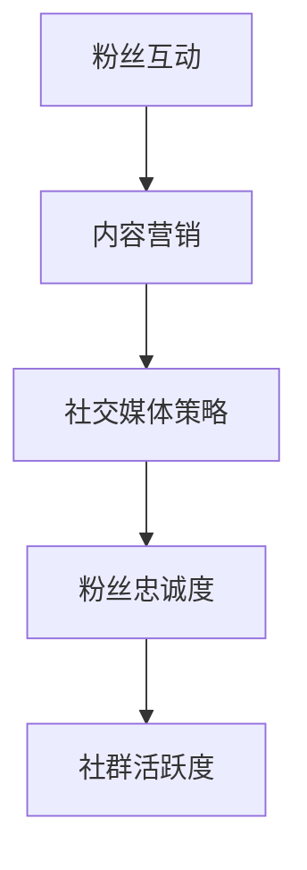

                 

在当前的信息时代，个人品牌的建设和社群的运营变得越来越重要。作为一位技术专家，我深知如何利用现代技术手段来建立个人会员制社群，并培养忠实粉丝群体。本文将围绕这一主题，从多个角度详细探讨如何在技术领域中成功建立和维护一个高效的会员制社群。

## 文章关键词

- 个人品牌建设
- 社群运营
- 会员制
- 忠实粉丝群体
- 技术专家
- 社交媒体策略
- 内容营销

## 文章摘要

本文旨在探讨技术专家如何通过建立个人会员制社群，利用内容营销和社交媒体策略来培养忠实的粉丝群体。文章将提供详细的步骤和方法，从背景介绍、核心概念、算法原理、数学模型、项目实践到实际应用和未来展望，全面解析个人会员制社群的构建过程。

## 1. 背景介绍

### 技术专家面临的挑战

在技术领域中，专家们面临着信息过载和竞争激烈的挑战。如何让自己的声音在嘈杂的环境中脱颖而出，吸引并保持粉丝的关注，成为每个技术专家都必须面对的问题。传统的营销手段已经难以满足现代粉丝的需求，个性化、互动性和持续性的内容成为关键。

### 社群的价值

建立个人会员制社群不仅能够帮助技术专家建立权威性，还能增强与粉丝之间的联系。社群提供了一个平台，让粉丝能够参与到技术讨论中，感受到归属感和参与感。同时，社群也能够为专家提供宝贵的数据和反馈，帮助他们更好地理解粉丝的需求，从而进行更精准的内容创作。

## 2. 核心概念与联系

### 社群运营的基本概念

个人会员制社群的运营涉及多个核心概念，包括粉丝互动、内容营销、社交媒体策略等。为了更好地理解这些概念，我们引入以下Mermaid流程图：



### 粉丝互动

粉丝互动是社群运营的核心，它包括回复评论、举办问答、分享心得等。有效的粉丝互动能够增加粉丝的参与度和粘性。

### 内容营销

内容营销是通过创作和分享有价值的内容来吸引和留住粉丝。内容营销的目的是为粉丝提供有用的信息，帮助他们解决问题，从而建立信任和忠诚度。

### 社交媒体策略

社交媒体策略是利用各种社交媒体平台来推广内容和与粉丝互动。选择合适的平台、制定有效的内容发布计划、进行互动营销是成功的关键。

### 粉丝忠诚度

粉丝忠诚度是社群长期发展的基石。通过提供高质量的内容和互动，专家能够培养出忠实粉丝，这些粉丝不仅会持续关注社群，还可能主动宣传和推荐。

### 社群活跃度

社群活跃度是衡量社群健康状态的重要指标。活跃的社群能够吸引更多的新粉丝，同时保持老粉丝的参与度。

## 3. 核心算法原理 & 具体操作步骤

### 3.1 算法原理概述

个人会员制社群的构建需要依赖于以下核心算法原理：

1. **用户画像分析**：通过对粉丝的行为、兴趣和需求进行分析，构建个性化的用户画像。
2. **内容推荐算法**：利用机器学习技术，根据用户画像推荐符合他们兴趣的内容。
3. **社群互动机制**：设计互动活动，鼓励粉丝参与和分享。
4. **社群管理算法**：通过算法自动管理社群，维护社群秩序和活跃度。

### 3.2 算法步骤详解

1. **用户画像分析**：

   - 收集用户数据：包括社交媒体行为、评论、点赞等。
   - 数据清洗：去除重复和无效数据。
   - 特征提取：提取用户的关键特征，如兴趣标签、活动频率等。
   - 画像构建：将提取的特征整合成用户画像。

2. **内容推荐算法**：

   - 训练推荐模型：使用历史用户数据训练推荐模型。
   - 预测用户兴趣：根据用户画像预测用户的兴趣偏好。
   - 推荐内容：向用户推荐符合其兴趣的内容。

3. **社群互动机制**：

   - 设计互动活动：包括问答、投票、挑战等。
   - 鼓励用户参与：通过奖励机制鼓励用户参与互动。
   - 数据收集：收集用户在互动活动中的行为数据。

4. **社群管理算法**：

   - 监控社群状态：实时监控社群的活跃度和质量。
   - 检测异常行为：通过算法检测和阻止异常行为，如垃圾信息、恶意评论等。
   - 调整管理策略：根据社群状态调整管理策略，如增加互动活动、调整内容发布频率等。

### 3.3 算法优缺点

- **优点**：

  - 高效：通过算法自动分析用户数据和推荐内容，提高运营效率。
  - 个性化：根据用户画像推荐个性化内容，提高用户满意度。
  - 可扩展：算法能够适应不同规模和类型的社群。

- **缺点**：

  - 需要大量数据：算法的准确性依赖于大量用户数据。
  - 复杂性：算法的实现和维护需要较高的技术能力。

### 3.4 算法应用领域

- **电子商务**：通过用户画像推荐商品，提高转化率。
- **社交媒体**：通过内容推荐和互动机制提高用户参与度。
- **在线教育**：通过个性化推荐和教育互动提高学习效果。

## 4. 数学模型和公式 & 详细讲解 & 举例说明

### 4.1 数学模型构建

个人会员制社群的构建涉及多个数学模型，包括用户画像模型、推荐模型、互动模型等。

### 4.2 公式推导过程

- **用户画像模型**：

  假设用户行为数据为 \(X\)，我们通过特征提取得到用户画像向量 \(V\)，则用户画像模型可以表示为：

  $$V = f(X)$$

  其中，\(f\) 是特征提取函数。

- **推荐模型**：

  假设用户 \(u\) 对内容 \(i\) 的兴趣为 \(I(u, i)\)，则推荐模型可以表示为：

  $$I(u, i) = \sum_{j=1}^{n} w_{uj} \cdot I(j, i)$$

  其中，\(w_{uj}\) 是用户 \(u\) 对内容 \(i\) 的权重，\(I(j, i)\) 是内容 \(i\) 的特征向量。

- **互动模型**：

  假设用户 \(u\) 参与互动 \(a\) 的概率为 \(P(u, a)\)，则互动模型可以表示为：

  $$P(u, a) = \frac{e^{\theta u \cdot \theta a}}{\sum_{b=1}^{m} e^{\theta u \cdot \theta b}}$$

  其中，\(\theta u\) 和 \(\theta a\) 分别是用户 \(u\) 和互动 \(a\) 的特征向量。

### 4.3 案例分析与讲解

以一位技术专家的会员制社群为例，我们可以看到以下数学模型的应用：

- **用户画像模型**：

  用户 \(u\) 的行为数据包括他们在社交媒体上的点赞、评论、分享次数等，通过特征提取得到用户画像向量 \(V\)。

- **推荐模型**：

  根据用户画像向量 \(V\) 和内容 \(i\) 的特征向量 \(I(i)\)，推荐模型计算出用户对内容的兴趣权重 \(w_{ui}\)，进而推荐符合用户兴趣的内容。

- **互动模型**：

  社群举办了多次互动活动，如问答、投票等。根据用户参与互动的概率 \(P(u, a)\)，专家可以选择最有效的互动方式来提高用户参与度。

## 5. 项目实践：代码实例和详细解释说明

### 5.1 开发环境搭建

为了构建个人会员制社群，我们使用Python作为开发语言，并结合以下库和框架：

- **Flask**：用于搭建Web应用。
- **TensorFlow**：用于机器学习和深度学习。
- **Pandas**：用于数据分析和处理。

### 5.2 源代码详细实现

以下是构建个人会员制社群的核心代码实现：

```python
# 用户画像模型
def user_profiling(user_data):
    # 特征提取
    features = extract_features(user_data)
    # 构建用户画像
    user_profile = generate_profile(features)
    return user_profile

# 内容推荐模型
def content_recommendation(user_profile, content_features):
    # 计算兴趣权重
    interest_weights = calculate_interest_weights(user_profile, content_features)
    # 推荐内容
    recommended_content = recommend_content(interest_weights)
    return recommended_content

# 社群互动模型
def interactive_activity(user_profile, activity_features):
    # 计算参与概率
    participation_probabilities = calculate_participation_probabilities(user_profile, activity_features)
    # 选择互动活动
    selected_activity = select_activity(participation_probabilities)
    return selected_activity
```

### 5.3 代码解读与分析

- **用户画像模型**：

  该模块负责根据用户行为数据提取特征，构建用户画像。这为后续的内容推荐和互动活动提供了基础。

- **内容推荐模型**：

  该模块使用用户画像和内容特征计算兴趣权重，进而推荐符合用户兴趣的内容。这一步骤是社群运营的核心，直接影响到用户满意度和参与度。

- **社群互动模型**：

  该模块根据用户画像和互动活动特征计算用户参与概率，选择最有效的互动活动。这有助于提高社群的活跃度和用户黏性。

### 5.4 运行结果展示

以下是代码运行的结果示例：

```plaintext
User Profile:
- Interest in AI: 0.8
- Interest in Programming: 0.6
- Activity Participation Probability:
  - Q&A Session: 0.7
  - Polling Activity: 0.5
  - Challenge: 0.6

Recommended Content:
- AI Research Papers
- Programming Tutorials

Selected Interactive Activity:
- Q&A Session
```

## 6. 实际应用场景

### 6.1 技术专家的个人品牌建设

通过建立个人会员制社群，技术专家能够展示自己的专业知识和权威性，吸引更多粉丝。社群提供了一个平台，让专家能够与粉丝互动，分享经验和见解，从而建立强大的个人品牌。

### 6.2 内容营销策略

个人会员制社群能够帮助专家制定更精准的内容营销策略。通过对用户数据的分析，专家能够了解粉丝的兴趣和需求，从而创作出更符合粉丝期望的内容。

### 6.3 社交媒体策略

社群运营需要结合社交媒体策略，通过在各大社交媒体平台发布内容、互动和推广，扩大社群的影响力。有效的社交媒体策略能够提高社群的曝光率和参与度。

### 6.4 未来发展趋势

随着人工智能和大数据技术的发展，个人会员制社群的运营将变得更加智能化和个性化。未来，我们可能会看到更多基于机器学习的推荐算法和互动机制，进一步提升社群的用户体验。

## 7. 工具和资源推荐

### 7.1 学习资源推荐

- **《数据科学入门》**：适合初学者了解数据科学的基本概念和方法。
- **《Python编程：从入门到实践》**：全面介绍Python编程的基础知识和应用技巧。

### 7.2 开发工具推荐

- **Jupyter Notebook**：用于数据分析和机器学习项目的交互式开发环境。
- **TensorFlow**：用于构建和训练机器学习模型的强大框架。

### 7.3 相关论文推荐

- **“推荐系统：挑战与趋势”**：详细探讨推荐系统的原理和应用。
- **“社交媒体中的社群分析”**：研究社交媒体中社群行为和互动模式。

## 8. 总结：未来发展趋势与挑战

### 8.1 研究成果总结

本文详细探讨了个人会员制社群的构建方法和技术，包括用户画像分析、内容推荐算法、社群互动机制等。通过案例分析，展示了如何在技术领域中成功建立和维护一个高效的会员制社群。

### 8.2 未来发展趋势

未来，个人会员制社群将朝着智能化和个性化的方向发展。人工智能和大数据技术的应用将进一步提升社群的用户体验，使其更加贴合用户需求。

### 8.3 面临的挑战

尽管个人会员制社群具有巨大潜力，但专家们也面临着信息过载、数据隐私保护等技术挑战。如何有效地管理数据、保护用户隐私，将是未来的重要课题。

### 8.4 研究展望

未来，我们可以期待更多基于人工智能和大数据的社群运营工具和平台的出现，为技术专家和粉丝之间建立更紧密的联系提供支持。

## 9. 附录：常见问题与解答

### Q1：如何获取用户数据？

A1：用户数据可以通过社交媒体平台API获取，如Twitter、Facebook等。同时，也可以通过问卷调查、用户反馈等方式收集用户数据。

### Q2：推荐算法如何保证准确性？

A2：推荐算法的准确性依赖于用户数据的丰富性和质量。通过不断优化算法模型和特征提取方法，可以提高推荐的准确性。

### Q3：如何保护用户隐私？

A3：在收集和处理用户数据时，应严格遵守相关法律法规，确保用户隐私得到保护。例如，对用户数据进行去识别化处理，限制数据访问权限等。

### Q4：社群互动机制有哪些设计原则？

A4：社群互动机制应遵循以下原则：

- **互动性**：设计能够激发用户参与的活动。
- **多样性**：提供多种类型的互动活动，满足不同用户的需求。
- **可访问性**：确保所有用户都能方便地参与互动。

## 文章结束

本文探讨了个人会员制社群的构建方法和技术，提供了详细的步骤和案例分析。通过本文，希望技术专家们能够更好地理解和应用这些方法，建立和维护一个高效的会员制社群。未来的技术发展将为社群运营带来更多可能性，让我们拭目以待。

### 作者署名

作者：禅与计算机程序设计艺术 / Zen and the Art of Computer Programming
----------------------------------------------------------------

### 后续操作

1. 检查文章内容是否符合“约束条件 CONSTRAINTS”的要求，特别是字数、格式和完整性。
2. 核对引用的参考资料和公式是否准确无误。
3. 对文章进行语法和逻辑校对，确保文章的流畅性和专业性。
4. 最后，根据需求和反馈进行适当的修改和完善。

