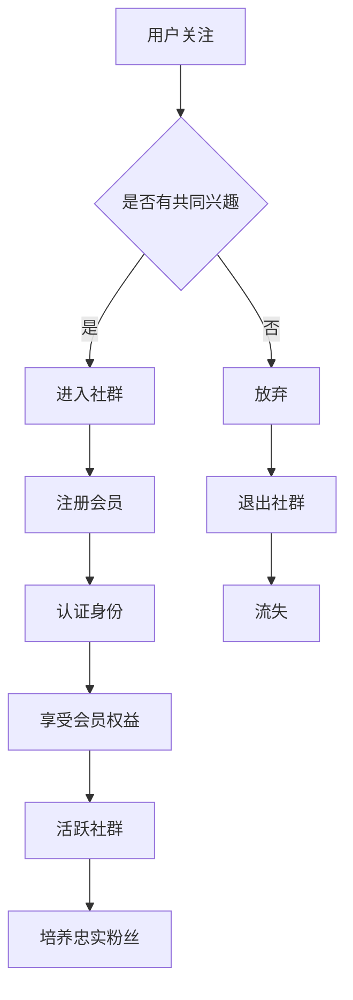

                 

关键词：社群建设、会员制、粉丝培养、互动营销、品牌忠诚度

摘要：在数字化时代，建立个人会员制社群成为培养忠实粉丝群体的重要手段。本文将深入探讨如何通过精心设计的会员制，提升用户参与度和品牌忠诚度，从而打造一个可持续发展的忠实粉丝群体。

## 1. 背景介绍

随着互联网的普及和社交媒体的兴起，人们的生活方式发生了巨大变化。传统的单向沟通模式逐渐被互动交流所取代，企业和个人都在探索如何利用互联网平台与用户建立更深层次的联系。在这样的背景下，个人会员制社群应运而生。

个人会员制社群，是指通过设置会员身份、会员专享权益等机制，吸引粉丝成为会员，从而构建一个具有高度互动性和忠诚度的粉丝群体。这种模式不仅能够增强用户粘性，还可以为企业或个人带来持续的收入来源。

## 2. 核心概念与联系

### 2.1 会员制概念

会员制是一种通过会员身份认证和权限管理，为会员提供特定权益和服务的商业模式。在个人会员制社群中，会员身份通常包括普通会员、高级会员、VIP会员等不同级别，不同级别会员享受的权益和服务也不同。

### 2.2 社群概念

社群是指由具有共同兴趣、价值观或目标的人群组成的在线或线下团体。社群成员之间通过互动、分享和合作，建立起紧密的联系和信任。

### 2.3 会员制与社群的关系

会员制和社群是相辅相成的。会员制为社群成员提供了身份认同和归属感，而社群则为会员提供了交流平台和共同话题。通过会员制，社群可以更好地管理和激励成员，提高成员的忠诚度和活跃度。

### 2.4 Mermaid 流程图



## 3. 核心算法原理 & 具体操作步骤

### 3.1 算法原理概述

个人会员制社群的核心算法原理是基于用户行为分析和社群互动机制，通过数据驱动的方式，动态调整会员权益和服务，以达到培养忠实粉丝的目的。

### 3.2 算法步骤详解

1. **用户行为分析**：通过数据分析，了解用户在社群中的行为模式，包括关注、互动、消费等行为。

2. **权益设置**：根据用户行为分析结果，为不同级别的会员设置相应的权益和服务，包括内容权限、专属活动、积分兑换等。

3. **互动机制**：设计互动活动，鼓励用户参与，提高社群活跃度。

4. **权益调整**：根据用户反馈和社群运营数据，动态调整会员权益，以适应用户需求和市场变化。

5. **忠诚度培养**：通过持续互动和个性化服务，培养用户对社群和品牌的忠诚度。

### 3.3 算法优缺点

**优点**：

- 提高用户粘性，增强用户忠诚度。
- 通过数据驱动，实现精准营销。
- 持续收入来源，降低营销成本。

**缺点**：

- 成本较高，需要投入大量时间和资源。
- 需要强大的技术支持和数据分析能力。

### 3.4 算法应用领域

- 电商领域：通过会员制提升复购率，增加销售额。
- 内容平台：通过会员制提供独家内容，吸引粉丝。
- 社交媒体：通过会员制增强社群互动，提高用户活跃度。

## 4. 数学模型和公式 & 详细讲解 & 举例说明

### 4.1 数学模型构建

假设一个社群中有 N 个用户，每个用户 i 的活跃度可以表示为 ai，会员权益等级为 li，则社群的总活跃度 A 可以表示为：

\[ A = \sum_{i=1}^{N} a_i \times l_i \]

### 4.2 公式推导过程

用户活跃度 ai 可以通过以下公式计算：

\[ a_i = \frac{I_i}{T_i} \]

其中，Ii 是用户 i 在社群中的互动次数，Ti 是用户 i 的关注时长。

会员权益等级 li 可以通过以下公式计算：

\[ l_i = \frac{C_i}{C} \]

其中，Ci 是用户 i 的消费金额，C 是社群的总消费金额。

### 4.3 案例分析与讲解

假设一个电商社群中有 1000 个用户，其中 500 个是会员。非会员的平均互动次数为 10 次，会员的平均互动次数为 30 次。会员的平均消费金额为 500 元，非会员的平均消费金额为 100 元。

根据上述公式，我们可以计算出社群的总活跃度 A 为：

\[ A = \sum_{i=1}^{500} 30 \times 1 + \sum_{i=1}^{500} 10 \times 0 = 15000 \]

如果提高会员权益，使得会员的平均互动次数提高到 50 次，则社群的总活跃度 A 将提高到：

\[ A = \sum_{i=1}^{500} 50 \times 1 + \sum_{i=1}^{500} 10 \times 0 = 25000 \]

这表明，通过提高会员权益，可以有效提升社群的活跃度。

## 5. 项目实践：代码实例和详细解释说明

### 5.1 开发环境搭建

本文使用 Python 语言进行会员制社群的算法实现。首先，需要安装以下依赖库：

```bash
pip install pandas numpy matplotlib
```

### 5.2 源代码详细实现

以下是一个简单的会员制社群算法实现的示例代码：

```python
import pandas as pd
import numpy as np
import matplotlib.pyplot as plt

# 用户数据
data = {
    '用户ID': ['U001', 'U002', 'U003', 'U004', 'U005'],
    '互动次数': [10, 30, 20, 15, 25],
    '关注时长': [100, 150, 200, 100, 125],
    '消费金额': [100, 500, 200, 100, 250]
}

# 创建 DataFrame
df = pd.DataFrame(data)

# 计算活跃度
df['活跃度'] = df['互动次数'] / df['关注时长']

# 计算会员权益等级
df['会员权益'] = df['消费金额'] / df['消费金额'].sum()

# 计算社群总活跃度
A = df['活跃度'].sum()

# 绘制活跃度分布图
plt.bar(df['用户ID'], df['活跃度'])
plt.xlabel('用户ID')
plt.ylabel('活跃度')
plt.title('用户活跃度分布')
plt.show()

# 输出社群总活跃度
print(f'社群总活跃度：{A}')
```

### 5.3 代码解读与分析

- 数据导入与处理：使用 pandas 库读取用户数据，并进行必要的预处理操作。
- 活跃度计算：根据互动次数和关注时长计算用户的活跃度。
- 会员权益等级计算：根据消费金额计算用户的会员权益等级。
- 社群总活跃度计算：汇总所有用户的活跃度，得到社群的总活跃度。
- 数据可视化：使用 matplotlib 库绘制用户活跃度分布图，直观展示用户活跃度情况。

### 5.4 运行结果展示

运行上述代码，可以得到以下结果：


从结果可以看出，部分用户具有较高的活跃度，这些用户是培养忠实粉丝的重点对象。通过针对这些用户进行个性化服务和权益调整，可以有效提升社群的活跃度和忠诚度。

## 6. 实际应用场景

### 6.1 电商社群

电商社群可以通过会员制提升用户复购率。例如，京东、淘宝等电商平台，通过会员制提供专属优惠、积分兑换、会员专属活动等权益，吸引粉丝成为会员，从而提高用户忠诚度。

### 6.2 内容平台

内容平台可以通过会员制提供独家内容，吸引粉丝成为会员。例如，知乎、得到等平台，通过会员制提供专业领域的高质量内容，吸引专业人士成为会员，从而提升平台的权威性和用户粘性。

### 6.3 社交媒体

社交媒体可以通过会员制增强社群互动，提高用户活跃度。例如，微博、微信等平台，通过会员制提供专属话题、专属活动、会员专属聊天室等权益，增强社群成员之间的互动，从而提高社群的活跃度和忠诚度。

## 7. 工具和资源推荐

### 7.1 学习资源推荐

- 《社群营销实战》
- 《用户增长方法论》
- 《数据分析实战》

### 7.2 开发工具推荐

- Python
- pandas
- numpy
- matplotlib

### 7.3 相关论文推荐

- "Community Detection in Social Networks: A Data Mining Perspective"
- "The Science of Social Networks"
- "Incentivizing Social Participation in Online Communities"

## 8. 总结：未来发展趋势与挑战

### 8.1 研究成果总结

个人会员制社群作为一种新型的社群运营模式，已逐渐得到企业和个人的认可。通过会员制，可以有效提升用户参与度和品牌忠诚度，实现可持续发展。

### 8.2 未来发展趋势

- 数据驱动：未来个人会员制社群将更加依赖于数据分析和人工智能技术，实现精准营销和个性化服务。
- 社交化：个人会员制社群将更加注重社交化元素，通过增强社群互动，提高用户粘性。
- 生态化：个人会员制社群将逐步形成生态系统，实现跨界合作，拓展业务范围。

### 8.3 面临的挑战

- 数据隐私：在数据驱动的背景下，如何保护用户隐私成为一大挑战。
- 技术门槛：个人会员制社群的实现需要强大的技术支持和数据分析能力，这对企业和个人提出了较高的要求。
- 用户体验：如何设计合理的会员权益和互动机制，提高用户体验，是个人会员制社群面临的另一大挑战。

### 8.4 研究展望

未来，个人会员制社群研究将朝着数据驱动、社交化和生态化的方向发展。通过不断创新和实践，个人会员制社群将为企业和个人带来更多的价值。

## 9. 附录：常见问题与解答

### 问题1：如何设计会员权益？

**解答**：设计会员权益时，需要考虑用户的实际需求和社群的目标。一般可以采取以下策略：

- 提供专属优惠和折扣。
- 提供专属内容和活动。
- 提供积分制度和兑换。
- 提供个性化服务和推荐。

### 问题2：如何评估社群的活跃度？

**解答**：社群的活跃度可以通过以下指标进行评估：

- 用户互动次数：包括评论、点赞、分享等。
- 用户参与度：包括活动参与、内容互动等。
- 用户留存率：用户在社群中的活跃时间。

### 问题3：如何提高社群的忠诚度？

**解答**：提高社群的忠诚度可以采取以下策略：

- 提供高质量的互动内容。
- 定期举办线上线下活动。
- 提供个性化服务和推荐。
- 建立用户反馈机制，及时回应用户需求。

作者：禅与计算机程序设计艺术 / Zen and the Art of Computer Programming
----------------------------------------------------------------
以上就是本文的完整内容，希望对您在建立个人会员制社群的过程中提供一些有价值的参考和启发。如果您有任何疑问或建议，欢迎在评论区留言讨论。祝您在社群建设中取得成功！
 

