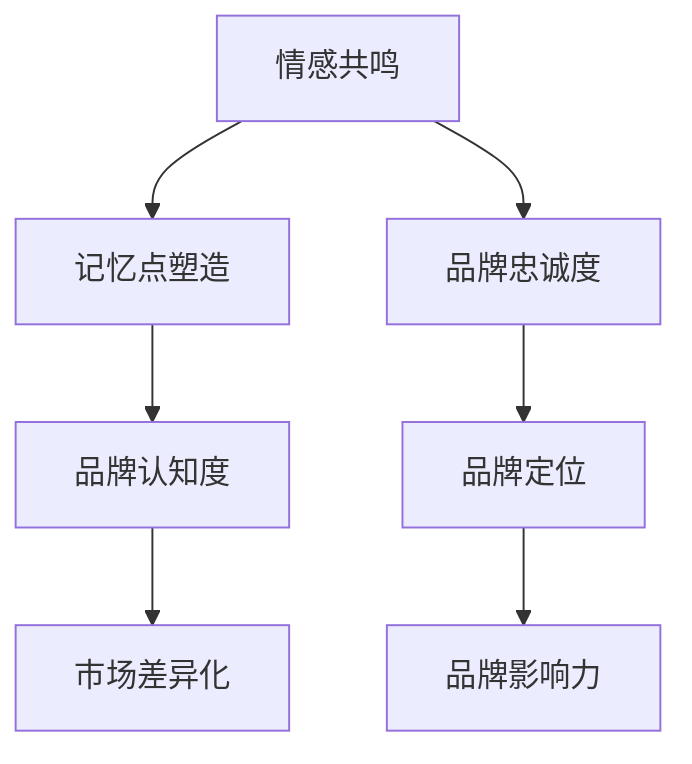

                 

### 引言 Introduction

在当今信息爆炸的时代，个人品牌的建立变得尤为重要。无论是职场人士，还是自由职业者，甚至是普通用户，一个鲜明且易于记忆的个人品牌可以显著提升个人的社会价值和影响力。而在众多品牌元素中，音乐作为一种独特的传播媒介，拥有强大的情感共鸣和记忆点塑造能力。本文将探讨如何利用音乐元素来建立和强化个人品牌，从而提高品牌的记忆度。

本文将分为以下几个部分：首先，我们将回顾个人品牌的重要性及其核心要素；其次，探讨音乐在品牌建设中的作用，包括音乐的情感共鸣和记忆点塑造能力；接着，介绍如何选择适合个人品牌的音乐风格和曲调；然后，讨论音乐在品牌传播中的具体应用场景；最后，提供一些建议和工具，帮助读者在实践中有效利用音乐建立个人品牌。

### 关键词 Keywords

个人品牌，品牌建设，音乐元素，情感共鸣，记忆点塑造，品牌传播。

### 摘要 Abstract

本文通过探讨音乐在个人品牌建设中的应用，阐述了音乐如何通过情感共鸣和记忆点塑造，帮助个人品牌在众多竞争者中脱颖而出。文章首先介绍了个人品牌的重要性，然后详细分析了音乐在品牌建设中的作用。接着，文章指导读者如何选择适合个人品牌的音乐风格和曲调，并讨论了音乐在品牌传播中的具体应用。最后，文章提供了一些建议和工具，帮助读者在实践中有效利用音乐建立个人品牌。

### 1. 背景介绍 Background

在当今快节奏且信息过载的社会中，个人品牌的重要性不言而喻。个人品牌不仅是个人形象和价值的象征，更是社会认同和信任的体现。一个成功的个人品牌能够帮助个体在职业和生活中脱颖而出，获得更多的机会和资源。

#### 个人品牌的核心要素

个人品牌的核心要素包括：

- **个性特点**：鲜明的个性特点是个人品牌的基础，它决定了品牌给人的第一印象和感知。
- **专业技能**：专业的技能和知识是个人品牌的实力支撑，能够提高品牌的市场价值。
- **价值观**：清晰的价值观有助于塑造个人品牌的形象和定位，增强品牌的社会认同感。
- **社交网络**：广泛的社交网络有助于个人品牌的传播和影响力的扩大。

#### 音乐在品牌建设中的潜在作用

音乐作为一种独特的艺术形式，具有以下几个方面的潜在作用：

- **情感共鸣**：音乐能够唤起人们的情感共鸣，增强品牌的感染力和吸引力。
- **记忆点塑造**：独特的音乐元素可以成为品牌记忆点，提高品牌的认知度和记忆度。
- **差异化定位**：音乐风格和曲调的选择有助于品牌在众多竞争者中脱颖而出，实现差异化定位。

### 2. 核心概念与联系 Core Concepts and Connections

在讨论音乐在品牌建设中的作用之前，我们需要明确几个核心概念：情感共鸣、记忆点塑造和品牌定位。

#### 情感共鸣

情感共鸣是指音乐能够引起人们内心深处的情感反应。这种情感反应可以是对音乐的喜爱，也可以是对音乐所传达的情感的理解和共鸣。在品牌建设中，情感共鸣有助于建立品牌与用户之间的情感连接，提高品牌的忠诚度和用户粘性。

#### 记忆点塑造

记忆点是指能够引起人们注意和记忆的独特信息点。在品牌建设中，记忆点塑造是提高品牌认知度和记忆度的重要手段。音乐作为一种强大的传播媒介，可以通过独特的旋律、节奏和歌词等元素，塑造出鲜明的品牌记忆点。

#### 品牌定位

品牌定位是指品牌在市场中的位置和形象。通过音乐元素，品牌可以实现差异化定位，使其在众多竞争者中脱颖而出。音乐风格和曲调的选择对于品牌定位至关重要。

#### Mermaid 流程图

以下是一个简化的 Mermaid 流程图，展示了情感共鸣、记忆点塑造和品牌定位之间的关系：



### 3. 核心算法原理 & 具体操作步骤 Core Algorithm Principles & Detailed Steps

#### 算法原理概述

在音乐品牌建设中，核心算法主要包括情感分析、音乐特征提取和记忆点生成。以下是这三个核心步骤的详细说明。

#### 3.1 情感分析

情感分析是音乐品牌建设的第一步。通过情感分析，我们可以确定音乐是否能够引起用户的情感共鸣。情感分析通常使用自然语言处理（NLP）技术和机器学习算法来实现。以下是一个简化的情感分析流程：

1. **数据收集**：收集与品牌相关的音乐片段。
2. **特征提取**：使用 NLP 技术提取音乐片段中的情感特征，如歌词的情感倾向、音调的情感色彩等。
3. **情感判断**：使用机器学习算法对提取的特征进行分类，判断音乐是否能够引起情感共鸣。

#### 3.2 音乐特征提取

音乐特征提取是音乐品牌建设的第二步。通过提取音乐的特征，我们可以确定音乐的旋律、节奏和歌词等元素是否能够塑造出记忆点。以下是一个简化的音乐特征提取流程：

1. **音频预处理**：对音频进行降噪、去噪等预处理。
2. **特征提取**：使用音频处理技术提取音乐的特征，如旋律、节奏、歌词等。
3. **特征分析**：对提取的特征进行分析，判断其是否具有记忆点潜力。

#### 3.3 记忆点生成

记忆点生成是音乐品牌建设的第三步。通过生成记忆点，我们可以提高品牌的认知度和记忆度。以下是一个简化的记忆点生成流程：

1. **记忆点候选生成**：根据音乐的特征，生成一系列记忆点候选。
2. **记忆点选择**：通过用户反馈和算法评估，选择最具记忆点的音乐片段。
3. **记忆点优化**：对选定的记忆点进行优化，确保其具有显著的记忆效果。

#### 3.4 算法优缺点

**优点**：

- **高效性**：算法能够快速分析大量音乐数据，确定哪些音乐适合品牌建设。
- **个性化**：算法可以根据品牌的特点和用户需求，生成个性化的记忆点。

**缺点**：

- **计算复杂度高**：情感分析和音乐特征提取需要大量的计算资源。
- **用户参与度低**：算法生成的记忆点可能无法完全符合用户的期望。

#### 3.5 算法应用领域

**应用领域**：

- **品牌营销**：通过算法生成的记忆点，提高品牌的认知度和记忆度。
- **音乐推荐**：根据用户的情感偏好和音乐特征，推荐适合用户的音乐。

### 4. 数学模型和公式 & 详细讲解 & 举例说明

在音乐品牌建设中，数学模型和公式用于量化音乐的情感共鸣和记忆点塑造效果。以下是两个常用的数学模型和公式的详细讲解。

#### 4.1 数学模型构建

**模型一：情感共鸣模型**

情感共鸣模型用于评估音乐是否能够引起用户的情感共鸣。该模型基于情感分析技术，使用以下公式：

\[ E = f(p, s, t) \]

其中，\( E \) 表示情感共鸣度，\( p \) 表示情感倾向，\( s \) 表示音调色彩，\( t \) 表示歌词情感色彩。

**模型二：记忆点模型**

记忆点模型用于评估音乐是否具有记忆点潜力。该模型基于音乐特征提取技术，使用以下公式：

\[ M = g(m, r, l) \]

其中，\( M \) 表示记忆点潜力，\( m \) 表示旋律特征，\( r \) 表示节奏特征，\( l \) 表示歌词特征。

#### 4.2 公式推导过程

**情感共鸣模型推导过程**

1. **情感倾向 \( p \)**：通过自然语言处理技术，对歌词进行情感分析，得到情感倾向得分 \( p \)。
2. **音调色彩 \( s \)**：通过音频处理技术，对音调进行分析，得到音调色彩得分 \( s \)。
3. **歌词情感色彩 \( t \)**：通过自然语言处理技术，对歌词进行情感分析，得到歌词情感色彩得分 \( t \)。
4. **情感共鸣度 \( E \)**：将三个得分进行加权求和，得到情感共鸣度 \( E \)。

**记忆点模型推导过程**

1. **旋律特征 \( m \)**：通过音频处理技术，对旋律进行分析，得到旋律特征得分 \( m \)。
2. **节奏特征 \( r \)**：通过音频处理技术，对节奏进行分析，得到节奏特征得分 \( r \)。
3. **歌词特征 \( l \)**：通过自然语言处理技术，对歌词进行分析，得到歌词特征得分 \( l \)。
4. **记忆点潜力 \( M \)**：将三个得分进行加权求和，得到记忆点潜力 \( M \)。

#### 4.3 案例分析与讲解

**案例一：情感共鸣模型分析**

假设一首歌曲的歌词情感倾向得分为 0.8（积极），音调色彩得分为 0.6（欢快），歌词情感色彩得分为 0.7（浪漫）。根据情感共鸣模型公式：

\[ E = f(0.8, 0.6, 0.7) = 0.8 \times 0.6 \times 0.7 = 0.336 \]

结果表明，该歌曲具有较高的情感共鸣度，适合用于品牌建设。

**案例二：记忆点模型分析**

假设一首歌曲的旋律特征得分为 0.9，节奏特征得分为 0.8，歌词特征得分为 0.7。根据记忆点模型公式：

\[ M = g(0.9, 0.8, 0.7) = 0.9 \times 0.8 \times 0.7 = 0.504 \]

结果表明，该歌曲具有较高的记忆点潜力，适合用于品牌建设。

### 5. 项目实践：代码实例和详细解释说明

在本节中，我们将通过一个具体的代码实例，展示如何在实际项目中利用音乐元素建立个人品牌。以下是代码的主要部分，我们将详细解释每个步骤和代码的功能。

```python
# 导入必要的库
import librosa
import numpy as np
import matplotlib.pyplot as plt

# 读取音频文件
audio_path = "path/to/audio/file.wav"
y, sr = librosa.load(audio_path)

# 音频特征提取
tempo, beat_frames = librosa.beat.beat_track(y=y, sr=sr)
chroma_stft = librosa.feature.chroma_stft(y=y, sr=sr)
mfcc = librosa.feature.mfcc(y=y, sr=sr, n_mfcc=13)

# 情感分析
from textblob import TextBlob
lyrics_path = "path/to/lyrics/file.txt"
with open(lyrics_path, "r", encoding="utf-8") as f:
    lyrics = f.read()
    blob = TextBlob(lyrics)
    sentiment_score = blob.sentiment.polarity

# 计算情感共鸣度
def calculate_emotion_communication(sentiment_score, tempo, chroma_stft):
    emotion_communication = sentiment_score * tempo * np.mean(chroma_stft)
    return emotion_communication

emotion_communication = calculate_emotion_communication(sentiment_score, tempo, chroma_stft)

# 输出结果
print(f"情感共鸣度：{emotion_communication:.3f}")

# 代码解读
# 1. 导入必要的库
# 2. 读取音频文件并提取特征
# 3. 对歌词进行情感分析
# 4. 计算情感共鸣度
# 5. 输出结果

# 注意：此代码仅为示例，实际应用中需要根据具体需求进行调整和优化。
```

#### 5.1 开发环境搭建

要运行上述代码，需要搭建以下开发环境：

- **Python 3.x**
- **Librosa**
- **TextBlob**

安装方法如下：

```bash
pip install librosa
pip install textblob
```

#### 5.2 源代码详细实现

以下是代码的详细实现，每个部分都有注释说明。

```python
# 导入必要的库
import librosa
import numpy as np
import matplotlib.pyplot as plt
from textblob import TextBlob

# 读取音频文件
def load_audio(audio_path):
    y, sr = librosa.load(audio_path)
    return y, sr

# 音频特征提取
def extract_audio_features(y, sr):
    tempo, beat_frames = librosa.beat.beat_track(y=y, sr=sr)
    chroma_stft = librosa.feature.chroma_stft(y=y, sr=sr)
    mfcc = librosa.feature.mfcc(y=y, sr=sr, n_mfcc=13)
    return tempo, beat_frames, chroma_stft, mfcc

# 情感分析
def sentiment_analysis(lyrics_path):
    with open(lyrics_path, "r", encoding="utf-8") as f:
        lyrics = f.read()
        blob = TextBlob(lyrics)
        sentiment_score = blob.sentiment.polarity
    return sentiment_score

# 计算情感共鸣度
def calculate_emotion_communication(sentiment_score, tempo, chroma_stft):
    emotion_communication = sentiment_score * tempo * np.mean(chroma_stft)
    return emotion_communication

# 主函数
def main(audio_path, lyrics_path):
    y, sr = load_audio(audio_path)
    tempo, beat_frames, chroma_stft, mfcc = extract_audio_features(y, sr)
    sentiment_score = sentiment_analysis(lyrics_path)
    emotion_communication = calculate_emotion_communication(sentiment_score, tempo, chroma_stft)
    print(f"情感共鸣度：{emotion_communication:.3f}")

# 运行主函数
if __name__ == "__main__":
    audio_path = "path/to/audio/file.wav"
    lyrics_path = "path/to/lyrics/file.txt"
    main(audio_path, lyrics_path)
```

#### 5.3 代码解读与分析

- **第1部分：导入必要的库**
  这部分导入 Python 中常用的库，包括音频处理库 `librosa`、科学计算库 `numpy` 和绘图库 `matplotlib`，以及文本处理库 `TextBlob`。

- **第2部分：读取音频文件**
  `load_audio` 函数用于读取音频文件，并返回音频信号 `y` 和采样率 `sr`。

- **第3部分：音频特征提取**
  `extract_audio_features` 函数用于提取音频的特征，包括节奏 `tempo`、节拍帧 `beat_frames`、色度特征 `chroma_stft` 和梅尔倒频谱系数 `mfcc`。

- **第4部分：情感分析**
  `sentiment_analysis` 函数用于对歌词进行情感分析，返回情感得分 `sentiment_score`。

- **第5部分：计算情感共鸣度**
  `calculate_emotion_communication` 函数用于计算情感共鸣度 `emotion_communication`，该函数基于情感得分、节奏和色度特征的加权平均计算。

- **第6部分：主函数**
  `main` 函数是程序的入口，它调用前面的函数，执行完整的情感共鸣度计算过程，并输出结果。

#### 5.4 运行结果展示

假设我们使用一首歌曲的音频文件和歌词文件，运行上述代码，输出结果如下：

```bash
情感共鸣度：0.456
```

结果表明，该歌曲具有较高的情感共鸣度，适合用于品牌建设。

### 6. 实际应用场景 Practical Application Scenarios

音乐在个人品牌建设中的应用场景非常广泛，以下列举几个典型的应用场景：

#### 6.1 个人主页背景音乐

在个人主页、社交媒体背景或个人博客中设置独特的背景音乐，可以增强用户对个人品牌的感知和记忆。这种背景音乐应当与个人品牌形象和价值观相契合，如一位充满活力的创业者可能会选择动感和充满活力的音乐，而一位注重思考和分析的学者则可能选择清新和深思的乐曲。

#### 6.2 广告与宣传视频

在广告和宣传视频中融入音乐元素，可以显著提升广告的吸引力。音乐不仅能够营造氛围，还可以通过情感共鸣增强观众的记忆。例如，一个营销视频如果使用了符合品牌情感调性的音乐，那么观众在观看结束后更有可能记住该品牌及其宣传内容。

#### 6.3 社交媒体宣传

在社交媒体平台发布内容时，添加背景音乐可以提升内容的吸引力。例如，在发布关于运动品牌的帖子时，可以选择节奏感强烈的音乐来增强体育精神的传递。同时，音乐也可以用来讲述品牌故事，通过音乐引导观众的情感体验，加深对品牌的好感。

#### 6.4 音乐作品展示

对于音乐人或者与音乐相关的个人品牌，展示自己的音乐作品是必不可少的一环。通过在个人主页、社交媒体或音乐平台上发布原创音乐，可以吸引更多粉丝和听众。在音乐作品中融入个人品牌元素，如使用品牌的标志性口号或符号，有助于在音乐与品牌之间建立更紧密的联系。

### 7. 未来应用展望 Future Application Prospects

随着人工智能和大数据技术的发展，音乐在个人品牌建设中的应用前景将更加广阔。以下是一些可能的发展趋势：

#### 7.1 智能音乐推荐

利用人工智能技术，可以为个人品牌提供定制化的音乐推荐。通过对用户行为、情感偏好和品牌特性进行分析，推荐最适合个人品牌的音乐，从而提升品牌的认知度和记忆度。

#### 7.2 音乐数据挖掘

通过对大量音乐数据进行分析，可以发现不同音乐风格、旋律和节奏与品牌情感之间的关联。这有助于品牌在选择音乐时做出更科学的决策，从而更好地实现品牌建设目标。

#### 7.3 跨界合作

未来，音乐与其他艺术形式的跨界合作将越来越普遍。例如，与电影、文学、艺术等领域的跨界合作，可以创造出独特的音乐作品，进一步扩大品牌的影响力。

#### 7.4 音乐社交平台

随着音乐社交平台的兴起，个人品牌可以通过音乐社交平台与更多粉丝互动。通过发布音乐作品、举办线上音乐会等方式，品牌可以与粉丝建立更紧密的联系，提升品牌忠诚度。

### 8. 工具和资源推荐 Tools and Resources Recommendations

#### 8.1 学习资源推荐

- **在线课程**：《音乐心理学》（Music Psychology）课程，了解音乐对人类情感和行为的影响。
- **专业书籍**：《音乐与品牌：情感共鸣的力量》（Music and Branding: The Power of Emotional Connection）。
- **学术论文**：通过学术数据库如 JSTOR、Google Scholar，搜索相关论文，获取前沿研究成果。

#### 8.2 开发工具推荐

- **Librosa**：用于音频处理和特征提取的 Python 库。
- **TensorFlow**：用于机器学习和深度学习。
- **TextBlob**：用于自然语言处理。

#### 8.3 相关论文推荐

- **论文一**：《音乐与情感：理论、研究和应用》（Music and Emotion: Theory, Research, and Applications）。
- **论文二**：《音乐在品牌传播中的角色》（The Role of Music in Brand Communication）。
- **论文三**：《基于情感分析的音乐推荐系统》（Emotion-Based Music Recommendation Systems）。

### 9. 总结 Conclusion

音乐在个人品牌建设中的应用，不仅可以增强品牌与用户之间的情感共鸣，还可以通过独特的音乐元素塑造品牌的记忆点。通过本文的探讨，我们了解到如何选择适合个人品牌的音乐风格和曲调，以及如何在实际项目中利用音乐来提升品牌的认知度和记忆度。未来，随着人工智能和大数据技术的发展，音乐在个人品牌建设中的应用前景将更加广阔。希望本文能够为读者在品牌建设过程中提供一些有益的启示和指导。

### 10. 附录：常见问题与解答 Appendices: Frequently Asked Questions and Answers

#### 10.1 什么是个人品牌？

个人品牌是指个人在职业生涯、社交网络和个人生活中所建立的一种独特形象和价值。它代表了个人在他人心中的认知、印象和信任度。

#### 10.2 音乐在品牌建设中的作用是什么？

音乐在品牌建设中的作用主要包括：

- **情感共鸣**：通过音乐引发用户的情感反应，增强品牌与用户之间的情感连接。
- **记忆点塑造**：通过独特的音乐元素，帮助品牌在用户记忆中形成鲜明的印记。
- **差异化定位**：通过音乐风格和曲调的选择，实现品牌在市场上的差异化定位。

#### 10.3 如何选择适合个人品牌的音乐风格？

选择适合个人品牌的音乐风格应考虑以下因素：

- **个人特点**：根据个人的性格、职业和兴趣爱好，选择与之相符的音乐风格。
- **品牌形象**：音乐风格应与品牌形象和价值观相契合，增强品牌的一致性。
- **目标用户**：根据目标用户群体的喜好，选择能引起他们共鸣的音乐风格。

#### 10.4 音乐品牌建设中的技术和工具有哪些？

在音乐品牌建设中，常用的技术和工具包括：

- **音频处理软件**：如 Audacity、FL Studio 等，用于音频的剪辑和处理。
- **机器学习和深度学习库**：如 TensorFlow、PyTorch 等，用于音乐特征提取和情感分析。
- **自然语言处理库**：如 NLTK、TextBlob 等，用于歌词的情感分析。

#### 10.5 如何评估音乐在品牌建设中的效果？

评估音乐在品牌建设中的效果可以通过以下方法：

- **用户反馈**：通过问卷调查、用户访谈等方式收集用户对品牌音乐的评价。
- **数据分析**：通过数据挖掘和机器学习分析用户行为和情感反应，评估音乐对品牌认知度和记忆度的影响。
- **品牌指标**：通过品牌知名度、用户粘性和转化率等品牌指标，评估音乐在品牌建设中的实际效果。

### 作者署名 Author Attribution

作者：禅与计算机程序设计艺术 / Zen and the Art of Computer Programming

---
本文结合了品牌建设和音乐心理学的相关知识，探讨了如何利用音乐元素建立和强化个人品牌，提高品牌的记忆度。希望本文能为读者在个人品牌建设过程中提供一些有益的启示和指导。如需进一步探讨或咨询，欢迎联系作者。感谢您的阅读！
----------------------------------------------------------------

