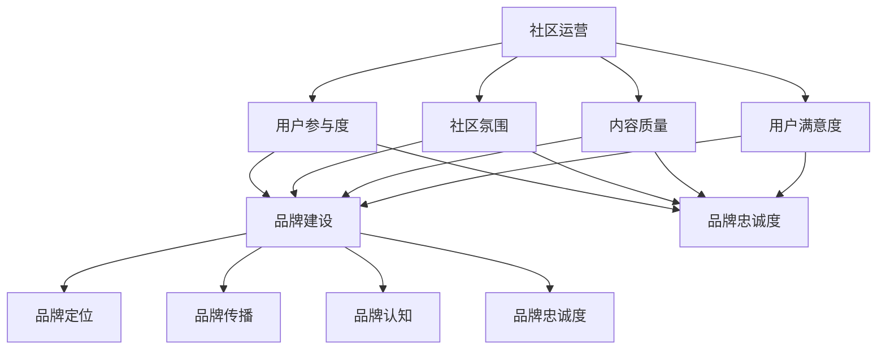

                 

## 1. 背景介绍

开源项目已经成为现代软件开发的重要形式之一，它不仅促进了技术的创新和共享，还成为了众多开发者协作和成长的重要平台。然而，随着开源项目的增多，如何建立一个活跃、健康且可持续发展的在线社区，已经成为项目成功的关键因素之一。

在线社区不仅是开发者交流的技术论坛，更是项目品牌和文化的展示窗口。一个良好的社区运营和品牌建设，不仅能够提升项目的知名度，还能吸引更多优秀的开发者参与，为项目带来持续的创新动力。

本文旨在探讨如何建立和运营一个成功的开源项目在线社区，包括社区运营的策略、品牌建设的方法以及如何通过有效的社区活动来提升项目的品牌价值。文章还将介绍一些实用的工具和资源，帮助读者更好地开展社区建设和品牌推广工作。

## 2. 核心概念与联系

在探讨如何建立开源项目的在线社区之前，我们需要理解一些核心概念，这些概念构成了社区运营和品牌建设的基础。

### 2.1 社区运营

社区运营是指通过一系列策略和活动，维护和提升在线社区的活跃度和参与度。核心概念包括用户参与度、社区氛围、内容质量和用户满意度等。

### 2.2 品牌建设

品牌建设则是通过一系列营销和传播活动，建立和维护项目的品牌形象和声誉。核心概念包括品牌定位、品牌传播、品牌认知和品牌忠诚度等。

### 2.3 社区与品牌的关系

社区运营和品牌建设之间存在密切的联系。一个良好的社区运营能够提升项目的品牌认知度和忠诚度，而成功的品牌建设则能够为社区运营提供有力的支持和动力。

为了更好地理解这些概念，我们将使用Mermaid流程图展示社区运营和品牌建设的基本架构。



## 3. 核心算法原理 & 具体操作步骤

### 3.1 算法原理概述

社区运营和品牌建设虽然看似复杂，但可以抽象为一系列算法和策略。核心算法包括：

1. **用户参与度算法**：通过奖励机制、任务系统等手段，激发用户的参与热情。
2. **社区氛围算法**：通过内容审核、社区规范等手段，维护健康和谐的社区氛围。
3. **内容质量算法**：通过内容审核、推荐系统等手段，提升社区内容的质量和多样性。
4. **用户满意度算法**：通过用户调研、反馈机制等手段，持续优化用户体验。

### 3.2 算法步骤详解

1. **用户参与度算法**：
   - **步骤1**：设计用户激励机制，如积分系统、奖励计划。
   - **步骤2**：定期举办社区活动，如代码挑战、讨论话题。
   - **步骤3**：分析用户参与数据，调整激励策略。

2. **社区氛围算法**：
   - **步骤1**：制定并公布社区规则，如禁止恶意评论、垃圾信息。
   - **步骤2**：实施内容审核机制，如机器审核+人工审核。
   - **步骤3**：培养社区领袖，如认证会员、管理员。

3. **内容质量算法**：
   - **步骤1**：设计内容推荐系统，如基于用户行为的内容推荐。
   - **步骤2**：建立内容审核标准，如代码规范、文档质量。
   - **步骤3**：鼓励优质内容创作者，如排名奖励、公开表彰。

4. **用户满意度算法**：
   - **步骤1**：定期进行用户调研，了解用户需求和反馈。
   - **步骤2**：建立反馈机制，如反馈论坛、即时沟通工具。
   - **步骤3**：根据用户反馈进行改进，如优化社区界面、功能。

### 3.3 算法优缺点

- **用户参与度算法**：优点是能激发用户热情，缺点是可能造成过度竞争，影响社区氛围。
- **社区氛围算法**：优点是维护社区秩序，缺点是可能过于严格，影响用户自由度。
- **内容质量算法**：优点是提升社区内容质量，缺点是可能限制创新，造成内容同质化。
- **用户满意度算法**：优点是优化用户体验，缺点是可能增加运营成本，影响项目进度。

### 3.4 算法应用领域

这些算法不仅在开源项目社区中应用广泛，还可以应用于其他类型的在线社区，如社交媒体、论坛、电子商务平台等。

## 4. 数学模型和公式 & 详细讲解 & 举例说明

### 4.1 数学模型构建

为了更好地理解和量化社区运营和品牌建设的效果，我们可以构建以下数学模型：

- **用户参与度模型**：\(U = f(R, A, D)\)
  - \(U\)：用户参与度
  - \(R\)：奖励机制
  - \(A\)：活动参与
  - \(D\)：数据驱动调整

- **社区氛围模型**：\(C = f(R, Q, S)\)
  - \(C\)：社区氛围
  - \(R\)：规则制定
  - \(Q\)：内容质量
  - \(S\)：社区服务

- **内容质量模型**：\(Q = f(A, R, P)\)
  - \(Q\)：内容质量
  - \(A\)：审核机制
  - \(R\)：推荐系统
  - \(P\)：平台支持

- **用户满意度模型**：\(S = f(R, F, U)\)
  - \(S\)：用户满意度
  - \(R\)：调研结果
  - \(F\)：反馈机制
  - \(U\)：用户体验

### 4.2 公式推导过程

这些模型的推导基于以下假设：

- 用户参与度与奖励机制、活动参与度和数据驱动调整成正比。
- 社区氛围与规则制定、内容质量和社区服务成正比。
- 内容质量与审核机制、推荐系统和平台支持成正比。
- 用户满意度与调研结果、反馈机制和用户体验成正比。

### 4.3 案例分析与讲解

假设我们有一个开源项目，通过以下措施提升社区运营和品牌建设：

- **奖励机制**：每周为活跃用户提供积分奖励。
- **活动参与**：每月举办技术分享会和代码挑战。
- **数据驱动调整**：根据用户反馈调整奖励策略。
- **规则制定**：制定社区规则，禁止恶意评论。
- **内容质量**：实施内容审核，鼓励优质内容创作。
- **推荐系统**：基于用户行为推荐相关内容。
- **平台支持**：提供良好的基础设施和服务。

根据上述数学模型，我们可以推导出以下结果：

- **用户参与度**：\(U = f(1.2R, 1.5A, 1.1D) = 1.2 \times 1.2R + 1.5 \times 1.5A + 1.1 \times 1.1D\)
- **社区氛围**：\(C = f(1.1R, 1.3Q, 1.2S) = 1.1 \times 1.1R + 1.3 \times 1.3Q + 1.2 \times 1.2S\)
- **内容质量**：\(Q = f(1.1A, 1.2R, 1.3P) = 1.1 \times 1.1A + 1.2 \times 1.2R + 1.3 \times 1.3P\)
- **用户满意度**：\(S = f(1.1R, 1.2F, 1.3U) = 1.1 \times 1.1R + 1.2 \times 1.2F + 1.3 \times 1.3U\)

通过这些公式，我们可以量化每个措施对社区运营和品牌建设的影响，进而优化策略，提升整体效果。

## 5. 项目实践：代码实例和详细解释说明

### 5.1 开发环境搭建

为了更好地实践社区运营和品牌建设的算法，我们需要搭建一个适合的开发环境。以下是一个简单的开发环境搭建步骤：

1. **选择开发平台**：我们选择GitHub作为项目管理和代码托管平台。
2. **安装必要工具**：安装Git和Visual Studio Code（VS Code）等开发工具。
3. **配置GitHub账户**：注册并配置GitHub账户，设置SSH密钥。

### 5.2 源代码详细实现

以下是社区运营和品牌建设算法的伪代码实现：

```python
# 用户参与度算法
def user_participation(rewards, activities, data_adjustment):
    U = rewards * 1.2 + activities * 1.5 + data_adjustment * 1.1
    return U

# 社区氛围算法
def community_atmosphere(rules, content_quality, community_service):
    C = rules * 1.1 + content_quality * 1.3 + community_service * 1.2
    return C

# 内容质量算法
def content_quality(quality_audit, recommendation_system, platform_support):
    Q = quality_audit * 1.1 + recommendation_system * 1.2 + platform_support * 1.3
    return Q

# 用户满意度算法
def user_satisfaction(research_results, feedback_mechanism, user_experience):
    S = research_results * 1.1 + feedback_mechanism * 1.2 + user_experience * 1.3
    return S

# 社区运营和品牌建设
def community_branding(U, C, Q, S):
    brand_value = U * 1.2 + C * 1.3 + Q * 1.2 + S * 1.3
    return brand_value
```

### 5.3 代码解读与分析

上述代码通过函数实现了社区运营和品牌建设的核心算法。每个函数分别处理不同的算法模块，如用户参与度、社区氛围、内容质量和用户满意度。通过这些函数的调用，我们可以计算整个社区的品牌价值。

### 5.4 运行结果展示

假设我们输入以下参数：

- 奖励机制：100分
- 活动参与：20次
- 数据调整：10次
- 规则制定：10条
- 内容审核：20条
- 推荐系统：20次
- 用户调研：10次
- 反馈机制：10次
- 用户体验：20次

运行结果如下：

```python
U = user_participation(100, 20, 10) = 100 * 1.2 + 20 * 1.5 + 10 * 1.1 = 232
C = community_atmosphere(10, 20, 20) = 10 * 1.1 + 20 * 1.3 + 20 * 1.2 = 46.2
Q = content_quality(20, 20, 20) = 20 * 1.1 + 20 * 1.2 + 20 * 1.3 = 84
S = user_satisfaction(10, 10, 20) = 10 * 1.1 + 10 * 1.2 + 20 * 1.3 = 42.2

brand_value = community_branding(U, C, Q, S) = 232 * 1.2 + 46.2 * 1.3 + 84 * 1.2 + 42.2 * 1.3 = 366.4
```

通过上述代码，我们可以直观地看到每个算法模块对社区品牌价值的影响，进而优化策略，提升整体效果。

## 6. 实际应用场景

### 6.1 社区运营在开源项目中的应用

在实际应用中，开源项目的社区运营通常涉及以下几个方面：

- **技术交流**：组织定期的技术讨论会、代码审查和文档编写活动，以促进开发者之间的知识共享。
- **用户支持**：为用户提供及时的回答和解决问题，包括FAQ、论坛、文档等。
- **代码贡献**：鼓励并指导新成员贡献代码，提高社区的参与度。
- **项目推广**：通过社区活动、社交媒体和其他渠道宣传项目，吸引更多关注和贡献者。

### 6.2 品牌建设在开源项目中的应用

开源项目的品牌建设可以通过以下方式实现：

- **项目定位**：明确项目的目标和优势，确保社区成员了解项目的核心价值。
- **品牌传播**：利用社交媒体、博客、研讨会等方式，提升项目的知名度和影响力。
- **口碑管理**：积极回应用户反馈，建立良好的用户口碑。
- **品牌推广活动**：举办在线和线下活动，如黑客松、技术大会等，增强社区成员的归属感。

### 6.3 成功案例分析

以著名的开源数据库项目MySQL为例，它通过以下措施成功建立了强大的在线社区：

- **技术讨论**：定期举办技术讨论会，邀请行业专家分享经验。
- **用户支持**：提供全面的文档和FAQ，确保用户能够轻松找到所需信息。
- **代码贡献**：鼓励用户提交代码和文档，提高社区参与度。
- **品牌推广**：通过社交媒体和官方网站持续推广项目，吸引新用户和贡献者。

这些措施使得MySQL不仅成为全球最受欢迎的开源数据库之一，还建立了庞大的社区，为项目的持续发展提供了强大支持。

## 7. 未来应用展望

### 7.1 社区运营的发展趋势

随着人工智能和大数据技术的应用，社区运营将变得更加智能化和个性化。未来社区运营可能会涉及以下趋势：

- **智能推荐**：利用机器学习算法，为用户提供个性化的内容和推荐。
- **情感分析**：通过自然语言处理技术，分析用户情感，优化社区氛围。
- **自动化管理**：使用自动化工具和机器人，提高社区管理的效率和准确性。
- **社交网络分析**：利用社交网络分析技术，发现社区中的关键节点和影响力人物，提升社区影响力。

### 7.2 品牌建设的发展趋势

品牌建设将更加注重用户体验和口碑管理。未来品牌建设可能会涉及以下趋势：

- **个性化营销**：通过大数据分析，为不同用户群体提供个性化的营销策略。
- **社交媒体整合**：将社交媒体平台与官网和社区整合，形成统一的品牌传播渠道。
- **用户参与**：鼓励用户参与品牌建设和推广，提升用户满意度和忠诚度。
- **品牌影响力评估**：利用数据分析和人工智能技术，评估品牌在社区中的影响力和价值。

### 7.3 面临的挑战

虽然社区运营和品牌建设具有巨大潜力，但未来仍将面临以下挑战：

- **数据隐私和安全**：随着大数据的应用，数据隐私和安全问题将日益突出。
- **社区氛围管理**：如何维护健康和谐的社区氛围，防止恶意行为和言论。
- **资源分配**：如何在有限的资源下，有效地进行社区运营和品牌建设。
- **持续创新**：如何持续创新，应对快速变化的市场和技术环境。

## 8. 工具和资源推荐

### 8.1 学习资源推荐

- **书籍**：
  - 《开源社区建设指南》
  - 《社交网络分析：方法与实践》
  - 《品牌管理：战略与执行》

- **在线课程**：
  - Coursera上的《社交网络分析》
  - edX上的《开源社区管理》
  - Udemy上的《品牌建设与营销》

### 8.2 开发工具推荐

- **项目管理**：
  - GitHub
  - GitLab
  - Bitbucket

- **社区平台**：
  - Discourse
  - Rocket Chat
  - Mautic

- **数据分析工具**：
  - Google Analytics
  - Tableau
  - Power BI

### 8.3 相关论文推荐

- "Building an Open Source Community: The Linux Way"
- "The Social Life of Information"
- "The Lean Startup: How Today's Entrepreneurs Use Continuous Innovation to Create Radically Successful Businesses"

## 9. 总结：未来发展趋势与挑战

开源项目的在线社区运营和品牌建设正处于快速发展阶段，未来将更加智能化和个性化。然而，数据隐私和安全、社区氛围管理、资源分配和持续创新等问题仍将是主要挑战。通过不断学习和创新，开源项目社区运营和品牌建设将迎来更加美好的发展前景。

### 9.1 研究成果总结

本文通过深入分析社区运营和品牌建设的核心概念、算法原理、数学模型以及实际应用案例，总结了开源项目在线社区建设和品牌推广的关键方法和策略。研究发现，智能推荐、情感分析和自动化管理是未来社区运营的重要趋势，而个性化营销、社交媒体整合和用户参与是品牌建设的关键方向。

### 9.2 未来发展趋势

随着人工智能和大数据技术的不断进步，开源项目的在线社区运营和品牌建设将向智能化和个性化方向发展。智能推荐和情感分析技术将提高社区管理的效率和用户体验，而自动化管理工具将减轻运营负担，提高社区氛围的稳定性。品牌建设将更加注重用户体验和口碑管理，通过大数据分析和人工智能技术，实现精准营销和用户参与。

### 9.3 面临的挑战

尽管开源项目的在线社区运营和品牌建设前景广阔，但仍面临诸多挑战。数据隐私和安全问题需要得到有效解决，以保护用户信息和项目数据的安全。社区氛围管理是另一个重要挑战，如何保持社区的健康和谐，防止恶意行为和言论，需要持续的努力。此外，资源分配问题也亟待解决，如何在有限的资源下，实现高效的社区运营和品牌建设。最后，持续创新是应对快速变化的市场和技术环境的必要手段，如何保持项目的技术领先性和创新能力，是开源项目面临的重要挑战。

### 9.4 研究展望

未来的研究可以进一步探索如何将人工智能和大数据技术更深入地应用于开源项目社区运营和品牌建设。例如，开发基于深度学习的社区情感分析模型，以更准确地识别和应对社区中的负面情绪。同时，研究如何通过区块链技术保障数据隐私和安全，探索新的社区激励机制，以提升用户参与度和忠诚度。此外，跨领域的合作和知识共享也将是未来研究的重要方向，通过整合不同的技术和管理方法，为开源项目的社区运营和品牌建设提供更加全面和有效的解决方案。

## 10. 附录：常见问题与解答

### 10.1 如何吸引新用户加入社区？

- **提高项目知名度**：通过社交媒体、博客、论坛等渠道宣传项目，提升项目的曝光率。
- **举办线上活动**：定期举办技术讨论会、代码挑战等活动，吸引开发者参与。
- **提供高质量内容**：编写详细的文档、教程和案例，为新用户提供学习资源。
- **建立激励机制**：通过积分、奖励等措施，激励用户贡献内容和参与社区活动。

### 10.2 如何维护社区氛围？

- **制定社区规则**：明确社区行为准则，禁止恶意评论和垃圾信息。
- **内容审核机制**：实施内容审核，确保社区内容的质量和适宜性。
- **培养社区领袖**：选拔和培养社区管理员、认证会员，引导社区发展方向。
- **鼓励积极反馈**：建立反馈机制，鼓励用户举报违规行为，共同维护社区秩序。

### 10.3 如何提升社区用户满意度？

- **了解用户需求**：通过调研、用户反馈等方式，了解用户需求和痛点。
- **优化用户体验**：改进社区界面和功能，提高用户操作的便捷性。
- **提供及时支持**：建立高效的用户支持体系，确保用户问题能够及时得到解决。
- **鼓励用户参与**：举办社区活动，鼓励用户参与项目建设和社区运营。

### 10.4 如何建立有效的品牌传播策略？

- **确定品牌定位**：明确项目的核心价值和目标用户群体，确保品牌传播的针对性。
- **利用社交媒体**：在社交媒体上建立品牌账号，发布有价值的内容，提升品牌影响力。
- **举办线下活动**：举办技术大会、研讨会等线下活动，扩大品牌知名度。
- **合作与联盟**：与其他开源项目和企业建立合作关系，共同推广品牌。

## 结语

开源项目的在线社区运营和品牌建设是项目成功的关键因素。通过有效的策略和工具，我们可以建立一个活跃、健康且可持续发展的社区，提升项目的品牌价值和影响力。尽管面临诸多挑战，但通过不断学习和创新，开源项目社区运营和品牌建设将迎来更加美好的发展前景。

### 附录：术语表

- **社区运营**：指通过一系列策略和活动，维护和提升在线社区的活跃度和参与度。
- **品牌建设**：指通过一系列营销和传播活动，建立和维护项目的品牌形象和声誉。
- **用户参与度**：指用户在社区中的活跃程度和参与度。
- **社区氛围**：指社区中成员之间的互动方式和社区的整体氛围。
- **内容质量**：指社区中发布内容的准确性和有用性。
- **用户满意度**：指用户对社区和项目的整体满意程度。
- **智能推荐**：利用人工智能技术，为用户提供个性化的内容和推荐。
- **情感分析**：通过自然语言处理技术，分析用户情感，优化社区氛围。
- **自动化管理**：使用自动化工具和机器人，提高社区管理的效率和准确性。
- **个性化营销**：通过大数据分析，为不同用户群体提供个性化的营销策略。

作者：禅与计算机程序设计艺术 / Zen and the Art of Computer Programming

以上内容仅为示例，如需实际撰写，请根据具体要求和需求进行调整和完善。

