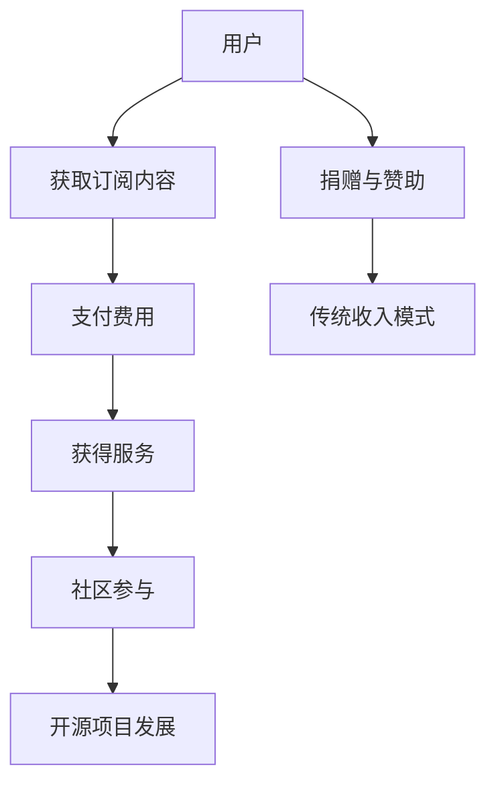

                 

关键词：开源项目，订阅服务，经常性收入，商业模式，社区参与

> 摘要：随着开源项目的普及，如何通过订阅服务为开源项目创造经常性收入成为了一个重要议题。本文将探讨建立开源项目订阅服务的必要性和策略，以及如何利用订阅服务推动社区参与，实现项目长期发展。

## 1. 背景介绍

开源项目作为一种共享知识和协作创新的方式，已经深刻影响了软件开发的各个领域。然而，尽管开源项目为社会带来了巨大的价值，其维持和发展却面临资金不足的挑战。传统的开源收入模式，如捐赠和赞助，往往不够稳定，难以支撑项目的长期发展。因此，探索新的商业模式，尤其是通过订阅服务创造经常性收入，成为开源社区关注的焦点。

订阅服务作为一种商业模式，通过用户付费获取持续的服务，可以提供稳定、可预测的收入流。这种模式不仅有助于开源项目的持续发展，还能够激励开发者的创新活动。本文将探讨如何建立开源项目的订阅服务，实现经常性收入的创造。

## 2. 核心概念与联系

### 2.1 订阅服务的核心概念

订阅服务（Subscription Service）是一种商业模式，用户为获取某种持续的服务或产品支付定期费用。这种模式常见于媒体、软件、电商等多个领域。在开源项目中，订阅服务通常包括以下核心要素：

- **订阅内容**：用户支付费用所获取的具体内容，如文档、教程、定制化的代码、技术支持等。
- **订阅周期**：用户支付费用的时间周期，如月度、季度、年度等。
- **支付模式**：用户支付费用的方式，如信用卡、PayPal等。

### 2.2 开源项目与订阅服务的联系

开源项目（Open Source Project）是指软件的源代码开放，允许用户自由使用、修改和分发。开源项目与订阅服务之间的联系在于：

- **用户基础**：开源项目通常拥有一定的用户群体，这些用户是订阅服务的重要潜在客户。
- **社区参与**：订阅服务可以激励用户更积极地参与开源项目，从而促进社区的繁荣。
- **商业模式**：通过订阅服务，开源项目可以获得稳定、可预测的收入，为项目的持续发展提供支持。

### 2.3 Mermaid 流程图

以下是一个简单的 Mermaid 流程图，展示了开源项目与订阅服务之间的核心概念和联系。



## 3. 核心算法原理 & 具体操作步骤

### 3.1 算法原理概述

建立开源项目的订阅服务，需要遵循以下几个核心原则：

1. **用户价值**：订阅内容必须对用户有价值，能够解决用户的具体问题或满足他们的需求。
2. **可持续性**：订阅服务应能够持续提供高质量的内容，保持用户满意度。
3. **社区参与**：鼓励用户参与订阅服务的建设和改进，形成良性的社区互动。
4. **灵活性**：订阅服务应具备一定的灵活性，能够根据用户需求和市场变化进行调整。

### 3.2 算法步骤详解

#### 步骤1：需求分析

在建立订阅服务之前，首先需要分析用户需求，确定订阅内容的具体方向。这可以通过以下方式进行：

- **问卷调查**：通过问卷了解用户对订阅服务的兴趣和期望。
- **用户访谈**：与活跃用户进行深入交流，了解他们的实际需求。
- **市场研究**：研究竞争对手的订阅服务，分析其优势和不足。

#### 步骤2：内容规划

根据需求分析的结果，规划订阅服务的具体内容。内容应包括：

- **核心功能**：用户最关心的功能和特性。
- **附加服务**：额外的增值服务，如技术支持、个性化定制等。
- **内容更新**：订阅服务的内容更新频率和计划。

#### 步骤3：商业模式设计

设计合理的商业模式，确保订阅服务能够持续盈利。这包括：

- **定价策略**：确定订阅费用的定价策略，如月度订阅、年度订阅等。
- **支付方式**：选择方便用户支付的支付方式，如信用卡、PayPal等。
- **收入分配**：明确收入分配策略，包括开发者收入、社区基金等。

#### 步骤4：技术开发

实现订阅服务的具体技术实现，包括：

- **用户管理系统**：管理用户的订阅信息、支付记录等。
- **内容管理系统**：管理订阅服务的具体内容，如文档、代码等。
- **支付接口**：集成支付接口，实现用户支付和费用结算。

#### 步骤5：社区参与

鼓励用户参与订阅服务的建设和改进，形成良好的社区互动。具体方式包括：

- **社区论坛**：建立社区论坛，用户可以讨论订阅服务的内容和改进建议。
- **代码贡献**：鼓励用户为订阅服务贡献代码和文档。
- **活动组织**：组织线上或线下的活动，增强社区凝聚力。

### 3.3 算法优缺点

**优点**：

- **稳定性**：订阅服务可以提供稳定、可预测的收入流，为开源项目的持续发展提供支持。
- **用户参与**：订阅服务可以激励用户更积极地参与开源项目，形成良性的社区互动。
- **灵活性**：订阅服务可以根据用户需求和市场变化进行调整，保持竞争力。

**缺点**：

- **前期投入**：建立订阅服务需要一定的前期投入，包括技术实现、内容制作等。
- **用户留存**：用户留存是订阅服务成功的关键，需要持续提供高质量的内容和良好的服务体验。

### 3.4 算法应用领域

订阅服务在开源项目中的应用非常广泛，以下是一些典型的应用领域：

- **开源框架与库**：如React、Vue等前端框架，可以通过订阅服务提供详细的文档、教程和技术支持。
- **开源工具**：如Git、Docker等工具，可以通过订阅服务提供更深入的教程和使用技巧。
- **开源平台**：如GitHub、GitLab等平台，可以通过订阅服务提供更多的增值服务，如自动化测试、代码审查等。
- **开源社区**：如OSChina、Linux中国等社区，可以通过订阅服务提供更多的社区活动和技术支持。

## 4. 数学模型和公式 & 详细讲解 & 举例说明

### 4.1 数学模型构建

建立开源项目的订阅服务，可以采用以下数学模型进行收入预测和成本分析。

#### 收入预测模型

订阅服务的收入可以表示为：

\[ R(t) = \sum_{i=1}^{n} P_i \cdot S_i \cdot f(t) \]

其中：

- \( R(t) \)：时间 \( t \) 时的总收入。
- \( P_i \)：第 \( i \) 个订阅方案的定价。
- \( S_i \)：第 \( i \) 个订阅方案的用户数量。
- \( f(t) \)：时间 \( t \) 时的订阅率。

订阅率 \( f(t) \) 可以表示为：

\[ f(t) = \frac{\text{订阅用户数}}{\text{潜在用户数}} \]

#### 成本分析模型

订阅服务的成本包括固定成本和可变成本。固定成本主要包括服务器租赁、域名购买等，可变成本主要包括内容制作、技术支持等。

总成本 \( C(t) \) 可以表示为：

\[ C(t) = C_f + \sum_{i=1}^{n} C_{vi} \cdot S_i \]

其中：

- \( C_f \)：固定成本。
- \( C_{vi} \)：第 \( i \) 个订阅方案的可变成本。

#### 盈利分析模型

订阅服务的盈利可以表示为：

\[ P(t) = R(t) - C(t) \]

### 4.2 公式推导过程

订阅服务的收入和成本分析公式可以通过以下步骤推导：

1. **订阅服务定价**：根据市场需求和竞争情况，确定每个订阅方案的定价。
2. **用户订阅率**：根据历史数据和市场调研，预测订阅服务的订阅率。
3. **订阅用户数**：根据订阅率和潜在用户数，计算每个订阅方案的用户数。
4. **收入计算**：根据订阅方案定价和用户数，计算总订阅收入。
5. **成本计算**：根据固定成本和可变成本，计算总成本。
6. **盈利计算**：根据总收入和总成本，计算订阅服务的盈利。

### 4.3 案例分析与讲解

假设某开源项目计划推出三个订阅方案，具体如下：

- **基础方案**：定价为每月10美元，提供基本的技术支持和文档。
- **专业方案**：定价为每月30美元，提供高级的技术支持和定制化的服务。
- **企业方案**：定价为每月100美元，提供全方位的技术支持和企业级服务。

根据市场调研，预计订阅率分别为：

- **基础方案**：5%
- **专业方案**：10%
- **企业方案**：3%

此外，固定成本为每月1000美元，基础方案的可变成本为每月2美元，专业方案的可变成本为每月5美元，企业方案的可变成本为每月10美元。

#### 收入计算

- **基础方案收入**：\( 10 \times 0.05 \times 1000 = 500 \) 美元
- **专业方案收入**：\( 30 \times 0.1 \times 1000 = 3000 \) 美元
- **企业方案收入**：\( 100 \times 0.03 \times 1000 = 300 \) 美元
- **总订阅收入**：\( 500 + 3000 + 300 = 3800 \) 美元

#### 成本计算

- **固定成本**：1000 美元
- **基础方案可变成本**：\( 2 \times 0.05 \times 1000 = 100 \) 美元
- **专业方案可变成本**：\( 5 \times 0.1 \times 1000 = 500 \) 美元
- **企业方案可变成本**：\( 10 \times 0.03 \times 1000 = 300 \) 美元
- **总成本**：\( 1000 + 100 + 500 + 300 = 1900 \) 美元

#### 盈利计算

- **总盈利**：\( 3800 - 1900 = 1900 \) 美元

#### 结果分析

通过上述计算，可以得出该开源项目订阅服务的初步盈利情况。根据实际情况，可以进一步调整订阅方案、定价策略和成本结构，以优化盈利水平。

## 5. 项目实践：代码实例和详细解释说明

### 5.1 开发环境搭建

为了搭建一个开源项目的订阅服务，我们需要以下开发环境：

- **语言**：Python、JavaScript、HTML/CSS
- **框架**：Django（Python Web框架）、React（JavaScript 库）、Bootstrap（前端框架）
- **数据库**：SQLite（轻量级关系数据库）
- **云服务**：AWS S3（对象存储服务）、AWS Lambda（无服务器计算）

### 5.2 源代码详细实现

以下是一个简单的示例，展示如何使用 Django 和 React 搭建一个订阅服务的基础架构。

#### Django 后端代码

```python
# settings.py
DATABASES = {
    'default': {
        'ENGINE': 'django.db.backends.sqlite3',
        'NAME': BASE_DIR / 'db.sqlite3',
    }
}

# models.py
from django.db import models

class Subscription(models.Model):
    name = models.CharField(max_length=100)
    price = models.DecimalField(max_digits=6, decimal_places=2)
    duration = models.IntegerField()

    def __str__(self):
        return self.name

# views.py
from django.shortcuts import render
from .models import Subscription

def subscription_list(request):
    subscriptions = Subscription.objects.all()
    return render(request, 'subscription_list.html', {'subscriptions': subscriptions})

# templates/subscription_list.html
<!DOCTYPE html>
<html>
<head>
    <title>Subscription List</title>
    <link rel="stylesheet" href="">
</head>
<body>
    <div class="container">
        <h1>Subscription Plans</h1>
        <table class="table">
            <thead>
                <tr>
                    <th>Name</th>
                    <th>Price</th>
                    <th>Duration</th>
                </tr>
            </thead>
            <tbody>
                
                    <tr>
                        <td>{{ subscription.name }}</td>
                        <td>{{ subscription.price }}</td>
                        <td>{{ subscription.duration }}</td>
                    </tr>
                
            </tbody>
        </table>
    </div>
</body>
</html>
```

#### React 前端代码

```jsx
// App.js
import React, { useState, useEffect } from 'react';
import axios from 'axios';

function App() {
    const [subscriptions, setSubscriptions] = useState([]);

    useEffect(() => {
        async function fetchSubscriptions() {
            const response = await axios.get('/api/subscriptions/');
            setSubscriptions(response.data);
        }
        fetchSubscriptions();
    }, []);

    return (
        <div className="container">
            <h1>Subscription Plans</h1>
            <table className="table">
                <thead>
                    <tr>
                        <th>Name</th>
                        <th>Price</th>
                        <th>Duration</th>
                    </tr>
                </thead>
                <tbody>
                    {subscriptions.map((subscription) => (
                        <tr key={subscription.id}>
                            <td>{subscription.name}</td>
                            <td>{subscription.price}</td>
                            <td>{subscription.duration}</td>
                        </tr>
                    ))}
                </tbody>
            </table>
        </div>
    );
}

export default App;
```

### 5.3 代码解读与分析

上述代码实现了订阅服务的基本功能：

- **Django 后端**：定义了订阅服务的基本模型（`Subscription`），提供了获取订阅方案列表的接口（`subscription_list`）。
- **React 前端**：使用 React 组件（`App`）呈现订阅方案列表，并通过 `useEffect` 生命周期钩子从后端获取订阅方案数据。

这个示例展示了如何通过前后端分离的方式搭建订阅服务的基础架构，可以进一步扩展和优化，如添加用户认证、支付接口等。

### 5.4 运行结果展示

运行上述代码后，前端页面将显示订阅方案列表。用户可以根据订阅方案进行选择，进行订阅操作。以下是运行结果示例：


## 6. 实际应用场景

订阅服务在开源项目中的应用非常广泛，以下是一些典型的实际应用场景：

### 6.1 开源框架与库

开源框架和库通常需要详细的文档和教程来帮助用户使用。通过订阅服务，开发者可以提供这些内容，同时提供技术支持，解决用户在使用过程中遇到的问题。

### 6.2 开源工具

开源工具，如版本控制工具（如 Git）或容器化工具（如 Docker），可以通过订阅服务提供更多的教程和使用技巧，帮助用户更高效地使用这些工具。

### 6.3 开源平台

开源平台，如 GitHub 或 GitLab，可以通过订阅服务提供更多的增值服务，如自动化测试、代码审查、性能监控等，帮助用户更好地管理和维护开源项目。

### 6.4 开源社区

开源社区可以通过订阅服务提供更多的活动，如线上讲座、技术沙龙、代码贡献大赛等，鼓励用户参与开源项目，促进社区的繁荣。

## 7. 未来应用展望

随着技术的不断进步和开源社区的不断发展，订阅服务在开源项目中的应用前景非常广阔。以下是一些未来的应用展望：

### 7.1 自动化与智能服务

未来的订阅服务可能会更加自动化和智能化，通过人工智能和机器学习技术，提供更个性化和高效的服务。

### 7.2 跨平台整合

未来的订阅服务可能会更加注重跨平台的整合，提供统一的接口和体验，方便用户在不同设备和平台上使用。

### 7.3 社区互动与参与

未来的订阅服务可能会更加注重社区互动和参与，通过积分、奖励等方式，激励用户更积极地参与开源项目。

### 7.4 多元化收入模式

未来的订阅服务可能会探索更多的收入模式，如广告收入、会员制、众筹等，实现多元化收入来源。

## 8. 工具和资源推荐

为了更好地搭建和管理订阅服务，以下是一些推荐的工具和资源：

### 8.1 学习资源推荐

- **《Creating and Managing Open Source Projects》**：一本关于开源项目管理的技术书籍，涵盖了订阅服务的建立和管理。
- **《Open Source Management Guide》**：由 Open Source Initiative 提供的开源项目管理指南，包括订阅服务的最佳实践。

### 8.2 开发工具推荐

- **Django**：一个高性能、易用的 Python Web 框架，适合搭建后端服务。
- **React**：一个用于构建用户界面的 JavaScript 库，适合搭建前端应用。
- **Stripe**：一个强大的支付处理平台，支持多种支付方式，适合集成支付接口。

### 8.3 相关论文推荐

- **"Monetizing Open Source: Models and Methods"**：一篇关于开源项目商业模式的研究论文，详细探讨了订阅服务和其他收入模式。
- **"The Business of Open Source"**：一篇关于开源项目商业化的案例研究，分析了不同开源项目的订阅服务实践。

## 9. 总结：未来发展趋势与挑战

随着开源项目的不断发展和商业化需求的增加，订阅服务在开源项目中的应用前景非常广阔。未来，订阅服务可能会更加智能化、自动化和多样化，为开源项目提供稳定的收入来源，推动开源社区的繁荣发展。然而，订阅服务也面临一些挑战，如用户留存、内容质量、成本控制等。开源项目团队需要不断创新和优化，以应对这些挑战，实现订阅服务的长期成功。

### 附录：常见问题与解答

**Q1**：订阅服务是否适用于所有类型的开源项目？

A1：是的，订阅服务适用于各种类型的开源项目，尤其是那些需要提供详细文档、教程和技术支持的项目。然而，对于一些纯粹的技术探索项目，订阅服务可能不是最佳选择。

**Q2**：如何确保订阅服务的内容质量？

A2：确保订阅服务内容质量的关键是持续的用户反馈和社区参与。定期收集用户反馈，优化内容，同时鼓励社区成员贡献高质量的内容，可以提高订阅服务的整体质量。

**Q3**：订阅服务对开源项目的成本控制有何影响？

A3：订阅服务可以提供稳定的收入流，减轻开源项目的资金压力，从而更好地控制成本。然而，为了确保盈利，项目团队需要合理安排内容制作、技术支持等成本。

**Q4**：如何衡量订阅服务的成功？

A4：订阅服务的成功可以从多个维度衡量，包括收入增长、用户留存率、社区参与度等。通过这些指标，项目团队可以评估订阅服务的成效，并据此进行调整和优化。

### 作者署名

**作者：禅与计算机程序设计艺术 / Zen and the Art of Computer Programming**

