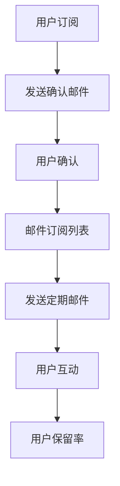

                 

关键词：邮件订阅，粉丝互动，用户保留，电子邮件营销，营销自动化，技术博客，IT内容创作

> 摘要：本文旨在探讨如何通过建立邮件订阅列表，利用电子邮件营销工具，与粉丝保持长期互动，提升用户保留率和品牌忠诚度。我们将分析核心概念、算法原理、数学模型以及实际应用场景，并通过具体代码实例进行讲解，为IT领域的专业人士提供全面的指导。

## 1. 背景介绍

在当今信息爆炸的时代，内容创作者面临的挑战是如何吸引并保持粉丝群体的关注。传统的社交媒体平台虽然提供了广泛的曝光机会，但用户注意力分散，信息传播效果受到限制。与此同时，电子邮件作为一种传统且有效的通信方式，仍然在营销领域中扮演着重要角色。建立邮件订阅列表，不仅能够提高用户参与度，还能有效地促进粉丝与内容创作者之间的长期互动。

### 电子邮件营销的重要性

电子邮件营销具有以下优势：

1. **高到达率**：相比于社交媒体，电子邮件能够更直接地触达用户。
2. **个性化**：通过邮件订阅列表，可以针对不同用户群体发送个性化的内容。
3. **高转化率**：有效的邮件营销能够提升用户的转化率，促进销售和品牌忠诚度。

### 用户保留与粉丝互动

建立邮件订阅列表的一个关键目标就是保持用户活跃，提升用户保留率。通过定期发送有价值的内容，与粉丝保持互动，可以增强用户对品牌的认同感和忠诚度。

## 2. 核心概念与联系

为了更好地理解如何建立邮件订阅列表，我们需要了解以下几个核心概念：

1. **邮件订阅列表**：这是一个包含用户电子邮件地址的数据库，用于发送定期更新的内容。
2. **双确认订阅**：用户在订阅邮件列表时需要通过点击确认链接来验证邮箱的有效性，以防止垃圾邮件收集。
3. **邮件营销工具**：这些工具可以帮助自动化邮件发送、用户分组、内容定制等操作。

### 架构图

以下是一个简单的邮件订阅系统架构图，展示了各组件之间的关联：



## 3. 核心算法原理 & 具体操作步骤

### 3.1 算法原理概述

邮件订阅列表的建立主要基于以下几个步骤：

1. **用户获取**：通过网站、社交媒体或其他渠道收集潜在用户的电子邮件地址。
2. **双确认订阅**：发送包含确认链接的邮件，用户点击后完成订阅。
3. **邮件发送**：根据用户行为和偏好，定制化发送邮件内容。
4. **用户互动**：鼓励用户回复邮件，进行反馈和互动。

### 3.2 算法步骤详解

1. **用户获取**：
   - 在网站上提供订阅表单，要求用户填写电子邮件地址。
   - 利用社交媒体广告或推广活动，吸引潜在用户订阅。

2. **双确认订阅**：
   - 当用户提交电子邮件地址后，系统自动发送一封确认邮件。
   - 确认邮件包含一个唯一的确认链接，用户点击后完成订阅。

3. **邮件发送**：
   - 根据用户的行为和偏好，将用户分组。
   - 利用邮件营销工具，定期发送定制化的邮件内容。

4. **用户互动**：
   - 鼓励用户回复邮件，提供反馈。
   - 通过问卷调查、互动活动等方式，增加用户参与度。

### 3.3 算法优缺点

**优点**：

- **高效性**：自动化工具能够高效管理大量邮件发送。
- **个性化**：根据用户行为和偏好定制化邮件内容，提高邮件相关性。
- **低成本**：相对于其他营销渠道，电子邮件营销成本较低。

**缺点**：

- **打开率**：由于垃圾邮件的泛滥，用户对邮件的打开率可能较低。
- **响应时间**：邮件发送后需要一定时间才能获得用户的反馈。

### 3.4 算法应用领域

邮件订阅列表在以下领域具有广泛应用：

- **内容创作者**：通过邮件与粉丝保持互动，提升用户保留率。
- **电子商务**：发送促销邮件，提升销售额。
- **客户关系管理**：通过定期邮件，保持与客户的长久联系。

## 4. 数学模型和公式 & 详细讲解 & 举例说明

### 4.1 数学模型构建

邮件订阅列表的建立涉及到以下几个关键指标：

1. **订阅率**：新用户订阅邮件列表的比例。
2. **打开率**：用户打开邮件的比例。
3. **点击率**：用户点击邮件链接的比例。
4. **转化率**：点击邮件链接后完成转化的比例。

### 4.2 公式推导过程

以下是一个简单的数学模型，用于评估邮件订阅列表的效果：

$$
效果指标 = \frac{订阅率 \times 打开率 \times 点击率 \times 转化率}{1000}
$$

其中，订阅率、打开率、点击率和转化率均为百分比。

### 4.3 案例分析与讲解

假设某技术博客的邮件订阅列表共有1000个用户，一个月内发送了10封邮件。以下是相关数据的假设：

- **订阅率**：5%
- **打开率**：20%
- **点击率**：10%
- **转化率**：5%

根据上述公式，计算该博客的邮件订阅列表效果指标：

$$
效果指标 = \frac{5\% \times 20\% \times 10\% \times 5\%}{1000} = 0.00125
$$

这意味着，平均每个订阅用户在该月的邮件订阅列表中的效果指标为0.00125。

## 5. 项目实践：代码实例和详细解释说明

### 5.1 开发环境搭建

为了搭建邮件订阅系统，我们可以选择以下技术栈：

- **后端**：使用Node.js和Express框架。
- **前端**：使用React或Vue.js框架。
- **邮件服务**：使用SendGrid或Mailgun等第三方邮件服务提供商。

### 5.2 源代码详细实现

以下是一个简单的Node.js后端代码实例，用于处理用户订阅请求：

```javascript
const express = require('express');
const app = express();
const bodyParser = require('body-parser');

app.use(bodyParser.urlencoded({ extended: true }));

app.post('/subscribe', (req, res) => {
    const { email } = req.body;

    // 添加邮件地址到订阅列表
    // ...

    // 发送确认邮件
    sendConfirmationEmail(email);

    res.send('Subscription successful!');
});

function sendConfirmationEmail(email) {
    // 发送包含确认链接的邮件
    // ...
}

app.listen(3000, () => {
    console.log('Server started on port 3000');
});
```

### 5.3 代码解读与分析

该代码实例使用了Express框架，用于处理HTTP请求。当用户提交订阅请求时，后端会接收电子邮件地址，并将其添加到订阅列表中。然后，系统会发送一封包含确认链接的邮件，用户点击链接后完成订阅。

### 5.4 运行结果展示

运行上述代码后，用户可以通过访问 `http://localhost:3000/subscribe` 并提交电子邮件地址来订阅邮件列表。系统会返回成功订阅的响应，并发送确认邮件。

## 6. 实际应用场景

邮件订阅列表在以下实际应用场景中具有显著效果：

- **内容创作者**：通过邮件与粉丝保持互动，推广新内容和活动。
- **电子商务**：发送促销邮件，提高销售额和客户忠诚度。
- **客户关系管理**：定期发送更新和优惠，保持与客户的长期联系。

### 6.1 内容创作者

内容创作者可以利用邮件订阅列表来：

- **推广新内容**：发送新文章、视频或播客的预告。
- **举办活动**：通过邮件邀请粉丝参与线上或线下活动。
- **反馈征集**：发送问卷调查，了解用户需求和反馈。

### 6.2 电子商务

电子商务平台可以利用邮件订阅列表来：

- **促销活动**：发送限时折扣、优惠券等促销信息。
- **新品推荐**：根据用户购买历史，发送个性化推荐。
- **客户关怀**：发送生日祝福、节日问候等关怀邮件。

### 6.3 客户关系管理

客户关系管理（CRM）系统可以利用邮件订阅列表来：

- **定期更新**：发送公司新闻、产品更新等定期更新。
- **客户关怀**：发送感谢邮件、优惠活动等，提升客户满意度。
- **反馈征集**：发送满意度调查，了解客户需求和意见。

## 7. 工具和资源推荐

### 7.1 学习资源推荐

- **《电子邮件营销实战：策略与技巧》**：本书提供了全面的电子邮件营销策略和实践技巧。
- **Mailchimp Documentation**：Mailchimp 提供了丰富的文档和教程，适用于邮件订阅和营销自动化。

### 7.2 开发工具推荐

- **SendGrid**：提供强大的邮件发送和自动化功能。
- **Mailgun**：适用于需要发送大量邮件的应用程序。

### 7.3 相关论文推荐

- **"Email Marketing as a Driver of Consumer Behavior"**：探讨电子邮件营销对消费者行为的影响。
- **"The Impact of Personalization on Email Marketing Effectiveness"**：研究个性化邮件营销的效果。

## 8. 总结：未来发展趋势与挑战

### 8.1 研究成果总结

随着技术的进步，电子邮件营销在内容和形式上不断升级。个性化、自动化和跨渠道整合成为未来发展的关键趋势。通过深度学习、数据分析和人工智能技术，邮件订阅列表能够更精准地满足用户需求，提高营销效果。

### 8.2 未来发展趋势

- **个性化内容**：基于用户行为和偏好，定制化邮件内容。
- **营销自动化**：利用人工智能和机器学习，实现自动化的邮件发送和用户管理。
- **跨渠道整合**：将电子邮件与其他营销渠道（如社交媒体、短信等）相结合，提高营销效果。

### 8.3 面临的挑战

- **隐私保护**：随着数据保护法规的加强，如何保护用户隐私成为一大挑战。
- **竞争加剧**：随着越来越多的企业采用电子邮件营销，竞争将愈发激烈。

### 8.4 研究展望

未来，邮件订阅列表的发展将更加注重用户体验和隐私保护。通过技术创新，实现更智能、更个性化的邮件营销，将有助于提高用户保留率和品牌忠诚度。

## 9. 附录：常见问题与解答

### 9.1 邮件订阅列表有什么好处？

- **提高用户参与度**：通过定期发送有价值的内容，与用户保持互动。
- **增强品牌忠诚度**：定期更新和关怀邮件，提升用户对品牌的认同感。
- **降低营销成本**：相对于其他营销渠道，电子邮件营销成本较低。

### 9.2 如何提高邮件订阅列表的打开率？

- **个性化标题**：编写引人注目的邮件标题，吸引用户打开。
- **优化邮件内容**：提供有价值、相关的内容，提高邮件打开后的阅读率。
- **定期发送**：保持一定的发送频率，避免用户遗忘。

### 9.3 如何确保邮件不被视为垃圾邮件？

- **遵守邮件发送规范**：遵循相关法规和标准，避免发送垃圾邮件。
- **双确认订阅**：确保用户自愿订阅，提高邮件送达率。
- **优化邮件内容**：避免使用垃圾邮件常见的词汇和格式。

---

作者：禅与计算机程序设计艺术 / Zen and the Art of Computer Programming
----------------------------------------------------------------

---

请注意，文章中的代码实例和公式仅作为示例，实际应用时可能需要根据具体情况进行调整。本文旨在提供关于建立邮件订阅列表的全面指南，为IT专业人士和内容创作者提供参考。希望这篇文章能够帮助您更好地理解邮件订阅列表的建立和管理，从而提高用户参与度和品牌忠诚度。如果您有任何问题或建议，欢迎在评论区留言。感谢您的阅读！


